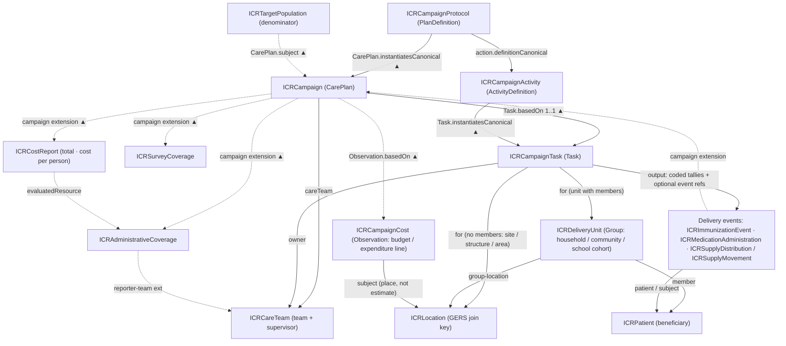

### Integrated Campaign Registry (ICR) Implementation Guide

Health campaigns are expensive, and they are essential for reaching people that routine
services miss. Many campaigns return to the same districts every year, often with the
same teams. Each one maps places, registers households, sets a target population, and
counts who was reached. Today most of that data stays with the campaign that collected
it, and the next campaign starts again from zero.

The Integrated Campaign Registry (ICR) is an open data standard for storing and
integrating data across health campaigns: immunization, polio, NTD mass drug
administration, malaria, vitamin A, and others. It gives countries one structured place
to keep their campaign data, so each campaign can build on the last. Data from one round
can be reused to plan the next, and results can be compared across campaigns,
programmes, and countries.

This Implementation Guide (IG) is the technical core of the ICR. It defines the shared
data model and vocabulary for campaigns in **HL7 FHIR R4**. The open-source ICR
reference solution stores data in this format and connects it to the tools countries
already use, such as ODK, DHIS2, and CommCare.

This guide is written for implementers who know the basics of FHIR (resources,
references, profiles, extensions, search) but are not FHIR specialists.

#### What this guide is for

The IG is designed so that campaign data can:

- **Use one model for every kind of campaign.** Immunization, mass drug administration,
  bed net distribution, indoor residual spraying, and supplementation campaigns all use
  the same resources. Campaigns differ mainly in how teams deliver (fixed post,
  house-to-house, school, mobile), and the model records that as a coded delivery
  strategy.
- **Carry forward from one round to the next.** Places, households, communities, teams,
  and their assigned areas are stored as lasting records. The next round can plan from
  last round's lists instead of re-enumerating.
- **Support defensible denominators.** Census, WorldPop, administrative, and last-round
  figures are kept side by side, each with its source, date, and area, so planners can
  choose a target population and show where it came from.
- **Produce coverage that compares across campaigns.** Coverage is calculated with
  shared `Measure` definitions against those denominators. Administrative and survey
  coverage are kept separate.
- **Show what is planned where.** Every campaign has a geography, dates, and status, and
  can be found by searching on a place. Programmes can see when two campaigns are
  heading for the same area.
- **Flow between existing tools without custom mapping.** Shared code systems, value
  sets, and FHIR `Questionnaire` forms let data collected in ODK, DHIS2, or CommCare
  load into the registry. SQL-on-FHIR views turn the data into flat tables for analytics
  and reporting.
- **Connect campaigns to routine care.** Campaign doses use the same FHIR resources as
  routine immunization and treatment records, and are flagged as campaign or routine.
  The IG is built with the WHO SMART Guidelines toolchain and aligned with the SMART
  Immunizations guideline.

#### Key resources

FHIR has no `Campaign` resource, so the IG adapts standard FHIR resources with profiles.
The main ones, grouped by what they are used for:

**Planning a campaign**

| Profile | FHIR resource | What it represents |
|---|---|---|
| [ICRCampaignProtocol](StructureDefinition-ICRCampaignProtocol.html) | `PlanDefinition` | A reusable campaign design, such as "MR follow-up SIA, children 9–59 months" |
| [ICRCampaignActivity](StructureDefinition-ICRCampaignActivity.html) | `ActivityDefinition` | One intervention within a protocol, such as a measles dose or an albendazole tablet |
| [ICRCampaign](StructureDefinition-ICRCampaign.html) | `CarePlan` | One campaign round in a specific area and period. It starts as the microplan and becomes the record of what happened |
| [ICRTargetPopulation](StructureDefinition-ICRTargetPopulation.html) | `Group` | A target population estimate (denominator) for a place, with its source and date |

**Places, people, and teams**

| Profile | FHIR resource | What it represents |
|---|---|---|
| [ICRLocation](StructureDefinition-ICRLocation.html) | `Location` | Administrative areas, facilities, settlements, dwellings, and service points, with their hierarchy and boundaries |
| [ICRDeliveryUnit](StructureDefinition-ICRDeliveryUnit.html) | `Group` | A household, community, or school class that teams visit |
| [ICRPatient](StructureDefinition-ICRPatient.html) | `Patient` | A beneficiary: a person who receives an intervention |
| [ICRCareTeam](StructureDefinition-ICRCareTeam.html) | `CareTeam` | A vaccination or distribution team and its supervisor |

**Delivering the campaign**

| Profile | FHIR resource | What it represents |
|---|---|---|
| [ICRCampaignTask](StructureDefinition-ICRCampaignTask.html) | `Task` | One unit of field work, such as a session at a post or a visit to a household, with its delivery strategy and tallies |
| [ICRImmunizationEvent](StructureDefinition-ICRImmunizationEvent.html) | `Immunization` | A vaccine dose given during a campaign |
| [ICRMedicationAdministration](StructureDefinition-ICRMedicationAdministration.html) | `MedicationAdministration` | A drug given during a campaign, such as a deworming tablet |
| [ICRSupplyDistribution](StructureDefinition-ICRSupplyDistribution.html) | `SupplyDelivery` | Items handed out to households or communities, such as bed nets |
| [ICRCampaignFormResponse](StructureDefinition-ICRCampaignFormResponse.html) | `QuestionnaireResponse` | A completed campaign form, such as a readiness or supervision checklist |

**Measuring results**

| Profile | FHIR resource | What it represents |
|---|---|---|
| [ICRAdministrativeCoverage](StructureDefinition-ICRAdministrativeCoverage.html) | `MeasureReport` | Coverage from doses counted against the target population |
| [ICRSurveyCoverage](StructureDefinition-ICRSurveyCoverage.html) | `MeasureReport` | Coverage estimated from a post-campaign survey |

The [Artifacts](artifacts.html) page lists everything in the guide, including profiles
for supply movements, adverse events, consent, and campaign cost, plus the extensions,
code systems, value sets, and examples.

#### How the pieces fit together

A campaign protocol is a template. Each time it is run in a place, it becomes a
campaign (`CarePlan`) whose subject is the target population for that area. Field teams
carry out tasks against households, communities, or sites, and each task records what
the visit produced. Individual doses and distributions are recorded as delivery events.
Coverage reports compare what was delivered with the target population.

Every task, delivery event, and report points to its campaign. The campaign itself does
not need to be updated as field data arrives, and a server can find everything that
belongs to a campaign by searching for records that reference it.

Each edge label names the FHIR element that holds the reference. ▲ means the
reference is stored on the resource at the other end of the arrow. For example, the
Task holds `Task.basedOn`, which points to the CarePlan.

#### Alignment with WHO AFRO IDHC

The ICR is the FHIR data layer for the **WHO AFRO Integrated Digitization of Health
Campaigns (IDHC) reference architecture** (WHO:AFRO/ARD:2025-10). The IDHC shared
registries (a georegistry and master lists of administrative boundaries, health
facilities, schools, health workers, households, and beneficiaries) map to `Location`,
`Organization`, `Practitioner` and `CareTeam`, `Group`, and `Patient` in this IG. The
guide uses IDHC terms: a **beneficiary** receives an intervention, an **enumerator**
collects data in the field, a **refusal** is a decline, and the campaign lifecycle runs
through *campaign planning*, *campaign readiness and execution*, and *campaign
monitoring and response*.

#### Status

This is the **v0.1 draft** from Phase 1 of the UNICEF ICR project. It is based on the
ICR working design document (*ICR FHIR Implementation Guide — Campaign Data Model &
Structure*). The [Background](background.html) page covers the design decisions and
open questions. Before pilot use, the guide will be tested against real campaign
datasets and reviewed by the FHIR community (chat.fhir.org, working group calls,
Connectathons).

This draft includes:

- Profiles, extensions, and code systems for the model described above, with examples.
- `Measure` definitions for administrative, survey, MDA treatment, geographic, and
  zero-dose coverage, campaign readiness, and campaign cost.
- `Questionnaire` forms for ESPEN MDA data collection and for readiness and
  supervision checklists.
- A `ConceptMap` from ICR AEFI causality codes to WHO SMART Immunizations (IMMZ) codes.
- SQL-on-FHIR `ViewDefinition`s that turn the FHIR data into flat tables for
  analytics:
  [campaign calendar](ViewDefinition-IcrCampaignCalendar.html),
  [target populations](ViewDefinition-IcrTargetPopulation.html),
  [coverage](ViewDefinition-IcrCoverage.html),
  [coverage strata](ViewDefinition-IcrCoverageStrata.html), and
  [location status](ViewDefinition-IcrLocationStatus.html).

Planned for later drafts: `ViewDefinition`s for delivery events, `ConceptMap`s for
mapping country code lists, and alignment of the `Measure` definitions with WHO JAP,
ICG, and ESPEN reporting requirements.
