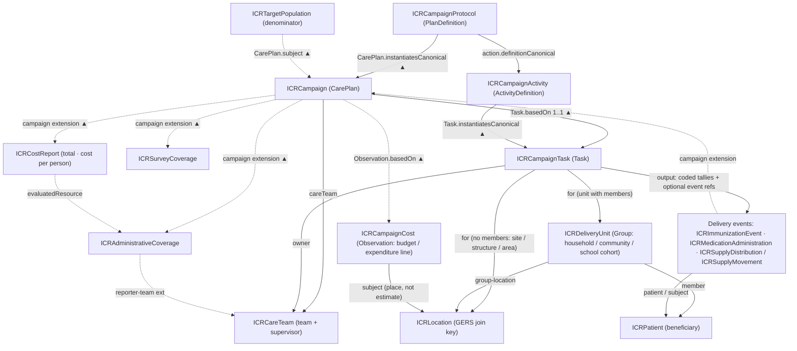

### Integrated Campaign Registry (ICR) Implementation Guide

Public health campaigns — measles–rubella SIAs, polio rounds, NTD mass drug
administration, malaria ITN/IRS, vitamin A supplementation — repeatedly target **the
same communities and the same beneficiaries**, yet each program re-maps the same
villages, re-registers the same households, and re-estimates the same denominators
every round. The ICR inverts this: each campaign becomes a contributor to a
**cumulative, reusable corpus of public health intelligence**, so that data collection
cost compounds across programs and over time.

This Implementation Guide is the "DNA" of that registry. It defines how campaign
semantics — protocols, microplans, denominators, households, delivery events,
coverage — are expressed in **HL7 FHIR R4**, so that interchangeable open-source
components (data collection, transformation, FHIR store, data quality, geospatial
microplanning, analytics) can share one model.

The IG is the FHIR data layer of the **WHO AFRO Integrated Digitization of Health
Campaigns (IDHC) reference architecture** (WHO:AFRO/ARD:2025-10): its shared data
registries — the **georegistry** and master lists (administrative boundaries, health
facilities, schools, health workers, households, **beneficiaries**) and the
**terminology list(s)** — are ICR Location, Practitioner/CareTeam, Group, Patient,
and the IG's code systems, and its content standards (FHIR Questionnaire for data
collection forms, FHIR-based aggregate reporting) are how the ICR ships forms and
coverage. IDHC vocabulary is used throughout: the person receiving an intervention
is a **beneficiary** (the FHIR resource is `Patient` by necessity, but human-facing
language never is), the front-line data collector is an **enumerator**, declines are
**refusals**, and the campaign lifecycle follows the IDHC phases — *campaign
planning*, *campaign readiness and execution*, *campaign monitoring and response*.

#### The architecture in one paragraph

FHIR has no native `Campaign` resource, so the IG profiles existing resources —
the same community-validated approach used for households (`Group` + `Location`).
**CarePlan is the keystone**: [ICRCampaignProtocol](StructureDefinition-ICRCampaignProtocol.html)
(`PlanDefinition`) is the reusable campaign protocol; [ICRCampaign](StructureDefinition-ICRCampaign.html)
(`CarePlan`) is a specific execution that begins as a microplan and evolves into the
execution record; [ICRCampaignTask](StructureDefinition-ICRCampaignTask.html) (`Task`)
is the operational unit — one per site-session or per household, community, or
school-cohort visit — carrying the coded
**delivery strategy**, with everything the visit produced (tallies, reasons,
event references) as coded `Task.output` entries; the delivery events —
[ICRImmunizationEvent](StructureDefinition-ICRImmunizationEvent.html),
[ICRMedicationAdministration](StructureDefinition-ICRMedicationAdministration.html), and
the supply pair [ICRSupplyDistribution](StructureDefinition-ICRSupplyDistribution.html) /
[ICRSupplyMovement](StructureDefinition-ICRSupplyMovement.html) — each carry their own
campaign link (the [`campaign` extension](StructureDefinition-campaign.html)) and are permanently
flagged **campaign vs routine** (`record-origin`). [ICRDeliveryUnit](StructureDefinition-ICRDeliveryUnit.html)
(`Group` — a household, a community, or a school cohort, the generalized Group + Location pattern) and
[ICRTargetPopulation](StructureDefinition-ICRTargetPopulation.html) (`Group`) carry
people and denominators — every estimate with **source, date provenance, and a
computable geographic scope** — and
[ICRLocation](StructureDefinition-ICRLocation.html) carries the administrative
hierarchy and **geospatial identity**, with Overture Maps **GERS IDs** as the
cross-campaign join key alongside P-codes and national codes. Administrative and
survey coverage are **separate, never-merged lineages**
([ICRAdministrativeCoverage](StructureDefinition-ICRAdministrativeCoverage.html),
[ICRSurveyCoverage](StructureDefinition-ICRSurveyCoverage.html)).
Campaign **cost** is a first-class record too (cost-v1):
[ICRCampaignCost](StructureDefinition-ICRCampaignCost.html) (`Observation`) holds
budget and expenditure **line items** that point at the round and are attributed to a
place, and [ICRCostReport](StructureDefinition-ICRCostReport.html) (`MeasureReport`)
carries the computed total and **cost per person targeted / reached / per dose**,
dividing by the same denominators coverage uses.

Campaign **visibility** — what is planned where, and which campaigns are heading for
the same geography in the same window — is a query, not a report. Two custom
[SearchParameters](artifacts.html#search-parameters) make the geography links searchable:
`CarePlan?target-geography=Location/…` (a campaign's target geography, chainable through
`partof` and reverse-includable from a Location subtree) and `Group?geography=Location/…`
(every target-population estimate scoped to a place). A server that loads the IG answers
"which campaigns touch this district between June and September" with one search.

#### The model at a glance

Edge labels name the FHIR element that carries the reference; ▲ marks edges whose reference runs against the drawn arrow — everything points *at* the campaign, so the CarePlan is never rewritten as tasks and records accumulate.

#### Status

This is the **v0.1 draft** produced in Phase 1 of the UNICEF ICR project. It encodes the design rationale of the ICR working design document
(*ICR FHIR Implementation Guide — Campaign Data Model & Structure*); see
[Background](background.html) for the design decisions and open questions. It will be
revised against real campaign datasets (data conformance testing) and FHIR community
review (chat.fhir.org, working-group calls, Connectathons) before pilot use.

Planned for subsequent drafts: SQL-on-FHIR `ViewDefinition` resources (the portable
analytics layer), `ConceptMap` scaffolds for country code localization, `Consent`
guidance, and `Measure` definitions aligned to WHO JAP / ICG / ESPEN reporting
minimums.
