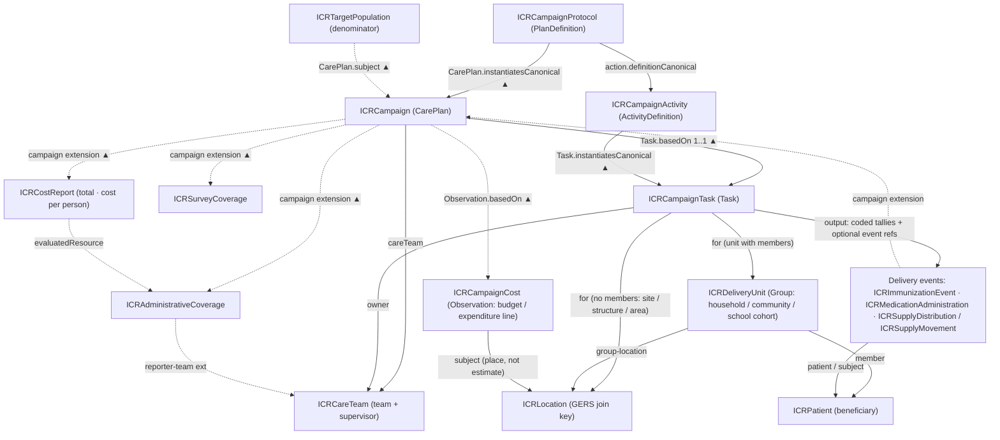

### Integrated Campaign Registry (ICR) Implementation Guide

Public health campaigns (measles–rubella SIAs, polio rounds, NTD mass drug
administration, malaria ITN and IRS campaigns, vitamin A supplementation) often reach
the same communities and the same people. Yet each program usually maps the villages
again, registers the households again, and estimates the target population again every
round. The Integrated Campaign Registry (ICR) is meant to let campaigns reuse that work.
Data collected by one campaign is stored in a shared format so the next campaign, or a
different program, can start from it.

This Implementation Guide (IG) defines that shared format using **HL7 FHIR R4**. It
describes how campaign data (protocols, microplans, target populations, households,
delivery events, coverage, and cost) is represented as FHIR resources. Tools that follow
the guide can exchange data with each other: data collection apps, transformation
pipelines, FHIR servers, data quality tools, geospatial microplanning, and analytics.

This guide is written for implementers who know the basics of FHIR (resources,
references, profiles, extensions, search) but are not FHIR specialists.

#### Relationship to WHO AFRO IDHC

The ICR is the FHIR data layer for the **WHO AFRO Integrated Digitization of Health
Campaigns (IDHC) reference architecture** (WHO:AFRO/ARD:2025-10). IDHC calls for shared
registries: a georegistry and master lists of administrative boundaries, health
facilities, schools, health workers, households, and beneficiaries, plus shared
terminology. In this IG those registries map to `Location`, `Organization`,
`Practitioner` and `CareTeam`, `Group`, `Patient`, and the IG's code systems. IDHC also
calls for FHIR `Questionnaire` for data collection forms and FHIR-based aggregate
reporting, and this IG uses both.

The guide follows IDHC terminology:

- **Beneficiary**: a person who receives an intervention. The FHIR resource is
  `Patient`, but the guide says "beneficiary" in its explanations.
- **Enumerator**: a front-line data collector.
- **Refusal**: a beneficiary or household that declines the intervention.
- **Campaign phases**: *campaign planning*, *campaign readiness and execution*, and
  *campaign monitoring and response*.

#### How a campaign is modeled

FHIR has no `Campaign` resource, so the IG builds one out of existing resources in four
layers:

1. **The protocol.** An [ICRCampaignProtocol](StructureDefinition-ICRCampaignProtocol.html)
   (`PlanDefinition`) describes a type of campaign in general terms, such as "MR
   follow-up SIA, children 9–59 months". It can be reused across countries and rounds.
   Its individual interventions are
   [ICRCampaignActivity](StructureDefinition-ICRCampaignActivity.html)
   (`ActivityDefinition`) resources.
2. **The campaign.** An [ICRCampaign](StructureDefinition-ICRCampaign.html) (`CarePlan`)
   is one actual round of that protocol in one place and time period. It starts as the
   microplan and becomes the record of what happened. Its `subject` is the target
   population for its reporting area, usually a district. Rounds of the same campaign
   are linked to an umbrella campaign through `partOf`.
3. **The work.** An [ICRCampaignTask](StructureDefinition-ICRCampaignTask.html) (`Task`)
   is one unit of field work: one session at a site, or one visit to a household,
   community, or school. Each Task records the **delivery strategy** used (fixed post,
   mobile, house-to-house, school, and so on). Its results go in `Task.output`: tallies,
   reasons for missed or refused doses, and optionally references to individual
   delivery events.
4. **The delivery events.** These record what each person or household received:
   [ICRImmunizationEvent](StructureDefinition-ICRImmunizationEvent.html) (`Immunization`),
   [ICRMedicationAdministration](StructureDefinition-ICRMedicationAdministration.html)
   (`MedicationAdministration`, for example deworming tablets), and
   [ICRSupplyDistribution](StructureDefinition-ICRSupplyDistribution.html)
   (`SupplyDelivery`, for items handed out such as bed nets). Stock moving between
   stores, facilities, and teams is recorded separately as
   [ICRSupplyMovement](StructureDefinition-ICRSupplyMovement.html), so stock movements
   are not counted as coverage. Each event links to its campaign through the
   [`campaign` extension](StructureDefinition-campaign.html). It is also marked as a
   campaign dose or a routine dose (the `record-origin` extension), so campaign data can
   be combined with routine immunization data and still be told apart.

References point toward the campaign, not away from it. Tasks, events, and reports
each reference the `CarePlan`, so the `CarePlan` does not need to be updated as field
data arrives.

#### Places, people, and target populations

| What it represents | Profile | FHIR resource |
|---|---|---|
| Administrative areas, facilities, settlements, dwellings, and service points, with their hierarchy and map identity | [ICRLocation](StructureDefinition-ICRLocation.html) | `Location` |
| A household, community, or school class that a team visits and whose members are known | [ICRDeliveryUnit](StructureDefinition-ICRDeliveryUnit.html) | `Group` |
| A beneficiary | [ICRPatient](StructureDefinition-ICRPatient.html) | `Patient` |
| A target population estimate (the denominator) for a place | [ICRTargetPopulation](StructureDefinition-ICRTargetPopulation.html) | `Group` |
| A vaccination or drug distribution team and its supervisor | [ICRCareTeam](StructureDefinition-ICRCareTeam.html) | `CareTeam` |
| A health facility as an organization | [ICRFacilityOrganization](StructureDefinition-ICRFacilityOrganization.html) | `Organization` |
| A property of a place that changes over time, such as whether a district is endemic for a disease | [ICRLocationStatus](StructureDefinition-ICRLocationStatus.html) | `Observation` |

A few rules apply across these:

- **Locations use shared identifiers.** Each `Location` can carry an Overture Maps
  **GERS ID** alongside P-codes and national codes. The GERS ID gives different
  campaigns and systems a common key for the same place.
- **Every target population estimate states its source and date.** Censuses, microplan
  headcounts, and modeled estimates often disagree. The IG keeps each estimate as its own
  record, with where it came from, when it was made, and the geographic area it covers,
  so users can see which number a coverage figure was based on.
- **A Task targets a `Group` when it has members, and a `Location` when it does not.**
  A household with registered members is a `Group`. A structure being sprayed in an IRS
  campaign, or a market used as a temporary post, is a `Location`. The
  [Background](background.html) page explains this rule in detail.

#### Coverage and cost

Coverage is reported with `MeasureReport`. Administrative coverage (doses counted
against the target population) and survey coverage (estimated from a post-campaign
survey) use separate profiles,
[ICRAdministrativeCoverage](StructureDefinition-ICRAdministrativeCoverage.html) and
[ICRSurveyCoverage](StructureDefinition-ICRSurveyCoverage.html). The two methods often
give different results and both are needed, so the IG never combines them into one
figure. `Measure` definitions describe how each coverage indicator is calculated.

Campaign cost uses two profiles.
[ICRCampaignCost](StructureDefinition-ICRCampaignCost.html) (`Observation`) is one
budget or expenditure line, linked to a campaign round and a place.
[ICRCostReport](StructureDefinition-ICRCostReport.html) (`MeasureReport`) holds the
totals and the cost per person targeted, per person reached, and per dose. It uses the
same target populations as the coverage reports.

The IG also includes profiles for adverse events following immunization or treatment
([ICRAdverseEvent](StructureDefinition-ICRAdverseEvent.html)), consent and person-data
governance ([ICRConsent](StructureDefinition-ICRConsent.html)), and completed campaign
forms such as readiness and supervision checklists
([ICRCampaignFormResponse](StructureDefinition-ICRCampaignFormResponse.html)).

#### Finding campaigns by place

A common question is which campaigns are planned for a given area and period, so
programs can see overlaps and coordinate. The IG adds two
[search parameters](artifacts.html#behavior-search-parameters) so a FHIR server can
answer this directly:

- `CarePlan?target-geography=Location/…` finds campaigns that target a place. It can
  be chained through `Location.partOf` to include everything below a region.
- `Group?geography=Location/…` finds target population estimates for a place.

For example, "which campaigns cover this district between June and September" is a
single search on a server that has loaded this IG.

Point locations can also carry grid cell codes through the
[spatial-index](StructureDefinition-spatial-index.html) extension (quadkey, H3, or
geohash). Quadkey codes nest by prefix, so `Location?quadkey=0313131` returns every
point inside that map tile without a spatial database.

#### How the resources connect

Each edge label names the FHIR element that holds the reference. ▲ means the
reference is stored on the resource at the other end of the arrow. For example, the
Task holds `Task.basedOn`, which points to the CarePlan.

#### Status

This is the **v0.1 draft** from Phase 1 of the UNICEF ICR project. It is based on the
ICR working design document (*ICR FHIR Implementation Guide — Campaign Data Model &
Structure*). The [Background](background.html) page covers the design decisions and
open questions. Before pilot use, the guide will be tested against real campaign
datasets and reviewed by the FHIR community (chat.fhir.org, working group calls,
Connectathons).

This draft includes:

- Profiles, extensions, and code systems for the model described above, with examples.
- `Measure` definitions for administrative, survey, MDA treatment, geographic, and
  zero-dose coverage, campaign readiness, and campaign cost.
- `Questionnaire` forms for ESPEN MDA data collection and for readiness and
  supervision checklists.
- A `ConceptMap` from ICR AEFI causality codes to WHO SMART Immunizations (IMMZ) codes.
- SQL-on-FHIR `ViewDefinition`s that turn the FHIR data into flat tables for
  analytics:
  [campaign calendar](ViewDefinition-IcrCampaignCalendar.html),
  [target populations](ViewDefinition-IcrTargetPopulation.html),
  [coverage](ViewDefinition-IcrCoverage.html),
  [coverage strata](ViewDefinition-IcrCoverageStrata.html), and
  [location status](ViewDefinition-IcrLocationStatus.html).

Planned for later drafts: `ViewDefinition`s for delivery events, `ConceptMap`s for
mapping country code lists, and alignment of the `Measure` definitions with WHO JAP,
ICG, and ESPEN reporting requirements.
