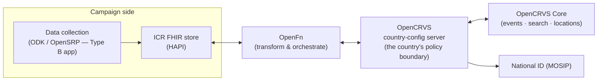

# ICR ↔ CRVS Integration — Findings & Proposal (OpenCRVS)
<sub>`v0.1.1 · Draft findings · Jul 5, 2026`</sub>

> [!note] What this document is
> Research findings and an integration proposal for linking the **ICR FHIR IG** ([[icr-ig]]) to a country's **CRVS** (Civil Registration and Vital Statistics) system, using **OpenCRVS** as the reference CRVS implementation. It covers the CRVS data model and approach, the OpenCRVS interoperability surface, ranked integration use cases, a concrete architecture, and the specific IG extensions the integration would need — all labelled **(proposed)**. Nothing here is committed to the IG.
>
> **Primary fit (per project steer): house-to-house SIA campaigns (Type B)** — the one campaign shape where a worker is at the doorstep with the caregiver, enumerating children person-by-person. That is exactly the contact CRVS systems can never afford to create for themselves.

---

## 1. Why link campaigns to CRVS

**The two systems chase the same missing children.** Birth-registration completeness in ICR's target geographies is often 50–80%; the children missing from the civil register are disproportionately the same children campaigns classify as *zero-dose* — rural, urban-slum, nomadic, cross-border, displaced. A house-to-house SIA is one of the very few state instruments that **physically visits every dwelling** and enumerates children who have never touched the health system or the civil registry. Each side holds what the other lacks:

| Campaigns have | CRVS has |
| --- | --- |
| Doorstep contact with every household, including the unregistered | Legal identity: birth registration number (BRN), certified name/DOB/sex, link to national ID (UIN) |
| Enumerated children with estimated ages (`ICRPatient`) | Authoritative birth dates — the fields campaign eligibility (9m–14y bands) depends on |
| Discovery of unregistered births *and unrecorded deaths* | Registered birth cohorts + crude birth rate per admin area — an independent denominator lineage |
| Repeat rounds that need cross-round person identity | A **stable, lifelong identifier** for exactly the under-5s whose national-ID coverage is weakest |

The last row matters most to the IG: `ICRPatient`'s cross-campaign join key is `nationalId` (preferred) / `registryId` (fallback) — but in most ICR geographies **young children don't have a national ID yet**. The BRN is the identifier that *does* exist (or can be made to exist) for a child, and birth registration is the event that *triggers* NID creation (see the MOSIP pattern, §3.5). CRVS linkage therefore strengthens the registry's own reuse premise, not just a side goal.

**Why house-to-house (Type B) specifically.** Type A (fixed-post) capture is tally-based — no person records, no caregiver conversation, nothing to link. Type C (community MDA) is often register-level. Type B is where the IG's mainline enumeration pattern (`ICRDeliveryUnit.member` → `ICRPatient`, §5.1/§5.4 of [[icr-ig]]) already puts a named child, a caregiver, a dwelling GERS ID, and a worker with a device in the same place at the same time. Every use case below assumes that context; the aggregate fallbacks are noted where they exist.

---

## 2. CRVS in brief — the data model and approach

Before OpenCRVS specifics, the domain model any CRVS integration must respect:

**The vital-event lifecycle.** A civil registration record is not a health record; it is a **legal fact** that moves through a regulated lifecycle:

1. **Notification** — an authorised or informal source (health facility, community, *or a campaign*) reports that a vital event occurred. Partial data, no legal weight. In OpenCRVS this is a record with status `NOTIFIED` sitting in a registrar's workqueue.
2. **Declaration** — an informant (parent, relative) formally declares the event, providing the full legally-required dataset.
3. **Validation & registration** — a **Registrar** (a legal officer, not a clinician) reviews, deduplicates, and registers the event. Registration mints the **registration number** (for births, the BRN) and creates the legal record. This is the step that can trigger NID/UIN creation.
4. **Certification** — a certificate (increasingly a verifiable credential) is issued to the family.
5. **Correction / amendment** — post-registration changes follow their own legal procedure.

Two consequences for ICR: **(a)** a campaign can *notify*, but never *register* — the legal act always stays with the Registrar; the integration hands off, it does not shortcut. **(b)** CRVS records carry legal PII with stricter governance than health data — every read is audited, and the design must assume data minimisation by default.

**Vital statistics & completeness.** The "S" in CRVS: registered events ÷ expected events (from population × crude birth rate) = the **completeness rate**, the KPI civil registries are managed against. OpenCRVS stores yearly population and crude-birth-rate statistics *per administrative area* to compute it. This is structurally the **same denominator problem ICR models** with `ICRTargetPopulation` provenance — and it is why a campaign that measures registration status door-to-door (§4, UC3) is genuinely valuable to the registry: it is an independent field measurement of completeness, exactly analogous to ICR's admin-vs-survey coverage split.

**CRVS as DPI.** OpenCRVS positions the civil registry as foundational Digital Public Infrastructure: the single source of legal life-event data that identity (MOSIP), social protection (via the DCI standard), health, and statistics systems all consume. ICR slots into this picture as a *sectoral* consumer and *feeder* — one more system that reads identity from, and notifies events into, the registry through the same standard mechanisms.

---

## 3. OpenCRVS — architecture and interoperability surface

Everything below is from the OpenCRVS v2.0 documentation (with v1.9 noted where relevant); sources in §9.

### 3.1 The v1 → v2 data-model shift (important for ICR)

- **OpenCRVS v1.x was FHIR-native inside**: records were FHIR Compositions/Patients/Tasks in a FHIR store (Hearth), and a FHIR Location REST API was part of the public surface.
- **OpenCRVS v2.0 is not.** Records are now **config-driven event documents**: an `Event` with a `type` (`v2.birth`, `v2.death`, `v2.marriage`, custom types), a flat `declaration` map whose field ids are defined per country (`child.firstname`, `child.dob`, `child.nid`, …), `legalStatuses` (`DECLARED` / `REGISTERED` with `registrationNumber`), a `trackingId`, flags, and audit metadata. APIs are REST/OpenAPI, Elasticsearch-backed search, plain-JSON locations.

> [!warning] Consequence
> Do **not** design the ICR↔OpenCRVS seam as "FHIR store talks to FHIR store." The seam is a **boundary transformation** between ICR's FHIR resources and OpenCRVS's country-configured event documents. This is squarely the job of the transformation layer ICR already has in its reference stack (**OpenFn**), and the field mapping is inherently **per-country** — which matches the IG's "countries extend the IG" story rather than fighting it.

### 3.2 The integration golden rule: country-config is the boundary

OpenCRVS Core is country-agnostic and has **one integration peer**: the country-owned **country configuration server**. All third-party systems (ICR included) are told to integrate through country config, never against Core directly — it is the trust, policy, audit, and data-shaping boundary, and it insulates integrators from Core upgrades. Auth is OAuth 2.0 client-credentials (system client token) or user JWT, RS256-signed.

### 3.3 Inbound: Event Notification API (the campaign→CRVS channel)

External systems (canonically: health facilities; here: a campaign) submit **full or partial event declarations**:

```
POST /api/events/events                      → initialise event (type: "v2.birth", returns eventId)
POST /api/events/events/notifications        → submit declaration fields (type: "NOTIFY")
```

The record lands with status **`NOTIFIED`**, audited as coming from that client, in the target office's *In Progress / Notifications* workqueue, routed by `createdAtLocation` (an OpenCRVS office/location UUID). A registrar then contacts the family, completes, validates, and registers. Partial payloads are explicitly supported — a notification can be as thin as child name + DOB + place.

### 3.4 Outbound: Action Triggers (the CRVS→campaign channel)

Country config receives an HTTP call from Core on **every record-lifecycle action** — declare, register, approve/reject, print/certify, custom actions — for **all event types**, with the full record, form data, and history. Triggers can also **intercept**: hold an action as *pending* in Core, do external work (the NID validation pattern), then approve or reject it. Core retries webhooks until `2xx`; endpoints must be idempotent. This replaces the v1.x single-webhook mechanism and is the natural place to emit "birth registered in district X" events toward ICR.

### 3.5 The NID/MOSIP pattern (the template ICR should copy)

The flagship OpenCRVS integration is national ID, and its shape is instructive because ICR would sit in the *same seat* as MOSIP does:

- **Birth registered** → (eligibility rules per country) → **UIN creation** in MOSIP; record holds in *Awaiting external validation* until MOSIP confirms.
- **Death registered** → **flag VID/UIN as deceased** (send-and-continue).
- **Corrections** → biographic sync while the child is young.
- **e-Signet / QR identity verification** inside declaration forms, with a Partner-Specific User Token (PSUT) stored instead of the raw UIN — a good privacy pattern for ICR to note: *reference an identity without storing the identifier*.

The generalisation OpenCRVS itself draws: civil registration events drive identity lifecycle events in downstream systems, under configurable per-country business rules. ICR is another such downstream (and upstream) system.

> [!note] MOSIP itself — separate deep-dive
> The MOSIP platform (identifier family UIN/VID/PSUT, ID Authentication/eKYC, e-Signet, Inji verifiable credentials, the Claim 169 offline signed QR) and the direct ICR ↔ MOSIP integration options are covered in **[[MOSIP]]** — including the CRVS↔MOSIP↔ICR triangle and why, for under-5s, CRVS linkage *is* the MOSIP linkage.

### 3.6 Search, locations, statistics

- **Record Search** — advanced search for trusted e-gov clients (the social-protection / DCI middleware use case). Heavily audited, **hard-capped at 2,000 requests/client/day** — a design signal: OpenCRVS wants *event-driven push*, not bulk polling. Queries can hit registration number, national ID field, name/DOB, status.
- **Locations API** — the full admin hierarchy + CRVS offices + health facilities, each with a **permanent UUID**, `parent_id` chains, and (v1.9 API, still the pattern) `statisticalID` = the country's admin P-code/statistical code, plus **yearly population / male / female / crude-birth-rate statistics** per area. Public read in v1.9. Locations are never deleted, only archived — same "stable place identity" philosophy as `ICRLocation`.
- **Verifiable credentials** — digitally-signed birth certificates are on the OpenCRVS roadmap/feature set; a future doorstep verification path that never touches an API.

---

## 4. Integration use cases, ranked

Ranked by value ÷ effort for the ICR pilot context, all scoped to **Type B house-to-house first**.

### UC1 — Campaign as birth-registration sensor & notifier ⭐ (the headline)

**At the doorstep, the enumeration script gains one question:** *"Does this child have a birth certificate / registration?"* Three outcomes:

1. **Registered** — optionally capture the BRN (from the certificate or card) onto `ICRPatient.identifier` → the child gains a durable cross-round join key (§5.4's premise, finally satisfiable for under-5s).
2. **Not registered + caregiver consents** — the campaign app captures the minimal notification dataset (child name, sex, DOB — *fields ICR already mandates on `ICRPatient`* — plus mother's name and place), and the pipeline submits an **Event Notification** to OpenCRVS. The family gets a tracking ID and a "the registrar will follow up" message. The campaign has done what a health facility does in the standard CRVS playbook — at the one contact point that reaches the never-touched-a-facility population.
3. **Not registered, no consent / no data** — recorded as status only (feeds UC3 measurement, nothing shared).

**Why this is cheap:** the data is already in the ICR capture flow. `ICRPatient` requires name, gender, birthDate; the household's dwelling Location gives place; the visit Task gives date and team. The marginal capture cost is one question plus consent.

**Integrated campaigns make this first-class.** ICR already has `campaign-type = integrated` and unbound `ICRCampaignActivity.code` — so "screen birth-registration status & notify CRVS" is modelled *today* as a second ActivityDefinition in the protocol, instantiated by the same Type B Tasks that deliver vaccine. No IG surgery needed for the workflow itself (only for the data axes, §6).

### UC2 — CRVS-derived denominators (birth cohorts as a denominator source)

OpenCRVS knows, per admin area: registered live births by period and the population/CBR statistics used for completeness rates. For campaigns targeting **birth cohorts** (under-1, under-5, 9–59 months) this is a *distinct, provenance-known* denominator lineage: `expected births = population × CBR`, or `registered births ÷ completeness estimate`. ICR's denominator model was built for exactly this plurality — a CRVS-derived estimate becomes one more `ICRTargetPopulation` sitting beside WorldPop and microcensus, with its own source code and estimate date, never silently merged. Low effort (one Locations/statistics pull per campaign), immediately useful to microplanning.

### UC3 — Registration-status measurement (campaign as completeness survey)

Even where notification (UC1) is out of scope, merely **recording the yes/no/unknown answer** turns every house-to-house round into a georeferenced birth-registration completeness survey — the registry's equivalent of ICR's own admin-vs-survey coverage lesson. Roll-up: a new Measure (`icr-birth-registration-coverage`, §6.5) stratified by the standard axes (sex, age band, geography, settlement-type). The killer analytic is the cross-tab the IG is uniquely positioned to produce: **zero-dose ∩ unregistered** — the double-invisible children — by settlement type and geography, feeding both EPI equity work and the registrar's outreach planning. (This is also the aggregate-friendly fallback: where enumeration is thin, Task-level counts still work.)

### UC4 — Identity enrichment: BRN → ICRPatient, registered → notified reconciliation

The return path of UC1. When a notified birth is eventually **registered**, an OpenCRVS action trigger fires; the pipeline matches it back (via the stored eventId/trackingId) and writes the **BRN** onto the child's `ICRPatient.identifier`. Next round, the child is rejoined by BRN rather than by fuzzy household matching. Where the country runs MOSIP, the UIN eventually lands in the existing `nationalId` slice — CRVS linkage is *how* the IG's preferred join key comes into existence for young children.

### UC5 — Death notification & denominator hygiene

House-to-house teams routinely learn of child deaths (it is why enumeration lists shrink). Two flows, both optional and governance-heavy:
- **Campaign → CRVS:** a death notification (`v2.death`, status NOTIFIED) — same mechanics as UC1, higher sensitivity.
- **CRVS → campaign:** death-registered triggers (the MOSIP "flag deceased" pattern) mark `Patient.deceased[x]` in the ICR store — so revisit lists, target populations, and defaulter tracing stop counting/visiting deceased children. Quiet, valuable, and respectful; mirrors exactly what OpenCRVS already does for national ID.

### UC6 — Location crosswalk (enabler, not a use case per se)

Both systems maintain a permanent-ID admin hierarchy (OpenCRVS location UUIDs + statisticalID/P-code; `ICRLocation` with GERS/P-code/national slices). All the flows above need `createdAtLocation` (an OpenCRVS UUID) resolvable from an ICR place and vice versa. Because **both sides carry P-codes/national admin codes**, the crosswalk is usually a join on the existing `pcode`/`national` identifier slices — plus storing the OpenCRVS UUID as one more identifier on `ICRLocation` (§6.4) for the areas a campaign operates in. One-time setup per country, then everything else is a lookup.

---

## 5. Proposed integration architecture

### 5.1 Where the seam lives



- **ICR side speaks FHIR; OpenCRVS side speaks its country-configured event documents.** OpenFn jobs own the mapping (`ICRPatient.name.given` → `child.firstname`, etc.). The mapping is country config on *both* sides — the OpenCRVS form field ids are country-defined, and the ICR profile is country-extended.
- **ICR integrates as a registered system client of country config** (OAuth client credentials), exactly like a health-facility notifier or the DCI middleware. Never against Core.
- Everything below is **asynchronous and event-driven** — respecting the record-search rate cap and the outbox/retry semantics on both sides.

### 5.2 Flow A — doorstep notification (UC1)

```mermaid
sequenceDiagram
    participant T as Type B team (app)
    participant FS as ICR FHIR store
    participant OF as OpenFn
    participant CC as OpenCRVS country config
    participant R as Registrar

    T->>FS: ICRPatient + household + Task<br/>(birth-registration-status = not-registered,<br/>ICRConsent provision: share-with-crvs = permit)
    OF->>FS: poll / subscribe: unnotified, consented children
    OF->>CC: POST events (v2.birth) + notification<br/>(minimal dataset, createdAtLocation = mapped office)
    CC-->>OF: eventId + trackingId
    OF->>FS: write-back: crvs-referral ext on ICRPatient<br/>(status notified, ids, date)
    R->>R: workqueue → contact family → validate
    R->>CC: register (BRN minted; UIN if MOSIP)
    CC-->>OF: action trigger: birth.register (webhook)
    OF->>FS: match by eventId → add BRN identifier,<br/>crvs-referral.status = registered
```

Design points:
- **Idempotency both ways** — OpenFn keys submissions on `Patient.id` + campaign round (OpenCRVS `transactionId` is the dedup handle); the trigger consumer must tolerate replays.
- **Deduplication is the registrar's, not ours.** The notification may duplicate an existing declaration; OpenCRVS's own dedup + registrar review handles it. The campaign never asserts "this birth is unregistered," only "caregiver reported no registration."
- **Reconciliation is push-based** (action triggers), with a low-volume batched record-search sweep as fallback for missed webhooks — sized well under the 2,000/day cap.

### 5.3 Flow B — CRVS events → campaign registry (UC4/UC5)

Country config forwards `birth.register` / `death.register` triggers (filtered to campaign-relevant areas/periods, shaped to a minimal payload) to an OpenFn webhook → ICR store updates: identifier enrichment, `deceased[x]`, and (aggregated) CRVS denominator refreshes. Where no ICR record matches, birth events in a target area during a campaign window can optionally feed the *next* round's microplan (newborns due at follow-up).

### 5.4 What we deliberately do not build

- **No synchronous doorstep verification against CRVS** (e-Signet-style) in v1 — Type B teams are offline-first; verification value is low relative to the cost. Certificate-in-hand capture + async reconciliation covers it. Revisit if OpenCRVS verifiable credentials mature (offline-verifiable certificates would change this).
- **No bulk PII pulls from CRVS into the campaign registry.** The registry stores *identifiers and statuses*, not copies of civil-registration records. (Minimisation; also the rate cap makes it impractical by design.)
- **No campaign-side registration.** Notification only; the legal act stays in the registry (§2).

---

## 6. Proposed ICR IG extensions — all **(proposed)**

The workflow needs no new profiles: the Type B Task, enumeration pattern, integrated-campaign activity, and consent scaffold all exist. What is missing are **data axes** — an identifier slice, one status extension (+ Task counts), a referral-tracking extension, three vocabulary touches, and a Measure. In IG terms this is a small round, comparable to forms-v1.

### 6.1 `ICRPatient.identifier` — new `brn` slice

| | |
| --- | --- |
| Slice | `brn` `0..1 MS`, alongside `nationalId` / `registryId` |
| System (provisional) | `$BRN = https://fhir.icr.unicef.org/identifiers/birth-registration-number` — per-country override expected, same convention as `$NationalAdminCode` |
| Join-key order | `nationalId` → **`brn`** → `registryId` — BRN slots in as the preferred key *for children without a national ID*, which is most of the under-5 target population |

Design note: mirror the MOSIP PSUT lesson — if a country objects to storing raw BRNs in a shared registry, the slice value may be a country-operated pseudonymous token; the slice/system mechanics don't change. (Governance call, §7.)

### 6.2 `birth-registration-status` extension (Patient)

The doorstep answer, modelled like `prior-dose-status` (a per-contact status that aggregates to a stratifier):

- **Context:** `ICRPatient`, `0..1 MS`; type `code`, **required** → `ICRBirthRegistrationStatusVS`
- **`ICRBirthRegistrationStatusCS`:** `registered` · `registered-no-certificate` (reported registered, nothing to show — the completeness literature separates these) · `notified` (notification submitted, awaiting registration) · `not-registered` · `unknown`
- Semantics: *latest known status*; history via resource versioning, consistent with the IG's planned-vs-actual convention.
- **Aggregate fallback (Task counts):** `children-checked` / `children-unregistered` (`unsignedInt`, `0..1`) on `ICRCampaignTask`, joining the existing Type B tally family (`eligible-present`, …) for rounds that ask the question without enumerating.

### 6.3 `crvs-referral` complex extension (Patient)

Tracks the notification handoff (UC1/UC4) — deliberately *thin*, pointers not payload:

| Sub-element | Type | Notes |
| --- | --- | --- |
| `status` | code, required → `ICRCRVSReferralStatusVS` | `notified` · `registered` · `rejected` · `failed` |
| `eventId` / `trackingId` | Identifier | The OpenCRVS handles; system URI = the country's OpenCRVS instance |
| `date` | dateTime | Last status change |

Placed on `ICRPatient` (the referral is about the person, and it must survive across Tasks/rounds); the submitting Task can reference the child via a coded `Task.output` entry using existing mechanics. *Open question: Patient-extension vs a future first-class referral/CommunicationRequest pattern if more referral types (nutrition, protection) accrue — see §8.*

### 6.4 Vocabulary touches (3 small ones)

1. **`ICRDenominatorSourceCS` + `crvs`** — a CRVS-derived denominator (registered births / CBR projection) becomes a coded, provenance-visible lineage on `ICRTargetPopulation` (UC2).
2. **`ICRLocation.identifier` + `crvs` slice** (`0..1`) — the OpenCRVS location UUID, system URI = the country instance; the operational crosswalk key (UC6). (P-code/national slices already carry the semantic join.)
3. **`ICRCoverageStratifierCS` + `registration-status`** — so coverage cubes can stratify by it, enabling the zero-dose × unregistered cross-tab (`dose-history` × `registration-status`).

### 6.5 `icr-birth-registration-coverage` Measure

Numerator: children encountered with `birth-registration-status = registered | registered-no-certificate`. Denominator: children encountered with a known status. Stratifiers: the standard axes + `registration-status` + `settlement-type`. Reported as `ICRAdministrativeCoverage` (it *is* campaign-collected admin data — the never-merge rule applies unchanged if a registry-side completeness figure is ever brought alongside). Placeholder CQL, like its six siblings.

### 6.6 Consent — extend, don't invent

`ICRConsent.provision.purpose` gains a coded purpose for **CRVS notification sharing** (distinct from the existing cross-border/in-country axes). UC1 submission is gated on an active `permit` for that purpose; the OpenFn job enforces it. This makes the §5.5 scaffold do its first real job — and sharpens the open governance questions rather than adding new machinery.

**Explicitly not proposed:** a CRVS campaign type (registration screening is an *activity* inside an integrated campaign — `Activity.code` is unbound, nothing to mint); any mirroring of civil-registration record content into ICR profiles; an OpenCRVS-specific anything in the IG (all extensions above are CRVS-generic; OpenCRVS specifics live in the OpenFn mapping layer).

---

## 7. Governance & privacy (load-bearing, as ever)

The IG already flags person-data governance as its heaviest open decision (§13.4 of [[icr-ig]]); CRVS linkage raises the stakes and must ride on that work, not around it:

- **Consent is per-purpose and explicit.** Doorstep consent for "share with the civil registration office so they can follow up" is a different permission from campaign data use; it gets its own provision purpose (§6.6) and its own script line for the CDD/vaccinator. No consent → status-only capture (UC3), nothing transmitted.
- **Data minimisation both directions.** Outbound: the notification dataset is the legal minimum the country's registrar needs to initiate follow-up — not the household roster. Inbound: identifiers and statuses only, never record content (§5.4).
- **Auditability is symmetrical.** OpenCRVS audits every client action on a record; the ICR side should mirror this with Provenance on every CRVS-sourced write (identifier enrichment, deceased flags) — same pattern as the GERS backfill lifecycle.
- **The child-protection lens.** A registry that can list "unregistered children by settlement" is a targeting tool for outreach — and, misused, for exclusion. Access to the UC3 stratified outputs needs the same care as the person-level data; flag to UNICEF alongside the existing cross-border/retention/withdrawal decisions.
- **Legal basis varies by country.** Some countries legally *require* health workers to notify births; others restrict who may. The integration must be switchable per country (which the country-config + OpenFn architecture gives us for free).

---

## 8. Open questions

1. **Campaign-worker-as-notifier legal status** — is a CDD/vaccinator an authorised birth notifier in pilot countries? (Determines whether UC1 runs in pilot 1 or waits for UC3-only.)
2. **BRN storage form** — raw BRN vs pseudonymous token (PSUT-style, see [[MOSIP]] §3.2/§7) in the shared registry (§6.1). UNICEF/country call — same decision forum as the UIN-storage question in [[MOSIP]] §8.
3. **Referral modelling** — `crvs-referral` extension (§6.3) vs a first-class referral pattern if campaigns accrue more referral types (nutrition, protection, routine-EPI catch-up). Watch whether the routine hand-off work (§13.2 dropout/defaulter item) lands first.
4. **Matching without shared identifiers** — the UC4 write-back matches on our stored eventId; but CRVS-initiated flows (UC5 death triggers) must match on biographics + place. Reuse the IG's record-linkage pattern (household GERS + head-of-household + age/sex) or keep CRVS matching entirely in OpenFn? Leaning the latter (keep the IG declarative, matching is pipeline logic).
5. **`registered-no-certificate`** — worth the extra code, or collapse into `registered`? (Field-test the question wording first.)
6. **Where UC2 statistics enter** — as `ICRTargetPopulation` instances minted by pipeline (leaning yes) vs a guidance-only pattern.
7. **OpenCRVS version horizon** — v2.0 is current but young; v1.9 deployments (FHIR-native, different notification API) will exist in pilot countries. The OpenFn seam absorbs this, but country assessments must record which OpenCRVS (or non-OpenCRVS CRVS!) they face. The IG extensions are version- and vendor-neutral either way.
8. **Does UNICEF want the completeness readout formally?** UC3's output is essentially a CRVS M&E product; if yes, align the Measure's definitions with the registrar's completeness methodology (Vital Strategies guidance) before locking stratifiers.

---

## 9. Sources

- ICR IG companion doc: [[icr-ig]] (v0.22.0, this repo) — esp. §5.1/§5.4 (enumeration & ICRPatient identity), §5.5 (Consent), §7 (coverage), §13 (roadmap).
- MOSIP deep-dive & ICR↔MOSIP proposal: [[MOSIP]] (this repo).
- OpenCRVS documentation (v2.0 unless noted):
  - [Interoperability overview](https://documentation.opencrvs.org/functional/markdown/interoperability) · [APIs](https://documentation.opencrvs.org/functional/markdown/interoperability/apis) · [Action triggers](https://documentation.opencrvs.org/functional/markdown/interoperability/action-triggers)
  - [Integration architecture](https://documentation.opencrvs.org/technical/architecture/integration-architecture) (country-config golden rule, interception, webhook retry semantics)
  - [ID Integration & MOSIP](https://documentation.opencrvs.org/functional/markdown/interoperability/mosip-id-integration) (UIN lifecycle, e-Signet, PSUT)
  - [Event Notification clients (v1.9)](https://documentation.opencrvs.org/v1.9/technology/interoperability/apis-requiring-oauth-credentials/event-notification-clients) · [Health notifications (v2)](https://documentation.opencrvs.org/technical/guides/configuration/integrations/integration-health-notifications-self-service-portal)
  - [Record Search clients (v1.9)](https://documentation.opencrvs.org/v1.9/technology/interoperability/apis-requiring-oauth-credentials/record-search-clients) (audit, 2000/day cap, DCI middleware)
  - [Location management (v2)](https://documentation.opencrvs.org/technical/guides/configuration/integrations/integration-location-management) · [FHIR Location API (v1.9)](https://documentation.opencrvs.org/v1.9/technology/interoperability/fhir-location-rest-api) (statisticalID, population & CBR statistics)
  - [OpenCRVS within a government systems architecture (v1.9)](https://documentation.opencrvs.org/v1.9/crvs-systems/opencrvs-within-a-government-systems-architecture) (DPI framing, completeness rates)

---

*Next steps if this direction is confirmed: (1) socialise UC1–UC3 with UNICEF + a pilot-country registrar; (2) draft the FSH for §6 as a `crvs-v1` IG round behind the governance decision; (3) prototype the OpenFn mapping against the OpenCRVS Farajaland sandbox.*
