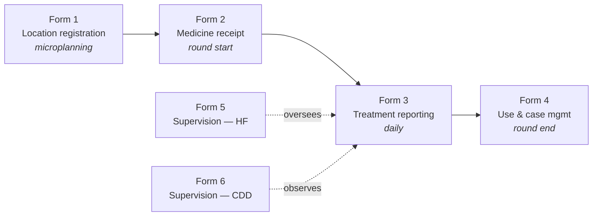
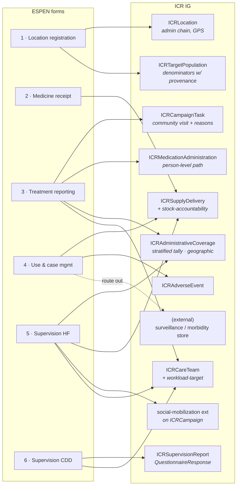
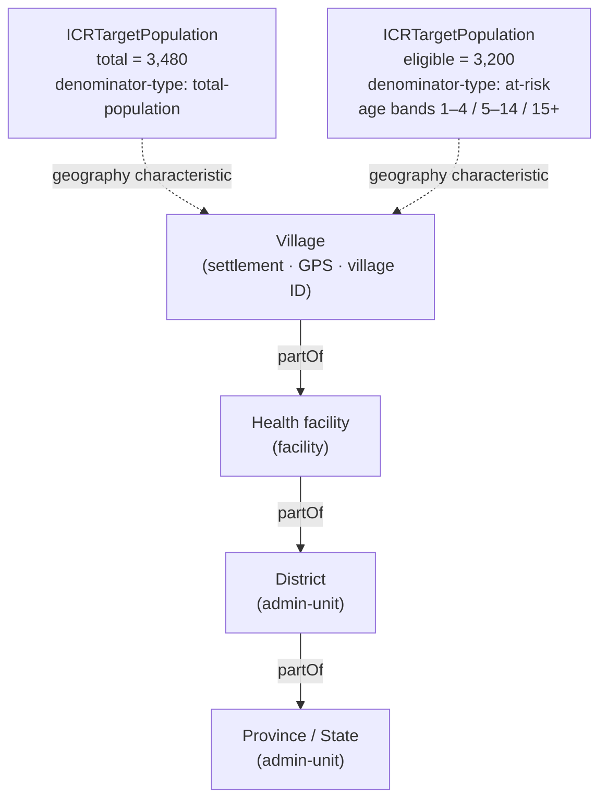
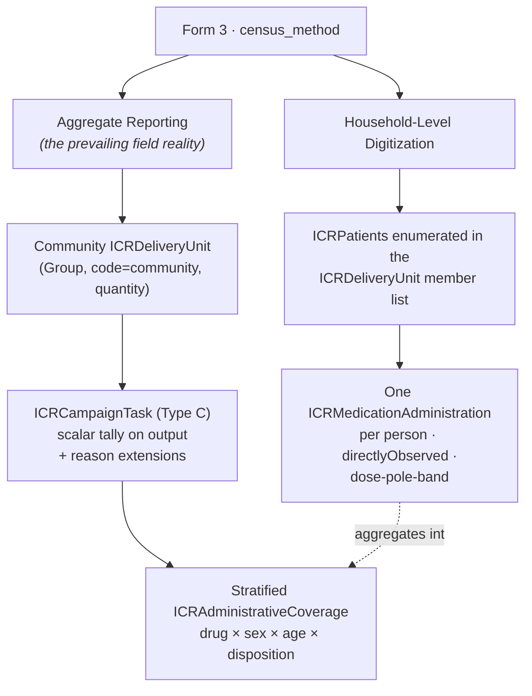
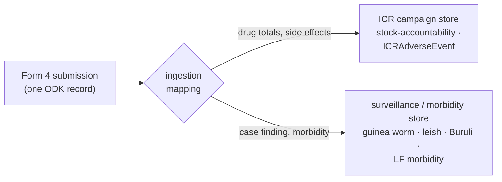
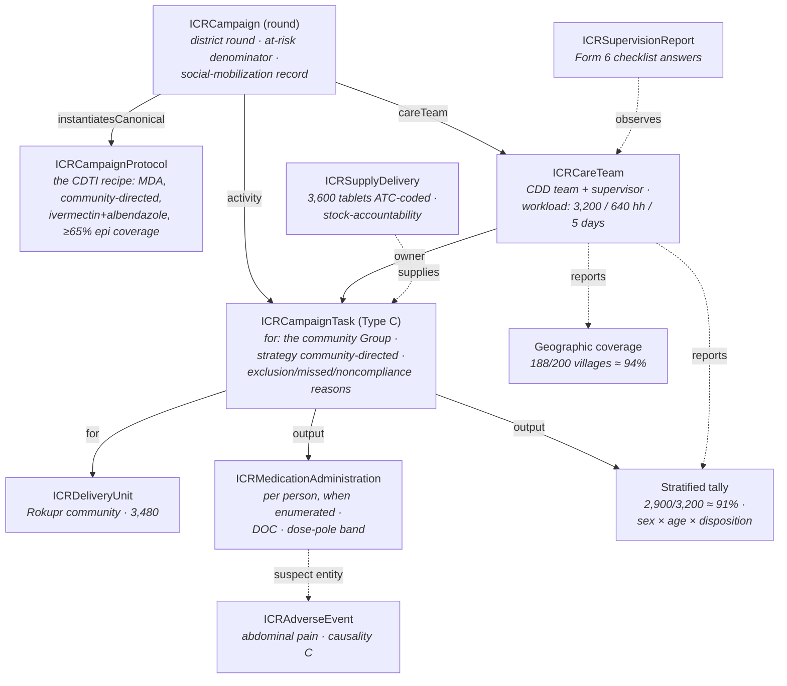

# MDA as a Worked Example — the ESPEN Module on the ICR IG
<sub>`v0.1.0 · Last modified Jul 2, 2026 at 12:25 AM EDT`</sub>

{>>New doc: an illustrative walkthrough of the ESPEN MDA module (forms/espen mda/) mapped onto the IG, built from espen.md + espen-v4.md and the shipped IG examples. Written as the basis for the MDA slide deck — §8 sketches a candidate slide sequence. Delete this note once reviewed.<<}{id="c1" by="claude" at="2026-07-02T04:25:30.000Z"}

> [!note] What this document is
> A walkthrough of the **ICR Implementation Guide using one concrete campaign type — NTD mass drug administration (MDA)** — as the example. The source material is the **ESPEN MDA module**: six real ODK data-collection forms (demo, DR Congo–shaped) for a community-directed preventive-chemotherapy round, held in `forms/espen mda/`. For each form we show what it collects and exactly where that data lands in the IG — profile by profile, with diagrams. Every ESPEN data element now has a committed home in the IG; this document illustrates the fit rather than re-arguing it. For the full profile-by-profile reference, see [[icr-ig]]. This document is also the working basis for an illustrative slide deck (§8).

* * *
## 1. The ESPEN MDA module in one page
**What MDA is.** A mass drug administration campaign treats an entire eligible population — not just the sick — against one or more neglected tropical diseases (NTDs). A **community drug distributor (CDD)**, a trained community volunteer, works through their own village with a drug register and a **dose pole** (a height stick that converts height to tablet count), watching each person swallow the tablets (**directly observed consumption, DOC**). This is the **community-directed** delivery model — "Type C" in the IG's campaign typology — and it is the delivery model the entire ESPEN module is built around.

**The module.** ESPEN (WHO-AFRO's Expanded Special Project for Elimination of NTDs) ships a standard set of six ODK XLSForms for an MDA round. Together they cover the round end to end:

| # | Form | What it collects | Collected |
| --- | --- | --- | --- |
| 1 | **Location registration** | Admin cascade (state → district → health facility → village), village ID, GPS, population by age band, eligible population | Before the round (microplanning) |
| 2 | **Medicine receipt** | Which diseases are targeted, which medicines, quantity of each drug received at the village | Round start |
| 3 | **Treatment reporting** (the core form) | Census method (aggregate vs household-level); treated counts per drug × sex × age band; reasons not treated; campaign day; CDD workforce counts | Daily, during the round |
| 4 | **Medicine use & case management** | Drug totals distributed; minor/serious side effects; other-NTD case finding (guinea-worm rumours, suspected leishmaniasis/Buruli, LF morbidity) | Round end |
| 5 | **Supervision — health facility** | Geographic coverage (villages treated / total + reasons); per-drug stock and concordance; training; social mobilisation channels; pharmacovigilance | During the round |
| 6 | **Supervision — CDD observation** | Direct observation checklist of a CDD at work: supplies, DOC observed, height-chart use, marking, training received | During the round |

The vocabulary is the PC-NTD backbone: diseases **LF, oncho, schisto, STH, trachoma**; medicines **ivermectin, albendazole, mebendazole, praziquantel, azithromycin, tetracycline** and their co-administration combinations.

**Why this module is a good test of the IG.** It is a real national-programme toolset, not a synthetic example; it exercises the aggregate-reporting reality most campaigns live in (not just person-level capture); a third of it is supervision and logistics, which data models usually ignore; and its strategic context (the ESPEN country deck) is **campaign integration** — DR Congo already runs a five-disease NTD MDA co-administered with polio — which is precisely the problem the ICR exists to serve.



* * *
## 2. The scenario used throughout
To keep the walkthrough concrete we use the MDA scenario shipped in the IG's own examples — an illustrative **community-directed albendazole round** in the Rokupr community, Kambia District. The numbers interlock across every section below:

| Quantity | Value | Where it comes from |
| --- | --- | --- |
| Community population | 3,480 | Form 1 village registration → total-population denominator |
| Eligible (at-risk) population | 3,200 | Form 1 → at-risk denominator |
| Tablets received | 3,600 | Form 2 medicine receipt |
| People treated | 2,900 (≈ 91%) | Form 3 treatment tally |
| Not treated | 180 excluded · 95 absent · 25 refused | Form 3 reasons (2,900 + 180 + 95 + 25 = 3,200) |
| Tablets used / remaining / not usable | 3,080 / 500 / 20 | Form 4 reconciliation |
| Villages treated (district-wide) | 188 of 200 (≈ 94%) | Form 5 geographic coverage |
| CDD team workload | 3,200 people · 640 households · 5 days | The microplan's team assignment |

(The figures are an illustrative composite constructed to exercise the profiles; the forms themselves are a DR Congo–shaped demo set.)

* * *
## 3. The map — six forms onto one data model
Every region of every ESPEN form lands on a committed IG artifact. At a glance:



Three routing rules govern the map:

1. **Identity data goes to the identity layer** — places to `ICRLocation`, population estimates to `ICRTargetPopulation`, people (when enumerated) to `ICRPatient` in an `ICRDeliveryUnit`.

2. **Work and results go to the operational layer** — the visit is a Task, drugs received/used are SupplyDelivery, treatments are MedicationAdministrations or a stratified tally, side effects are AdverseEvents.

3. **Anything that is surveillance rather than campaign execution is routed out** — Form 4's case-finding block goes to a surveillance/morbidity store by ingestion rule, not into ICR (§4.4).

* * *
## 4. Form by form
### 4.1 Form 1 — Location registration → `ICRLocation` + `ICRTargetPopulation`
**What the form collects.** A cascading admin selection (`l_state → l_district → l_health_facility → l_location → l_location_id`), a GPS point (`l_gps`), and the village's population: total (`l_total_pop`), by age band (`1–4`, `5–14`, `15+`), and the computed eligible population (`l_eligible_pop`).

**Where it lands.** Two profiles, cleanly split — the _place_ and the _people counted at that place_:

| ESPEN field | ICR home |
| --- | --- |
| Admin cascade + `l_location_id` | An `ICRLocation` chain linked by `partOf` (admin-unit → admin-unit → facility → settlement), with the village ID as `Location.identifier` |
| `l_gps` | `ICRLocation.position` |
| `l_total_pop` | An `ICRTargetPopulation` with `denominator-type = total-population` |
| Age bands + `l_eligible_pop` | An `ICRTargetPopulation` with `denominator-type = at-risk` and age-band `characteristic`s |
| `l_recorder_id`, `l_submitting_report` | The `ICRCareTeam` (recorder role); reporting accountability lands on `MeasureReport.reporter` |



**What this illustrates about the IG.**

- The 4-level ESPEN cascade maps directly onto arbitrary `partOf` nesting — the IG's location model needs no fixed level count.

- The village population captured here is a **microcensus denominator with provenance**: `denominator-source = microcensus`, `estimate-date` set, geography linked by reference. When the next round's registration disagrees with this one, both estimates are retained side by side and one carries the planning flag ([[icr-ig]] §5.2).

- The **total vs eligible** pair is exactly the IG's `denominator-type` axis: dividing treatments by 3,480 gives _programme_ coverage; dividing by 3,200 gives _epidemiological_ coverage. ESPEN's form structure forces the distinction the IG codes.

- ESPEN identifies villages by cascading names plus a numeric ID. The IG's multi-system identity (GERS / P-code / national code) is the **enrichment layer** that gives those villages stable cross-campaign IDs — an ingestion opportunity, not a conflict.

### 4.2 Form 2 — Medicine receipt → `ICRSupplyDelivery`
**What the form collects.** The diseases targeted in this village (`p_disease`: LF / oncho / schisto / STH / trachoma — multi-select), the medicines (`p_medicine`, with disease↔medicine consistency constraints), and the quantity of each drug received (`p_total_pzq`, `_alb`, `_ivm`, …).

**Where it lands.**

| ESPEN field | ICR home |
| --- | --- |
| `p_disease` | `ICRCampaign.addresses` (the campaign's diseases); per-village scoping via `Task.reasonCode` — co-endemicity differs village to village |
| `p_medicine` (+ constraints) | `ICRCampaignActivity.product` (ATC-coded); the consistency constraints are microplan validation logic, not stored data |
| `p_total_<drug>` received | `ICRSupplyDelivery` — `suppliedItem.item` coded **ATC** (the same code as the administrations it supplies), `suppliedItem.quantity` = 3,600 tablets, `destination` → the village, plus `stock-accountability.received` |

**What this illustrates about the IG.**

- **One drug code end to end.** The receipt (SupplyDelivery), the administration (MedicationAdministration), and the reconciliation all carry the same ATC code (e.g. albendazole `P02CA03`) — so "how many tablets arrived vs how many treatments happened" is a join, not a spreadsheet exercise.

- **Multi-disease is native.** `p_disease`/`p_medicine` are multi-select because co-administration is the norm (one ivermectin-based CDD round covering LF + oncho ± schisto/STH). The IG carries this as one campaign (`campaign-type = mda`, several `addresses`) with one `ICRCampaignActivity` per drug regimen, and `Task.reasonCode` scoping which disease(s) a given village's work serves.

### 4.3 Form 3 — Treatment reporting → the heart of the model
This is the core form, and it contains the single strongest field validation of the IG's design: its **first question**.

**The census-method toggle.** Form 3 opens with `select_one census_method`: **"Household-Level Digitization"** or **"Aggregate Reporting."** That is _literally_ the IG's aggregate-vs-individual rule ([[icr-ig]] §6.3), written into a national data-collection tool before the IG existed. The model and the form agree on the same seam:



**The aggregate path (drug × sex × age × disposition).** ESPEN's aggregate treatment data is not a single number — for each drug it is a **cube**: treated counts by sex and age band, plus a parallel set of reasons not treated. The IG's canonical home for that cube is a **stratified MeasureReport** (`ICRAdministrativeCoverage` against the `icr-mda-treatment-coverage` Measure). The scenario's tally, sketched:

```json
{
  "resourceType": "MeasureReport",
  "id": "example-mda-treatment-tally",
  "measure": "https://fhir.icr.unicef.org/Measure/icr-mda-treatment-coverage",
  "group": [{
    "measureScore": { "value": 0.91 },
    "population": [
      { "code": "numerator",   "count": 2900 },
      { "code": "denominator", "count": 3200 }
    ],
    "stratifier": [
      { "code": "sex",         "stratum": [ "F: 1500", "M: 1400" ] },
      { "code": "age-band",    "stratum": [ "5–14: 1100", "15+: 1800" ] },
      { "code": "disposition", "stratum": [ "treated: 2900", "excluded: 180", "absent: 95", "refused: 25" ] }
    ]
  }],
  "extension": [
    { "url": ".../denominator-type", "valueCode": "at-risk" },
    { "url": ".../coverage-source",  "valueCode": "administrative" }
  ]
}
```

_(Abbreviated for readability — the shipped `example-mda-treatment-tally` is the full conformant instance.)_

**The three reasons-not-treated axes.** ESPEN's "not treated" columns split into three genuinely different situations, and the IG deliberately keeps them apart as three Task extensions:

| ESPEN column | Meaning | ICR extension |
| --- | --- | --- |
| `<drug>_child` (below dose pole), `_pregnant`, `_breastfeeding` | **Present but contraindicated** | `exclusion-reason` (`under-height-age`, `pregnant`, `breastfeeding`, `acute-illness`) |
| `<drug>_absent` | **Not reached** | `missed-reason` (`absent`, …) |
| `<drug>_refusal` | **Reached but declined** | `noncompliance-reason` |

Merging these would destroy the analytics: an exclusion is a protocol working correctly, an absence is a reach problem, a refusal is a demand problem — three different programme responses.

**The dose pole.** The correct MDA dose depends on body weight, which can't be measured door-to-door, so the CDD stands each person against a height stick marked with bands and gives the tablet count printed for that band. The IG records the band itself (`dose-pole-band = B`) next to the dose, making the height→dose decision auditable; a person below the bottom of the pole is `exclusion-reason = under-height-age`. `directly-observed-consumption = true` records that the tablets were swallowed under supervision — the distinction between "handed out" and "actually taken" that treatment-coverage validity rests on.

**The rest of the form.**

| ESPEN field | ICR home |
| --- | --- |
| `census` group (households, men, women counted on the day) | An in-round `ICRTargetPopulation` refresh (microcensus), or counts on `Task.output` |
| `p_campaign_day` (Day 1–10) | Event dates (`MedicationAdministration.effective`, `Task.executionPeriod`) — finer-grained than the round number |
| `cd_who_distributed_*`, `cd_trained`, `cd_recycled` | `ICRCareTeam` participants and the supervision checklist (typed training counts are a noted refinement) |

### 4.4 Form 4 — Use & case management → reconciliation, safety, and the scope boundary
**What the form collects.** Total tablets distributed per drug; minor and serious side effects; and a case-finding block: guinea-worm rumours, suspected leishmaniasis, suspected Buruli ulcer, LF lymphoedema/hydrocele.

**Where it lands — three different places, one of them outside the IG:**

| ESPEN field | ICR home |
| --- | --- |
| `p_total_<drug>_dist` | The `stock-accountability` extension on `ICRSupplyDelivery`: received 3,600 / used 3,080 / remaining 500 / not usable 20 / concordant ✓ — and the close-out figures carry `dataLineage = reconciled`, machine-distinguishable from the in-round `realtime` feed |
| `p_minor_side_effect`, `p_serious_side_effect` | `ICRAdverseEvent` — the IG's safety profile is deliberately **intervention-neutral**: the same profile serves vaccine AEFI and MDA drug pharmacovigilance, with `seriousness`, WHO/CIOMS `serious-criteria`, causality A/B/C/D, and `suspectEntity` pointing at the exact administration |
| Guinea worm / leish / Buruli / LF morbidity | **Not ICR.** Routed to a surveillance/morbidity store by the ingestion pipeline |

**The scope boundary, made operational.** The IG's design stance is _"surveillance — reference, don't model"_: case-based surveillance is the trigger and evaluation context of a campaign, not its execution data. But the real ESPEN form co-bundles surveillance onto the same submission as the treatment tally — the form does not respect the modelling boundary, so **the ingestion transform must**:



This is a general lesson the MDA example teaches: **the model's boundaries live in the pipeline, not the form.** Field forms will always bundle whatever one worker can collect in one visit; the transform decides what is campaign data.

### 4.5 Form 5 — Supervision (health facility) → coverage, stock, demand, teams
**What the form collects.** Geographic coverage ("Total number of villages / Number of villages treated / Number of villages not treated" plus reasons: absence of DC, population refusal, **medication shortage, insecurity, difficult access**); per-drug remaining/expired stock and physical-vs-theoretical concordance; distributor training; social mobilisation ("was the population informed?" and channels: **radio, town criers, community leaders, schools, posters**); pharmacovigilance.

**Where it lands.**

| ESPEN theme | ICR home |
| --- | --- |
| Villages treated / total + reasons | **Geographic coverage**: an `ICRAdministrativeCoverage` report with `coverage-unit = implementation-units` — 188/200 ≈ 94%, with the non-treatment reasons as a disposition stratifier (insecurity 7, medication shortage 5) |
| Reasons for village non-treatment | The **area-level** codes in `ICRMissedReasonCS` (`medication-shortage`, `insecurity`, `difficult-access`, `not-required`) — the same extension that carries person-level reasons, one vocabulary |
| Per-drug stock & concordance | `stock-accountability` on the drug `ICRSupplyDelivery` (+ checklist items) |
| Supervisor level (national/regional/district/partner/HF) | `ICRCareTeam` (supervisor role, `managingOrganization`, `oversees-area` → the supervisory-area Location) |
| Training counts, manual used | `ICRCareTeam` + the supervision checklist; the microplan's planned volume is the team's `workload-target` |
| Social mobilisation | The `social-mobilization` extension on `ICRCampaign` — `populationInformed` + coded `channel`s (`ICRCommunicationChannelCS` carries exactly ESPEN's list) |
| Pharmacovigilance | `ICRAdverseEvent` (§4.4) |

**What this illustrates about the IG.** Geographic coverage is _the same profile_ as dose coverage with a different declared unit — the IG did not invent a parallel structure for "villages treated," it added one coded axis (`coverage-unit`). And accountability is structural: the supervisor's team is a real resource, `Task.owner` references it, coverage reports **must** name a `reporter`, and the supervisor's zone is a first-class `supervisory-area` Location overlaying the admin tree.

### 4.6 Form 6 — Supervision (CDD observation) → `ICRSupervisionReport`
**What the form collects.** A direct-observation checklist of a CDD at work: are the MDA supplies present; is consumption directly observed; is the height chart / measuring stick used correctly; are ineligible people identified; are concessions/houses marked; what training did the CDD receive.

**Where it lands.** The whole form is one resource: an **`ICRSupervisionReport`** — a `QuestionnaireResponse` against the shipped `icr-mda-supervision-checklist` `Questionnaire`, whose items are grouped **supplies / CDD observation / stock / social mobilisation** with coded `linkId`s. The subject is the supervised community; the author is the supervisor.

| ESPEN observation | ICR home |
| --- | --- |
| MDA supplies present | Checklist `supplies.*` items |
| Medicine taken in the presence of the CDD | Checklist `cdd.doc` — corroborating the `directly-observed-consumption` flag on the administrations |
| Height chart used correctly | Checklist `cdd.height-chart-used` — corroborating `dose-pole-band` |
| Ineligible people identified | Checklist item — corroborating the `exclusion-reason` axis |
| Marking of concessions | The `finger-marked` pattern (the in-field "already covered" marker) |
| Who supervised, which team | `ICRSupervisionReport.author` (the supervisor) + `ICRCareTeam` |

The scenario's `example-supervision-report`: DOC observed ✓ · height chart ✓ · ineligibles identified ✓ · stock concordant ✗.

**What this illustrates about the IG.** Supervision answers are **structured**, so QA becomes queryable — "what fraction of observed CDDs had concordant stock" is a query, not a document review. And the supervision layer deliberately _corroborates_ the delivery layer: the checklist observes the same practices (DOC, dose pole, marking, exclusions) that the delivery events record, from an independent vantage point.

* * *
## 5. The campaign spine, MDA-flavoured
Everything in §4 hangs off the same campaign architecture every ICR campaign uses — here instantiated for a community-directed MDA round:



Reading it top to bottom: the **protocol** defines what a CDTI round _is_, once; the **round** instantiates it with this district's dates and its at-risk denominator; the **team** carries the microplan workload and owns the work; each **community Task** is one village's round, targeting the community Group and carrying the reason tallies; the **events** (supply, administrations, adverse events) hang off it; and the **analytics** (stratified tally, geographic coverage) roll up with a named reporter, corroborated by the supervision record.

Two ICR constants the MDA data never shows but always carries: every delivery event is stamped `record-origin = campaign` (the firewall that keeps campaign doses out of routine analytics — the mapper injects it, since an ESPEN form is inherently campaign-context), and each Task carries `task-origin` (ESPEN reports against the pre-loaded village list, so the default is `pre-planned`).

* * *
## 6. What the MDA example proves — and what it asked for
The ESPEN module was analysed against the IG in four passes, and the result shaped the IG as much as it validated it.

**Validated as designed (no change needed):**

- The **aggregate/individual duality** — Form 3's census-method toggle is the IG's §6.3 rule, shipped in a national tool.
- ATC-coded MDA administration; **directly-observed consumption**; **dose-pole dosing**; configurable age bands.
- Denominators with provenance; the admin `partOf` chain; delivery-strategy-dependent data elements (ESPEN's community-directed forms simply don't produce house-to-house telemetry like `finger-marked` — consistent with the IG's strategy discriminator).
- Integrated multi-intervention campaigns on a shared denominator (the ESPEN integration agenda).

**Added to the IG because MDA demanded it** (all committed):

| MDA requirement | IG artifact it produced |
| --- | --- |
| The drug × sex × age × disposition cube | The stratified-tally pattern + `icr-mda-treatment-coverage` Measure + `ICRCoverageStratifierCS` |
| Present-but-contraindicated ≠ missed ≠ refused | The `exclusion-reason` extension + `ICRExclusionReasonCS` |
| Drug receipts need the same code as administrations | ATC on `ICRSupplyDelivery.suppliedItem` (`ICRSuppliedItemVS`) |
| Village-level non-treatment causes | Area-level codes in `ICRMissedReasonCS` |
| "Villages treated / total" | The `coverage-unit` axis (geographic coverage) |
| Programme vs epidemiological coverage | The `denominator-type` axis |
| Drug side effects, not just vaccine AEFI | The intervention-neutral `ICRAdverseEvent` |
| Two of six forms are supervision | `ICRCareTeam` (+ `workload-target`) and `ICRSupervisionReport` + checklist Questionnaire |
| Stock, wastage, concordance | The `stock-accountability` extension |
| Mobilisation channels | The `social-mobilization` extension + `ICRCommunicationChannelCS` |

**Still open (deliberately):** executable CQL for the Measures; a standalone microplan resource (today the microplan is the plan-intent Campaign plus per-team workloads); typed training counts; and the ESPEN **ingestion mapping itself** (the OpenFn transform enforcing the §4.4 surveillance routing) — which is the truest end-to-end validation still to build.

* * *
## 7. The inverse check — what ICR adds on top of ESPEN
The mapping also runs the other way: ICR elements with no ESPEN counterpart are exactly the registry's value-add over a form set.

- **Stable cross-campaign place identity** (GERS / P-codes) — ESPEN villages are names + a local numeric ID; ICR's identity layer is what lets next year's bed-net campaign reuse this year's MDA village register.
- **The campaign/routine firewall** (`record-origin`) and **the data-stream flag** (`realtime` vs `reconciled`) — constants a form never asks but analytics depend on.
- **Protocol lineage** (`instantiatesCanonical`) — what makes "all CDTI rounds, any country, comparable" a query.
- **The never-merged coverage lineages** — ESPEN produces the administrative tally; ICR holds it _alongside_ any later coverage survey without ever blending them.
- **Person-level identity and consent** (`ICRPatient`/`ICRConsent`) — dormant in aggregate mode, ready the moment a programme flips Form 3's toggle to household-level digitization.

* * *
## 8. Candidate slide sequence
A suggested skeleton for the illustrative deck this document feeds (one line per slide):

1. **What MDA is** — CDD, dose pole, DOC, community-directed delivery (§1 prose).
2. **The ESPEN module** — six forms, one round, end to end (§1 table + form-flow diagram).
3. **The claim** — every ESPEN data element has a committed home in the IG (§3 map diagram).
4. **A village becomes data** — Form 1: admin chain + two denominators (§4.1 diagram).
5. **Total vs eligible = programme vs epidemiological coverage** (§4.1 / `denominator-type`).
6. **One drug code end to end** — Form 2: receipt → administration → reconciliation on ATC (§4.2).
7. **The toggle that validates the model** — Form 3's census method vs the IG's aggregate/individual rule (§4.3 diagram).
8. **The treatment cube** — stratified tally: 91%, sex × age × disposition (§4.3 JSON/graphic).
9. **Three ways not to be treated** — excluded vs missed vs refused, three different programme responses (§4.3 table).
10. **The dose pole** — height → tablets, audited (§4.3).
11. **The boundary lives in the pipeline** — Form 4's surveillance routing (§4.4 diagram).
12. **Supervision is data** — geographic coverage, stock concordance, mobilisation channels, the CDD checklist (§4.5–4.6).
13. **The spine** — the whole round on one diagram (§5).
14. **What MDA taught the IG** — the demanded-and-delivered table (§6).
15. **What ICR adds** — identity, firewalls, lineage, comparability (§7).

* * *

_This document draws on the ESPEN MDA fit analyses ([[espen]] → [[espen-v4]]) and the IG as committed (see [[icr-ig]] and `ig/input/fsh/`). The ESPEN forms are a demo set; the scenario figures are an illustrative composite._
