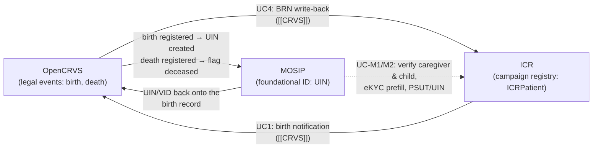

# ICR ↔ MOSIP — Findings & Proposal (National ID)
`v0.1.0 · Draft findings · Jul 5, 2026`

> [!note] What this document is
> Research findings on **MOSIP** (Modular Open-Source Identity Platform) and how the **ICR FHIR IG** ([[icr-ig]]) could use a MOSIP-based national ID system. It is the identity-side companion to [[CRVS]], which covers civil registration (OpenCRVS) — the two documents describe one triangle (§4) and should be read together. All IG changes are **(proposed)**; nothing is committed.
>
> Same scope steer as [[CRVS]]: the primary campaign context is **house-to-house SIA (Type B)** — enumerated children, caregivers at the doorstep, offline-first devices.

---

## 1. Why MOSIP matters to ICR

`ICRPatient`'s entire cross-campaign identity design leans on one preference: **national ID first** (`nationalId` slice, the preferred join key), registry-assigned ID as fallback. MOSIP is the dominant open-source way countries now mint that national ID — 100M+ issued IDs across adopter countries, DPG-certified, and the platform UNICEF's partner governments increasingly deploy. Three consequences:

1. **The join key ICR prefers is, in MOSIP countries, a UIN** — so the IG should say precisely what goes in the `nationalId` slice there (UIN? VID? token?), because MOSIP deliberately offers several identifiers with very different stability and privacy properties (§3.2). Getting this wrong either breaks cross-round joins (expiring VIDs) or over-exposes PII (raw UINs everywhere).
2. **MOSIP defines how a campaign could *verify* identity at the doorstep** — including a fully **offline, signed QR** standard (Claim 169, §3.6) that works with no connectivity and no phone on the resident side. That is the only verification modality that survives Type B field conditions.
3. **For young children, MOSIP is mostly downstream of CRVS** — the UIN for an under-5 typically comes into existence *because* a birth was registered (the OpenCRVS→MOSIP flow in [[CRVS]] §3.5). So ICR's path to child UINs runs through the civil-registration linkage; direct MOSIP integration is mainly about **adults** (caregivers, campaign workers) and **verification**, not child enrolment.

**Foundational vs functional ID — where ICR sits.** MOSIP's own framing: a *foundational* ID is the universal, government-issued identifier; *functional* IDs are sector-specific registries (health, social protection…) that lean on it for dedup and verification. ICR's `registryId` is precisely a functional ID. The design implication is to keep it that way: ICR should **consume** foundational identity (verify against it, store references to it), never mint identity in competition with it — the same "reference, don't model" posture the IG takes toward surveillance data.

---

## 2. MOSIP in brief — architecture and approach

From the MOSIP 1.2.0 documentation (sources §8).

**Platform shape.** Modular, microservices-based, openJDK/Java stack, explicitly designed around: data privacy, no vendor lock-in, open standards, **async/offline first**, commodity computing, fault tolerance, secure-by-default. Countries take the base platform and configure/customise (the ID schema, §3.1, is the country's main lever).

**The module chain (ID issuance):**

| Module | Role |
| --- | --- |
| **Pre-registration** | Resident submits demographics online, books an appointment |
| **Registration Client** (desktop + Android) | Operator-attended capture of demographics + biometrics (fingerprints, iris, face) — online/offline |
| **Registration Processor** | The pipeline: validation, **deduplication against ABIS** (biometric 1:N), UIN generation |
| **ID Repository** | The identity store (per the country ID schema), plus credential issuance |
| **ID Authentication (IDA)** | 1:1 verification services — Yes/No, eKYC, multifactor (§3.3) |
| **Resident Services** | Self-service: VID management, update, usage tracking, lock/unlock auth |
| **Partner Management (PMS)** | Onboarding and policy for relying parties — which is what ICR would be (§3.4) |

**Registration is operator-attended and biometric-anchored.** Unlike OpenCRVS (informant declares, registrar validates), MOSIP enrolment requires a registration centre/client, biometric capture, and ABIS dedup before a UIN exists. A campaign cannot and should not try to be a MOSIP registration client — the doorstep contribution to identity creation is the **birth notification** ([[CRVS]] UC1), which triggers the CRVS→MOSIP chain where country policy wires it.

### 3.1 The ID schema

The country defines a **JSON ID Schema** — the canonical dataset stored per resident in the ID Repository. MOSIP's own good practice: keep it under ~10 fields, minimal by design (anti-profiling, inclusion, data quality). Fields carry categories (`pvt` usable in authentication, `kyc` disclosable to partners, `evidence` deletable post-verification…). Two ICR-relevant facts: **(a)** what eKYC can return to a campaign is bounded by this schema *and* by partner policy — typically name, DOB, gender, photo; i.e. almost exactly the `ICRPatient` mandatory set; **(b)** the OpenCRVS↔MOSIP integration maps birth-registration fields onto this schema (the "MOSIP biographic schema" corrections rule in [[CRVS]] §3.5).

### 3.2 The identifier family (the part ICR must get right)

| Identifier | Properties | ICR relevance |
| --- | --- | --- |
| **UIN** | Permanent, random, **never changes, non-revocable**; no PII derivable from the number | The true lifelong join key. Also the most sensitive — a raw UIN in a shared campaign registry is a linkage key across *every* system that stores it. Countries increasingly restrict who may store it |
| **VID** | Revocable **alias that expires** (policy-set: one-time, temporary, or perpetual); freely disclosable, unlinkable by design | Fine as a *transaction* identifier (an auth event), **unsafe as a stored join key** unless the country issues perpetual VIDs. The IG must warn against storing expiring VIDs in the `nationalId` slice |
| **AID / RID** | Per-application/transaction ID for a lifecycle event (issuance, update); used to track status | Analogue of the OpenCRVS trackingId; only relevant inside referral tracking |
| **Token ID / PSUT** | **Partner-specific user token** — sticky per (person × partner), returned on successful authentication, **cannot be used to re-authenticate**, not linkable across partners | The privacy-engineered option: ICR-as-partner could store the PSUT as its cross-round person key — stable joins inside ICR, useless to any other system, no raw UIN at rest. This is exactly how OpenCRVS stores MOSIP identity ([[CRVS]] §3.5) |

> [!note] The design choice this table forces
> In a MOSIP country, ICR's `nationalId` slice can be populated three ways, in descending privacy order: **PSUT** (best: stable + unlinkable, but requires ICR to be an onboarded authentication partner and an auth transaction per person), **UIN** (simplest, heaviest governance), **perpetual VID** (middle ground, country-policy-dependent). This is a per-country governance decision, not an IG structure decision — the slice mechanics are identical. Proposed IG guidance text in §6.1.

### 3.3 Verification services: IDA, eKYC, e-Signet

- **IDA (ID Authentication)** — 1:1 verification against an identifier (UIN/VID) plus factors (OTP, biometrics, demographics, password). Two response shapes: **Yes/No** ("do these attributes match this ID?") and **eKYC** (returns a policy-governed, digitally-signed attribute set — selective disclosure per relying party). Includes consent capture, tokenization (PSUT), and **hotlisting** (suspend a compromised ID).
- **e-Signet** — MOSIP's recommended front door: an OIDC-based identity layer over IDA (authorization-code flow, wallet/QR/biometric/OTP modes). This is what OpenCRVS embeds in declaration forms. For ICR, e-Signet is the *online* path — realistic for campaign back-office and supervisor flows, largely unrealistic at a Type B doorstep (connectivity, caregiver phone ownership).
- **Demographic authentication exists** — name/DOB/gender matching as auth factors (with normalization) — which is what OpenCRVS's "offline-capture, validate-when-online" verification uses; the same pattern fits campaign batch verification (§5, UC-M2).

### 3.4 Partner model

Every relying party is onboarded through **Partner Management**: registered, credentialed, bound to a **policy** that governs which auth types it may call and which KYC attributes it may receive; MISP (infrastructure) partners carry licence keys. All authentications are audited and resident-visible (Resident Services shows usage). Practical consequence: **"ICR integrates with MOSIP" concretely means a country onboards the campaign platform (or the MoH) as an authentication partner with a minimal eKYC policy** — a formal, per-country agreement, not an API key.

### 3.5 Inji — the verifiable-credential stack

MOSIP's credential layer: issuance, a resident **wallet** (mobile), and **verification of credentials offline** (W3C VC-style, signed). Where deployed, a resident can hold their ID (or a birth certificate — OpenCRVS is heading the same way) as a signed credential presentable without connectivity. Directionally important for campaigns: the *caregiver's phone or printed credential* becomes the identity artefact, and the campaign app only needs a verifier SDK and the country's public keys.

### 3.6 Claim 169 — the offline signed QR (the doorstep-shaped piece)

MOSIP's IANA-registered **CWT claim 169**: a person's identity data — demographics (name, DOB, gender, address, **guardian**), a compressed face photo, optionally biometric templates — packed as CBOR, **signed by the issuer (ED25519/ECC COSE)**, and printed as a QR on the physical ID card. Verification = scan + signature check against pre-synced country keys: **no connectivity, no resident phone, no server** — explicitly designed for "remote areas, no internet, no phone" and cross-border settings. Version 1.2.1 (May 2026).

This is the modality that actually matches Type B field reality, and OpenCRVS's offline QR-scan flow ([[CRVS]] §3.5) is the same idea. Two campaign-relevant details: the **guardian field (#15)** links a child's card to the caregiver's identity; and the face photo enables visual (or later, on-device) match at the doorstep.

---

## 4. The triangle: CRVS ↔ MOSIP ↔ ICR

The three systems form one identity supply chain for a child; the integration in [[CRVS]] and the ones proposed here are two edges of the same triangle:

**Reading for the campaign case:** the child's identity chain is *campaign notifies birth → registrar registers (BRN) → MOSIP issues UIN → identifiers flow back to ICR*. Direct MOSIP↔ICR traffic (dashed) is about **verification and enrichment**, and mostly concerns people who already hold IDs — caregivers, adults in MDA campaigns, older children, and campaign workers. This division of labour is why the [[CRVS]] integration is the v1 priority and the MOSIP edge is v1.5/v2: **for the under-5 SIA target population, CRVS linkage *is* the MOSIP linkage.**

---

## 5. ICR ↔ MOSIP use cases, ranked

### UC-M1 — Offline doorstep verification via Claim 169 QR ⭐

Where residents hold MOSIP-style cards, the Type B app gains a **scan** affordance: scan the caregiver's (or child's) card QR → verify the issuer signature offline → pre-populate/confirm `ICRPatient` demographics (name, DOB, sex — the fields eligibility and dedup depend on) → capture the ID reference per the country's storage policy (§3.2). Zero connectivity required; country public keys sync with the campaign's microplan data. Guardian field links child ↔ caregiver, strengthening the IG's household-anchored record-linkage story (head-of-household + dwelling GERS + now a verified guardian ID).

Value: **data quality at source** (verified DOBs vs guessed age bands; fewer phantom duplicates across rounds) at near-zero marginal field cost. This is the one MOSIP integration that works in the hardest settings — and it degrades gracefully (no card → nothing changes).

### UC-M2 — Batch/async identity confirmation (the OpenCRVS offline pattern)

For records captured without a scan (no card present, QR damaged): once the device syncs, a back-office job calls IDA demographic authentication (via the MOSIP Authentication SDK / e-Signet, ICR-as-partner) to confirm "this name+DOB+sex matches UIN/VID X", writing the result as verification status (§6.2) — and, on success, the PSUT as the stored key. Same caveat OpenCRVS documents: biographic match ≠ authenticated presence; record the assurance level honestly.

### UC-M3 — Campaign worker identity (CareTeam)

`ICRCareTeam.participant.member` references Practitioners that are today display-only in the IG examples. In MOSIP countries, worker onboarding (thousands of CDDs/vaccinators per campaign) can verify workers against the national ID via e-Signet — payroll/per-diem fraud and ghost-worker control, worker `Practitioner.identifier` carrying a verified reference. Operationally valuable (supervision, payment integrity) though outside the IG's current profiling depth — a deployment-guide item, not a profile change.

### UC-M4 — eKYC-assisted eligibility & disaggregation

Where a verified DOB comes back (UC-M1/M2), age-band eligibility (9m–14y), dose-pole vs age cross-checks, and age-disaggregated coverage all firm up. No new IG structure — this is the existing `birthDate 1..1` simply becoming *trustworthy*, with the verification-status axis (§6.2) letting analysts filter "verified-age" cohorts.

### UC-M5 — Deceased-status hygiene (via the triangle, not directly)

MOSIP learns of deaths from CRVS ([[CRVS]] §3.5); ICR should take deceased flags from the CRVS edge (UC5 there) rather than polling MOSIP. Noted here only to close the loop — no direct integration proposed.

---

## 6. IG implications — deliberately small, all **(proposed)**

The [[CRVS]] proposals (BRN slice, registration-status, referral extension, vocabulary touches) carry most of the weight. MOSIP adds two things:

### 6.1 Guidance text on the `nationalId` slice (no structural change)

The slice stays as-is; the IG (§5.4 narrative or an identity page) gains normative guidance:

- In MOSIP-aligned countries the slice value SHOULD be, in order of preference: **PSUT** (ICR-as-partner token), **UIN** (where governance permits raw storage), **perpetual VID**. Expiring VIDs MUST NOT be stored as the join key.
- `identifier.system` distinguishes which: per-country URIs (e.g. `…/identifiers/mosip-psut` vs `…/national-id`), following the existing `$NationalAdminCode` override convention.
- AID/transaction ids belong in referral tracking (the [[CRVS]] `crvs-referral` extension pattern), never in `nationalId`.

### 6.2 `identifier-verification` extension (the one new axis)

A small complex extension **on `Patient.identifier`** (usable on the `nationalId`/`brn` slices):

| Sub-element | Type | Values |
| --- | --- | --- |
| `method` | code, required → `ICRIdentifierVerificationMethodVS` | `qr-offline-signed` (Claim 169 / signed VC) · `ekyc` (online IDA/e-Signet) · `demographic-match` (async biographic, UC-M2) · `document-sighted` (card seen, not cryptographically verified) · `self-reported` |
| `date` | dateTime | when verified |

Rationale: the assurance ladder is *the* data-quality axis for identity-linked campaign records (mirrors MOSIP's own low/high-assurance framing, §3.6), it is vendor-neutral (a non-MOSIP NID or an Inji VC uses the same codes), and it lets the `icr-birth-registration-coverage` and dedup logic weight verified vs self-reported identities differently. Without it, a scanned-and-signature-checked UIN and a transcribed one are indistinguishable — which quietly poisons cross-round matching.

**Explicitly not proposed:** any MOSIP-specific profile or extension (all of §6 is NID-vendor-neutral); biometric data anywhere in ICR (templates, photos — out of scope, out of appetite); ICR acting as a registration/enrolment channel for MOSIP (identity creation stays with CRVS→MOSIP, §2).

---

## 7. Governance notes (beyond [[CRVS]] §7)

- **Partner onboarding is the real gate.** UC-M1 needs only country public keys (verification is offline); UC-M2/M3 need the campaign platform onboarded as an IDA/e-Signet partner with a minimal eKYC policy — a country agreement with audit obligations. Budget this as institutional work, not engineering.
- **Store tokens, not numbers, where possible.** The PSUT pattern exists precisely so functional registries don't accumulate raw UINs. ICR should default to it and treat raw-UIN storage as the exception requiring explicit country sign-off (mirrors the BRN pseudonymisation question, [[CRVS]] §8.2 — same decision, same forum).
- **Children's biometrics are a known weak spot** (infant fingerprints/iris unreliable; enrolment ages vary by country — the OpenCRVS correction rule's "not yet enrolled for biometrics, e.g. under 10" reflects this). Consequence: child identity assurance at the doorstep is essentially *documentary + guardian-linked* for the SIA age range; design UC-M1 flows around the caregiver's verified identity plus the child's card/BRN, not child biometrics.
- **Hotlisting & resident visibility cut both ways.** Every ICR-as-partner authentication shows up in the resident's usage history (good — symmetrical transparency), and a hotlisted ID will fail verification mid-campaign (handle gracefully: fall back to `document-sighted`, never block a dose on an identity failure). **Delivery is never conditional on identification** — worth stating as an IG principle alongside the record-origin firewall.

---

## 8. Open questions

1. **PSUT vs UIN vs perpetual-VID storage** — per-country call; needs a default recommendation in the IG guidance (§6.1) and alignment with the BRN-pseudonymisation decision in [[CRVS]].
2. **Is ICR (or the MoH platform running it) the *partner*?** Who signs the MOSIP partner agreement and holds the eKYC policy — the campaign platform operator, the MoH, or per-campaign? Determines credential custody for UC-M2/M3.
3. **Claim 169 verifier in the capture apps** — ODK/OpenSRP plugin availability and key-distribution mechanics (sync country COSE keys with microplan payloads?). Prototype question for Phase 2.
4. **`identifier-verification` scope** — extension on `identifier` (as proposed) vs a Provenance-based pattern (consistent with GERS backfill)? Extension is queryable; Provenance is more FHIR-idiomatic for *how data got here*. Take to the same FHIR-community review as the record-linkage pattern.
5. **Inji/VC horizon** — if pilot countries issue birth certificates as verifiable credentials (OpenCRVS roadmap + Inji), does doorstep verification converge on one VC-verifier flow for both BRN and UIN? Watch; don't build twice.
6. **Non-MOSIP NID countries** — the §6 proposals are vendor-neutral by design; validate them against one non-MOSIP pilot country's NID API to prove it.

---

## 9. Sources

- MOSIP documentation (1.2.0): [Overview](https://docs.mosip.io/1.2.0/readme/overview) · [Architecture](https://docs.mosip.io/1.2.0/readme/technology/architecture) · [ID Lifecycle Management](https://docs.mosip.io/1.2.0/id-lifecycle-management) · [Identifiers (UIN/VID/AID/PSUT)](https://docs.mosip.io/1.2.0/id-lifecycle-management/identity-management/identifiers) · [ID Schema](https://docs.mosip.io/1.2.0/id-lifecycle-management/identity-management/id-schema) · [ID Authentication](https://docs.mosip.io/1.2.0/id-lifecycle-management/identity-verification/id-authentication) · [eSignet](https://docs.mosip.io/1.2.0/readme/esignet) (→ docs.esignet.io) · [Inji](https://docs.mosip.io/1.2.0/readme/inji) (→ docs.inji.io) · [169 QR Code Specification v1.2.1](https://docs.mosip.io/1.2.0/readme/standards-and-specifications/mosip-standards/169-qr-code-specification)
- OpenCRVS ↔ MOSIP integration (UIN lifecycle, e-Signet in-form auth, PSUT storage, offline QR verification): see [[CRVS]] §3.5 and its sources.
- ICR IG companion: [[icr-ig]] — §5.4 (ICRPatient identity), §4.5 (CareTeam), §13.4 (governance open decisions).

---

*Next steps if confirmed: (1) fold §6.1 guidance + §6.2 extension into the same `crvs-v1` IG round proposed in [[CRVS]]; (2) add the partner-onboarding question to the country-assessment checklist; (3) evaluate a Claim 169 verifier spike in the Phase 2 data-collection app choice.*
