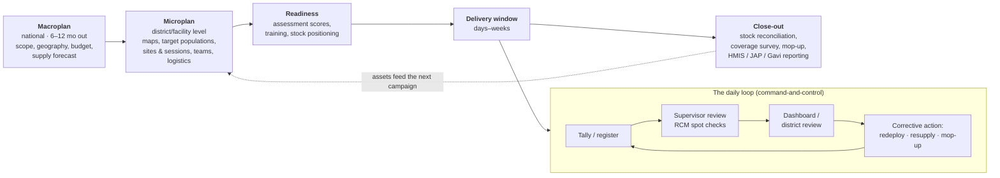
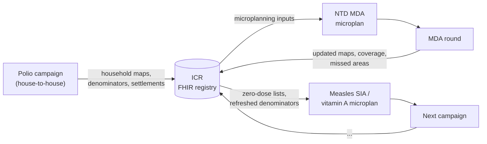
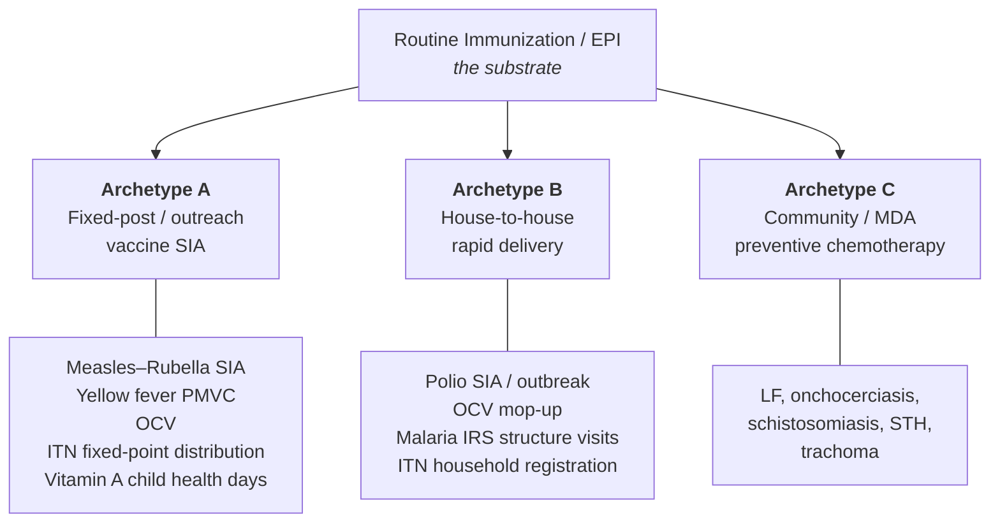
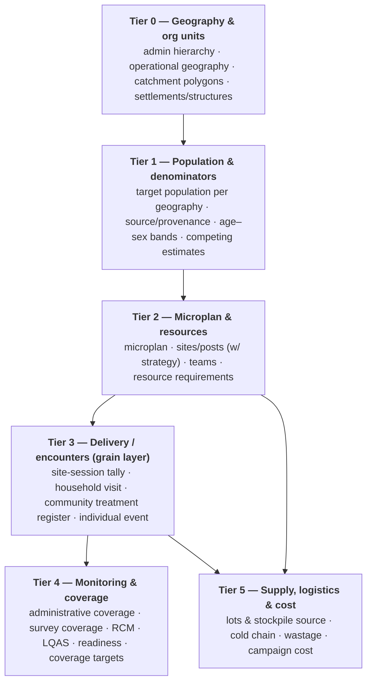
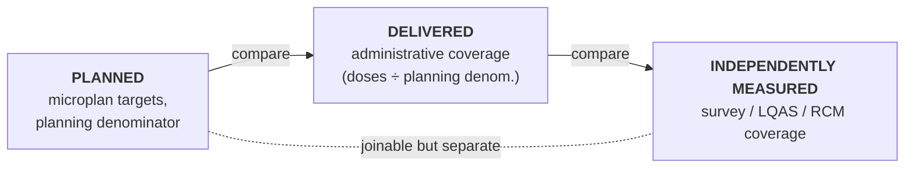
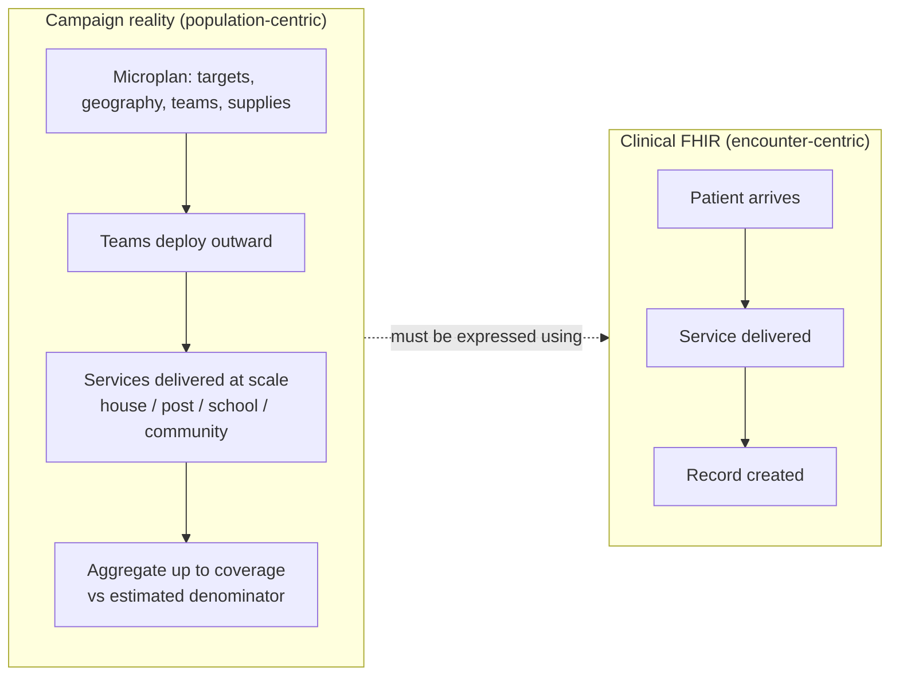
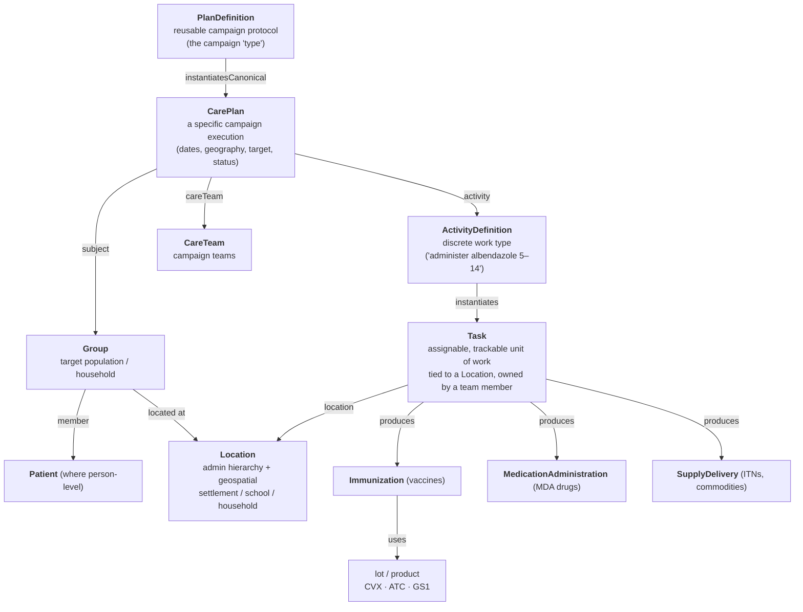
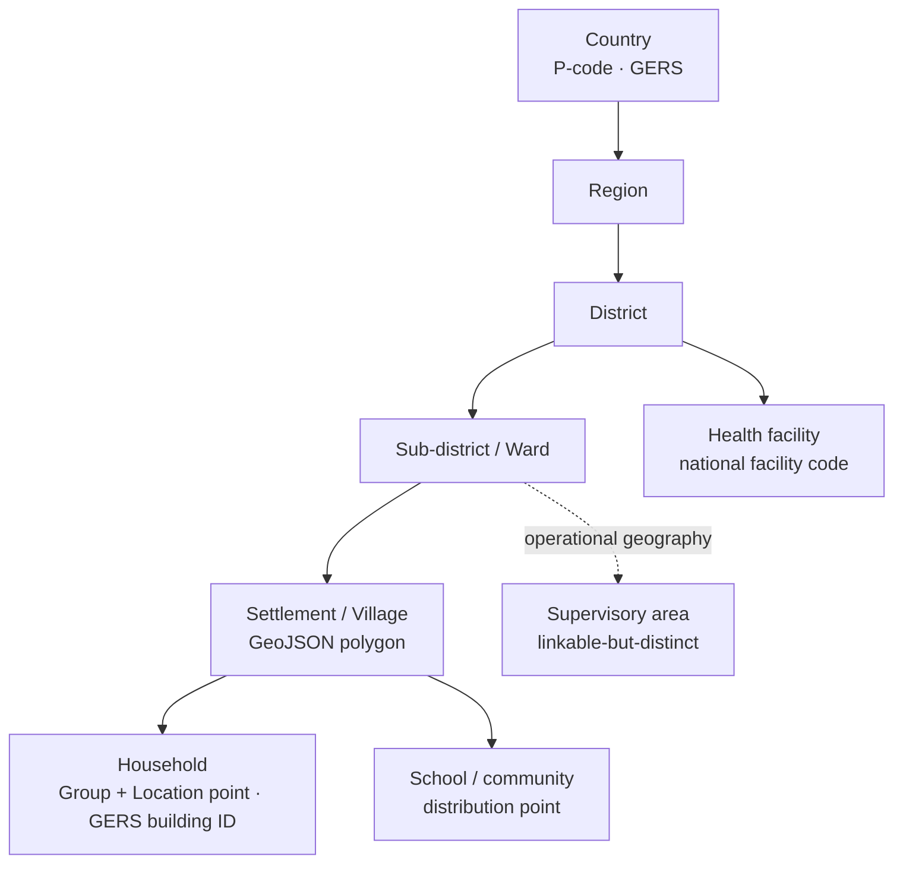
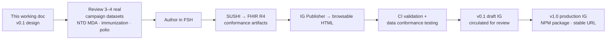

# ICR FHIR Implementation Guide — Campaign Data Model & Structure
`v0.1.1 · Last modified Jun 10, 2026 at 12:07 AM EDT`

> [!abstract] What this document is A working design document that grounds the **ICR FHIR Implementation Guide (IG)** before Phase 1 authoring begins. It moves in four deliberate steps:
> 
> 1. **The nature of campaigns** — what a campaign is, its lifecycle and operational tempo, who touches the data, and what gets recorded in the field (§1) — and which of those data assets are reusable across campaigns and programs, the ICR's core thesis (§2).
>   
> 2. **Campaign types** — how campaigns actually differ, grouped by _structural archetype_ rather than by disease (§3).
>   
> 3. **Data-model components** — the entities and concepts public-health practitioners use to describe campaigns: microplans, denominators, coverage, sessions, registers (§4).
>   
> 4. **FHIR mapping & proposed IG profiles** — how each component maps onto HL7 FHIR R4 resources, and the concrete profiles the ICR IG should define (§5–12).
>   
> 
> It is technical and opinionated, but written to be circulated to UNICEF and WHO as a v1 thinking piece. It is **not** the IG itself — it is the design rationale the IG will encode. Source research lives in [[Immunization Campaign Data Models Research]], [[immunization-campaign-data-models-report]], [[chatpgpt-campaigns]], and the [[ICR Technical Proposal Ona Final]].

* * *
## 1. The nature of public health campaigns
A public health campaign is a **time-bounded, population-level delivery event**: over days to weeks, a health system mobilizes thousands of temporary workers to bring a product — a vaccine, a deworming tablet, a bed net, a vitamin A capsule — to everyone in a defined target population, regardless of whether they ever visit a health facility. Campaigns complement routine services; they do not replace them. Where routine immunization waits for the child to come to the system, **the campaign sends the system to the child**.
### 1.1 The programs in scope
{==The ICR spans the campaign programs UNICEF supports. They look different on the surface but share deep structure:==}{>>Not just UNICEF campaigns. Goal for ICR is all public health campaigns.<<}{id="c3" by="user" at="2026-06-10T03:46:13.024Z"}{>>Agreed — I'll generalize the scope from "campaign programs UNICEF supports" to all public health campaigns, with UNICEF as the convening funder/example rather than the boundary.<<}{id="c17" by="claude" at="2026-06-10T04:07:28.000Z" re="c3"}

| Program | Product | Typical target | Cadence & operational shape |
| --- | --- | --- | --- |
| **Polio SIA / outbreak response** | OPV (oral drops) | All children <5 | Multiple rounds; house-to-house sweeps over ~1 week, same-day mop-up |
| **Measles–rubella SIA** | Injectable MCV (cold chain, AEFI monitoring) | 9 months–14 years | Every 2–4 years; fixed & temporary posts over 1–2 weeks |
| **NTD MDA** (LF, oncho, schisto, STH, trachoma) | Albendazole, ivermectin, praziquantel, azithromycin… | Whole at-risk communities or school-age | Annual/biannual rounds sustained for years; community drug distributors |
| **Malaria ITN distribution** | Long-lasting insecticidal nets | All households | Mass replacement ~every 3 years; registration then distribution |
| **Malaria IRS** | Insecticide spraying | All eligible structures | Seasonal, ahead of transmission; structure-by-structure visits |
| **Vitamin A supplementation** | High-dose capsule | 6–59 months | Semiannual; usually co-delivered (child health days, polio rounds) |

These programs frequently target **the same communities and the** {==**same children**==}{>>Not sure children. Say beneficiaries / people/clients.  Audience is not just UNICEF here.<<}{id="c4" by="user" at="2026-06-10T03:48:42.880Z"}{>>Agreed — switching "same children" to "same beneficiaries/people." Children is too narrow given MDA targets whole communities and ITN/IRS target households and structures.<<}{id="c18" by="claude" at="2026-06-10T04:07:28.000Z" re="c4"} — which is the premise of the ICR: data collected for one round should be an asset for the next, across programs.
### 1.2 {==The campaign lifecycle==}{>>These stages are good but let's formalize a bit.  Eg should say Campaign delivery instead of delivery widnow.  Then mabye microplanning, macroplanning, close out, etc.<<}{id="c5" by="user" at="2026-06-10T03:49:47.359Z"}{>>Will formalize the stage names: rename "Delivery window" → "Campaign delivery," and standardize the lifecycle to Macroplanning → Microplanning → Readiness → Campaign delivery → Close-out (matching the mermaid nodes to the prose).<<}{id="c19" by="claude" at="2026-06-10T04:07:28.000Z" re="c5"}
Every campaign, regardless of program, moves through the same lifecycle — and each phase produces and consumes data:

Two phases deserve emphasis because they dominate the data model:

{==**Microplanning is where the data model is born.**==}{>>Let's formailze this language a bit in general.  Be a bit more of a matter of fact. Know the audience.  They are experts in this field.<<}{id="c6" by="user" at="2026-06-10T03:51:01.653Z"}{>>Agreed — I'll drop the rhetorical "where the data model is born" framing for matter-of-fact language, and apply that tone throughout for a field-expert audience.<<}{id="c20" by="claude" at="2026-06-10T04:07:28.000Z" re="c6"} In a good implementation the microplan is not a narrative document but a **structured dataset**: every village in the catchment with its target population, hard-to-reach flags, session type (fixed / outreach / mobile), team assignments, transport, and commodity needs — the WHO RED strategy formalized this for routine immunization and campaigns inherited it. The quality payoff is measurable: in Kano State, Nigeria, revised _household-based_ microplanning increased enumerated settlements by 38% and corrected inflated target counts, directly improving the subsequent campaign.

**The delivery window runs on a daily operational rhythm.** {==Campaigns are managed like operations, not programs:==}{>>What does this mean?<<}{id="c7" by="user" at="2026-06-10T03:53:59.333Z"}{>>It means campaigns run on a daily command-and-control tempo — tally → nightly review → next-morning redeployment → same-day mop-up — unlike the monthly/quarterly cadence of routine programs.<<}{id="c21" by="claude" at="2026-06-10T04:07:28.000Z" re="c7"}{>>Rephrase<<}{id="c8" by="user" at="2026-06-10T03:54:34.517Z" re="c7"}{>>Will rephrase to state the daily operational tempo directly rather than the "operations not programs" shorthand.<<}{id="c22" by="claude" at="2026-06-10T04:07:28.000Z" re="c8"} tally sheets are reviewed nightly, supervisors run rapid convenience monitoring (RCM) during the day, dashboards drive next-morning redeployment, and mop-up teams revisit missed households within a day or two. Any data model that cannot support this same-day loop — capture → aggregate → decide → act — fails the campaign manager no matter how well it serves the epidemiologist afterward.
### {==1.3 Who touches the data==}{>>Actors?<<}{id="c9" by="user" at="2026-06-10T03:55:01.471Z"}{>>Yes — renaming the heading to "1.3 Actors — who creates and consumes data."<<}{id="c23" by="claude" at="2026-06-10T04:07:28.000Z" re="c9"}
| Actor | Creates | Consumes |
| --- | --- | --- |
| National program manager (EPI / NTD / malaria) | Macroplan, protocol, targets | National dashboards, JAP/Gavi/WHO reports |
| District health management team | Microplan, team rosters, logistics plan | Daily coverage vs target, stock alerts |
| Field supervisor | Supervision checklists, RCM forms, mop-up lists | Team tallies, missed-area flags |
| Vaccination team / community drug distributor (CDD) | Tally sheets, registers, treatment records | Movement plan, household lists, dose-pole charts |
| Independent monitor | Post-campaign household checks, LQAS | Microplan denominators |
| Community mobilizer | Refusal/absence notes, session announcements | Session schedule |
### {==1.4 How records are actually made==}{>>For the purposes of this project we can assume the work is being digitized.  Note we say that use of AI / eg OCR could help digitize some of this in ways that weren't done easily before.  This is not super relevant though for this work.<<}{id="c1" by="user" at="2026-06-10T02:50:37.721Z"}{>>Agreed — I'll assume digitized capture as the project baseline and add a brief, out-of-scope note that AI/OCR can now digitize legacy paper artifacts in ways that weren't previously feasible.<<}{id="c24" by="claude" at="2026-06-10T04:07:28.000Z" re="c1"}{>>So we can redo or get rid of this section.<<}{id="c2" by="user" at="2026-06-10T02:52:11.089Z" re="c1"}{>>Will cut most of §1.4 and fold the one load-bearing point — a digital form still carries tally-sheet/register semantics, which the ICR standardizes — into §2.<<}{id="c25" by="claude" at="2026-06-10T04:07:28.000Z" re="c2"}
In much of the world the primary recording instruments are still **paper plus physical marks**, and the data model must treat these as ground truth rather than as noise to be abstracted away:

- the **doorstep tally sheet** (children vaccinated by age band; houses visited);
  
- **finger-marking** with indelible ink — the in-field "already vaccinated" flag;
  
- **chalk house-marking** on the door lintel — household status (all covered / revisit needed);
  
- the **dose pole** in MDA — physical height bands mapped directly to tablet counts;
  
- the **CDD community register** — household-by-household treatment records kept by a community member;
  
- the **home-based record** (child health card) — the family-held routine history that campaigns check for zero-dose detection.
  

Digitization (ODK/XLSForm, DHIS2, CommCare, OpenSRP) replaces _transcription_, not _semantics_: a digital form is still a tally sheet or a register at heart. The ICR's job is to give these artifacts a standard, reusable representation — not to demand that field practice change to suit the standard.

* * *
## 2. What campaigns record — and what is reusable
### {==2.1 The five layers of campaign data==}{>>This framing is good<<}{id="c10" by="user" at="2026-06-10T03:55:24.059Z"}{>>Thanks — keeping the five-layer framing as is.<<}{id="c26" by="claude" at="2026-06-10T04:07:28.000Z" re="c10"}
Across all programs, well-run campaigns organize their data in the same layered structure:

| Layer | What it holds | Typical artifacts |
| --- | --- | --- |
| **Campaign layer** | Dates, targets, geography, teams, commodities, partners | Campaign plan, microplan, budget |
| **Delivery layer** | Facilities, posts, schools, households, routes | Site lists, team movement plans, operational maps |
| **Service layer** | Doses given / not given, treatments, nets delivered, structures sprayed | Tally sheets, registers, individual records |
| **Supervision & quality layer** | Refusals, missed children + reasons, stock reconciliation, RCM, LQAS | Checklists, monitoring forms, mop-up lists |
| **Analytics layer** | Coverage, dropout, zero-dose, wastage, data quality | Dashboards, HMIS reports, JAP forms |
### 2.2 The disposability problem
Campaign delivery has been **verticalized for decades**: each program builds its own systems, remaps the same communities, re-registers the same people, and re-estimates the same denominators every round. Data from one program is rarely available to the next even when both serve the same villages. The clearest case is NTDs: MDA campaigns could run on the household maps, population denominators, and geographic data that better-funded polio and immunization campaigns have _already collected_ — but siloed systems make that impossible. {==Campaign data is treated as **disposable**, an operational byproduct discarded at close-out.==}{>>Disposiable is a strong term.  Just not reused.<<}{id="c33" by="user" at="2026-06-10T04:14:00.682Z"}{>>Not a lot of effort is invested to save it or make it in a format tat can be reused.  Perhahps because it is not considered useful for later campaigns. If so what are the reasons why?  Please explore that.<<}{id="c34" by="user" at="2026-06-10T04:14:26.312Z" re="c33"}

The ICR's thesis is to invert this: make each campaign a contributor to a **cumulative, reusable corpus of public health intelligence**, so that data collection cost becomes an investment that compounds across programs and over time.
### 2.3 The reusable assets
{==Not everything a campaign records is worth keeping. The reusable core — what the ICR exists to capture, standardize, and hand to the next campaign — is this:==}{>>Can we call out in a section below what data is not reusable? Framing as not worth keeping is not a good framing.<<}{id="c11" by="user" at="2026-06-10T03:56:19.100Z"}{>>Agreed — I'll drop the "not worth keeping" framing and add a short subsection naming the non-reusable/transient data (per-team daily tallies once aggregated, redeployment decisions, ephemeral operational state) so the contrast is explicit rather than dismissive.<<}{id="c27" by="claude" at="2026-06-10T04:07:28.000Z" re="c11"}

| Reusable asset | Typically produced by | Reused for | {==Stability / decay==}{>>Good concept. Maybe we find aother way to put this.  Something about how often the data changes or stable it is. Not sure. Maybe update and add in some comments before rewriting.<<}{id="c12" by="user" at="2026-06-10T03:56:52.853Z"}{>>Agreed it's a good concept. Candidates for the column name, all framed as rate-of-change: "Update cadence," "Refresh frequency," or "Stability / refresh." Leaving the label for now and will settle it in the rewrite per your note.<<}{id="c28" by="claude" at="2026-06-10T04:07:28.000Z" re="c12"} |
| --- | --- | --- | --- |
| **Admin hierarchy & location registry** | National georegistry, any campaign | Every campaign + routine services | Very stable (years); changes with boundary reforms |
| **Settlement & household maps** (incl. building footprints / GERS IDs) | House-to-house campaigns (polio, IRS, ITN registration); geospatial tooling | Microplanning of _any_ program in the same geography | Durable; needs refresh for new/abandoned settlements |
| **Population denominators** | Microcensus & enumeration, modelled estimates (WorldPop, GRID3) | All targeting and every coverage calculation | **Decays fast** (1–3 years); must carry source + date |
| **Catchment polygons & supervisory areas** | Microplanning tools (Crosscut, ESPEN Microplanner) | Session planning, fair team workloads, travel-time analysis | Stable until the facility network changes |
| **Target lists & zero-dose lists** | Campaign delivery + routine HMIS analysis | The next campaign's focus areas; routine catch-up | Months; **sensitive** — household-level, access-controlled |
| **Team rosters & site lists** | Campaign operations | The next round or the next program's campaign | Semi-durable; people and posts turn over |
| **Campaign protocols** (what a measles SIA _is_: products, age bands, activity sequence) | Program design, WHO guidance | Every instantiation, every country | Durable; versioned, evolves with guidance |
| **Coverage results & missed-area lists** | Monitoring & post-campaign evaluation | The next microplan's risk targeting | One planning cycle |

> [!warning] Reuse is only safe with provenance A 2024 denominator silently reused in 2027 is worse than no denominator — it produces confident, wrong coverage figures. Every reusable asset must carry **its source, its date, and its method**, and consumers must see that metadata at the point of reuse. This is why the data model (§4) makes provenance a first-class feature of Tier 1, not an ETL detail.

The rest of this document turns this picture into a formal model: first the campaign types grouped structurally (§3), then the components public health already has names for (§4), then their FHIR expression (§5 onward).

* * *
## 3. Campaign types — by structural archetype
{==The strongest determinant of a campaign's data model is **not the disease but the delivery strategy**,==}{>>Just say data model is determined primarily the deliverable model and not the disease.<<}{id="c13" by="user" at="2026-06-10T03:58:37.500Z"}{>>Will simplify to: the data model is determined primarily by the delivery model, not the disease.<<}{id="c29" by="claude" at="2026-06-10T04:07:28.000Z" re="c13"} because the strategy sets the _grain_ of recording (who/where a record represents) and which entities even exist. The proposal's program scope (immunization, polio, NTD MDA, malaria, vitamin A) collapses into **three structural archetypes**, plus **routine immunization** as the substrate they all plug into.

> [!note] Hybrids are the norm, not the exception Real campaigns mix archetypes. A mass **ITN campaign** is typically a _house-to-house registration phase_ (Archetype B — enumerate households, issue vouchers, compute net allocation) followed by a _fixed-point distribution phase_ (Archetype A). **Vitamin A** is usually co-delivered through child health days (A) or piggybacked on polio house-to-house rounds (B). A measles SIA adds house-to-house _mop-up_ after fixed-post delivery. This is exactly why delivery strategy must be an attribute of the **activity/task**, not of the campaign.
### {==3.1 The archetypes at a glance==}{>>For things like HPV, Vita A and others schools are also used. Guess that is fixed post.<<}{id="c14" by="user" at="2026-06-10T03:59:53.781Z"}{>>Confirmed — school-based delivery (HPV, vitamin A, MR) is a fixed-post variant (Archetype A). I'll call out schools explicitly as a fixed-post setting and add HPV as an example.<<}{id="c30" by="claude" at="2026-06-10T04:07:28.000Z" re="c14"}
| Archetype | Delivery unit & **grain** of record | Core records / planning artifacts | Distinctive data elements | Reporting rhythm |
| --- | --- | --- | --- | --- |
| **A. Fixed-post / outreach vaccine SIA** (measles–rubella, yellow fever, OCV, vitamin A) | Site → _site-session_ (fixed post, temporary post, school, mobile) | Daily tally sheets by age band, vial accountability, cold-chain logs, AEFI line lists, RCM, readiness assessment | Doses by antigen × age band; wastage; AEFI; readiness score; per-round/per-dose coverage (OCV) | Daily tally review; post-campaign survey / mop-up |
| **B. House-to-house rapid delivery** (polio, OCV mop-up; malaria IRS/ITN structurally) | Household → _household visit_ (+ child within household) | Team movement plans, operational maps, doorstep tally sheets, finger/house-marking, LQAS, RCM | Houses visited; children present/absent; **missed + reason**; **noncompliance reason**; chronically missed settlements | Daily team & supervisor review; same-day mop-up |
| **C. Community / MDA preventive chemotherapy** (NTD: LF, oncho, schisto, STH, trachoma) | Community / household → _community treatment register_ (by a CDD) | CDD treatment registers, household visit logs, supervision forms, side-event reports | Directly-observed consumption; **dose-pole height → tablet count**; chronic-morbidity line lists (lymphoedema, hydrocele) | Often daily during round; aggregated program / epidemiological / geographic coverage |
| **(Substrate) Routine immunization / EPI** | Facility / outreach → child over time | Home-based record, facility register, tally sheets → monthly HMIS report | Coverage by antigen-dose; drop-out (Penta1→Penta3); zero-dose (no DTP1); MOV | Monthly reporting; quarterly microplan revision |
### 3.2 Why the archetype matters for FHIR
The archetype dictates the **finest grain** at which a record exists, and therefore which FHIR resource carries the delivery event and at what cardinality:

- {==**Archetype A** produces _site-session aggregates_ → modeled as a `Task` per site-session with aggregate outputs (and optionally individual `Immunization` where person-level capture exists).==}{>>Link to a location instead of a household?<<}{id="c15" by="user" at="2026-06-10T04:00:47.262Z"}{>>Correct — for Archetype A the Task should point at a Location (site/post/school) via Task.location/focus, not a household Group. I'll fix this.<<}{id="c31" by="claude" at="2026-06-10T04:07:28.000Z" re="c15"}
  
- {==**Archetype B** produces _household visits_ → modeled as a `Task` per household (`focus` → the household `Group`), carrying missed/noncompliance reasons natively.==}{>>These all linked to locations too.<<}{id="c16" by="user" at="2026-06-10T04:01:04.694Z"}{>>Agreed — household Tasks also carry Task.location (the dwelling, via household-location). I'll clarify that all archetypes set Task.location; only the focus differs (household Group for B, Location for A).<<}{id="c32" by="claude" at="2026-06-10T04:07:28.000Z" re="c16"}
  
- **Archetype C** produces _community register entries_ → modeled as `MedicationAdministration` (with dose-pole `Observation`) linked to a community/household `Group`.
  

> [!tip] First-class attribute **Delivery strategy must be a first-class, coded attribute** of every campaign activity / site / task. A single campaign routinely mixes strategies (e.g. fixed post + house-to-house mop-up), and the available data elements change with the strategy.

* * *
## 4. Public-health data-model components
Public-health practitioners do not think in FHIR resources; they think in **microplans, denominators, sessions, tally sheets, registers, and coverage**. Synthesizing the six programs in the research, the recurring structure is a **six-tier model**. The ICR IG must be able to express all six tiers.

### 4.1 The three data lineages (do not merge them)
The single most important cross-cutting rule from the evidence: a campaign carries **three distinct lineages of the same quantities**, and they must never be collapsed into one field.

> [!warning] The admin-vs-survey gap is real and must be representable In a pre-emptive OCV campaign in Cuamba, Mozambique, **administrative coverage was ~99% while the post-campaign survey found ~76%** for the first dose. The model must hold _administrative_ and _survey_ coverage as **separately-sourced, first-class measures** of the same conceptual quantity — each with method, denominator source, and date attached.
### 4.2 Denominator-first
The denominator (target population) is the dominant source of error in campaign analytics. Every population estimate and every coverage figure must carry **provenance and a date**: census/projection, microcensus/enumeration, or modelled gridded estimates (WorldPop, GRID3), intersected with catchment polygons. Multiple competing estimates per geography should be retained, with **one flagged as the planning denominator**.
### 4.3 Real-time vs post-campaign reconciliation
The IG must distinguish components captured/reported **in real time during an active campaign** from those **reconciled at campaign close** — using a _single structure_ that supports both, rather than two systems.

| Real-time (operational monitoring) | Post-campaign (reconciliation & reporting) |
| --- | --- |
| Doses / commodities administered | Reconciled stock counts & wastage |
| Locations visited, progress vs target | Final coverage calculations (admin + survey) |
| Team redeployment, mop-up triggers | Data-quality review, deduplication |
| Daily dashboards | JAP / Gavi / ICG-aligned consolidated reporting |
### 4.4 Campaign ↔ routine integration and zero-dose
Campaigns are no longer just blanket-coverage events — they are increasingly **precision instruments for finding zero-dose children** (no DTP/Penta1) and pulling them into the routine system (the Big Catch-Up pattern). Two concrete model requirements follow:

1. **Every delivery event carries a coded record-origin** (`campaign-SIA` vs `routine-facility-visit`). Without it, SIA doses contaminate routine coverage analytics — and conversely routine history (card checked / zero-dose detected during a campaign) can't be analyzed. This is a required element on all ICR delivery-event profiles, not an option.
  
2. **A campaign encounter can spawn routine follow-up.** When a zero-dose child is found during a campaign, the model must support enrolling them (a `Patient` created from the household `Group` member) and generating routine follow-up — which is exactly what the `CarePlan`/`Task` machinery already provides, pointed at the routine schedule instead of the campaign protocol.
  

This is also the heart of the ICR's reuse thesis: the household maps, population denominators, and zero-dose lists that one campaign produces become **planning inputs (Tier 0–1) for the next** — across programs, not just within one.

* * *
## 5. The FHIR modeling challenge
Having described campaigns in their own terms, we can now confront the standard. FHIR was designed around the **clinical encounter**: a patient presents at a facility, a clinician delivers a service, a record is created. Campaigns **invert this model**. They are population-level, geographically driven, time-bounded events in which _teams move outward into communities_ to deliver services at scale. There is no native `Campaign` or `CampaignEvent` resource in FHIR.

The ICR IG's central task is therefore to **identify which existing FHIR resources can be profiled and extended to carry campaign semantics faithfully**, in a way that is architecturally sound and acceptable to the broader FHIR community. We have navigated this exact challenge before with the **household** concept (no native FHIR support → `Group` linked to `Location`, validated through the HL7 community process and since adopted in the ecosystem). We will follow the same methodology here.

> [!note] Design north star **One configurable data model, many expressions.** Routine immunization, polio SIAs, measles–rubella SIAs, NTD MDA, malaria IRS/ITN, and vitamin A supplementation differ mostly in _delivery strategy, age band, dose/round count, and product type_ — all expressible as configuration over a shared model, rather than as separate per-disease schemas.

* * *
## 6. Mapping public-health components → FHIR resources
This is the crosswalk from the public-health vocabulary of §§2–4 to FHIR R4 resources. `CarePlan` **is the architectural foundation**: in clinical FHIR a CarePlan is a coordinated set of activities to address a health concern for a patient or group; _a campaign is the same concept at population scale_.

### 6.1 Master crosswalk
| Public-health concept (Tier) | FHIR R4 resource | Notes / proposed ICR profile |
|---|---|---|
| Campaign protocol / "type" (T2) | `PlanDefinition` | Reusable template per campaign type → **ICRCampaignProtocol** |
| A specific campaign execution (T2–T4) | `CarePlan` | Dates, geography, target, status lifecycle → **ICRCampaign** |
| Discrete work type (T2) | `ActivityDefinition` | "Administer MCV to 9mo–14y" → **ICRCampaignActivity** |
| Assignable unit of work / session / visit (T3) | `Task` | Per site-session **or** per household; carries delivery strategy, missed/noncompliance → **ICRCampaignTask** |
| Admin hierarchy & service points (T0) | `Location` (+ `Organization`) | Nested `partOf`; geo extension → **ICRLocation** |
| Operational geography (settlements, supervisory areas) (T0) | `Location` | Linkable-but-distinct from admin units |
| Catchment polygon (T0) | `Location` + GeoJSON extension | Boundary geometry |
| Household (T3) | `Group` (type=person) + `Location` | The validated Ona pattern → **ICRHousehold** |
| Target population / denominator (T1) | `Group` (with `quantity`, characteristics) + provenance extension | → **ICRTargetPopulation** |
| Campaign team (T2) | `CareTeam` (+ `Practitioner`/`PractitionerRole`) | Members, roles, assigned sites |
| Person / caregiver (T3) | `Patient` (+ `RelatedPerson`) | Optional; only where person-level capture exists |
| Vaccination event (T3) | `Immunization` | CVX-coded; lot, performer, protocolApplied → **ICRImmunizationEvent** |
| MDA drug administration (T3) | `MedicationAdministration` | ATC-coded; dose-pole `Observation` drives `dosage` → **ICRMedicationAdministration** |
| Commodity distribution — ITN, IRS, vitamin A (T3) | `SupplyDelivery` | suppliedItem + quantity → **ICRSupplyDelivery** |
| Dose-pole height, finger-mark, "child present" (T3) | `Observation` | Proxy/operational observations |
| Adverse event (AEFI / side event) (T3) | `AdverseEvent` | Linked to the delivery event |
| Stock / cold-chain / wastage (T5) | `SupplyDelivery` / `Observation` / `InventoryReport`* | *R5 concept; in R4 use Observation/extension |
| Administrative coverage (T4) | `MeasureReport` (+ `Measure`) | doses ÷ planning denominator; denominator provenance attached |
| Survey / LQAS / RCM coverage (T4) | `MeasureReport` / `Observation` | Method, sample design, CI, date — **separate** from admin |
| Coverage target / threshold (T4) | `PlanDefinition.goal` / `Measure` | e.g. ≥95%, ≥65% (LF), EYE 50/60/80% |
| Supervision checklist / RCM form / readiness assessment (T4) | `Questionnaire` + `QuestionnaireResponse` | The natural landing zone for ODK/XLSForm instruments (SDC) |
| Data lineage / source system (all tiers) | `Provenance` | Which tool (ODK, DHIS2, CommCare), which transform (OpenFn), when — essential for a registry fed by many sources |
| Analytics projection (T4) | `ViewDefinition` (SQL-on-FHIR) | Part of the IG → portable warehouse schema |

> [!note] Why CarePlan rather than a bespoke resource CarePlan unifies **planning and execution in one record**: a CarePlan that begins as a microplan (what should happen, where, by whom, with what supplies) _evolves into_ a campaign execution record as Tasks complete and coverage accumulates. This directly supports the bidirectional flow with the WHO Geospatial Microplanner, where CarePlans, Tasks, and Locations move as FHIR resources.
### 6.2 Alternatives considered (and why not)
Reviewers will reasonably ask why not these — recording the reasoning up front:

- **A custom** `Campaign` **resource.** Tempting, but a non-standard resource has no community adoption path, no tooling support, and would isolate the ICR from the FHIR ecosystem the IG exists to join. Profiling existing resources is how household representation succeeded.
  
- `Encounter` **for delivery sessions.** Encounter is patient-centric (requires a subject) and carries clinical-visit semantics. Archetype A site-sessions and Archetype B household visits are _work_, not visits — `Task` carries assignment, status, location, and outputs natively, and works whether or not a `Patient` exists. Where genuine person-level encounters occur (e.g. EIR-grade capture), `Encounter` remains available _alongside_ the Task, not instead of it.
  
- `RequestGroup` **as the campaign container.** RequestGroup orchestrates related requests but has no lifecycle as an _executed plan_, no `careTeam`, no goal/outcome linkage, and no microplan→execution evolution. CarePlan does.
  
- `Appointment`**/**`Schedule` **for sessions.** These model booked patient slots, not population-scale session plans; session planning lives in the microplan (CarePlan/Task/Location) instead.
  
### 6.3 Multi-round and multi-dose campaigns
Rounds are the norm (polio NIDs, OCV two doses ~14 days apart, annual MDA cycles). The mechanism: **each round is its own** `CarePlan` (instantiating the same **ICRCampaignProtocol**), linked via `CarePlan.partOf` to an umbrella campaign CarePlan. Per-round coverage is then a per-CarePlan `MeasureReport`, and derived measures ("fully immunized" = both OCV doses; "fully covered" across MDA cycles) are computed across sibling rounds — which requires stable person/household identity across rounds, another reason GERS-anchored household identifiers matter (§9).

* * *
## 7. Proposed ICR IG profiles
Concrete profiles for v0.1 of the IG. Each entry gives the **base resource, purpose, key constrained elements, extensions, and bindings**. (Full FSH is deferred to IG authoring; these are the design targets.) Profile URLs will follow the pattern `https://fhir.icr.unicef.org/StructureDefinition/<Name>`.
### 7.1 ICRCampaignProtocol — _profile of_ `PlanDefinition`
The reusable, version-controlled template for a campaign type.

| Element | Constraint |
|---|---|
| `type` | Fixed/extensible to a campaign-type code (vaccination-SIA, MDA, ITN-distribution, IRS, vitamin-A) |
| `subjectCodeableConcept` | Target population definition (age band, eligibility) |
| `action` | Nested actions = the activity sequence (instantiated as `ActivityDefinition`s) |
| `goal` | Coverage targets / thresholds (e.g. ≥65% epidemiological coverage for LF) |
| **Extension** | `campaign-delivery-strategy` (1..* coded) |
### 7.2 ICRCampaign — _profile of_ `CarePlan` (the keystone) A specific campaign execution.
| Element | Constraint |
|---|---|
| `instantiatesCanonical` | 1..1 → an **ICRCampaignProtocol** |
| `status` | draft → active → completed (campaign lifecycle) |
| `intent` | `plan` (microplan) transitioning to `order` |
| `category` | Campaign-type code (bound to ICR campaign-type ValueSet) |
| `subject` | → **ICRTargetPopulation** (`Group`) |
| `period` | Campaign / round dates |
| `careTeam` | → **ICRCampaignTeam** (`CareTeam`) |
| `addresses` | The disease/condition targeted (CodeableConcept/Condition) |
| `activity.reference` | → **ICRCampaignTask** resources |
| **Extensions** | `campaign-round` (int), `target-geography` (Reference(Location)), `planning-denominator` (Reference(Group)/quantity), `realtime-vs-reconciled` flag |
### 7.3 ICRCampaignActivity — _profile of_ `ActivityDefinition` A discrete work type within the campaign (e.g. "administer albendazole to children 5–14", "distribute ITNs to households").
| Element | Constraint |
|---|---|
| `kind` | `Task` |
| `code` | The intervention (vaccinate / treat / distribute) |
| `productCodeableConcept` \| `productReference` | Vaccine (CVX) / drug (ATC) / commodity (GS1) |
| `dosage` | Where applicable (and where dose-pole logic applies, references Observation) |
| **Extension** | `delivery-strategy` (coded) |
### 7.4 ICRCampaignTask — _profile of_ `Task` (the operational unit) The assignable, trackable unit of work — **one Task per site-session (Archetype A) or per household (Archetype B)**.
| Element | Constraint |
|---|---|
| `status` | requested → in-progress → completed / failed |
| `intent` | `order` |
| `code` | The activity being performed |
| `focus` | What the task acts on — e.g. an **ICRHousehold** (`Group`) for house-to-house |
| `for` | The target subject/population |
| `owner` | Assigned team member (`Practitioner`/`CareTeam`) |
| `location` | → **ICRLocation** (settlement, school, household) |
| `executionPeriod` | When the work happened |
| `output` | Delivery results (refs to `Immunization`/`MedicationAdministration`/`SupplyDelivery`, or aggregate counts) |
| **Extensions** | `delivery-strategy`; `houses-visited`; `children-present` / `children-absent`; `missed-reason` (coded); `noncompliance-reason` (coded); `finger-marked` (bool) |

> [!note] Granularity is a deliberate design question Whether Tasks are assigned at _village_ level or down to _individual household_ is a performance-vs-fidelity trade-off to validate at national scale against real data. The profile supports both; the choice is configuration.
### 7.5 ICRHousehold — _profile of_ `Group`
| Element | Constraint |
|---|---|
| `type` | `person` |
| `actual` | `true` |
| `member.entity` | → `Patient` (where person-level data is collected) |
| `quantity` | Household size where individuals not enumerated |
| **Extension** | `household-location` (Reference(Location)) — the dwelling |
### 7.6 ICRTargetPopulation — _profile of_ `Group`
| Element | Constraint |
|---|---|
| `type` | `person`; `actual` = `false` (a conceptual cohort) |
| `quantity` | The denominator count |
| `characteristic` | Age band, sex, eligibility rule, geography |
| **Extensions** | `denominator-source` (census / microcensus / WorldPop / GRID3), `estimate-date`, `is-planning-denominator` (bool), `confidence` |
### 7.7 ICRLocation — _profile of_ `Location` (most-customized resource) | Element | Constraint | | --- | --- | | `partOf` | Enables nested admin hierarchy (country → region → district → ward → settlement) | | `physicalType` | jurisdiction / site / building / household | | `type` | facility / school / community-distribution-point / temporary-post / household | | `position` | GPS point (long/lat/alt) | | `identifier` | **Multi-system**: P-codes (OCHA), Overture Maps GERS IDs, national facility codes | | **Extension** | `location-boundary-geojson` (polygon: district / settlement / catchment) |
> [!warning] Performance is a first-order concern Campaign countries commonly have **6+ levels** of administrative nesting. Deep `partOf` chains create query-performance challenges for mobile/web clients. This is an explicit focus area for IG development, drawing on production experience with nested FHIR location hierarchies at national scale (e.g. Uganda). ### 7.8 Delivery-event profiles

| Profile | Base | Key constraints / bindings |
|---|---|---|
| **ICRImmunizationEvent** | `Immunization` | `vaccineCode` ← CVX (required) + local codes via ConceptMap; `lotNumber`, `manufacturer`, `protocolApplied`; `location`; **`record-origin` extension (campaign-SIA / routine) — required** |
| **ICRMedicationAdministration** | `MedicationAdministration` | `medicationCodeableConcept` ← ATC (praziquantel, albendazole, ivermectin, mebendazole); `dosage` derived from dose-pole `Observation`; directly-observed-consumption flag; `record-origin` extension |
| **ICRSupplyDelivery** | `SupplyDelivery` | `suppliedItem` ← GS1 GTIN (ITN, IRS chemical, vitamin A); `quantity`; `destination` (Location); `record-origin` extension |

> [!note] Linking delivery events to their Task R4 `Immunization` has no `basedOn` element (it arrives in R5), so the link runs the other way: the `Task.output` **references the delivery events it produced**. Implementers query "events for this task" via the Task, and "task for this event" via a reverse include — a pattern to validate for performance during IG development.
### 7.9 Coverage & analytics profiles
| Profile | Base | Purpose |
|---|---|---|
| **ICRAdministrativeCoverage** | `MeasureReport` | doses ÷ planning denominator; denominator provenance attached; marked `source = administrative` |
| **ICRSurveyCoverage** | `MeasureReport` / `Observation` | survey / LQAS / RCM result with method, sample design, CI, date; marked `source = survey/lqas/rcm` |
| **ICR ViewDefinitions** | `ViewDefinition` (SQL-on-FHIR) | Shipped *in the IG* so any implementer generates the same warehouse schema for DHIS2/JAP reporting |

* * *
## 8. Terminology & ValueSets
Multi-program scope means the IG must define bindings that are **internationally standardized yet locally adaptable**.

| Domain | Code system | Binding strength |
| --- | --- | --- |
| Campaign type (vaccination / MDA / ITN / IRS / vitamin A) | **ICR-defined ValueSet** | Required |
| Delivery strategy (fixed-post / outreach / school / house-to-house / community-directed) | **ICR-defined ValueSet** | Required |
| Vaccines | **CVX** (CDC) | Required + local via ConceptMap |
| MDA pharmaceuticals | **WHO ATC** | Required + local via ConceptMap |
| Commodities (ITN, IRS chemicals, drug formulations) | **GS1 GTIN**; WHO EML categories | Extensible |
| Missed / noncompliance reasons | **ICR-defined ValueSet** | Extensible |
| Adverse events | Existing FHIR/WHO AEFI sets | Extensible |

> [!tip] Localization pattern Implementations **must** use IG-defined codes for core campaign types, **should** use international codes (CVX/ATC) for products where applicable, and **may** add local codes for country-specific products. `ConceptMap` resources in the IG show how local codes relate back to the international standards — keeping data comparable across countries while honoring national formularies and registration numbers.
### Alignment with WHO SMART Guidelines
The ICR IG should **declare its relationship to the WHO SMART Immunizations IG and the Immunization DAK** rather than evolve in parallel. Concretely: reuse DAK core data elements and indicator definitions where they overlap (vaccination event fields, coverage indicators), align profile design with SMART conventions where campaigns and routine immunization meet (the §4.4 integration boundary), and track the SMART work as it matures — it is still draft/demo status, which gives the ICR room to _lead_ on campaign semantics while staying compatible on the routine side. This mirrors how the ICR IG is authored with the same FSH/SUSHI/IG-Publisher toolchain WHO SMART Guidelines use.

* * *
## 9. Location, administrative hierarchy & geospatial identity

Three identity principles:

1. **Stable cross-campaign identity.** Support multiple identifier systems on every Location — **P-codes** (OCHA admin boundaries), **Overture Maps GERS IDs** (2.6B+ buildings, 64M+ places — a consistent way to identify the _same_ household/settlement across campaigns), and country-specific facility-registry codes.
  
2. **Boundaries, not just points.** A `location-boundary-geojson` extension carries district polygons, settlement areas, and catchment zones — the geometry Crosscut enriches and pushes back.
  
3. **Operational ≠ administrative geography.** Polio operational boundaries often differ from RI catchment boundaries (the Nigeria lesson). Model operational geography as _linkable-but-distinct_ from the admin hierarchy.
  

* * *
## 10. Open design questions for the FHIR community
These are the questions we will take to chat.fhir.org, working-group calls, and Connectathons — and validate against real campaign data during IG development:

1. **Task granularity at scale** — village-level vs household-level Tasks: the performance vs fidelity trade-off for national deployments.
  
2. **Aggregate vs individual delivery records** — when a site-session tally is enough vs when individual `Immunization`/`MedicationAdministration` is warranted (and how to represent aggregates conformantly — `Task.output` counts vs `MeasureReport`).
  
3. **Deep Location hierarchies** — keeping `partOf` chains performant for mobile/web at 6+ levels.
  
4. **Coverage as MeasureReport vs Observation** — the cleanest conformant representation of admin vs survey coverage as distinct lineages.
  
5. **Denominator provenance** — extension vs `Group.characteristic` vs a dedicated profile.
  
6. **GeoJSON on Location in R4** — custom extension now; alignment path with the R4B/R5 standard boundary extension.
  

* * *
## 11. From this doc to the IG

- **Authoring:** FHIR Shorthand (FSH) → SUSHI → IG Publisher (the WHO SMART Guidelines toolchain), under version control in a public GitHub repo.
  
- **Validation:** automated CI on every change; **data conformance testing** by converting real campaign datasets into the ICR model to find where it fits and where it needs adjustment.
  
- **Release cadence:** v0.1 draft (Phase 1) → feedback-revised draft for pilot → pilot-informed updates (Phase 2) → v1.0 production-ready, each with changelog and migration guidance.
  

* * *
## 12. Summary of design decisions
> [!summary] The ICR IG in twelve decisions
> 
> 1. **CarePlan is the keystone** — campaigns are population-scale care plans (alternatives considered and rejected: custom resource, Encounter, RequestGroup — §6.2).
>   
> 2. **PlanDefinition = reusable protocol; CarePlan = execution** — planning and execution in one model; rounds are sibling CarePlans under an umbrella via `partOf`.
>   
> 3. **Task is the operational unit** — one per site-session (A) or per household (B); delivery events hang off `Task.output`.
>   
> 4. **Delivery strategy is a first-class coded attribute of the activity/task** — campaigns mix strategies, and the strategy governs which data elements exist.
>   
> 5. **Three lineages — planned / delivered / independently-measured — never merged.**
>   
> 6. **Denominator-first, with provenance and date on every estimate and coverage figure.**
>   
> 7. **Household = Group + Location** (the validated Ona pattern); target population = Group.
>   
> 8. **Location is the most-customized resource** — multi-identifier (P-code, GERS, national), GeoJSON boundaries, performance-tuned hierarchy.
>   
> 9. **Terminology: international codes required, local codes allowed, ConceptMaps bridge them.**
>   
> 10. **Every delivery event is flagged campaign vs routine** (`record-origin`) — so campaigns can find zero-dose children without contaminating routine analytics.
>   
> 11. **Provenance on everything ingested** — the registry is fed by ODK/DHIS2/CommCare via transforms; lineage is a model feature, not an ETL afterthought.
>   
> 12. **ViewDefinitions ship in the IG** — the analytics layer is as portable as the data model.
>   

* * *
## Source research
- [[Immunization Campaign Dataa Models Research]] — six-program archetypes, tiered model, three lineages
  
- [[immunization-campaign-data-models-report]] — methodologies, DAKs, delivery mechanics, DHIS2/FHIR
  
- [[chatpgpt-campaigns]] — campaign modalities, data domains, platform patterns, tiering
  
- [[ICR Technical Proposal Ona Final]] — the authoritative scope, CarePlan approach, IG toolchain
  
- [[ICR Project Plan]] — phases, deliverables, timeline
