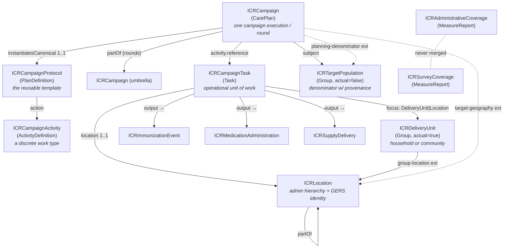

# ICR FHIR IG v0.1 — Reviewer's Explainer
`v0.3.1 · Last modified Jun 12, 2026 at 5:03 PM EDT`

> [!note] What this document is A component-by-component walkthrough of the draft FHIR IG in `ig/`, written for review. For every artifact it covers **what it is**, **the rationale** (with pointers back to [[icr-v1]] sections), and **questions worth asking** before this hardens into v1.0. It describes the IG exactly as committed — every cardinality, binding, and fixed value below was checked against the FSH source.

> [!tip] v0.3.0 — second-pass revision applied (icr-v1 comments c69–c75) Matt's Jun 12 review comments on the working doc, and the agreed replies, have been **applied to the IG** (commit `6a0ac4b`, SUSHI-clean: 0 errors / 0 warnings) and this doc updated to match. The substance: **ICRHousehold → ICRDeliveryUnit** — one Group profile for households _and_ communities, distinguished by a required `group-kind` code, with `household-location` generalized to `group-location` (c72); a profiled, computable **geography characteristic** on ICRTargetPopulation → Reference(ICRLocation) at any admin level (c70 — closes old §6.2 q2); **operational geography gets a real mechanism** — a new location-type CodeSystem (incl. `supervisory-area` / `operational-area`, bound extensible to `Location.type`, closing old §6.3 q5) plus an `overlays-admin-unit` extension (c74); a **required coded** `task-origin` (pre-planned / field-registered) on ICRCampaignTask (c75); `Task.focus` **narrowed** to `ICRDeliveryUnit | ICRLocation` (the old looseness reason disappeared with the generalization) and `ICRMedicationAdministration.subject` narrowed to `Patient | ICRDeliveryUnit`; and the **campaign-work-vs-routine-Encounter boundary** stated in the background narrative (c71). Three new examples: country Location, community delivery unit, supervisory area.

> [!tip] v0.2.0 — first-pass revision applied The cheap fixes and missing examples from this doc's original §15 checklist have been **applied to the IG** (commit `843ab18`, SUSHI-clean: 0 errors / 0 warnings) and this doc updated to match: FR designations on all five required-binding code systems; MDA ValueSet description corrected; new `SampleDesign` extension on survey coverage; reference-target tightening (target-geography → ICRLocation, planning-denominator → ICRTargetPopulation, household-location → ICRLocation); protocol `action.definition` locked to ICRCampaignActivity; delivery-strategy wired into ICRLocation for sites; Task.focus looseness documented as deliberate; and 7 new examples (activity definition, national umbrella + `partOf` round, Type A site-session task, fixed-post site, national denominator, admin-vs-survey coverage pair). Items needing a project decision (§15) remain open.

* * *
## 1. Orientation — what's in the IG
The IG consists of FHIR Shorthand (FSH), compiled by SUSHI into FHIR R4 artifacts.

| Layer | Count | Artifacts |
| --- | --- | --- |
| **Profiles — campaign architecture** | 4   | ICRCampaignProtocol (PlanDefinition), ICRCampaign (CarePlan), ICRCampaignActivity (ActivityDefinition), ICRCampaignTask (Task) |
| **Profiles — population & geography** | 3   | ICRDeliveryUnit (Group — household/community), ICRTargetPopulation (Group), ICRLocation (Location) |
| **Profiles — delivery events** | 3   | ICRImmunizationEvent (Immunization), ICRMedicationAdministration (MedicationAdministration), ICRSupplyDelivery (SupplyDelivery) |
| **Profiles — coverage** | 2   | ICRAdministrativeCoverage (MeasureReport), ICRSurveyCoverage (MeasureReport) |
| **Extensions** | 23  | See §8 |
| **CodeSystems** | 12  | campaign-type, delivery-strategy, record-origin, missed-reason, noncompliance-reason, denominator-source, data-lineage, coverage-source, group-kind, task-origin, location-type, group-characteristic |
| **ValueSets** | 13  | One per code system (except group-characteristic, used as a fixed code), plus a narrowed independent-coverage set and an ATC-based MDA medication set |
| **Example instances** | 22  | A coherent measles–rubella SIA scenario (umbrella + round, Type A & B tasks, coverage pair, country→dwelling hierarchy, household + community delivery units, supervisory area) + an MDA event + an ITN delivery (§11) |
| **Narrative pages** | 2   | `index.md` (home), `background.md` (design rationale & open questions) |

File map (`ig/input/fsh/`): `aliases.fsh`, `codesystems.fsh`, `valuesets.fsh`, `extensions.fsh`, `profiles-campaign.fsh`, `profiles-population.fsh`, `profiles-delivery.fsh`, `profiles-coverage.fsh`, `examples.fsh`.

**Build:** `sushi build .` compiles FSH → JSON; `./_genonce.sh` renders the IG website (needs Java 17+). The commit is SUSHI-clean (compiles without errors).

* * *
## 2. IG metadata (`sushi-config.yaml`)
| Field | Value | Notes |
|---|---|---|
| `id` | `unicef.fhir.icr` | NPM-style package id |
| `canonical` | `https://fhir.icr.unicef.org` | Base URL of every profile/extension/CS/VS |
| `name` / `title` | `ICR` / "Integrated Campaign Registry (ICR) Implementation Guide" | |
| `status` / `version` | `draft` / `0.1.0` | |
| `fhirVersion` | `4.0.1` | FHIR **R4** (per proposal) |
| `license` | `Apache-2.0` | |
| `jurisdiction` | UN M49 `001` "World" | Global IG, not country-specific |
| `copyrightYear` | `2026+` | |
| `releaseLabel` | `ci-build` | |
| `publisher` | "UNICEF Integrated Campaign Registry project (Ona + Crosscut)", url `https://ona.io` | |
| `menu` | Home, Background, Artifacts | |
| `parameters` | `show-inherited-invariants: false`, `shownav: true` | |

{==**Rationale.** The canonical `https://fhir.icr.unicef.org` stakes out a UNICEF-owned namespace; the same base hosts the two provisional identifier-system URIs (§3). The toolchain (FSH/SUSHI/IG Publisher) deliberately matches WHO SMART Guidelines practice (working doc §11).==}{>>These are all open questions we need to determine.  Don't know yet.<<}{id="c1" by="mberg" at="2026-06-12T20:19:31.927Z"}{>>Understood — all four stay open. Nothing in the IG hardens them yet: canonical URL, publisher attribution, package id, and dependency declarations are each a one-line edit until first publication, after which the canonical becomes painful to change. Suggest batching all four for the first UNICEF technical review. Want a Linear task to track that batch, or fold it into an existing review milestone?<<}{id="c22" by="claude" at="2026-06-12T21:03:09.000Z" re="c1"}

> [!warning] Questions
> 
> 1. **Canonical URL ownership** — does UNICEF actually control `fhir.icr.unicef.org` (or intend to)? Changing canonicals after publication is painful; this needs early confirmation.
>   
> 2. **Publisher attribution** — is "(Ona + Crosscut)" with `ona.io` as URL the right public attribution, or should UNICEF be the publisher of record?
>   
> 3. **No dependencies declared** — the background page commits to aligning with WHO SMART Immunizatio{==ns / the I==}{>>hello<<}{id="c43" by="mberg" at="2026-06-12T22:23:18.497Z"}mmunization DAK, but the config declares no dependency on it (or on IHE mCSD, etc.). Intentional for v0.1, but worth deciding when the dependency gets declared and what "alignment" concretely means.
>   
> 4. `id: unicef.fhir.icr` — confirm this fits the package-naming convention UNICEF wants (most are `<org>.fhir.<scope>`, so it's plausible, but it's permanent).
>   

* * *
## 3. Aliases & identifier systems (`aliases.fsh`)
Three groups:

- **External terminologies:** `$CVX` (`http://hl7.org/fhir/sid/cvx`, vaccine codes), `$MeasurePopulation` (the HL7 measure-population code system, used by the coverage examples), `$ATC` (`http://www.whocc.no/atc`, WHO drug classification), `$VaccineCodeVS` (the core FHIR vaccine-code ValueSet).
  
- **ICR identifier-system URIs** (explicitly marked _provisional — to be confirmed before v1.0_):
  
  - `$GERSId = https://fhir.icr.unicef.org/identifiers/overture-gers` — Overture Maps GERS IDs
    
  - `$PCode = https://fhir.icr.unicef.org/identifiers/pcode` — OCHA P-codes
    
- **ICR code systems:** twelve `$...` aliases, one per CodeSystem in §10.
  

{==**Rationale.** GERS and P-codes need _some_ system URI to live under i==}{>>Add as a task in linear to figure out how to add a URI for overture gers.  Speak to the foundation about this.<<}{id="c2" by="mberg" at="2026-06-12T20:21:12.610Z"}{>>I need more info on how these are supposed to work.  Can you point me towards docs or explain what this system URI would contain and it's purpose?<<}{id="c3" by="mberg" at="2026-06-12T20:21:46.568Z" re="c2"}{>>How it works: every FHIR Identifier is a PAIR — `system` (a URI naming the namespace) + `value` (the ID itself). The system URI doesn't "contain" anything and doesn't need to resolve to a webpage; its only job is to make the value globally unambiguous. Without it, "08f2a3b4…" is just a string; with system = our GERS URI, any consumer knows "this is an Overture GERS ID" and can join on it safely — that's the entire mechanism behind multi-system identity on ICRLocation (GERS + P-code + national codes side by side, each tagged by its system). Convention is that the org that OWNS the namespace publishes the URI (e.g. CVX's is `http://hl7.org/fhir/sid/cvx`). Overture hasn't published one, so we minted a provisional URI under our own canonical — works fine, but if an official one appears later, stored data needs migrating; hence BERG-46. Docs: FHIR Identifier — hl7.org/fhir/R4/datatypes.html#Identifier; system-URI guidance — hl7.org/fhir/R4/terminologies-systems.html; NamingSystem (the FHIR resource for declaring such namespaces, which the IG can ship) — hl7.org/fhir/R4/namingsystem.html; GERS itself — docs.overturemaps.org/gers.<<}{id="c24" by="claude" at="2026-06-12T21:03:09.000Z" re="c3"}{>>Task filed: [BERG-46](https://linear.app/recodelabs/issue/BERG-46/determine-the-fhir-identifier-system-uri-for-overture-gers-ids-engage) — review GERS docs, engage the Overture Foundation, check the HL7 terminology registry, decide adopt-vs-mint, same check for P-codes.<<}{id="c23" by="claude" at="2026-06-12T21:03:09.000Z" re="c2"}n `Location.identifier`; parking them under the ICR canonical is the pragmatic v0.1 choice. CVX/ATC/GS1 as the international product-code backbone is working doc §8.

> [!warning] Questions
> 
> 1. **Should ICR mint the GERS/P-code system URIs at all?** If Overture or OCHA ever publish official URIs, every stored identifier would need migration — or ICR's URIs become permanent aliases. Worth raising on chat.fhir.org / with Overture.
>   
> 2. GS1 is named in the narrative ("commodity (GS1)") but has **no alias and no binding** anywhere — `ICRSupplyDelivery.suppliedItem.item[x]` is left uncoded. Intentional looseness or a gap?
>   

* * *
## 4. {==The architecture at a glance==}{>>The proposed architecture looks good.  General question - is it normal to have a name like ICRCampaign in the profile vs just using Campaign or CampaignTask.  ICRCampaignTask looks weird.  Can we just say ICR on the top so the resources can be cleaner? That would be my preference but I don't know what's normal here.<<}{id="c4" by="mberg" at="2026-06-12T20:23:34.073Z"}{>>The prefix is the strong convention, and there's a real reason: profile NAMES live in a global namespace (the canonical URL ecosystem) where bare names collide — every IG that defined "Patient" or "Campaign" would clash the moment two IGs are used together. So US Core says USCorePatient, WHO SMART Immunizations says IMMZ…, IHE mCSD prefixes everything. Two softeners though: (1) the prefix is only the machine name/id — the actual DATA never carries it; an ICRCampaign instance is still just a CarePlan resource that claims conformance via meta.profile; (2) the human-facing Title is free — we can render pages as "Campaign", "Campaign Task", "Delivery Unit" while names stay ICRCampaign etc. I'd keep the prefixed names (ecosystem convention, zero collision risk) and drop "ICR " from the Titles if you want cleaner reading — say the word and it goes in the next IG pass.<<}{id="c25" by="claude" at="2026-06-12T21:03:09.000Z" re="c4"}{>>ok thanks for the explanation. this sounds good. let's keep it. glad it's not in the actual fhir resources in the DB itself. this makes sense.<<}{id="c45" by="mberg" at="2026-06-13T01:18:25.272Z" re="c25"}
FHIR has no native `Campaign` resource, so the IG profiles core will be based on the CarePlan resource.

Reading order for a reviewer: protocol → campaign → task → delivery events is the _operational_ spine; Group/Location is the _identity_ spine; MeasureReport is the _analytics_ readout. Five cross-cutting invariants recur everywhere (§12): coded delivery strategy, campaign-vs-routine record origin, real-time-vs-reconciled lineage, denominator provenance, and never-merged coverage lineages.

* * *
## 5. Campaign-architecture profiles (`profiles-campaign.fsh`)
### 5.1 {==ICRCampaignProtocol==}{>>Please justify why you chose CampaignProtocol?  Is this the term of art? What other names were considered.  Please show from the reports I shared or do your own research why this is the best term.<<}{id="c5" by="mberg" at="2026-06-12T20:27:44.096Z"}{>>Propose some alternates too.<<}{id="c6" by="mberg" at="2026-06-12T20:28:31.570Z" re="c5"}{>>Honest provenance: "protocol" came from FHIR itself, not from the campaign literature — the spec describes PlanDefinition as the resource for "protocols and order sets", so ICRCampaignProtocol signals to FHIR reviewers exactly which resource and usage pattern they're looking at. The campaign reports' own vocabulary for this concept is looser: they speak of campaign "design", "type", "template", and WHO guidance documents ("a measles SIA per WHO field guide"). Alternates, with trade-offs — (1) ICRCampaignTemplate: clearest to program managers, weaker FHIR signal; (2) ICRCampaignDefinition: mirrors the resource name (PlanDefinition), neutral but bland; (3) ICRCampaignType: matches §3's Type A/B/C language but collides with the campaign-type CODE we already bind (a protocol is more than its type code); (4) keep ICRCampaignProtocol: best FHIR-community legibility, and "protocol" is genuinely used in immunization practice (protocolApplied on Immunization, "vaccination protocol"). My ranking: Protocol > Template > Definition > Type. If the primary audience for profile names is FHIR reviewers (it is, at IG-review stage), keep Protocol; if you want, I can do a focused pass through the three research reports + WHO SIA field guides to check the term of art and post the evidence here.<<}{id="c26" by="claude" at="2026-06-12T21:03:09.000Z" re="c6"}{>>Ok let's stick with protocol<<}{id="c42" by="mberg" at="2026-06-12T21:11:32.318Z" re="c26"} — `PlanDefinition`
_The reusable, version-controlled template for a campaign type — what a measles SIA_ **_is_** _(products, age bands, activity sequence, coverage goals), instantiated by every execution in every country._ (working doc §7.1)

| Element | Constraint |
|---|---|
| `status`, `version`, `title` | MS |
| `type` | **1..1 MS**, bound **required** to ICRCampaignTypeVS |
| `subject[x]` | MS — "Target population definition (age band, eligibility)" |
| `goal` | MS — "Coverage targets / thresholds (e.g. ≥95% admin coverage; ≥65% epidemiological coverage for LF)" |
| `action` | MS — "The activity sequence, instantiated as ICRCampaignActivity definitions" |
| `action.definition[x]` | MS, only `Canonical(ICRCampaignActivity)` — the activity wiring is enforced, not just narrated |
| `extension[deliveryStrategy]` | **1..\* MS** — "Delivery strategies this protocol uses — campaigns routinely mix them" |

**Rationale.** Separating protocol from execution is design decision #2: a country defines "measles–rubella SIA, 9m–14y" once and every district/round instantiates it, giving cross-campaign comparability for free. Delivery strategy is **mandatory and repeatable** at protocol level because hybrid strategies are the norm (background page: "an ITN campaign is B then A").

> {==[!warning] Questions==}{>>It would be helpful to get an example of what a campaign protocols would look. i don't really understand how this is structured.<<}{id="c7" by="mberg" at="2026-06-12T20:32:58.665Z"}{>>There IS one in the IG — `example-mr-sia-protocol` (ig/input/fsh/examples.fsh) — and its shape in plain terms: a protocol is the reusable recipe card for a campaign type. Concretely it holds (1) `type` = vaccination-sia — what kind of campaign this is; (2) the delivery strategies it uses — fixed-post AND house-to-house, because MR SIAs do both; (3) `goal` — "≥95% administrative coverage in every district, verified by post-campaign survey"; (4) `action` — the activity sequence, here one action pointing at the "Administer MCV, 9m–14y" ActivityDefinition (a bigger protocol would list several: vaccinate, then mop-up, each its own action); (5) version "1.0.0" — protocols are versioned, so "MR SIA per 2026 guidance" vs 2028 revision are distinct citable things. Then EVERY execution — national umbrella, each district round — points at it via instantiatesCanonical, which is what makes "all MR SIA rounds anywhere, comparable" a query instead of a research project. I'll inline a rendered walk-through of this example into §5.1 in the next rewrite so the structure is visible right here in the memo.<<}{id="c27" by="claude" at="2026-06-12T21:03:09.000Z" re="c7"}{>>great please add these details with an example inline in the doc when you do a rewrite.<<}{id="c44" by="mberg" at="2026-06-13T01:17:45.552Z" re="c27"}
> 
> 1. `type` is 1..1, but `PlanDefinition.type` semantically distinguishes plan kinds (order-set vs protocol…) in base FHIR — here it's repurposed for campaign type. Reasonable, but reviewers may ask whether `topic` or a dedicated extension is cleaner.
>   
> 2. No `library`/eligibility-logic story yet (age-band eligibility as CQL?) — presumably deferred along with the DAK alignment.
>   
> 
> _Resolved in first pass:_ `action.definition[x]` is now constrained to `Canonical(ICRCampaignActivity)`, so the protocol→activity wiring is machine-enforced.
### 5.2 ICRCampaign — `CarePlan` (the keystone)
_A specific campaign execution. Begins life as a microplan (_`intent=plan`_) and evolves into the execution record as Tasks complete and coverage accumulates. Rounds are sibling ICRCampaigns under an umbrella campaign via_ `partOf`_._ (working doc §7.2, §6.3)

| Element | Constraint |
|---|---|
| `instantiatesCanonical` | **1..1 MS**, only `Canonical(ICRCampaignProtocol)` |
| `status` | MS — "draft → active → completed" |
| `intent` | MS — "plan (microplan) transitioning to order (execution)" |
| `category` | **1..\* MS**, bound **required** to ICRCampaignTypeVS |
| `subject` | MS, only `Reference(ICRTargetPopulation)` |
| `period` | **1..1 MS** — campaign/round dates |
| `careTeam`, `addresses` | MS (`addresses` = the disease/condition targeted) |
| `partOf` | only `Reference(ICRCampaign)` — umbrella/round pattern |
| `activity` | MS; `activity.reference` only `Reference(ICRCampaignTask)` |
| Extensions | `campaignRound` 0..1 MS (positiveInt) · `targetGeography` 0..\* MS (→Location) · `planningDenominator` 0..1 MS (→Group) · `dataLineage` 0..1 (code, *not* MS) |

**Rationale.** CarePlan won over a custom resource, Encounter, and RequestGroup (design decision #1) because it natively supports plan→execution lifecycle, `instantiatesCanonical`, population subjects, and `partOf` composition. **Every campaign must point at its protocol** (1..1) — that is what makes campaign data reusable rather than ad-hoc. `subject` typed to ICRTargetPopulation makes the denominator a first-class participant rather than an afterthought; `planningDenominator` additionally disambiguates _which_ estimate is THE denominator when several exist (§6.2).

> [!warning] Questions
> 
> 1. `instantiatesCanonical` **1..1 is strict** — every ad-hoc/emergency campaign must first author a protocol. Is that the intended forcing function, or does it deserve a relief valve (0..1 with a flag)?
>   
> 2. {==`subject` only ICRTargetPopulation: a sub-national CarePlan whose subject is a _geography_ rather than a population must route through `targetGeography` instead. Is the split (subject=who, extension=where) clearly enough documented?==}{>>I don't understand this.  Please explain further.  A campaign could contain multiple target population/geographies.  They may be nested too.<<}{id="c8" by="mberg" at="2026-06-12T20:34:15.253Z"}{>>Unpacking. CarePlan.subject is a single slot answering "WHO is this plan for" — we point it at one ICRTargetPopulation Group (e.g. "children 9m–14y, Kambia, 48,250"). "WHERE" is separate: the target-geography extension, which is 0..* — a campaign can list MULTIPLE geographies already. Your multiple/nested case is exactly what the umbrella/round pattern carries: the national umbrella CarePlan has the national denominator as subject; each district round (partOf the umbrella) has its own district-level population; nesting falls out of partOf + each population's geography characteristic pointing at its admin level. So: one subject PER CarePlan, but as many CarePlans as the campaign has nested scopes — and within one round, finer-grained populations (per-ward targets) exist as additional ICRTargetPopulation Groups linked by geography, they just aren't THE subject. The memo's question was narrower: is this who-vs-where split documented clearly enough in the IG narrative — your confusion answers that (no). I'll add a worked explanation + diagram of the national→district→ward population stack in the rewrite.<<}{id="c28" by="claude" at="2026-06-12T21:03:09.000Z" re="c8"}
>   
> 3. The umbrella campaign is itself an ICRCampaign, so it too needs `instantiatesCanonical`, `category`, `subject`, `period` — i.e. the umbrella must carry its own (national) denominator. The new umbrella example demonstrates this works, but confirm it's the intended modeling burden.
>   
> 4. {==`dataLineage` is the only campaign extension _not_ marked MS — deliberate (lineage matters more on Task/MeasureReport) or an oversight?==}{>>I don't understand this elaborate further.<<}{id="c9" by="mberg" at="2026-06-12T20:35:14.865Z"}{>>Background first: MS = Must Support, a FHIR conformance flag meaning "implementations claiming conformance must be able to populate and process this element" — it's about implementation obligation, not whether data is required (that's cardinality). The observation here: ICRCampaign carries four extensions; three are flagged MS (campaign round, target geography, planning denominator) but dataLineage — the realtime-vs-reconciled flag — is not. Practical consequence: a conformant implementation may completely ignore lineage at the campaign level. That's defensible (lineage filtering really happens on Tasks and MeasureReports — a CarePlan is mostly metadata that doesn't get "reconciled"), but it was never stated as a decision, which is why I flagged it. Recommendation: mark it MS for consistency — costs implementers almost nothing — or write one sentence of rationale for why campaign-level lineage is optional. I'll do the former in the next IG pass unless you prefer the latter.<<}{id="c29" by="claude" at="2026-06-12T21:03:09.000Z" re="c9"}
>   
> 5. `activity.reference` locked to Task only — excludes the R4 alternative `activity.detail` (inline activities). Worth stating in narrative that inline activities are out.
>   
### 5.3 ICRCampaignActivity — {==`ActivityDefinition`==}{>>Woud really help to have some real examples.<<}{id="c10" by="mberg" at="2026-06-12T20:36:45.686Z"}{>>One exists (`example-mcv-activity`: "Administer MCV, 9m–14y" — kind=Task, product=CVX 05, dosage "0.5 mL subcutaneous") but agreed, one isn't enough to make the concept land. In the rewrite I'll inline a trio spanning the campaign types: (1) "Administer albendazole, 5–14y" — ATC P02CA03, dose-pole-derived tablet count (Type C MDA); (2) "Distribute 1 ITN per 2 household members" — GS1 commodity, household-level (Type B-then-A); (3) "Spray interior structure walls" — IRS, structure-level (Type B). Together with the MCV one they show the point of the layer: the protocol carries the clinical/commodity content ONCE, and thousands of Tasks instantiate it without repeating it.<<}{id="c30" by="claude" at="2026-06-12T21:03:09.000Z" re="c10"}{>>Add this to the main text during rewrite<<}{id="c46" by="mberg" at="2026-06-13T01:20:49.728Z" re="c30"}
_A discrete work type within a campaign — "administer albendazole to children 5–14", "distribute ITNs to households" — instantiated as ICRCampaignTask resources._ (working doc §7.3)

| Element | Constraint |
|---|---|
| `status` | MS |
| `kind` | fixed `#Task` |
| `code` | **1..1 MS** — "The intervention: vaccinate / treat / distribute / spray" |
| `product[x]` | MS — "Vaccine (CVX) / drug (ATC) / commodity (GS1)" |
| `dosage` | MS — "Where applicable; dose-pole logic references an Observation" |
| `extension[deliveryStrategy]` | 0..1 MS |

{==**Rationale.** `kind = #Task` hard-wires the instantiation target: activities become Tasks, not ServiceRequests. Product and dosage ride on the definition so the protocol carries the clinical content once.==}{>>Do activityies need to have a focus? or can that be defined at the task level.  Eg if the activity is spray house then the target would be the household structure.  if it's vaccinate it would be a child in the household, if it's get a fly trap it wouldl be the fly trap.<<}{id="c11" by="mberg" at="2026-06-12T20:42:16.549Z"}{>>Exactly as you intuit: defined at the Task level. The ActivityDefinition is deliberately target-agnostic — it says WHAT (spray / vaccinate / set trap, with product and dosage) and at most what KIND of target is eligible (subject[x] can say "children 9m–14y" as a category); the concrete thing acted on — THIS structure, THIS child's household, THIS trap site — is Task.focus, per unit of work. Your three examples land as: spray-house activity → Tasks whose focus is each structure (a Location); vaccinate activity → Tasks whose focus is the household Group, with the per-child detail in the Immunization records hanging off Task.output (see my c32 reply below on the per-member question); fly-trap activity → Tasks whose focus is the trap site (a Location). One honest gap your examples expose: vector-control work (traps, larviciding) is in neither the working doc's program scope nor the delivery-event profiles — fine for v0.1, but if entomological surveillance is in ICR's future, flag it now and I'll add it to the open questions.<<}{id="c31" by="claude" at="2026-06-12T21:03:09.000Z" re="c11"}{>>flesh this out in the rewrite<<}{id="c47" by="mberg" at="2026-06-13T01:21:24.473Z" re="c31"}

> [!warning] Questions
> 
> 1. `product[x]` is MS but **unbound** — CVX/ATC are mentioned in the `^short` only. The delivery-event profiles do bind product codes; should the definition side bind too, for consistency?
>   
> 2. `deliveryStrategy` is 0..1 here but 1..* on the protocol and 1..1 on the Task — the asymmetry is defensible (strategy resolved per-task) but worth a sentence of narrative.
>   
> 
> _Resolved in first pass:_ an example now exists (`example-mcv-activity`), and the protocol example wires it in via `action.definitionCanonical`.
### 5.4 ICRCampaignTask — `Task`
_The assignable, trackable operational unit of work — one Task per site-session (Type A, focus = the site Location) or per household_ {==_(Type B, focus = the household Group)_==}{>>This can also go down to a household member within a household.  Eg a polio would be at the household member level not household.  The task could be to visit the household but would be recored with multiple immunizations. would that close one task or would you record a task for each child vaccinated?<<}{id="c12" by="mberg" at="2026-06-12T20:43:38.912Z"}{>>As drafted: ONE Task per household visit, closed when the visit completes — and the per-child records are the Immunization resources hanging off Task.output (one per child vaccinated, each pointing at its Patient). So polio IS captured at member level, just in the delivery-event layer rather than the Task layer: the Task is the unit of WORK (one doorstep visit), the Immunizations are the units of SERVICE (three drops given). The IG's mop-up example shows exactly this — one household Task, output → the MCV dose for Aminata. You COULD model a Task per child, but it multiplies Task volume ~5× (the open-question-#1 scale concern) while adding nothing the Immunization records don't already carry. The one place a per-child Task IS the right tool: follow-up — a specific missed/zero-dose child spawns a new Task targeting that child (the §4.4 routine-enrolment pattern). Caveat: Task.focus is currently narrowed to ICRDeliveryUnit|ICRLocation, so a child-targeted follow-up Task doesn't conform — I'll widen focus to include Patient (or add the follow-up pattern explicitly) in the next IG pass. Good catch.<<}{id="c32" by="claude" at="2026-06-12T21:03:09.000Z" re="c12"}{>>ok this sounds good. let's document this better in the text during the rewrtie but call out the exception.<<}{id="c48" by="mberg" at="2026-06-13T01:23:26.588Z" re="c32"}_. Tasks may be pre-planned from the microplan or field-registered on discovery (the required task-origin code records which). Whether Tasks are assigned at village or household level is a configuration choice._ (working doc §7.4)

| Element | Constraint |
|---|---|
| `status` | MS — "requested → in-progress → completed / failed" |
| `intent`, `for`, `owner`, `executionPeriod`, `output` | MS |
| `code` | **1..1 MS** |
| `focus` | **1..1 MS**, only `Reference(ICRDeliveryUnit or ICRLocation)` — "site Location (Type A) or household/community delivery-unit Group (Type B/C)" |
| `location` | **1..1 MS**, only `Reference(ICRLocation)` |
| `output` | MS — "references to Immunization / MedicationAdministration / SupplyDelivery, or aggregate counts" |
| Extensions | `deliveryStrategy` **1..1 MS** · `taskOrigin` **1..1 MS** (code: pre-planned \| field-registered, required binding) · `housesVisited` 0..1 · `childrenPresent` 0..1 · `childrenAbsent` 0..1 · `missedReason` 0..\* · `noncomplianceReason` 0..\* · `fingerMarked` 0..1 · `dataLineage` 0..1 |

**Rationale.** This is where campaign type A/B/C polymorphism lands: the _same_ profile serves a fixed-post site-session and a house-to-house visit, discriminated by `focus` type and the mandatory coded `deliveryStrategy`. The optional count/reason extensions are exactly the house-to-house data elements (houses visited, present/absent, missed/noncompliance reasons, finger marking) that only exist for strategy B — they're 0..x because they're meaningless for fixed-post tallies. `taskOrigin` **is mandatory** (the same required-coded-attribute pattern as delivery strategy and record origin): Tasks need not be pre-generated — a team that discovers an unenumerated household creates the ICRDeliveryUnit and its Task on the spot — and the count of field-registered Tasks per area is itself a measurement of how incomplete the microplan's enumeration was, feeding the next round's denominators. Delivery events hang off `Task.output` because **R4 Immunization has no** `basedOn` (the reverse link doesn't exist; see §7).

> [!warning] Questions
> 
> 1. **Task granularity at scale** is the IG's own #1 open question (one Task per household × national campaign = millions of Tasks). The profile keeps both options open — and field-registration (lazy Task creation on discovery) softens the pre-generation side of the worst case — but make sure pilots test the household-level path.
>   
> 2. _(Resolved in second pass.)_ `focus` is now narrowed to `ICRDeliveryUnit or ICRLocation` — the old reason for looseness (Type C community Groups weren't ICRHouseholds) disappeared when the household profile generalized to ICRDeliveryUnit.
>   
> 3. The count extensions (`housesVisited`, `childrenPresent`/`Absent`) are unsignedInt **point values** — no age-band or sex disaggregation. Real tally sheets disaggregate; is the answer "use `output` with aggregate counts" and if so, where's the pattern documented?
>   
> 4. `missedReason`/`noncompliance` at Task level aggregates over the whole visit — per-child reasons would need person-level records. Worth stating which level the data is expected at.
>   
> 5. No constraint ties `output.valueReference` to the three delivery-event profiles — the `^short` says it; the profile doesn't enforce it.
>   
> 6. `taskOrigin` 1..1 means **retrofitting existing datasets requires assigning an origin** — acceptable forcing function, or should historical imports get a third code (`unknown`)?
>   

* * *
## 6. Population & geography profiles (`profiles-population.fsh`)
### 6.1 ICRDeliveryUnit — `Group` (household / community)
_The actual Group of people a campaign Task acts on — a household (Type B house-to-house) or a community (Type C MDA), distinguished by the required group-kind code. The validated Group + Location pattern, generalized: the Group is who, the Location (group-location extension) is where — the dwelling for a household, the settlement or community point for a community. Type A's delivery unit is a site, which is a Location, not a Group._ (working doc §3.2, §7.5, §9.1)

| Element | Constraint |
|---|---|
| `type` | fixed `#person` |
| `actual` | fixed `true` |
| `code` | **1..1 MS**, bound **required** to ICRGroupKindVS (`household` \| `community`) |
| `member` | MS; `member.entity` only `Reference(Patient)` |
| `quantity` | MS — "Group size where individuals are not enumerated" |
| `extension[groupLocation]` | **1..1 MS** → `Reference(ICRLocation)` — the dwelling (household) or settlement/community point (community) |

**Rationale.** Separating _who_ (Group) from _where_ (Location) means the location's identity (GERS building/place ID) survives group composition changes, and the group survives re-mapping. The second-pass generalization (was: ICRHousehold) reflects that households and communities are the _same pattern at two scales_ — one profile with a coded kind beats two near-identical profiles, and it lets `Task.focus` and `MedicationAdministration.subject` be narrowed to ICR-conformant targets. `quantity` covers the common case where campaigns count members without registering individuals — person-level `member` entries are optional by design.

> [!warning] Questions
> 
> 1. {==No `Group.identifier` guidance — how is a _household_ itself identified across campaigns (vs its dwelling)? The cross-campaign record-linkage question is acknowledged as open; flagging that the profile is silent here.==}{>>I think an open question is should the structure be linked to the household or can it be different.  For some campaigns households will go to a village center to receive the service so that needs to be decoupled.<<}{id="c13" by="mberg" at="2026-06-12T20:45:06.704Z"}{>>Good news: they're already decoupled. The groupLocation extension on the household answers "where does this household LIVE" (the dwelling — its stable identity anchor), while where service happened is a different element entirely: Task.location / Immunization.location. So your village-center case works today: household's groupLocation stays the dwelling; the Task for the distribution has location = the village center; the household members' delivery events record the center too. The dwelling link never moves. What I'd add in the rewrite is a sentence making this explicit — "groupLocation is residence, not service point" — because you're the second person to read it as where-service-happens, which means the doc invites the misreading.<<}{id="c33" by="claude" at="2026-06-12T21:03:09.000Z" re="c13"}
>   
> 2. {==`actual = true` + `type = #person` is right, but `member.entity` locked to Patient excludes RelatedPerson — fine for campaigns, just confirming it's deliberate.==}{>>Need to discuss this further.  Is everyone in fhir a patient or are there person resource?<<}{id="c14" by="mberg" at="2026-06-12T20:46:02.602Z"}{>>FHIR has four person-shaped resources: Patient (anyone receiving care — despite the name, a healthy child getting a polio drop or a household member receiving a net is a Patient; it's the resource ALL clinical/delivery records point at, e.g. Immunization.patient can ONLY reference Patient), RelatedPerson (someone in relation to a patient — a caregiver consenting for a child), Practitioner (workers — our CDDs and vaccinators), and Person (a linkage resource: one human matched across multiple Patient/Practitioner records in different systems — identity plumbing, not a care-record subject; it may matter later for cross-campaign person dedup, open question #9). So for ICR: every enumerated household member who might receive a service is a Patient — the standard pattern in household-registration systems (it's how OpenSRP does it). And a correction to my own q2 while we're here: R4 Group.member doesn't permit RelatedPerson at all (that arrives in R5), so "locked to Patient" excludes Practitioner/Device etc., not RelatedPerson — I'll fix that sentence in the rewrite.<<}{id="c34" by="claude" at="2026-06-12T21:03:09.000Z" re="c14"}
>   
> 3. Is two kinds enough? School cohorts ride on the school _Location_ today; if a country wants an enrolled-children _Group_ per school, `group-kind` needs a `school-cohort` code (cheap to add later — the VS is ICR-owned).
>   
> 
> _Resolved in first pass:_ `groupLocation` (née `householdLocation`) targets `Reference(ICRLocation)`. _Resolved in second pass:_ the household/community split (working-doc comment c72) — one profile, required coded kind.
### 6.2 ICRTargetPopulation — `Group`
_A target-population denominator: a conceptual cohort (_`actual=false`_) with a count, eligibility characteristics, and — critically — source and date provenance. Multiple competing estimates per geography are retained; exactly one is flagged as the planning denominator._ (working doc §7.6, §4.2)

| Element | Constraint |
|---|---|
| `type` | fixed `#person` |
| `actual` | fixed `false` |
| `quantity` | **1..1 MS** — the denominator count |
| `characteristic` | MS — "Age band, sex, eligibility rule, geography"; **sliced (pattern on `code`, open)** |
| `characteristic[geography]` | 0..1 MS — `code` fixed to `icr-group-characteristic-cs#geography`; `value[x]` only `Reference(ICRLocation)`; `exclude` fixed `false` |
| Extensions | `denominatorSource` **1..1 MS** (CodeableConcept, extensible) · `estimateDate` **1..1 MS** (date) · `isPlanningDenominator` 0..1 MS (boolean) · `confidence` 0..1 (string) |

{==**Rationale.** Design decision #6 ("denominator-first"): the denominator is the dominant error source in campaign analytics, so an estimate without source+date is not allowed to exist — both provenance extensions are **mandatory**. Keeping _competing_ estimates (census projection vs GRID3 vs microcensus) as sibling Groups and flagging one==}{>>This sounds good. can we illustrate with some examples?<<}{id="c15" by="mberg" at="2026-06-12T20:47:18.444Z"}{>>The IG's two example denominators already show half the story — Kambia district: 48,250 from GRID3 (Jan 2026), flagged planning denominator; national: 2,150,000 from census projection (Nov 2025) — i.e. different sources at different levels coexisting. What's missing is true COMPETITION: two estimates for the SAME geography. In the rewrite I'll add a third instance — Kambia again, but from house-to-house microcensus enumeration (say 51,800, Mar 2026, isPlanningDenominator=false) — so the example set shows the actual scenario the design exists for: GRID3 says 48k, enumeration says 52k, both retained with source+date, exactly one flagged as what coverage is computed against, and the 7% disagreement is visible instead of silently overwritten. (That disagreement is the §4.1 Cuamba lesson upstream: the denominator you pick changes the coverage you report.)<<}{id="c35" by="claude" at="2026-06-12T21:03:09.000Z" re="c15"} (`isPlanningDenominator`) preserves the audit trail instead of overwriting. The second-pass **geography characteristic** makes the estimate's scope computable at **any level** — country, district, ward, settlement, or operational area (working-doc comment c70: target populations are _not_ household-bound; that's what ICRDeliveryUnit is for) — so estimates are joinable to the location hierarchy by reference, not by parsing `name`.

> [!warning] Questions
> 
> 1. **"Exactly one is the planning denominator" is not machine-enforced** — no invariant prevents two Groups for the same geography both setting the flag true (or none). Enforceable only with an invariant scoped to "same geography + campaign", which is hard; the `ICRCampaign.planningDenominator` extension (which _is_ singular, 0..1) may be the real enforcement point. Worth documenting that resolution.
>   
> 2. _(Resolved in second pass.)_ Geography linkage is now a profiled characteristic slice — `code = geography`, `valueReference(ICRLocation)` — and both example denominators exercise it (district and country). Remaining nuance: the slice is 0..1, so a geography-less estimate is still conformant; consider 1..1 once pilot data confirms every estimate has a Location.
>   
> 3. `confidence` as free string — fine for v0.1; consider coded confidence later.
>   
### 6.3 ICRLocation — `Location`
_The most-customized ICR resource: nested administrative hierarchy (6+ levels), operational geography linkable-but-distinct from admin units, GeoJSON boundaries, and multi-system geospatial identity — GERS IDs as the preferred cross-campaign join key, with P-codes and national codes as coequal aliases._ (working doc §7.7, §9)

| Element | Constraint |
|---|---|
| `name`, `status` | MS |
| `partOf` | MS, only `Reference(ICRLocation)` — "country → region → district → ward → settlement" |
| `physicalType` | MS — "jurisdiction / site / building / household" |
| `type` | MS, bound **extensible** to **ICRLocationTypeVS** — admin-unit / settlement / facility / school / community-distribution-point / temporary-post / household / **supervisory-area** / **operational-area** |
| `position` | MS — GPS point |
| `identifier` | MS, **sliced by `system` (value discriminator, open)**: `gers` 0..1 MS (system = `$GERSId`) · `pcode` 0..1 MS (system = `$PCode`) |
| `extension[boundary]` | 0..1 MS — GeoJSON Attachment, "the geometry Crosscut enriches and pushes back" |
| `extension[deliveryStrategy]` | 0..1 — "For delivery sites (fixed/temporary posts): the strategy this site serves" |
| `extension[overlaysAdminUnit]` | 0..\* → `Reference(ICRLocation)` — for operational geography: the admin unit(s) this area overlays |

{==**Rationale.** Design decision #8. Open slicing means national location codes coexist with GERS/P-codes without profile changes. The GERS `^short` carries an operationally crucial instruction: **record the Overture release version alongside the ID** (GERS IDs are stable but the registry versions).==}{>>We sohuld be able to assign multiple external ids to locations.  Ideally GERS  Id can be the unique identifier.  the system will need to generate an internal unique location id too.  In many cases new locations will not have a GERS ID.  The system will be built to try and update these new locations with a GERS ID after they have been added in an async way.<<}{id="c16" by="mberg" at="2026-06-12T20:50:18.299Z"}{>>The profile already supports every piece of that workflow: (1) multiple external IDs — identifier slicing is OPEN, so any number of identifier systems coexist (GERS, P-code, national facility code, project codes); (2) internal unique ID — every FHIR resource has a server-assigned Resource.id, so that's free; (3) GERS as 0..1 not 1..1 — precisely because new/unmapped locations won't have one at creation; (4) async enrichment — adding a GERS ID later is just an update to the Location appending the gers identifier slice, with FHIR versioning + Provenance recording when/how it was matched. So nothing blocks the build-flow you describe. What the IG does NOT yet say is that this async-enrichment loop is the EXPECTED lifecycle (create unmatched → conflate → backfill GERS — the §9.1 OSM→Overture loop, operationalized). I'll add that as explicit implementer guidance in the next IG pass, plus one open design point it raises: should an enrichment job also be allowed to MERGE two Locations it discovers are the same place (ties into the dedup open question #9)?<<}{id="c36" by="claude" at="2026-06-12T21:03:09.000Z" re="c16"} The boundary extension mirrors the R5 standard extension on R4 (working doc §10 q6). {==The second-pass additions give **"operational ≠ administrative geography" a real mechanism** (working-doc comment c74): `partOf` can express only _one_ hierarchy, so a supervisory/operational area is typed via the new location-type codes and linked to the admin units it covers via `overlays-admin-unit` — that is what makes it linkable-but-distinct rather than just distinct.==}{>>I don't understand this explain it further.<<}{id="c17" by="mberg" at="2026-06-12T20:53:01.299Z"}{>>Plain version. The admin hierarchy is the official tree: country → district → ward, expressed by each Location's partOf pointing at its single parent. Campaign programs draw their OWN areas that don't respect that tree — a polio supervision zone might cover all of ward 3 plus half of ward 4. Problem: partOf gives a location exactly one parent, so the zone can't sit INSIDE the admin tree without lying about the hierarchy (which ward would be its parent?). Old state of the IG: we said "keep operational areas distinct" but gave you no way to relate them to admin units at all — distinct but UNLINKABLE, so you couldn't answer "which districts does zone 2's data roll up into?". The fix: the zone is its own Location, typed supervisory-area, NOT in any partOf chain, carrying an overlays-admin-unit extension that points at the admin unit(s) it covers (can be several). Concrete: example-supervisory-area "Kambia supervision zone 2" overlays Kambia District — so zone-level tallies can be related to district reporting, while the official hierarchy stays clean. That's all "linkable-but-distinct" means: distinct = not in the admin tree; linkable = the overlays pointer.<<}{id="c37" by="claude" at="2026-06-12T21:03:09.000Z" re="c17"}

> [!warning] Questions
> 
> 1. **Overture release version has no field** — the `^short` says to record it, but there's no extension/element to put it in (Identifier has no version slot; `identifier.period` is a stretch). Needs a concrete pattern before pilot data exists.
>   
> 2. `partOf` only ICRLocation forces the _entire_ hierarchy to be ICR-conformant — pragmatic, but means you can't hang an ICR site off a non-ICR national registry Location without re-profiling it.
>   
> 3. Both GERS and P-code slices are 0..1 — so a Location with **no stable identifier at all** is conformant. Should at least one identifier be required at, say, admin-unit levels?
>   
> 4. The 6+-level `partOf` chain's query performance (deep `Location.partOf` recursion on mobile) is a flagged open question — nothing in the profile mitigates it (no `ancestor` denormalization extension). Fine for v0.1; track it.
>   
> 5. _(Resolved in second pass.)_ `Location.type` is now bound (extensible) to the new ICRLocationTypeVS. Note the base R4 binding on `Location.type` is also extensible (v3 ServiceDeliveryLocationRoleType); re-binding is common IG practice but a strict base-binding validator may flag codes like `supervisory-area` — worth a Connectathon sanity check.
>   
> 6. Should an operational area's `overlays-admin-unit` be **required** when `type = supervisory-area/operational-area`? An invariant could enforce it; left loose for v0.1.
>   

* * *
## 7. Delivery-event profiles (`profiles-delivery.fsh`)
All three share two design constants: a **mandatory** `record-origin` **extension (1..1 MS)** — campaign vs routine, so SIA doses never contaminate routine coverage analytics (working doc §4.4) — and the **Task→event link running through** `Task.output` because R4 Immunization has no `basedOn` element to point back with.
### 7.1 ICRImmunizationEvent — `Immunization`
| Element | Constraint |
|---|---|
| `status`, `patient`, `occurrence[x]`, `location`, `lotNumber`, `manufacturer`, `performer` | MS |
| `vaccineCode` | MS, bound **extensible** to the core FHIR vaccine-code VS (CVX) — "local codes map back via ConceptMap" |
| `protocolApplied` | MS — "Dose number / series — supports multi-dose campaigns (OCV) and routine integration" |
| `extension[recordOrigin]` | **1..1 MS** (code: campaign \| routine, required binding) |

`lotNumber`/`manufacturer` MS = lot accountability (AEFI traceability); `protocolApplied` is the bridge to routine-immunization series logic.
### 7.2 ICRMedicationAdministration — `MedicationAdministration`
| Element | Constraint |
|---|---|
| `status`, `effective[x]` | MS |
| `medication[x]` | only CodeableConcept; bound **extensible** to ICRMDAMedicationVS (WHO ATC) |
| `subject` | MS, only `Reference(Patient or ICRDeliveryUnit)` — "the treated person, **or the community/household delivery-unit Group** for register-level capture" |
| `dosage` | MS — "Tablet count — usually derived from a dose-pole height band Observation" |
| `supportingInformation` | MS — "e.g. the dose-pole Observation the dosage was derived from" |
| Extensions | `recordOrigin` **1..1 MS** · `directlyObserved` 0..1 MS (boolean — MDA DOC protocol) |

The dose-pole pattern (dosage _derived from_ a height-band Observation referenced via `supportingInformation`) is the distinctly-MDA piece; `directlyObserved` captures the supervision protocol that distinguishes "handed out" from "swallowed".
### 7.3 ICRSupplyDelivery — `SupplyDelivery`
| Element | Constraint |
| --- | --- |
| `status` | MS  |
| `suppliedItem`, `suppliedItem.quantity`, `suppliedItem.item[x]` | MS — "GS1 GTIN-coded commodity where applicable" |
| `destination` | MS — "Where the commodity went (post, household)" |
| `extension[recordOrigin]` | **1..1 MS** |

> [!warning] Questions (delivery layer)
> 
> 1. **Aggregate vs individual records** is a flagged open question; these profiles are individual-event-shaped. `ICRMedicationAdministration.subject` pointing at a Group is the aggregate escape hatch — but Immunization.patient cannot be a Group in R4, so **type-A tally-only campaigns have no Immunization representation**; presumably aggregate counts live in `Task.output`/MeasureReport. The narrative should state this split explicitly.
>   
> 2. `vaccineCode` binds to the generic FHIR VS rather than an ICR-curated SIA vaccine subset — fine (extensible), but countries will ask which codes to use for MR/bOPV/nOPV2.
>   
> 3. No GS1 binding/alias for `suppliedItem.item[x]` (§3 q2). The ITN example uses free text only.
>   
> 4. `recordOrigin` is the only mandatory extension — `dataLineage` (realtime/reconciled) is _absent_ from delivery events (it lives on CarePlan/Task/MeasureReport). If individual events arrive in both streams, can a consumer tell? (Presumably via the parent Task — worth one narrative sentence.)
>   

* * *
## 8. Coverage profiles (`profiles-coverage.fsh`)
_Administrative and independently-measured coverage are distinct lineages of the same conceptual quantity — separately profiled, never merged._ (working doc §4.1; the recurring evidence: **Cuamba, Mozambique — ~99% admin vs ~76% survey**.) Measure definitions are meant to align with what ministries already owe: WHO JAP, ICG M&E minimum dataset, ESPEN treatment-coverage schema, WHO EPI — the `Measure` resources themselves are deferred (§13).
### 8.1 ICRAdministrativeCoverage — `MeasureReport`
| Element | Constraint |
| --- | --- |
| `status`, `type`, `reporter`, `group` | MS  |
| `period` | **1..1 MS** |
| Extensions | `coverageSource` **1..1 MS**, **fixed** `valueCode = #administrative` · `denominatorSource` 0..1 MS · `dataLineage` 0..1 MS |
### 8.2 ICRSurveyCoverage — `MeasureReport`
| Element | Constraint |
|---|---|
| `status`, `type`, `reporter`, `group` | MS |
| `period` | **1..1 MS** |
| Extensions | `coverageSource` **1..1 MS**, value bound **required** to ICRIndependentCoverageSourceVS (survey \| lqas \| rcm) · `sampleDesign` 0..1 MS (string — "WHO 30×10 cluster survey…") |

**Rationale.** The "never merge" rule is enforced _structurally_: the admin profile pins `coverageSource` to the single code `administrative`; the survey profile re-binds the same extension to a value set that _excludes_ `administrative`. A resource can't be both. Admin coverage additionally carries its denominator's provenance (because admin coverage is only as good as its denominator) and a realtime/reconciled lineage flag; survey coverage doesn't need either (its denominator is the sample design).

> [!warning] Questions
> 
> 1. MeasureReport-vs-Observation for coverage is a flagged open question; MeasureReport won for v0.1. The strongest argument to document: MeasureReport's numerator/denominator `group.population` structure matches coverage natively.
>   
> 2. Neither profile constrains `measure` (the canonical Measure being reported) — unavoidable until the Measure definitions ship, but it means v0.1 coverage reports aren't yet comparable by measure identity. (The new examples use placeholder canonicals under the ICR namespace.)
>   
> 3. `ICRSurveyCoverage` has no `denominatorSource`/`dataLineage` extensions at all — correct per the rationale above, but confirm survey _reconciliation_ (preliminary vs final survey results) never needs lineage.
>   
> 
> _Resolved in first pass:_ sample design now has a home — the new `SampleDesign` extension (string, 0..1 MS) — and both profiles have examples (`example-admin-coverage` / `example-survey-coverage`, a 99%-vs-76% divergent pair).

* * *
## 9. Extensions (`extensions.fsh`) — all 23
_FHIR has no native campaign semantics; these extensions carry them on profiled core resources._ (working doc §7)

**Campaign mechanics**

| Extension (id) | Context | Type / binding | Card. where used |
|---|---|---|---|
| DeliveryStrategy (`delivery-strategy`) | PlanDefinition, ActivityDefinition, Task, Location | CodeableConcept, **required** → ICRDeliveryStrategyVS | Protocol 1..\*, Activity 0..1, Task 1..1, Location 0..1 |
| CampaignRound (`campaign-round`) | CarePlan | positiveInt | 0..1 |
| TargetGeography (`target-geography`) | CarePlan | Reference(ICRLocation) | 0..\* |
| PlanningDenominator (`planning-denominator`) | CarePlan | Reference(ICRTargetPopulation) | 0..1 |
| RealtimeVsReconciled (`realtime-vs-reconciled`) | CarePlan, Task, MeasureReport | code, **required** → ICRDataLineageVS | 0..1 each |
| TaskOrigin (`task-origin`) | Task | code, **required** → ICRTaskOriginVS (pre-planned \| field-registered) | Task **1..1** |

**House-to-house task data** (all Context: Task)

| Extension (id) | Type / binding |
| --- | --- |
| HousesVisited (`houses-visited`) | unsignedInt |
| {==ChildrenPresent (`children-present`)==}{>>Let's see how common this.  Eg should it say children or do we include target patients or something.  children can be fine jsut want a bit more info on this.<<}{id="c18" by="mberg" at="2026-06-12T20:56:33.978Z"}{>>Where "children" comes from: the house-to-house vocabulary is polio's — doorstep tallies count children <5 present/absent, and the working doc inherited it. But the same present/absent-at-the-door concept applies wherever H2H is used for other targets: MDA treats whole communities and school-age bands, ITN registration counts household members, vitamin A is 6–59 months. So "children" is accurate for the dominant H2H program (polio) and wrong as a generic label. Recommendation: rename to eligible-present / eligible-absent ("eligible persons per the campaign's protocol definition") — semantics identical, label program-neutral, and renaming costs nothing NOW versus a breaking change after pilot data exists. Unless you want to keep polio's field vocabulary on polio's own data elements, I'll rename in the next IG pass. (Same comment appears on four spans — answering once here.)<<}{id="c38" by="claude" at="2026-06-12T21:03:09.000Z" re="c18"} | {==unsignedInt==}{>>Let's see how common this.  Eg should it say children or do we include target patients or something.  children can be fine jsut want a bit more info on this.<<}{id="c18" by="mberg" at="2026-06-12T20:56:33.978Z"} |
| {==ChildrenAbsent (`children-absent`)==}{>>Let's see how common this.  Eg should it say children or do we include target patients or something.  children can be fine jsut want a bit more info on this.<<}{id="c18" by="mberg" at="2026-06-12T20:56:33.978Z"} | {==unsignedInt==}{>>Let's see how common this.  Eg should it say children or do we include target patients or something.  children can be fine jsut want a bit more info on this.<<}{id="c18" by="mberg" at="2026-06-12T20:56:33.978Z"} |
| MissedReason (`missed-reason`) | CodeableConcept, **extensible** → ICRMissedReasonVS |
| NoncomplianceReason (`noncompliance-reason`) | CodeableConcept, **extensible** → ICRNoncomplianceReasonVS |
| FingerMarked (`finger-marked`) | boolean — "the in-field 'already covered' flag" |

{==**Population & denominator provenance**==}{>>some examples would be great<<}{id="c19" by="mberg" at="2026-06-12T20:57:26.361Z"}{>>Will do — same plan as my c35 reply above: the rewrite gets a worked denominator walk-through (district GRID3 vs district microcensus vs national census-projection, sources + dates + one planning flag), shown both as the resource shapes and as the "what the reviewer sees" story. The four extensions in this table are exactly the fields that walk-through exercises: denominator-source (GRID3/microcensus/census-projection), estimate-date (Jan vs Mar vs Nov), is-planning-denominator (exactly one true per geography), confidence (free-text qualifier for now).<<}{id="c39" by="claude" at="2026-06-12T21:03:09.000Z" re="c19"}

| Extension (id) | Context | Type / binding |
| --- | --- | --- |
| GroupLocation (`group-location`) | Group | Reference(ICRLocation) — the Group+Location pattern: dwelling (household) or settlement/community point (community) |
| DenominatorSource (`denominator-source`) | Group, MeasureReport | CodeableConcept, **extensible** → ICRDenominatorSourceVS |
| EstimateDate (`estimate-date`) | Group | date — "denominators decay fast (1–3 years)" |
| IsPlanningDenominator (`is-planning-denominator`) | Group | boolean |
| EstimateConfidence (`estimate-confidence`) | Group | string |

**Geospatial, delivery & coverage**

| Extension (id) | Context | Type / binding |
|---|---|---|
| LocationBoundaryGeoJson (`location-boundary-geojson`) | Location | Attachment, `contentType` fixed `application/geo+json` — R4 mirror of the R5 standard boundary extension |
| OverlaysAdminUnit (`overlays-admin-unit`) | Location | Reference(ICRLocation) — links operational geography to the admin unit(s) it overlays |
| RecordOrigin (`record-origin`) | Immunization, MedicationAdministration, SupplyDelivery | code, **required** → ICRRecordOriginVS |
| DirectlyObservedConsumption (`directly-observed-consumption`) | MedicationAdministration | boolean |
| CoverageSource (`coverage-source`) | MeasureReport | code, **required** → ICRCoverageSourceVS |
| SampleDesign (`sample-design`) | MeasureReport | string — survey/LQAS/RCM method & sample-design detail |

**Rationale highlights.** The binding-strength pattern is deliberate: **structural discriminators** (delivery strategy, record origin, lineage, coverage source) are `required` — analytics must be able to branch on them; **field-reality vocabularies** (missed/noncompliance reasons, denominator sources) are `extensible` — countries add local codes, mapped back via ConceptMap. Code vs CodeableConcept also tracks this: pure discriminators use bare `code`; concepts countries extend use CodeableConcept (text + local codings survive).

> [!warning] Questions
> 
> 1. {==`RealtimeVsReconciled`==}{>>Elaborate what you mean.<<}{id="c20" by="mberg" at="2026-06-12T20:58:49.186Z"}{>>The extension itself: a two-value flag (realtime | reconciled) marking which data stream a record belongs to — the live feed during the campaign (tonight's tallies, possibly messy) vs the corrected close-out figures (reconciled stock, final coverage). One structure serves both; consumers filter: dashboards read realtime, the JAP export reads reconciled (working doc §4.3). The problem I'm flagging: the flag is OPTIONAL everywhere (0..1), so records that never set it are in NEITHER stream — a "reconciled only" JAP query silently drops every unflagged record, or includes them, depending on how someone writes the query. Two fixes, not mutually exclusive: (a) write the default into the IG — "absent means realtime", which matches reality since reconciled figures are deliberately produced at close-out and can be required to carry the flag; (b) make it REQUIRED (1..1) on MeasureReport specifically, since coverage reports are where the realtime/reconciled distinction has teeth (the 99%-admin-vs-76%-survey kind of stakes). My recommendation is both; I'll apply in the next IG pass unless you object.<<}{id="c40" by="claude" at="2026-06-12T21:03:09.000Z" re="c20"} is never required anywhere (0..1 at all three uses). If consumers are expected to "filter by lineage", absent = which stream? Define a default (e.g. absent ⇒ realtime) or make it required on MeasureReport.
>   
> 2. House-to-house counts say "children" — vitamin A / MDA target other age bands; consider renaming to eligible-persons counts (or noting "children" is generic) before the names ossify.
>   
> 3. `LocationBoundaryGeoJson`: when ICR eventually moves to R5 (or the cross-version extension), migration of stored attachments is trivial, but the **URL** changes — the alignment path is parked as working doc §10 q6; keep it on the v1.0 checklist.
>   
> 
> _Resolved in first pass:_ `TargetGeography`/`PlanningDenominator`/`HouseholdLocation` (since renamed `GroupLocation`) now target ICRLocation/ICRTargetPopulation; `DeliveryStrategy`'s Location context is now used — ICRLocation carries it (0..1) for delivery sites; `SampleDesign` added (the §8 fix). _Added in second pass:_ `TaskOrigin` (required on Task), `OverlaysAdminUnit` (operational geography).

* * *
## 10. Terminology (`codesystems.fsh`, `valuesets.fsh`)
Pattern (working doc §8): **ICR defines only campaign semantics**; product codes come from CVX/ATC/GS1; local codes join via ConceptMap (deferred). All 12 code systems are `caseSensitive` and non-experimental.

| CodeSystem | Codes | FR? | Bound (strength) |
| --- | --- | --- | --- |
| ICRCampaignTypeCS | `vaccination-sia`, `mda`, `itn-distribution`, `irs`, `vitamin-a`, `integrated` (6) | ✔   | Protocol.type, Campaign.category (**required**) |
| ICRDeliveryStrategyCS | `fixed-post`, `temporary-post`, `mobile`, `school`, `house-to-house`, `community-directed` (6) | ✔   | delivery-strategy ext (**required**) |
| ICRRecordOriginCS | `campaign`, `routine` (2) | ✔   | record-origin ext (**required**) |
| ICRGroupKindCS | {==`household`, `community`==}{>>Are there any other potential ones we should consider?<<}{id="c21" by="mberg" at="2026-06-12T20:59:23.580Z"}{>>Candidates, in rough order of likelihood ICR meets them: (1) school-cohort — school-based HPV/MDA/deworming is squarely in scope; today a school session's Task focuses on the school Location, which works for tallies, but a country wanting "the enrolled children of school X" as a trackable group needs this code (already flagged as §6.1 q3); (2) nomadic/mobile group — pastoralist bands and transhumant communities are a real campaign delivery unit (polio and MDA both chase them) and they're precisely NOT anchored to one dwelling, so groupLocation semantics need a note if we add it; (3) camp population — IDP/refugee camp blocks; arguably a community at a Location, so maybe covered; (4) institutional — orphanage, prison, barracks: campaign-relevant in outbreak response (OCV), probably coverable as community until proven otherwise. My lean: add school-cohort now (clear in-scope demand), hold the rest until a pilot or country asks — the CodeSystem is ICR-owned so each addition is a one-line change, and a too-long required-bound list invites misclassification. Agree?<<}{id="c41" by="claude" at="2026-06-12T21:03:09.000Z" re="c21"}{>>sounds good. let's add this extra one just to show this can be extended to support additional things that may be non-obvious.<<}{id="c49" by="mberg" at="2026-06-13T01:25:03.374Z" re="c41"} (2) | ✔   | ICRDeliveryUnit.code (**required**) |
| ICRTaskOriginCS | `pre-planned`, `field-registered` (2) | ✔   | task-origin ext (**required**) |
| ICRLocationTypeCS | `admin-unit`, `settlement`, `facility`, `school`, `community-distribution-point`, `temporary-post`, `household`, `supervisory-area`, `operational-area` (9) | —   | ICRLocation.type (extensible) |
| ICRGroupCharacteristicCS | `geography` (1) | —   | fixed code on the geography characteristic slice (no VS) |
| ICRMissedReasonCS | `absent`, `sleeping`, `sick`, `refusal`, `inaccessible`, `not-visited`, `other` (7) | —   | missed-reason ext (extensible) |
| ICRNoncomplianceReasonCS | `safety-concern`, `religious-objection`, `no-felt-need`, `campaign-fatigue`, `misinformation`, `other` (6) | —   | noncompliance-reason ext (extensible) |
| ICRDenominatorSourceCS | `census`, `census-projection`, `microcensus`, `worldpop`, `grid3`, `hmis`, `other` (7) | —   | denominator-source ext (extensible) |
| ICRDataLineageCS | `realtime`, `reconciled` (2) | ✔   | realtime-vs-reconciled ext (**required**) |
| ICRCoverageSourceCS | `administrative`, `survey`, `lqas`, `rcm` (4) | ✔   | coverage-source ext (**required**) |

Value sets: one whole-system VS per code system (except ICRGroupCharacteristicCS, whose single code is fixed directly in the characteristic slice), plus:

- **ICRIndependentCoverageSourceVS** — enumerates `survey`, `lqas`, `rcm` only (excludes `administrative`); the ICRSurveyCoverage binding. This little VS is what makes "never merge the lineages" structurally enforceable.
  
- **ICRMDAMedicationVS** — includes **all of ATC** (extensible binding on MDA medication); the description now states this explicitly, lists the typical PC-NTD codes (albendazole P02CA03, ivermectin P02CA01, praziquantel P02BA01, azithromycin J01FA10, DEC P02CB02), and defers subtree restriction until country formularies are reviewed.
  

Domain notes a reviewer might verify: `sleeping` is the polio doorstep convention; `community-directed` is CDTI, the NTD-MDA backbone; campaign types are grouped **by delivery model, not disease** (the background page's Type A/B/C table); `integrated` exists because co-delivered campaigns are the norm and component activities carry their own types.

> [!warning] Questions
> 
> 1. The **required**-bound `code`-typed extensions have no `other` escape — confirm the closed sets (campaign/routine; realtime/reconciled; 4 coverage sources) really are exhaustive. E.g. is _post-campaign administrative correction_ a third lineage? Is _desk review_ a coverage source?
>   
> 2. Campaign-type granularity: `vaccination-sia` lumps measles, polio (preventive), HPV, YF, OCV — disease lives in `CarePlan.addresses`. Confirm partners (esp. polio program) accept disease-agnostic campaign typing.
>   
> 3. The new FR designations were drafted in-pass — **have a francophone public-health reviewer check them** (esp. "Monitorage rapide de convenance" for RCM). Localization policy generally (which languages, where) still deserves a stated rule.
>   
> 
> _Resolved in first pass:_ FR designations now cover **all five** required-binding systems and the file comment matches; the MDA VS description matches its content.

* * *
## 11. Examples (`examples.fsh`) — the scenario walkthrough
One coherent story: a **Sierra Leone measles–rubella SIA, 2026** — a national umbrella campaign with the **Kambia District June round** as `partOf` child — exercising fixed-post (Type A) and house-to-house mop-up (Type B) tasks, the divergent admin-vs-survey coverage pair, plus a standalone MDA event (Type C) and an ITN delivery. Second pass added the country level, a community delivery unit, and a supervisory area.

| # | Instance | Profile | Key content |
|---|---|---|---|
| 1 | `example-country` | ICRLocation | "Sierra Leone", `jdn`, type **admin-unit**; P-code `SL` + GERS division ID |
| 2 | `example-district` | ICRLocation | "Kambia District", `jdn`, type admin-unit, **partOf country**; P-code `SL0201` + GERS division ID |
| 3 | `example-settlement` | ICRLocation | "Rokupr", `area`, partOf district, GPS point, GERS place ID |
| 4 | `example-dwelling` | ICRLocation | house (`ho`), partOf settlement, GPS, GERS building ID |
| 5 | `example-fixed-post` | ICRLocation | "Rokupr CHC — fixed vaccination post", site (`si`), partOf settlement, GERS building ID, **deliveryStrategy `fixed-post`** |
| 6 | `example-supervisory-area` | ICRLocation | "Kambia supervision zone 2", type **supervisory-area** — **NOT in the partOf chain**; **overlaysAdminUnit → district** (operational ≠ administrative geography, demonstrated) |
| 7 | `example-child` | **plain Patient** | Aminata Kamara, f, b. 2023-04-12 |
| 8 | `example-household` | ICRDeliveryUnit | **code `household`**, quantity 6, member → child, groupLocation → dwelling |
| 9 | `example-community` | ICRDeliveryUnit | **code `community`** — "Rokupr community", quantity 3,480, groupLocation → settlement: the same Group+Location pattern at community scale (the Type C unit) |
| 10 | `example-target-population` | ICRTargetPopulation | 48,250 children 9m–14y, Kambia; source **GRID3**, estimateDate 2026-01-15, isPlanningDenominator true; **geography characteristic → district** |
| 11 | `example-target-population-national` | ICRTargetPopulation | 2,150,000 children 9m–14y, national; source **census-projection**, estimateDate 2025-11-30 — a *different* denominator source than the district's GRID3; **geography characteristic → country** |
| 12 | `example-mcv-activity` | ICRCampaignActivity | "Administer MCV"; kind Task; productCodeableConcept CVX `05`; dosage "0.5 mL subcutaneous" |
| 13 | `example-mr-sia-protocol` | ICRCampaignProtocol | v1.0.0; type `vaccination-sia`; **two** deliveryStrategy values; goal "≥95% administrative coverage…"; **action.definitionCanonical → #12** |
| 14 | `example-mr-sia-national` | ICRCampaign | the **umbrella**: instantiates #13, **intent `plan`**, subject & planningDenominator → #11, period Jun 15–Dec 18 2026 |
| 15 | `example-mr-sia-2026` | ICRCampaign | the **round**: instantiates #13; **intent `order`**, **partOf → #14**; subject & planningDenominator → #10; period Jun 15–26; round 1; targetGeography → district |
| 16 | `example-site-session-task` | ICRCampaignTask | **Type A**: focus & location → fixed post, for → target population; strategy fixed-post; **taskOrigin `pre-planned`**; dataLineage realtime; output "Children vaccinated (session tally)" = 412 |
| 17 | `example-mopup-task` | ICRCampaignTask | **Type B**: completed; focus & for → household, location → dwelling; strategy house-to-house; **taskOrigin `field-registered`** (the discovery-mode pattern); childrenPresent 2 / absent 1; missedReason `absent`; fingerMarked true; output → #18 |
| 18 | `example-mcv-dose` | ICRImmunizationEvent | CVX `05`; patient → child; at the dwelling; lot `MRV-2026-0412`; manufacturer, performer & doseNumber 1 (MS elements exercised); **recordOrigin `campaign`** |
| 19 | `example-albendazole-administration` | ICRMedicationAdministration | ATC `P02CA03`; dosage "1 tablet (400 mg), **dose-pole band B**"; directlyObserved true; recordOrigin campaign |
| 20 | `example-itn-delivery` | ICRSupplyDelivery | 3 nets (UCUM `{Net}`), free-text LLIN, destination → dwelling; recordOrigin campaign |
| 21 | `example-admin-coverage` | ICRAdministrativeCoverage | numerator 47,766 / denominator 48,250, **measureScore 99%**; denominatorSource GRID3; dataLineage reconciled; coverageSource administrative |
| 22 | `example-survey-coverage` | ICRSurveyCoverage | post-campaign (Jul 6–12), **measureScore 76%**; coverageSource survey; sampleDesign "WHO 30×10 cluster survey…" — the same quantity as #21, **23 points apart**, mirroring the canonical Cuamba divergence |

What the scenario _demonstrates_: the full Location chain with GERS at every level, country → dwelling, plus a delivery site; **operational geography overlaying (not inside) the admin hierarchy**; the generalized delivery-unit pattern at **both scales** (household and community); **computably scoped, competing denominators** (GRID3 district vs census-projection national, each with a geography reference); protocol→activity→campaign wiring; the umbrella/round `partOf` lifecycle (`plan` umbrella, `order` round); **both Task shapes** of the focus polymorphism _and_ **both task origins** (pre-planned session, field-registered mop-up); a Type-B trail end-to-end down to the dose; both non-vaccine delivery types; and the never-merge rule made visible by a 99-vs-76 coverage pair on the same round.

> [!warning] Questions
> 
> 1. The albendazole event references the child from the MR scenario for an MDA that has **no campaign/protocol/task instances** — the community delivery unit (#9) now exists, but the Type-C thread still dangles: no CDTI protocol, no community-focused Task wiring #9 → #19. Worth completing in a future pass.
>   
> 2. GERS values are placeholder-format (`…-example`) — fine, but before pilots confirm real GERS ID syntax so examples validate against the eventual identifier pattern.
>   
> 3. The coverage examples point at **placeholder Measure canonicals** (`…/Measure/icr-admin-coverage`) that don't resolve — expected until the Measure definitions ship, but the IG Publisher will likely warn.
>   

* * *
## 12. Narrative pages (`index.md`, `background.md`)
- `index.md` — the pitch (campaigns re-collect the same data; ICR makes collection compound), the one-paragraph architecture (mirrors §4 above), status (v0.1, Phase 1, to be revised against real datasets and FHIR community review), and the deferred-items list.
  
- `background.md` — the Type A/B/C campaign-typology table; the **twelve design decisions** (numbered, with rejected alternatives noted for the keystone choice — #3 now covers pre-planned vs field-registered tasks, #7 the generalized household/community delivery unit); two second-pass sections: **"Campaign work vs routine encounters"** (Task-based campaign delivery, Encounter retained for routine, `record-origin` as the discriminator — working-doc comment c71) and **"Operational vs administrative geography"** (the location-type + overlays-admin-unit mechanism); the **open design questions** taken to the FHIR community (Task granularity, aggregate vs individual records, deep partOf hierarchies, MeasureReport vs Observation, denominator representation, GeoJSON on R4, Task focus typing, Bulk Data access patterns, record-linkage); and the WHO SMART Guidelines relationship (reuse DAK elements, align conventions, same toolchain).
  

These two pages are honest about maturity — the open questions are printed in the IG itself rather than hidden in the working doc. Design decisions #5, #11, #12 (three lineages; provenance on everything ingested; ViewDefinitions in the IG) are stated in narrative but only partially realized in v0.1 artifacts — see §13.

* * *
## 13. Cross-cutting design invariants (the things to hold the review against)
1. **Delivery strategy is first-class and coded** — required binding; mandatory on Protocol (1..*) and Task (1..1), optional on Activity and site Locations. _The_ discriminator, because strategy determines which data elements exist.
  
2. **Record origin is mandatory on every delivery event** (1..1, required binding) — the firewall between SIA doses and routine coverage.
  
3. **Three lineages, never merged** — planned (CarePlan/Group), delivered (Task/events → admin coverage), independently measured (survey coverage). Enforced by the fixed `#administrative` code on one profile and the exclusion VS on the other.
  
4. **No denominator without provenance** — source + date are 1..1 on ICRTargetPopulation; competing estimates coexist; one planning flag.
  
5. **Geospatial identity is multi-system with GERS preferred** — open identifier slicing on Location; the Group+Location delivery-unit pattern keys households and communities to GERS IDs; operational geography overlays the admin hierarchy rather than pretending to be it.
  
6. **Real-time vs reconciled is one structure, filtered by lineage** — currently the _weakest-enforced_ invariant (always 0..1; see §9 q1).
  
7. **Task origin is first-class and coded** (second pass) — pre-planned vs field-registered, 1..1 required; discovery-mode field registration is a supported workflow, and its counts are a microplan-completeness measurement.
  

* * *
## 14. Known gaps (acknowledged, deferred to later drafts)
Stated in the README/index — i.e., absent **by design**, not oversight:

- **SQL-on-FHIR** `ViewDefinition`**s** (design decision #12 — "the analytics layer is as portable as the data model")
  
- `ConceptMap` **scaffolds** for country/local code localization (the mechanism §10's extensible bindings rely on)
  
- `Consent` **guidance** (household/person data governance)
  
- `Measure` **definitions** aligned to WHO JAP / ICG / ESPEN / WHO EPI reporting minimums (what MeasureReports will point at)
  
- **Data conformance testing** against real campaign datasets; **FHIR community review** (chat.fhir.org, WG calls, Connectathons)
  
- No `CapabilityStatement`, search-parameter, or Bulk-Data/cohort-export guidance yet (the access-pattern open question)
  

* * *
## 15. Consolidated review checklist
**✅ Addressed in the first-pass revision (commit** `843ab18`**)**

- ~~FR designations vs the "two Required systems" comment~~ — FR now on all 5 required-binding systems (§10); _needs francophone review_.
  
- ~~ICRMDAMedicationVS description vs content~~ — description corrected, PC-NTD codes enumerated (§10).
  
- ~~Survey "sample design" element~~ — new `SampleDesign` extension, 0..1 MS on ICRSurveyCoverage (§8).
  
- ~~Reference-target tightening~~ — target-geography → ICRLocation, planning-denominator → ICRTargetPopulation, household-location → ICRLocation; Task.focus was deliberately left loose at the time — _superseded in second pass_: now narrowed to `ICRDeliveryUnit | ICRLocation` (§5.4/§6/§9).
  
- ~~Protocol→activity wiring unenforced~~ — `action.definition[x] only Canonical(ICRCampaignActivity)` (§5.1).
  
- ~~DeliveryStrategy's unused Location context~~ — wired into ICRLocation 0..1 for sites (§6.3/§9).
  
- ~~Missing examples~~ — added: activity definition, fixed-post site, national denominator, umbrella + `partOf` round (plan/order lifecycle), Type-A site-session task, and the 99%-vs-76% admin-vs-survey coverage pair; MCV dose now exercises its MS elements (§11).
  

**✅ Addressed in the second-pass revision (commit** `6a0ac4b`**, from icr-v1 comments c69–c75)**

- ~~How a target-population estimate links to its geography, computably~~ — profiled geography characteristic slice → Reference(ICRLocation), exercised by both denominator examples (§6.2).
  
- `Location.type` ~~unbound~~ — bound extensible to the new ICRLocationTypeVS (§6.3).
  
- ~~Operational geography had no structural mechanism~~ — supervisory/operational-area types + `overlays-admin-unit` extension + example (§6.3).
  
- ~~Household-only Group profile~~ — generalized to ICRDeliveryUnit (household | community), `Task.focus` and MDA `subject` narrowed accordingly, community example added (§6.1).
  
- ~~Pre-planned vs field-registered Tasks uncapturable~~ — required `task-origin` code + both examples (§5.4).
  
- ~~Campaign-vs-routine-Encounter boundary unstated~~ — explicit section in `background.md` (§12).
  

**Decisions needed (open — for Matt / project)**

1. Canonical URL + publisher attribution confirmed with UNICEF (§2).
  
2. GERS/P-code identifier system URIs — keep ICR-minted or seek official ones (§3); plus a concrete slot for the **Overture release version** (§6.3) — comparison work tracked as Linear **BERG-45**.
  
3. Default semantics for absent `realtime-vs-reconciled` — or make it required on MeasureReport (§9).
  
4. Aggregate-vs-individual representation for Type-A tally campaigns — the site-session example uses `Task.output` counts; document the `Task.output` / MeasureReport split as the official pattern (§7).
  
5. Closed required-bound code sets exhaustive? `taskOrigin` for historical imports (`unknown` code? §5.4 q6)? "Children" count-extension naming? Disease-agnostic campaign typing OK with polio program? (§9/§10).
  
6. FR translations reviewed by a francophone public-health reviewer — now also group-kind and task-origin (§10).
  
7. `group-kind`: is household/community enough, or add `school-cohort` (§6.1 q3)? Geography characteristic 0..1 → 1..1 once pilots confirm (§6.2 q2)?
  

**Hold for community review (already flagged in the IG)** 8. Task granularity at scale; deep partOf performance; MeasureReport vs Observation; GeoJSON on R4; record-linkage pattern; Bulk Data access (§12 of background page).
