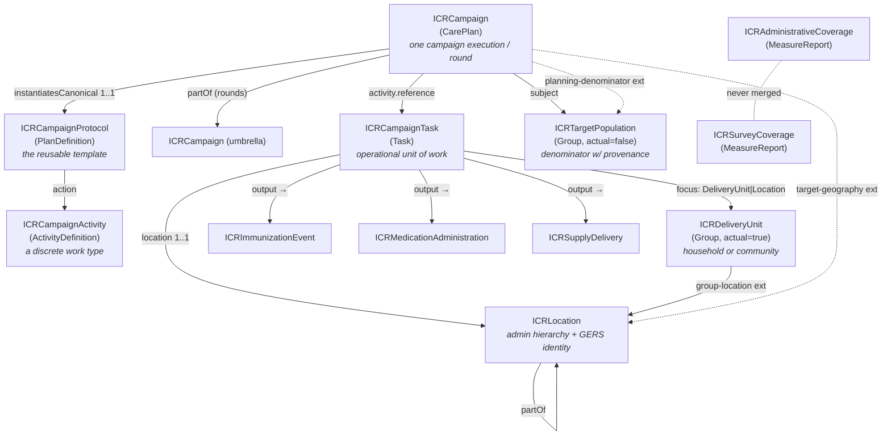
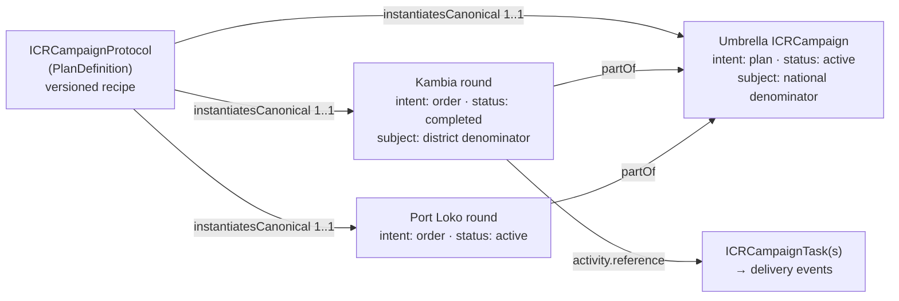
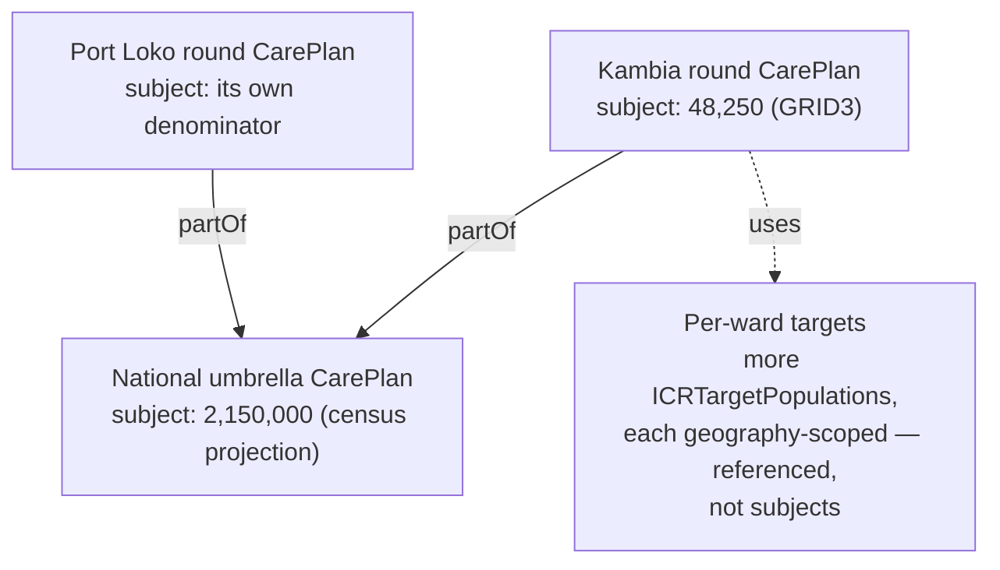
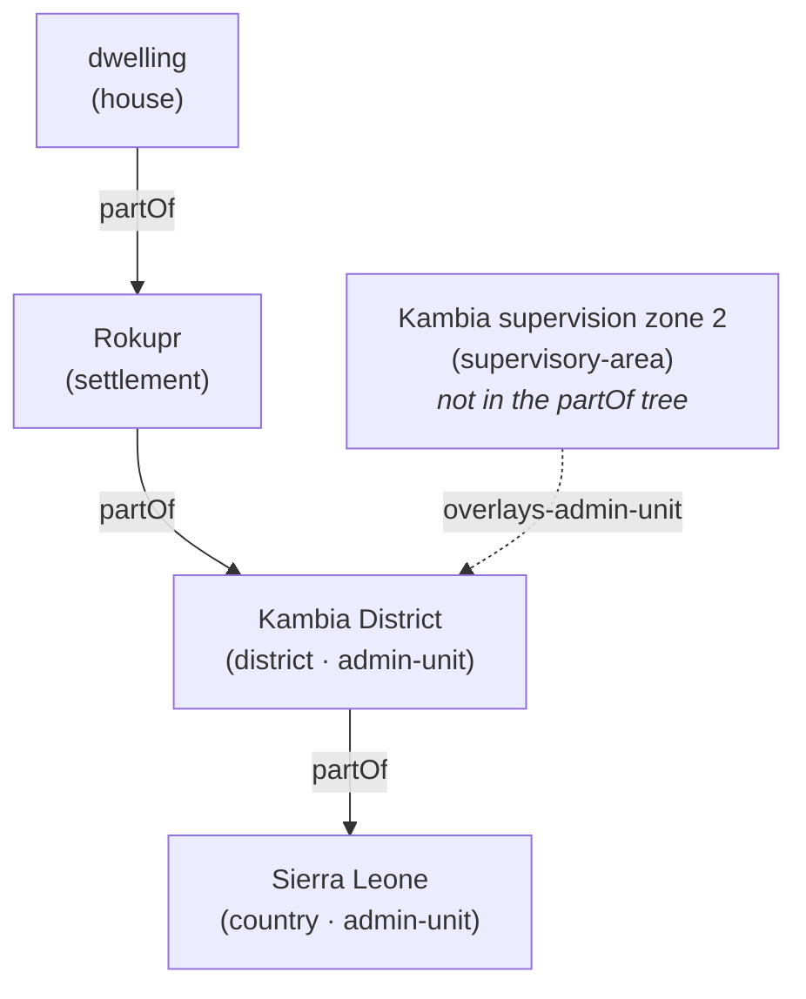

# ICR FHIR IG v0.1 — Reviewer's Explainer
`v0.10.1 · Last modified Jun 15, 2026 at 10:00 PM EDT`

⁠

> [!note] What this document is A component-by-component walkthrough of the draft FHIR IG in `ig/`, written for review. For every artifact it covers **what it is**, **the rationale** (with pointers back to [[icr-v1]] sections), and **questions worth asking** before this hardens into v1.0. It describes the IG as committed through v0.6.x — every cardinality, binding, and fixed value was checked against the FSH source — with **v0.7.0 additions (c80–c95) folded into the prose but not yet committed to** `ig/`; those are flagged in-thread and in the v0.7.0 changelog note below.

> [!tip] v0.10.0 — WHO SMART Immunizations comparison folded in as §18 (addresses §2 c129) New **§18. WHO SMART Immunizations alignment** delivers the WHO SMART-Guidelines comparison the §2 thread (c129/c130) asked for, vs `smart-immunizations` (`smart.who.int.immunizations#0.2.0`). Headline: the **WHO IG is routine-immunization only** — no Campaign/CarePlan, denominator, coverage-survey, or operational-geography model — so **ICR is its campaign complement**, and (per your steer) alignment means **adopting WHO's IG structure where possible** and **reusing WHO artifacts at the seams**. Concrete proposals: adopt the WHO **SMART-Guidelines IG skeleton** (L1 Home / L2 Business Requirements / Data Models & Exchange / Deployment / Indices — the biggest structural gap, §18.2); make `ICRImmunizationEvent` **derived-from** `IMMZ.Immunization` and **reuse** `IMMZ.AdverseEvent` instead of a new AEFI VS (§18.3, supersedes §17 C1); add **ConceptMaps ICR ↔** `IMMZ.*` terminology and **derive coverage** `Measure`**s from** `IMMZIND01–45` (§18.4); declare `dependsOn smart.who.int.base` (§18.5). All **proposed** — no FSH change. Each affected section (§2, §3, §5.1, §6.1, §6.3, §7, §7.1, §8, §10, §12) now carries an inline **"[!info] WHO SMART alignment (§18)"** callout.

> [!tip] v0.9.0 — field-evidence synthesis folded in as §17 (a prioritized list of _proposed_ IG additions for a subsequent round) New **§17. Research-validated proposed additions** rolls up the eight-document global-health field-evidence synthesis (`_SYNTHESIS-research-vs-ICR-IG.md`: WHO SIA/RED/measles guides, the cluster-survey manual, GTFCC OCV, NTD-MDA, WHO EYE/yellow-fever, and geo-microplanning) into one decision-ready change-list. The headline: the evidence **validates the IG's spine** (plan→order lifecycle, one-Task-per-visit, the campaign/routine `record-origin` firewall, denominator-with-provenance, the never-merged coverage lineages, and operational-geography-overlays-admin — the standout win) and surfaces a **prioritized set of additions** — the highest-priority themes being a **programme-semantics quartet** (activity/SIA-type, coverage-target-as-data, stockpile-source, dosing-regimen) and a **coverage-model overhaul** (denominator-type + unit axes, structured `sample-design`, `Measure` bindings, a multi-dose "fully-immunized" measure). **Everything in §17 is _proposed_ — like the v0.7.0 items, nothing here is committed to** `ig/`; the actual IG/FSH edits are deferred to a subsequent round. §14 (Known gaps) and §15 (checklist) point at §17, and each affected section (§4, §5.1–5.3, §6.2/§6.3, §7, §8, §9, §10) now carries a short inline **"[!warning] Proposed (§17)"** callout linking back, so the proposal is visible where the artifact is described. This pass adds the synthesis section + cross-reference callouts only — no profile/FSH change and no change to the IG-as-committed prose.

> [!tip] v0.8.0 — section Question-blocks pruned to OPEN items only; resolved questions archived to §16 Each section's "[!warning] Questions" callout now lists **only genuinely-open questions**; every question already addressed/resolved was moved to the new **§16. Closed questions — archive** (grouped by section) so nothing is lost. Open decisions that still carry live comment threads stay in place (§2 WHO SMART alignment c129; §6.3 Overture release-version c86 and `partOf`-typing c87, plus the addressed-but-awaiting-confirm admin-identifier c88 and breadcrumb c89). This is a documentation-organization pass — no profile/FSH change.

> [!tip] v0.7.0 — fourth-pass revision: your Jun 15 comments folded into the main text (this doc's comments c80–c95) Your latest review round is now **incorporated into this doc's prose**, and each comment thread carries an **APPLIED in v0.7.0 … OK to close** note so you can decide which to close. The substance: **publisher → UNICEF** of record, Ona + Crosscut credited via `contact` (c94, §2); a **planned-vs-executed** explanation on the round CarePlans (c95, §5.2); a **worked** `dataLineage` **(realtime vs reconciled) example** (c80, §8); the **Patient-vs-RelatedPerson/Person** explanation folded into §6.1 with the q2 wording corrected (c83); **GRID3 → WorldPop** relabelled across the example denominators (c84, §6.2/§8/§11); a **two-hierarchy mermaid diagram** for Location (c85, §6.3); **admin-level identifier rules** — ≥1 identifier required at admin-unit level, plus national/internal-code and ISO 3166 slices (c88, §3/§6.3); a proposed `location-ancestors` **breadcrumb extension** for partOf-depth performance (c89, §6.3/§9); an `overlays-admin-unit` _1.. invariant_* on operational-area types (c90, §6.3); and an **inline albendazole MedicationAdministration example** for §7.2 (c91). Explanations were added for the Overture release-version purpose (c86) and the `partOf`-only-ICRLocation trade-off (c87), both left open pending your/Overture's decision. **This pass edits this explainer doc only** — IG/FSH artifact changes implied by c84/c88/c89/c90/c94 are flagged in-thread and tracked for the next IG build, not yet committed to `ig/`.

> [!tip] v0.5.0 — annotated FHIR/JSON examples inlined (this doc's comments c64–c67) The campaign-architecture sections now carry the **actual resource JSON**, all drawn from the one Sierra Leone MR SIA scenario so every example interlinks: the **protocol** (§5.1), its **activity** (§5.3), the **umbrella + round CarePlans** (§5.2), and a **house-to-house Task** that chains through `Task.output` to the **MCV dose** (§5.4 → §7.1), plus the identity resources they reference (**Location** §6.3, **delivery-unit** and **denominator Groups** §6.1/§6.2) and the divergent **coverage pair** (§8). §5.2 also gains a **lifecycle diagram** (microplan `plan` → execution `order`, umbrella → rounds) answering c64, and a worked answer to "do the geographies sum to the national total?" (c65): they don't have to — each scope carries its own denominator from its own source. Every block is annotated field-by-field beneath the JSON. **No IG/FSH artifacts changed in this pass** — these render `examples.fsh` instances already in the IG (the §11 table) as readable JSON for reviewers.

> [!tip] v0.4.0 — third-pass revision applied (this doc's comments c1–c49) Your review comments on THIS doc, and the agreed replies, are now **applied to the IG** (commit `4b49ab0`, SUSHI-clean: 0 errors / 0 warnings) and folded into this doc's main text. The substance: **naming stays** — ICR-prefixed profile names and "Protocol" confirmed (c42/c45); a **protocol walk-through** (§5.1) and an **activity-definition gallery** (§5.3) are now in the main text (c44/c46); the **who-vs-where split and nested-population stack** explained in §5.2 (c8); the **one-Task-per-visit pattern with the person-targeted follow-up exception** documented in §5.4 and `Task.focus` widened to allow `Patient` for follow-ups (c48); `dataLineage` now **MS on ICRCampaign** (c9) and **required (1..1) on both coverage profiles with "absent ⇒ realtime" as the documented default** (c20); `children-present/absent` **renamed** `eligible-present/absent` (c18); `school-cohort` added as a third group kind (c49); `groupLocation` documented as **residence, not service point** (c13); the **async GERS-enrichment lifecycle** stated as the expected workflow in the IG narrative (c16); §6.2 gains a **competing-denominator walk-through** with a new third example (c15/c19). New examples: albendazole/ITN/IRS activity definitions + the Kambia enumeration estimate (26 total). Linear: **BERG-46** (GERS system URI, c2).

> [!tip] v0.3.0 — second-pass revision applied (icr-v1 comments c69–c75) Matt's Jun 12 review comments on the working doc, and the agreed replies, have been **applied to the IG** (commit `6a0ac4b`, SUSHI-clean: 0 errors / 0 warnings) and this doc updated to match. The substance: **ICRHousehold → ICRDeliveryUnit** — one Group profile for households _and_ communities, distinguished by a required `group-kind` code, with `household-location` generalized to `group-location` (c72); a profiled, computable **geography characteristic** on ICRTargetPopulation → Reference(ICRLocation) at any admin level (c70 — closes old §6.2 q2); **operational geography gets a real mechanism** — a new location-type CodeSystem (incl. `supervisory-area` / `operational-area`, bound extensible to `Location.type`, closing old §6.3 q5) plus an `overlays-admin-unit` extension (c74); a **required coded** `task-origin` (pre-planned / field-registered) on ICRCampaignTask (c75); `Task.focus` **narrowed** to `ICRDeliveryUnit | ICRLocation` (the old looseness reason disappeared with the generalization) and `ICRMedicationAdministration.subject` narrowed to `Patient | ICRDeliveryUnit`; and the **campaign-work-vs-routine-Encounter boundary** stated in the background narrative (c71). Three new examples: country Location, community delivery unit, supervisory area.

> [!tip] v0.2.0 — first-pass revision applied The cheap fixes and missing examples from this doc's original §15 checklist have been **applied to the IG** (commit `843ab18`, SUSHI-clean: 0 errors / 0 warnings) and this doc updated to match: FR designations on all five required-binding code systems; MDA ValueSet description corrected; new `SampleDesign` extension on survey coverage; reference-target tightening (target-geography → ICRLocation, planning-denominator → ICRTargetPopulation, household-location → ICRLocation); protocol `action.definition` locked to ICRCampaignActivity; delivery-strategy wired into ICRLocation for sites; Task.focus looseness documented as deliberate; and 7 new examples (activity definition, national umbrella + `partOf` round, Type A site-session task, fixed-post site, national denominator, admin-vs-survey coverage pair). Items needing a project decision (§15) remain open.

* * *
## 1. Orientation — what's in the IG
The IG consists of FHIR Shorthand (FSH), compiled by SUSHI into FHIR R4 artifacts.

| Layer | Count | Artifacts |
| --- | --- | --- |
| **Profiles — campaign architecture** | 4   | ICRCampaignProtocol (PlanDefinition), ICRCampaign (CarePlan), ICRCampaignActivity (ActivityDefinition), ICRCampaignTask (Task) |
| **Profiles — population & geography** | 3   | ICRDeliveryUnit (Group — household/community/school-cohort), ICRTargetPopulation (Group), ICRLocation (Location) |
| **Profiles — delivery events** | 3   | ICRImmunizationEvent (Immunization), ICRMedicationAdministration (MedicationAdministration), ICRSupplyDelivery (SupplyDelivery) |
| **Profiles — coverage** | 2   | ICRAdministrativeCoverage (MeasureReport), ICRSurveyCoverage (MeasureReport) |
| **Extensions** | 23  | See §8 |
| **CodeSystems** | 12  | campaign-type, delivery-strategy, record-origin, missed-reason, noncompliance-reason, denominator-source, data-lineage, coverage-source, group-kind, task-origin, location-type, group-characteristic |
| **ValueSets** | 13  | One per code system (except group-characteristic, used as a fixed code), plus a narrowed independent-coverage set and an ATC-based MDA medication set |
| **Example instances** | 26  | A coherent measles–rubella SIA scenario (umbrella + round, Type A & B tasks, coverage pair, country→dwelling hierarchy, household + community delivery units, supervisory area, competing denominators) + an activity gallery (MCV, albendazole, ITN, IRS) + an MDA event + an ITN delivery (§11) |
| **Narrative pages** | 2   | `index.md` (home), `background.md` (design rationale & open questions) |

File map (`ig/input/fsh/`): `aliases.fsh`, `codesystems.fsh`, `valuesets.fsh`, `extensions.fsh`, `profiles-campaign.fsh`, `profiles-population.fsh`, `profiles-delivery.fsh`, `profiles-coverage.fsh`, `examples.fsh`.

**Build:** `sushi build .` compiles FSH → JSON; `./_genonce.sh` renders the IG website (needs Java 17+). The commit is SUSHI-clean (compiles without errors).

* * *
## 2. IG metadata (`sushi-config.yaml`)
| Field | Value | Notes |
|---|---|---|
| `id` | `unicef.fhir.icr` | NPM-style package id |
| `canonical` | `https://fhir.icr.unicef.org` | Base URL of every profile/extension/CS/VS |
| `name` / `title` | `ICR` / "Integrated Campaign Registry (ICR) Implementation Guide" | |
| `status` / `version` | `draft` / `0.1.0` | |
| `fhirVersion` | `4.0.1` | FHIR **R4** (per proposal) |
| `license` | `Apache-2.0` | |
| `jurisdiction` | UN M49 `001` "World" | Global IG, not country-specific |
| `copyrightYear` | `2026+` | |
| `releaseLabel` | `ci-build` | |
| `publisher` | "UNICEF", url `https://www.unicef.org` — publisher of record; the ICR project (delivered by Ona + Crosscut) credited via `contact` | Set to UNICEF per review (c94) |
| `menu` | Home, Background, Artifacts | |
| `parameters` | `show-inherited-invariants: false`, `shownav: true` | |

**Rationale.** The canonical `https://fhir.icr.unicef.org` stakes out a UNICEF-owned namespace; the same base hosts the two provisional identifier-system URIs (§3). The toolchain (FSH/SUSHI/IG Publisher) deliberately matches WHO SMART Guidelines practice (working doc §11).

> [!info] WHO SMART alignment (§18 — addresses c129) The toolchain already matches WHO practice. §18 proposes going further: adopt the WHO SMART-Guidelines IG **skeleton** (L1 Home / L2 Business Requirements / Data Models & Exchange / Deployment / Indices) and declare a formal `dependsOn smart.who.int.base` once alignment hardens — the concrete answer to §2 q2. The WHO IG is routine-only, so ICR is its **campaign complement**. See §18.

> [!warning] Questions
> 
> 1. **Canonical URL ownership** — does UNICEF actually control `fhir.icr.unicef.org` (or intend to)? Changing canonicals after publication is painful; this needs early confirmation.
>   
> 2. {==**No dependencies declared** — the background page commits to aligning with WHO SMART Immunizations / the Immunization DAK, but the config declares no dependency on it (or on IHE mCSD, etc.). Intentional for v0.1, but worth deciding when the dependency gets declared and what "alignment" concretely means.==}{>>We need to do a pass to compare agains the WHO Smart Guideline<<}{id="c129" by="mberg" at="2026-06-15T21:00:51.103Z"}{>>Add this as a task in linear.<<}{id="c130" by="mberg" at="2026-06-15T21:01:33.851Z" re="c129"}{>>Agreed a structured WHO SMART Guidelines comparison is a real work item — map ICR's profiles, extensions, and terminology against the WHO SMART Immunizations DAK / Immunization IG, reuse the DAK data elements where they align, and decide where to declare a formal `dependsOn` (this is exactly §2 q3's "what alignment concretely means" plus the §12 DAK commitment). On filing it in Linear: I **can't** — this runner session is sandboxed with no network or Linear access, so I can't create the issue (that's also why BERG-45/46 were filed from a different, networked pass, not by me). Could you or the next networked pass file it alongside BERG-45/46 — suggested title "ICR ↔ WHO SMART Immunizations DAK alignment pass"? Flagging it here so it's captured, and I can draft the comparison scope/checklist once the issue exists.<<}{id="c133" by="agent" at="2026-06-15T21:30:00.000Z" re="c130"}
>   
> 3. `id: unicef.fhir.icr` — confirm this fits the package-naming convention UNICEF wants (most are `<org>.fhir.<scope>`, so it's plausible, but it's permanent).
>   

* * *
## 3. Aliases & identifier systems (`aliases.fsh`)
Three groups:

- **External terminologies:** `$CVX` (`http://hl7.org/fhir/sid/cvx`, vaccine codes), `$MeasurePopulation` (the HL7 measure-population code system, used by the coverage examples), `$ATC` (`http://www.whocc.no/atc`, WHO drug classification), `$VaccineCodeVS` (the core FHIR vaccine-code ValueSet).
  
- **ICR identifier-system URIs** (explicitly marked _provisional — to be confirmed before v1.0_):
  
  - `$GERSId = https://fhir.icr.unicef.org/identifiers/overture-gers` — Overture Maps GERS IDs
    
  - `$PCode = https://fhir.icr.unicef.org/identifiers/pcode` — OCHA P-codes
    
  - `$ISO = urn:iso:std:iso:3166` — ISO 3166-1/-2 country & subdivision codes, for admin 0–3 (added v0.7.0, c88) — _WHO-aligned: matches WHO's_ `country-of-vaccination` _(ISO 3166-1) +_ `administrative-area` _extensions (§18.4)_
    
  - `$NationalAdminCode = https://fhir.icr.unicef.org/identifiers/national-admin-code` — the country/implementer's own administrative code, where they don't use a P-code (added v0.7.0, c88; the per-country base URI is expected to be overridden in implementation)
    
- **ICR code systems:** twelve `$...` aliases, one per CodeSystem in §10.
  

**Rationale.** GERS and P-codes need _some_ system URI to live under in `Location.identifier`; parking them under the ICR canonical is the pragmatic v0.1 choice. CVX/ATC/GS1 as the international product-code backbone is working doc §8.

> [!warning] Questions
> 
> 1. **Should ICR mint the GERS/P-code system URIs at all?** If Overture or OCHA ever publish official URIs, every stored identifier would need migration — or ICR's URIs become permanent aliases. Worth raising on chat.fhir.org / with Overture.
>   
> 2. GS1 is named in the narrative ("commodity (GS1)") but has **no alias and no binding** anywhere — `ICRSupplyDelivery.suppliedItem.item[x]` is left uncoded. Intentional looseness or a gap?
>   

* * *
## 4. {==The architecture at a glance==}{>>I think CareTeams are missing from this no?<<}{id="c131" by="mberg" at="2026-06-15T21:11:06.668Z"}{>>From the §4 diagram, yes — but not from the model: `ICRCampaign.careTeam` is a **MS** element (see the §5.2 element table), so a campaign already points at FHIR CareTeam(s). The §4 graphic is just the simplified resource-to-resource spine; it also omits `addresses` and several extensions to stay readable. That said, you've surfaced two **real gaps** worth tracking: (1) there is **no ICRCareTeam profile and no example CareTeam instance** yet — `careTeam` is referenced but unprofiled, and team identity in the examples is **display-only** (e.g. `Task.owner` = "CDD team 7, Rokupr" is a plain display string, not a CareTeam reference); (2) the worker/team model (vaccination teams, CDD teams, supervisors, and their link to supervisory-areas §6.3) isn't fleshed out. If team-level reporting matters — team productivity, supervisor assignment, who-worked-which-zone — we should add an ICRCareTeam profile, wire `Task.owner`/`Task.performer` + `ICRCampaign.careTeam` to it, ship an example, and add CareTeam to the §4 diagram. Want me to add that as an open question and sketch the profile in a rewrite?<<}{id="c134" by="agent" at="2026-06-15T21:30:00.000Z" re="c131"}{>>reporting matters the supervisor is a key piece of delivery too and is often the one doing the reporting.<<}{id="c136" by="mberg" at="2026-06-15T21:35:59.221Z" re="c134"}{>>Agreed, and that's an important constraint — the supervisor as both a delivery actor *and* the reporting actor. It's now tracked in two places: §17.3 (P2) proposes a **Supervision/QA profile** and a **Team/CareTeam + supervisor** profile, with an explicit note (c131/c136) to fold them together. Concretely when this moves into an IG round: an **ICRCareTeam** profile with roles (vaccinator/CDD, **supervisor**), wired to `Task.owner`/`Task.performer` and `ICRCampaign.careTeam`; the supervisor typically also owns the **supervisory-area** Location (§6.3) and is the `MeasureReport.reporter` on the rolled-up coverage — so "who reported this number" becomes queryable. Question for you: do you want **supervisor-as-reporter** captured as an explicit invariant (campaign MeasureReports SHALL name a `reporter`), or kept MS for v1?<<}{id="c146" by="agent" at="2026-06-16T02:00:00.000Z" re="c136"}
FHIR has no native `Campaign` resource, so the IG profiles core will be based on the CarePlan resource.

> [!warning] Proposed (§17.3 — for a subsequent IG round) A **Team / CareTeam + supervisor** profile: `careTeam` is referenced but unprofiled and team/supervisor identity in the examples is display-only (c131/c136). The field-evidence synthesis also flags supervision/QA as a cross-cutting gap — see §17.



Reading order for a reviewer: protocol → campaign → task → delivery events is the _operational_ spine; Group/Location is the _identity_ spine; MeasureReport is the _analytics_ readout. Five cross-cutting invariants recur everywhere (§12): coded delivery strategy, campaign-vs-routine record origin, real-time-vs-reconciled lineage, denominator provenance, and never-merged coverage lineages.

* * *
## 5. Campaign-architecture profiles (`profiles-campaign.fsh`)
### 5.1 ICRCampaignProtocol — `PlanDefinition`
_The reusable, version-controlled template for a campaign type — what a measles SIA_ **_is_** _(products, age bands, activity sequence, coverage goals), instantiated by every execution in every country._ (working doc §7.1)

> [!warning] {==Proposed (§17.2 P1 — for a subsequent IG round) An `activity-type` **/** `sia-type` coded axis (routine / pmvc / catch-up / follow-up / mop-up / reactive), orthogonal to `campaign-type`;==}{>>should this be different then campaign type?<<}{id="c137" by="mberg" at="2026-06-16T01:14:10.748Z"}{>>Yes — they answer different questions and should stay separate axes. `campaign-type` is **WHAT intervention** (vaccination-sia / mda / itn-distribution / irs — the delivery model). The proposed `activity-type`/`sia-type` is **the operational mode / trigger** of the round: preventive-mass vs catch-up vs follow-up vs mop-up vs **reactive/outbreak-response**. Worked example: a measles **follow-up SIA** (scheduled every 2–4y to clear accumulated susceptibles) and a measles **outbreak-response SIA** are *both* `campaign-type = vaccination-sia` but differ in mode — different trigger, often a different target age band, analyzed separately. Keeping the axes orthogonal lets you query "all reactive campaigns, any disease" or "all measles, any mode" independently (WHO's EYE programme uses exactly this 4-type taxonomy — §17.2 A1, source Y). One caution when drafting: don't let it overlap `record-origin` (campaign-vs-routine) — `routine` would only ever be an `activity-type` value for the RI baseline, not a campaign mode.<<}{id="c147" by="agent" at="2026-06-16T02:00:00.000Z" re="c137"}{>>ok make sure this is included in the main body,.<<}{id="c154" by="mberg" at="2026-06-16T17:24:02.449Z" re="c147"} and a `coverage-target` element to store the programme threshold (≥95% SIA / ≥65% LF / EYE 50-60-80%), not just achieved coverage. See §17.

| Element | Constraint |
|---|---|
| `status`, `version`, `title` | MS |
| `type` | **1..1 MS**, bound **required** to ICRCampaignTypeVS |
| `subject[x]` | MS — "Target population definition (age band, eligibility)" |
| `goal` | MS — "Coverage targets / thresholds (e.g. ≥95% admin coverage; ≥65% epidemiological coverage for LF)" |
| `action` | MS — "The activity sequence, instantiated as ICRCampaignActivity definitions" |
| `action.definition[x]` | MS, only `Canonical(ICRCampaignActivity)` — the activity wiring is enforced, not just narrated |
| `extension[deliveryStrategy]` | **1..\* MS** — "Delivery strategies this protocol uses — campaigns routinely mix them" |

**Rationale.** Separating protocol from execution is design decision #2: a country defines "measles–rubella SIA, 9m–14y" once and every district/round instantiates it, giving cross-campaign comparability for free. Delivery strategy is **mandatory and repeatable** at protocol level because hybrid strategies are the norm (background page: "an ITN campaign is B then A"). Naming: "Protocol" is retained per review — it is FHIR's own term for what PlanDefinition holds, so it signals the exact resource and usage pattern to IG reviewers.

> [!info] WHO SMART alignment (§18) **Naming-collision caution:** WHO uses `PlanDefinition` for _decision-support schedules_ (`IMMZ.D2/D5/D18` — recommend/contraindication/next-visit), whereas ICR uses it for the _campaign protocol_. Same resource, opposite role — document the distinction so a WHO-familiar consumer isn't surprised. Age-band-eligibility-as-CQL (q2) could later reuse WHO's CQL libraries. See §18.3.

**What a protocol actually looks like.** A protocol is the reusable recipe card for a campaign type — the IG's `example-mr-sia-protocol` in full:

| Field | Value | Meaning |
|---|---|---|
| `version` | `1.0.0` | Protocols are versioned — "MR SIA per 2026 guidance" and its 2028 revision are distinct, citable things |
| `type` | `vaccination-sia` | What kind of campaign this is (the required campaign-type code) |
| `extension[deliveryStrategy]` | `fixed-post` **and** `house-to-house` | The strategies this campaign type uses — MR SIAs run posts, then mop up door-to-door |
| `goal` | "≥95% administrative coverage in every district, verified by post-campaign survey" | The coverage target every execution inherits |
| `action` | → "Administer MCV, 9 months–14 years" (`example-mcv-activity`) | The activity sequence; a bigger protocol lists several actions — vaccinate, then mop up — each pointing at its ActivityDefinition |

Every execution then points back at it: the national umbrella and the Kambia round both carry `instantiatesCanonical → example-mr-sia-protocol`. That single link is what makes "all MR SIA rounds, anywhere, comparable" a query instead of a research project — and it is why `instantiatesCanonical` is 1..1.{>>ADDED in v0.4.0 (your c7/c44): the inline protocol walk-through.<<}{id="c51" by="claude" at="2026-06-13T01:31:20.000Z" re="c44"}

**The protocol as FHIR/JSON.** The same `example-mr-sia-protocol`, rendered (the fields a reviewer cares about; `meta.text` and narrative elided):

```json
{
  "resourceType": "PlanDefinition",
  "id": "example-mr-sia-protocol",
  "meta": {
    "profile": [
      "https://fhir.icr.unicef.org/StructureDefinition/ICRCampaignProtocol"
    ]
  },
  "status": "active",
  "version": "1.0.0",
  "title": "Measles–Rubella SIA — 2026 national guidance",
  "type": {
    "coding": [
      {
        "system": "https://fhir.icr.unicef.org/CodeSystem/icr-campaign-type",
        "code": "vaccination-sia"
      }
    ]
  },
  "extension": [
    {
      "url": "https://fhir.icr.unicef.org/StructureDefinition/delivery-strategy",
      "valueCodeableConcept": {
        "coding": [
          {
            "system": "https://fhir.icr.unicef.org/CodeSystem/icr-delivery-strategy",
            "code": "fixed-post"
          }
        ]
      }
    },
    {
      "url": "https://fhir.icr.unicef.org/StructureDefinition/delivery-strategy",
      "valueCodeableConcept": {
        "coding": [
          {
            "system": "https://fhir.icr.unicef.org/CodeSystem/icr-delivery-strategy",
            "code": "house-to-house"
          }
        ]
      }
    }
  ],
  "goal": [
    {
      "description": {
        "text": "≥95% administrative coverage in every district, verified by post-campaign survey"
      }
    }
  ],
  "action": [
    {
      "title": "Administer MCV, 9 months–14 years",
      "definitionCanonical": "https://fhir.icr.unicef.org/ActivityDefinition/example-mcv-activity"
    }
  ]
}
```

Annotated: `type` is the **required** campaign-type code (what kind of campaign this is); the two `delivery-strategy` extensions are the `1..*` repeat saying MR SIAs run posts **and** mop-up; `goal.description` is the coverage target every execution inherits; `action.definitionCanonical` is the wiring to the activity in §5.3 — **locked to** `Canonical(ICRCampaignActivity)`, so the protocol→activity link is machine-checked, not just narrated. Note what is **absent**: no geography, no dates, no denominator — those live on the executions (§5.2) that point back here via `instantiatesCanonical`.⁠

> {==[!warning] Questions==}{>>It would be helpful to get an example of what a campaign protocols would look. i don't really understand how this is structured.<<}{id="c7" by="mberg" at="2026-06-12T20:32:58.665Z"}{>>There IS one in the IG — `example-mr-sia-protocol` (ig/input/fsh/examples.fsh) — and its shape in plain terms: a protocol is the reusable recipe card for a campaign type. Concretely it holds (1) `type` = vaccination-sia — what kind of campaign this is; (2) the delivery strategies it uses — fixed-post AND house-to-house, because MR SIAs do both; (3) `goal` — "≥95% administrative coverage in every district, verified by post-campaign survey"; (4) `action` — the activity sequence, here one action pointing at the "Administer MCV, 9m–14y" ActivityDefinition (a bigger protocol would list several: vaccinate, then mop-up, each its own action); (5) version "1.0.0" — protocols are versioned, so "MR SIA per 2026 guidance" vs 2028 revision are distinct citable things. Then EVERY execution — national umbrella, each district round — points at it via instantiatesCanonical, which is what makes "all MR SIA rounds anywhere, comparable" a query instead of a research project. I'll inline a rendered walk-through of this example into §5.1 in the next rewrite so the structure is visible right here in the memo.<<}{id="c27" by="claude" at="2026-06-12T21:03:09.000Z" re="c7"}{>>great please add these details with an example inline in the doc when you do a rewrite.<<}{id="c44" by="mberg" at="2026-06-13T01:17:45.552Z" re="c27"}
> 
> 1. `type` is 1..1, but `PlanDefinition.type` semantically distinguishes plan kinds (order-set vs protocol…) in base FHIR — here it's repurposed for campaign type. Reasonable, but reviewers may ask whether `topic` or a dedicated extension is cleaner.
>   
> 2. {==No `library`/eligibility-logic story yet (age-band eligibility as CQL?) — presumably deferred along with the DAK alignment.==}{>>Def this to later.<<}{id="c155" by="mberg" at="2026-06-16T17:32:07.849Z"}
>   
### 5.2 ICRCampaign — `CarePlan` (the keystone)
_A specific campaign execution. Begins life as a microplan (_`intent=plan`_) and evolves into the execution record as Tasks complete and coverage accumulates. Rounds are sibling ICRCampaigns under an umbrella campaign via_ `partOf`_._ (working doc §7.2, §6.3)

> [!warning] Proposed (§17.2 — for a subsequent IG round) The `activity-type` and `coverage-target` axes (see §5.1) also surface here on ICRCampaign; plus **round1↔round2 linkage** for OCV/multi-round campaigns (§17.2 B3). See §17.

**How a campaign moves through its life (**`plan → order`**).** A campaign is born as a _microplan_ and matures into the _execution record_ of the **same** `ICRCampaign` resource — `intent` flips `plan → order`, `status` walks `draft → active → completed`, and Tasks plus coverage accumulate against it. Rounds are sibling executions under a national umbrella via `partOf`, and every one of them points at the single versioned protocol:



The umbrella stays `intent = plan` — it is the planning shell that holds the national denominator and binds the rounds together; each round goes `plan → order` as it executes. Because every box points at the **same** protocol, "all MR SIA rounds, anywhere" is one query, not a research project (§5.1). The actual JSON for the umbrella and a round is below, after the who-vs-where explanation.

**Planned vs executed — is there a plan per sub-area?** Yes. Each sub-national scope (district/round) is its **own** ICRCampaign, a `partOf` child of the national umbrella — so a three-district campaign has three round CarePlans, each with its own `subject` denominator, `targetGeography`, and `period`. Planned-vs-executed is captured by the **lifecycle of that same resource**: it is born `intent = plan` (the microplan — planning denominator, target geography, planned period) and matures to `intent = order` as Tasks complete and coverage accrues against it. The planned target is **not** duplicated into a separate resource — the `planningDenominator` extension already holds it, and the planned-vs-actual audit trail comes from FHIR resource history / Provenance (the versioned states of the CarePlan), not a parallel snapshot. (Per c112: because the denominator is already retained, ICR does **not** mint a separate planning-snapshot Group.)

| Element | Constraint |
|---|---|
| `instantiatesCanonical` | **1..1 MS**, only `Canonical(ICRCampaignProtocol)` |
| `status` | MS — "draft → active → completed" |
| `intent` | MS — "plan (microplan) transitioning to order (execution)" |
| `category` | **1..\* MS**, bound **required** to ICRCampaignTypeVS |
| `subject` | MS, only `Reference(ICRTargetPopulation)` |
| `period` | **1..1 MS** — campaign/round dates |
| `careTeam`, `addresses` | MS (`addresses` = the disease/condition targeted) |
| `partOf` | only `Reference(ICRCampaign)` — umbrella/round pattern |
| `activity` | MS; `activity.reference` only `Reference(ICRCampaignTask)` |
| Extensions | `campaignRound` 0..1 MS (positiveInt) · `targetGeography` 0..\* MS (→Location) · `planningDenominator` 0..1 MS (→Group) · `dataLineage` 0..1 MS |

**Rationale.** CarePlan won over a custom resource, Encounter, and RequestGroup (design decision #1) because it natively supports plan→execution lifecycle, `instantiatesCanonical`, population subjects, and `partOf` composition. **Every campaign must point at its protocol** (1..1) — that is what makes campaign data reusable rather than ad-hoc. `subject` typed to ICRTargetPopulation makes the denominator a first-class participant rather than an afterthought; `planningDenominator` additionally disambiguates _which_ estimate is THE denominator when several exist (§6.2).

**Who vs where, and nested scopes.** Each CarePlan has exactly **one** `subject` — the WHO, an ICRTargetPopulation ("children 9m–14y, Kambia, 48,250"). The WHERE is separate and plural: `targetGeography` is 0..*, so one campaign can name several geographies. Multiple and nested populations are carried by the **umbrella/round stack**, not by overloading one CarePlan:



One subject per CarePlan; as many CarePlans as the campaign has nested scopes, linked by `partOf`; finer-grained targets (per-ward) exist as additional geography-scoped ICRTargetPopulation Groups that planning and coverage reference without being anyone's `subject`. These nested scopes do **not** sum to the parent total — each carries its own denominator from its own source and method (national 2,150,000 census-projection vs Kambia 48,250 GRID3), so a district and the nation legitimately disagree (§6.2); they nest _conceptually_ via `partOf`, not arithmetically.

**The campaign as FHIR/JSON — umbrella + round.** Two `ICRCampaign` (CarePlan) instances from the scenario. First the **national umbrella** (the microplan shell):

```json
{
  "resourceType": "CarePlan",
  "id": "example-mr-sia-national",
  "meta": {
    "profile": [
      "https://fhir.icr.unicef.org/StructureDefinition/ICRCampaign"
    ]
  },
  "instantiatesCanonical": [
    "https://fhir.icr.unicef.org/PlanDefinition/example-mr-sia-protocol"
  ],
  "status": "active",
  "intent": "plan",
  "category": [
    {
      "coding": [
        {
          "system": "https://fhir.icr.unicef.org/CodeSystem/icr-campaign-type",
          "code": "vaccination-sia"
        }
      ]
    }
  ],
  "subject": {
    "reference": "Group/example-target-population-national"
  },
  "period": {
    "start": "2026-06-15",
    "end": "2026-12-18"
  },
  "addresses": [
    {
      "display": "Measles and rubella"
    }
  ],
  "extension": [
    {
      "url": "https://fhir.icr.unicef.org/StructureDefinition/planning-denominator",
      "valueReference": {
        "reference": "Group/example-target-population-national"
      }
    }
  ]
}
```

Then the **Kambia June round**, a child execution of that umbrella:

```json
{
  "resourceType": "CarePlan",
  "id": "example-mr-sia-2026",
  "meta": {
    "profile": [
      "https://fhir.icr.unicef.org/StructureDefinition/ICRCampaign"
    ]
  },
  "instantiatesCanonical": [
    "https://fhir.icr.unicef.org/PlanDefinition/example-mr-sia-protocol"
  ],
  "status": "completed",
  "intent": "order",
  "category": [
    {
      "coding": [
        {
          "system": "https://fhir.icr.unicef.org/CodeSystem/icr-campaign-type",
          "code": "vaccination-sia"
        }
      ]
    }
  ],
  "subject": {
    "reference": "Group/example-target-population"
  },
  "period": {
    "start": "2026-06-15",
    "end": "2026-06-26"
  },
  "partOf": [
    {
      "reference": "CarePlan/example-mr-sia-national"
    }
  ],
  "addresses": [
    {
      "display": "Measles and rubella"
    }
  ],
  "activity": [
    {
      "reference": {
        "reference": "Task/example-site-session-task"
      }
    },
    {
      "reference": {
        "reference": "Task/example-mopup-task"
      }
    }
  ],
  "extension": [
    {
      "url": "https://fhir.icr.unicef.org/StructureDefinition/campaign-round",
      "valuePositiveInt": 1
    },
    {
      "url": "https://fhir.icr.unicef.org/StructureDefinition/target-geography",
      "valueReference": {
        "reference": "Location/example-district"
      }
    },
    {
      "url": "https://fhir.icr.unicef.org/StructureDefinition/planning-denominator",
      "valueReference": {
        "reference": "Group/example-target-population"
      }
    }
  ]
}
```

Annotated, reading the links out: `instantiatesCanonical` (**1..1**) makes both campaigns point at the one protocol in §5.1. `intent` is the lifecycle dial — the umbrella stays `plan`, the round is `order` (executing). `subject` is the WHO — each scope its own ICRTargetPopulation denominator Group (national 2,150,000 vs Kambia 48,250; §6.2), which is the concrete answer to c65: different numbers from different sources, _not_ a partition of one total. `partOf` makes the round a child of the umbrella. `activity.reference` lists the round's Tasks (§5.4). The three extensions carry exactly what the protocol omits: which `campaign-round` this is, the `target-geography` (WHERE, `0..*` — here the district Location, §6.3), and the `planning-denominator` that singles out _the_ denominator coverage is computed against. (`addresses` is R4 `Reference(Condition)` — shown here as a **display-only** reference because the scenario ships no Condition instance; in production it would point at a Condition coded to SNOMED CT / ICD-11, which is where the specific disease lives since campaign `type` is deliberately disease-agnostic.)

> [!warning] Questions
> 
> 1. `instantiatesCanonical` **1..1 is strict** — every ad-hoc/emergency campaign must first author a protocol. Is that the intended forcing function, or does it deserve a relief valve (0..1 with a flag)?
>   
> 2. {==`subject` only ICRTargetPopulation: a sub-national CarePlan whose subject is a _geography_ rather than a population must route through `targetGeography` instead. Is the split (subject=who, extension=where) clearly enough documented?==}{>>I don't understand this.  Please explain further.  A campaign could contain multiple target population/geographies.  They may be nested too.<<}{id="c8" by="mberg" at="2026-06-12T20:34:15.253Z"}{>>Unpacking. CarePlan.subject is a single slot answering "WHO is this plan for" — we point it at one ICRTargetPopulation Group (e.g. "children 9m–14y, Kambia, 48,250"). "WHERE" is separate: the target-geography extension, which is 0..* — a campaign can list MULTIPLE geographies already. Your multiple/nested case is exactly what the umbrella/round pattern carries: the national umbrella CarePlan has the national denominator as subject; each district round (partOf the umbrella) has its own district-level population; nesting falls out of partOf + each population's geography characteristic pointing at its admin level. So: one subject PER CarePlan, but as many CarePlans as the campaign has nested scopes — and within one round, finer-grained populations (per-ward targets) exist as additional ICRTargetPopulation Groups linked by geography, they just aren't THE subject. The memo's question was narrower: is this who-vs-where split documented clearly enough in the IG narrative — your confusion answers that (no). I'll add a worked explanation + diagram of the national→district→ward population stack in the rewrite.<<}{id="c28" by="claude" at="2026-06-12T21:03:09.000Z" re="c8"}
>   
> 3. The umbrella campaign is itself an ICRCampaign, so it too needs `instantiatesCanonical`, `category`, `subject`, `period` — i.e. the umbrella must carry its own (national) denominator. The new umbrella example demonstrates this works, but confirm it's the intended modeling burden.
>   
> 4. `activity.reference` locked to Task only — excludes the R4 alternative `activity.detail` (inline activities). Worth stating in narrative that inline activities are out. _(The annotated umbrella + round JSON above was added in response to the request for a worked CarePlan example.)_
>   
### 5.3 ICRCampaignActivity — {==`ActivityDefinition`==}{>>Woud really help to have some real examples.<<}{id="c10" by="mberg" at="2026-06-12T20:36:45.686Z"}{>>One exists (`example-mcv-activity`: "Administer MCV, 9m–14y" — kind=Task, product=CVX 05, dosage "0.5 mL subcutaneous") but agreed, one isn't enough to make the concept land. In the rewrite I'll inline a trio spanning the campaign types: (1) "Administer albendazole, 5–14y" — ATC P02CA03, dose-pole-derived tablet count (Type C MDA); (2) "Distribute 1 ITN per 2 household members" — GS1 commodity, household-level (Type B-then-A); (3) "Spray interior structure walls" — IRS, structure-level (Type B). Together with the MCV one they show the point of the layer: the protocol carries the clinical/commodity content ONCE, and thousands of Tasks instantiate it without repeating it.<<}{id="c30" by="claude" at="2026-06-12T21:03:09.000Z" re="c10"}{>>Add this to the main text during rewrite<<}{id="c46" by="mberg" at="2026-06-13T01:20:49.728Z" re="c30"}
_A discrete work type within a campaign — "administer albendazole to children 5–14", "distribute ITNs to households" — instantiated as ICRCampaignTask resources._ (working doc §7.3)

> [!warning] Proposed (§17.2 P1 — for a subsequent IG round) A `dosing-regimen` axis (single-dose-lifelong / multi-dose / fractional) on the activity (and event, §7.1), needed to define "fully immunized." See §17.

| Element | Constraint |
|---|---|
| `status` | MS |
| `kind` | fixed `#Task` |
| `code` | **1..1 MS** — "The intervention: vaccinate / treat / distribute / spray" |
| `product[x]` | MS — "Vaccine (CVX) / drug (ATC) / commodity (GS1)" |
| `dosage` | MS — "Where applicable; dose-pole logic references an Observation" |
| `extension[deliveryStrategy]` | 0..1 MS |

**The activity gallery.** Four ActivityDefinitions now ship in the IG, spanning the campaign types — each says only WHAT, never which concrete target:

| Instance | Intervention | Product | Dosage / rule |
|---|---|---|---|
| `example-mcv-activity` | Vaccinate (Type A/B) | CVX `05` measles virus vaccine | 0.5 mL subcutaneous, single dose |
| `example-albendazole-activity` | Treat (Type C MDA) | ATC `P02CA03` albendazole | 400 mg single dose; tablet count by **dose-pole height band** |
| `example-itn-activity` | Distribute (Type B→A) | LLIN (free-text pending GS1) | 1 net per 2 household members |
| `example-irs-activity` | Spray (Type B) | Pirimiphos-methyl 300CS | interior walls of eligible structures |

**What lives here vs what lives on the Task.** The ActivityDefinition is deliberately **target-agnostic**: it carries the intervention, product, and dosage rule — and at most the _kind_ of eligible target (`subject[x]` can say "children 9m–14y" as a category). The concrete thing acted on — THIS household, THIS structure, THIS school session — is each **Task's** `focus`, assigned per unit of work. So "spray house" Tasks focus on structures (Locations), "vaccinate" Tasks focus on households (Groups) with per-child detail in the Immunization records off `Task.output`, and a hypothetical "set fly trap" activity would produce Tasks focusing on trap sites. The protocol carries the clinical/commodity content **once**; thousands of Tasks instantiate it without repeating it. (Boundary note: vector-control work like traps and larviciding is outside the v0.1 program scope and has no delivery-event profile — flag it if entomological surveillance enters ICR's future.){>>ADDED in v0.4.0 (your c10/c46 + c11/c47): the activity gallery is in the IG as real instances (commit 4b49ab0) and the what-vs-focus explanation is now main text.<<}{id="c54" by="claude" at="2026-06-13T01:31:20.000Z" re="c46"}

**Rationale.** `kind = #Task` hard-wires the instantiation target: activities become Tasks, not ServiceRequests. Product and dosage ride on the definition so the protocol carries the clinical content once.

**The activity as FHIR/JSON.** `example-mcv-activity` — the activity the protocol's `action` points at:

```json
{
  "resourceType": "ActivityDefinition",
  "id": "example-mcv-activity",
  "meta": {
    "profile": [
      "https://fhir.icr.unicef.org/StructureDefinition/ICRCampaignActivity"
    ]
  },
  "status": "active",
  "name": "AdministerMCV",
  "title": "Administer MCV, 9 months–14 years",
  "kind": "Task",
  "code": {
    "text": "Vaccinate — measles–rubella–containing vaccine"
  },
  "productCodeableConcept": {
    "coding": [
      {
        "system": "http://hl7.org/fhir/sid/cvx",
        "code": "05",
        "display": "measles virus vaccine"
      }
    ]
  },
  "dosage": [
    {
      "route": {
        "text": "subcutaneous"
      },
      "doseAndRate": [
        {
          "doseQuantity": {
            "value": 0.5,
            "unit": "mL",
            "system": "http://unitsofmeasure.org",
            "code": "mL"
          }
        }
      ]
    }
  ],
  "extension": [
    {
      "url": "https://fhir.icr.unicef.org/StructureDefinition/delivery-strategy",
      "valueCodeableConcept": {
        "coding": [
          {
            "system": "https://fhir.icr.unicef.org/CodeSystem/icr-delivery-strategy",
            "code": "fixed-post"
          }
        ]
      }
    }
  ]
}
```

Annotated: `kind` is **fixed to** `Task` — instantiating this activity produces ICRCampaignTasks (§5.4), not ServiceRequests; `code` is the intervention; `productCodeableConcept` is the CVX vaccine code (the albendazole / ITN / IRS activities in the gallery above swap in an ATC code or free-text product instead); `dosage` rides on the definition so the clinical content is stated **once**. What's _not_ here is any concrete target — no household, no child: the activity is target-agnostic, and the thing acted on is each Task's `focus`. The same shape holds for the other three gallery activities.⁠

> [!warning] Questions
> 
> 1. `product[x]` is MS but **unbound** — CVX/ATC are mentioned in the `^short` only. The delivery-event profiles do bind product codes; should the definition side bind too, for consistency?
>   
> 2. `deliveryStrategy` is 0..1 here but 1..* on the protocol and 1..1 on the Task — the asymmetry is defensible (strategy resolved per-task) but worth a sentence of narrative.
>   
### 5.4 ICRCampaignTask — `Task`
_The assignable, trackable operational unit of work — one Task per site-session (Type A, focus = the site Location) or per household_ _(Type B, focus = the household Group). Tasks may be pre-planned from the microplan or field-registered on discovery (the required task-origin code records which). Whether Tasks are assigned at village or household level is a configuration choice._ (working doc §7.4)

| Element | Constraint |
|---|---|
| `status` | MS — "requested → in-progress → completed / failed" |
| `intent`, `for`, `owner`, `executionPeriod`, `output` | MS |
| `code` | **1..1 MS** |
| `focus` | **1..1 MS**, only `Reference(ICRDeliveryUnit or ICRLocation or Patient)` — "site Location (Type A), household/community delivery-unit Group (Type B/C), or — for person-targeted follow-up tasks only — a Patient" |
| `location` | **1..1 MS**, only `Reference(ICRLocation)` |
| `output` | MS — "references to Immunization / MedicationAdministration / SupplyDelivery, or aggregate counts" |
| Extensions | `deliveryStrategy` **1..1 MS** · `taskOrigin` **1..1 MS** (code: pre-planned \| field-registered, required binding) · `housesVisited` 0..1 · `eligiblePresent` 0..1 · `eligibleAbsent` 0..1 · `missedReason` 0..\* · `noncomplianceReason` 0..\* · `fingerMarked` 0..1 · `dataLineage` 0..1 |

**Task granularity: one Task per visit, person-level detail in the delivery events.** A polio team's doorstep visit is **one** Task — it closes when the visit completes — and each child vaccinated gets their own `Immunization` resource hanging off `Task.output`, pointing at their `Patient`. So person-level capture happens in the **delivery-event layer**, not by multiplying Tasks: the Task is the unit of _work_ (one visit), the delivery events are the units of _service_ (three drops given). The IG's mop-up example shows the full chain: one household Task → output → the MCV dose for one child. **The deliberate exception is person-targeted follow-up** (a key invariant — see §13 #8): when a specific missed or zero-dose child needs chasing, a new Task is spawned whose `focus` IS that child's `Patient` record (the §4.4 routine-enrolment pattern) — which is exactly why `focus` allows `Patient` alongside the delivery-unit Group and the site Location, and it is the _only_ intended use of a person-focused Task. Routine per-child Tasks would multiply Task volume ~5× (the open-question-#1 scale concern) while adding nothing the Immunization records don't already carry.

**Rationale.** This is where campaign type A/B/C polymorphism lands: the _same_ profile serves a fixed-post site-session and a house-to-house visit, discriminated by `focus` type and the mandatory coded `deliveryStrategy`. The optional count/reason extensions are exactly the house-to-house data elements (houses visited, present/absent, missed/noncompliance reasons, finger marking) that only exist for strategy B — they're 0..x because they're meaningless for fixed-post tallies. `taskOrigin` **is mandatory** (the same required-coded-attribute pattern as delivery strategy and record origin): Tasks need not be pre-generated — a team that discovers an unenumerated household creates the ICRDeliveryUnit and its Task on the spot — and the count of field-registered Tasks per area is itself a measurement of how incomplete the microplan's enumeration was, feeding the next round's denominators. Delivery events hang off `Task.output` because **R4 Immunization has no** `basedOn` (the reverse link doesn't exist; see §7).

**The Task as FHIR/JSON.** `example-mopup-task` — the Type-B house-to-house visit, the richer of the two Task shapes and the one that chains to a delivery event:

```json
{ "resourceType": "Task", "id": "example-mopup-task", "meta": { "profile": [ "https://fhir.icr.unicef.org/StructureDefinition/ICRCampaignTask" ] }, "status": "completed", "intent": "order", "code": { "text": "Administer MCV — house-to-house mop-up visit" }, {=="focus": { "reference": "Group/example-household" }, "for": { "reference": "Group/example-household" },==}{>>I’d probably reserve focus for workflow lineage (CarePlan, CampaignActivity, ServiceRequest, previous Task) and use for consistently for the household/patient/community being targeted. That gives you much better traceability later.<<}{id="c156" by="mberg" at="2026-06-16T17:44:52.192Z"} "location": { "reference": "Location/example-dwelling" }, "executionPeriod": { "start": "2026-06-24", "end": "2026-06-24" }, "owner": { "display": "CDD team 7, Rokupr" }, "output": [ { "type": { "text": "Immunization administered" }, "valueReference": { "reference": "Immunization/example-mcv-dose" } } ], "extension": [ { "url": "https://fhir.icr.unicef.org/StructureDefinition/delivery-strategy", "valueCodeableConcept": { "coding": [ { "system": "https://fhir.icr.unicef.org/CodeSystem/icr-delivery-strategy", "code": "house-to-house" } ] } }, { "url": "https://fhir.icr.unicef.org/StructureDefinition/task-origin", "valueCode": "field-registered" }, { "url": "https://fhir.icr.unicef.org/StructureDefinition/eligible-present", "valueUnsignedInt": 2 }, { "url": "https://fhir.icr.unicef.org/StructureDefinition/eligible-absent", "valueUnsignedInt": 1 }, { "url": "https://fhir.icr.unicef.org/StructureDefinition/missed-reason", "valueCodeableConcept": { "coding": [ { "system": "https://fhir.icr.unicef.org/CodeSystem/icr-missed-reason", "code": "absent" } ] } }, { "url": "https://fhir.icr.unicef.org/StructureDefinition/finger-marked", "valueBoolean": true } ] }
```

Annotated, with the links read out: `focus` and `for` point at the **household delivery-unit Group** (§6.1) — this is the Type-B shape (a Type-A site-session Task instead focuses on the fixed-post Location); `location` is where the work happened (the dwelling, §6.3). `output` is the **whole Task→event mechanism** — it references the `Immunization` in §7.1 (R4 Immunization has no `basedOn`, so the link runs this way). The mandatory coded extensions are `delivery-strategy` (1..1) and `task-origin` — here `field-registered`, the discovery-mode pattern: this household wasn't in the microplan; the team created it and its Task on the doorstep. The house-to-house tally extensions (`eligible-present` 2 / `eligible-absent` 1, `missed-reason absent`, `finger-marked`) only exist for strategy B — they'd be meaningless on a fixed-post session.⁠

> [!warning] Questions
> 
> 1. **Task granularity at scale** is the IG's own #1 open question (one Task per household × national campaign = millions of Tasks). The profile keeps both options open — and field-registration (lazy Task creation on discovery) softens the pre-generation side of the worst case — but make sure pilots test the household-level path.
>   
> 2. The count extensions (`housesVisited`, `eligiblePresent`/`Absent`) are unsignedInt **point values** — no age-band or sex disaggregation. Real tally sheets disaggregate; is the answer "use `output` with aggregate counts" and if so, where's the pattern documented?
>   
> 3. `missedReason`/`noncompliance` at Task level aggregates over the whole visit — per-child reasons would need person-level records. Worth stating which level the data is expected at.
>   
> 4. No constraint ties `output.valueReference` to the three delivery-event profiles — the `^short` says it; the profile doesn't enforce it.
>   
> 5. `taskOrigin` 1..1 means **retrofitting existing datasets requires assigning an origin** — acceptable forcing function, or should historical imports get a third code (`unknown`)?
>   

* * *
## 6. Population & geography profiles (`profiles-population.fsh`)
### 6.1 ICRDeliveryUnit — `Group` (household / community / school cohort)
_The actual Group of people a campaign Task acts on — a household (Type B house-to-house), a community (Type C MDA), or a school cohort (school-based delivery), distinguished by the required group-kind code. The validated Group + Location pattern, generalized: the Group is who, the Location (group-location extension) is where it lives or is based — the dwelling for a household, the settlement or community point for a community, the school for a school cohort. Type A's delivery unit is a site, which is a Location, not a Group._ (working doc §3.2, §7.5, §9.1)

| Element | Constraint |
|---|---|
| `type` | fixed `#person` |
| `actual` | fixed `true` |
| `code` | **1..1 MS**, bound **required** to ICRGroupKindVS (`household` \| `community` \| `school-cohort`) |
| `member` | MS; `member.entity` only `Reference(Patient)` |
| `quantity` | MS — "Group size where individuals are not enumerated" |
| `extension[groupLocation]` | **1..1 MS** → `Reference(ICRLocation)` — **residence/base, not service point**: the dwelling (household), settlement/community point (community), or school (school-cohort) |

**Rationale.** Separating _who_ (Group) from _where_ (Location) means the location's identity (GERS building/place ID) survives group composition changes, and the group survives re-mapping. The second-pass generalization (was: ICRHousehold) reflects that households and communities are the _same pattern at two scales_ — one profile with a coded kind beats two near-identical profiles, and it lets `Task.focus` and `MedicationAdministration.subject` be narrowed to ICR-conformant targets; `school-cohort` (third pass) demonstrates the kind list extends to non-obvious delivery units (nomadic groups, camp populations) as country demand appears. `quantity` covers the common case where campaigns count members without registering individuals — person-level `member` entries are optional by design. **Why** `member.entity` **is Patient (re c14/c83):** FHIR has four person-shaped resources — **Patient** (anyone who might receive a service: despite the name, a healthy child getting a measles dose or a household member receiving a net is a Patient, and it is the resource every clinical/delivery record points at — `Immunization.patient` can _only_ be a Patient), **RelatedPerson** (a caregiver in relation to a patient), **Practitioner** (workers — CDDs, vaccinators), and **Person** (an identity-linkage resource matching one human across systems — plumbing, not a care-record subject). So every enumerated household member is a Patient (the standard household-registration pattern, as in OpenSRP). Locking `member.entity` to Patient therefore excludes Practitioner/Device/etc. — **not** RelatedPerson, which R4 `Group.member` never permitted in the first place (RelatedPerson membership only arrives in R5). `groupLocation` **is residence, not service point**: where service actually happened is `Task.location` and the delivery event's own `location`. A household that walks to a village distribution center keeps its dwelling here unchanged — the Task records the center.

> [!info] WHO SMART alignment (§18) WHO's `IMMZ.Patient` profiles **base R4 Patient** (not IPS, despite its own narrative claiming so) with required identifier / name / phone / gender / birthDate / address. Proposed: align ICR's person records to `IMMZ.Patient` (or note a deliberate divergence) so household members are WHO-conformant. WHO's caregiver is `IMMZ.Caregiver` (RelatedPerson). See §18.3.

**The delivery unit as FHIR/JSON.** `example-household` — the Type-B unit a mop-up Task focuses on:

```json
{
  "resourceType": "Group",
  "id": "example-household",
  "meta": {
    "profile": [
      "https://fhir.icr.unicef.org/StructureDefinition/ICRDeliveryUnit"
    ]
  },
  "type": "person",
  "actual": true,
  "code": {
    "coding": [
      {
        "system": "https://fhir.icr.unicef.org/CodeSystem/icr-group-kind",
        "code": "household"
      }
    ]
  },
  "quantity": 6,
  "member": [
    {
      "entity": {
        "reference": "Patient/example-child"
      }
    }
  ],
  "extension": [
    {
      "url": "https://fhir.icr.unicef.org/StructureDefinition/group-location",
      "valueReference": {
        "reference": "Location/example-dwelling"
      }
    }
  ]
}
```

Annotated: `code` is the **required** group-kind (`household` here; `community` or `school-cohort` for the other delivery units, same profile); `quantity` 6 is the head-count even though only one `member` (the child, `Patient/example-child`, §7.1) is individually enumerated; `group-location` is the dwelling Location (§6.3) — **residence, not service point** (where service actually happened is the Task's `location`). Swap `code` to `community` and point `group-location` at a settlement and this same JSON becomes the Type-C community delivery unit.⁠

> [!warning] {==Questions==}{>>Which of these questions are still open?<<}{id="c132" by="mberg" at="2026-06-15T21:17:21.092Z"}{>>For §6.1's three questions (this is on that heading): **q2** (Patient vs RelatedPerson/Person) and **q3** (school-cohort) are **closed** — q2 was the v0.7.0 correction, q3 the third-pass addition; both now read as resolved notes, not live questions. **q1** (household identity across campaigns) is **mostly settled** — the approach is fixed: identify by head-of-household + the dwelling's stable GERS ID, folded into the record-linkage work — but it still carries **two genuinely open follow-ups**: (a) whether to *also* stamp a convenience `Group.identifier` for direct lookup, and (b) how to handle head-of-household churn (death, migration, household splits). So in §6.1, only those two sub-points of q1 are actually live. If useful, I can do a **doc-wide open-questions triage** — every section's "[!warning] Questions" block sorted into resolved / still-open / needs-your-decision — and park it in §15 in a rewrite. Say the word.<<}{id="c135" by="agent" at="2026-06-15T21:30:00.000Z" re="c132"}
> 
> 1. **Household identity across campaigns — resolved approach.** A household is identified by its **members**, anchored on the head of household (keyed by `Patient.id` or, better, an established external ID such as a national ID); **cross-campaign linkage** joins on the **dwelling**, whose `group-location` Location carries a stable GERS building ID that survives household composition changes. `Group.identifier` itself stays light — identity is reconstructed from head-of-household + dwelling GERS ID — so this folds into the record-linkage work (background §12) rather than minting a new household-identifier scheme. Remaining follow-ups: whether to _also_ stamp a convenience `Group.identifier` for direct lookup, and handling head-of-household churn (death, migration, household splits) — the dwelling GERS ID is the durable join key, the person ID disambiguates which household at that structure.
>   
### 6.2 ICRTargetPopulation — `Group`
_A target-population denominator: a conceptual cohort (_`actual=false`_) with a count, eligibility characteristics, and — critically — source and date provenance. Multiple competing estimates per geography are retained; exactly one is flagged as the planning denominator._ (working doc §7.6, §4.2)

> [!warning] Proposed (§17 — for a subsequent IG round) An **at-risk / eligible denominator** type to drive programme-vs-epidemiological coverage (§17.2 B1); a **population-estimation-method + source-raster version/date** so two `worldpop` estimates are distinguishable (§17.4); and a **population-vulnerability / equity** characteristic (§17.3). See §17.

| Element | Constraint |
|---|---|
| `type` | fixed `#person` |
| `actual` | fixed `false` |
| `quantity` | **1..1 MS** — the denominator count |
| `characteristic` | MS — "Age band, sex, eligibility rule, geography"; **sliced (pattern on `code`, open)** |
| `characteristic[geography]` | 0..1 MS — `code` fixed to `icr-group-characteristic-cs#geography`; `value[x]` only `Reference(ICRLocation)`; `exclude` fixed `false` |
| Extensions | `denominatorSource` **1..1 MS** (CodeableConcept, extensible) · `estimateDate` **1..1 MS** (date) · `isPlanningDenominator` 0..1 MS (boolean) · `confidence` 0..1 (string) |

**Rationale.** Design decision #6 ("denominator-first"): the denominator is the dominant error source in campaign analytics, so an estimate without source+date is not allowed to exist — both provenance extensions are **mandatory**. Keeping _competing_ estimates (census projection vs WorldPop vs microcensus) as sibling Groups and flagging one (`isPlanningDenominator`) preserves the audit trail instead of overwriting. The second-pass **geography characteristic** makes the estimate's scope computable at **any level** — country, district, ward, settlement, or operational area (working-doc comment c70: target populations are _not_ household-bound; that's what ICRDeliveryUnit is for) — so estimates are joinable to the location hierarchy by reference, not by parsing `name`.

**Worked example — competing denominators, as shipped in the IG.** Three ICRTargetPopulation instances now tell the whole story:

| Instance | Geography | Count | Source | Date | Planning? |
| --- | --- | --- | --- | --- | --- |
| `example-target-population` | → Kambia District | **48,250** | {==WorldPop modelled==}{>>Let's use WorldPop instead of Grid3 evrerywhere in the examples<<}{id="c84" by="mberg" at="2026-06-15T19:24:51.128Z"}{>>Will do. In the next rewrite I'll swap the modelled denominator source GRID3 → WorldPop everywhere it appears: the `example-target-population` instance (`grid3` → `worldpop`), the §6.2 walk-through prose and table, the §8 admin-coverage `denominator-source`, and the §11 examples table. Both already exist as codes in ICRDenominatorSourceCS (§10), so it's a label swap, not a terminology change. One check: I'll leave the `example-target-population-enumerated` instance as microcensus/enumeration (a genuinely different method, not GRID3) — i.e. only the MODELLED estimate becomes WorldPop. Say so if you want it applied more broadly.<<}{id="c101" by="agent" at="2026-06-15T20:20:00.000Z" re="c84"}{>>APPLIED in v0.7.0: GRID3 → WorldPop relabelled throughout the examples in this doc — this §6.2 table + walk-through prose, the §6.2 denominator JSON (`denominator-source: worldpop`), the §8 admin-coverage JSON, and the §11 examples table. The enumeration/microcensus instance is unchanged (different method). The `examples.fsh` edit (same one-code relabel) is flagged for the next IG build. OK to close.<<}{id="c118" by="agent" at="2026-06-15T20:45:00.000Z" re="c84"} | 2026-01-15 | **true** |
| `example-target-population-enumerated` | → Kambia District | **51,800** | microcensus / H2H enumeration | 2026-03-02 | false |
| `example-target-population-national` | → Sierra Leone | 2,150,000 | census projection | 2025-11-30 | true (national) |

The first two are **the same geography disagreeing by ~7%**: WorldPop says 48k, the enumeration says 52k. Both are retained — each with its source and date — and exactly one carries the planning flag, so coverage is computed against a _declared_ choice while the disagreement stays visible instead of being silently overwritten. Run the consequence: 47,766 children reached is **99% coverage against WorldPop but 92% against the enumeration** — the denominator you pick changes the answer, which is the §4.1 Cuamba lesson in miniature and the entire reason source + date are mandatory.⁠

**The denominator as FHIR/JSON.** `example-target-population` — Kambia's WorldPop planning denominator (the `subject` of the round CarePlan in §5.2):

```json
{
  "resourceType": "Group",
  "id": "example-target-population",
  "meta": {
    "profile": [
      "https://fhir.icr.unicef.org/StructureDefinition/ICRTargetPopulation"
    ]
  },
  "type": "person",
  "actual": false,
  "quantity": 48250,
  "characteristic": [
    {
      "code": {
        "coding": [
          {
            "system": "https://fhir.icr.unicef.org/CodeSystem/icr-group-characteristic",
            "code": "geography"
          }
        ]
      },
      "valueReference": {
        "reference": "Location/example-district"
      },
      "exclude": false
    }
  ],
  "extension": [
    {
      "url": "https://fhir.icr.unicef.org/StructureDefinition/denominator-source",
      "valueCodeableConcept": {
        "coding": [
          {
            "system": "https://fhir.icr.unicef.org/CodeSystem/icr-denominator-source",
            "code": "worldpop"
          }
        ]
      }
    },
    {
      "url": "https://fhir.icr.unicef.org/StructureDefinition/estimate-date",
      "valueDate": "2026-01-15"
    },
    {
      "url": "https://fhir.icr.unicef.org/StructureDefinition/is-planning-denominator",
      "valueBoolean": true
    }
  ]
}
```

Annotated: `actual: false` is what makes this a _conceptual cohort_ — a denominator, not a roster of real people (contrast `example-household`, `actual: true`). `quantity` is the denominator count. The `geography` characteristic is the **computable** scope link — `valueReference` → the district Location (§6.3), so estimates join to the hierarchy by reference, not by parsing a name. The two provenance extensions are **mandatory** (`denominator-source: worldpop`, `estimate-date: 2026-01-15`) — no denominator without source + date. `is-planning-denominator: true` flags this as _the_ one coverage is computed against. The competing `example-target-population-enumerated` (51,800, microcensus, `is-planning-denominator: false`) is the identical shape with a different source, date, and flag — which is exactly how the same geography keeps two disagreeing estimates side by side.⁠

> [!warning] Questions
> 
> 1. **"Exactly one is the planning denominator" is not machine-enforced** — no invariant prevents two Groups for the same geography both setting the flag true (or none). Enforceable only with an invariant scoped to "same geography + campaign", which is hard; the `ICRCampaign.planningDenominator` extension (which _is_ singular, 0..1) may be the real enforcement point. Worth documenting that resolution.
>   
> 2. `confidence` as free string — fine for v0.1; consider coded confidence later.
>   
### 6.3 ICRLocation — `Location`
_The most-customized ICR resource: nested administrative hierarchy (6+ levels), operational geography linkable-but-distinct from admin units, GeoJSON boundaries, and multi-system geospatial identity — GERS IDs as the preferred cross-campaign join key, with P-codes and national codes as coequal aliases._ (working doc §7.7, §9)

> [!warning] Proposed (§17.4 P3 — for a subsequent IG round) Geography refinements: a `structure` **/ footprint** location-type + {==**accessibility / travel-time**, a **georegistry-match-status**==}{>>This meta data should not be in the IG. It can be linked outside based on the location and location id.  Accessiblity / travel time can vary based on factors and we don't need a georegistry match status.<<}{id="c138" by="mberg" at="2026-06-16T01:22:36.926Z"}{>>endemicity + TAS/impact-survey gate Same with these too.  The piont of a static location ID is to be able to link to external datasets for additional context. I don't think they belong in the core IG.<<}{id="c139" by="mberg" at="2026-06-16T01:23:27.828Z" re="c138"}{>>Agreed — that's the right scope line and it sharpens the IG. Taking your four in turn: **accessibility/travel-time** is derived and volatile (varies by season, transport, conflict) — an analysis input, not registry truth; **georegistry-match-status** is redundant since the presence/absence of a GERS identifier *already* conveys match state — no separate flag needed; **endemicity** and the **TAS/impact-survey gate** are NTD-programme state on their own cadence and belong in a programme/surveillance dataset linked by location ID (consistent with §17.6 "surveillance — reference, don't model"). So the rule holds: ICRLocation stays **identity + admin/operational hierarchy + geometry**, and everything contextual attaches externally by location ID. I'll mark these §17.4 items **rejected — out of scope (c138/c139)** when §17 is next revised; the only possible keeper there is the `structure`/footprint location-type, since that's identity, not context. Good discipline.<<}{id="c148" by="agent" at="2026-06-16T02:00:00.000Z" re="c139"} value set, and (NTD) **endemicity + TAS/impact-survey gate** on ICRLocation. The synthesis also says the GeoJSON "open question" can be closed — `location-boundary-geojson` already ships (§9). See §17.

**The two hierarchies, side by side.** The `partOf` chain is the **administrative** tree (one parent each); operational geography sits **beside** it — its own Location, _not_ in the `partOf` chain, linked to the admin unit(s) it covers by `overlays-admin-unit`:



Reading it: every box on the solid `partOf` spine is an ICRLocation pointing at its single parent (country → district → settlement → dwelling — the chain runs 6+ levels in practice). "Kambia supervision zone 2" is the operational exception: it hangs off **nothing** in the admin tree (a supervisory zone can straddle several wards, so it _can't_ have one parent), and instead carries a dashed `overlays-admin-unit` pointer at the district it reports into — which is exactly what makes operational geography **linkable-but-distinct** (§6.3 rationale, c17/c37).

| Element | Constraint |
|---|---|
| `name`, `status` | MS |
| `partOf` | MS, only `Reference(ICRLocation)` — "country → region → district → ward → settlement" |
| `physicalType` | MS — "jurisdiction / site / building / household" |
| `type` | MS, bound **extensible** to **ICRLocationTypeVS** — admin-unit / settlement / facility / school / community-distribution-point / temporary-post / household / **supervisory-area** / **operational-area** |
| `position` | MS — GPS point |
| `identifier` | MS, **sliced by `system` (value discriminator, open)**: `gers` 0..1 MS (system = `$GERSId`) · `pcode` 0..1 MS (system = `$PCode`) · `national` 0..\* (the country/implementer's own admin code — system = `$NationalAdminCode`) · `iso` 0..\* (ISO 3166-1 alpha for admin-0, ISO 3166-2 for admin-1/-2/-3; system = `$ISO`) — **≥1 identifier required when `type = admin-unit`** (invariant `icr-loc-admin-id`, c88) |
| `extension[boundary]` | 0..1 MS — GeoJSON Attachment, "the geometry Crosscut enriches and pushes back" |
| `extension[deliveryStrategy]` | 0..1 — "For delivery sites (fixed/temporary posts): the strategy this site serves" |
| `extension[overlaysAdminUnit]` | 0..\* → `Reference(ICRLocation)` — for operational geography: the admin unit(s) this area overlays; **1..\* required when `type ∈ {supervisory-area, operational-area}`** (invariant `icr-loc-overlays`, c90) |
| `extension[locationAncestors]` | 0..\* (proposed, c89) — denormalized admin breadcrumb: per-level ancestor (`adm0`…`adm3+`) as a coded level + `Reference(ICRLocation)`, **server-maintained** from `partOf`, for fast hierarchy filtering without deep recursion |

> [!info] WHO SMART alignment (§18) WHO models geography only as `country-of-vaccination` (ISO 3166-1) + `administrative-area` extensions on the immunization event — ICRLocation (GERS, operational geography, GeoJSON, admin hierarchy) is far richer and maps onto WHO's `IMMZ.A` **Vaccination-location registration** process. ICR leads here; reuse WHO's two extensions where they overlap, and reference the `IMMZ.A` process. See §18.2–18.4.

**Rationale.** Design decision #8. Open slicing means national location codes coexist with GERS/P-codes without profile changes. The GERS `^short` carries an operationally crucial instruction: **record the Overture release version alongside the ID** (GERS IDs are stable but the registry versions). The boundary extension mirrors the R5 standard extension on R4 (working doc §10 q6). {==The second-pass additions give **"operational ≠ administrative geography" a real mechanism** (working-doc comment c74): `partOf` can express only _one_ hierarchy, so a supervisory/operational area is typed via the new location-type codes and linked to the admin units it covers via `overlays-admin-unit` — that is what makes it linkable-but-distinct rather than just distinct.==}{>>I don't understand this explain it further.<<}{id="c17" by="mberg" at="2026-06-12T20:53:01.299Z"}{>>Plain version. The admin hierarchy is the official tree: country → district → ward, expressed by each Location's partOf pointing at its single parent. Campaign programs draw their OWN areas that don't respect that tree — a polio supervision zone might cover all of ward 3 plus half of ward 4. Problem: partOf gives a location exactly one parent, so the zone can't sit INSIDE the admin tree without lying about the hierarchy (which ward would be its parent?). Old state of the IG: we said "keep operational areas distinct" but gave you no way to relate them to admin units at all — distinct but UNLINKABLE, so you couldn't answer "which districts does zone 2's data roll up into?". The fix: the zone is its own Location, typed supervisory-area, NOT in any partOf chain, carrying an overlays-admin-unit extension that points at the admin unit(s) it covers (can be several). Concrete: example-supervisory-area "Kambia supervision zone 2" overlays Kambia District — so zone-level tallies can be related to district reporting, while the official hierarchy stays clean. That's all "linkable-but-distinct" means: distinct = not in the admin tree; linkable = the overlays pointer.<<}{id="c37" by="claude" at="2026-06-12T21:03:09.000Z" re="c17"}

**Identity & hierarchy refinements (v0.7.0, from your Jun 15 review).**

- **Admin units must carry an identifier, and it needn't be a P-code (c88).** The identifier slicing stays open, but is now named to make the country's options first-class: alongside `gers` and `pcode`, a `national` slice holds the implementer's own admin code (many countries key on a national code, not a P-code) and an `iso` slice holds ISO 3166-1/-2 codes for the upper levels (admin 0–3). A new invariant (`icr-loc-admin-id`) requires **at least one** identifier — any system — when `type = admin-unit`, so an administrative area can't exist with no stable code, while sites and dwellings stay loose.
  
- `partOf` **typing is an open decision (c87).** Constraining `partOf` to `Reference(ICRLocation)` keeps the whole tree ICR-conformant (clean, fully queryable) but means you can't hang an ICR site directly under a Location from a pre-existing national MFL/GIS without re-profiling it. The relief valve is to widen `partOf` to `Reference(Location)`. Left as a project decision — it pairs with the c88 national-code work, since both govern how ICR coexists with existing registries.
  
- **Operational areas must declare what they overlay (c90).** The `overlays-admin-unit` extension is now required `1..*` when `type` is `supervisory-area`/`operational-area` (invariant `icr-loc-overlays`): an operational area that overlays nothing can't be rolled up to any admin reporting unit, so its data would float — the invariant forbids that.
  
- **A breadcrumb to tame deep** `partOf` **(c89).** A proposed, **server-maintained** `location-ancestors` extension denormalizes the chain into per-level pointers (`adm0`…`adm3+`), so "everything in Kambia District" is one indexed search instead of N `partOf` hops on a mobile client. It is derived data — re-computed on write and on re-parenting, never hand-authored out of sync with `partOf`.
  

**The location as FHIR/JSON.** `example-district` — Kambia District, showing the multi-system identity and the admin hierarchy:

```json
{
  "resourceType": "Location",
  "id": "example-district",
  "meta": {
    "profile": [
      "https://fhir.icr.unicef.org/StructureDefinition/ICRLocation"
    ]
  },
  "status": "active",
  "name": "Kambia District",
  "physicalType": {
    "coding": [
      {
        "system": "http://terminology.hl7.org/CodeSystem/location-physical-type",
        "code": "jdn",
        "display": "Jurisdiction"
      }
    ]
  },
  "type": [
    {
      "coding": [
        {
          "system": "https://fhir.icr.unicef.org/CodeSystem/icr-location-type",
          "code": "admin-unit"
        }
      ]
    }
  ],
  "partOf": {
    "reference": "Location/example-country"
  },
  "identifier": [
    {
      "system": "https://fhir.icr.unicef.org/identifiers/pcode",
      "value": "SL0201"
    },
    {
      "system": "https://fhir.icr.unicef.org/identifiers/overture-gers",
      "value": "overture-division-kambia-example"
    }
  ]
}
```

Annotated: `partOf` climbs the admin tree (district → `example-country`; the full chain runs country → district → settlement → dwelling, each its own ICRLocation). `type` is the ICR location-type (`admin-unit`); `physicalType` carries the base-FHIR shape. The **sliced** `identifier` is the multi-system identity — a P-code **and** a GERS ID coexisting, each tagged by its `system` URI (the mechanism behind cross-campaign joins, §3); both slices are `0..1`, so a brand-new unmapped location can exist with national codes only and get its GERS ID back-filled async (the lifecycle described just above). A delivery-site Location (the fixed post) additionally carries a `delivery-strategy` extension; a supervisory area carries `overlays-admin-unit` _instead of_ sitting in the `partOf` tree.⁠

> [!warning] Questions
> 
> 1. {==**Overture release version has no field** — the `^short` says to record it, but there's no extension/element to put it in (Identifier has no version slot; `identifier.period` is a stretch). Needs a concrete pattern before pilot data exists.==}{>>Can you elaborate a bit on the purpose of this and I'll look into this on the overture side?<<}{id="c86" by="mberg" at="2026-06-15T19:30:15.277Z"}{>>Purpose: a GERS ID identifies a PLACE, but Overture re-publishes the GERS registry on a release cadence, and a given ID's attributes (geometry, name, even active/retired status) can change between releases. So to make a stored ID reproducible — "this building, as Overture knew it in the 2026-03 release" — you need to record WHICH RELEASE you matched against alongside the ID. Without it, a consumer can't tell whether two records on the same GERS ID were enriched from the same snapshot, and re-resolving the ID years later may silently return different geometry. The modeling gap I flagged: FHIR `Identifier` has no version slot (`identifier.period` means something else). Useful things to find out on the Overture side: (a) does Overture expose a stable release identifier/string we'd store; (b) is the release encoded in the ID itself or purely external metadata; (c) is there an Overture-recommended pattern for citing release version. Once you know what's available I'll model it — likely a small `gers-release` extension on the identifier slice or a companion element. Thanks for taking it to them.<<}{id="c103" by="agent" at="2026-06-15T20:20:00.000Z" re="c86"}{>>STATUS in v0.7.0: the purpose is explained in c103 — no doc/spec change to apply yet. This one is **not** ready to close: it's waiting on your Overture-side answer (does Overture expose a stable release identifier, and in what form) before we can model the field. Keep it open until then.<<}{id="c120" by="agent" at="2026-06-15T20:45:00.000Z" re="c86"}
>   
> 2. {==`partOf` only ICRLocation forces the _entire_ hierarchy to be ICR-conformant — pragmatic, but means you can't hang an ICR site off a non-ICR national registry Location without re-profiling it.==}{>>Can you elaborate what you mean here?<<}{id="c87" by="mberg" at="2026-06-15T19:30:56.518Z"}{>>What it means: `ICRLocation.partOf` is constrained to reference only ANOTHER ICRLocation. Consequence: every ancestor up the chain — the ward above a dwelling, the district above the ward — must itself be an ICR-conformant Location, because partOf can't point at a plain/base FHIR Location or a Location from some other national registry profile. The practical bite: if a country already runs a master facility/location registry whose Locations conform to THEIR own profile (or none), you can't just hang an ICR delivery site under one of those registry Locations by reference — you'd have to re-profile that parent as an ICRLocation first. Trade-off: strict typing guarantees the whole hierarchy is queryable with ICR's identifier slices and extensions (clean), but it reduces interoperability with pre-existing non-ICR location data (rigid). The relief valve, if you want it, is to widen `partOf` to `Reference(Location)` (any) and lean on the ICR profile only where ICR needs its own fields. Worth a decision before pilots that integrate with an existing GIS/MFL — I can spec both options in §6.3 next rewrite.<<}{id="c104" by="agent" at="2026-06-15T20:20:00.000Z" re="c87"}{>>STATUS in v0.7.0: the meaning + trade-off is explained in c104 and now noted in the §6.3 rationale, but this is a real **open design decision** (keep `partOf` strict-typed to ICRLocation, or widen it to `Reference(Location)` for interop with an existing MFL/GIS). No change applied — keep open until you decide; flag it and I'll spec the chosen option. **Related to your c88 decision** (national/ISO admin codes), since both touch how ICR coexists with pre-existing location registries.<<}{id="c121" by="agent" at="2026-06-15T20:45:00.000Z" re="c87"}
>   
> 3. Both GERS and P-code slices are 0..1 — so a Location with **no stable identifier at all** is conformant. Should at least one identifier be required at, say, {==admin-unit levels?==}{>>Yes at admin level. We should allow the country / impelmentor to assign their own internal admin codes if they want. eg they don't need to be p-codes. In many case it'll be a national code they use for the ID.  We sould also support iso codes for higher level eg admin 0-3 administrative areas.<<}{id="c88" by="mberg" at="2026-06-15T19:31:24.605Z"}{>>Got it — three concrete changes for the rewrite: (1) REQUIRE ≥1 identifier at admin-unit levels — an invariant on ICRLocation so that when `type = admin-unit`, `identifier` is 1..* (any system), while sites/dwellings stay loose; an admin area shouldn't exist with no stable code. (2) OPEN the slicing to national/internal codes — the slicing is already open (§6.3) so a country's own admin-code system URI coexists with GERS/P-code; I'll add a named `national`/`internal-admin` slice + alias so it's first-class rather than just an unsliced extra. (3) ISO codes for admin 0–3 — add an `$ISO` system (ISO 3166-1 alpha for admin-0 countries, ISO 3166-2 for admin-1/subdivisions) as a recognized slice for the upper levels. Net: every admin unit carries ≥1 of {ISO, national/internal code, P-code, GERS}, implementer's choice. I'll write this into §6.3 + the §3 aliases next rewrite — say if you'd rather a specific identifier (e.g. national code) be REQUIRED vs any-one-of.<<}{id="c105" by="agent" at="2026-06-15T20:20:00.000Z" re="c88"}{>>APPLIED in v0.7.0: §6.3 now has `national` + `iso` identifier slices and the `icr-loc-admin-id` invariant (≥1 identifier when `type = admin-unit`) — see the identifier row and the "Identity & hierarchy refinements" list; `$NationalAdminCode` + `$ISO` aliases added to §3. The matching FSH/aliases edits are flagged for the next IG build. The rule is "any one of {ISO, national, P-code, GERS}" — OK to close if any-one-of is acceptable; tell me if you'd rather force a specific system.<<}{id="c122" by="agent" at="2026-06-15T20:45:00.000Z" re="c88"}
>   
> 4. {==The 6+-level `partOf` chain's query performance (deep `Location.partOf` recursion on mobile) is a flagged open question — nothing in the profile mitigates it (no `ancestor` denormalization extension). Fine for v0.1; track it.==}{>>For perofrmance reasons we may want ot create a breadcrumb in the location resource.  Eg. Adm 0,  adm1, adm2, etc that can be used to help with searches filtering.<<}{id="c89" by="mberg" at="2026-06-15T19:32:47.595Z"}{>>Agreed — that's the standard denormalization fix for deep `partOf` recursion (the §6.3 q4 open question). I'll propose an ancestor "breadcrumb" extension on ICRLocation: a repeating, level-tagged element carrying each ancestor — `adm0 → Sierra Leone`, `adm1 → (region)`, `adm2 → Kambia District`, `adm3 → ward`, … — so "everything in Kambia District" is a single indexed search instead of walking partOf N times on-device. Two design points to settle: (a) store ancestors as `Reference(ICRLocation)` (joins cleanly, must resolve) vs the admin CODE string (filter-friendly, fully denormalized) — probably both: a coded level + a reference; (b) it's DERIVED data, so the IG must document that the server maintains it on write and re-derives it on re-parenting — it must never be hand-authored out of sync with `partOf`. I'll add this as a proposed `location-ancestors` extension in §6.3/§9 next rewrite, with the maintenance rule stated.<<}{id="c106" by="agent" at="2026-06-15T20:20:00.000Z" re="c89"}{>>APPLIED in v0.7.0: the proposed `location-ancestors` breadcrumb extension is now in the §6.3 element table, the "Identity & hierarchy refinements" list, and the §9 extensions table — server-maintained from `partOf`, per-level coded ancestor + reference. It's a v0.7.0 **proposal** (not yet an IG/FSH artifact). OK to close, or keep open if you want the reference-vs-code storage detail nailed down first.<<}{id="c123" by="agent" at="2026-06-15T20:45:00.000Z" re="c89"}
>   

* * *
## 7. Delivery-event profiles (`profiles-delivery.fsh`)
All three share two design constants: a **mandatory** `record-origin` **extension (1..1 MS)** — campaign vs routine, so SIA doses never contaminate routine coverage analytics (working doc §4.4) — and the **Task→event link running through** `Task.output` because R4 Immunization has no `basedOn` element to point back with.

> [!info] WHO SMART alignment (§18) WHO already ships an `IMMZ.AdverseEvent` profile (base AdverseEvent, from `IMMZ.D17 Report AEFI`, bound to `IMMZ.D.DE95/DE107/DE115`) — **reuse it** rather than minting a new `aefi-causal-type` VS (supersedes §17 C1). The `record-origin` campaign/routine flag is ICR's own — it's the seam that lets a campaign `ICRImmunizationEvent` and a routine `IMMZ.Immunization` coexist in one store. See §18.1/§18.3.

> [!warning] Proposed (§17.2 P1 / §17.3 — for a subsequent IG round) An {==**AEFI** profile==}{>>What is an AEFI profile? Can you spell that out.<<}{id="c140" by="mberg" at="2026-06-16T01:24:34.333Z"}{>>Can this be a medication administration? I think it seem ok to be consistent. If we have an individual record need for a registry then we would need the immunization. I think this is more appropriate then the MesaureReport.<<}{id="c141" by="mberg" at="2026-06-16T01:25:58.588Z"} + `aefi-causal-type` VS (C1); **wastage / vial-accountability** (C2) and a `stockpile-source` axis (ICG / national / Gavi, A3) on ICRSupplyDelivery; and **cold-chain / stock-readiness** beyond SupplyDelivery (§17.4). See §17.
### 7.1 ICRImmunizationEvent — `Immunization`
| Element | Constraint |
|---|---|
| `status`, `patient`, `occurrence[x]`, `location`, `lotNumber`, `manufacturer`, `performer` | MS |
| `vaccineCode` | MS, bound **extensible** to the core FHIR vaccine-code VS (CVX) — "local codes map back via ConceptMap" |
| `protocolApplied` | MS — "Dose number / series — supports multi-dose campaigns (OCV) and routine integration" |
| `extension[recordOrigin]` | **1..1 MS** (code: campaign \| routine, required binding) |

`lotNumber`/`manufacturer` MS = lot accountability (AEFI traceability); `protocolApplied` is the bridge to routine-immunization series logic.

> [!info] WHO SMART alignment (§18) WHO's `IMMZ.Immunization` is also base-R4 Immunization with required `vaccineCode`/`patient`/`occurrence` and `protocolApplied` series/dose (already aligned), plus type-of-dose / vaccine-brand / market-authorization-holder / country-of-vaccination extensions. Proposed: make `ICRImmunizationEvent` **compatible-with / derived-from** `IMMZ.Immunization` so a campaign dose is a valid WHO immunization carrying `record-origin`. One divergence to reconcile: WHO uses its own `IMMZ.Z` **vaccine codes**, not CVX → bridge via ConceptMap (§18.4). The type-of-dose extension overlaps the §17 A4 dosing-regimen proposal. See §18.3.

**The dose as FHIR/JSON.** `example-mcv-dose` — the delivery event the mop-up Task's `output` points at, closing the chain protocol → activity → campaign → task → **dose → patient**:

```json
{
  "resourceType": "Immunization",
  "id": "example-mcv-dose",
  "meta": {
    "profile": [
      "https://fhir.icr.unicef.org/StructureDefinition/ICRImmunizationEvent"
    ]
  },
  "status": "completed",
  "vaccineCode": {
    "coding": [
      {
        "system": "http://hl7.org/fhir/sid/cvx",
        "code": "05",
        "display": "measles virus vaccine"
      }
    ]
  },
  "patient": {
    "reference": "Patient/example-child"
  },
  "occurrenceDateTime": "2026-06-24",
  "location": {
    "reference": "Location/example-dwelling"
  },
  "lotNumber": "MRV-2026-0412",
  "manufacturer": {
    "display": "Serum Institute of India"
  },
  "performer": [
    {
      "actor": {
        "display": "CDD team 7, Rokupr"
      }
    }
  ],
  "protocolApplied": [
    {
      "doseNumberPositiveInt": 1
    }
  ],
  "extension": [
    {
      "url": "https://fhir.icr.unicef.org/StructureDefinition/record-origin",
      "valueCode": "campaign"
    }
  ]
}
```

Annotated: `patient` is the **person-level capture** — the same `example-child` who is the household's `member` (§6.1) — which is how polio-style member-level data lands without multiplying Tasks (§5.4): one Task per visit, one Immunization per child off `Task.output`. `vaccineCode` is the CVX matching the activity's product (§5.3). The **mandatory** `record-origin: campaign` is the firewall keeping SIA doses out of routine coverage analytics. `lotNumber`/`manufacturer` give AEFI lot traceability; `protocolApplied.doseNumber` bridges to routine-series logic.⁠
### 7.2 ICRMedicationAdministration — `MedicationAdministration`
| Element | Constraint |
|---|---|
| `status`, `effective[x]` | MS |
| `medication[x]` | only CodeableConcept; bound **extensible** to ICRMDAMedicationVS (WHO ATC) |
| `subject` | MS, only `Reference(Patient or ICRDeliveryUnit)` — "the treated person, **or the community/household delivery-unit Group** for register-level capture" |
| `dosage` | MS — "Tablet count — usually derived from a dose-pole height band Observation" |
| `supportingInformation` | MS — "e.g. the dose-pole Observation the dosage was derived from" |
| Extensions | `recordOrigin` **1..1 MS** · `directlyObserved` 0..1 MS (boolean — MDA DOC protocol) |

The dose-pole pattern (dosage _derived from_ a height-band Observation referenced via `supportingInformation`) is the distinctly-MDA piece; `directlyObserved` captures the supervision protocol that distinguishes "handed out" from "swallowed".

**The MDA administration as FHIR/JSON.** `example-albendazole-administration` (#23, §11) — an NTD drug given house-to-house, the MedicationAdministration counterpart to the §7.1 dose:

```json
{
  "resourceType": "MedicationAdministration",
  "id": "example-albendazole-administration",
  "meta": {
    "profile": [
      "https://fhir.icr.unicef.org/StructureDefinition/ICRMedicationAdministration"
    ]
  },
  "status": "completed",
  "medicationCodeableConcept": {
    "coding": [
      {
        "system": "http://www.whocc.no/atc",
        "code": "P02CA03",
        "display": "albendazole"
      }
    ]
  },
  "subject": {
    "reference": "Patient/example-child"
  },
  "effectiveDateTime": "2026-06-24",
  "dosage": {
    "text": "1 tablet (400 mg), dose-pole band B",
    "dose": {
      "value": 400,
      "unit": "mg",
      "system": "http://unitsofmeasure.org",
      "code": "mg"
    }
  },
  "supportingInformation": [
    {
      "display": "Dose-pole height-band Observation (band B) — display-only; the scenario ships no Observation instance yet"
    }
  ],
  "extension": [
    {
      "url": "https://fhir.icr.unicef.org/StructureDefinition/record-origin",
      "valueCode": "campaign"
    },
    {
      "url": "https://fhir.icr.unicef.org/StructureDefinition/directly-observed-consumption",
      "valueBoolean": true
    }
  ]
}
```

Annotated, with the distinctly-MDA pieces called out: `medicationCodeableConcept` is the **ATC** drug code (`P02CA03` albendazole), the PC-NTD backbone (contrast §7.1's CVX vaccine code). `subject` is the treated child here, but the profile also allows an **ICRDeliveryUnit Group** — the community/household — for register-level MDA capture where individuals aren't enumerated. `dosage` is the tablet count, and `supportingInformation` is meant to reference the **dose-pole height-band Observation** the count was derived from (shown display-only because the scenario doesn't yet ship that Observation — the §11 q1 dangling-Type-C thread). The **mandatory** `record-origin: campaign` is the same routine-vs-campaign firewall as on the vaccine dose; `directly-observed-consumption: true` records the DOC supervision protocol — the MDA-specific distinction between "handed out" and "actually swallowed".⁠
### 7.3 ICRSupplyDelivery — `SupplyDelivery`
| Element | Constraint |
| --- | --- |
| `status` | MS  |
| `suppliedItem`, `suppliedItem.quantity`, `suppliedItem.item[x]` | MS — "GS1 GTIN-coded commodity where applicable" |
| `destination` | MS — "Where the commodity went (post, household)" |
| `extension[recordOrigin]` | **1..1 MS** |

> [!warning] Questions (delivery layer)
> 
> 1. {==**Aggregate vs individual records** is a flagged open question; these profiles are individual-event-shaped. `ICRMedicationAdministration.subject` pointing at a Group is the aggregate escape hatch — but Immunization.patient cannot be a Group in R4, so **type-A tally-only campaigns have no Immunization representation**; presumably aggregate counts live in `Task.output`/MeasureReport. The narrative should state this split explicitly.==}{>>Can this be a medication administration? I think it seem ok to be consistent. If we have an individual record need for a registry then we would need the immunization. I think this is more appropriate then the MesaureReport.<<}{id="c141" by="mberg" at="2026-06-16T01:25:58.588Z"}{>>(Replying to §7.3 q1 — aggregate vs individual.) Splitting it, because vaccine vs drug matters. You're right that **MeasureReport is the wrong home for a raw tally** — MeasureReport is for *computed coverage* (numerator/denominator/score), not "412 doses given at this session." Where aggregates live, then: **(a) MDA / drugs** — `ICRMedicationAdministration.subject` already allows an **ICRDeliveryUnit Group** (§7.2), so a community-register aggregate is a perfectly consistent MedicationAdministration, exactly as you say. **(b) Vaccines** — the snag: R4 `Immunization.patient` is **1..1 Reference(Patient)**, it *cannot* point at a Group, and re-housing a vaccine tally as a MedicationAdministration would break the vaccine=Immunization convention (and the WHO `IMMZ.Immunization` alignment, §18.3). So for a Type-A vaccine session the cleanest consistent home is **`Task.output` as an aggregate count** — which the IG already does (example #20: output "Children vaccinated (session tally)" = 412) — and you create individual `Immunization`s only when you have person-level data (your registry-need case). One rule: **individual record when you have a person; aggregate on `Task.output` when you don't; MeasureReport only for derived coverage** — with MDA additionally able to use subject=Group. If that matches your intent I'll document this split in §7 (it resolves this q1) in a rewrite.<<}{id="c149" by="agent" at="2026-06-16T02:00:00.000Z" re="c141"}
>   
> 2. `vaccineCode` binds to the generic FHIR VS rather than an ICR-curated SIA vaccine subset — fine (extensible), but countries will ask which codes to use for MR/bOPV/nOPV2.
>   
> 3. No GS1 binding/alias for `suppliedItem.item[x]` (§3 q2). The ITN example uses free text only.
>   
> 4. `recordOrigin` is the only mandatory extension — `dataLineage` (realtime/reconciled) is _absent_ from delivery events (it lives on CarePlan/Task/MeasureReport). If individual events arrive in both streams, can a consumer tell? (Presumably via the parent Task — worth one narrative sentence.)
>   

* * *
## 8. Coverage profiles (`profiles-coverage.fsh`)
_Administrative and independently-measured coverage are distinct lineages of the same conceptual quantity — separately profiled, never merged._ (working doc §4.1; the recurring evidence: **Cuamba, Mozambique — ~99% admin vs ~76% survey**.) Measure definitions are meant to align with what ministries already owe: WHO JAP, ICG M&E minimum dataset, ESPEN treatment-coverage schema, WHO EPI — the `Measure` resources themselves are deferred (§13).

> [!warning] Proposed (§17.2 P1 — the biggest rework, for a subsequent IG round) Coverage is keyed only by data-source today. Add **denominator-type** (total vs at-risk) and **unit** (people vs implementation-units → geographic coverage) axes (B1); **structure** `sample-design` into sub-elements and **bind both coverage profiles to** `Measure` **definitions** (B2 — closes the §14 Measure gap); and make {==**RCM = pass/fail + triggers, not a coverage rate**==}{>>What does RCM meant?<<}{id="c142" by="mberg" at="2026-06-16T01:27:10.996Z"}{>>**RCM = Rapid Convenience Monitoring** (sometimes "Rapid Coverage Monitoring"). It's a quick, **non-probability** field check during or just after a campaign: monitors go to convenient spots — markets, schools, a few houses in a neighbourhood — and check whether children there were vaccinated (finger-mark / card). It is **not** a coverage survey and yields **no valid coverage rate** — its job is **pass/fail with a trigger**: e.g. "if >10% of children checked are unvaccinated, this area needs mop-up." That's why §17.2 B4 proposes documenting RCM as pass/fail + trigger thresholds (and LQAS as a decision-rule), distinct from the probability **cluster survey** (the §8.2 example — a valid 76% estimate). RCM / LQAS / survey are the three `ICRIndependentCoverageSourceVS` codes (§10), all kept separate from `administrative`.<<}{id="c150" by="agent" at="2026-06-16T02:00:00.000Z" re="c142"} explicit (B4). See §17.
### 8.1 ICRAdministrativeCoverage — `MeasureReport`
| Element | Constraint |
| --- | --- |
| `status`, `type`, `reporter`, `group` | MS  |
| `period` | **1..1 MS** |
| Extensions | `coverageSource` **1..1 MS**, **fixed** `valueCode = #administrative` · `denominatorSource` 0..1 MS · `dataLineage` **1..1 MS** |
### 8.2 ICRSurveyCoverage — `MeasureReport`
| Element | Constraint |
|---|---|
| `status`, `type`, `reporter`, `group` | MS |
| `period` | **1..1 MS** |
| Extensions | `coverageSource` **1..1 MS**, value bound **required** to ICRIndependentCoverageSourceVS (survey \| lqas \| rcm) · `sampleDesign` 0..1 MS (string — "WHO 30×10 cluster survey…") · `dataLineage` **1..1 MS** |

> [!info] WHO SMART alignment (§18) WHO defines **45 FHIR** `Measure`**s (**`IMMZIND01–45`**)** — coverage, drop-out, wastage, AEFI, session-completion — each a COUNT-numerator / target-denominator / disaggregation (admin-area, sex, age) template aggregating into HMIS/DHIS2. Proposed: **derive ICR's** `Measure` **definitions from the IMMZ ones where they overlap** (this is the support for §17 B2's "bind coverage to a Measure"), then add the campaign-only ones WHO lacks — **admin-vs-survey, RCM/LQAS, at-risk/epidemiological denominator, geographic coverage**. ICR's denominator-with-provenance and admin-vs-survey split are _richer_ than WHO's "denominator set by Member States". See §18.4.

**Rationale.** The "never merge" rule is enforced _structurally_: the admin profile pins `coverageSource` to the single code `administrative`; the survey profile re-binds the same extension to a value set that _excludes_ `administrative`. A resource can't be both. Admin coverage additionally carries its denominator's provenance (because admin coverage is only as good as its denominator). **Lineage is now required (1..1) on both coverage profiles** (third pass): coverage reports are where the realtime/reconciled distinction has teeth — preliminary in-campaign figures vs final close-out figures must be machine-distinguishable, including preliminary-vs-final survey results. Elsewhere (CarePlan, Task) the flag stays optional with a documented default: **absent ⇒ realtime**.

**What** `dataLineage` **actually means — a worked example (re c80).** The flag marks _which data stream_ a record belongs to, not lineage in the provenance/audit sense: it separates the **live in-field feed** from the **corrected close-out figures**. On campaign night, Kambia's admin-coverage MeasureReport is published with `realtime` — numerator 47,766 from the day's tally sheets, denominator from the planning estimate, score ~99% — and it feeds the live dashboard. Two weeks later, after stock reconciliation and data cleaning (duplicate doses removed, late tallies added), the **final** close-out MeasureReport for the same round carries `reconciled`, and _that_ is the figure exported to the WHO JAP. Same conceptual quantity, two records, distinguished only by this flag — so a "final figures only" query (`dataLineage = reconciled`) cleanly drops the preliminary one. This is exactly why the flag is **1..1 on the coverage profiles** (where the stakes are highest) while staying optional with the `absent ⇒ realtime` default elsewhere.

**The coverage pair as FHIR/JSON — 99% vs 76%.** The two MeasureReports for the **same** Kambia round — the structural "never merge":

```json
{
  "resourceType": "MeasureReport",
  "id": "example-admin-coverage",
  "meta": {
    "profile": [
      "https://fhir.icr.unicef.org/StructureDefinition/ICRAdministrativeCoverage"
    ]
  },
  "status": "complete",
  "type": "summary",
  "measure": "https://fhir.icr.unicef.org/Measure/icr-admin-coverage",
  "reporter": {
    "reference": "Location/example-district"
  },
  "period": {
    "start": "2026-06-15",
    "end": "2026-06-26"
  },
  "group": [
    {
      "measureScore": {
        "value": 0.99
      },
      "population": [
        {
          "code": {
            "coding": [
              {
                "system": "http://terminology.hl7.org/CodeSystem/measure-population",
                "code": "numerator"
              }
            ]
          },
          "count": 47766
        },
        {
          "code": {
            "coding": [
              {
                "system": "http://terminology.hl7.org/CodeSystem/measure-population",
                "code": "denominator"
              }
            ]
          },
          "count": 48250
        }
      ]
    }
  ],
  "extension": [
    {
      "url": "https://fhir.icr.unicef.org/StructureDefinition/coverage-source",
      "valueCode": "administrative"
    },
    {
      "url": "https://fhir.icr.unicef.org/StructureDefinition/denominator-source",
      "valueCodeableConcept": {
        "coding": [
          {
            "system": "https://fhir.icr.unicef.org/CodeSystem/icr-denominator-source",
            "code": "worldpop"
          }
        ]
      }
    },
    {
      "url": "https://fhir.icr.unicef.org/StructureDefinition/realtime-vs-reconciled",
      "valueCode": "reconciled"
    }
  ]
}
```

```json
{
  "resourceType": "MeasureReport",
  "id": "example-survey-coverage",
  "meta": {
    "profile": [
      "https://fhir.icr.unicef.org/StructureDefinition/ICRSurveyCoverage"
    ]
  },
  "status": "complete",
  "type": "summary",
  "measure": "https://fhir.icr.unicef.org/Measure/icr-survey-coverage",
  "reporter": {
    "reference": "Location/example-district"
  },
  "period": {
    "start": "2026-07-06",
    "end": "2026-07-12"
  },
  "group": [
    {
      "measureScore": {
        "value": 0.76
      }
    }
  ],
  "extension": [
    {
      "url": "https://fhir.icr.unicef.org/StructureDefinition/coverage-source",
      "valueCode": "survey"
    },
    {
      "url": "https://fhir.icr.unicef.org/StructureDefinition/sample-design",
      "valueString": "WHO 30×10 cluster survey, post-campaign"
    },
    {
      "url": "https://fhir.icr.unicef.org/StructureDefinition/realtime-vs-reconciled",
      "valueCode": "reconciled"
    }
  ]
}
```

Annotated: the same conceptual quantity — coverage of the Kambia round — reported **23 points apart** (mirroring Cuamba's 99-vs-76). They can never be merged because `coverage-source` is structurally pinned: `administrative` is **fixed** on the first profile, and the survey profile binds the same extension to a value set that _excludes_ `administrative`. The admin report shows its `numerator`/`denominator` populations (47,766 / 48,250 = 99% against WorldPop — against the enumerated 51,800 it would read 92%, §6.2); the survey carries its `sample-design` _instead of_ a denominator (its denominator IS the sample). `realtime-vs-reconciled` is **1..1** on both — these are final close-out figures (`reconciled`), machine-distinguishable from preliminary in-campaign numbers.⁠

> [!warning] Questions
> 
> 1. MeasureReport-vs-Observation for coverage is a flagged open question; MeasureReport won for v0.1. The strongest argument to document: MeasureReport's numerator/denominator `group.population` structure matches coverage natively.
>   
> 2. Neither profile constrains `measure` (the canonical Measure being reported) — unavoidable until the Measure definitions ship, but it means v0.1 coverage reports aren't yet comparable by measure identity. (The new examples use placeholder canonicals under the ICR namespace.)
>   

* * *
## 9. Extensions (`extensions.fsh`) — all 23
_FHIR has no native campaign semantics; these extensions carry them on profiled core resources._ (working doc §7)

> [!warning] Proposed (§17 — for a subsequent IG round) The §17 additions imply **new extensions** here — `activity-type`, `coverage-target`, `dosing-regimen`, `stockpile-source`, `wastage`/vial-accountability, `aefi-causal-type`, an at-risk-denominator flag, and a structured (complex) {==`sample-design`==}{>>Can you elaborate why this is needed? My be too complicated for v1<<}{id="c143" by="mberg" at="2026-06-16T01:28:32.601Z"}{>>Your instinct is right — **keep it free-text for v1.** The *why* behind structuring it: a free-text `sample-design` string can't be queried, compared, or validated, so you can't programmatically distinguish a rigorous **WHO 30×10 cluster survey** from a thin convenience sample, nor recompute confidence intervals or weighting — which matters because a survey's coverage number is only as trustworthy as its design (the whole reason for the admin-vs-survey split, §8). Structuring it (method, #clusters, design-effect/ICC, sample size, evidence-source card/recall) makes survey *quality* machine-readable. **But** it's genuinely heavy and it's **coupled to the Measure-binding work** (§17 B2) — both are "make coverage computable" and should land together, not piecemeal. So §17 B2 should read: **v1 keeps the free-text string** (enough to record the method narratively); the **structured version is deferred to the same round that binds coverage to `Measure` definitions.** I'll annotate B2 that way — agreed it's not a v1 item.<<}{id="c151" by="agent" at="2026-06-16T02:00:00.000Z" re="c143"} replacing today's free-text string. See §17.

**Campaign mechanics**

| Extension (id) | Context | Type / binding | Card. where used |
|---|---|---|---|
| DeliveryStrategy (`delivery-strategy`) | PlanDefinition, ActivityDefinition, Task, Location | CodeableConcept, **required** → ICRDeliveryStrategyVS | Protocol 1..\*, Activity 0..1, Task 1..1, Location 0..1 |
| CampaignRound (`campaign-round`) | CarePlan | positiveInt | 0..1 |
| TargetGeography (`target-geography`) | CarePlan | Reference(ICRLocation) | 0..\* |
| PlanningDenominator (`planning-denominator`) | CarePlan | Reference(ICRTargetPopulation) | 0..1 |
| RealtimeVsReconciled (`realtime-vs-reconciled`) | CarePlan, Task, MeasureReport | code, **required** → ICRDataLineageVS; documented default: **absent ⇒ realtime** | CarePlan 0..1 MS, Task 0..1, coverage MeasureReports **1..1 MS** |
| TaskOrigin (`task-origin`) | Task | code, **required** → ICRTaskOriginVS (pre-planned \| field-registered) | Task **1..1** |

**House-to-house task data** (all Context: Task)

| Extension (id) | Type / binding |
| --- | --- |
| HousesVisited (`houses-visited`) | unsignedInt |
| ChildrenPresent (`children-present`) → now **EligiblePresent (**`eligible-present`**)** | unsignedInt |
| ChildrenAbsent (`children-absent`) → now **EligibleAbsent (**`eligible-absent`**)** | unsignedInt |
| MissedReason (`missed-reason`) | CodeableConcept, **extensible** → ICRMissedReasonVS |
| NoncomplianceReason (`noncompliance-reason`) | CodeableConcept, **extensible** → ICRNoncomplianceReasonVS |
| FingerMarked (`finger-marked`) | boolean — "the in-field 'already covered' flag" |

**Population & denominator provenance**

| Extension (id) | Context | Type / binding |
| --- | --- | --- |
| GroupLocation (`group-location`) | Group | Reference(ICRLocation) — the Group+Location pattern: dwelling (household), settlement/community point (community), or school (school-cohort); **residence/base, not service point** |
| DenominatorSource (`denominator-source`) | Group, MeasureReport | CodeableConcept, **extensible** → ICRDenominatorSourceVS |
| EstimateDate (`estimate-date`) | Group | date — "denominators decay fast (1–3 years)" |
| IsPlanningDenominator (`is-planning-denominator`) | Group | boolean |
| EstimateConfidence (`estimate-confidence`) | Group | string |

**Geospatial, delivery & coverage**

| Extension (id) | Context | Type / binding |
|---|---|---|
| LocationBoundaryGeoJson (`location-boundary-geojson`) | Location | Attachment, `contentType` fixed `application/geo+json` — R4 mirror of the R5 standard boundary extension |
| OverlaysAdminUnit (`overlays-admin-unit`) | Location | Reference(ICRLocation) — links operational geography to the admin unit(s) it overlays; **1..\* required on supervisory/operational-area types** (invariant `icr-loc-overlays`, v0.7.0) |
| LocationAncestors (`location-ancestors`) — _proposed v0.7.0 (c89), not yet in `extensions.fsh`_ | Location | complex: per-level `adm0…adm3+` code + Reference(ICRLocation); **server-maintained** denormalized breadcrumb of the `partOf` chain, for fast hierarchy filtering |
| RecordOrigin (`record-origin`) | Immunization, MedicationAdministration, SupplyDelivery | code, **required** → ICRRecordOriginVS |
| DirectlyObservedConsumption (`directly-observed-consumption`) | MedicationAdministration | boolean |
| CoverageSource (`coverage-source`) | MeasureReport | code, **required** → ICRCoverageSourceVS |
| SampleDesign (`sample-design`) | MeasureReport | string — survey/LQAS/RCM method & sample-design detail |

**Rationale highlights.** The binding-strength pattern is deliberate: **structural discriminators** (delivery strategy, record origin, lineage, coverage source) are `required` — analytics must be able to branch on them; **field-reality vocabularies** (missed/noncompliance reasons, denominator sources) are `extensible` — countries add local codes, mapped back via ConceptMap. Code vs CodeableConcept also tracks this: pure discriminators use bare `code`; concepts countries extend use CodeableConcept (text + local codings survive).

> [!warning] Questions
> 
> 1. `LocationBoundaryGeoJson`: when ICR eventually moves to R5 (or the cross-version extension), migration of stored attachments is trivial, but the **URL** changes — the alignment path is parked as working doc §10 q6; keep it on the v1.0 checklist.
>   

* * *
## 10. Terminology (`codesystems.fsh`, `valuesets.fsh`)
Pattern (working doc §8): **ICR defines only campaign semantics**; product codes come from CVX/ATC/GS1; local codes join via ConceptMap (deferred). All 12 code systems are `caseSensitive` and non-experimental.

> [!warning] Proposed (§17 — for a subsequent IG round) New/extended terminology: an `activity-type` **/** `sia-type` CodeSystem (A1), an `aefi-causal-type` VS (C1), reconciling `missed-reason` **/** `noncompliance-reason` with the WHO RCM field lists (C3 — add `unaware-campaign`, `post-distance`, `post-stockout`, `not-decision-maker`…, and split out non-missed dispositions), and **location-type / denominator-source** code additions (§17.4). See §17.

| CodeSystem | Codes | FR? | Bound (strength) |
| --- | --- | --- | --- |
| {==ICRCampaignTypeCS==}{>>Is adding CS normal in a profile?<<}{id="c144" by="mberg" at="2026-06-16T01:30:07.802Z"}{>>Yes — completely standard. Defining your own **CodeSystems + ValueSets** is a core part of what a FHIR IG does; you mint a CS for any concept that has no home in a standard terminology. The discipline (which ICR follows, §10): **new CodeSystem only for genuinely new semantics you own** — ICR's campaign concepts have no standard equivalent (`delivery-strategy`, `record-origin`, `task-origin`, `denominator-source`, `coverage-source`, …) — and for anything that *does* already exist, **reuse the standard system**: vaccines → CVX, drugs → ATC, commodities → GS1, geography → ISO 3166. So ICR's ~12 small CodeSystems are all "campaign semantics FHIR lacks," which is the correct use. WHO's own SMART Immunizations IG does the same (`IMMZ.Z` vaccine codes + `IMMZ.*` data-element CodeSystems, §18.4). The only thing to avoid is minting a CS that duplicates a standard one — ICR doesn't.<<}{id="c152" by="agent" at="2026-06-16T02:00:00.000Z" re="c144"} | `vaccination-sia`, `mda`, `itn-distribution`, `irs`, `vitamin-a`, `integrated` (6) | ✔   | Protocol.type, Campaign.category (**required**) |
| ICRDeliveryStrategyCS | `fixed-post`, `temporary-post`, `mobile`, `school`, `house-to-house`, `community-directed` (6) | ✔   | delivery-strategy ext (**required**) |
| ICRRecordOriginCS | `campaign`, `routine` (2) | ✔   | record-origin ext (**required**) |
| ICRGroupKindCS | `household`, `community` + `school-cohort` (3) | ✔   | ICRDeliveryUnit.code (**required**) |
| ICRTaskOriginCS | `pre-planned`, `field-registered` (2) | ✔   | task-origin ext (**required**) |
| ICRLocationTypeCS | `admin-unit`, `settlement`, `facility`, `school`, `community-distribution-point`, `temporary-post`, `household`, `supervisory-area`, `operational-area` (9) | —   | ICRLocation.type (extensible) |
| ICRGroupCharacteristicCS | `geography` (1) | —   | fixed code on the geography characteristic slice (no VS) |
| ICRMissedReasonCS | `absent`, `sleeping`, `sick`, `refusal`, `inaccessible`, `not-visited`, `other` (7) | —   | missed-reason ext (extensible) |
| ICRNoncomplianceReasonCS | `safety-concern`, `religious-objection`, `no-felt-need`, `campaign-fatigue`, `misinformation`, `other` (6) | —   | noncompliance-reason ext (extensible) |
| ICRDenominatorSourceCS | `census`, `census-projection`, `microcensus`, `worldpop`, `grid3`, `hmis`, `other` (7) | —   | denominator-source ext (extensible) |
| ICRDataLineageCS | `realtime`, `reconciled` (2) | ✔   | realtime-vs-reconciled ext (**required**) |
| ICRCoverageSourceCS | `administrative`, `survey`, `lqas`, `rcm` (4) | ✔   | coverage-source ext (**required**) |

Value sets: one whole-system VS per code system (except ICRGroupCharacteristicCS, whose single code is fixed directly in the characteristic slice), plus:

- **ICRIndependentCoverageSourceVS** — enumerates `survey`, `lqas`, `rcm` only (excludes `administrative`); the ICRSurveyCoverage binding. This little VS is what makes "never merge the lineages" structurally enforceable.
  
- **ICRMDAMedicationVS** — includes **all of ATC** (extensible binding on MDA medication); the description now states this explicitly, lists the typical PC-NTD codes (albendazole P02CA03, ivermectin P02CA01, praziquantel P02BA01, azithromycin J01FA10, DEC P02CB02), and defers subtree restriction until country formularies are reviewed.
  

Domain notes a reviewer might verify: `sleeping` is the polio doorstep convention; `community-directed` is CDTI, the NTD-MDA backbone; campaign types are grouped **by delivery model, not disease** (the background page's Type A/B/C table); `integrated` exists because co-delivered campaigns are the norm and component activities carry their own types.

> [!info] WHO SMART alignment (§18) WHO owns its terminology — `IMMZ.Z` vaccine codes, `IMMZ.<letter>.DE<n>` data elements (`IMMZ.C/D/I`), ConceptMaps out to **ICD-11 MMS / LOINC / SNOMED CT / ISO 3166-1**. Proposed: keep ICR's CVX/ATC/GS1 backbone but add **ConceptMaps ICR ↔** `IMMZ.*` — the concrete "reuse the DAK data elements where they align" action (c133) and the WHO-facing half of the §14 ConceptMap gap. ICR's `record-origin` / `delivery-strategy` / `denominator-source` / coverage-source etc. have **no WHO equivalent** and stay ICR-owned. Mirror WHO's _data-dictionary-row → stable artifact id + paired ValueSet_ discipline so a Mappings page can line them up 1:1. See §18.4–18.5.

> [!warning] Questions
> 
> 1. The **required**-bound `code`-typed extensions have no `other` escape — confirm the closed sets (campaign/routine; realtime/reconciled; 4 coverage sources) really are exhaustive. E.g. is _post-campaign administrative correction_ a third lineage? Is _desk review_ a coverage source?
>   
> 2. {==Campaign-type granularity: `vaccination-sia` lumps measles, polio (preventive), HPV, YF, OCV — disease lives in `CarePlan.addresses`. Confirm partners (esp. polio program) accept disease-agnostic campaign typing.==}{>>Can you elaborate and provide an example of what you mean?<<}{id="c145" by="mberg" at="2026-06-16T01:30:45.203Z"}{>>Sure. `campaign-type = vaccination-sia` deliberately **does not encode which disease** — it only says "this is a vaccination supplementary immunization activity." The disease/vaccine lives in two *other* places: `CarePlan.addresses` (the Condition targeted) and the **vaccine code** (CVX) on the activity/Immunization. Worked example — two campaigns, *same* campaign-type:<br>• **Measles–Rubella SIA:** `campaign-type = vaccination-sia`; `addresses` → "Measles and rubella"; product → **CVX 05** (measles vaccine).<br>• **Polio SIA (bOPV):** `campaign-type = vaccination-sia` (the *same* code); `addresses` → "Poliomyelitis"; product → the bOPV CVX code.<br>You tell them apart by `addresses` + vaccine code, **not** by `campaign-type`. The alternative — disease-specific codes (`measles-sia`, `polio-sia`, `ocv`, `yf-sia`…) — was rejected because it duplicates what's already in `addresses`/product and explodes the code list (§17.6 says exactly this for OCV/YF: keep `vaccination-sia`, don't add `ocv`/`yf`). The only thing to **confirm with partners** is acceptance: the **polio programme** is identity-conscious and built around "polio campaigns" as a distinct thing, so check they're fine querying `campaign-type = vaccination-sia AND addresses = polio` instead of having a first-class `polio-campaign` type. The modeling is sound; that acceptance is the open part.<<}{id="c153" by="agent" at="2026-06-16T02:00:00.000Z" re="c145"}
>   
> 3. The new FR designations were drafted in-pass — **have a francophone public-health reviewer check them** (esp. "Monitorage rapide de convenance" for RCM). Localization policy generally (which languages, where) still deserves a stated rule.
>   

* * *
## 11. Examples (`examples.fsh`) — the scenario walkthrough
One coherent story: a **Sierra Leone measles–rubella SIA, 2026** — a national umbrella campaign with the **Kambia District June round** as `partOf` child — exercising fixed-post (Type A) and house-to-house mop-up (Type B) tasks, the divergent admin-vs-survey coverage pair, plus a standalone MDA event (Type C) and an ITN delivery. Second pass added the country level, a community delivery unit, and a supervisory area. Third pass added the activity gallery (albendazole / ITN / IRS) and the competing enumeration denominator.

**Where this scenario lives (re c93):** every instance below is defined in `ig/input/fsh/examples.fsh` and enumerated in the §11 table (rows #1–#26) — that table _is_ the index. The scenario is an **illustrative composite**, not a transcription of a specific published Sierra Leone SIA: the figures (48,250; 99% vs 76%; etc.) are constructed to exercise the profiles, with the 99-vs-76 divergence modelled on the documented Cuamba, Mozambique case (§8). To ground it in a real campaign dataset, supply one and the figures can be re-aligned.

| # | Instance | Profile | Key content |
|---|---|---|---|
| 1 | `example-country` | ICRLocation | "Sierra Leone", `jdn`, type **admin-unit**; P-code `SL` + GERS division ID |
| 2 | `example-district` | ICRLocation | "Kambia District", `jdn`, type admin-unit, **partOf country**; P-code `SL0201` + GERS division ID |
| 3 | `example-settlement` | ICRLocation | "Rokupr", `area`, partOf district, GPS point, GERS place ID |
| 4 | `example-dwelling` | ICRLocation | house (`ho`), partOf settlement, GPS, GERS building ID |
| 5 | `example-fixed-post` | ICRLocation | "Rokupr CHC — fixed vaccination post", site (`si`), partOf settlement, GERS building ID, **deliveryStrategy `fixed-post`** |
| 6 | `example-supervisory-area` | ICRLocation | "Kambia supervision zone 2", type **supervisory-area** — **NOT in the partOf chain**; **overlaysAdminUnit → district** (operational ≠ administrative geography, demonstrated) |
| 7 | `example-child` | **plain Patient** | Aminata Kamara, f, b. 2023-04-12 |
| 8 | `example-household` | ICRDeliveryUnit | **code `household`**, quantity 6, member → child, groupLocation → dwelling |
| 9 | `example-community` | ICRDeliveryUnit | **code `community`** — "Rokupr community", quantity 3,480, groupLocation → settlement: the same Group+Location pattern at community scale (the Type C unit) |
| 10 | `example-target-population` | ICRTargetPopulation | 48,250 children 9m–14y, Kambia; source **WorldPop**, estimateDate 2026-01-15, isPlanningDenominator true; **geography characteristic → district** |
| 11 | `example-target-population-enumerated` | ICRTargetPopulation | **NEW** — 51,800 children 9m–14y, Kambia; source **microcensus/enumeration**, estimateDate 2026-03-02, isPlanningDenominator **false**; geography → district — the **competing estimate** for the same geography (§6.2 walk-through) |
| 12 | `example-target-population-national` | ICRTargetPopulation | 2,150,000 children 9m–14y, national; source **census-projection**, estimateDate 2025-11-30 — a *different* denominator source than the district's WorldPop; **geography characteristic → country** |
| 13 | `example-mcv-activity` | ICRCampaignActivity | "Administer MCV"; kind Task; productCodeableConcept CVX `05`; dosage "0.5 mL subcutaneous" |
| 14 | `example-albendazole-activity` | ICRCampaignActivity | **NEW** — "Administer albendazole, 5–14y"; ATC `P02CA03`; "400 mg single dose; tablet count by dose-pole height band" (Type C) |
| 15 | `example-itn-activity` | ICRCampaignActivity | **NEW** — "Distribute LLINs, 1 net per 2 household members"; free-text product pending GS1 (Type B→A) |
| 16 | `example-irs-activity` | ICRCampaignActivity | **NEW** — "Spray interior walls of eligible structures"; Pirimiphos-methyl 300CS (Type B) |
| 17 | `example-mr-sia-protocol` | ICRCampaignProtocol | v1.0.0; type `vaccination-sia`; **two** deliveryStrategy values; goal "≥95% administrative coverage…"; **action.definitionCanonical → #13** |
| 18 | `example-mr-sia-national` | ICRCampaign | the **umbrella**: instantiates #17, **intent `plan`**, subject & planningDenominator → #12, period Jun 15–Dec 18 2026 |
| 19 | `example-mr-sia-2026` | ICRCampaign | the **round**: instantiates #17; **intent `order`**, **partOf → #18**; subject & planningDenominator → #10; period Jun 15–26; round 1; targetGeography → district |
| 20 | `example-site-session-task` | ICRCampaignTask | **Type A**: focus & location → fixed post, for → target population; strategy fixed-post; **taskOrigin `pre-planned`**; dataLineage realtime; output "Children vaccinated (session tally)" = 412 |
| 21 | `example-mopup-task` | ICRCampaignTask | **Type B**: completed; focus & for → household, location → dwelling; strategy house-to-house; **taskOrigin `field-registered`** (the discovery-mode pattern); eligiblePresent 2 / absent 1; missedReason `absent`; fingerMarked true; output → #22 |
| 22 | `example-mcv-dose` | ICRImmunizationEvent | CVX `05`; patient → child; at the dwelling; lot `MRV-2026-0412`; manufacturer, performer & doseNumber 1 (MS elements exercised); **recordOrigin `campaign`** |
| 23 | `example-albendazole-administration` | ICRMedicationAdministration | ATC `P02CA03`; dosage "1 tablet (400 mg), **dose-pole band B**"; directlyObserved true; recordOrigin campaign |
| 24 | `example-itn-delivery` | ICRSupplyDelivery | 3 nets (UCUM `{Net}`), free-text LLIN, destination → dwelling; recordOrigin campaign |
| 25 | `example-admin-coverage` | ICRAdministrativeCoverage | numerator 47,766 / denominator 48,250, **measureScore 99%**; denominatorSource WorldPop; dataLineage reconciled; coverageSource administrative |
| 26 | `example-survey-coverage` | ICRSurveyCoverage | post-campaign (Jul 6–12), **measureScore 76%**; coverageSource survey; sampleDesign "WHO 30×10 cluster survey…"; **dataLineage reconciled** (now required) — the same quantity as #25, **23 points apart**, mirroring the canonical Cuamba divergence |

What the scenario _demonstrates_: the full Location chain with GERS at every level, country → dwelling, plus a delivery site; **operational geography overlaying (not inside) the admin hierarchy**; the generalized delivery-unit pattern at **both scales** (household and community); **competing denominators for the same geography** (WorldPop vs enumeration, 7% apart, one planning flag) alongside the cross-level contrast (district WorldPop vs national census-projection), all computably geography-scoped; the **activity gallery** across campaign types; protocol→activity→campaign wiring; the umbrella/round `partOf` lifecycle (`plan` umbrella, `order` round); **both Task shapes** of the focus polymorphism _and_ **both task origins** (pre-planned session, field-registered mop-up); a Type-B trail end-to-end down to the dose; both non-vaccine delivery types; and the never-merge rule made visible by a 99-vs-76 coverage pair on the same round.

> [!warning] Questions
> 
> 1. The albendazole event references the child from the MR scenario for an MDA that has **no campaign/protocol/task instances** — the community delivery unit (#9) and the albendazole activity (#14) now exist, but the Type-C thread still dangles: no CDTI protocol, no community-focused Task wiring #9/#14 → #23. Worth completing in a future pass.
>   
> 2. GERS values are placeholder-format (`…-example`) — fine, but before pilots confirm real GERS ID syntax so examples validate against the eventual identifier pattern.
>   
> 3. The coverage examples point at **placeholder Measure canonicals** (`…/Measure/icr-admin-coverage`) that don't resolve — expected until the Measure definitions ship, but the IG Publisher will likely warn.
>   

* * *
## 12. Narrative pages (`index.md`, `background.md`)
- `index.md` — the pitch (campaigns re-collect the same data; ICR makes collection compound), the one-paragraph architecture (mirrors §4 above), status (v0.1, Phase 1, to be revised against real datasets and FHIR community review), and the deferred-items list.
  
- `background.md` — the Type A/B/C campaign-typology table; the **twelve design decisions** (numbered, with rejected alternatives noted for the keystone choice — #3 now covers pre-planned vs field-registered tasks, #7 the generalized household/community delivery unit); two second-pass sections: **"Campaign work vs routine encounters"** (Task-based campaign delivery, Encounter retained for routine, `record-origin` as the discriminator — working-doc comment c71) and **"Operational vs administrative geography"** (the location-type + overlays-admin-unit mechanism); a third-pass section **"Location identity lifecycle: GERS enrichment"** (create unmatched → async conflation → backfill GERS with versioning + Provenance — your c16) and the per-child follow-up exception folded into design decision #3; the **open design questions** taken to the FHIR community (Task granularity, aggregate vs individual records, deep partOf hierarchies, MeasureReport vs Observation, denominator representation, GeoJSON on R4, Task focus typing, Bulk Data access patterns, record-linkage); and the WHO SMART Guidelines relationship (reuse DAK elements, align conventions, same toolchain).
  

These two pages are honest about maturity — the open questions are printed in the IG itself rather than hidden in the working doc. Design decisions #5, #11, #12 (three lineages; provenance on everything ingested; ViewDefinitions in the IG) are stated in narrative but only partially realized in v0.1 artifacts — see §13.

> [!info] WHO SMART alignment (§18 — the biggest structural gap) ICR ships only these two pages. §18.2 proposes restructuring them into the full WHO SMART-Guidelines IG **skeleton**: L1 **Home** (Summary/Changes/Dependencies/References/Country-adaptation), L2 **Business Requirements** (campaign personas, business processes mapped onto WHO's `IMMZ.A–I`, a Data Dictionary, Decision-support, Indicators, Functional/Non-functional Requirements), **Data Models & Exchange** (System Actors, Transactions, Codings, Measures), **Deployment** (Security/Testing/Test-Data/Reference-Impl/Trust/Downloads), and **Indices** (Artifact Index, **Mappings**, optionally a DAK-API surface) — filling campaign content and leaving titled stubs where pending, exactly as WHO does. See §18.2.

* * *
## 13. Cross-cutting design invariants (the things to hold the review against)
1. **Delivery strategy is first-class and coded** — required binding; mandatory on Protocol (1..*) and Task (1..1), optional on Activity and site Locations. _The_ discriminator, because strategy determines which data elements exist.
  
2. **Record origin is mandatory on every delivery event** (1..1, required binding) — the firewall between SIA doses and routine coverage.
  
3. **Three lineages, never merged** — planned (CarePlan/Group), delivered (Task/events → admin coverage), independently measured (survey coverage). Enforced by the fixed `#administrative` code on one profile and the exclusion VS on the other.
  
4. **No denominator without provenance** — source + date are 1..1 on ICRTargetPopulation; competing estimates coexist; one planning flag.
  
5. **Geospatial identity is multi-system with GERS preferred** — open identifier slicing on Location; the Group+Location delivery-unit pattern keys households and communities to GERS IDs; operational geography overlays the admin hierarchy rather than pretending to be it.
  
6. **Real-time vs reconciled is one structure, filtered by lineage** — hardened in the third pass: documented default (absent ⇒ realtime) and 1..1 on both coverage profiles, where the distinction has teeth.
  
7. **Task origin is first-class and coded** (second pass) — pre-planned vs field-registered, 1..1 required; discovery-mode field registration is a supported workflow, and its counts are a microplan-completeness measurement.
  
8. **One Task per visit; person detail lives in the delivery events** — a doorstep or site-session visit is a single Task; each person served gets their own Immunization/MedicationAdministration off `Task.output`. A person-focused Task (`focus = Patient`) is reserved **solely** for chasing a specific missed or zero-dose child — never routine per-child capture, which would multiply Task volume ~5× for nothing the delivery events don't already carry.
  

* * *
## 14. Known gaps (acknowledged, deferred to later drafts)
Stated in the README/index — i.e., absent **by design**, not oversight:

- **SQL-on-FHIR** `ViewDefinition`**s** (design decision #12 — "the analytics layer is as portable as the data model")
  
- `ConceptMap` **scaffolds** for country/local code localization (the mechanism §10's extensible bindings rely on)
  
- `Consent` **guidance** (household/person data governance)
  
- `Measure` **definitions** aligned to WHO JAP / ICG / ESPEN / WHO EPI reporting minimums (what MeasureReports will point at)
  
- **Data conformance testing** against real campaign datasets; **FHIR community review** (chat.fhir.org, WG calls, Connectathons)
  
- No `CapabilityStatement`, search-parameter, or Bulk-Data/cohort-export guidance yet (the access-pattern open question)
  

These are the gaps ICR already _knew_ about. **§17** adds a second, larger class: gaps surfaced by the **field-evidence synthesis** — programme-semantics axes, a coverage-model overhaul, AEFI/wastage/supervision, and more — each flagged there as a _proposed_ addition for a subsequent IG round (none committed yet).

* * *
## 15. Consolidated review checklist
**✅ Addressed in the first-pass revision (commit** `843ab18`**)**

- ~~FR designations vs the "two Required systems" comment~~ — FR now on all 5 required-binding systems (§10); _needs francophone review_.
  
- ~~ICRMDAMedicationVS description vs content~~ — description corrected, PC-NTD codes enumerated (§10).
  
- ~~Survey "sample design" element~~ — new `SampleDesign` extension, 0..1 MS on ICRSurveyCoverage (§8).
  
- ~~Reference-target tightening~~ — target-geography → ICRLocation, planning-denominator → ICRTargetPopulation, household-location → ICRLocation; Task.focus was deliberately left loose at the time — _superseded in second pass_: now narrowed to `ICRDeliveryUnit | ICRLocation` (§5.4/§6/§9).
  
- ~~Protocol→activity wiring unenforced~~ — `action.definition[x] only Canonical(ICRCampaignActivity)` (§5.1).
  
- ~~DeliveryStrategy's unused Location context~~ — wired into ICRLocation 0..1 for sites (§6.3/§9).
  
- ~~Missing examples~~ — added: activity definition, fixed-post site, national denominator, umbrella + `partOf` round (plan/order lifecycle), Type-A site-session task, and the 99%-vs-76% admin-vs-survey coverage pair; MCV dose now exercises its MS elements (§11).
  

**✅ Addressed in the second-pass revision (commit** `6a0ac4b`**, from icr-v1 comments c69–c75)**

- ~~How a target-population estimate links to its geography, computably~~ — profiled geography characteristic slice → Reference(ICRLocation), exercised by both denominator examples (§6.2).
  
- `Location.type` ~~unbound~~ — bound extensible to the new ICRLocationTypeVS (§6.3).
  
- ~~Operational geography had no structural mechanism~~ — supervisory/operational-area types + `overlays-admin-unit` extension + example (§6.3).
  
- ~~Household-only Group profile~~ — generalized to ICRDeliveryUnit (household | community), `Task.focus` and MDA `subject` narrowed accordingly, community example added (§6.1).
  
- ~~Pre-planned vs field-registered Tasks uncapturable~~ — required `task-origin` code + both examples (§5.4).
  
- ~~Campaign-vs-routine-Encounter boundary unstated~~ — explicit section in `background.md` (§12).
  

**✅ Addressed in the third-pass revision (commit** `4b49ab0`**, from this doc's comments c1–c49)**

- ~~Naming (ICR prefix, "Protocol")~~ — confirmed as-is by review (c42/c45).
  
- ~~Lineage default + enforcement~~ — absent ⇒ realtime documented; 1..1 on both coverage profiles; MS on ICRCampaign (§5.2/§8/§9).
  
- ~~"Children" count-extension naming~~ — renamed `eligible-present`/`eligible-absent` (§9).
  
- `group-kind` ~~extensibility~~ — `school-cohort` added with FR designation (§6.1/§10).
  
- ~~Per-child Task question~~ — one-Task-per-visit documented with the person-targeted follow-up exception; `Task.focus` admits `Patient` for that case only (§5.4).
  
- ~~Residence vs service point~~ — `groupLocation` semantics stated in profile, extension, and memo (§6.1).
  
- ~~Async GERS enrichment~~ — expected lifecycle documented in the IG background (§6.3/§12).
  
- ~~Missing worked examples~~ — protocol walk-through (§5.1), activity gallery + what-vs-focus (§5.3), competing-denominator triple (§6.2), four new IG instances (§11).
  
- GERS system URI — engagement with Overture tracked as Linear **BERG-46** (c2).
  

**✅ Addressed in the fourth-pass revision (v0.7.0 — this doc only, from comments c80–c95; IG/FSH edits flagged in-thread, not yet committed)**

- ~~Publisher attribution~~ — **UNICEF** as publisher of record, Ona + Crosscut via `contact` (c94, §2).
  
- ~~Plan per sub-area / planned-vs-executed~~ — explained: each sub-area is its own round CarePlan, plan→order lifecycle, `planningDenominator` is the retained planned figure, history/Provenance for the rest; **no separate snapshot** per your c112 (§5.2).
  
- ~~What~~ `dataLineage` ~~means~~ — realtime-vs-reconciled worked example added (c80, §8).
  
- ~~Patient vs RelatedPerson/Person~~ — folded into §6.1; q2 wording corrected (c83).
  
- ~~GRID3 → WorldPop~~ — relabelled across the example denominators (c84, §6.2/§8/§11).
  
- ~~Location hierarchy diagram~~ — two-hierarchy mermaid added (c85, §6.3).
  
- ~~Admin-level identifiers~~ — `national` + `iso` slices, `icr-loc-admin-id` invariant (≥1 id at admin-unit level) (c88, §3/§6.3).
  
- ~~Operational-area overlays~~ — `icr-loc-overlays` invariant (1..* on supervisory/operational-area) (c90, §6.3).
  
- ~~Deep-~~`partOf` ~~performance~~ — proposed server-maintained `location-ancestors` breadcrumb extension (c89, §6.3/§9).
  
- ~~MDA example~~ — inline albendazole MedicationAdministration JSON added to §7.2 (c91).
  
- ~~Scenario provenance~~ — §11 notes it's an illustrative composite + points at `examples.fsh` (c93).
  
- _Still open (explained, awaiting your call):_ Overture release-version field (c86, pending Overture); `partOf` strict-typing vs widening (c87).
  

**Decisions needed (open — for Matt / project)**

1. Canonical URL ownership + dependency declaration + package-id confirmed with UNICEF (§2 q1/q3/q4). **Publisher attribution is now decided — UNICEF (c94, v0.7.0).**
  
2. GERS/P-code identifier system URIs — BERG-46 (engage Overture); plus a concrete slot for the **Overture release version** (§6.3) — boundary-alignment work tracked as Linear **BERG-45**.
  
3. Aggregate-vs-individual representation for Type-A tally campaigns — the site-session example uses `Task.output` counts; document the `Task.output` / MeasureReport split as the official pattern (§7).
  
4. Closed required-bound code sets exhaustive? `taskOrigin` for historical imports (`unknown` code? §5.4 q5)? Disease-agnostic campaign typing OK with polio program? (§9/§10).
  
5. FR translations reviewed by a francophone public-health reviewer — now also group-kind (incl. school-cohort) and task-origin (§10).
  
6. Geography characteristic 0..1 → 1..1 once pilots confirm every estimate has a Location (§6.2; the resolved geography-linkage question is archived to §16). _(The_ `overlays-admin-unit`_-required question is now resolved — enforced via the_ `icr-loc-overlays` _invariant, v0.7.0.)_
  
7. Vector control / entomological surveillance — in ICR's future scope or not (§5.3 boundary note)?
  

**Hold for community review (already flagged in the IG)** 8. Task granularity at scale; deep partOf performance; MeasureReport vs Observation; GeoJSON on R4; record-linkage pattern; Bulk Data access (§12 of background page).

**🔬 Proposed from the field-evidence synthesis (v0.9.0 — for a subsequent IG round)** 9. A prioritized P1/P2/P3 change-list of research-validated additions — programme-semantics quartet, coverage-model overhaul, AEFI/wastage/supervision, geography refinements, and the surveillance "reference-don't-model" scope line — is captured in **§17**. None is committed to `ig/`; §17 is the working checklist for the next IG-editing pass.

* * *
## 16. Closed questions — archive
_Questions that were resolved/addressed have been moved out of the per-section "[!warning] Questions" blocks (so those lists show only what's still open) and parked here, grouped by section, with how each was closed. Nothing is lost; this list grew in v0.8.0. The pass-by-pass §15 checklist remains the changelog view — this is the by-section view._

**§5.1 — ICRCampaignProtocol**

- ✅ `action.definition[x]` was unenforced → now constrained to `Canonical(ICRCampaignActivity)`, so the protocol→activity wiring is machine-enforced (first pass).
  

**§5.2 — ICRCampaign**

- ✅ `dataLineage` was the only campaign extension not marked MS → now **MS** on ICRCampaign (v0.4.0); the §5.2 extensions row reflects it.
  

**§5.3 — ICRCampaignActivity**

- ✅ No real activity example → `example-mcv-activity` exists and the protocol wires it via `action.definitionCanonical` (first pass); the four-activity gallery was added (v0.4.0).
  

**§5.4 — ICRCampaignTask**

- ✅ `focus` typing → narrowed to `ICRDeliveryUnit | ICRLocation` (second pass), then widened to also admit `Patient` for person-targeted follow-up tasks only (third pass).
  

**§6.1 — ICRDeliveryUnit**

- ✅ `member.entity` = Patient → confirmed correct: it excludes Practitioner/Device, and R4 `Group.member` never allowed RelatedPerson (R5 only). Full explanation now in the §6.1 rationale (v0.7.0).
  
- ✅ `school-cohort` added as the third group kind, with FR designation (third pass).
  
- ✅ `groupLocation` (née `householdLocation`) targets `Reference(ICRLocation)` (first pass); household/community split → one profile + required coded kind (second pass).
  

**§6.2 — ICRTargetPopulation**

- ✅ Geography linkage → profiled `characteristic[geography]` slice → `Reference(ICRLocation)`, exercised by all three example denominators (second pass). Residual (slice 0..1 → 1..1 once pilots confirm) is tracked in §15 decision #6.
  

**§6.3 — ICRLocation**

- ✅ `Location.type` unbound → bound **extensible** to ICRLocationTypeVS (second pass). _Watch item:_ a strict base-binding validator may flag codes like `supervisory-area` — worth a Connectathon sanity check.
  
- ✅ `overlays-admin-unit` required on operational-area types → now enforced by the `icr-loc-overlays` invariant (1..* when `type ∈ {supervisory-area, operational-area}`) (v0.7.0).
  

**§8 — Coverage**

- ✅ Survey preliminary-vs-final lineage → `ICRSurveyCoverage.dataLineage` is now **1..1** (third pass); it still has no `denominatorSource` (correct — a survey's denominator is its sample design).
  
- ✅ Sample-design had no home → `SampleDesign` extension added, 0..1 MS on ICRSurveyCoverage (first pass); both coverage profiles now have examples.
  

**§9 — Extensions**

- ✅ `RealtimeVsReconciled` default + enforcement → `absent ⇒ realtime` documented and the flag **1..1 on both coverage profiles** (third pass).
  
- ✅ `children-present/absent` → renamed `eligible-present`/`eligible-absent` before the names ossified (third pass).
  
- ✅ Reference-target tightening (`TargetGeography`/`PlanningDenominator`/`GroupLocation`), `DeliveryStrategy` wired onto ICRLocation, `SampleDesign` (first pass); `TaskOrigin`, `OverlaysAdminUnit` added (second pass).
  

**§10 — Terminology**

- ✅ FR designations now cover all five required-binding systems and the file comment matches; the MDA VS description matches its content (first pass). _(Still open, kept in §10: francophone reviewer check + localization policy.)_
  

* * *
## 17. Research-validated proposed additions (field-evidence synthesis)
> [!note] Status — _proposed_, not committed Everything in §17 is a **proposed** change for a **subsequent IG round** — none of it is in `ig/` and no FSH/profile artifact changes in this pass. It rolls up `_SYNTHESIS-research-vs-ICR-IG.md`, which compared **eight** global-health source analyses against ICR IG v0.1.0 / this explainer. Proposed code names (CodeSystems, extensions, value sets) follow ICR's existing conventions (kebab-case, ICR-prefixed) but are **placeholders to be finalized when drafted** — confirm exact CodeSystem URLs against `ig/input/fsh/` before authoring. Source key for the matrix: **S**=WHO SIA-2016, **R**=WHO RED microplanning, **M**=WHO-AFRO Measles, **CS**=WHO Cluster-Survey Manual 2018, **O**=GTFCC OCV, **N**=NTD-MDA/PC, **Y**=WHO EYE/Yellow-Fever, **G**=Geo-enabled microplanning.

**The convergence is the signal.** Eight documents — across routine RI, polio/measles/YF/OCV vaccine SIAs, NTD drug campaigns, survey methodology, and GIS microplanning — converge on the same conclusions, and **no source contradicts the IG's spine**. Two themes dominate the proposed additions: (1) **programme semantics** is too thin — four coded axes show up as first-class in _every_ campaign type yet are absent from the IG; (2) the **coverage model** needs the biggest rework — it is keyed only by data-source and lacks the denominator-type and unit axes the evidence demands.
### 17.1 Validated — do **not** change (the spine holds)
The field evidence strongly endorses these; they are listed so the next round knows what is _settled_, not up for redesign (cross-ref §13):

- Plan→order lifecycle; one-Task-per-visit with per-person delivery events; the `record-origin` campaign/routine firewall; denominator-with-provenance; the three never-merged coverage lineages; realtime-vs-reconciled; coded delivery strategy.
  
- **Operational geography overlaying the admin hierarchy** (`overlays-admin-unit` / `supervisory-area`) — the **standout win**, validated by every GIS/operational source.
  
- GERS-preferred multi-system identity; configurable age bands (all-age PMVC works); `campaign-type = mda` + `community-directed` + `ICRMedicationAdministration` (ATC, subject = DeliveryUnit, directlyObserved) for NTD MDA; integrated multi-intervention on a shared denominator.
  
- **GeoJSON-on-R4 is effectively resolved already** — the IG _ships_ `location-boundary-geojson`; only `background.md`'s "open question" wording lags (see 17.4).
  
### 17.2 P1 — strongly convergent / load-bearing (do first)
**A. Programme-semantics quartet** — four small coded axes the IG lacks but every campaign type treats as first-class:

| # | Proposed addition | Where it lands | Sources |
|---|---|---|---|
| A1 | **`activity-type` / `sia-type`** CodeSystem + extension — `routine`, `pmvc`, `catch-up`, `follow-up`, `mop-up`, `reactive`/`outbreak-response`, `rolling-phased`. **Orthogonal** to `campaign-type` (intervention) and `record-origin` (campaign-vs-routine). | new CodeSystem + extension on ICRCampaignProtocol / ICRCampaign | S, M, Y (EYE's canonical 4-type taxonomy) |
| A2 | **`coverage-target`** element — store the *programme-defined threshold* (≥95% SIA; ≥65% LF epidemiological; EYE 50/60/80%), not just achieved coverage. | element/extension on ICRCampaignProtocol.`goal` / ICRCampaign | Y, N, O |
| A3 | **`stockpile-source`** axis — ICG / national / Gavi, with allocation/lot + request-to-delivery interval; one value set serves OCV and YF (same ICG mechanism). | extension on ICRSupplyDelivery | O, Y |
| A4 | **`dosing-regimen`** — single-dose-lifelong / multi-dose / fractional-dose; needed to define "fully immunized." | extension on ICRCampaignActivity / ICRImmunizationEvent | O, Y |

**B. Coverage-model overhaul** — the biggest analytic theme:

| # | Proposed addition | Where it lands | Sources |
|---|---|---|---|
| B1 | **Separate the three coverage axes.** Today coverage is keyed only by *data-source*. Add **denominator-type** (total-population vs at-risk/eligible → NTD programme-vs-epidemiological coverage) and **unit** (people vs implementation-units → a geographic-coverage Measure). Requires an **at-risk denominator** on ICRTargetPopulation. | new axes/extensions on both coverage profiles + ICRTargetPopulation | N decisive; O/Y/M corroborate |
| B2 | **Structure `sample-design`** (today a single free-text string, §8.2) into sub-elements — method, PSU/EA, #clusters, design-effect/ICC, sample size, weighting, evidence-source (card/recall/register), crude-vs-valid, CI/precision — **and bind `ICRSurveyCoverage` (and `ICRAdministrativeCoverage`) to `Measure` definitions** aligned to VCQI/Annex L. Closes the IG's own acknowledged "Measure definitions" gap (§14). | rework `sample-design` extension → complex; new `Measure` resources | CS |
| B3 | **Multi-dose "fully-immunized" measure + round1↔round2 linkage** for OCV/multi-round campaigns. | new Measure + round-linkage on ICRCampaign | O, Y |
| B4 | **Make RCM semantics explicit** — pass/fail + trigger thresholds, **not** a coverage rate, **not** a probability survey; LQAS needs its decision-rule documented. | narrative + profile note on ICRSurveyCoverage (`rcm`/`lqas`) | S, M, CS, R |

**C. Vaccine-cross-cutting operational data** (all three vaccine guides):

| #   | Proposed addition | Where it lands | Sources |
| --- | --- | --- | --- |
| C1  | **AEFI** profile + `aefi-causal-type` value set (5 WHO/CIOMS categories + serious criteria). | new profile + CodeSystem/VS | S, R, M, ~Y |
| C2  | **Wastage / vial-accountability** axis (WMF; received/opened/not-usable/returned; VVM) — reusable for vaccines, drugs, ITNs. | extension on ICRSupplyDelivery | S, R, M |
| C3  | **Reconcile** `missed-reason` **/** `noncompliance-reason` with the WHO RCM field lists — add `unaware-campaign`, `post-distance`, `post-stockout`, `not-decision-maker`, `unknown-declined`; split out non-missed dispositions (`already-vaccinated`, `plan-to-go-later`); decide one home for `sick`. | extend ICRMissedReasonCS / ICRNoncomplianceReasonCS (§10) | S, R, ~M, ~N |
### 17.3 P2 — convergent, more design work
- `stockpile-source`**,** `dosing-regimen` (also P1 above as A3/A4), `campaign-trigger` (reactive/preventive/outbreak), `campaign-cost` (cost-per-FIP/treated person, CholTool-aligned). _(O, Y; M ~; S/R ~ for cost.)_
  
- **Campaign-phase / readiness** lifecycle axis + a **readiness MeasureReport**. _(S, M; R ~.)_
  
- **Defaulter / dropout / zero-dose** disposition + a **dropout Measure** + zero-dose hand-off-to-routine. _(R, M; S/N ~.)_
  
- **Supervision / QA** profile; **social-mobilization / demand** axis; **population-vulnerability / equity** taxonomy (characteristic). _(S, R, M; N/G ~ for equity.)_ **Note (c131/c136):** the supervision/QA piece overlaps the open **ICRCareTeam / supervisor** gap flagged at §4 — the supervisor is a key delivery actor and often the reporter; fold the two together when drafting.
  
- `outreach` **delivery-strategy** (distinct from mobile/temporary-post); **CDD / community-distributor performer role**; a **Team / CareTeam + microplan-resource** profile (every geo/microplanning source models team-areas + workload; the IG has none — ties to the §4 CareTeam gap). _(R, N, G.)_
  
- **Survey evidence-source + crude-vs-valid coverage** (card/recall/register) — overlaps B2. _(CS.)_
  
### 17.4 P3 — narrower or partly routine-only
- **Geography refinements (G):** **adopt the already-shipped** `location-boundary-geojson` **extension as canonical and remove GeoJSON from "open question" status** in `background.md` (cheap; the extension already exists — §9); add a **population-estimation-method + source-raster version/date** on ICRTargetPopulation (two `worldpop` estimates are currently indistinguishable — relates to the §6.2 competing-denominator model and the §6.3 Overture-release-version thread c86); add a `structure`**/footprint** location-type + **accessibility/travel-time** attribute; a **georegistry-match-status** value set extending the GERS-enrichment lifecycle.
  
- **Cold-chain / logistics / stock-readiness** axis beyond SupplyDelivery. _(R, M; S/O ~.)_
  
- **NTD specifics (N):** **endemicity status + TAS/impact-survey gate** on ICRLocation; **eligibility-exclusion reasons + dose-pole/height dosing** as structured data.
  
- **Access-vs-utilization** problem-category typology _(R)_; **location-type / denominator-source code additions** — transit-point, health-camp, idp-camp; head-count, campaign-results, line-list-household _(S, R; M/N/G ~)_.
  
### 17.5 Convergence matrix (recommendation × document)
✓ = the document independently flags it; ~ = touched/implied; blank = out of that document's scope.

| Proposed IG addition | S   | R   | M   | CS  | O   | N   | Y   | G   | Priority |
| --- | :---: | :---: | :---: | :---: | :---: | :---: | :---: | :---: | --- |
| Activity/SIA-type axis (A1) | ✓   | ~   | ✓   |     | ~   | ~   | ✓   |     | **P1** |
| Coverage-target as data (A2) |     |     | ~   | ~   | ✓   | ✓   | ✓   |     | **P1** |
| Coverage model: denominator-type + unit axes (B1) |     |     |     | ~   | ~   | ✓   | ~   |     | **P1** |
| Structured `sample-design` + bind coverage to a `Measure` (B2) | ~   |     | ~   | ✓   | ~   | ~   |     |     | **P1** |
| Multi-dose "fully-immunized" measure + round linkage (B3) |     |     |     | ~   | ✓   |     | ~   |     | **P1** |
| RCM = pass/fail + triggers, not a coverage rate (B4) | ✓   | ✓   | ✓   | ✓   |     |     |     |     | **P1** |
| AEFI profile + 5-category causal value set (C1) | ✓   | ✓   | ✓   |     |     |     | ~   |     | **P1** |
| Wastage / vial-accountability axis (C2) | ✓   | ✓   | ✓   |     | ~   |     |     |     | **P1** |
| Reconcile missed-/noncompliance-reason with WHO lists (C3) | ✓   | ✓   | ~   |     |     | ~   |     |     | **P1** |
| Stockpile-source axis (A3) |     |     |     |     | ✓   |     | ✓   |     | **P2** |
| Dosing-regimen (A4) |     |     |     |     | ✓   |     | ✓   |     | **P2** |
| Campaign-trigger |     |     | ~   |     | ✓   |     | ✓   |     | **P2** |
| Campaign-cost axis | ~   | ~   |     |     | ✓   |     |     |     | **P2** |
| Campaign-phase / readiness lifecycle | ✓   | ~   | ✓   |     |     |     |     |     | **P2** |
| Defaulter / dropout / zero-dose + dropout Measure | ~   | ✓   | ✓   |     |     | ~   |     |     | **P2** |
| Supervision / QA profile | ✓   | ✓   | ✓   |     |     | ~   |     |     | **P2** |
| Social-mobilization / demand axis | ✓   | ✓   | ✓   |     |     |     |     |     | **P2** |
| Population-vulnerability / equity taxonomy | ✓   | ✓   | ✓   |     |     | ~   |     | ✓   | **P2** |
| `outreach` delivery-strategy |     | ✓   |     |     |     | ~   |     | ~   | **P2** |
| CDD / community-distributor performer role |     |     |     |     |     | ✓   |     |     | **P2** |
| Team / CareTeam + microplan-resource profile |     | ~   |     |     |     | ~   |     | ✓   | **P2** |
| Survey evidence-source + crude-vs-valid coverage |     |     |     | ✓   |     |     |     |     | **P2** |
| Population-estimation method + source-raster version/date | ~   | ~   |     |     |     | ~   |     | ✓   | **P3** |
| Catchment-polygon geometry — adopt shipped GeoJSON ext |     |     |     |     |     |     |     | ✓   | **P3 (cheap)** |
| `structure`/footprint location-type + accessibility/travel-time |     | ~   |     |     |     |     |     | ✓   | **P3** |
| Cold-chain / logistics / stock-readiness axis | ~   | ✓   | ✓   |     | ~   |     |     |     | **P3** |
| Endemicity status + TAS/impact-survey gate (NTD) |     |     |     |     |     | ✓   |     |     | **P3** |
| Eligibility-exclusion reasons + dose-pole/height dosing (NTD) |     |     |     |     |     | ✓   |     |     | **P3** |
| Access-vs-utilization problem typology |     | ✓   |     |     |     |     |     |     | **P3** |
| Location-type / denominator-source code additions | ✓   | ✓   | ~   |     |     | ~   |     | ~   | **P3** |
| Surveillance / outbreak / lab — _reference, don't model_ |     | ~   | ✓   |     | ~   | ~   | ~   |     | **Scope** |
### 17.6 Scope decision & refinements to revisit
- **Surveillance & outbreak response — _reference, don't model_.** Case-based surveillance, lab specimen/confirmation, susceptibility/inter-epidemic modelling, and confirmed-case age-distribution are the **trigger and evaluation context** for a campaign, not its execution data. ICR should hold a **thin reference** (the signal/outbreak that justified the SIA + the case-age distribution that set the target age) and link out to a **VPD-surveillance IG**. Keep case/lab data out of the ICR campaign IG. _(M; O/N/Y/R ~.)_
  
- **Refinements (not new axes):**
  
  - **House-to-house _canvassing_ vs _vaccination_** — the single `house-to-house` code conflates Type A demand-generation (dose at post) with Type B door-delivery; canvassing is arguably a modifier. _(S.)_
    
  - **Administrative-coverage stratification** — all sources warn it is denominator-fragile; ensure ICRAdministrativeCoverage stratifies by strategy + age band and can carry a data-quality caveat. _(S, M, R.)_
    
  - **OCV/YF campaign-type** — keep `vaccination-sia` (it already names YF PMVC) rather than adding `ocv`/`yf` codes; document as a deliberate choice. _(O, Y.)_
    
### 17.7 Caveats on the evidence
- The **RED** source is the **2009** edition (not the 2017 revision).
  
- Some web sources 403'd or were thin (GTFCC §9, JHU stop-cholera, the WHO geo-handbook landing page); those analyses leaned on substituted primary sources, flagged inline in each file. A few measles-guide annexes are scanned images; two of its `missed-reason` proposals are inferred from body text.
  
- Downloaded source PDFs live in `docs/research/` (untracked). Each analysis checked the IG against the committed FSH; **confirm exact CodeSystem URLs against** `ig/input/fsh/` **before drafting changes.**
  

* * *
## 18. WHO SMART Immunizations alignment — comparison & proposed structural alignment
> [!note] Status — _proposed_, not committed; addresses §2 c129/c130 This section delivers the **WHO SMART Guidelines comparison** the §2 thread (c129/c130) asked for. It compares ICR against the **WHO SMART Immunizations IG** (`worldhealthorganization.github.io/smart-immunizations` — package `smart.who.int.immunizations#0.2.0`, canonical `http://smart.who.int/immunizations`, FHIR R4, publisher WHO, the L3 FHIR companion to the **WHO Immunization DAK** `smart.who.int.base`-based). Everything here is **proposed** for a subsequent round — no FSH/profile change in this pass. The stance per your steer: **align with the WHO IG's structure where possible**, and reuse WHO artifacts at the seams rather than re-inventing them.
### 18.1 The headline — ICR is the _campaign_ complement to WHO's _routine_ IG
The WHO IG is **routine-immunization only**. Its DAK explicitly scopes itself to routine RI; "mass immunization campaigns" appears in exactly **one** asserted sentence and has **no** dedicated persona, business process, data element, decision table, schedule, or indicator. There is **no** `Campaign`**/**`CarePlan` **concept, no denominator/coverage-survey model, and no operational-geography model** anywhere in it. So the two IGs are **largely complementary, not competing**: ICR models exactly the half WHO omits (campaigns: SIA/MDA/ITN/IRS, denominator-first analytics, operational geography, admin-vs-survey coverage). Alignment is therefore mostly about **shared structure + reuse at the touch-points** (the immunization event, the person, AEFI, terminology, indicators, geography), not about reconciling overlapping models. The clean framing to adopt: **ICR = "the campaign SMART-Guidelines IG"**, same skeleton and conventions as WHO, complementary content, joined by the `record-origin` campaign/routine firewall (§13 #2) — a campaign `ICRImmunizationEvent` and a routine `IMMZ.Immunization` should be able to coexist in one store, distinguished by that flag.
### 18.2 Structural alignment — adopt the WHO SMART-Guidelines IG skeleton (biggest structural gap)
WHO organizes every SMART-Guidelines IG into a standard skeleton (= the HL7 CPG "levels of knowledge representation"). ICR today ships only `index.md` + `background.md` (§12). **Proposed: restructure the ICR IG narrative to mirror this skeleton**, filling the campaign-specific content (and leaving titled stubs where content is pending, exactly as WHO does):

| WHO SMART layer | WHO pages | ICR today | Proposed ICR alignment |
|---|---|---|---|
| **L1 Home** | Summary, Changes, Dependencies, References, Country adaptation | `index.md` (pitch) | Split into the same Home set; add a **Dependencies** page (declare `dependsOn`, see 18.5) and a **Country-adaptation** page |
| **L2 Business Requirements** | Concepts, **Generic Personas**, User Scenarios, **Business Processes**, **Data Dictionary**, Decision-support Logic, **Indicators & Performance Metrics**, Functional / Non-functional Requirements | mostly absent (some rationale in `background.md`) | Add **campaign personas** (vaccinator/CDD team, supervisor, EPI/campaign manager, social-mob officer), **campaign business processes** (microplanning → mobilization → delivery → RCM/LQAS → survey → reconciliation), an ICR **Data Dictionary**, and **campaign indicators** |
| **L2 Data Models & Exchange** | System Actors, Sequence Diagrams, Transactions, Indicators & Measures, Codings | FSH profiles only | Add System Actors / Transactions / **Codings** pages; surface the coverage **Measures** |
| **Deployment** | Security & Privacy, Testing, Test Data, Reference Implementations, Trust Domains, Downloads | none | Add the same set (ties to the §14 gaps: Consent, conformance testing, CapabilityStatement) |
| **Indices** | Artifact Index, Mappings, **DAK API** | auto Artifact Index | Add a **Mappings** page (ICR ↔ WHO IMMZ data elements) and consider a **DAK-API**-style JSON-Schema/OpenAPI surface |

**Business-process mapping (ICR extends WHO's routine A–I).** WHO's processes are `IMMZ.A` Vaccination-location registration · `B` Plan service delivery · `C` Client registration · `D` Administer vaccine · `E` Client reminder · `F` Defaulter tracing · `G/H` De-duplication · `I` Report generation. ICR's spine slots in as the **campaign extension** of these — ICRLocation ≈ A, microplanning/Protocol/Campaign ≈ B, delivery events ≈ D, the proposed defaulter/zero-dose work (§17.3) ≈ F, coverage ≈ I — so ICR should **reference WHO's A–I numbering** and add campaign-only processes rather than coin an unrelated scheme.
### 18.3 Profile / resource alignment (reuse WHO's where they touch)
| Touch-point | WHO artifact | ICR today | Proposed alignment |
|---|---|---|---|
| **Immunization event** | `IMMZ.Immunization` (base R4 Immunization; required `vaccineCode`, `patient`, `occurrence`; `protocolApplied` series/dose; type-of-dose, vaccine-brand, market-authorization, country-of-vaccination extensions) | `ICRImmunizationEvent` (Immunization + `record-origin`) | Make `ICRImmunizationEvent` **compatible-with / derived-from `IMMZ.Immunization`** so a campaign dose is a valid WHO immunization + the `record-origin` flag; reuse `protocolApplied` (already aligned) and the **type-of-dose** extension (overlaps §17 A4 dosing-regimen) |
| **Person** | `IMMZ.Patient` (**base R4 Patient**, *not* IPS — IPS is only a narrative reference; required identifier/name/phone/gender/birthDate/address) | plain `Patient` (§6.1) | Align ICR's person records to `IMMZ.Patient` (or note the deliberate divergence) so household members are WHO-conformant |
| **Caregiver** | `IMMZ.Caregiver` (RelatedPerson) | none | Adopt if/when ICR models caregivers |
| **AEFI** | `IMMZ.AdverseEvent` (base AdverseEvent; from `IMMZ.D17 Report AEFI`; bindings `IMMZ.D.DE95/DE107/DE115`) | **proposed** (§17 C1) | **Reuse `IMMZ.AdverseEvent` + WHO's AEFI value sets** rather than minting a new `aefi-causal-type` VS — direct win, supersedes §17 C1's "new VS" |
| **Observation** | `IMMZ.Observation` (serostatus/HIV/screening feeding decision logic) | none | Reuse if ICR ever carries the dose-pole/eligibility Observation (§7.2 dangling thread) |
| **Decision support** | `PlanDefinition` + CQL (per-antigen schedules/contraindications, `IMMZ.D2/D5/D18`) | `PlanDefinition` = **campaign protocol** | **Naming-collision caution:** WHO uses PlanDefinition for *decision-support schedules*; ICR uses it for the *campaign protocol* (§5.1). Same resource, different role — document the distinction so a consumer isn't surprised. Age-band eligibility-as-CQL (the §5.1 q2 deferral) could later reuse WHO's CQL libraries |
| **Campaign spine** | *(none — WHO has no CarePlan/Campaign/Task/Group denominator/coverage model)* | ICRCampaign / Task / TargetPopulation / coverage / Location | **ICR's distinctive contribution** — keep as-is; offer it back as the campaign extension WHO lacks |
### 18.4 Terminology & indicators alignment - **Terminology ownership differs.** WHO owns its vaccine + data-element terminology (`IMMZ.Z` vaccine codes; `IMMZ.C/D/I` data elements as `IMMZ..DE`; ConceptMaps out to **ICD-11 MMS, LOINC, SNOMED CT, ISO 3166-1**). ICR uses **CVX/ATC/GS1**. **Proposed:** keep CVX/ATC (the international product backbone, §10) but **add ConceptMaps ICR ↔** `IMMZ.Z`**/**`IMMZ.D.DE*` — this is the concrete "reuse the DAK data elements where they align" action (c133), and it's the §14 ConceptMap gap pointed at WHO specifically. ICR's `record-origin`, `delivery-strategy`, `denominator-source`, coverage-source etc. have **no WHO equivalent** → they stay ICR-owned.
- **ISO 3166 already aligned.** ICR's v0.7.0 `iso` identifier slice + `$ISO` alias (§3/§6.3, c88) matches WHO's `country-of-vaccination` (ISO 3166-1) and `administrative-area` extensions — note WHO's two Location-ish extensions as prior art for the ICRLocation work.
  
- **Indicators as FHIR** `Measure`**.** WHO defines **45 Measures** `IMMZIND01–45` (coverage, drop-out, wastage, AEFI, session-completion) with a COUNT-numerator / target-denominator / disaggregation (admin-area, sex, age) template, aggregating into HMIS/DHIS2. This is **strong support for §17 B2** (bind ICR coverage to `Measure` definitions) and §17.3 (dropout/defaulter, wastage): **derive ICR's Measures from the IMMZ ones where they overlap** (coverage, dropout, wastage, AEFI), then add the campaign-only ones WHO lacks — **admin-vs-survey coverage, RCM/LQAS, at-risk/epidemiological denominator, geographic coverage**. ICR's denominator-with-provenance and admin-vs-survey split are _richer_ than WHO (whose denominators are just "set by Member States").
  
### 18.5 Dependency & conventions
- **Declare a formal** `dependsOn` on `smart.who.int.base` (and, where ICR reuses immunization artifacts, `smart.who.int.immunizations`) once alignment hardens — this is the concrete answer to §2 q2 ("what alignment concretely means" / when the dependency is declared). The WHO base brings the CPG/CQL/CRMI/SDC stack if ICR adopts the DAK pattern.
  
- **Canonical / id conventions.** WHO: reverse-domain `smart.who.int.immunizations`, canonical `http://smart.who.int/immunizations`, data elements keyed `IMMZ.<letter>.DE<n>`. ICR: `unicef.fhir.icr`, canonical `https://fhir.icr.unicef.org`, ICR-prefixed kebab-case. **Keep ICR's** (it's a different publisher/namespace), but **mirror the _data-dictionary-row → artifact-id_ discipline** (every coded element gets a stable id + paired ValueSet) so a Mappings page can line ICR elements up against `IMMZ.*` 1:1.
  
- **Modeling-pattern divergence (optional, heavier lift).** WHO's source-of-truth is **LogicalModels → SDC Questionnaires → StructureMaps → thin profiled events**; ICR profiles resources directly. Full adoption (logical models + the DAK-API JSON-Schema/OpenAPI surface) would maximize structural alignment but is a large lift — flag as **aspirational**, not v1. The cheap, high-value subset is the **skeleton (18.2), the AEFI/Immunization reuse (18.3), the ConceptMaps and Measure derivation (18.4), and the declared dependency (18.5)**.
  
### 18.6 Caveats
- WHO IG is **v0.2.0, draft**, and **skeleton-heavy**: many Deployment/Indices pages are titled **stubs** ("Feel free to modify this index page…"). Align to the _skeleton and conventions_, but don't assume filled-in content behind every page.
  
- One narrative claim in the WHO IG (an **IPS Patient** dependency) is **not** borne out by its artifacts — `IMMZ.Patient` derives from **base R4 Patient** and IPS is not a declared dependency. Don't inherit the IPS assumption.
  
- This comparison was done against the WHO IG as published June 2026; re-verify artifact ids/bindings against the live IG before authoring the alignment FSH.
