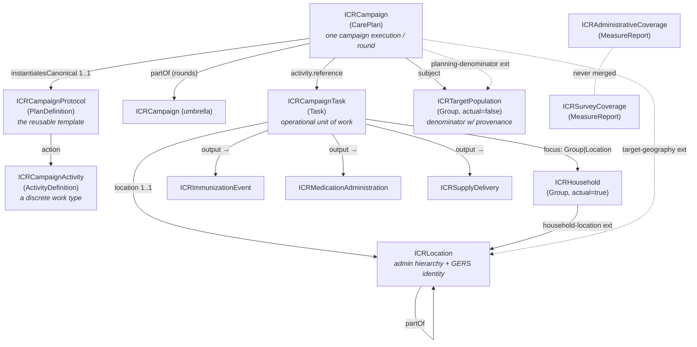

# ICR FHIR IG v0.1 — Reviewer's Explainer

`v0.1.0 · Last modified Jun 12, 2026 at 8:10 AM EDT`

> [!note] What this document is
> A component-by-component walkthrough of the draft FHIR IG in [`ig/`](../ig/README.md), written for review. For every artifact it covers **what it is**, **the rationale** (with pointers back to [[icr-v1]] sections), and **questions worth asking** before this hardens into v1.0. It describes the IG exactly as committed — every cardinality, binding, and fixed value below was checked against the FSH source.

---

## 1. Orientation — what's in the IG

The IG is ~820 lines of FHIR Shorthand (FSH), compiled by SUSHI into FHIR R4 artifacts. Inventory:

| Layer | Count | Artifacts |
|---|---|---|
| **Profiles — campaign architecture** | 4 | ICRCampaignProtocol (PlanDefinition), ICRCampaign (CarePlan), ICRCampaignActivity (ActivityDefinition), ICRCampaignTask (Task) |
| **Profiles — population & geography** | 3 | ICRHousehold (Group), ICRTargetPopulation (Group), ICRLocation (Location) |
| **Profiles — delivery events** | 3 | ICRImmunizationEvent (Immunization), ICRMedicationAdministration (MedicationAdministration), ICRSupplyDelivery (SupplyDelivery) |
| **Profiles — coverage** | 2 | ICRAdministrativeCoverage (MeasureReport), ICRSurveyCoverage (MeasureReport) |
| **Extensions** | 20 | See §8 |
| **CodeSystems** | 8 | campaign-type, delivery-strategy, record-origin, missed-reason, noncompliance-reason, denominator-source, data-lineage, coverage-source |
| **ValueSets** | 10 | One per code system, plus a narrowed independent-coverage set and an ATC-based MDA medication set |
| **Example instances** | 12 | A coherent measles–rubella SIA scenario + an MDA event + an ITN delivery (§10) |
| **Narrative pages** | 2 | `index.md` (home), `background.md` (design rationale & open questions) |

File map (`ig/input/fsh/`): `aliases.fsh`, `codesystems.fsh`, `valuesets.fsh`, `extensions.fsh`, `profiles-campaign.fsh`, `profiles-population.fsh`, `profiles-delivery.fsh`, `profiles-coverage.fsh`, `examples.fsh`.

**Build:** `sushi build .` compiles FSH → JSON; `./_genonce.sh` renders the IG website (needs Java 17+). The commit is SUSHI-clean (compiles without errors).

---

## 2. IG metadata (`sushi-config.yaml`)

| Field | Value | Notes |
|---|---|---|
| `id` | `unicef.fhir.icr` | NPM-style package id |
| `canonical` | `https://fhir.icr.unicef.org` | Base URL of every profile/extension/CS/VS |
| `name` / `title` | `ICR` / "Integrated Campaign Registry (ICR) Implementation Guide" | |
| `status` / `version` | `draft` / `0.1.0` | |
| `fhirVersion` | `4.0.1` | FHIR **R4** (per proposal) |
| `license` | `Apache-2.0` | |
| `jurisdiction` | UN M49 `001` "World" | Global IG, not country-specific |
| `copyrightYear` | `2026+` | |
| `releaseLabel` | `ci-build` | |
| `publisher` | "UNICEF Integrated Campaign Registry project (Ona + Crosscut)", url `https://ona.io` | |
| `menu` | Home, Background, Artifacts | |
| `parameters` | `show-inherited-invariants: false`, `shownav: true` | |

**Rationale.** The canonical `https://fhir.icr.unicef.org` stakes out a UNICEF-owned namespace; the same base hosts the two provisional identifier-system URIs (§3). The toolchain (FSH/SUSHI/IG Publisher) deliberately matches WHO SMART Guidelines practice (working doc §11).

> [!warning] Questions
> 1. **Canonical URL ownership** — does UNICEF actually control `fhir.icr.unicef.org` (or intend to)? Changing canonicals after publication is painful; this needs early confirmation.
> 2. **Publisher attribution** — is "(Ona + Crosscut)" with `ona.io` as URL the right public attribution, or should UNICEF be the publisher of record?
> 3. **No dependencies declared** — the background page commits to aligning with WHO SMART Immunizations / the Immunization DAK, but the config declares no dependency on it (or on IHE mCSD, etc.). Intentional for v0.1, but worth deciding when the dependency gets declared and what "alignment" concretely means.
> 4. `id: unicef.fhir.icr` — confirm this fits the package-naming convention UNICEF wants (most are `<org>.fhir.<scope>`, so it's plausible, but it's permanent).

---

## 3. Aliases & identifier systems (`aliases.fsh`)

Three groups:

- **External terminologies:** `$CVX` (`http://hl7.org/fhir/sid/cvx`, vaccine codes), `$ATC` (`http://www.whocc.no/atc`, WHO drug classification), `$VaccineCodeVS` (the core FHIR vaccine-code ValueSet).
- **ICR identifier-system URIs** (explicitly marked *provisional — to be confirmed before v1.0*):
  - `$GERSId = https://fhir.icr.unicef.org/identifiers/overture-gers` — Overture Maps GERS IDs
  - `$PCode = https://fhir.icr.unicef.org/identifiers/pcode` — OCHA P-codes
- **ICR code systems:** eight `$...` aliases, one per CodeSystem in §9.

**Rationale.** GERS and P-codes need *some* system URI to live under in `Location.identifier`; parking them under the ICR canonical is the pragmatic v0.1 choice. CVX/ATC/GS1 as the international product-code backbone is working doc §8.

> [!warning] Questions
> 1. **Should ICR mint the GERS/P-code system URIs at all?** If Overture or OCHA ever publish official URIs, every stored identifier would need migration — or ICR's URIs become permanent aliases. Worth raising on chat.fhir.org / with Overture.
> 2. GS1 is named in the narrative ("commodity (GS1)") but has **no alias and no binding** anywhere — `ICRSupplyDelivery.suppliedItem.item[x]` is left uncoded. Intentional looseness or a gap?

---

## 4. The architecture at a glance

FHIR has no native `Campaign` resource, so the IG profiles core resources. The structural story:

Reading order for a reviewer: protocol → campaign → task → delivery events is the *operational* spine; Group/Location is the *identity* spine; MeasureReport is the *analytics* readout. Five cross-cutting invariants recur everywhere (§12): coded delivery strategy, campaign-vs-routine record origin, real-time-vs-reconciled lineage, denominator provenance, and never-merged coverage lineages.

---

## 5. Campaign-architecture profiles (`profiles-campaign.fsh`)

### 5.1 ICRCampaignProtocol — `PlanDefinition`

*The reusable, version-controlled template for a campaign type — what a measles SIA __is__ (products, age bands, activity sequence, coverage goals), instantiated by every execution in every country.* (working doc §7.1)

| Element | Constraint |
|---|---|
| `status`, `version`, `title` | MS |
| `type` | **1..1 MS**, bound **required** to ICRCampaignTypeVS |
| `subject[x]` | MS — "Target population definition (age band, eligibility)" |
| `goal` | MS — "Coverage targets / thresholds (e.g. ≥95% admin coverage; ≥65% epidemiological coverage for LF)" |
| `action` | MS — "The activity sequence, instantiated as ICRCampaignActivity definitions" |
| `extension[deliveryStrategy]` | **1..\* MS** — "Delivery strategies this protocol uses — campaigns routinely mix them" |

**Rationale.** Separating protocol from execution is design decision #2: a country defines "measles–rubella SIA, 9m–14y" once and every district/round instantiates it, giving cross-campaign comparability for free. Delivery strategy is **mandatory and repeatable** at protocol level because hybrid strategies are the norm (background page: "an ITN campaign is B then A").

> [!warning] Questions
> 1. `type` is 1..1, but `PlanDefinition.type` semantically distinguishes plan kinds (order-set vs protocol…) in base FHIR — here it's repurposed for campaign type. Reasonable, but reviewers may ask whether `topic` or a dedicated extension is cleaner.
> 2. Nothing constrains `action` to actually reference ICRCampaignActivity (the `^short` says it, the profile doesn't enforce `action.definition[x]`). Tighten in a later draft?
> 3. No `library`/eligibility-logic story yet (age-band eligibility as CQL?) — presumably deferred along with the DAK alignment.

### 5.2 ICRCampaign — `CarePlan` (the keystone)

*A specific campaign execution. Begins life as a microplan (`intent=plan`) and evolves into the execution record as Tasks complete and coverage accumulates. Rounds are sibling ICRCampaigns under an umbrella campaign via `partOf`.* (working doc §7.2, §6.3)

| Element | Constraint |
|---|---|
| `instantiatesCanonical` | **1..1 MS**, only `Canonical(ICRCampaignProtocol)` |
| `status` | MS — "draft → active → completed" |
| `intent` | MS — "plan (microplan) transitioning to order (execution)" |
| `category` | **1..\* MS**, bound **required** to ICRCampaignTypeVS |
| `subject` | MS, only `Reference(ICRTargetPopulation)` |
| `period` | **1..1 MS** — campaign/round dates |
| `careTeam`, `addresses` | MS (`addresses` = the disease/condition targeted) |
| `partOf` | only `Reference(ICRCampaign)` — umbrella/round pattern |
| `activity` | MS; `activity.reference` only `Reference(ICRCampaignTask)` |
| Extensions | `campaignRound` 0..1 MS (positiveInt) · `targetGeography` 0..\* MS (→Location) · `planningDenominator` 0..1 MS (→Group) · `dataLineage` 0..1 (code, *not* MS) |

**Rationale.** CarePlan won over a custom resource, Encounter, and RequestGroup (design decision #1) because it natively supports plan→execution lifecycle, `instantiatesCanonical`, population subjects, and `partOf` composition. **Every campaign must point at its protocol** (1..1) — that is what makes campaign data reusable rather than ad-hoc. `subject` typed to ICRTargetPopulation makes the denominator a first-class participant rather than an afterthought; `planningDenominator` additionally disambiguates *which* estimate is THE denominator when several exist (§6.2).

> [!warning] Questions
> 1. **`instantiatesCanonical` 1..1 is strict** — every ad-hoc/emergency campaign must first author a protocol. Is that the intended forcing function, or does it deserve a relief valve (0..1 with a flag)?
> 2. `subject` only ICRTargetPopulation: a sub-national CarePlan whose subject is a *geography* rather than a population must route through `targetGeography` instead. Is the split (subject=who, extension=where) clearly enough documented?
> 3. The umbrella campaign is itself an ICRCampaign, so it too needs `instantiatesCanonical`, `category`, `subject`, `period` — fine, but means the umbrella must carry a denominator. Intended?
> 4. `dataLineage` is the only campaign extension *not* marked MS — deliberate (lineage matters more on Task/MeasureReport) or an oversight?
> 5. `activity.reference` locked to Task only — excludes the R4 alternative `activity.detail` (inline activities). Worth stating in narrative that inline activities are out.

### 5.3 ICRCampaignActivity — `ActivityDefinition`

*A discrete work type within a campaign — "administer albendazole to children 5–14", "distribute ITNs to households" — instantiated as ICRCampaignTask resources.* (working doc §7.3)

| Element | Constraint |
|---|---|
| `status` | MS |
| `kind` | fixed `#Task` |
| `code` | **1..1 MS** — "The intervention: vaccinate / treat / distribute / spray" |
| `product[x]` | MS — "Vaccine (CVX) / drug (ATC) / commodity (GS1)" |
| `dosage` | MS — "Where applicable; dose-pole logic references an Observation" |
| `extension[deliveryStrategy]` | 0..1 MS |

**Rationale.** `kind = #Task` hard-wires the instantiation target: activities become Tasks, not ServiceRequests. Product and dosage ride on the definition so the protocol carries the clinical content once.

> [!warning] Questions
> 1. `product[x]` is MS but **unbound** — CVX/ATC are mentioned in the `^short` only. The delivery-event profiles do bind product codes; should the definition side bind too, for consistency?
> 2. `deliveryStrategy` is 0..1 here but 1..\* on the protocol and 1..1 on the Task — the asymmetry is defensible (strategy resolved per-task) but worth a sentence of narrative.
> 3. **No example instance exists for this profile** (§10) — reviewers can't see `action` → ActivityDefinition wiring in practice.

### 5.4 ICRCampaignTask — `Task`

*The assignable, trackable operational unit of work — one Task per site-session (Type A, focus = the site Location) or per household (Type B, focus = the household Group). Whether Tasks are assigned at village or household level is a configuration choice.* (working doc §7.4)

| Element | Constraint |
|---|---|
| `status` | MS — "requested → in-progress → completed / failed" |
| `intent`, `for`, `owner`, `executionPeriod`, `output` | MS |
| `code` | **1..1 MS** |
| `focus` | **1..1 MS**, only `Reference(Group or Location)` — "site Location (Type A) or household Group (Type B/C)" |
| `location` | **1..1 MS**, only `Reference(ICRLocation)` |
| `output` | MS — "references to Immunization / MedicationAdministration / SupplyDelivery, or aggregate counts" |
| Extensions | `deliveryStrategy` **1..1 MS** · `housesVisited` 0..1 · `childrenPresent` 0..1 · `childrenAbsent` 0..1 · `missedReason` 0..\* · `noncomplianceReason` 0..\* · `fingerMarked` 0..1 · `dataLineage` 0..1 |

**Rationale.** This is where campaign type A/B/C polymorphism lands: the *same* profile serves a fixed-post site-session and a house-to-house visit, discriminated by `focus` type and the mandatory coded `deliveryStrategy`. The seven optional extensions are exactly the house-to-house data elements (houses visited, present/absent, missed/noncompliance reasons, finger marking) that only exist for strategy B — they're 0..x because they're meaningless for fixed-post tallies. Delivery events hang off `Task.output` because **R4 Immunization has no `basedOn`** (the reverse link doesn't exist; see §7).

> [!warning] Questions
> 1. **Task granularity at scale** is the IG's own #1 open question (one Task per household × national campaign = millions of Tasks). The profile keeps both options open; the scale question is punted to community review — fine, but make sure pilots test the household-level worst case.
> 2. `focus` allows raw `Group or Location` — not narrowed to ICRHousehold/ICRLocation, while `location` *is* narrowed to ICRLocation. Deliberate looseness or tighten for symmetry?
> 3. The count extensions (`housesVisited`, `childrenPresent`/`Absent`) are unsignedInt **point values** — no age-band or sex disaggregation. Real tally sheets disaggregate; is the answer "use `output` with aggregate counts" and if so, where's the pattern documented?
> 4. `missedReason`/`noncompliance` at Task level aggregates over the whole visit — per-child reasons would need person-level records. Worth stating which level the data is expected at.
> 5. No constraint ties `output.valueReference` to the three delivery-event profiles — the `^short` says it; the profile doesn't enforce it.

---

## 6. Population & geography profiles (`profiles-population.fsh`)

### 6.1 ICRHousehold — `Group`

*Group (who lives there) + Location (the dwelling, via the household-location extension). The dwelling Location carries the Overture GERS building ID, giving the household stable identity across campaigns.* (working doc §7.5, §9.1 — "the validated Ona pattern")

| Element | Constraint |
|---|---|
| `type` | fixed `#person` |
| `actual` | fixed `true` |
| `member` | MS; `member.entity` only `Reference(Patient)` |
| `quantity` | MS — "Household size where individuals are not enumerated" |
| `extension[householdLocation]` | **1..1 MS** → `Reference(Location)` |

**Rationale.** Separating *who* (Group) from *where* (Location) means the dwelling's identity (GERS building ID) survives household composition changes, and the household survives re-mapping. `quantity` covers the common case where campaigns count household members without registering individuals — person-level `member` entries are optional by design.

> [!warning] Questions
> 1. The `householdLocation` extension targets plain `Reference(Location)`, not ICRLocation — so a household *can* point at a non-GERS dwelling. Loosen-now-tighten-later, or should it require ICRLocation?
> 2. No `Group.identifier` guidance — how is a *household* itself identified across campaigns (vs its dwelling)? The cross-campaign record-linkage question is acknowledged as open; flagging that the profile is silent here.
> 3. `actual = true` + `type = #person` is right, but `member.entity` locked to Patient excludes RelatedPerson — fine for campaigns, just confirming it's deliberate.

### 6.2 ICRTargetPopulation — `Group`

*A target-population denominator: a conceptual cohort (`actual=false`) with a count, eligibility characteristics, and — critically — source and date provenance. Multiple competing estimates per geography are retained; exactly one is flagged as the planning denominator.* (working doc §7.6, §4.2)

| Element | Constraint |
|---|---|
| `type` | fixed `#person` |
| `actual` | fixed `false` |
| `quantity` | **1..1 MS** — the denominator count |
| `characteristic` | MS — "Age band, sex, eligibility rule, geography" |
| Extensions | `denominatorSource` **1..1 MS** (CodeableConcept, extensible) · `estimateDate` **1..1 MS** (date) · `isPlanningDenominator` 0..1 MS (boolean) · `confidence` 0..1 (string) |

**Rationale.** Design decision #6 ("denominator-first"): the denominator is the dominant error source in campaign analytics, so an estimate without source+date is not allowed to exist — both provenance extensions are **mandatory**. Keeping *competing* estimates (census projection vs GRID3 vs microcensus) as sibling Groups and flagging one (`isPlanningDenominator`) preserves the audit trail instead of overwriting.

> [!warning] Questions
> 1. **"Exactly one is the planning denominator" is not machine-enforced** — no invariant prevents two Groups for the same geography both setting the flag true (or none). Enforceable only with an invariant scoped to "same geography + campaign", which is hard; the `ICRCampaign.planningDenominator` extension (which *is* singular, 0..1) may be the real enforcement point. Worth documenting that resolution.
> 2. How does an estimate **link to its geography**? `characteristic` `^short` mentions geography, and R4 `Group.characteristic.value[x]` does allow `Reference` — so a `valueReference(Location)` characteristic is *possible* — but no characteristic pattern (which `characteristic.code`? which value type?) is profiled. Concretely, the example instance links geography only via free-text `name`. A defined characteristic slice (or a geography extension mirroring `target-geography`) is needed before estimates are computably joinable to Locations.
> 3. `confidence` as free string — fine for v0.1; consider coded confidence later.

### 6.3 ICRLocation — `Location`

*The most-customized ICR resource: nested administrative hierarchy (6+ levels), operational geography linkable-but-distinct from admin units, GeoJSON boundaries, and multi-system geospatial identity — GERS IDs as the preferred cross-campaign join key, with P-codes and national codes as coequal aliases.* (working doc §7.7, §9)

| Element | Constraint |
|---|---|
| `name`, `status` | MS |
| `partOf` | MS, only `Reference(ICRLocation)` — "country → region → district → ward → settlement" |
| `physicalType` | MS — "jurisdiction / site / building / household" |
| `type` | MS — "facility / school / community-distribution-point / temporary-post / household" |
| `position` | MS — GPS point |
| `identifier` | MS, **sliced by `system` (value discriminator, open)**: `gers` 0..1 MS (system = `$GERSId`) · `pcode` 0..1 MS (system = `$PCode`) |
| `extension[boundary]` | 0..1 MS — GeoJSON Attachment, "the geometry Crosscut enriches and pushes back" |

**Rationale.** Design decision #8. Open slicing means national location codes coexist with GERS/P-codes without profile changes. The GERS `^short` carries an operationally crucial instruction: **record the Overture release version alongside the ID** (GERS IDs are stable but the registry versions). The boundary extension mirrors the R5 standard extension on R4 (working doc §10 q6).

> [!warning] Questions
> 1. **Overture release version has no field** — the `^short` says to record it, but there's no extension/element to put it in (Identifier has no version slot; `identifier.period` is a stretch). Needs a concrete pattern before pilot data exists.
> 2. `partOf` only ICRLocation forces the *entire* hierarchy to be ICR-conformant — pragmatic, but means you can't hang an ICR site off a non-ICR national registry Location without re-profiling it.
> 3. Both GERS and P-code slices are 0..1 — so a Location with **no stable identifier at all** is conformant. Should at least one identifier be required at, say, admin-unit levels?
> 4. The 6+-level `partOf` chain's query performance (deep `Location.partOf` recursion on mobile) is a flagged open question — nothing in the profile mitigates it (no `ancestor` denormalization extension). Fine for v0.1; track it.
> 5. `type` `^short` lists values (facility / school / …) but `Location.type` is **unbound** — no ICR value set. Add one, or bind to the HL7 ServiceDeliveryLocationRoleType?

---

## 7. Delivery-event profiles (`profiles-delivery.fsh`)

All three share two design constants: a **mandatory `record-origin` extension (1..1 MS)** — campaign vs routine, so SIA doses never contaminate routine coverage analytics (working doc §4.4) — and the **Task→event link running through `Task.output`** because R4 Immunization has no `basedOn` element to point back with.

### 7.1 ICRImmunizationEvent — `Immunization`

| Element | Constraint |
|---|---|
| `status`, `patient`, `occurrence[x]`, `location`, `lotNumber`, `manufacturer`, `performer` | MS |
| `vaccineCode` | MS, bound **extensible** to the core FHIR vaccine-code VS (CVX) — "local codes map back via ConceptMap" |
| `protocolApplied` | MS — "Dose number / series — supports multi-dose campaigns (OCV) and routine integration" |
| `extension[recordOrigin]` | **1..1 MS** (code: campaign \| routine, required binding) |

`lotNumber`/`manufacturer` MS = lot accountability (AEFI traceability); `protocolApplied` is the bridge to routine-immunization series logic.

### 7.2 ICRMedicationAdministration — `MedicationAdministration`

| Element | Constraint |
|---|---|
| `status`, `effective[x]` | MS |
| `medication[x]` | only CodeableConcept; bound **extensible** to ICRMDAMedicationVS (WHO ATC) |
| `subject` | MS — "the treated person, **or the community/household Group** for register-level capture" |
| `dosage` | MS — "Tablet count — usually derived from a dose-pole height band Observation" |
| `supportingInformation` | MS — "e.g. the dose-pole Observation the dosage was derived from" |
| Extensions | `recordOrigin` **1..1 MS** · `directlyObserved` 0..1 MS (boolean — MDA DOC protocol) |

The dose-pole pattern (dosage *derived from* a height-band Observation referenced via `supportingInformation`) is the distinctly-MDA piece; `directlyObserved` captures the supervision protocol that distinguishes "handed out" from "swallowed".

### 7.3 ICRSupplyDelivery — `SupplyDelivery`

| Element | Constraint |
|---|---|
| `status` | MS |
| `suppliedItem`, `suppliedItem.quantity`, `suppliedItem.item[x]` | MS — "GS1 GTIN-coded commodity where applicable" |
| `destination` | MS — "Where the commodity went (post, household)" |
| `extension[recordOrigin]` | **1..1 MS** |

> [!warning] Questions (delivery layer)
> 1. **Aggregate vs individual records** is a flagged open question; these profiles are individual-event-shaped. `ICRMedicationAdministration.subject` pointing at a Group is the aggregate escape hatch — but Immunization.patient cannot be a Group in R4, so **type-A tally-only campaigns have no Immunization representation**; presumably aggregate counts live in `Task.output`/MeasureReport. The narrative should state this split explicitly.
> 2. `vaccineCode` binds to the generic FHIR VS rather than an ICR-curated SIA vaccine subset — fine (extensible), but countries will ask which codes to use for MR/bOPV/nOPV2.
> 3. No GS1 binding/alias for `suppliedItem.item[x]` (§3 q2). The ITN example uses free text only.
> 4. `recordOrigin` is the only mandatory extension — `dataLineage` (realtime/reconciled) is *absent* from delivery events (it lives on CarePlan/Task/MeasureReport). If individual events arrive in both streams, can a consumer tell? (Presumably via the parent Task — worth one narrative sentence.)

---

## 8. Coverage profiles (`profiles-coverage.fsh`)

*Administrative and independently-measured coverage are distinct lineages of the same conceptual quantity — separately profiled, never merged.* (working doc §4.1; the recurring evidence: **Cuamba, Mozambique — ~99% admin vs ~76% survey**.) Measure definitions are meant to align with what ministries already owe: WHO JAP, ICG M&E minimum dataset, ESPEN treatment-coverage schema, WHO EPI — the `Measure` resources themselves are deferred (§13).

### 8.1 ICRAdministrativeCoverage — `MeasureReport`

| Element | Constraint |
|---|---|
| `status`, `type`, `reporter`, `group` | MS |
| `period` | **1..1 MS** |
| Extensions | `coverageSource` **1..1 MS**, **fixed `valueCode = #administrative`** · `denominatorSource` 0..1 MS · `dataLineage` 0..1 MS |

### 8.2 ICRSurveyCoverage — `MeasureReport`

| Element | Constraint |
|---|---|
| `status`, `type`, `reporter`, `group` | MS |
| `period` | **1..1 MS** |
| Extensions | `coverageSource` **1..1 MS**, value bound **required** to ICRIndependentCoverageSourceVS (survey \| lqas \| rcm) |

**Rationale.** The "never merge" rule is enforced *structurally*: the admin profile pins `coverageSource` to the single code `administrative`; the survey profile re-binds the same extension to a value set that *excludes* `administrative`. A resource can't be both. Admin coverage additionally carries its denominator's provenance (because admin coverage is only as good as its denominator) and a realtime/reconciled lineage flag; survey coverage doesn't need either (its denominator is the sample design).

> [!warning] Questions
> 1. The description promises survey coverage carries "**method, sample design, and date**" — date is `period`, method is `coverageSource`, but **sample design has no element or extension**. Gap to close (or soften the description).
> 2. MeasureReport-vs-Observation for coverage is a flagged open question; MeasureReport won for v0.1. The strongest argument to document: MeasureReport's numerator/denominator `group.population` structure matches coverage natively.
> 3. Neither profile constrains `measure` (the canonical Measure being reported) — unavoidable until the Measure definitions ship, but it means v0.1 coverage reports aren't yet comparable by measure identity.
> 4. `ICRSurveyCoverage` has no `denominatorSource`/`dataLineage` extensions at all — correct per the rationale above, but confirm survey *reconciliation* (preliminary vs final survey results) never needs lineage.
> 5. **No example instances** for either coverage profile (§10).

---

## 9. Extensions (`extensions.fsh`) — all 20

*FHIR has no native campaign semantics; these extensions carry them on profiled core resources.* (working doc §7)

**Campaign mechanics**

| Extension (id) | Context | Type / binding | Card. where used |
|---|---|---|---|
| DeliveryStrategy (`delivery-strategy`) | PlanDefinition, ActivityDefinition, Task, Location | CodeableConcept, **required** → ICRDeliveryStrategyVS | Protocol 1..\*, Activity 0..1, Task 1..1 |
| CampaignRound (`campaign-round`) | CarePlan | positiveInt | 0..1 |
| TargetGeography (`target-geography`) | CarePlan | Reference(Location) | 0..\* |
| PlanningDenominator (`planning-denominator`) | CarePlan | Reference(Group) | 0..1 |
| RealtimeVsReconciled (`realtime-vs-reconciled`) | CarePlan, Task, MeasureReport | code, **required** → ICRDataLineageVS | 0..1 each |

**House-to-house task data** (all Context: Task)

| Extension (id) | Type / binding |
|---|---|
| HousesVisited (`houses-visited`) | unsignedInt |
| ChildrenPresent (`children-present`) | unsignedInt |
| ChildrenAbsent (`children-absent`) | unsignedInt |
| MissedReason (`missed-reason`) | CodeableConcept, **extensible** → ICRMissedReasonVS |
| NoncomplianceReason (`noncompliance-reason`) | CodeableConcept, **extensible** → ICRNoncomplianceReasonVS |
| FingerMarked (`finger-marked`) | boolean — "the in-field 'already covered' flag" |

**Population & denominator provenance**

| Extension (id) | Context | Type / binding |
|---|---|---|
| HouseholdLocation (`household-location`) | Group | Reference(Location) — the Group+Location household pattern |
| DenominatorSource (`denominator-source`) | Group, MeasureReport | CodeableConcept, **extensible** → ICRDenominatorSourceVS |
| EstimateDate (`estimate-date`) | Group | date — "denominators decay fast (1–3 years)" |
| IsPlanningDenominator (`is-planning-denominator`) | Group | boolean |
| EstimateConfidence (`estimate-confidence`) | Group | string |

**Geospatial, delivery & coverage**

| Extension (id) | Context | Type / binding |
|---|---|---|
| LocationBoundaryGeoJson (`location-boundary-geojson`) | Location | Attachment, `contentType` fixed `application/geo+json` — R4 mirror of the R5 standard boundary extension |
| RecordOrigin (`record-origin`) | Immunization, MedicationAdministration, SupplyDelivery | code, **required** → ICRRecordOriginVS |
| DirectlyObservedConsumption (`directly-observed-consumption`) | MedicationAdministration | boolean |
| CoverageSource (`coverage-source`) | MeasureReport | code, **required** → ICRCoverageSourceVS |

**Rationale highlights.** The binding-strength pattern is deliberate: **structural discriminators** (delivery strategy, record origin, lineage, coverage source) are `required` — analytics must be able to branch on them; **field-reality vocabularies** (missed/noncompliance reasons, denominator sources) are `extensible` — countries add local codes, mapped back via ConceptMap. Code vs CodeableConcept also tracks this: pure discriminators use bare `code`; concepts countries extend use CodeableConcept (text + local codings survive).

> [!warning] Questions
> 1. `RealtimeVsReconciled` is never required anywhere (0..1 at all three uses). If consumers are expected to "filter by lineage", absent = which stream? Define a default (e.g. absent ⇒ realtime) or make it required on MeasureReport.
> 2. `TargetGeography`/`PlanningDenominator`/`HouseholdLocation` target unprofiled `Reference(Location/Group)` rather than ICRLocation/ICRTargetPopulation — same loosen-vs-tighten call as §6.
> 3. House-to-house counts say "children" — vitamin A / MDA target other age bands; consider renaming to eligible-persons counts (or noting "children" is generic) before the names ossify.
> 4. `LocationBoundaryGeoJson`: when ICR eventually moves to R5 (or the cross-version extension), migration of stored attachments is trivial, but the **URL** changes — the alignment path is parked as working doc §10 q6; keep it on the v1.0 checklist.
> 5. `DeliveryStrategy` declares **`Location` as a context, but no profile uses it there** — ICRLocation's only extension is the boundary. Presumably intended for tagging site Locations (fixed/temporary posts) with their strategy; either wire it into ICRLocation or drop the context.

---

## 10. Terminology (`codesystems.fsh`, `valuesets.fsh`)

Pattern (working doc §8): **ICR defines only campaign semantics**; product codes come from CVX/ATC/GS1; local codes join via ConceptMap (deferred). All 8 code systems are `caseSensitive` and non-experimental.

| CodeSystem | Codes | FR? | Bound (strength) |
|---|---|---|---|
| ICRCampaignTypeCS | `vaccination-sia`, `mda`, `itn-distribution`, `irs`, `vitamin-a`, `integrated` (6) | ✔ | Protocol.type, Campaign.category (**required**) |
| ICRDeliveryStrategyCS | `fixed-post`, `temporary-post`, `mobile`, `school`, `house-to-house`, `community-directed` (6) | ✔ | delivery-strategy ext (**required**) |
| ICRRecordOriginCS | `campaign`, `routine` (2) | — | record-origin ext (**required**) |
| ICRMissedReasonCS | `absent`, `sleeping`, `sick`, `refusal`, `inaccessible`, `not-visited`, `other` (7) | — | missed-reason ext (extensible) |
| ICRNoncomplianceReasonCS | `safety-concern`, `religious-objection`, `no-felt-need`, `campaign-fatigue`, `misinformation`, `other` (6) | — | noncompliance-reason ext (extensible) |
| ICRDenominatorSourceCS | `census`, `census-projection`, `microcensus`, `worldpop`, `grid3`, `hmis`, `other` (7) | — | denominator-source ext (extensible) |
| ICRDataLineageCS | `realtime`, `reconciled` (2) | — | realtime-vs-reconciled ext (**required**) |
| ICRCoverageSourceCS | `administrative`, `survey`, `lqas`, `rcm` (4) | — | coverage-source ext (**required**) |

Value sets: one whole-system VS per code system, plus:

- **ICRIndependentCoverageSourceVS** — enumerates `survey`, `lqas`, `rcm` only (excludes `administrative`); the ICRSurveyCoverage binding. This little VS is what makes "never merge the lineages" structurally enforceable.
- **ICRMDAMedicationVS** — includes **all of ATC** (extensible binding on MDA medication). The description says "representative PC-NTD codes" but the actual definition is the full ATC system — by design, since restricting ATC subtrees in v0.1 would be guesswork.

Domain notes a reviewer might verify: `sleeping` is the polio doorstep convention; `community-directed` is CDTI, the NTD-MDA backbone; campaign types are grouped **by delivery model, not disease** (the background page's Type A/B/C table); `integrated` exists because co-delivered campaigns are the norm and component activities carry their own types.

> [!warning] Questions
> 1. **French designations are inconsistent with the stated intent.** The file comment says "EN + FR designations on the two Required systems" — but *four more* systems are also bound required (record-origin, data-lineage, coverage-source… plus campaign-type/delivery-strategy which do have FR). Either extend FR to all required systems (record-origin and data-lineage are tiny) or reword the comment. Localization policy generally (which languages, where) deserves a stated rule.
> 2. ICRMDAMedicationVS description vs content mismatch (says "representative codes", includes everything) — harmless but will confuse implementers reading the rendered IG; fix the description or add the enumerated PC-NTD drug list.
> 3. `other` codes exist in missed-reason/noncompliance/denominator-source but the "record detail in text" instruction has no designated text element on the bare-`code`-typed… (n/a — these three are CodeableConcept, so `.text` works; fine). For the **required**-bound `code`-typed extensions there is no `other` — confirm the closed sets (campaign/routine; realtime/reconciled; 4 coverage sources) really are exhaustive. E.g. is *post-campaign administrative correction* a third lineage? Is *desk review* a coverage source?
> 4. Campaign-type granularity: `vaccination-sia` lumps measles, polio (preventive), HPV, YF, OCV — disease lives in `CarePlan.addresses`. Confirm partners (esp. polio program) accept disease-agnostic campaign typing.

---

## 11. Examples (`examples.fsh`) — the scenario walkthrough

One coherent story: a **Kambia District (Sierra Leone) measles–rubella SIA, June 2026** — fixed-post (Type A) with house-to-house mop-up (Type B) — plus a standalone MDA event (Type C) and an ITN delivery.

| # | Instance | Profile | Key content |
|---|---|---|---|
| 1 | `example-district` | ICRLocation | "Kambia District", physicalType `jdn`; **both identifier slices**: P-code `SL0201` + GERS division ID |
| 2 | `example-settlement` | ICRLocation | "Rokupr", `area`, partOf district, GPS point, GERS place ID |
| 3 | `example-dwelling` | ICRLocation | house (`ho`), partOf settlement, GPS, GERS building ID |
| 4 | `example-child` | **plain Patient** | Aminata Kamara, f, b. 2023-04-12 |
| 5 | `example-household` | ICRHousehold | quantity 6, member → child, householdLocation → dwelling |
| 6 | `example-target-population` | ICRTargetPopulation | 48,250 children 9m–14y; source **GRID3**, estimateDate 2026-01-15, isPlanningDenominator true |
| 7 | `example-mr-sia-protocol` | ICRCampaignProtocol | v1.0.0; type `vaccination-sia`; **two** deliveryStrategy values (fixed-post + house-to-house); goal "≥95% administrative coverage…"; action title |
| 8 | `example-mr-sia-2026` | ICRCampaign | instantiates #7; status active, **intent `plan`**; subject & planningDenominator → #6; period Jun 15–26 2026; round 1; targetGeography → district |
| 9 | `example-mopup-task` | ICRCampaignTask | completed; **focus & for → household**, location → dwelling; strategy house-to-house; childrenPresent 2 / absent 1; missedReason `absent`; fingerMarked true; output → #10 |
| 10 | `example-mcv-dose` | ICRImmunizationEvent | CVX `05` measles; patient → child; at the dwelling; lot `MRV-2026-0412`; **recordOrigin `campaign`** |
| 11 | `example-albendazole-administration` | ICRMedicationAdministration | ATC `P02CA03`; dosage "1 tablet (400 mg), **dose-pole band B**"; directlyObserved true; recordOrigin campaign |
| 12 | `example-itn-delivery` | ICRSupplyDelivery | 3 nets (UCUM `{Net}`), free-text LLIN, destination → dwelling; recordOrigin campaign |

What the scenario *demonstrates* well: the full Location chain with GERS at every level; the household pattern; denominator provenance in action; protocol→campaign instantiation; a Type-B task with the house-to-house extensions exercised end-to-end down to the dose; both non-vaccine delivery types.

> [!warning] Questions
> 1. **Three profiles have no example**: ICRCampaignActivity, ICRAdministrativeCoverage, ICRSurveyCoverage. The coverage pair is the IG's most distinctive analytic claim — an admin-vs-survey example pair (e.g. the Cuamba 99/76 divergence) would *show* the never-merge rule. High-value addition.
> 2. The campaign has `intent = plan` but a **completed Task and delivered dose** — defensible mid-transition snapshot, but an execution-phase example (or flipping to `order`) would better match the "plan → order" narrative. Also: the example never shows the umbrella/`partOf` round pattern.
> 3. The Task example is mop-up only — no Type-A site-session Task (focus = site Location), so the `focus` polymorphism is asserted but only half-exemplified.
> 4. The albendazole event references the child from the MR scenario for an MDA that has **no campaign/protocol/task instances** — fine as a fragment, but a reviewer tracing references will notice the MDA thread dangles.
> 5. GERS values are placeholder-format (`…-example`) — fine, but before pilots confirm real GERS ID syntax so examples validate against the eventual identifier pattern.
> 6. The MCV dose lacks `performer`, `manufacturer`, and `protocolApplied` despite all three being MS — legal (MS ≠ required) and arguably realistic, but the flagship example might as well exercise the MS elements.

---

## 12. Narrative pages (`index.md`, `background.md`)

- **`index.md`** — the pitch (campaigns re-collect the same data; ICR makes collection compound), the one-paragraph architecture (mirrors §4 above), status (v0.1, Phase 1, to be revised against real datasets and FHIR community review), and the deferred-items list.
- **`background.md`** — the Type A/B/C campaign-typology table; the **twelve design decisions** (numbered, with rejected alternatives noted for the keystone choice); the **open design questions** taken to the FHIR community (Task granularity, aggregate vs individual records, deep partOf hierarchies, MeasureReport vs Observation, denominator representation, GeoJSON on R4, Task focus typing, Bulk Data access patterns, record-linkage); and the WHO SMART Guidelines relationship (reuse DAK elements, align conventions, same toolchain).

These two pages are honest about maturity — the open questions are printed in the IG itself rather than hidden in the working doc. Design decisions #5, #11, #12 (three lineages; provenance on everything ingested; ViewDefinitions in the IG) are stated in narrative but only partially realized in v0.1 artifacts — see §13.

---

## 13. Cross-cutting design invariants (the things to hold the review against)

1. **Delivery strategy is first-class and coded** — required binding; mandatory on Protocol (1..\*) and Task (1..1). *The* discriminator, because strategy determines which data elements exist.
2. **Record origin is mandatory on every delivery event** (1..1, required binding) — the firewall between SIA doses and routine coverage.
3. **Three lineages, never merged** — planned (CarePlan/Group), delivered (Task/events → admin coverage), independently measured (survey coverage). Enforced by the fixed `#administrative` code on one profile and the exclusion VS on the other.
4. **No denominator without provenance** — source + date are 1..1 on ICRTargetPopulation; competing estimates coexist; one planning flag.
5. **Geospatial identity is multi-system with GERS preferred** — open identifier slicing on Location; Group+Location household pattern keys households to GERS building IDs.
6. **Real-time vs reconciled is one structure, filtered by lineage** — currently the *weakest-enforced* invariant (always 0..1; see §9 q1).

---

## 14. Known gaps (acknowledged, deferred to later drafts)

Stated in the README/index — i.e., absent **by design**, not oversight:

- **SQL-on-FHIR `ViewDefinition`s** (design decision #12 — "the analytics layer is as portable as the data model")
- **`ConceptMap` scaffolds** for country/local code localization (the mechanism §10's extensible bindings rely on)
- **`Consent` guidance** (household/person data governance)
- **`Measure` definitions** aligned to WHO JAP / ICG / ESPEN / WHO EPI reporting minimums (what MeasureReports will point at)
- **Data conformance testing** against real campaign datasets; **FHIR community review** (chat.fhir.org, WG calls, Connectathons)
- No `CapabilityStatement`, search-parameter, or Bulk-Data/cohort-export guidance yet (the access-pattern open question)

---

## 15. Consolidated review checklist

The questions above, ranked by what most needs an answer before v0.2:

**Decisions needed**
1. Canonical URL + publisher attribution confirmed with UNICEF (§2).
2. GERS/P-code identifier system URIs — keep ICR-minted or seek official ones (§3); plus a concrete slot for the **Overture release version** (§6.3).
3. Default semantics for absent `realtime-vs-reconciled` — or make it required on MeasureReport (§9).
4. How a target-population estimate links to its geography, computably (§6.2).
5. Aggregate-vs-individual representation for Type-A tally campaigns — document the `Task.output` / MeasureReport split (§7).

**Internal consistency fixes (cheap)**
6. FR designations vs the "two Required systems" comment (§10 q1).
7. ICRMDAMedicationVS description vs content (§10 q2).
8. ICRSurveyCoverage's promised "sample design" element (§8 q1).
9. Reference-target tightening sweep: Task.focus, household-location, target-geography, planning-denominator (§5.4/§6/§9).

**Examples to add**
10. ICRCampaignActivity; an admin-vs-survey coverage pair (ideally the Cuamba divergence); a Type-A site-session Task; the umbrella/round `partOf` pattern (§11).

**Hold for community review (already flagged in the IG)**
11. Task granularity at scale; deep partOf performance; MeasureReport vs Observation; GeoJSON on R4; record-linkage pattern; Bulk Data access (§12 of background page).
