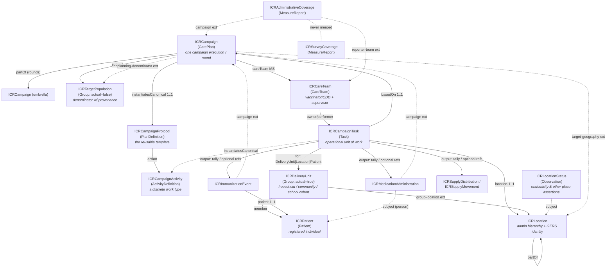
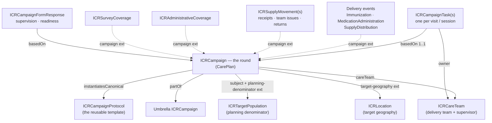
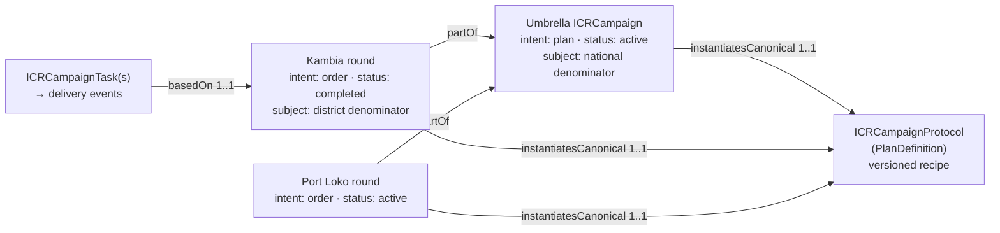
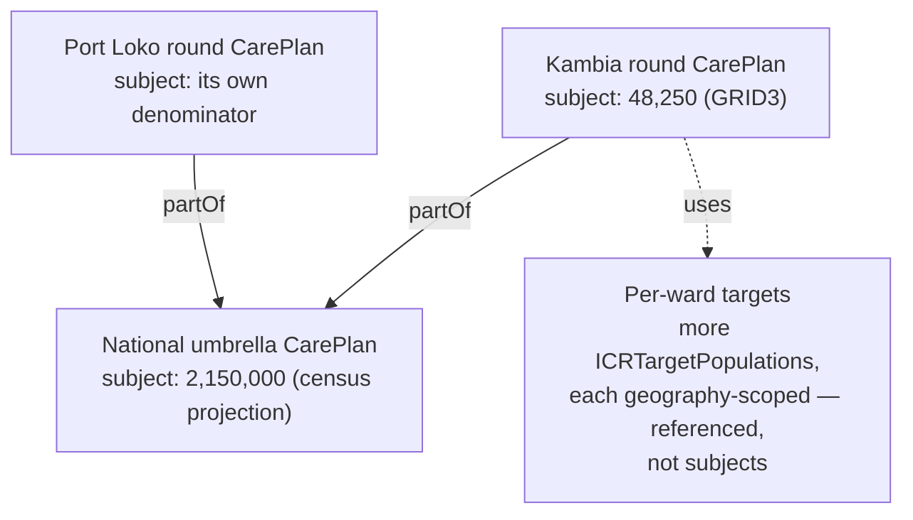
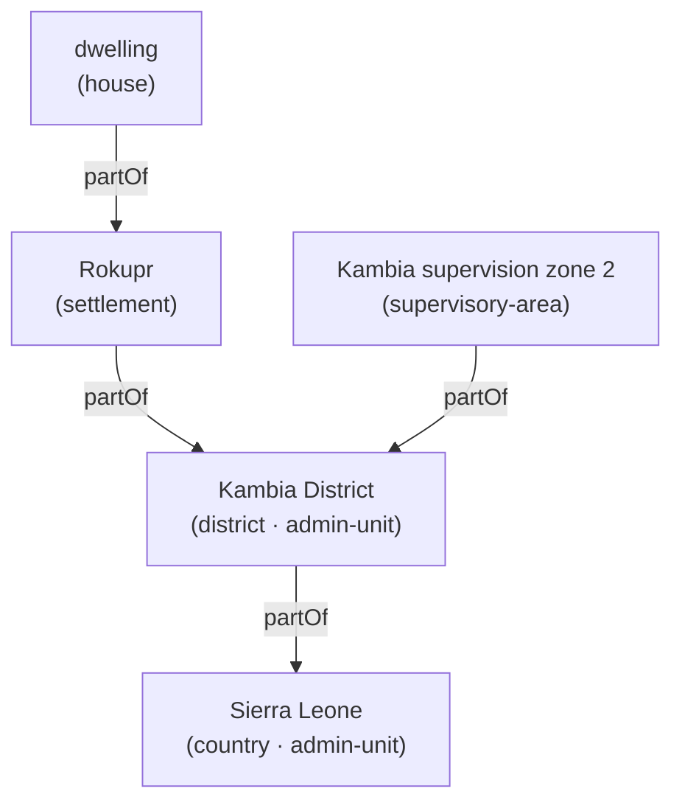
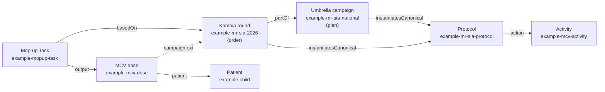

# Integrated Campaign Registry (ICR) FHIR Implementation Guide v0.1 — Summary & Companion (Simplified English)
`Simplified English edition · Derived from ig-summary.md · Aug 19, 2026`

⁠

> [!note] **About this edition.** This document is the Simplified Technical English edition of [[ig-summary]]. The rules: active voice, short sentences, one idea for each sentence, the same word for the same idea, no jargon. The technical content is identical — profiles, tables, codes, numbers, and examples do not change. Review comments stay in the source document.

> [!note] **This is a draft for feedback. It is not a final standard.** We show the open questions and the roadmap (§13) on purpose. We made v0.1 so that partners can test it against real campaign data and partner experience. You can challenge each design decision in this document. The published IG is at [**https://icr.healthcampaigns.org**](https://icr.healthcampaigns.org). Send feedback to the ICR project team at Ona/UNICEF.

* * *
## Abbreviations & glossary
This section is a quick reference for each abbreviation in this document. The abbreviations are in groups by area. Names in `code font` (for example, `ICRCampaign`) are FHIR artifacts that the IG defines. These names are not abbreviations.

**Campaign types & public-health programmes**

| Abbrev. | Meaning |
| --- | --- |
| **ICR** | Integrated Campaign Registry — the project and the FHIR IG that this document describes |
| **SIA** | Supplementary Immunization Activity — a **mass vaccination campaign**, not routine immunization |
| **PMVC** | Preventive Mass Vaccination Campaign (for example, yellow fever) |
| **MDA** | Mass Drug Administration — a campaign that gives a drug to the full eligible population |
| **ITN / LLIN** | Insecticide-Treated Net / Long-Lasting Insecticidal Net (bed-net distribution) |
| **IRS** | Indoor Residual Spraying (anti-malaria) |
| **RI** | Routine Immunization — the everyday schedule (contrast: SIA) |
| **EPI** | Expanded Programme on Immunization — the routine-immunization programme |
| **NTD / PC-NTD** | Neglected Tropical Disease / Preventive-Chemotherapy NTD |
| **CDD** | Community Drug Distributor — the front-line MDA worker |
| **CDTI** | Community-Directed Treatment with Ivermectin — the delivery model for NTD MDA |
| **RCM** | Rapid Convenience Monitoring — a quick non-probability check during a campaign; **the result is pass/fail with a trigger, not a coverage rate** |
| **LQAS** | Lot Quality Assurance Sampling — a decision rule that accepts or rejects a lot from a small sample |
| **AEFI** | Adverse Event Following Immunization |
| **DOC** | Directly Observed Consumption — in MDA, the person swallows the drug while a worker watches |
| **TAS** | Transmission Assessment Survey — a decision gate for NTD elimination |
| **RED** | Reaching Every District — a WHO microplanning approach |
| **EYE** | Eliminate Yellow fever Epidemics — a WHO strategy |
| **FIP** | Fully Immunized Person |

**Vaccines, diseases & product codings**

| Abbrev. | Meaning |
| --- | --- |
| **MR** | Measles–Rubella |
| **MCV** | Measles-Containing Vaccine |
| **OCV** | Oral Cholera Vaccine |
| **YF** | Yellow Fever |
| **HPV** | Human Papillomavirus |
| **bOPV / nOPV2** | bivalent / novel-type-2 Oral Polio Vaccine |
| **CVX** | the US-CDC vaccine-code system (standard vaccine codes) |
| **ATC** | Anatomical Therapeutic Chemical classification — the WHO drug codes |
| **GS1 / GTIN** | global commodity-coding standards / Global Trade Item Number |
| **UCUM** | Unified Code for Units of Measure |
| **VVM / WMF** | Vaccine Vial Monitor / Wastage Monitoring Form |

**Geography & identifiers**

| Abbrev. | Meaning |
| --- | --- |
| **GERS** | Global Entity Reference System — the stable place IDs from Overture Maps |
| **P-code** | Place code — the OCHA code for a humanitarian administrative area |
| **OCHA** | UN Office for the Coordination of Humanitarian Affairs |
| **ISO 3166** | the ISO standard for country (-1) and subdivision (-2) codes |
| **GIS / MFL** | Geographic Information System / Master Facility List |
| **GeoJSON** | a geospatial JSON data format |
| **GPS** | Global Positioning System — a coordinate point |
| **OSM** | OpenStreetMap |
| **PSU / EA** | Primary Sampling Unit / Enumeration Area (survey sampling) |

**FHIR & technical**

| Abbrev. | Meaning |
| --- | --- |
| **FHIR** | Fast Healthcare Interoperability Resources — the HL7 standard for health data |
| **IG** | Implementation Guide — a packaged set of FHIR profiles and rules for one use-case |
| **FSH / SUSHI** | FHIR Shorthand (the authoring language) / its compiler |
| **R4 / R5** | FHIR Release 4 (this IG) / Release 5 |
| **MS** | Must Support — a FHIR conformance flag ("implementations must populate and process this element") |
| **VS / CS** | ValueSet / CodeSystem |
| **CQL** | Clinical Quality Language — decision logic |
| **IPS** | International Patient Summary |
| **SNOMED CT / ICD-11 / LOINC** | clinical terminologies (concepts / diseases / observations) |
| **JSON** | JavaScript Object Notation |
| **FR** | French-language (`fr`) designations on code systems |

**WHO SMART Guidelines, organizations & reporting**

| Abbrev. | Meaning |
| --- | --- |
| **WHO / UNICEF** | World Health Organization / UN Children's Fund |
| **DAK** | Digital Adaptation Kit — WHO SMART-Guidelines content |
| **IMMZ** | the artifact prefix of the WHO SMART Immunizations IG |
| **L1 / L2 / L3** | the WHO SMART-Guidelines "levels of knowledge representation" — narrative / semi-structured / machine-readable FHIR |
| **VPD** | Vaccine-Preventable Disease (surveillance) |
| **HMIS / DHIS2** | Health Management Information System / District Health Information Software 2 |
| **JAP** | Joint Appraisal — the annual immunization-programme report |
| **ICG** | International Coordinating Group — provides the vaccine stockpiles (OCV/YF) |
| **ESPEN** | Expanded Special Project for Elimination of NTDs (WHO-AFRO) |
| **GTFCC** | Global Task Force on Cholera Control |
| **VCQI** | Vaccination Coverage Quality Indicators — survey toolkit |
| **M&E** | Monitoring and Evaluation |
| **mCSD** | Mobile Care Services Discovery — an IHE profile for a location directory |
| **CPG / CRMI / SDC** | HL7 frameworks: Clinical Practice Guidelines / Canonical Resource Management Infrastructure / Structured Data Capture |

* * *
## 1. Introduction
### 1.1 What is FHIR?
**FHIR** (Fast Healthcare Interoperability Resources) is the modern standard for health data. HL7 publishes this standard. Systems use FHIR to represent and to exchange health data. FHIR does not use custom file formats. FHIR defines a library of building blocks with the name **resources**. Examples of resources are `Patient`, `Immunization`, `Location`, `Group`, and `CarePlan`.

Each resource is a structured object with a defined set of fields. A system can serialize a resource as JSON. This document uses JSON in all examples. A system can exchange a resource through a standard REST API. A system can validate a resource against its definition. All systems use the same resource vocabulary, so two systems that never met can understand each other's data.

This IG uses **FHIR Release 4 (R4, version 4.0.1)**. R4 is the most widely deployed release. The WHO digital-health guidelines also target R4.
### 1.2 What is an Implementation Guide?
Base FHIR is intentionally generic. The `Patient` resource must serve a hospital in one country and a vaccination campaign in another country. Thus most fields are optional and have loose types. An **Implementation Guide (IG)** makes this generic standard specific for one use case. An IG is a published package. The package contains these items:

- **Profiles** — constrained, specialized versions of base resources. An example is "a `Location` that must have an administrative hierarchy and a stable place ID". A profile says which fields are required. A profile says which codes are permitted. A profile says what each field means in its context.
- **Extensions** — extra fields that the base resource does not have. An extension adds these fields in a standard, interoperable way.
- **Terminology** — `CodeSystem`s and `ValueSet`s. A `CodeSystem` is a list of codes that the IG owns. A `ValueSet` is the set of codes that a given field permits.
- **Examples** — concrete instances that show conformant data.
- **Narrative** — pages that explain the design and the implementation.

An IG changes "FHIR in general" into "FHIR, exactly as this programme needs it". Data from different implementers then becomes comparable by construction.

The authors write the ICR IG in **FHIR Shorthand (FSH)**. FSH is a concise text language for profiles. **SUSHI** (the FSH compiler) compiles the FSH to FHIR JSON. The **IG Publisher** renders the result as a website.
### 1.3 Introducing the ICR IG
Health campaigns collect the same data again and again. Examples of health campaigns are measles SIAs, polio rounds, mass drug administration for neglected tropical diseases, bed-net campaigns, and indoor-spraying campaigns. The data includes who lives where, the number of eligible children, the persons reached, and the coverage achieved. Each campaign then archives or locks this data in a one-time spreadsheet. The next campaign starts with no data.

The **Integrated Campaign Registry (ICR)** is a FHIR Implementation Guide. It gives campaigns one shared, reusable data model. With this model, the data from each campaign accumulates, and no team collects the same data again. The scope of the ICR is the part of immunization-and-delivery work that routine-health systems do **not** model. The WHO routine-immunization IG also does not model this part. The scope includes these areas:

- **Campaign architecture** — a reusable protocol, its executions and rounds, the discrete activities, the operational units of work (Tasks), and the teams that do this work.
- **Population & geography** — denominators with provenance, the household, community, and school-cohort groups that the campaign reached, the registered individuals in these groups, and a rich location model. The location model includes the administrative hierarchy, the operational geography, stable cross-campaign place IDs, and GeoJSON boundaries.
- **Delivery events** — the vaccine doses, the drug administrations, and the commodity deliveries, plus the adverse events that follow them. Each delivery event has a campaign-vs-routine flag. Campaign data and routine-programme data can be in the same system. The flag makes sure that each type is counted in its own statistics. A campaign dose never increases the routine coverage figures. A routine dose never increases the campaign coverage figures.
- **Coverage** — administrative coverage and independently-surveyed coverage. These are two lineages of the same quantity. The IG keeps the two lineages **separate and never merges them**. Canonical `Measure` definitions support them.

The ICR is intentionally a **complement** to the WHO SMART Immunizations IG. The WHO IG models routine work only. A campaign dose and a routine dose can be in the same store. A single `record-origin` flag shows the type of each dose. The ICR positions itself as "the campaign SMART-Guidelines IG" (see §13.3).

The IG covers the major campaign delivery models: fixed and temporary-post sessions (people come to a post), house-to-house delivery (workers go from door to door), community/MDA delivery (a team treats a full community, frequently at register level), and school-based delivery (a team treats the enrolled cohort of a school). Two coded concepts describe every model, and this document uses them in all sections:

- **The delivery strategy** — *how* teams deliver: `fixed-post`, `temporary-post`, `mobile`, `school`, `house-to-house`, `community-directed`, `outreach` (§9). It is mandatory on every protocol and Task.
- **The delivery unit** — *what* a Task acts on. One rule sets its type: **a delivery unit with members is a Group; a delivery unit without members is a Location** (§5.1). Households, communities, and school cohorts have members and an associated location, so they are Groups. A structure under IRS, a church or market that hosts a temporary post, and an area target (settlement, ward, district) have no members, so they are Locations.
### 1.4 IG metadata
These package-level settings set the identity of the IG. All settings become permanent after publication. Thus several settings have flags for UNICEF confirmation before v1.0 (see §13.4):

| Field | Value | Notes |
| --- | --- | --- |
| `id` | `unicef.fhir.icr` | NPM-style package id (`<org>.fhir.<scope>` convention) |
| `canonical` | `https://icr.healthcampaigns.org` | Base URL of each profile, extension, CodeSystem, and ValueSet. Also hosts the provisional identifier-system URIs |
| `name` / `title` | `ICR` / "Integrated Campaign Registry (ICR) Implementation Guide" |     |
| `status` / `version` | `draft` / `0.1.0` |     |
| `fhirVersion` | `4.0.1` | FHIR **R4** |
| `license` | `Apache-2.0` |     |
| `jurisdiction` | UN M49 `001` "World" | Global IG, not country-specific |
| `publisher` | **UNICEF** |     |
| `menu` | Home, Background, Artifacts |     |

The canonical `https://icr.healthcampaigns.org` is a domain that the project controls. This domain hosts the published IG. Thus each canonical URL resolves to the artifact that it names. The same base URL also hosts the provisional geographic-identifier system URIs (§2.4).

The toolchain (FSH / SUSHI / IG Publisher) intentionally matches WHO SMART Guidelines practice. The team proposes to add a formal `dependsOn smart.who.int.base` dependency when the alignment becomes stable (§13.3). To date, the IG has one real package dependency: `hl7.fhir.uv.sdc` **4.0.0** (HL7 Structured Data Capture). The espen-forms round added this dependency. It carries the SDC template-based-extraction extensions that the ESPEN MDA instruments use (§4.8).
### 1.5 What the IG contains
| Layer | Count | Artifacts |
| --- | --- | --- |
| **Profiles — campaign architecture** | 4   | ICRCampaignProtocol (PlanDefinition), ICRCampaign (CarePlan), ICRCampaignActivity (ActivityDefinition), ICRCampaignTask (Task) |
| **Profiles — population & geography** | 5   | ICRPatient (Patient — the registered individual), ICRDeliveryUnit (Group — household/community/school-cohort), ICRTargetPopulation (Group — denominator), ICRLocation (Location), ICRFacilityOrganization (Organization — the accountable facility entity, mCSD pairing) |
| **Profiles — delivery events** | 4   | ICRImmunizationEvent (Immunization), ICRMedicationAdministration (MedicationAdministration), ICRSupplyDistribution + ICRSupplyMovement (SupplyDelivery — the supply split, §6.3) |
| **Profiles — coverage** | 2   | ICRAdministrativeCoverage (MeasureReport), ICRSurveyCoverage (MeasureReport) |
| **Profiles — safety & teams** | 3   | ICRAdverseEvent (AdverseEvent — intervention-neutral AEFI/MDA safety), ICRCareTeam (CareTeam), ICRCampaignFormResponse (QuestionnaireResponse — the filled campaign form: supervision, readiness, monitoring…) |
| **Profiles — governance** | 1   | ICRConsent (Consent — person-data governance) |
| **Measures** | 6   | `icr-admin-coverage`, `icr-survey-coverage`, `icr-mda-treatment-coverage`, `icr-geographic-coverage`, and (forms-v1) `icr-zero-dose-coverage`, `icr-campaign-readiness` — the canonical definitions that the coverage and readiness MeasureReports instantiate (§7) |
| **Questionnaire / ConceptMap** | 8 / 1 | The two canonical checklists — `icr-mda-supervision-checklist` (the structured supervision checklist, §4.6) and (forms-v1) `icr-campaign-readiness-checklist` (the pre-campaign readiness checklist, §4.7) — plus (espen-forms) six source-faithful ESPEN MDA example instruments `espen-mda-location-registration` / `-drug-receipt` / `-treatment` / `-case-management` / `-supervision-hf` / `-supervision-cdd` (§4.8); `icr-aefi-causality-to-immz` (ICR ↔ WHO IMMZ causality map, §6.5) |
| **Extensions** | 37  | See §10 |
| **CodeSystems** | 28  | See §9 |
| **ValueSets** | 30  | Usually one per code system, plus purpose-built sets (§9) |
| **Example instances** | 61  | A coherent measles–rubella SIA scenario, an activity gallery, a community-directed MDA scenario, adverse events, team & supervision, (forms-v1) a person-targeted follow-up revisit and a readiness validation, plus (v0.1) a supply-driven descoping trio (§11), (v0.1.1) the mCSD facility pair, a calculated ward-sum denominator, the STH-MDA campaign frame, the IRS chain, and zero-dose/readiness reports, and the school-based delivery trio (school / school cohort / school-session Task), a custom-national-identifier ward, and an LQAS lot assessment (§11) |
| **Narrative pages** | 2   | `index.md` (home), `background.md` (design rationale & open questions) |

File map (`ig/input/fsh/`): `aliases.fsh`, `codesystems.fsh`, `valuesets.fsh`, `extensions.fsh`, `profiles-campaign.fsh`, `profiles-population.fsh`, `profiles-delivery.fsh`, `profiles-coverage.fsh`, `profiles-consent.fsh`, `profiles-adverse.fsh`, `profiles-careteam.fsh`, `measures.fsh`, `questionnaires.fsh`, `questionnaires-espen.fsh` (espen-forms), `conceptmaps.fsh`, `examples.fsh`.

**Build:** The command `sushi build .` compiles FSH → JSON. The script `./_genonce.sh` renders the IG website. This script needs Java 17+. The current commit compiles clean (0 errors / 0 warnings).

* * *
## 2. Architecture at a glance
FHIR does not have a native `Campaign` resource. Thus ICR builds its campaign layer on the **CarePlan** resource. Around this layer, ICR adds profiles for population, geography, delivery events, teams, and coverage. The diagram below shows how the parts connect.


### 2.1 The three layers
Read the IG as three layers that intersect:

- **The operational layer** — `protocol → campaign → task → delivery events`. This layer is the chain of work. A reusable template (PlanDefinition) becomes one specific campaign or round (CarePlan). The campaign divides into units of work (Task). Each Task produces delivery events: doses, drug administrations, and deliveries.
- **The identity layer** — `Patient` + `Group` + `Location`. The IG keeps the persons a campaign acts on separate from the places where they live and where work occurs. A **Group** identifies the persons. In ICR, a Group is a **household**, a **community**, or a **school cohort** — the delivery units that have members. `ICRDeliveryUnit` models these groups and lists `ICRPatient` individuals; `ICRTargetPopulation` models the denominator cohorts. This separation keeps a location's identity stable when the group at that location changes, and keeps a group's identity stable when its location data changes.
- **The analytics layer** — `Measure` + `MeasureReport`. The coverage readout is adjacent to the other two layers. The system computes coverage from the other two layers. The IG keeps administrative coverage and survey coverage as separate records. The system never merges these records.
### 2.2 The key components
**Campaign architecture (§4)**

- **ICRCampaignProtocol** *(PlanDefinition)* — the reusable, versioned **template** for a campaign type. It defines one time what a "measles–rubella SIA" is: products, age bands, activity sequence, and coverage goals. Thus each country and each round can instantiate the same template and stay comparable.
- **ICRCampaign** *(CarePlan)* — **one specific campaign execution or round.** It is the core resource that represents campaigns. It **starts as a microplan and becomes an execution record** as Tasks complete. The same resource changes; the system does not replace it. A national "umbrella" campaign and its district "rounds" use the same profile. The `partOf` element links them.
- **ICRCampaignActivity** *(ActivityDefinition)* — **a discrete work type** in a campaign, for example "administer MCV", "distribute ITNs", or "spray structures". A campaign can contain more than one activity. The activity holds the clinical and commodity content one time. Thousands of Tasks instantiate one activity.
- **ICRCampaignTask** *(Task)* — **the unit of work that teams can assign and track.** There is one Task for each site-session (persons come to a fixed or temporary post). There is one Task for each household, community, or school visit (workers go to the unit). One profile holds every delivery model.
- **ICRCareTeam** *(CareTeam)* — **the model for the delivery team and the supervisor.** It records who did the work and who is accountable for a reported number. Through the workload extension, it also records the area and the workload that the microplan assigned to the team. **ICRCampaignFormResponse** *(QuestionnaireResponse)* is the related structured record — the filled campaign form that supervision and QA (and readiness, §4.7) submissions use.

**Population & geography (§5)**

- **ICRDeliveryUnit** *(Group,* `actual=true`*)* — **the actual group of persons a Task acts on**: a household, a community, or a school cohort. A delivery unit without members (a structure, a temporary site, an area target) is a Location instead (§5.1).
- **ICRTargetPopulation** *(Group,* `actual=false`*)* — **a denominator**: a conceptual cohort with a count and eligibility characteristics. It must also have source and date provenance; this requirement is important. Competing estimates for the same place stay side by side.
- **ICRLocation** *(Location)* — **the place model.** It is the ICR resource with the most customization. It has a nested administrative hierarchy and an operational geography that is adjacent to the admin tree. It also has GeoJSON boundaries and a multi-system geospatial identity (GERS, P-codes, national and ISO codes).
- **ICRPatient** *(Patient)* — **the registered individual**: a listed household, community, or school-cohort member. The person has a stable identifier that applies across campaigns. Gender and birth date are mandatory because they control eligibility and disaggregation. A name is required. **ICRConsent** *(Consent)* is the related governance profile.
- **ICRLocationStatus** *(Observation)* — **a time-varying property assertion about a place**, joined to the Location rather than stored inside it: endemicity per disease (the JRSM district table as data), with future axes such as access status. Pre-coordinated property codes; provenance on every assertion (§5.6).

**Delivery events & safety (§6)**

- **ICRImmunizationEvent** *(Immunization)* — **a vaccine dose** given in a campaign.
- **ICRMedicationAdministration** *(MedicationAdministration)* — **a drug administration** (MDA), for example albendazole. It includes the dose-pole pattern and the directly-observed-consumption pattern.
- **ICRSupplyDistribution** *(SupplyDelivery)* — **last-mile distribution to the people it serves** (bed-nets to a household). The coverage-bearing supply event: its recipient household join is what per-capita net coverage computes against.
- **ICRSupplyMovement** *(SupplyDelivery)* — **a commodity movement between supply-chain nodes** (receipt at a facility, issue to a team). The stock-bearing supply event: it carries the stock-accountability ledger for wastage and reconciliation, chains via `partOf`, and never counts toward coverage.
- **ICRAdverseEvent** *(AdverseEvent)* — an **intervention-neutral safety event**. One profile serves AEFI (after a vaccine dose) and MDA pharmacovigilance (after a drug).

Each delivery event and the adverse event carry a mandatory `record-origin` flag (campaign vs routine). Each delivery event also carries its own **campaign link** — the local `campaign` extension, `Reference(ICRCampaign)`. (Earlier drafts reused the HL7 `event-basedOn` extension; R4 declares that extension's context on other resource types, so the IG now mints its own — §6.) A delivery event therefore stands alone: patient + campaign + origin. "All doses in this round" is a direct query and never depends on Task wiring.

**Coverage (§7)**

- **ICRAdministrativeCoverage** *(MeasureReport)* — coverage that the system computes from the campaign's own tally and delivery data. It includes the stratified treatment cube (sex × age band × disposition) and implementation-unit ("geographic") coverage.
- **ICRSurveyCoverage** *(MeasureReport)* — coverage that an independent method measures (cluster survey, LQAS, RCM). The structure prevents a merge with administrative coverage.
- Six canonical **Measure** definitions. The reports point at these definitions (§7.3).
- Both coverage profiles carry the same `campaign` extension the delivery events use. Thus a coverage figure joins its campaign (round) directly (§7).
### 2.3 Five cross-cutting principles
§8 gives the full statement of the design invariants. Keep these five principles in mind while you read:

1. **Delivery strategy is a core, coded concept** — a required binding, mandatory on the protocol (`1..*`) and on the Task (`1..1`). Strategy is the primary discriminator. Strategy determines which data elements exist. For example, house-to-house tallies have no meaning at a fixed post.
2. **Record origin is mandatory on every delivery event** (`1..1`) — this flag separates data captured in a campaign from data captured by routine immunization programmes. Thus coverage calculations never mix the two.
3. **Three views of coverage, kept separate and never merged.** A campaign produces three different counts of the persons it reached. The planned count is the target population, the denominator. The administrative count is what the campaign's own records show (administrative coverage). The survey count is what an independent survey measured later (survey coverage). ICR stores these counts as three separate records and never merges them, because the counts frequently disagree in reality. For example, a campaign tally can report 99% coverage while a post-campaign survey reports 76%.
4. **Denominator provenance is required on every estimate** — a source code travels with each denominator, even a low-precision code such as `govt-estimate` or `unknown`. The estimate date is recommended. Competing estimates coexist. A flag marks one estimate as the planning denominator.
5. **Geospatial identity is multi-system, GERS-preferred** — locations can carry multiple identifiers. Operational geography lives in the same single `partOf` tree as the admin hierarchy. Its `type` code — not its tree position — is what separates it from the admin units.
### 2.4 Aliases & identifier systems
The IG defines aliases (short names) for the external systems and the internal systems that it references:

- **External terminologies** — `$CVX` (vaccine codes, `http://hl7.org/fhir/sid/cvx`), `$ATC` (WHO drug codes, `http://www.whocc.no/atc`), `$VaccineCodeVS` (the core FHIR vaccine ValueSet), and `$MeasurePopulation` (the HL7 measure-population code system that the coverage examples use).
- **ICR geographic-identifier system URIs** *(provisional — confirm before v1.0)*:
  
  - `$GERSId = https://icr.healthcampaigns.org/identifiers/overture-gers` — Overture Maps GERS IDs. This is the preferred join key across campaigns.
  - `$PCode = https://icr.healthcampaigns.org/identifiers/pcode` — OCHA P-codes.
  - `$ISO3166 = urn:iso:std:iso:3166` / `$ISO3166v2 = urn:iso:std:iso:3166:-2` — the **FHIR-designated** system URIs for ISO 3166-1 country codes and ISO 3166-2 subdivision codes. These URIs apply to admin levels 0–1 only. Deeper levels have no ISO codes.
  - **National admin codes have no minted URI.** The country's own code goes in the open identifier list under the country's own system URI. This code can be a DHIS2 orgUnit UID, an MoH code, or the P-code where the P-code is the national system. The IG marks this code `use = official`. Thus every consumer has one uniform query for the official admin id: `identifier.where(use = 'official')` (§5.3).
- **Person-identifier URIs** — `$NationalId` / `$RegistryId`, the sliced systems on `ICRPatient.identifier` (§5.4).
- **ICR code systems** — one alias for each CodeSystem (§9).

**Why ICR mints geographic-identifier URIs.** GERS IDs and P-codes need a system URI in `Location.identifier`. The ICR canonical is the pragmatic v0.1 home for these URIs. CVX, ATC, and GS1 are the international product-code backbone. Thus ICR does not create new product codes.

* * *
## 3. How to read the profiles
A **profile** is a constrained, specialized version of a base FHIR resource. The base resource (for example `Location`) is general-purpose. A profile (for example `ICRLocation`) makes the base resource more strict for one use case. A profile applies one or more of these constraints:

- **Make optional fields required**, or limit how many times a field can occur.
- **Limit the resource types that a reference can point at** (for example, "`partOf` may only reference another `ICRLocation`").
- **Bind a coded field to a specific ValueSet**, so the field permits only approved codes.
- **Fix a field to a constant value** (for example, `actual = false` on a denominator group).
- **Add extensions** — new fields that the base resource does not have.

A profile never creates a new resource type. A profile adds rules to an existing resource type. Thus profiled data stays valid plain FHIR. Any FHIR system can read an `ICRLocation` as a `Location`. ICR-aware systems get the extra guarantees.

**Reading the element tables in §4–§7.** Each profile below has a property table. The table style follows the FHIR resource-content tables (for example [build.fhir.org/patient.html](https://build.fhir.org/patient.html)). The columns have these meanings:

- **Element** — the field name. Dot-notation shows nested fields. `extension[name]` shows an added field.
- **Flags** — conformance flags. **MS** = *Must Support*: a conformant implementation must be able to populate the element and process the element. Other FHIR flags, such as the `?!` *modifier* flag, do not appear in this IG.
- **Card.** — *cardinality*, the min..max number of times the element can occur: `1..1` = exactly one (required, single); `0..1` = optional, at most one; `1..*` = at least one (required, repeatable); `0..*` = optional, repeatable.
- **Type / Binding** — the data type or the referenced resource. For coded fields, the column also shows the bound ValueSet and its **binding strength**: **required** (you must use a code from the set), **extensible** (use a code from the set if one fits; if not, add your own code), or a **fixed** value.
- **Description** — the content that the field carries in ICR.

The IG describes profiles or elements with the label **(proposed)** for completeness. The IG does not yet commit to these items.

* * *
## 4. Campaign-architecture profiles
These profiles model the structure of a campaign. The protocol is the template (§4.1). The campaign is the execution (§4.2). The activity defines the work types (§4.3). The Task is the unit of work (§4.4). The CareTeam models the team and the supervisor (§4.5). The supervision record has a defined structure (§4.6).
### 4.1 ICRCampaignProtocol — `PlanDefinition`
**Purpose.** The protocol is the reusable, version-controlled **template** for a campaign type. It defines what a measles SIA *is*: products, age bands, activity sequence, and coverage goals. When a country starts a new campaign, the country instantiates the protocol. A country defines "measles–rubella SIA, 9 months–14 years" one time. Every district and every round then instantiates that protocol. This makes all data collected with this campaign type consistent.

**Properties.**

| Element | Flags | Card. | Type / Binding | Description |
| --- | --- | --- | --- | --- |
| `status` | MS  |     | code | The lifecycle status of the protocol definition (`draft` / `active` / `retired`). |
| `version` | MS  |     | string | The protocol version. "MR SIA per 2026 guidance" and its 2028 revision are two separate versions. You can cite each version. |
| `title` | MS  |     | string | The human-readable title of the protocol. |
| `type` | MS  | 1..1 | CodeableConcept, **required** → ICRCampaignTypeVS | **The kind of campaign** (`vaccination-sia`, `mda`, `itn-distribution`, `irs`, …). The code is disease-agnostic by design. The execution's `addresses` element and the vaccine or drug code record the disease. |
| `subject[x]` | MS  |     |     | The target-population definition (age band, eligibility) — for example "children 9m–14y". **The eligibility restriction lives here, not on the ActivityDefinition** (base R4 ActivityDefinition has no eligibility element). The reference shape is a definitional Group (`actual=false`, no count) with a computable age-band `valueRange` — see `example-sth-eligible-population`, the `subject` of the STH MDA protocol. |
| `goal` | MS  |     |     | The coverage targets and thresholds that every execution inherits (for example, ≥95% admin coverage). |
| `action` | MS  |     |     | The activity sequence — for example, vaccinate, then mop up. Each entry points at an ActivityDefinition. |
| `action.definition[x]` | MS  |     | `Canonical(ICRCampaignActivity)` only | The IG **enforces** the protocol-to-activity link; it does not only describe it. An action can point only at an ICRCampaignActivity. |
| `extension[deliveryStrategy]` | MS  | 1..* | CodeableConcept, **required** → ICRDeliveryStrategyVS | The delivery strategies that this protocol uses. The element is mandatory and repeatable because hybrid strategies are common. For example, an MR SIA operates posts and then does house-to-house mop-up. |

**Example.** `example-mr-sia-protocol` — the protocol for the scenario's measles–rubella SIA:

```json
{
  "resourceType": "PlanDefinition",
  "id": "example-mr-sia-protocol",
  "meta": {
    "profile": [
      "https://icr.healthcampaigns.org/StructureDefinition/ICRCampaignProtocol"
    ]
  },
  "extension": [
    {
      "url": "https://icr.healthcampaigns.org/StructureDefinition/delivery-strategy",
      "valueCodeableConcept": {
        "coding": [
          {
            "code": "fixed-post",
            "system": "https://icr.healthcampaigns.org/CodeSystem/icr-delivery-strategy-cs",
            "display": "Fixed post"
          }
        ]
      }
    },
    {
      "url": "https://icr.healthcampaigns.org/StructureDefinition/delivery-strategy",
      "valueCodeableConcept": {
        "coding": [
          {
            "code": "house-to-house",
            "system": "https://icr.healthcampaigns.org/CodeSystem/icr-delivery-strategy-cs",
            "display": "House-to-house"
          }
        ]
      }
    }
  ],
  "status": "active",
  "version": "1.0.0",
  "title": "Measles–rubella SIA, 9 months–14 years",
  "type": {
    "coding": [
      {
        "code": "vaccination-sia",
        "system": "https://icr.healthcampaigns.org/CodeSystem/icr-campaign-type-cs",
        "display": "Vaccination campaign (SIA)"
      }
    ]
  },
  "goal": [
    {
      "description": {
        "text": "≥95% administrative coverage in every district, verified by post-campaign survey"
      }
    }
  ],
  "action": [
    {
      "title": "Administer MCV to all children 9 months–14 years regardless of prior vaccination status",
      "definitionCanonical": "https://icr.healthcampaigns.org/ActivityDefinition/example-mcv-activity"
    }
  ]
}
```

> The `activity-type` extension (`follow-up`) shown here is **proposed** (§13.2). It is not yet in the IG.
> 
> **Relevant terminology.**
> 
> - `type` binds to **ICRCampaignTypeVS** (`vaccination-sia`, `mda`, `itn-distribution`, `irs`, `vitamin-a`, `integrated`)
> - the strategy extension binds to **ICRDeliveryStrategyVS** (`fixed-post`, `temporary-post`, `mobile`, `school`, `house-to-house`, `community-directed`, `outreach`).
> 
> Both bindings are required bindings (§9).

**Key observations.**

- **The protocol and the execution are separate resources.** The protocol defines a campaign type one time. Each district or round is a separate execution (§4.2). Each execution links back to the protocol through `instantiatesCanonical` (cardinality `1..1`). Every execution references the same protocol. Thus "all measles–rubella SIA rounds" is one query, not a manual reconciliation. This makes campaigns of the same type directly comparable.
- **The protocol carries no geography, dates, or denominator.** These values are specific to one execution, and ICRCampaign holds them (§4.2). The protocol holds only reusable template content: products, delivery strategies, goals, and the activity sequence.
- `type` **is disease-agnostic.** The campaign type (`vaccination-sia`) records the intervention model, not the disease. A measles SIA and a polio SIA are both `vaccination-sia`. The `addresses` element (the target Condition) and the vaccine code distinguish them. A disease code in `type` would duplicate `addresses` and the product code. It would also enlarge the code list. For these reasons, the IG has no disease-specific campaign codes.
- `campaign-type` **and the proposed** `activity-type` **answer two different questions.** `campaign-type` records the kind of intervention — for example `vaccination-sia`, `mda`, or `irs`. The proposed `activity-type` records the reason for the round — for example, a routine follow-up campaign or an emergency outbreak-response campaign. The IG keeps two fields because one intervention can occur for different reasons. A measles follow-up campaign and a measles outbreak-response campaign are both `vaccination-sia`. But they target different age groups, and reports show them separately. With two fields, you can search "all outbreak-response campaigns" or "all measles campaigns" separately. (`activity-type` is proposed and is not yet in the IG; see §13.2.)
- **Age-band eligibility as computable logic (CQL) is deferred to a later round by design.** The protocol's `subject` already carries eligibility *definitionally* — a Group with a computable age-band `valueRange` (see the properties table) — so downstream systems can read "who is this protocol for" without parsing title text. Executable rule logic (CQL `action.condition` applicability) pairs with the WHO DAK/CQL alignment work (§13.3). Note this is definition, not enforcement: point-of-delivery enforcement stays in form logic (dose pole), and an out-of-band administration remains recordable as a protocol deviation.
### 4.2 ICRCampaign — `CarePlan`
An ICRCampaign is one **specific campaign execution.** It starts as a microplan (`intent = plan`). As Tasks complete and coverage accumulates against it, the same resource becomes the record of the campaign implementation. One resource supports each phase of the campaign. Rounds are sibling ICRCampaigns under a national "umbrella" campaign, linked through `partOf`. Every execution points back at the one versioned protocol.

**One campaign, as a hub.** Every key component either hangs off the round or points at it. The campaign references its definition side (protocol, umbrella, denominator, geography, team); the operational and analytical records — tasks, delivery events, supply movements, coverage reports — all point **at** the campaign, so the CarePlan is never rewritten as they accumulate:



> [!note] What "round" means in ICR A **round** is a child ICRCampaign execution (`partOf` the umbrella). It has its own period and its own reporting obligation — the Kambia June round versus the Port Loko July round. The `campaign-round` extension carries only the ordinal (round 1, round 2). Use it for repeated passes of the same campaign — a two-round OCV campaign, or NIDs round 2. "Round" is *not* the count of campaigns run on one campaign model. To get that count, query the executions of a protocol.

**Lifecycle — in plain terms.** One CarePlan has two stages. First it is the **plan** — a microplan with `intent = plan` and `status = draft`. Then it becomes the **record of what actually happened** as teams do the work. `intent` changes to `order`, and `status` moves `draft → active → completed`. Tasks and coverage accumulate against that same resource.



The campaign umbrella represents the microplan and stays at `intent = plan`. It is the planning shell. It holds the national denominator and binds the rounds together. Each round moves from `plan` to `order` as it executes. Every box points at the **same** protocol. Thus "all MR SIA rounds, anywhere" is one query.

**Who vs where.**

Each CarePlan has exactly **one** `subject` — the *who*. The subject is an ICRTargetPopulation ("children 9m–14y, Kambia, 48,250").

The *where* is separate and plural: `targetGeography` is `0..*`. The umbrella/round structure carries multiple and nested populations. One CarePlan does not carry them all.



**Properties.**

| Element | Flags | Card. | Type / Binding | Description |
| --- | --- | --- | --- | --- |
| `instantiatesCanonical` | MS  | 1..1 | `Canonical(ICRCampaignProtocol)` only | The protocol that this campaign executes. The `1..1` cardinality makes the protocol mandatory. Every campaign, including an ad-hoc campaign, must author a protocol first. |
| `status` | MS  |     |     | `draft → active → completed`. |
| `intent` | MS  |     |     | `plan` (microplan) changes to `order` (execution). This value shows the lifecycle stage. |
| `category` | MS  | 1..* | CodeableConcept, **required** → ICRCampaignTypeVS | The campaign type or types. The value repeats the protocol's `type`. |
| `subject` | MS  |     | `Reference(ICRTargetPopulation)` only | The single denominator (the *who*). This makes the denominator a first-class part of the campaign, not an afterthought. |
| `period` | MS  | 1..1 | Period | The campaign or round dates. |
| `careTeam` | MS  |     | `Reference(ICRCareTeam)` | The team or teams that operate the campaign — see ICRCareTeam (§4.5). |
| `addresses` | MS  |     | `Reference(Condition)` | The disease or condition that the campaign targets. The specific disease lives here because `type` is disease-agnostic. |
| `partOf` |     |     | `Reference(ICRCampaign)` only | The umbrella/round pattern — a round is `partOf` its umbrella. |
| `activity` |     |     | `activity.reference` → `Reference(ICRCampaignTask)` only | An **optional** curated Task list. The canonical link goes the other way: `Task.basedOn` points at this campaign. Thus the CarePlan is not rewritten when tasks are created. Inline activities (`activity.detail`) are prohibited — work is always a referenced Task. |
| `extension[campaignRound]` | MS  | 0..1 | positiveInt | The ordinal of this round. |
| `extension[targetGeography]` | MS  | 0..* | `Reference(ICRLocation)` | The *where*. The element is plural because one campaign can name several geographies. |
| `extension[planningDenominator]` | MS  | 0..1 | `Reference(ICRTargetPopulation)` | Identifies *which* estimate is THE denominator for coverage computation, when several estimates compete. |
| `extension[dataLineage]` | MS  | 0..1 | code, **required** → ICRDataLineageVS | {==Realtime versus reconciled — the live in-field stream versus the corrected close-out figures. See the worked example in §7.2 (default: absent ⇒ realtime).==}{>>Small point about language, but I think 'realtime' is misleading here. It won't be uncommon for the "live in-field stream" to be only updated once a day, and the term "realtime" implies more frequent updates. I suggest using the terms "raw" and "reconciled" instead.<<}{id="c4" by="mckinnoj" at="2026-08-12T10:57:41.520Z"} |
| `extension[socialMobilization]` | MS  | 0..1 | complex: `populationInformed` (boolean) + `channel` 0..* (CodeableConcept, **extensible** → ICRCommunicationChannelVS) | The demand/mobilization record. It states if the population was informed, and through which channels (radio, town criers, community leaders, …). |

**Example — national umbrella (the microplan shell):**

```json
{
  "resourceType": "CarePlan",
  "id": "example-mr-sia-national",
  "meta": {
    "profile": [
      "https://icr.healthcampaigns.org/StructureDefinition/ICRCampaign"
    ]
  },
  "extension": [
    {
      "url": "https://icr.healthcampaigns.org/StructureDefinition/planning-denominator",
      "valueReference": {
        "reference": "Group/example-target-population-national"
      }
    }
  ],
  "instantiatesCanonical": [
    "https://icr.healthcampaigns.org/PlanDefinition/example-mr-sia-protocol"
  ],
  "status": "active",
  "intent": "plan",
  "title": "Measles–rubella SIA, Sierra Leone, 2026",
  "category": [
    {
      "coding": [
        {
          "code": "vaccination-sia",
          "system": "https://icr.healthcampaigns.org/CodeSystem/icr-campaign-type-cs",
          "display": "Vaccination campaign (SIA)"
        }
      ]
    }
  ],
  "subject": {
    "reference": "Group/example-target-population-national"
  },
  "period": {
    "start": "2026-06-15",
    "end": "2026-12-18"
  }
}
```

**Example — the Kambia June round (a child execution of that umbrella):**

```json
{
  "resourceType": "CarePlan",
  "id": "example-mr-sia-2026",
  "meta": {
    "profile": [
      "https://icr.healthcampaigns.org/StructureDefinition/ICRCampaign"
    ]
  },
  "extension": [
    {
      "url": "https://icr.healthcampaigns.org/StructureDefinition/campaign-round",
      "valuePositiveInt": 1
    },
    {
      "url": "https://icr.healthcampaigns.org/StructureDefinition/target-geography",
      "valueReference": {
        "reference": "Location/example-district"
      }
    },
    {
      "url": "https://icr.healthcampaigns.org/StructureDefinition/planning-denominator",
      "valueReference": {
        "reference": "Group/example-target-population"
      }
    },
    {
      "extension": [
        {
          "url": "populationInformed",
          "valueBoolean": true
        },
        {
          "url": "channel",
          "valueCodeableConcept": {
            "coding": [
              {
                "code": "radio",
                "system": "https://icr.healthcampaigns.org/CodeSystem/icr-communication-channel-cs",
                "display": "Radio"
              }
            ]
          }
        },
        {
          "url": "channel",
          "valueCodeableConcept": {
            "coding": [
              {
                "code": "community-leaders",
                "system": "https://icr.healthcampaigns.org/CodeSystem/icr-communication-channel-cs",
                "display": "Community leaders"
              }
            ]
          }
        }
      ],
      "url": "https://icr.healthcampaigns.org/StructureDefinition/social-mobilization"
    }
  ],
  "instantiatesCanonical": [
    "https://icr.healthcampaigns.org/PlanDefinition/example-mr-sia-protocol"
  ],
  "status": "active",
  "intent": "order",
  "title": "Measles–rubella SIA, Kambia District, June 2026 (round 1)",
  "category": [
    {
      "coding": [
        {
          "code": "vaccination-sia",
          "system": "https://icr.healthcampaigns.org/CodeSystem/icr-campaign-type-cs",
          "display": "Vaccination campaign (SIA)"
        }
      ]
    }
  ],
  "subject": {
    "reference": "Group/example-target-population"
  },
  "period": {
    "start": "2026-06-15",
    "end": "2026-06-26"
  },
  "careTeam": [
    {
      "reference": "CareTeam/example-careteam"
    }
  ],
  "partOf": [
    {
      "reference": "CarePlan/example-mr-sia-national"
    }
  ]
}
```

Read the links this way. `instantiatesCanonical` (**1..1**) makes both campaigns point at the one protocol in §4.1. `intent` shows the lifecycle stage: the umbrella stays `plan`, and the round is `order` (in execution). `subject` is the *who* — each scope has its own ICRTargetPopulation denominator Group (national 2,150,000 versus Kambia 48,250; §5.2). These are different numbers from different sources, *not* parts of one total. `partOf` makes the round a child of the umbrella.

The round's Tasks are *not* listed on the CarePlan. Each Task points back at the round through `basedOn` (§4.4). Thus the plan is not rewritten when work is created. The extensions carry exactly what the protocol omits. `campaign-round` states which round this is. `target-geography` is the *where* (`0..*`) — here the district Location (§5.3).

`planning-denominator` identifies *the* denominator for coverage computation. `social-mobilization` is the mobilization record for the round. (`addresses` is R4 `Reference(Condition)`. The shipped instances omit it because the scenario ships no Condition instance. In production it points at a Condition coded to SNOMED CT / ICD-11. The specific disease lives there because campaign `type` is disease-agnostic by design.)

**Key observations.**

- **The planned state and the executed state are one resource at different lifecycle stages, not two resources.** The microplan and the execution record are one CarePlan at different `intent` values. The `planningDenominator` extension retains the planned figure. FHIR resource history and Provenance supply the planned-versus-actual audit trail. ICR does not create a separate planning-snapshot Group.
- **Reporting scopes set the number of CarePlans — not administrative boundaries, and never sub-area disaggregation.** Each CarePlan has exactly one `subject` (denominator), but `targetGeography` is `0..*`. The default is **one CarePlan at the reporting scope**. The reporting scope is the highest level that carries the campaign's global target — typically the district round. Its `subject` is that scope's denominator.
  
  Operational sub-units (wards, health facilities, communities) sit *under* it through the Location hierarchy (`partOf`). Each sub-unit has its own geography-scoped ICRTargetPopulation estimate. Their estimates and coverage stay fully queryable per area. But they are referenced, never subjects. A district with hundreds of communities is still **one** campaign resource.
  
  Child CarePlans under an umbrella (`partOf`) are reserved for genuine sub-rounds. A genuine sub-round carries its own period or its own reporting obligation — for example, district rounds that report independently under a national umbrella. Levels of denominator disaggregation do not get child CarePlans. The rule is one CarePlan per reporting scope — not per administrative area, and not per level of the population-estimate hierarchy.
- **Nested scopes do not sum to their parent.** Different sources and methods produce a district denominator and the national total (national 2,150,000 census projection versus Kambia 48,250 GRID3). Thus the figures can legitimately differ. The `partOf` relationship is conceptual nesting, not arithmetic aggregation. When a parent figure *is* an arithmetic roll-up of child estimates, it must declare this with the `is-calculated` flag (§5.2). A summed figure is not independent evidence for its inputs.
- **The umbrella is itself an ICRCampaign.** Thus it carries its own national denominator, `category`, and `period`.
- `instantiatesCanonical 1..1` **has a designed fallback.** The requirement can prove too strict for emergency campaigns. In that case, the fallback is to relax the cardinality to `0..1` with a flag. But the strict rule is deliberate: it makes every campaign author a protocol first.
### 4.3 ICRCampaignActivity — `ActivityDefinition`
A **CampaignActivity** is a discrete **activity** within a campaign. For example:

- Administer albendazole to children 5–14
- Distribute ITNs to households
- Spray a structure

CampaignActivities are instantiated as ICRCampaignTask resources. The Activity defines the intervention — product and dosage — **one time**. Thousands of identical Tasks are then created under it, and the clinical content is not repeated. CampaignActivities are also **target-agnostic** by design. They define *what* to do and, at most, the *kind* of eligible target. They never name the specific household, community, or school to act on.

CampaignActivities form a **shared catalog, not children of one protocol**. The reference runs `PlanDefinition.action.definitionCanonical → ActivityDefinition`, so any protocol can select any activity from the menu. The `topic` element tags the catalog by campaign type for filtering; the tag is advisory and never restricts which protocols may reference an activity. Eligibility (the age band) also does not live here — it belongs on the protocol's `subject` (§4.1).

**Properties.**

| Element | Flags | Card. | Type / Binding | Description |
| --- | --- | --- | --- | --- |
| `status` | MS  |     | code | The lifecycle status of the definition — one of `draft` / `active` / `retired` / `unknown`. |
| `kind` |     |     | fixed `#Task` | This fixes what instantiation produces. This activity always becomes ICRCampaignTask work items. It never becomes another FHIR request type (for example, ServiceRequest, for FHIR-literate readers). |
| `code` | MS  | 1..1 | CodeableConcept | The intervention: vaccinate / treat / distribute / spray. |
| `topic` | MS  | 0..* | CodeableConcept, **extensible** → ICRCampaignTypeVS | The **catalog tag**: the campaign type(s) this activity is typically used in (`vaccination-sia`, `mda`, `itn-distribution`, `irs`, …). Advisory menu filtering only — it never restricts which protocols may reference the activity, and one activity can carry several tags (for example, vitamin A used in both polio and measles campaigns). |
| `product[x]` | MS  |     | (unbound — CVX/ATC/GS1 by convention) | The product: vaccine (CVX), drug (ATC), or commodity (GS1). |
| `dosage` | MS  |     | Dosage | The dosage, where applicable. Dose-pole logic references an Observation. |
| `extension[deliveryStrategy]` | MS  | 0..1 | CodeableConcept, **required** → ICRDeliveryStrategyVS | An optional pin for activities with an intrinsic strategy. Inheritance from the protocol is the default. The Task's 1..1 value is authoritative. |

**Example.** `example-mcv-activity` — the activity that the protocol's `action` points at:

```json
{
  "resourceType": "ActivityDefinition",
  "id": "example-mcv-activity",
  "meta": {
    "profile": [
      "https://icr.healthcampaigns.org/StructureDefinition/ICRCampaignActivity"
    ]
  },
  "kind": "Task",
  "status": "active",
  "title": "Administer measles-containing vaccine, 9 months–14 years",
  "code": {
    "text": "Vaccinate"
  },
  "productCodeableConcept": {
    "coding": [
      {
        "code": "05",
        "system": "http://hl7.org/fhir/sid/cvx",
        "display": "measles virus vaccine"
      }
    ]
  },
  "dosage": [
    {
      "text": "0.5 mL subcutaneous, single dose"
    }
  ]
}
```

**The activity gallery.** Four ActivityDefinitions ship. They span the campaign types. Each one says only WHAT to do, never which concrete target to act on. Each carries a `topic` catalog tag for its campaign type (`vaccination-sia`, `mda`, `itn-distribution`, `irs`).

| Instance | Intervention | Product | Dosage / rule |
| --- | --- | --- | --- |
| `example-mcv-activity` | Vaccinate (fixed-post / house-to-house) | CVX `05` measles virus vaccine | 0.5 mL subcutaneous, single dose |
| `example-albendazole-activity` | Treat (community-directed MDA) | ATC `P02CA03` albendazole | 400 mg single dose; tablet count by **dose-pole height band** |
| `example-itn-activity` | Distribute (house-to-house registration, post distribution) | LLIN (free-text pending GS1) | 1 net per 2 household members |
| `example-irs-activity` | Spray (house-to-house, structure-targeted) | Pirimiphos-methyl 300CS | per eligible structure — expressed as units per structure (for example, sachets/bottles per structure); `Task.output` records the per-house insecticide quantity |

**Key observations.**

- **The activity defines the work type; the Task defines the concrete target.** The ActivityDefinition holds the intervention, the product, and the dosage rule. It holds at most the *kind* of eligible target. Each Task sets the specific target — a particular household, structure, or session. A "spray" Task targets a structure (Location). A "vaccinate" Task targets a household (Group), and the delivery events record the per-person detail.
- `kind` **is fixed to** `#Task`**.** Instantiation of an activity produces an ICRCampaignTask, not a ServiceRequest. This fixes how activities become units of work.
- `product[x]` **is Must Support but has no binding.** The delivery-event profiles bind product codes (CVX/ATC). A possible refinement is to bind the definition side also, for consistency.
- **Delivery strategy: the protocol lists the options, the Task records the choice, the activity is an optional pin.** The protocol lists every strategy that the campaign uses (`1..*`; hybrid strategies are common). Each Task records the strategy actually used (`1..1`). Inheritance from the protocol is the default. The activity-level slot (`0..1`) exists only for activities with an intrinsic strategy — a mop-up activity is always house-to-house. A pin at the activity level prevents Task generation under the wrong mode.
- **Vector-control work (traps, larviciding) is outside the v0.1 programme scope.** It has no delivery-event profile. Whether entomological surveillance enters ICR's future scope is an open decision (§13.4).
### 4.4 ICRCampaignTask — `Task`
The ICRCampaignTask is the **operational unit of work**. You can assign it and you can track it. A fixed-post campaign uses one Task for each site-session. A house-to-house, community, or school-based campaign uses one Task for each household, community, or school-cohort visit. Every delivery model **uses one and the same profile**. The *same* `ICRCampaignTask` serves a fixed-post session and a house-to-house visit.

Two things identify the delivery model: the target of the Task, and the mandatory coded delivery strategy. Teams can create Tasks before the round, from the microplan. Teams can also create Tasks in the field, when they find a new unit.

**Four reference roles —** `for`**,** `basedOn`**,** `instantiatesCanonical`**,** `partOf`**.** `Task.for` carries the unit that the Task **targets**. The target follows the delivery-unit rule (§5.1): a Group where the unit has members (a household, a community, a school cohort), a Location where it does not (a site, a structure, an area), or a person for follow-up. `Task.for` is R4's *beneficiary* element. It also powers the standard `Task?patient=` and `Task?subject=` searches. `for` is not redundant with ICRTargetPopulation. The denominator cohort is the campaign's subject; `for` is the concrete unit that this visit acts on.

`basedOn` carries the **workflow lineage** (**1..1** — the campaign that this task executes). Tasks point at the campaign. Thus the system never updates the CarePlan when it creates tasks. On a follow-up revisit, `partOf` carries the first Task. `Task.focus` — R4's "request being actioned" element — stays **unconstrained** on purpose. Deployments that generate an order resource for each task can use `focus` freely.

`instantiatesCanonical` points at the ICRCampaignActivity that the Task carries out (**0..1**). This is the structured link to the work definition — the product, the dose, the intervention code. It uses the same convention as the CarePlan → Protocol link. In a campaign with more than one activity, each Task declares its activity. Then "all spray tasks" and per-activity coverage stay simple queries. `Task.code` stays a human-readable label. An ad-hoc field task can omit the link.

This split keeps two questions separate: "what did we act on" and "where did this work come from". Each question stays queryable.

**Properties.**

| Element | Flags | Card. | Type / Binding | Description |
| --- | --- | --- | --- | --- |
| `status` | MS  |     |     | `requested → in-progress → completed / failed`. |
| `intent` | MS  |     | code | Base-resource boilerplate. R4 Task requires the element. ICR adds no meaning beyond `order` for work that a team executes. This mirrors the CarePlan's plan→order dial. |
| `owner` | MS  |     | `Reference(ICRCareTeam)` only | The team that owns and performs the work. This is a real reference to an ICRCareTeam (§4.5), not a display string. Thus "who worked this" is a query. |
| `executionPeriod` | MS  |     | Period | The period in which the team did the work. |
| `code` | MS  | 1..1 | CodeableConcept | What the Task is. |
| `for` | MS  | 1..1 | {==`Reference(ICRDeliveryUnit \| ICRLocation \| Patient)`==}{>>This should include school-cohor too I believe.<<}{id="c5" by="mberg" at="2026-08-12T19:07:52.786Z"}{>>School cohorts are already covered here: the union lists profiles, not group kinds — a school cohort IS an ICRDeliveryUnit (Group with code `school-cohort`), exactly like household and community. Household and community don't appear in the union either, for the same reason. That said, you're right that the surrounding prose still said only "household or community" in several places (ICRPatient, the MedicationAdministration/AdverseEvent subjects, the IG's index/background pages) — this pass sweeps them all to include school cohorts.<<}{id="c6" by="claude" at="2026-08-12T19:18:04.000Z" re="c5"} | The unit that the Task **targets**. A delivery unit with members is a delivery-unit Group (household, community, school cohort). A delivery unit without members is a Location (a fixed or temporary post site, a structure under IRS, an area target). For person-targeted follow-up, this is a Patient. |
| `basedOn` | MS  | 1..1 | `Reference(ICRCampaign)` only | **The campaign that this task executes** — the required workflow-lineage link. Tasks point at the campaign, never the reverse. A round with ten thousand Tasks is never rewritten when the system creates the Tasks. |
| `instantiatesCanonical` | MS  | 0..1 | `Canonical(ICRCampaignActivity)` only | **The activity that this task carries out** — the definition-to-execution link. It uses the same convention as CarePlan → Protocol. It makes per-activity queries structural in a multi-activity campaign. `code` stays the human-readable label. An ad-hoc task can omit it. |
| `reasonCode` | MS  |     | CodeableConcept | The disease or programme that this Task serves. Use it to scope a Task to one disease, when one community Task covers several concurrent programmes. |
| `location` | MS  | 1..1 | `Reference(ICRLocation)` only | The place where the work occurred. The place is a different axis from the target in `for`. Example: a household visit has `for` = the household Group and `location` = the dwelling. A person-targeted follow-up has `for` = the Patient. Communities (Groups of people) and settlements (places) stay separate concepts. |
| `output` | MS  |     | entries typed by code, **extensible** → ICRTaskOutputTypeVS | **Everything the visit produced, in one place** (task-outputs round). Each entry is a coded type + a value. The standard axes are named slices; custom types (e.g. "rooms treated" under IRS) stay legal as free codes or text. |
| `output[treatedCount]` |     | 0..1 | unsignedInt | The scalar result tally that closes the visit ("3 vaccinated"; a session's 412 doses). |
| `output[housesVisited]` |     | 0..1 | unsignedInt | (house-to-house, area/team-day granularity) The houses that the team visited. |
| `output[eligiblePresent]` |     | 0..1 | unsignedInt | (house-to-house) The eligible people who were present. |
| `output[eligibleAbsent]` |     | 0..1 | unsignedInt | (house-to-house) The eligible people who were absent. |
| `output[childrenAlreadyMarked]` |     | 0..1 | unsignedInt | (house-to-house) Children found **already finger-marked** on arrival — a *count*, because a visit sees several children. Replaces the retired boolean `finger-marked` extension, which could not say "two of four". |
| `output[missedReason]` |     | 0..* | CodeableConcept, **extensible** → ICRMissedReasonVS | Why the team missed eligible people. It holds person-level reasons (absent, sleeping, refusal) and area-level reasons (insecurity, medication shortage, difficult access). |
| `output[noncomplianceReason]` |     | 0..* | CodeableConcept, **extensible** → ICRNoncomplianceReasonVS | Why a household or person declined. |
| `output[exclusionReason]` |     | 0..* | CodeableConcept, **extensible** → ICRExclusionReasonVS | **Present but contraindicated** — under height or age, pregnant, breastfeeding, acute illness. This is distinct from *missed* (not reached) and *noncompliance* (declined), on purpose. |
| `output[revisitOutcome]` |     | 0..1 | CodeableConcept, **extensible** → ICRRevisitOutcomeVS | The outcome of the revisit, on a **person-targeted follow-up** Task (`for` = the missed Patient, `partOf` = the first Task): `already-vaccinated` \| `vaccinated-on-revisit` \| `still-missing`. |
| `output` (references) |     |     | `delivery-event` / `coverage-report` codes | Where the visit workflow captured the doses, `output` may additionally reference the Immunization / MedicationAdministration / supply events (`delivery-event`) and the stratified MeasureReport (`coverage-report`). Events do not require this reference: each event carries its own campaign link (§6). |
| `extension[deliveryStrategy]` | MS  | 1..1 | CodeableConcept, **required** → ICRDeliveryStrategyVS | The strategy that this Task runs under. It is mandatory, because it determines which other fields apply — enforced for the house-to-house output axes by the `icr-task-h2h-outputs` invariant (warning). |
| `extension[taskOrigin]` | MS  | 1..1 | code, **required** → ICRTaskOriginVS (`pre-planned` \| `field-registered`) | Shows if the microplan pre-generated the Task, or if the team created it in the field on discovery. |
| `extension[dataLineage]` |     | 0..1 | code, **required** → ICRDataLineageVS | Realtime or reconciled. |

**Parameters vs results — the rule of the task-outputs round.** The Task keeps only two kinds of data field. *Parameters of the work* — known when the Task is created (`deliveryStrategy`, `taskOrigin`) — are extensions. *Results of doing the visit* — everything the team learned or produced — are coded `output` entries. The former tally extensions (`houses-visited`, `eligible-present`, `eligible-absent`, `finger-marked`, the three reason codes, `revisit-outcome`) are retired. A new tally axis is now a new `ICRTaskOutputTypeCS` code, not a new extension — the same extensibility move as the commodity classes and location-status properties.

**Example.** `example-mopup-task` is the house-to-house visit. It shows the richer Task shape. It chains to a delivery event:

```json
{
  "resourceType": "Task",
  "id": "example-mopup-task",
  "meta": {
    "profile": [
      "https://icr.healthcampaigns.org/StructureDefinition/ICRCampaignTask"
    ]
  },
  "extension": [
    {
      "url": "https://icr.healthcampaigns.org/StructureDefinition/delivery-strategy",
      "valueCodeableConcept": {
        "coding": [
          {
            "code": "house-to-house",
            "system": "https://icr.healthcampaigns.org/CodeSystem/icr-delivery-strategy-cs",
            "display": "House-to-house"
          }
        ]
      }
    },
    {
      "url": "https://icr.healthcampaigns.org/StructureDefinition/task-origin",
      "valueCode": "field-registered"
    }
  ],
  "status": "completed",
  "intent": "order",
  "code": {
    "text": "House-to-house mop-up: vaccinate children missed at fixed posts"
  },
  "basedOn": [
    {
      "reference": "CarePlan/example-mr-sia-2026"
    }
  ],
  "for": {
    "reference": "Group/example-household"
  },
  "owner": {
    "reference": "CareTeam/example-careteam"
  },
  "location": {
    "reference": "Location/example-dwelling"
  },
  "executionPeriod": {
    "start": "2026-06-24T09:30:00Z",
    "end": "2026-06-24T09:50:00Z"
  },
  "output": [
    {
      "type": { "coding": [{ "code": "eligible-present", "system": "https://icr.healthcampaigns.org/CodeSystem/icr-task-output-type-cs" }] },
      "valueUnsignedInt": 2
    },
    {
      "type": { "coding": [{ "code": "eligible-absent", "system": "https://icr.healthcampaigns.org/CodeSystem/icr-task-output-type-cs" }] },
      "valueUnsignedInt": 1
    },
    {
      "type": { "coding": [{ "code": "missed-reason", "system": "https://icr.healthcampaigns.org/CodeSystem/icr-task-output-type-cs" }] },
      "valueCodeableConcept": { "coding": [{ "code": "absent", "system": "https://icr.healthcampaigns.org/CodeSystem/icr-missed-reason-cs" }] }
    },
    {
      "type": { "coding": [{ "code": "children-already-marked", "system": "https://icr.healthcampaigns.org/CodeSystem/icr-task-output-type-cs" }] },
      "valueUnsignedInt": 1
    },
    {
      "type": { "coding": [{ "code": "delivery-event", "system": "https://icr.healthcampaigns.org/CodeSystem/icr-task-output-type-cs" }] },
      "valueReference": {
        "reference": "Immunization/example-mcv-dose"
      }
    }
  ]
}
```

Read the links as follows. `for` points at the **household delivery-unit Group** (§5.1). A site-session Task instead has `for` = the fixed-post Location. `basedOn` carries the **workflow lineage** — the round CarePlan (§4.2). Thus the dose traces back to the campaign that ordered it.

`location` is the place where the work occurred — the dwelling (§5.3). `owner` references the CareTeam that worked the visit (§4.5). `output` here references the `Immunization` in §6.1, because this mop-up visit captured the dose inside the visit workflow. That reference is the optional tightening, not the required mechanism — the dose also carries its own campaign link (the `campaign` extension, §6), so it is attributable to the round without the Task.

The mandatory coded extensions are `delivery-strategy` (1..1) and `task-origin`. Here `task-origin` is `field-registered`, the discovery-mode pattern. This household was not in the microplan. The team created the household and its Task at the door. **Everything the visit produced is in `output`**: the house-to-house tally axes (`eligible-present` 2 / `eligible-absent` 1, `missed-reason` `absent`, `children-already-marked` 1) plus the reference to the captured dose. These axes exist only for the house-to-house strategy — they have no meaning on a fixed-post session, and the `icr-task-h2h-outputs` invariant flags a mismatch as a warning.

**Key observations.**

- **One Task records one visit; the delivery events hold the person-level detail.** A doorstep visit is a single Task. The Task closes when the visit completes — in the common case with a **tally** on `Task.output` ("3 vaccinated"), because individuals are usually not known in advance. When person-level capture happens, the system records each vaccinated person as a separate `Immunization` that points at that person's `Patient` and carries its own campaign link (§6). Where the visit workflow captures the doses, `Task.output` may additionally reference them. The Task is the unit of work (one visit); the delivery events are the units of service (the given doses); neither depends on the other for campaign attribution.
  
  The same pattern serves the community scale. Containment runs on the Location axis: a household's dwelling is `partOf` the community's settlement (§5.1). Thus community → household → person stays queryable without nested Groups. **Person-level rollups run through Group membership**, not through Task outputs: "all doses given to members of this community" joins `Immunization.patient` to the delivery unit's `member` list.
- **Person-targeted Tasks serve follow-up only.** Sometimes a team must trace one specific missed or zero-dose person. Then the system creates a new Task. Its `for` is that person's `Patient`. Its `partOf` references the first Task — the Task that missed the person. Its `basedOn` is the campaign, as always.
  
  This is the only intended person-targeted Task. A Task per person for routine delivery would multiply Task volume approximately five times. It would record nothing that the Immunization records do not already carry.
- **The house-to-house output axes apply only to house-to-house work.** Houses visited, eligible present/absent, and already-marked counts have no meaning for a fixed-post tally. Thus these outputs are optional (`0..x`), teams populate them only for house-to-house work, and the `icr-task-h2h-outputs` invariant (warning severity) makes the rule machine-checkable. The reason axes are three, on purpose. `missed-reason` = not reached, and includes area-level causes such as insecurity. `noncompliance-reason` = reached but declined. `exclusion-reason` = reached and willing, but contraindicated.
- `task-origin` **is mandatory because the value is itself a measurement.** A team can find a household that the enumeration missed. The team then creates the delivery unit and its Task in the field (`field-registered`). The count of field-registered Tasks per area measures the gaps in the microplan's enumeration. This count informs the denominators for the next round.
- `Task.output` **may reference the delivery events; the events' campaign link does not depend on it.** R4 `Immunization` has no `basedOn` element, so the delivery-event profiles carry the local `campaign` extension → `Reference(ICRCampaign)` (§6). The Task-to-event reference remains available for deployments that capture events inside the visit workflow, and it is the natural shape for the person-targeted follow-up Task. When both the tally and person-level events exist and disagree, that is a data-quality signal — the same rule as `Group.quantity` versus the enumerated `member` list (§5.1). Do not silently reconcile the two.
- **Disaggregation (recommended pattern).** The count outputs are single visit-level totals. Do not multiply them to show age or sex breakdowns. Disaggregate in one of two ways. (a) Emit one `Task.output` entry per stratum, with a coded `type` for the age band or sex. (b) Where person-level data exists, derive the breakdown from the individual Immunization / MedicationAdministration records. These records already carry age and sex.
  
  The same rule applies to reasons. Task-level `missed-reason` / `noncompliance-reason` aggregate over the whole visit. Thus per-person reasons require person-level records. For multi-dimensional aggregate tallies (drug × sex × age band), the canonical home is a stratified MeasureReport (§7.3).

**Open questions.**

- **Granularity at scale is the IG's #1 open question.** One Task per household, across a national campaign, is millions of Tasks. The profile keeps both the household-level path and the site-level path open. Field registration (lazy Task creation) softens the worst case. Pilots must exercise the household-level path.
- `output.valueReference` has no structural constraint to the three delivery-event profiles yet. The description states the constraint; the profile does not enforce it.
- `task-origin 1..1` means that historical imports must assign an origin. This can be an acceptable forcing function. The alternative: add an `unknown` code for back-loaded datasets (§13.4).
### 4.5 ICRCareTeam — `CareTeam` (the team & supervisor model)
**Purpose.** The ICRCareTeam is the campaign delivery team. It holds the vaccinators or CDDs who do the work. It also holds the **supervisor**, who oversees them and very often files the report. The team answers two operational questions that every supervisor asks. Question 1: who worked this area? Question 2: who is accountable for this reported number?

Two elements reference the team: `ICRCampaign.careTeam` (the campaign roster) and `Task.owner` (the team that worked a given Task). The supervisor appears again as the `MeasureReport.reporter` on rolled-up coverage (§7). The supervisor also usually owns the **supervisory-area** Location (§5.3). With the workload extension, the CareTeam is also the typed **team–area–workload** unit of the microplan. The ICRCampaign with `intent = plan` is the microplan itself.

**Properties.**

| Element | Flags | Card. | Type / Binding | Description |
| --- | --- | --- | --- | --- |
| `status` | MS  |     | code (base CareTeam status) | `proposed → active → inactive` (FHIR CareTeam status values). |
| `name` | MS  |     |     | The human-readable team label — the target of `Task.owner`. |
| `subject` | MS  |     | `Reference(ICRTargetPopulation)` | The campaign or population that the team serves. |
| `participant` | MS  | 1..* |     | The members. |
| `participant.role` | MS  | 1..1 | CodeableConcept, **extensible** → ICRTeamRoleVS | `vaccinator` \| `cdd` \| `supervisor` \| `social-mobilizer` \| `enumerator`. |
| `participant.member` | MS  |     | `Reference(Practitioner \| PractitionerRole \| RelatedPerson)` | The CDD, vaccinator, or supervisor. A community volunteer is a RelatedPerson. |
| `managingOrganization` | MS  |     | `Reference(Organization)` | The implementing partner or district health office. |
| `extension[overseesArea]` | MS  | 0..* | `Reference(ICRLocation)` | The supervisory-area(s) that this team's supervisor covers. This ties the CareTeam to the operational geography (§5.3). |
| `extension[workloadTarget]` | MS  | 0..1 | complex: `targetArea` (Reference(ICRLocation) 0..*) + `targetPopulation` / `targetHouseholds` / `targetDays` (unsignedInt) | The microplan workload that the plan assigns to this team — area(s) plus the expected population, households, and days. |

**Example.** `example-careteam` — CDD team 7 and its supervisor:

```json
{
  "resourceType": "CareTeam",
  "id": "example-careteam",
  "meta": {
    "profile": [
      "https://icr.healthcampaigns.org/StructureDefinition/ICRCareTeam"
    ]
  },
  "extension": [
    {
      "url": "https://icr.healthcampaigns.org/StructureDefinition/oversees-area",
      "valueReference": {
        "reference": "Location/example-supervisory-area"
      }
    },
    {
      "extension": [
        {
          "url": "targetArea",
          "valueReference": {
            "reference": "Location/example-supervisory-area"
          }
        },
        {
          "url": "targetPopulation",
          "valueUnsignedInt": 3200
        },
        {
          "url": "targetHouseholds",
          "valueUnsignedInt": 640
        },
        {
          "url": "targetDays",
          "valueUnsignedInt": 5
        }
      ],
      "url": "https://icr.healthcampaigns.org/StructureDefinition/workload-target"
    }
  ],
  "status": "active",
  "name": "CDD team 7, Rokupr",
  "subject": {
    "reference": "Group/example-target-population"
  },
  "participant": [
    {
      "role": [
        {
          "coding": [
            {
              "code": "vaccinator",
              "system": "https://icr.healthcampaigns.org/CodeSystem/icr-team-role-cs",
              "display": "Vaccinator"
            }
          ]
        }
      ],
      "member": {
        "display": "Fatmata Sesay (vaccinator)"
      }
    },
    {
      "role": [
        {
          "coding": [
            {
              "code": "cdd",
              "system": "https://icr.healthcampaigns.org/CodeSystem/icr-team-role-cs",
              "display": "Community drug distributor (CDD)"
            }
          ]
        }
      ],
      "member": {
        "display": "Mariama Bangura (CDD)"
      }
    },
    {
      "role": [
        {
          "coding": [
            {
              "code": "supervisor",
              "system": "https://icr.healthcampaigns.org/CodeSystem/icr-team-role-cs",
              "display": "Supervisor"
            }
          ]
        }
      ],
      "member": {
        "display": "Ibrahim Conteh (supervisor)"
      }
    }
  ],
  "managingOrganization": [
    {
      "display": "Kambia District Health Management Team"
    }
  ]
}
```

(The members are display-only, because the scenario ships no Practitioner instances yet. In production, the members would reference `Practitioner` / `PractitionerRole` records.)

**Key observations.**

- **The supervisor role is central.** A supervisor is a delivery actor. The supervisor is also frequently the person who reports the results. `Task.owner` is a real `Reference(ICRCareTeam)`. Thus "who did this visit" is a query. Both coverage profiles require `MeasureReport.reporter` (`1..1`). With the `oversees-area` extension, "who reported this figure, and which area do they cover" is answerable end to end.
- **The CareTeam carries the microplan's workload assignment.** The `workload-target` extension records the team's assigned area(s), plus the expected population, households, and days. This is the team-level content of a microplan. The microplan as a whole is the campaign CarePlan at `intent = plan`. A standalone microplan resource remains a candidate for a later round (§13.2).
### 4.6 ICRCampaignFormResponse — `QuestionnaireResponse` (the filled campaign form)
**Purpose.** This profile is **the one generic shape for every structured form submission in a campaign**. A campaign produces many kinds of filled forms: supervision visits, quality-assurance checks, pre-campaign readiness validations, monitoring checks, and country-authored instruments. ICR does **not** mint a profile for each kind. One profile carries them all, and **the canonical** `Questionnaire` **that a response answers is the form-type discriminator**. "All supervision reports" is a query on the questionnaire canonical. Analytics key on the form's coded `linkId`s. A new form type costs a Questionnaire, never a new profile.

**Properties.**

| Element | Flags | Card. | Type / Binding | Description |
| --- | --- | --- | --- | --- |
| `questionnaire` | MS  | 1..1 | canonical | **The form-type discriminator** — the canonical campaign form that this record answers, for example `icr-mda-supervision-checklist` or `icr-campaign-readiness-checklist`. |
| `status` | MS  |     | code | The status code, for example `in-progress` or `completed`. |
| `basedOn` | MS  |     | `Reference(ICRCampaign)` only | **The campaign (round) this submission belongs to.** QuestionnaireResponse has a native `basedOn`, so every filled form is directly attributable to its round — the form-side counterpart of the delivery events' `campaign`-extension link (§6). |
| `subject` | MS  |     | `Reference(ICRDeliveryUnit \| ICRLocation)` | What the form is about: the delivery-unit Group (community, household, or school cohort), or the settlement, area, or site Location. |
| `authored` | MS  |     | dateTime | The time when the author recorded the form. |
| `author` | MS  |     | `Reference(Practitioner \| PractitionerRole \| Organization)` | The individual or organization who filed the form. (`QuestionnaireResponse.author` cannot be a CareTeam. You reach the team through the author's PractitionerRole or through `Task.owner`.) |
| `item` | MS  |     |     | One answered form item for each question (`linkId` → answer). |

**The supervision form.** The supervision use is the profile's original driver. A supervisor makes checks at a health facility, or while the supervisor observes a CDD at work; the checks come from the ESPEN MDA supervision forms. The shipped `icr-mda-supervision-checklist` Questionnaire puts its items into four sections: **supplies**, **CDD observation**, **stock**, and **social mobilization**, each with coded `linkId`s (supplies present, DOC observed, correct use of the height chart, stock concordance, population informed, channels used…). The example `example-supervision-report` records a CDD observation against it — DOC observed, height chart used correctly, ineligible persons identified, stock not concordant — with `basedOn` → the MDA round.

**Key observations.**

- **One profile, many form types.** The profile enforces only what every filled campaign form shares: which form (the questionnaire canonical), which campaign (`basedOn`), what it is about (`subject`), who filed it, and when. Everything form-specific lives in the Questionnaire. The readiness validation (§4.7) answers a different Questionnaire with the identical profile — no `ICRReadinessReport` needed, and none exists.
- **Structured answers make QA analytics possible.** Each answer has a key to a coded question. Thus "what fraction of supervised teams had concordant stock" is a query, not a document review. Richer QA analytics and executable checks are a later-round item (§13.2).
- **Supervision, team, stock, and mobilization were designed together.** Four artifacts together cover the content of the supervision form: the supervision checklist, the CareTeam workload, the stock-accountability extension on SupplyDelivery (§6.3), and the social-mobilization extension on the Campaign (§4.2). This is one set of work, divided across the resources where each fact belongs.
### 4.7 Campaign readiness — `icr-campaign-readiness-checklist` (Questionnaire) *(forms-v1)*
**Purpose.** This instrument makes the **pre-campaign readiness and preparedness** checks. A monitor makes these checks at the ward or operational level before the round starts. The checks come from the UNICEF "Preparedness Validation" form. This instrument is the readiness counterpart of the supervision checklist (§4.6). It is a `Questionnaire` (`icr-campaign-readiness-checklist`) that a `QuestionnaireResponse` answers.

The items are in four coded sections. The **microplan** section covers: document available, HTRA strategies, sketch maps, budget, and tally sheets and funds on time. The **cold chain & logistics** section covers: fridge temperature, VVM discard, supply timeliness, sufficient vaccine and droppers, and transport. The **social mobilization** section covers: a functional committee, announcements started, and stakeholders informed. The **trainings** section covers: teams trained, small groups, and agenda coverage. The example `example-readiness-report` records a validation of Kambia supervision zone 2 — an `ICRCampaignFormResponse` (§4.6) answering this checklist, with `basedOn` → the Kambia round.

**Roll-up.** The `icr-campaign-readiness` **Measure** converts the checklist into implementation-unit readiness. The calculation is: operational units validated ready ÷ total targeted units (`coverage-unit = implementation-units`). Thus "% of wards validated ready" is a query. This is the same pattern as geographic coverage (§7.3).

**Key observations.**

- **Readiness closes the one campaign-lifecycle phase that the IG did not model.** ICR modelled planning (the microplan CarePlan), execution (Tasks and delivery events), and evaluation (coverage). It did not model the readiness gate before execution. This checklist fills that gap. It changes the §13.2 "campaign-phase/readiness lifecycle" proposal into a built artifact.
- **Resolved: no dedicated readiness profile.** An earlier draft asked whether a readiness `QuestionnaireResponse` needs its own `ICRReadinessReport` profile, parallel to a supervision-specific profile. The question dissolved when the supervision profile was generalized: both are `ICRCampaignFormResponse` instances (§4.6), distinguished by the Questionnaire they answer. The structure was identical because the *pattern* is identical — a filled campaign form.
### 4.8 The ESPEN MDA instrument set *(espen-forms)*
**Purpose.** This set is a complete, source-faithful FHIR conversion of the six **ESPEN MDA demo XLSForms**. ESPEN is WHO-AFRO's Expanded Special Project for Elimination of NTDs. The IG ships the set as **example** `Questionnaire` **instances** (`Usage: #example`). The set shows the full "countries extend the IG" story, from a filled form to ICR-profiled resources. The set **coexists with, and does not replace,** the two canonical condensed instruments: the `icr-mda-supervision-checklist` (§4.6) and the `icr-campaign-readiness-checklist` (§4.7). These two instruments stay the IG's normative checklists.

The canonical instruments are trimmed by design. The six ESPEN conversions keep every item, group, and skip-logic condition (`relevant` → `enableWhen`) of their XLSForm source. The `linkId`s are the XLSForm names verbatim. Each `calculate` becomes a hidden SDC `calculatedExpression`. Each registry cascade (state/district/facility/village) becomes string items. The system resolves these items against the Location hierarchy at capture time.

The six instruments are in `ig/input/fsh/questionnaires-espen.fsh`. `espen-mda-location-registration` covers the admin cascade, the village population by age band, and GPS. `espen-mda-drug-receipt` records the received totals for each medicine. `espen-mda-treatment` is the core treatment tally for each drug. `espen-mda-case-management` records distributed totals, side-effects, and other-NTD case counts. The supervision pair `espen-mda-supervision-hf` and `espen-mda-supervision-cdd` are the full ESPEN Form 5 and Form 6 supervision checklists.

**Template-based extraction (SDC).** The set adds the IG's first real package dependency: `hl7.fhir.uv.sdc` **4.0.0**. The set uses SDC **template-based extraction** (`sdc-questionnaire-templateExtract` / `templateExtractValue`), with `extractAllocateId` for minted ids. The IG assumes the `launchContext` binding at deployment and does not ship it. Thus a filled `QuestionnaireResponse` extracts into the correct ICR-profiled resources. The mapping follows the aggregate-versus-individual rule (§6.3): individual record when you have a person; aggregate when you do not; MeasureReport for stratified coverage.

| Form | Extracts to | Notes |
| --- | --- | --- |
| 1 location | `ICRLocation` + 5 `ICRTargetPopulation` Groups | Population totals: total / eligible / 1–4 / 5–14 / 15+. Each Group's geography characteristic references the co-extracted Location through allocate-id. |
| 2 receipt | `ICRSupplyMovement` (facility receipt) per drug (8 templates) | Item-level and ATC-coded. Only the answered drug totals extract. |
| 3 treatment | `ICRDeliveryUnit` community Group (allocate-id) + `ICRMedicationAdministration` per drug (8, Group-subject) + `ICRAdministrativeCoverage` MeasureReport (8, per drug) | *(espen-remap)* The community Group and the per-drug Group-subject treatment events are the *what happened*. The MeasureReport is the *how many*. It has `measure = icr-mda-treatment-coverage` and sex × age-band × disposition stratifiers. This is the same cube as `example-mda-treatment-tally` (§7.3). |
| 4 case mgmt | **None — by design** *(espen-remap)* | A distributed total is not a custody transfer, so it mints no SupplyDelivery. The counts stay on the QR. The ingestion pipeline folds them into the Form 2 receipt's stock-accountability (`received`/`used`/`remaining`). Extraction cannot express this cross-form merge. Side-effect and other-NTD counts stay on the QR. |
| 5 & 6 supervision | **None — by design** | The QuestionnaireResponse *is* the record (`ICRCampaignFormResponse`, §4.6). |

**The no-extraction rule for the supervision pair is a design decision, not a gap.** Per §4.6, a supervision `QuestionnaireResponse` is itself the record of a visit. There is no downstream resource to mint. Thus Forms 5 and 6 have no templates. Also, the system cannot mint person-level `ICRAdverseEvent`s from Form 4's aggregate side-effect counts. Thus those counts stay on the response.

**The espen-remap adjustment (2026-07-07).** The original round extracted Form 4's per-drug distributed totals as standalone "distributed" SupplyDelivery resources. That misstated the semantics. A SupplyDelivery is a **custody transfer** of stock, for example to a facility, a distribution point, or a household that receives nets. Tablets that community members swallow are **treatment**.

The remap makes two changes. (a) It drops Form 4's SupplyDelivery templates. The distributed totals stay on the QR, and the ingestion pipeline folds them into the Form 2 receipt's stock-accountability ledger. (b) It adds two artifacts to Form 3: an `ICRDeliveryUnit` community Group, and one **Group-subject** `ICRMedicationAdministration` for each treated drug. This is the register-level treatment pattern that §6.2 was designed for. It also gives `ICRAdverseEvent.suspectEntity` a treatment event to reference for MDA pharmacovigilance.

The decision rule anchors on the Task's activity, not on the unit of the count. The counts from a treatment activity are treatment: people treated → MedicationAdministration / the tally. The counts from a receipt or logistics activity are stock movement: tablets received/remaining → stock-accountability on the receipt. A distributor who captures both records both, in those two homes. (Mnemonic only: *tablet counts are supply chain; people counts are treatment.*)

The ingestion pipeline (the fhir-icr OpenFn adaptor) also anchors each Form 3 submission to the campaign layer. It anchors to an `ICRCampaignProtocol` per state × year. It anchors to an `ICRCampaign` **district** round, the global target. The round's subject is a district eligible denominator, summed with provenance from the Form 1 village registrations. The villages sit under the round through `Location.partOf`, and each village does not get a CarePlan. It also anchors to one completed `ICRCampaignTask` whose outputs reference the treatment events and the tally.

This anchoring is a transform-layer concern. The extraction templates deliberately do not include it.

**New terminology:** the remap adds `ICRNTDDiseaseCS` (the disease-scope axis) and `ICRMDAMedicinePackageCS` (the medicine-package axis). It also adds an `#age-band` code on `ICRGroupCharacteristicCS` (§9). The supervision answer lists bind to the existing `ICRMissedReasonCS` and `ICRCommunicationChannelCS` vocabularies.

* * *
## 5. Population & geography profiles
These profiles model the persons a campaign acts on and the places where it acts. The split is intentional. The denominator (`ICRTargetPopulation`), the real group reached (`ICRDeliveryUnit`), the registered person (`ICRPatient`), and the place (`ICRLocation`) are separate first-class resources. `ICRConsent` is the governance companion.
### 5.1 ICRDeliveryUnit — `Group` (household / community / school cohort)
**Purpose.** This profile models the **real group of persons** that a campaign Task acts on. The group can be a household (house-to-house delivery), a community (MDA), or a school cohort (school-based delivery). A required `group-kind` code identifies the kind of delivery unit. Households, communities, and school cohorts share one shape: they have **members**, and they have an associated **location**.

The Group shows *who* the campaign acts on. The Location, through the `group-location` extension, shows *where the group lives or is based*. This is the dwelling for a household, the settlement for a community, and the school for a school cohort.

{==One rule sets a delivery unit's type: a delivery unit with members is a Group; a delivery unit without members is a Location.==}{>>We should consider making Type As also point to ICRDeliveryUnits (instead of Locations). I believe these fixed points are still established with the goal of serving specific communities, and it would simplify the structure if every delivery unit was of the same type.

I believe this would also get ahead of some tension I'm sensing with school-based distributions. Currently these are Type A, so the delivery unit should be the school's Location. This contradicts what is said in the Purpose section here, which says that school-based deliveries would use ICRDeliveryUnits instead. So, the IG says Type A campaigns use Locations for delivery units, and that school-based distributions are Type A, but school-based distributions are supposed to act on ICRDeliveryUnits (like Types B and C).

I haven't thought through the ramifications of using ICRDeliveryUnits for all 3 campaign types, there could be unintended consequences.<<}{id="c1" by="mckinnoj" at="2026-08-11T13:57:56.294Z"} The no-members case covers three situations:

- **The target is a structure.** An IRS campaign sprays a dwelling. Nobody is a member of a structure. The Task's `for` is the structure Location (§6.4).
- **The target is a temporary service point.** A church or a market can host a fixed or temporary-post session. People are not members of that church, and the next campaign may use a different site. Thus the campaign does not register persons to it. The Task's `for` is the site Location.
- **The target is an area.** A campaign can target a settlement, a ward, or a district without knowing where the people in it live. Persons are then registered to the area directly (`Patient.address`, §5.4), and the area rolls up through `Location.partOf` — a ward to its district (§5.3).

The discriminator is the data, not the kind of place. An enumerated community register is a Group. An un-enumerated area target is a Location. The same real-world community can appear either way, depending on enumeration.

**Properties.**

| Element | Flags | Card. | Type / Binding | Description |
| --- | --- | --- | --- | --- |
| `type` |     |     | fixed `#person` | {==A group of persons.==}{>>Just a note that the actual resource doesn't seem to fix this to just person, it seems to allow for all the options FHIR supports: "group-type (required) person \| animal \| practitioner \| device \| "<<}{id="c2" by="mckinnoj" at="2026-08-11T13:58:44.179Z"}{>>This also confused me at first because I thought, "This resource is tracking a household or community, not a person," but it turns out that FHIR uses this element to track MEMBERS of the group, not the group itself. So we're good, but I would recommend clarifying this in the summary document.<<}{id="c3" by="mckinnoj" at="2026-08-11T13:58:52.703Z" re="c2"} |
| `actual` |     |     | fixed `true` | A real, enumerated group. Compare the denominator, which has `actual=false`. |
| `code` | MS  | 1..1 | CodeableConcept, **required** → ICRGroupKindVS (`household` \| `community` \| `school-cohort`) | The kind of delivery unit. |
| `member` | MS  |     | `member.entity` → `Reference(ICRPatient)` only | The enumerated persons. This is the main capture mode for community-and-household campaigns. |
| `quantity` | MS  |     | unsignedInt | The captured or reported head count, for example the register or tally figure. Use it when the persons are not enumerated. It is the fallback mode. It can exist together with an enumerated `member` list. When both exist and disagree, `quantity` stays the reported figure. The mismatch is a data-quality signal, for example partial enumeration. Do not silently reconcile the two values. |
| `extension[groupLocation]` | MS  | 1..1 | `Reference(ICRLocation)` | **The residence or base, not the service point**: the dwelling (household), the settlement or community point (community), or the school (school-cohort). |

**Example.** `example-household` — the household that a mop-up Task targets:

```json
{
  "resourceType": "Group",
  "id": "example-household",
  "meta": {
    "profile": [
      "https://icr.healthcampaigns.org/StructureDefinition/ICRDeliveryUnit"
    ]
  },
  "type": "person",
  "actual": true,
  "extension": [
    {
      "url": "https://icr.healthcampaigns.org/StructureDefinition/group-location",
      "valueReference": {
        "reference": "Location/example-dwelling"
      }
    }
  ],
  "code": {
    "coding": [
      {
        "code": "household",
        "system": "https://icr.healthcampaigns.org/CodeSystem/icr-group-kind-cs",
        "display": "Household"
      }
    ]
  },
  "quantity": 6,
  "member": [
    {
      "entity": {
        "reference": "Patient/example-child"
      }
    }
  ]
}
```

**Fully enumerated (the main house-to-house shape).** The example above lists only one member to keep it short. A registered household lists **every** member. Each member is an `ICRPatient` (§5.4). The same household, fully enumerated, is `example-household-enumerated`:

```json
{
  "resourceType": "Group",
  "id": "example-household-enumerated",
  "meta": {
    "profile": [
      "https://icr.healthcampaigns.org/StructureDefinition/ICRDeliveryUnit"
    ]
  },
  "type": "person",
  "actual": true,
  "extension": [
    {
      "url": "https://icr.healthcampaigns.org/StructureDefinition/group-location",
      "valueReference": {
        "reference": "Location/example-dwelling"
      }
    }
  ],
  "code": {
    "coding": [
      {
        "code": "household",
        "system": "https://icr.healthcampaigns.org/CodeSystem/icr-group-kind-cs",
        "display": "Household"
      }
    ]
  },
  "quantity": 3,
  "member": [
    {
      "entity": {
        "reference": "Patient/example-head"
      }
    },
    {
      "entity": {
        "reference": "Patient/example-sibling"
      }
    },
    {
      "entity": {
        "reference": "Patient/example-child"
      }
    }
  ]
}
```

Here `quantity` (3) equals the count of enumerated `member` entries. No person stays un-enumerated. The head of household (`example-head`) is the identity anchor for cross-campaign household linkage (see below). Only the eligible members receive a campaign dose. Here these are the children, selected by age band.

The system evaluates eligibility for each person against the protocol's `subject` age band (§4.1). The Group does not store eligibility. A campaign that does not enumerate keeps the short shape above. That shape has one or zero members, with `quantity` as the head count. One profile supports both depths.

**Relevant terminology.** `code` has a required binding to **ICRGroupKindVS** (`household`, `community`, `school-cohort`).

**Key observations.**

- **The model separates the group (who) from the location (where).** The location's identity (its GERS building or place ID) then persists when the group composition changes. The group also persists when it moves to a new location.
- **One profile serves both scales.** A household and a community follow the same modelling pattern at different scales. ICR therefore uses one profile with a coded `code` (group kind), not two near-identical profiles. Set `code` to `community` and point `group-location` at a settlement. The same structure then becomes a community delivery unit. Set `code` to `school-cohort` and point `group-location` at a school. The same structure then becomes a school-based delivery unit. The three-value list can grow to other units as countries require, for example nomadic groups or camp populations.
- **Person registration is a main capture mode, not an exception.** In community-and-household campaigns, the norm is to enumerate the persons in each household. `member` carries those persons, and each is an `ICRPatient` (§5.4). A person-level delivery event (§6) records what each person received and points back at that same person. `quantity` is the fallback for register-level capture, for example community-directed MDA or a round that counts without enumeration. The two modes can exist together.
- **A person does not have to be tied to a household.** `member.entity` sits on `ICRDeliveryUnit` for every `code` value. A `community`-coded delivery unit can therefore enumerate `ICRPatient`s directly, with no household between, for example a community-session register or an MDA round that lists persons but not dwellings. A person can also exist with **no Group at all**: `Immunization.patient` and `MedicationAdministration.subject` (§6) point straight at the person. A standalone person-level event at a community session is therefore fully valid without a delivery-unit roster. The same person is reachable in several ways: as a household member, as a community member, as a school-cohort member, or as a bare event subject.
- **Members are individual persons, never sub-Groups.** The community-to-household relation stays on the *where* axis. A household's dwelling is `partOf` the community's settlement Location (§5.3). The model does not nest a household Group inside a community Group.
- `member.entity` **is restricted to** `Patient` **(profiled as ICRPatient).** FHIR has four person-shaped resources. **Patient** is any person who can receive a service. Despite the name, a healthy child who receives a measles dose is a Patient, and a household member who receives a net is a Patient. `Immunization.patient` accepts only a Patient. **RelatedPerson** is a caregiver defined relative to a patient. **Practitioner** is a worker, for example a CDD or a vaccinator. **Person** is an identity-linkage resource; it supports record linkage only and is not a care-record subject. Every enumerated household member is therefore a Patient. The restriction on `member.entity` excludes Practitioner and Device. It does not exclude RelatedPerson, because R4 `Group.member` never permitted RelatedPerson; R5 added RelatedPerson membership.
- `group-location` **records the residence, not the service point.** `Task.location` and the delivery event's own `location` record where service occurred. Example: a household travels to a village distribution centre. The dwelling recorded here does not change, and the Task records the centre. The extension name is `group-location`, not `household-location`, by design. The same extension carries a community's settlement point and a school cohort's school.

**Household identity across campaigns.** The **members** identify a household, anchored on the head of household. The head is keyed by `Patient.id` or, better, by a national ID. **Cross-campaign linkage** joins on the **dwelling**. The dwelling's `group-location` Location carries a stable GERS building ID. This ID survives changes in household composition. `Group.identifier` stays light — the system reconstructs identity from the head of household plus the dwelling GERS ID.

**Open questions.**

- Should the profile *also* stamp a convenience `Group.identifier` for direct lookup?
- How should the model handle head-of-household churn (death, migration, household splits)? The dwelling GERS ID is the durable join key. The person ID identifies which household is at that structure.
### 5.2 ICRTargetPopulation — `Group`
**Purpose.** This profile models a target-population **denominator**: a conceptual cohort (`actual=false`) with a count and eligibility characteristics. Critically, it also carries **source and date provenance**. The denominator is the dominant error source in campaign analytics. The registry therefore *retains multiple competing estimates per geography side by side*. Each estimate carries its own provenance, and exactly one carries the planning-denominator flag.

The system computes coverage against that declared choice. The disagreement stays visible. No estimate silently overwrites another.

**Worked example — competing denominators.** Three instances show the full pattern:

| Instance | Geography | Count | Source | Date | Planning? |
| --- | --- | --- | --- | --- | --- |
| `example-target-population` | → Kambia District | **48,250** | GRID3 modelled | 2026-01-15 | **true** |
| `example-target-population-enumerated` | → Kambia District | **51,800** | microcensus / H2H enumeration | 2026-03-02 | false |
| `example-target-population-national` | → Sierra Leone | 2,150,000 | census projection | 2025-11-30 | true (national) |

The first two estimates cover the **same geography and disagree by approximately 7%**. The registry retains both, and exactly one carries the planning flag. The consequence is concrete. A count of 47,766 children reached is **99% coverage against GRID3 but 92% against the enumeration**. The denominator you pick changes the answer. For this reason, every estimate must declare a source and should declare a date.

In practice, a campaign that ran a March enumeration would usually **re-baseline**. It would move the planning flag to the enumeration before the June round. The flag can move; resource history or Provenance records the switch. This example freezes the January microplan moment to keep the two-estimate contrast visible.

**Properties.**

| Element | Flags | Card. | Type / Binding | Description |
| --- | --- | --- | --- | --- |
| `type` |     |     | fixed `#person` | A group of persons. |
| `actual` |     |     | fixed `false` | A conceptual cohort — a denominator, not a roster of real persons. |
| `quantity` | MS  | 1..1 | unsignedInt | The denominator count. |
| `characteristic` | MS  |     |     | Age band, sex, eligibility rule, geography; **sliced** (pattern on `code`, open). |
| `characteristic[geography]` | MS  | 0..1 | `value[x]` → `Reference(ICRLocation)`; `code` fixed `geography`; `exclude` fixed `false` | The **computable** scope link. It joins the estimate to the location hierarchy by reference, not by name parsing. The link can point at any level: country, district, ward, or settlement. It can also point at an operational area, which sits in the same tree under the lowest admin unit that fully contains it. |
| `extension[denominatorSource]` | MS  | 1..1 | CodeableConcept, **extensible** → ICRDenominatorSourceVS | **Required as of v0.1** — every estimate declares its source. The low-precision escape codes `govt-estimate` and `unknown` cover early placeholders and historical imports. |
| `extension[denominatorType]` | MS  | 0..1 | code, **required** → ICRDenominatorTypeVS (`total-population` \| `at-risk`) | States whether this denominator is the total population or the at-risk (eligible) population. This axis separates programme coverage from epidemiological coverage (§7). |
| `extension[estimateDate]` | MS  | 0..1 | date | The date of the estimate. Denominators lose accuracy quickly, in 1–3 years. |
| `extension[isPlanningDenominator]` | MS  | 0..1 | boolean | Flags *the* one estimate that the system computes coverage against. |
| `extension[isCalculated]` | MS  | 0..1 | boolean | **True when this figure aggregates other estimates** instead of coming from an independent source. Examples are ward sums rolled up to a district, or an apportioned share of a parent figure. `denominatorSource` then describes the method of the underlying inputs. If the extension is absent, the figure is not known to be calculated. A calculated figure is not independent evidence for its inputs. It becomes stale when any input changes. A worked example ships: `example-target-population-ward-sum` (50,120, a ward sum) sits beside the independent GRID3 and enumeration estimates for the same district. |
| `extension[confidence]` |     | 0..1 | string | Free-text confidence. Coded confidence is a later refinement. |

**Example.** `example-target-population` — Kambia's GRID3 planning denominator (the `subject` of the round CarePlan):

```json
{
  "resourceType": "Group",
  "id": "example-target-population",
  "meta": {
    "profile": [
      "https://icr.healthcampaigns.org/StructureDefinition/ICRTargetPopulation"
    ]
  },
  "type": "person",
  "actual": false,
  "extension": [
    {
      "url": "https://icr.healthcampaigns.org/StructureDefinition/denominator-source",
      "valueCodeableConcept": {
        "coding": [
          {
            "code": "grid3",
            "system": "https://icr.healthcampaigns.org/CodeSystem/icr-denominator-source-cs",
            "display": "GRID3 modelled estimate"
          }
        ]
      }
    },
    {
      "url": "https://icr.healthcampaigns.org/StructureDefinition/estimate-date",
      "valueDate": "2026-01-15"
    },
    {
      "url": "https://icr.healthcampaigns.org/StructureDefinition/is-planning-denominator",
      "valueBoolean": true
    }
  ],
  "characteristic": [
    {
      "code": {
        "coding": [
          {
            "code": "geography",
            "system": "https://icr.healthcampaigns.org/CodeSystem/icr-group-characteristic-cs",
            "display": "Geographic scope"
          }
        ]
      },
      "exclude": false,
      "valueReference": {
        "reference": "Location/example-district"
      }
    }
  ],
  "name": "Children 9 months–14 years, Kambia District (MR SIA 2026 planning denominator)",
  "quantity": 48250
}
```

`actual: false` makes this a *conceptual cohort* — a denominator, not a roster of real persons. Compare `example-household`, which has `actual: true`. The competing `example-target-population-enumerated` (51,800, microcensus, planning flag false) has the identical shape. Only its source, date, and flag differ. This is exactly how one geography keeps two disagreeing estimates side by side.

**Relevant terminology.** `denominator-source` has an extensible binding to **ICRDenominatorSourceVS** (`census`, `census-projection`, `microcensus`, `worldpop`, `grid3`, `hmis`, `govt-estimate`, `unknown`, `other`).

**Key observations.**

- **Provenance: source required, date recommended (changed in v0.1).** `denominator-source` is now `1..1`. Every estimate declares where it came from. The low-precision escape codes `govt-estimate` and `unknown` keep early or placeholder estimates from being blocked. `estimate-date` stays `0..1 MS`. When you record a real number, record its date with it.
- **Competing estimates stay side by side.** The registry keeps census-projection, GRID3, and microcensus estimates as sibling Groups. Each keeps its own provenance. No estimate overwrites another.
- **Scope is computable at any level.** The geography characteristic references an ICRLocation. An estimate can therefore join the location hierarchy at country, district, ward, settlement, or operational-area level. Target populations are not household-bound. That role belongs to ICRDeliveryUnit.
- **The profile does not enforce "exactly one planning denominator".** Two same-geography Groups can both set the planning flag, or neither can set it. The real enforcement point is the single-valued `ICRCampaign.planningDenominator` extension (`0..1`). Coverage reads its denominator from that extension.

**Open questions.**

- The geography characteristic is `0..1`, so an estimate *can* exist without a Location. A tightening to `1..1` is tracked (§13.4). The tightening waits until pilots confirm that every estimate has a Location.
- The question of a mandatory `denominator-source` is decided (v0.1): yes — `1..1`, with the `govt-estimate` and `unknown` escapes. `estimate-date` stays recommended.
- Two additions are proposed for a later round. One is a **population-estimation-method** plus a **source-raster version/date**, so that two `worldpop` estimates become distinguishable. The other is a **population-vulnerability / equity** characteristic (§13.2).
### 5.3 ICRLocation — `Location`
**Purpose.** This profile is the place model. It is the most-customized ICR resource. It models a nested administrative hierarchy with 6 or more levels. It also models operational geography. Operational geography lives in the same tree as the admin units. Its `type` code is what separates it from them.

The profile carries GeoJSON boundaries. It carries geospatial identity in more than one system. GERS IDs are the preferred cross-campaign join key. P-codes, national codes, and ISO codes are coequal aliases.

**One tree, typed nodes.** The `partOf` chain is a single **containment** tree. Each location has one parent: the one location that fully contains it. The admin hierarchy is not a separate structure — it is the subset of locations with `type = admin-unit`. Operational areas, settlements, and facilities sit in the same tree as typed non-admin nodes. Administrative rollups filter on `type = admin-unit` and skip the other nodes:



Each box is an ICRLocation. Each one points to its single parent. The chain is country → district → settlement → dwelling, with 6 or more levels in practice.

"Kambia supervision zone 2" shows the rule for operational geography. It is its own first-class Location, with its own identity and its own boundary. It attaches at the **lowest admin unit that fully contains it** — here, the district. A large zone that spans two districts attaches at the region or state level instead. This rule keeps one unambiguous hierarchy, and it matches the DHIS2 orgUnit tree. The trade-off is deliberate: a cross-district zone loses district-level attribution, so where district reporting matters, draw operational areas within district boundaries.

**Properties.**

| Element | Flags | Card. | Type / Binding | Description |
| --- | --- | --- | --- | --- |
| `name` | MS  |     | string | The name of the location. |
| `status` | MS  |     | code | The active or inactive status. |
| `partOf` | MS  |     | `Reference(ICRLocation)` only | The single containment parent — the one location that fully contains this one. Admin units chain upward (country → region → district → ward). Settlements, facilities, and operational areas attach at the lowest admin unit that fully contains them. |
| `physicalType` | MS  |     | CodeableConcept | The base-FHIR shape — jurisdiction / site / building / household. |
| `type` | MS  |     | CodeableConcept, **extensible** → ICRLocationTypeVS | The ICR location type — `admin-unit`, `settlement`, `facility`, `school`, `community-distribution-point`, `temporary-post`, `household`, `supervisory-area`, `operational-area`. Base `type` is `0..*`, so one place can carry several types. Example: a school that serves as a distribution point carries both `school` and `community-distribution-point`. As an alternative, model a campaign-lifecycle service point as its own `temporary-post` Location at the same GPS point. |
| `position` | MS  |     |     | The GPS point (longitude/latitude/altitude). |
| `managingOrganization` | MS  | 0..1 | `Reference(ICRFacilityOrganization)` only | For facilities: the accountable facility Organization (the mCSD pairing, see below). Admin units and other non-facility places do not carry it. |
| `identifier` | MS  |     | **sliced by** `system` (open): `gers` 0..1 MS, `pcode` 0..1 MS, `isoCountry` 0..1 MS (`urn:iso:std:iso:3166`), `isoSubdivision` 0..1 MS (`urn:iso:std:iso:3166:-2`) | Multi-system identity — **all slices are optional**. The country's own admin code rides the open list under the country's system URI, marked `use = official`. That mark makes the uniform join key (`identifier.where(use = 'official')`). Invariants: **at least 1 identifier of any system is required when** `type = admin-unit` (`icr-loc-admin-id`, error). The `official` mark is expected on admin units (`icr-loc-admin-official`, warning → error at v1.0). |
| `extension[boundary]` (`location-boundary-geojson`) | MS  | 0..1 | Attachment, `contentType` fixed `application/geo+json` | The GeoJSON geometry (a Polygon/MultiPolygon shape, or a Point). |
| `extension[settlementType]` *(forms-v1)* | MS  | 0..1 | CodeableConcept, **extensible** → ICRSettlementTypeVS | The settlement / special-population classification (`urban-slum`, `refugee-idp`, `nomad-pastoralist`, `security-compromised`, `hard-to-reach`, `cross-border`…). This is the recurring "type of settlement" axis on campaign monitoring forms. It is a vulnerability/equity attribute that drives HTRA targeting. |
| `extension[locationAncestors]` *(proposed)* |     | 0..* | complex: per-level `adm0…adm3+` code + `Reference(ICRLocation)` | A **server-maintained** denormalized admin breadcrumb of the `partOf` chain. It permits fast hierarchy filters without deep recursion. This extension is proposed and is not yet in the IG. |

**Example.** `example-district` — Kambia District. It shows multi-system identity, the admin hierarchy, a GPS point, and a GeoJSON boundary:

```json
{
  "resourceType": "Location",
  "id": "example-district",
  "meta": {
    "profile": [
      "https://icr.healthcampaigns.org/StructureDefinition/ICRLocation"
    ]
  },
  "identifier": [
    {
      "system": "https://icr.healthcampaigns.org/identifiers/pcode",
      "use": "official",
      "value": "SL0201"
    },
    {
      "system": "https://icr.healthcampaigns.org/identifiers/overture-gers",
      "value": "08f2a3b4c5d6e7f8-division-example"
    }
  ],
  "extension": [
    {
      "valueAttachment": {
        "contentType": "application/geo+json",
        "data": "eyJ0eXBlIjoiUG9seWdvbiIsImNvb3JkaW5hdGVzIjpbW1stMTMuMDUsOC45NV0sWy0xMi44NSw4Ljk1XSxbLTEyLjg1LDkuMTVdLFstMTMuMDUsOS4xNV0sWy0xMy4wNSw4Ljk1XV1dfQ=="
      },
      "url": "https://icr.healthcampaigns.org/StructureDefinition/location-boundary-geojson"
    }
  ],
  "name": "Kambia District",
  "status": "active",
  "physicalType": {
    "coding": [
      {
        "code": "jdn",
        "system": "http://terminology.hl7.org/CodeSystem/location-physical-type",
        "display": "Jurisdiction"
      }
    ]
  },
  "type": [
    {
      "coding": [
        {
          "code": "admin-unit",
          "system": "https://icr.healthcampaigns.org/CodeSystem/icr-location-type-cs",
          "display": "Administrative unit"
        }
      ]
    }
  ],
  "partOf": {
    "reference": "Location/example-country"
  }
}
```

**Relevant terminology.** `type` binds extensible to **ICRLocationTypeVS** (9 codes, incl. `supervisory-area` and `operational-area`). The identifier slices use the geographic-identifier systems from §2.4 (`$GERSId`, `$PCode`, `$ISO3166`, `$ISO3166v2`). The country's own admin code needs no minted URI. It rides the open identifier list under the country's system URI, marked `use = official`.

**Two geometry carriers.** `position` carries the simple **GPS point** (base FHIR). The `location-boundary-geojson` extension carries the **shape**. The shape is a GeoJSON Attachment with a Polygon/MultiPolygon payload. Here the example carries it by `url`; inline base64 is also permitted. GeoJSON itself supports `Point`. Thus the *same* extension can carry a richer coordinate where wanted.

**Key observations.**

- **Open identifier slicing lets multiple code systems coexist.** National location codes sit beside GERS, P-codes, and the formal ISO slices, without profile changes. They go under the country's own system URI, marked `use = official` when they are the authoritative code. The `gers` and `pcode` slices are `0..1`. Thus a newly created, unmatched location can exist with national codes only, and its GERS ID can be backfilled later. The shipped `example-ward` shows exactly this state: its only identifier is a national DHIS2 orgUnit UID under an MoH system URI, marked official, with no GERS or P-code yet. The enrichment lifecycle has three steps: create the location unmatched, run asynchronous conflation, then backfill the GERS ID with versioning and Provenance.
- **Administrative units must carry an identifier — any identifier.** The `icr-loc-admin-id` invariant (**error**) requires at least one identifier from any system when `type = admin-unit`. Thus an administrative area cannot exist without a stable code. The companion `icr-loc-admin-official` invariant (**warning**, promoted to error at v1.0) expects the mark `use = official` on the country's authoritative code. This gives consumers one uniform query for *the* admin id, in each country system. Sites and dwellings do not carry these constraints.
- **Operational geography is typed, not separate.** The admin hierarchy is the subset of locations with `type = admin-unit`. A supervisory or operational area is a first-class Location of a different type in the same `partOf` tree. It attaches at the lowest admin unit that fully contains it — its district, or the region/state when it spans districts. Administrative rollups filter on `type = admin-unit`, exactly as they already skip settlements and facilities. This replaces the earlier `overlays-admin-unit` extension mechanism (removed Aug 2026): one unambiguous DHIS2-compatible tree, at the accepted cost that a cross-district area loses district-level attribution. Where district reporting matters, draw operational areas within district boundaries.
- **The Overture release version should be recorded alongside a GERS ID.** GERS IDs are stable. But Overture publishes the registry again on a release cadence, and an ID's attributes can change between releases. You can reproduce a stored ID only if you also record the release used for the match.
- **Scope is limited to identity, hierarchy, and geometry.** Contextual metadata about a Location stays out of the IG. External systems link it by location ID. Examples: accessibility/travel-time (derived and volatile), georegistry match-status (redundant — the presence or absence of a GERS ID already shows the match state), endemicity, and the NTD TAS/impact-survey gate (programme state on its own cadence). The one candidate for inclusion is a `structure`/footprint location-type. That type is identity, not context.

**Open questions.**

- **Overture release version has no field yet.** FHIR `Identifier` has no version slot. We wait for the Overture-side answer: does Overture expose a stable release identifier, and in what form? The likely model is a small `gers-release` extension on the identifier slice.
- `partOf` **strict-typing vs widening.** `partOf` is constrained to `Reference(ICRLocation)`. This keeps the whole ancestor chain ICR-conformant and queryable. But you cannot hang an ICR site directly under a Location from a pre-existing national MFL/GIS without a re-profile of that parent. The relief valve is to widen `partOf` to `Reference(Location)`. This design decision is open. It is paired with the national/ISO admin-code work.
- The proposed `location-ancestors` breadcrumb extension is not yet in the IG.

The facility pairing — ICRFacilityOrganization (`Organization`)

**Purpose.** A health facility is two things, and the IG models both. This is the standard mCSD/OpenHIE facility-registry pattern. The **Organization** is the conceptual/legal entity. It is the accountable entity that owns registry codes, classification, ownership, and contact. The **Location** is the physical place: GPS, physical type, geography. The link runs `Location.managingOrganization` → Organization.

The IG creates both resources for every facility, also when the relation is 1:1. The pairing cleanly separates two hierarchies that real health systems keep distinct:

- `Organization.partOf` **is the administrative *reporting* hierarchy** — facility → LGA/district health office → state/national agency. It is reporting structure, not geography.
- `Location.partOf` **stays the *geographic* hierarchy** — facility → ward → district. A facility can report to one authority but sit in territory that this authority does not govern. The pairing lets both facts be true at the same time.

**Where facility metadata goes.** `Organization.type` is the **source of truth for facility classification**. It carries three coding axes. The first is the generic `prov` (Healthcare Provider). The second is the national tier from **ICRFacilityTypeVS** (`primary`/`secondary`/`tertiary`, with the country-specific kind — "Primary Health Center", "Health Post" — as display/text). The third is ownership from **ICROwnershipVS** (`public`, `private-for-profit`, `faith-based`, …). Base Organization has no ownership element, so a type coding is the convention.

Registry identifiers (national MFL codes — e.g. Nigeria NHFR facility code and uid) live on `Organization.identifier`, because they identify the entity. The paired Location keeps only place identifiers (GERS, GRID3 ids). `Location.type` carries the generic `facility` functional code, and it **may also carry copies of the classification codings**. mCSD explicitly permits this duplication, because many consumers only query one resource type (geospatial exports and map layers read Locations alone). The copy is a convenience projection: on any disagreement, `Organization.type` is authoritative. Per-axis formal slicing of `Organization.type` is deferred to the mCSD-alignment pass (§13.3).

**Properties (ICRFacilityOrganization).**

| Element | Flags | Card. | Type / Binding | Description |
| --- | --- | --- | --- | --- |
| `active` | MS  |     | boolean | The operational status of the entity. |
| `name` | MS  | 1..1 | string | The registered name of the facility. |
| `type` | MS  | 1..* | CodeableConcept | The three axes: `prov` + national tier (**extensible** → ICRFacilityTypeVS) + ownership (**extensible** → ICROwnershipVS). |
| `identifier` | MS  |     | Identifier | National facility-registry identity (MFL/NHFR codes, GERS place ID). |
| `partOf` | MS  |     | `Reference(ICRFacilityOrganization \| Organization)` | The administrative reporting hierarchy. It is deliberately independent of the geographic `Location.partOf` chain. |
| `telecom` | MS  |     | ContactPoint | Facility contact — contact data belongs to the entity. |

**Scope.** The georegistry rule (§7.7) applies unchanged: identify, classify, locate, and contact only. Programme facts about a facility (stock, readiness, staffing) reference the pair. They never live in it.
### 5.4 ICRPatient — `Patient` (the registered individual)
**Purpose.** This profile models the individual person. The person is enumerated in a delivery unit (household, community, or school cohort). Or the person is captured standalone, as the subject of a person-level event with no Group at all.

The chain is plain FHIR. A household (or community) is an `ICRDeliveryUnit` (Group, §5.1). Its `member`s are `ICRPatient`s. Each dose or treatment given to a member is an `Immunization`/`MedicationAdministration` whose `patient`/`subject` is that `ICRPatient` (§6). The profile is aligned to WHO's `IMMZ.Patient`. Thus a registered campaign member is a WHO-conformant immunization subject with a stable cross-campaign identity.

**Why a profile.** A bare base-FHIR `Patient` is sufficient while enumeration is the exception. It is not sufficient when community-and-household campaigns register people as the norm. A house-to-house round walks to each dwelling, lists the eligible individuals, and records what each person received. Thus two things that a bare Patient leaves open must be pinned down. **(1)** What a registered person must carry, so records are comparable and WHO-conformant. **(2)** How the system recognises the same person across rounds — the registry's reuse premise applies to people, not only to places. `ICRPatient` pins both.

**Properties.**

| Element | Flags | Card. | Type / Binding | Description |
| --- | --- | --- | --- | --- |
| `identifier` | MS  | 1..* | **sliced by** `system`: `nationalId`, `registryId` | At least one stable identifier, so a person is rejoinable across rounds. The country's national person ID is the **preferred** cross-campaign join key. A registry-assigned ID stands in where no national ID exists. |
| `name` | MS  | 1..* | HumanName | Required — the registry stores a person's name (see the privacy note below). |
| `gender` | MS  | 1..1 | code | Drives sex-disaggregated coverage (§4.4) and eligibility. |
| `birthDate` | MS  | 1..1 | date | Drives age-band eligibility ("9 months–14 years", §4.1). When only an approximate age is known, the WHO/IPS `data-absent-reason` + age extension pattern carries it. |
| `telecom` | MS  |     | ContactPoint | Phone, where collected. The WHO profile requires it; ICR relaxes it to MS because campaign rosters frequently lack it. |
| `address` | MS  |     | Address | Administrative residence text. The **geospatial** home is the household's `group-location` Location (§5.1) and is not duplicated here. |

The profile matches WHO `IMMZ.Patient` (identifier / name / phone / gender / birthDate / address). ICR makes two deliberate moves. It **relaxes** phone to MS. It **slices** `identifier` to name the cross-campaign join key explicitly.

**Example.** `example-child` — the same member that the household enumerates (§5.1), and the same person that the MCV dose points at (§6.1):

```json
{
  "resourceType": "Patient",
  "id": "example-child",
  "meta": {
    "profile": [
      "https://icr.healthcampaigns.org/StructureDefinition/ICRPatient"
    ]
  },
  "identifier": [
    {
      "system": "https://icr.healthcampaigns.org/identifiers/national-id",
      "value": "SL-2023-04-0099812"
    }
  ],
  "name": [
    {
      "given": [
        "Aminata"
      ],
      "family": "Kamara"
    }
  ],
  "gender": "female",
  "birthDate": "2023-04-12"
}
```

The **sliced** `identifier` is the cross-round join key. Here it is a national ID; a `registryId` stands in where none exists. `gender` and `birthDate` are **mandatory**, because eligibility and disaggregation depend on them. No household pointer lives on the Patient — the link runs the other way, from `Group.member` to here (§5.1). The place lives on the household's `group-location` (§5.3). Thus the person record stays minimal.

**Key observations.**

- **Identity & deduplication — the person half of record linkage.** Two keys rejoin a person across rounds: **(a)** their own stable identifier (`nationalId` preferred, `registryId` fallback), and **(b)** the household of their enumeration. The household, in turn, is rejoined by its dwelling GERS ID (§5.1), anchored on the head of household. So "same child, next round" resolves as *same person identifier*. If that fails, it resolves as *same structure + same head-of-household + plausible age/sex*. ICR does not mint a new person-ID scheme where a national ID exists.
- **Only** `member.entity` **is typed to ICRPatient.** Registration — the list of named individuals in a Group — is where the profile is enforced. The event and Task targets stay permissive, deliberately, because a Task acts on a **Group**, not a person. `ICRCampaignTask.for` accepts a delivery-unit Group (the norm) or a site Location; it accepts a `Patient` only for person-targeted follow-up. `ICRMedicationAdministration.subject` accepts a Patient **or** an ICRDeliveryUnit Group (register-level MDA). `ICRImmunizationEvent.patient` is base Patient, because a vaccine dose is intrinsically per-person — group-level vaccine capture is an aggregate count on `Task.output` (§6.3). The person *is* an ICRPatient because they are a registered member, but the campaign's units of work and group-level events are never forced down to an individual.
- **Caregiver ≠ ICRPatient.** The mother or guardian who answers the door is a `RelatedPerson` *in relation to* the child. This matches WHO `IMMZ.Caregiver`. The caregiver is not an ICRPatient. ICRPatient applies only to the person who receives the intervention.
- **Privacy is load-bearing.** A shared, reusable registry that holds named individuals with birth dates creates a governance obligation, not only a modelling one. The stored name maximises cross-round matchability, but the name is also the heaviest personally-identifiable data to share. The team made this trade-off deliberately. The `ICRConsent` profile (§5.5) governs cross-border sharing. The deeper governance decisions (what minimal data crosses a border, retention, withdrawal) stay open (§13.4).
### 5.5 ICRConsent — `Consent` (person-data governance)
**Purpose.** This profile is the permission that governs collection, storage, and — critically — **cross-border sharing** of a registered individual's campaign data. The registry holds named people (§5.4). Thus a privacy/sharing permission travels with the person. This profile is a **v1 starting point**, not the final governance model.

**Properties.**

| Element | Flags | Card. | Type / Binding | Description |
| --- | --- | --- | --- | --- |
| `status` | MS  |     | code | `draft` \| `proposed` \| `active` \| `rejected` \| `inactive` \| `entered-in-error`. |
| `scope` | MS  |     | CodeableConcept | Use `#patient-privacy` for ICR data-governance consents. |
| `category` | MS  |     | CodeableConcept | The consent category. |
| `patient` | MS  | 1..1 | `Reference(ICRPatient)` | The individual that the consent is about. |
| `performer` | MS  |     | Reference | The person who granted it (typically the head of household or caregiver). |
| `policyRule` | MS  |     | CodeableConcept | The data-governance policy for the consent (placeholder text until the policy is published). |
| `dateTime` | MS  |     | dateTime | The time when the consent was taken. |
| `provision` | MS  |     |     | The permission branch (MS as a whole). |
| `provision.type` | MS  |     | code | `permit` \| `deny`. |
| `provision.purpose` | MS  |     | Coding | What the permission covers — e.g. cross-border sharing vs in-country use only. |

`example-consent` shows the head of household (`example-head`). The head permits the storage and sharing of the child's (`example-child`) data.

**Key observation.** This profile is a scaffold, not a finished governance design. The policy text is a placeholder. The real decisions (what minimal data crosses a border, retention periods, withdrawal) are still open (§13.4). But the shipped profile makes the obligation visible. It gives implementers a conformant place to record consent from day one.
### 5.6 ICRLocationStatus — `Observation` (location-scoped property assertions)
**Purpose.** A **time-varying, provenance-carrying property assertion about a place**. The first use is **endemicity**: "Kambia District is LF-endemic, under MDA" — the district-level endemicity table that JRSM reporting relies on, as data. The same profile serves future location properties: access/security status, elimination milestones.

**Why an Observation joined to the Location, not a field inside it.** Endemicity is revisable epidemiological state — mapping surveys, TAS results, and JRSM updates change it, and different sources can disagree. That is the denominator epistemology (§5.2) applied to classifications: assertions coexist, and each one carries who asserted it, when, by what method, and from what evidence. The georegistry rule (§5.3) says Location carries durable identity only. So the assertion is a separate resource that points **at** the place — the same direction-of-reference discipline as Tasks and delivery events pointing at their campaign.

**Where a place property lives — the decision rule.**

| What you assert about a place | Where it lives |
| --- | --- |
| Durable identity — type, name, codes, geometry, hierarchy | `Location` itself (incl. `settlement-type`) |
| A population count scoped to it | ICRTargetPopulation (§5.2) |
| A computed rate or count for a campaign | MeasureReport (§7) |
| Campaign programme state (strategy, work) | CarePlan / Task (§4) |
| **Time-varying classification of the place itself** | **ICRLocationStatus (this profile)** |

**Properties.**

| Element | Flags | Card. | Type / Binding | Description |
| --- | --- | --- | --- | --- |
| `status` | MS  |     | code | `final`; a newer final or amended assertion supersedes. Consumers read the latest per (subject, code). |
| `code` | MS  | 1..1 | CodeableConcept, **extensible** → ICRLocationStatusVS | **The property asserted — pre-coordinated per disease** (`lf-endemicity`, `oncho-endemicity`, `schisto-endemicity`, `sth-endemicity`, `trachoma-endemicity`). The pre-coordination matches the shape of the JRSM/ESPEN tables (one column per disease) and keeps the money query a single code. A new location property is a **new code, not a new profile**. |
| `subject` | MS  | 1..1 | `Reference(ICRLocation)` only | The place this assertion is about — `subject`, not `focus`, because the observation is fundamentally about the place. Typically the district (implementation unit). The assertion applies to the location's **whole `partOf` subtree** unless a lower-level assertion overrides it. |
| `value[x]` | MS  |     | CodeableConcept only, **extensible** → ICREndemicityStatusVS | The classification. For the endemicity codes, the JRSM ladder: `endemic-mda-not-started` / `endemic-under-mda` / `post-mda-surveillance` / `elimination-validated` / `non-endemic` / `unknown`. The binding is extensible because future property codes bring their own value vocabularies. |
| `effective[x]` | MS  |     | dateTime / Period | When the classification was assessed or holds from. Open-ended: current until superseded. |
| `performer` | MS  |     | Reference | Who asserted it — the MoH NTD programme, a mapping-survey team, an ESPEN/JRSM extract. |
| `method` | MS  |     | CodeableConcept | How it was determined — mapping survey, TAS, sentinel site, administrative report. |
| `derivedFrom` | MS  |     | Reference | The evidentiary trail — the mapping-survey form response or source document. |

**The canonical query.** "Which districts in this country are LF-endemic?":

```
Observation?code=lf-endemicity&value-concept=endemic-under-mda&subject:Location.partOf=Location/example-country
```

**Examples.** `example-lf-endemicity` (Kambia: LF endemic, under MDA — with mapping-survey provenance) and `example-oncho-endemicity` (Kambia: oncho non-endemic). Two assertions on the same district give the **co-endemicity** read.

**Key observations.**

- **The subtree rule must be stated, and is.** JRSM asserts endemicity at district (IU) level. An assertion covers the location's whole subtree unless a lower-level assertion overrides it — the profile documents this so two consumers cannot disagree about a ward.
- **One profile, many properties — but per use-case, not per property.** The profile split follows the question a record answers (the same discipline as ICRDeliveryUnit vs ICRTargetPopulation, or admin vs survey coverage). A per-property profile (`ICREndemicityObservation`, …) would be the anti-pattern; the pre-coordinated CodeSystem carries that axis. A genuinely different Observation use (a cohort assertion on a Group, the dose-pole height measurement on a person) gets its own profile when it arrives.
- **Not for counts.** A rate or count about a place ("94% of villages treated", "rounds of MDA completed") stays a MeasureReport (§7). This profile carries *classifications*.
- **Tooling caveat.** `Observation?subject=Location/x` is universally supported; the chained form (`subject:Location.partOf=…`) needs verification against the deployed FHIR store (Google Healthcare API chaining support is narrower than HAPI's). The JAP/JRSM exports run off the SQL-on-FHIR warehouse, where this is a plain join.

* * *
## 6. Delivery-event & safety profiles
This section holds the record of each delivery: a vaccine dose, a drug administration, or a commodity delivery. It also holds the safety events that follow a delivery. The delivery events share two design constants:

- **A mandatory** `record-origin` **extension (**`1..1 MS`**)** — the code is campaign or routine. This code keeps campaign doses separate from routine coverage analytics.
- **A campaign link on the event itself** — the local `campaign` extension (`0..1 MS`), `Reference(ICRCampaign)`. R4 `Immunization` has no `basedOn` element; the extension supplies it. (Earlier drafts reused the HL7 `event-basedOn` extension. That reuse was context-invalid: R4 declares the extension's context on other resource types, and the IG Publisher flagged every use as an error. The IG therefore mints its own extension, with contexts Immunization, MedicationAdministration, SupplyDelivery, and MeasureReport — the coverage reports carry the same link, §7. R5 later added a native `basedOn(CarePlan)` to Immunization and MedicationAdministration, so the local extension mirrors R5 semantics.) A delivery event therefore stands alone: patient + campaign + place + origin. "All doses in the Kambia June round" is a direct query. `Task.output` carries the visit-level tally and may *additionally* reference events captured inside the visit workflow — a tightening, not a requirement, because individuals are usually not known in advance and most Tasks close with a tally only.
### 6.1 ICRImmunizationEvent — `Immunization`
**Purpose.** A **vaccine dose** given in a campaign. This is the person-level delivery event. It closes the chain `protocol → activity → campaign → task → dose → patient`.

**Properties.**

| Element | Flags | Card. | Type / Binding | Description |
| --- | --- | --- | --- | --- |
| `status` | MS  |     | code | Immunization status (`completed` and other codes). |
| `patient` | MS  |     | `Reference(Patient)` | The person who received the dose. This is the person-level record. Only a `Patient` is permitted, never a Group. |
| `occurrence[x]` | MS  |     | dateTime / string | The time when the dose was given. |
| `location` | MS  |     | `Reference(Location)` | The place where the dose was given. |
| `lotNumber` | MS  |     | string | The vaccine lot number. It supports stock accountability and AEFI traceability. |
| `manufacturer` | MS  |     | Reference | The vaccine manufacturer. Use it together with the lot number for traceability. |
| `expirationDate` | MS  |     | date | The vaccine expiry date. Field forms report it together with the lot number. It is a base R4 element, flagged MS in v0.1. |
| `performer` | MS  |     |     | The team or worker who gave the dose. |
| `vaccineCode` | MS  |     | CodeableConcept, **extensible** → core FHIR vaccine VS (CVX) | The vaccine. Local codes map back through a ConceptMap. |
| `protocolApplied` | MS  |     |     | The dose number and series. It supports multi-dose campaigns (OCV) and routine integration. |
| `extension[campaign]` | MS  | 0..1 | `Reference(ICRCampaign)` — the local `campaign` extension (§6) | **The campaign (round) this dose belongs to.** R4 Immunization has no `basedOn`; this supplies it, mirroring R5's native `Immunization.basedOn(CarePlan)`. It makes "all doses in this round" a direct query, independent of any Task reference. |
| `extension[recordOrigin]` | MS  | 1..1 | code, **required** → ICRRecordOriginVS (`campaign` \| `routine`) | It shows if a dose is campaign-captured or a routine-immunization dose. It keeps the two types separate in coverage analytics. |
| `extension[priorDoseStatus]` *(forms-v1)* | MS  | 0..1 | code, **required** → ICRDoseHistoryVS (`zero-dose` \| `previously-received` \| `no-recall`) | The person's prior-dose status for this antigen at the contact. This is the polio tally's never/previously/no-recall split. It is not the same as `protocolApplied.doseNumber`, which counts the doses in this series. It aggregates to the `dose-history` coverage stratifier and the zero-dose Measure (§7.3). |

**Example.** `example-mcv-dose` — the dose that the mop-up Task's `output` points at:

```json
{
  "resourceType": "Immunization",
  "id": "example-mcv-dose",
  "meta": {
    "profile": [
      "https://icr.healthcampaigns.org/StructureDefinition/ICRImmunizationEvent"
    ]
  },
  "extension": [
    {
      "url": "https://icr.healthcampaigns.org/StructureDefinition/campaign",
      "valueReference": {
        "reference": "CarePlan/example-mr-sia-2026"
      }
    },
    {
      "url": "https://icr.healthcampaigns.org/StructureDefinition/record-origin",
      "valueCode": "campaign"
    },
    {
      "url": "https://icr.healthcampaigns.org/StructureDefinition/prior-dose-status",
      "valueCode": "zero-dose"
    }
  ],
  "status": "completed",
  "vaccineCode": {
    "coding": [
      {
        "code": "05",
        "system": "http://hl7.org/fhir/sid/cvx",
        "display": "measles virus vaccine"
      }
    ]
  },
  "patient": {
    "reference": "Patient/example-child"
  },
  "occurrenceDateTime": "2026-06-24T09:40:00Z",
  "location": {
    "reference": "Location/example-dwelling"
  },
  "lotNumber": "MRV-2026-0412",
  "manufacturer": {
    "display": "Serum Institute of India"
  },
  "performer": [
    {
      "actor": {
        "display": "Mop-up team 4, Rokupr"
      }
    }
  ],
  "protocolApplied": [
    {
      "doseNumberPositiveInt": 1
    }
  ]
}
```

**Key observations.**

- `patient` **captures person-level data without extra Tasks.** Each dose references one person. That person is the same `example-child` who is the household's `member`. The pattern is one Task per visit and one Immunization per person.
- **The dose stands alone — campaign attribution does not run through the Task.** The `campaign` extension points at the round. Thus a dose captured outside any Task workflow (the common case — individuals are rarely known in advance) is still attributable to its campaign. Rollups by delivery unit run through Group membership: `Immunization.patient` joins the household, community, or school cohort through `member`, and the unit's `group-location` gives the place. `Task.output` references the dose only when the visit workflow captured it, as in this mop-up example.
- `lotNumber` **and** `manufacturer` **are Must Support for lot accountability.** They let you trace doses to a lot after an adverse event following immunization (AEFI, §6.5).
- `protocolApplied` **connects campaign doses to routine series logic.** Multi-dose campaigns (such as OCV) need its dose-number element. Integration with routine immunization records also needs it.

**Open questions.**

- WHO alignment: make `ICRImmunizationEvent` compatible with, or derived from, WHO's `IMMZ.Immunization`. Then a campaign dose is a valid WHO immunization that carries `record-origin`. One divergence remains: WHO's own `IMMZ.Z` vaccine codes versus CVX. A ConceptMap makes the bridge (§13.3).
### 6.2 ICRMedicationAdministration — `MedicationAdministration`
**Purpose.** A **drug administration** in a mass drug administration (MDA) — albendazole, ivermectin, and other drugs. It records the two patterns that are specific to MDA. The first pattern derives the dose from a **dose-pole height band**. The second pattern is **directly-observed consumption**, the supervised-swallow protocol.

> [!note] What a dose pole is In PC-NTD MDA, the correct dose depends on body weight. Teams cannot measure weight door-to-door. The distributor stands the person against a height stick with marked bands. Height is a proxy for weight. The distributor gives the tablet count printed for that band. For example, a child at band B gets 2 praziquantel tablets.
> 
> The `dose-pole-band` extension records the band. This makes the height→dose decision auditable. A person below the bottom of the pole is too short for a dose. The record captures this as `exclusion-reason = under-height-age` (§4.4).

**Properties.**

| Element | Flags | Card. | Type / Binding | Description |
| --- | --- | --- | --- | --- |
| `status` | MS  |     | code | Administration status (`completed` and other codes). |
| `effective[x]` | MS  |     | dateTime / Period | The time when the drug was given. |
| `medication[x]` |     |     | CodeableConcept only, **extensible** → ICRMDAMedicationVS (WHO ATC) | The drug. |
| `subject` | MS  |     | `Reference(Patient \| ICRDeliveryUnit)` only | The treated person, **or the delivery-unit Group** (household, community, or school cohort) for register-level records. |
| `dosage` | MS  |     |     | The tablet count. It usually comes from a dose-pole height-band Observation. |
| `supportingInformation` | MS  |     |     | For example, the dose-pole Observation that set the dosage. |
| `extension[campaign]` | MS  | 0..1 | `Reference(ICRCampaign)` — the local `campaign` extension (§6) | The campaign (round) this treatment belongs to. Per-round queries stay independent of Task wiring. |
| `extension[recordOrigin]` | MS  | 1..1 | code, **required** → ICRRecordOriginVS | It keeps campaign data separate from routine-programme data. |
| `extension[priorDoseStatus]` *(forms-v1)* | MS  | 0..1 | code, **required** → ICRDoseHistoryVS | The prior-dose status of the treatment at this contact (`zero-dose` \| `previously-received` \| `no-recall`). It is the drug-side counterpart of the immunization axis. |
| `extension[directlyObserved]` | MS  | 0..1 | boolean | The MDA DOC protocol. It shows the difference between a drug handed out and a drug swallowed. |
| `extension[dosePoleBand]` | MS  | 0..1 | CodeableConcept | The measured height band that set the tablet count. It makes the height→dose decision machine-readable. |

**Example.** `example-albendazole-administration` — an NTD drug given house-to-house:

```json
{
  "resourceType": "MedicationAdministration",
  "id": "example-albendazole-administration",
  "meta": {
    "profile": [
      "https://icr.healthcampaigns.org/StructureDefinition/ICRMedicationAdministration"
    ]
  },
  "extension": [
    {
      "url": "https://icr.healthcampaigns.org/StructureDefinition/record-origin",
      "valueCode": "campaign"
    },
    {
      "url": "https://icr.healthcampaigns.org/StructureDefinition/directly-observed-consumption",
      "valueBoolean": true
    },
    {
      "url": "https://icr.healthcampaigns.org/StructureDefinition/dose-pole-band",
      "valueCodeableConcept": {
        "text": "Dose-pole band B (height 110–124 cm → 1 tablet)"
      }
    }
  ],
  "status": "completed",
  "medicationCodeableConcept": {
    "coding": [
      {
        "code": "P02CA03",
        "system": "http://www.whocc.no/atc",
        "display": "albendazole"
      }
    ]
  },
  "subject": {
    "reference": "Patient/example-child"
  },
  "effectiveDateTime": "2026-02-10T11:00:00Z",
  "dosage": {
    "text": "1 tablet (400 mg), dose-pole band B"
  }
}
```

**Relevant terminology.** `medication[x]` binds extensible to **ICRMDAMedicationVS** (all of ATC). Typical PC-NTD codes: albendazole P02CA03, ivermectin P02CA01, praziquantel P02BA01, azithromycin J01FA10, DEC P02CB02.

**Key observations.**

- `subject` **may be an** `ICRDeliveryUnit` **Group, not only a Patient.** This supports register-level MDA records when teams do not enumerate individuals. It is the drug-side application of the aggregate-versus-individual rule (§6.3).
- **The dose-pole pattern is specific to MDA.** The dose comes from a height-band Observation. `supportingInformation` references that Observation. `dose-pole-band` records the band itself. Together they record how the team set the tablet count.
- `directly-observed-consumption` **records the supervision protocol.** It shows the difference between a drug handed out and a drug swallowed. This difference affects treatment-coverage validity.
- **Field semantics at Group scale (open design note).** On a Group-subject administration, `directly-observed-consumption = true` means the team applied the DOC protocol. It does not mean a supervisor saw each swallow. Partial observation ("saw some swallow, not all") is a count. That count belongs in the stratified MeasureReport, in a DOC-observed stratum, not in the boolean. Read `dose-pole-band` the same way: the team applied band-dosing. This point needs confirmation in review.

**Open questions.**

- A later round can add three items: a `stockpile-source` axis (ICG / national / Gavi), a `dosing-regimen` axis, and a fuller typed band→dose table for the dose pole (§13.2).
### 6.3 Supply events — ICRSupplyDistribution & ICRSupplyMovement (`SupplyDelivery`)
**Purpose.** Supply events are **two profiles on one resource** (the supply split). The former single profile mixed two roles, and a coverage calculation could not tell them apart — 500 nets *moved* to a post plus 250 nets *handed over* would double-count. The split makes the Measures safe: distributions feed **coverage**; movements feed **stock and wastage** only.

- **ICRSupplyDistribution** — last-mile distribution **to the people it serves**: bed-nets to a household, consumables to a community. It names the recipient delivery unit, and per-capita coverage (1 net per 2 household members) is a direct join: quantity ÷ the recipient Group's `quantity`. It deliberately carries **no** stock ledger — a distribution is not a stock event.
- **ICRSupplyMovement** — a movement **between supply-chain nodes**: receipt at a facility, issue to a distribution post or a field team, return of unused stock. It carries the stock-accountability ledger and chains upstream via `partOf` (central store → district → post → team), so the supply chain is an explicit, queryable sequence.

**The doctrine — which resource records what.** Is the event about a **thing changing hands**? → a supply event (distribution or movement). About an **act performed on a place**? → the Task is the event (IRS, §6.4 — insecticide sprayed onto a structure is *consumed in the act*, not distributed to anyone: its accounting rides the movement ledger, never a distribution record). About a **drug going into a person**? → always MedicationAdministration (§6.2) — pharma never downgrades to supply.

**Properties — ICRSupplyDistribution.**

| Element | Flags | Card. | Type / Binding | Description |
| --- | --- | --- | --- | --- |
| `status` | MS  |     |     | Status. |
| `suppliedItem` / `.quantity` / `.item[x]` | MS  |     | item binds **extensible** → ICRSuppliedItemVS | The commodity and quantity. Drugs → **WHO ATC**; physical commodities → the **ICR commodity class** (`llin`, `rdt`, …), optionally alongside a GS1 GTIN coding for the specific product; text as fallback. |
| `patient` | MS  |     | `Reference(Patient)` | The registered person receiving it, **where person-level registration exists**. R4 restricts this field to a single person — it cannot name a household. |
| `extension[recipient]` | MS  | 0..1 | `Reference(ICRDeliveryUnit \| ICRPatient)` | **Who received it** — usually the household/community Group. This is the direct join per-capita coverage computes against. |
| `destination` | MS  |     | Reference | The place of the handover (dwelling, distribution post, school). |
| `extension[campaign]` | MS  | 0..1 | `Reference(ICRCampaign)` | The campaign (round) this distribution belongs to. |
| `extension[recordOrigin]` | MS  | 1..1 | code, **required** → ICRRecordOriginVS | Campaign vs routine. |

**Properties — ICRSupplyMovement.**

| Element | Flags | Card. | Type / Binding | Description |
| --- | --- | --- | --- | --- |
| `status` | MS  |     |     | Status. |
| `suppliedItem` / `.quantity` / `.item[x]` | MS  |     | item binds **extensible** → ICRSuppliedItemVS | The commodity and quantity — same coding rules as the distribution profile, so a drug receipt shares its ATC code with the matching administration. |
| `destination` | MS  |     | Reference | The receiving node (facility, staging post, settlement). |
| `supplier` | MS  |     | Reference | The sending party, where recorded. |
| `partOf` | MS  |     | `Reference(ICRSupplyMovement)` only | **The upstream movement this one draws from** — the explicit supply chain. |
| `extension[issuedToTeam]` | MS  | 0..1 | `Reference(ICRCareTeam)` | The team this movement was issued to. R4 `receiver` targets only individual practitioners — the same gap-and-fix as MeasureReport's `reporter-team`. **One issuance per team per day, plus its ledger, is the field-team daily-stock pattern.** |
| `extension[campaign]` | MS  | 0..1 | `Reference(ICRCampaign)` | The campaign (round) this movement belongs to. |
| `extension[recordOrigin]` | MS  | 1..1 | code, **required** → ICRRecordOriginVS | Campaign vs routine. |
| `extension[stockAccountability]` | MS  | 0..1 | complex: `received` / `used` / `remaining` / `notUsable` / `returned` (Quantity) + `concordant` (boolean) + `vvmStage` (integer) | The wastage and stock-reconciliation record. It works for vaccines (vials, VVM stage), drugs (tablets), and ITNs. `used` = the quantity consumed **at that node**. `returned` = stock sent back up. A node's ledger reconciles as received = used + remaining + notUsable + returned. The `icr-stock-ledger` invariant (v0.1.1) enforces this as a **warning**. `vvmStage` is the one sub-extension without MS. |

**v1 supply-chain scope.** Campaign-tied events only: receipts, issues (including to teams), stock on hand, wastage, returns. Routine inter-warehouse restocking outside campaigns is out of scope (OpenLMIS territory). R5 `DeviceDispense` (richer dispense semantics if an ITN qualifies as a device) goes on the R5 migration list with the boundary extension and native `basedOn`.

**Example.** `example-itn-delivery` — 3 nets distributed to a household:

```json
{
  "resourceType": "SupplyDelivery",
  "id": "example-itn-delivery",
  "meta": {
    "profile": [
      "https://icr.healthcampaigns.org/StructureDefinition/ICRSupplyDistribution"
    ]
  },
  "extension": [
    {
      "url": "https://icr.healthcampaigns.org/StructureDefinition/distribution-recipient",
      "valueReference": {
        "reference": "Group/example-household"
      }
    },
    {
      "url": "https://icr.healthcampaigns.org/StructureDefinition/record-origin",
      "valueCode": "campaign"
    }
  ],
  "status": "completed",
  "suppliedItem": {
    "quantity": {
      "value": 3,
      "code": "{Net}",
      "system": "http://unitsofmeasure.org",
      "unit": "nets"
    },
    "itemCodeableConcept": {
      "coding": [
        {
          "code": "llin",
          "system": "https://icr.healthcampaigns.org/CodeSystem/icr-commodity-class-cs",
          "display": "Long-lasting insecticidal net (LLIN)"
        }
      ]
    }
  },
  "destination": {
    "reference": "Location/example-dwelling"
  }
}
```

The recipient household Group is the per-capita join: 3 nets against the household's `Group.quantity` of members.

Two movement examples show the stock side. `example-albendazole-supply` is the **receipt**: the settlement received 3,600 ATC-coded tablets (`P02CA03`, the same code as the matching administration, §6.2 — receipt, administration, and reconciliation share one drug code) with a full `stock-accountability` ledger (received 3,600 / used 3,080 / remaining 500 / not usable 20 / concordant ✓). `example-team-issuance` is the **issue to a field team**: 400 tablets to CDD team 7 on day 1, `partOf` → the receipt (the explicit chain), `issuedToTeam` → the CareTeam, and its own day-ledger (received 400 / used 360 / remaining 38 / not usable 2).

Aggregate vs individual records — the cross-cutting rule

> [!note] This rule governs each form-to-FHIR mapping in the IG, including the ESPEN extraction (§4.8). It is placed here, where the drug and ITN examples converge. §8 restates it as an invariant.

**Aggregate vs individual records — the rule.** Use an **individual record when you have a person.** Use an **aggregate count on** `Task.output` **when you do not.** Use `MeasureReport` for derived or stratified coverage (numerator, denominator, score). Use `group.stratifier` for a disaggregated cube. Never record coverage as a raw scalar tally. Concretely:

- **MDA / drugs** — `ICRMedicationAdministration.subject` already allows an `ICRDeliveryUnit` Group. Thus a community-register aggregate is a fully consistent MedicationAdministration.
- **Vaccines** — R4 `Immunization.patient` is `1..1 Reference(Patient)`. It cannot point at a Group. A vaccine tally as a MedicationAdministration would break the vaccine = Immunization convention. Thus a fixed-post vaccine **session tally** lives as an aggregate count on `Task.output` (for example, 412 doses). Create individual `Immunization` records only when person-level data exists.
- **Multi-dimensional tallies** — a disaggregated treatment cube (drug × sex × age band, plus dispositions) is a **stratified MeasureReport** (§7.3). That is the FHIR-native disaggregation mechanism. The per-visit scalar stays on `Task.output` and references the stratified report.

**Key observations.**

- `record-origin` **is the only mandatory delivery-event extension.** CarePlan, Task, and MeasureReport carry the realtime/reconciled `dataLineage` flag. The events do not carry it. An individual event can appear in both the realtime and reconciled streams. Its parent Task then shows which stream it belongs to.
- `vaccineCode` **binds to the generic FHIR vaccine ValueSet,** not an ICR-curated SIA subset. The binding is extensible, so this is acceptable. Countries will need guidance on the codes for MR, bOPV, and nOPV2.

**Open questions.**

- **GS1 GTIN handling is convention, not structure.** Physical commodities now have an analytics-stable class code (ICRCommodityClassCS), and a GTIN coding may sit alongside it in the same `itemCodeableConcept` — but the IG has no GS1 system alias or worked GTIN example yet. Add one when a real product barcode enters the data.
### 6.4 Structure-applied interventions — IRS and the "treat a place" gap
**The problem.** Indoor Residual Spraying (IRS) is applied to a **structure**, not a person. Larviciding and bed-net hanging are the same. These interventions do **not** fit `ICRMedicationAdministration`. That profile's `subject` is a `Patient` or an ICRDeliveryUnit *Group of people*. `MedicationAdministration` means "a medication given to a subject who receives it." A sprayed house does not receive a medication as a subject. Thus that profile is the wrong model for these interventions.

**What the IG does today (interim, no new profile).** The act already has a home: **the Task itself.** `ICRCampaignTask.for` allows `Reference(ICRLocation)`. Thus an IRS Task's `for` is the **structure Location** that the team sprays (`physicalType` building/house). `Task.location` is the place where it happened. The spray's product comes from the activity that the Task instantiates (`example-irs-activity`, Pirimiphos-methyl).

Per-house results (sprayed / refused / locked, rooms or surface area, insecticide quantity) sit on `Task.output` as coded aggregate counts. Thus, for v1, **structure-targeted Tasks record a full IRS round with no delivery-event resource.** The Task *is* the event. The same shape covers each "treat a place" intervention, for example larviciding a water body or fogging a block.

**Proposed for a later round.** A dedicated `ICRStructureTreatment` **event profile.** Then IRS and larviciding get a first-class event, parallel to Immunization, MedicationAdministration, and SupplyDelivery. They no longer live only on `Task.output`. FHIR R4 has no base resource with the correct shape. One candidate is a profiled `Procedure`. Its `subject` is still `Patient`, so it needs an extension for the structure Location — an awkward option.

The other candidate is a Location-keyed custom or SupplyDelivery-style event — a cleaner option. In both cases, the profile carries the same `record-origin` separation of campaign and routine data. It also references the structure Location. The drafting round decides the base resource (§13.4).
### 6.5 ICRAdverseEvent — `AdverseEvent` (intervention-neutral)
**Purpose.** The **safety record.** The profile is **intervention-neutral** by design. One profile serves **AEFI** (an adverse event that follows a vaccine dose) *and* **MDA pharmacovigilance** (a side effect that follows a drug). It is not limited to AEFI after immunization. MDA field forms count drug side-effects (minor versus serious). Immunization programmes track AEFI in the same way. Thus one shared shape serves both.

**Properties.**

| Element | Flags | Card. | Type / Binding | Description |
| --- | --- | --- | --- | --- |
| `actuality` | MS  |     | code | `actual` \| `potential` (the base resource requires this element). |
| `category`, `date`, `severity` | MS  |     |     | `severity` = mild \| moderate \| severe. |
| `event` | MS  |     | CodeableConcept | The event that occurred (fever, abscess, abdominal pain, anaphylaxis, and others), clinically coded. |
| `subject` | MS  |     | `Reference(Patient \| ICRDeliveryUnit)` only | The affected person, or the delivery-unit Group (household, community, or school cohort) for aggregate counts. |
| `seriousness` | MS  |     | CodeableConcept, **extensible** → ICRAdverseEventSeriousnessVS (the HL7 `adverse-event-seriousness` codes `Serious` / `Non-serious`, reused not minted) | The minor-versus-serious distinction that field forms collect. |
| `extension[seriousCriteria]` | MS  | 0..* | CodeableConcept, **extensible** → ICRSeriousCriteriaVS | The reason **why** the event is serious — the WHO/CIOMS criteria: death, life-threatening, hospitalization, disability, congenital anomaly, medically important. |
| `suspectEntity` | MS  |     |     | The suspected-cause branch. Its `causality` element is also MS. |
| `suspectEntity.instance` | MS  |     | `Reference(ICRImmunizationEvent \| ICRMedicationAdministration \| Medication \| Substance)` | The suspected dose or treatment, or the product itself. |
| `suspectEntity.causality.assessment` |     |     | CodeableConcept, **extensible** → ICRAdverseEventCausalityVS | WHO/CIOMS causality **A/B/C/D** (consistent / indeterminate / coincidental / unclassifiable). |
| `extension[recordOrigin]` | MS  | 1..1 | code, **required** → ICRRecordOriginVS | The same campaign-versus-routine separation as the delivery events. |

**Key observations.**

- **One profile, two arms.** The examples show both arms. `example-aefi` is mild fever after the MCV dose (causality A, non-serious). `example-mda-adverse-event` is abdominal pain after albendazole (causality C). `example-aefi-serious` is anaphylaxis after MCV — serious, with the criteria life-threatening and hospitalization.
- **Traceability runs through** `suspectEntity.instance`. It points back at the exact `ICRImmunizationEvent` or `ICRMedicationAdministration`. With the dose's `lotNumber` and `manufacturer` (§6.1), you can answer "which lot, which drug".
- **Aggregate safety counts are simple to represent.** R4 `AdverseEvent.subject` natively allows a Group.
- **WHO alignment.** The immunization arm specializes WHO's `IMMZ.AdverseEvent`; it does not reinvent it. A shipped **ConceptMap** (`icr-aefi-causality-to-immz`) maps ICR causality A/B/C/D to the WHO codes. The targets are provisional until WHO publishes its IG. ICR's contribution is the intervention-neutral shape plus the `record-origin` extension (§13.3).

* * *
## 7. Coverage profiles & Measures
Administrative coverage and survey coverage measure the same conceptual quantity. They are two different data lineages. The IG profiles them separately. The IG never merges them. A documented case from Cuamba, Mozambique, shows why.

In that case, one campaign had approximately 99% administrative coverage and approximately 76% survey coverage. The IG keeps this difference visible and queryable. The IG does not reconcile the two figures silently.

Both profiles are based on **MeasureReport**. Its numerator/denominator `group.population` structure matches coverage directly. Each report points at one of six canonical **Measure** definitions in the IG. The Measures are `icr-admin-coverage`, `icr-survey-coverage`, `icr-mda-treatment-coverage`, `icr-geographic-coverage`, and the forms-v1 pair `icr-zero-dose-coverage` and `icr-campaign-readiness`. Each Measure declares its numerator, its denominator, and the standard stratifier axes. The Measures carry placeholder CQL until executable logic is written.

In addition to the data source, coverage carries two more coded axes:

- `denominator-type` — **total population vs at-risk/eligible population**. Division by the total population gives *programme* coverage. Division by the at-risk population gives *epidemiological* coverage. NTD programmes report both figures. Thus the axis is explicit, not implied by context.
- `coverage-unit` — **people vs implementation units**. Most coverage counts people. *Geographic* coverage counts areas or units. The unit can be a village, a ward, an LGA, or another unit that the report declares. For example, 188 of 200 villages treated is approximately 94%. The term is generic. It is **not** the formally defined NTD Implementation Unit. An IU-level report is only one choice of unit. The §13.4 list includes a proposal to rename the code before v1 locks it, for example to `operational-units`. The profile is the same; the report declares a different unit.

Both coverage profiles also carry the **`campaign` extension** (`0..1 MS`) — the direct link back to the ICRCampaign (round) the figure reports against, the same extension the delivery events use (§6). The reverse pointer stays absent by design: records point *at* the campaign, and the CarePlan is never rewritten as records accumulate. The link is `0..1` rather than `1..1` because form-extracted reports (the ESPEN instruments, §4.8) cannot know the round id at extraction time; ingestion enrichment assigns it.
### {==7.1 ICRAdministrativeCoverage — `MeasureReport`==}{>>This seems to be missing an explicit link back to the ICRCampaign--I don't see an element that makes this connection here or in the actual structure definition, and ICRCampaign doesn't have a pointer either.
Claude says that there is only an implicit join via measure, period, reporter, and geography stratifier. I haven't confirmed this works, and even if it did that's a bit of an unintuitive connection.

Recommend adding an element `campaign` that points to ICRCampaign.<<}{id="c7" by="mckinnoj" at="2026-08-16T10:16:09.674Z"}{>>Addressed (recodelabs/icr PR #45, merged Aug 19). Both coverage profiles now carry extension[campaign] (0..1 MS) → Reference(ICRCampaign) — see the new row in the table below. It is a new LOCAL extension shared with the delivery events: investigating your comment surfaced that the delivery profiles' existing link, the reused HL7 event-basedOn extension, was itself context-invalid (R4 declares its context on other resource types; the published QA had error-level findings on every use), so all five profiles now use the ICR-minted campaign extension. Kept 0..1 (not 1..1) because ESPEN form-extracted reports learn their round at ingestion. Examples wired: admin/survey/LQAS/zero-dose/readiness → the Kambia round; the MDA treatment tally → the Rokupr round. ICRCampaign deliberately gets no reverse pointer (records point at the campaign; the CarePlan is never rewritten).<<}{id="c9" by="claude" at="2026-08-19T18:12:03.000Z" re="c7"}

**Purpose.** This profile holds coverage computed from the campaign's **own** tally and delivery data. The numerator is divided by the planning denominator. The figure is only as good as its denominator. Thus the report carries the provenance of the denominator.

**Properties.**

| Element | Flags | Card. | Type / Binding | Description |
| --- | --- | --- | --- | --- |
| `status` | MS  |     | code | The report status, for example `complete`. |
| `type` | MS  |     | code | The MeasureReport type (`summary`). |
| `measure` | MS  |     | canonical | The canonical ICR coverage `Measure` that this report instantiates. |
| `reporter` | MS  | 1..1 | Reference | **Required** — the party that reported the figure. This is the accountable supervisor (Practitioner/PractitionerRole) or their organization. R4 does not permit CareTeam here. The team join is `extension[reporterTeam]` (below). Thus the question "who reported this number" always has an answer. |
| `extension[campaign]` | MS  | 0..1 | `Reference(ICRCampaign)` | **The campaign (round) this figure reports against** — the direct MeasureReport→campaign join, the same `campaign` extension the delivery events carry (§6). Expected on every campaign coverage report; only transiently absent on form-extracted reports before ingestion assigns the round. |
| `extension[reporterTeam]` | MS  | 0..1 | `Reference(ICRCareTeam)` | The team whose figures this report aggregates. R4's `reporter` cannot carry this direct team join. |
| `period` | MS  | 1..1 | Period | The coverage window. |
| `group` | MS  |     | BackboneElement | Carries `group.population` (the numerator and denominator counts) and `measureScore` (the rate). |
| `group.stratifier` | MS  |     |     | Disaggregation by the standard axes that the Measure declares (ICRCoverageStratifierVS: sex, age-band, delivery-strategy, disposition, geography). |
| `extension[coverageSource]` | MS  | 1..1 | code, **fixed** `#administrative` | This fixed code marks the report as administrative. The structure prevents the report from being a survey report. |
| `extension[denominatorSource]` | MS  | 0..1 | CodeableConcept, **extensible** → ICRDenominatorSourceVS | The provenance of the denominator that the report uses. |
| `extension[denominatorType]` | MS  | 0..1 | code, **required** → ICRDenominatorTypeVS | Total population vs at-risk population (programme coverage vs epidemiological coverage). |
| `extension[coverageUnit]` | MS  | 0..1 | code, **required** → ICRCoverageUnitVS | People vs implementation units (geographic coverage). If the element is absent, the unit is people. |
| `extension[dataLineage]` | MS  | 1..1 | code, **required** → ICRDataLineageVS | Realtime vs reconciled. The element is required here, because the distinction is most important on coverage. |
### {==7.2 ICRSurveyCoverage — `MeasureReport`==}{>>This appears to be missing the link back to ICRCampaign similar to ICRAdministrativeCoverage, and has the same recommended solution.<<}{id="c8" by="mckinnoj" at="2026-08-16T10:22:16.436Z"}{>>Addressed — same fix as c7 (PR #45): ICRSurveyCoverage carries extension[campaign] (0..1 MS) → Reference(ICRCampaign); the survey, LQAS, and (future) RCM examples are wired to their rounds. See the new row below.<<}{id="c10" by="claude" at="2026-08-19T18:12:03.000Z" re="c8"}
**Purpose.** This profile holds coverage measured **independently** of the campaign's own data. Examples are a post-campaign cluster survey, LQAS, or RCM. The denominator of a survey *is* its sample. Thus the profile carries `sample-design` instead of a denominator source.

**Properties.**

| Element | Flags | Card. | Type / Binding | Description |
| --- | --- | --- | --- | --- |
| `status` | MS  |     | code | The report status, for example `complete`. |
| `type` | MS  |     | code | The MeasureReport type (`summary`). |
| `measure` | MS  |     | canonical | The canonical survey `Measure`. |
| `reporter` | MS  | 1..1 | Reference | **Required** — the party that reported the survey result. |
| `extension[campaign]` | MS  | 0..1 | `Reference(ICRCampaign)` | The campaign (round) this survey/LQAS measurement assesses — the same direct MeasureReport→campaign join (§6, §7.1). |
| `extension[reporterTeam]` | MS  | 0..1 | `Reference(ICRCareTeam)` | The survey team whose figures this report aggregates. |
| `group.stratifier` | MS  |     | code, **extensible** → ICRCoverageStratifierVS | Disaggregation by the standard axes that the Measure declares. |
| `period` | MS  | 1..1 | Period | The survey window. |
| `group` | MS  |     | BackboneElement | Carries `measureScore` (the survey coverage rate). The denominator *is* the sample. Thus no numerator or denominator population is required. |
| `extension[coverageSource]` | MS  | 1..1 | code, **required** → ICRIndependentCoverageSourceVS (`survey` \| `lqas` \| `rcm`) | The independent measurement method. The value set *excludes* `administrative`. |
| `extension[sampleDesign]` | MS  | 0..1 | string | The survey, LQAS, or RCM method and sample design. Example: "WHO 30×10 cluster survey, post-campaign". |
| `extension[denominatorType]` | MS  | 0..1 | code, **required** → ICRDenominatorTypeVS | Total population vs at-risk population. |
| `extension[coverageUnit]` | MS  | 0..1 | code, **required** → ICRCoverageUnitVS | People vs implementation units. |
| `extension[dataLineage]` | MS  | 1..1 | code, **required** → ICRDataLineageVS | Realtime vs reconciled. This includes preliminary vs final survey results. |

**The never-merge rule.** The structure of the two profiles enforces this rule. The administrative profile **fixes** `coverageSource` to the single code `administrative`. The survey profile binds the same extension to the value set `ICRIndependentCoverageSourceVS`. That value set *excludes* `administrative`. Thus one resource cannot be both administrative coverage and survey coverage. The separation is a structural guarantee, not a convention.

**What** `dataLineage` **means — a worked example.** The flag identifies the data stream of a record. It separates the live in-field feed from the corrected close-out figures:

- On campaign night, Kambia's administrative-coverage MeasureReport is published with `realtime`. The numerator is 47,766 from the day's tally sheets. The denominator comes from the planning estimate. The score is approximately 99%. This report feeds the live dashboard.
- Two weeks later, stock reconciliation and data cleaning are complete. Duplicate doses are removed, and late tallies are added. The **final** close-out MeasureReport for the same round carries `reconciled`. *That* figure is exported to the WHO JAP.

The two records report the same quantity. Only this flag separates them. A query for final figures only (`dataLineage = reconciled`) cleanly drops the preliminary record. For this reason, the flag is `1..1` on the coverage profiles, where the risk is highest. On other resources (CarePlan, Task), the flag is optional. There, the documented default is: absent ⇒ realtime.

**The coverage pair as FHIR/JSON — 99% vs 76%.** The two MeasureReports below apply to the **same** Kambia round:

```json
{
  "resourceType": "MeasureReport",
  "id": "example-admin-coverage",
  "meta": {
    "profile": [
      "https://icr.healthcampaigns.org/StructureDefinition/ICRAdministrativeCoverage"
    ]
  },
  "extension": [
    {
      "url": "https://icr.healthcampaigns.org/StructureDefinition/coverage-source",
      "valueCode": "administrative"
    },
    {
      "url": "https://icr.healthcampaigns.org/StructureDefinition/realtime-vs-reconciled",
      "valueCode": "reconciled"
    },
    {
      "url": "https://icr.healthcampaigns.org/StructureDefinition/reporter-team",
      "valueReference": {
        "reference": "CareTeam/example-careteam"
      }
    },
    {
      "url": "https://icr.healthcampaigns.org/StructureDefinition/denominator-source",
      "valueCodeableConcept": {
        "coding": [
          {
            "code": "grid3",
            "system": "https://icr.healthcampaigns.org/CodeSystem/icr-denominator-source-cs",
            "display": "GRID3 modelled estimate"
          }
        ]
      }
    }
  ],
  "status": "complete",
  "type": "summary",
  "measure": "https://icr.healthcampaigns.org/Measure/icr-admin-coverage",
  "period": {
    "start": "2026-06-15",
    "end": "2026-06-26"
  },
  "reporter": {
    "display": "Kambia District Health Management Team"
  },
  "group": [
    {
      "population": [
        {
          "code": {
            "coding": [
              {
                "code": "numerator",
                "system": "http://terminology.hl7.org/CodeSystem/measure-population",
                "display": "Numerator"
              }
            ]
          },
          "count": 47766
        },
        {
          "code": {
            "coding": [
              {
                "code": "denominator",
                "system": "http://terminology.hl7.org/CodeSystem/measure-population",
                "display": "Denominator"
              }
            ]
          },
          "count": 48250
        }
      ],
      "measureScore": {
        "value": 99,
        "code": "%",
        "system": "http://unitsofmeasure.org",
        "unit": "%"
      }
    }
  ]
}
```

```json
{
  "resourceType": "MeasureReport",
  "id": "example-survey-coverage",
  "meta": {
    "profile": [
      "https://icr.healthcampaigns.org/StructureDefinition/ICRSurveyCoverage"
    ]
  },
  "extension": [
    {
      "url": "https://icr.healthcampaigns.org/StructureDefinition/coverage-source",
      "valueCode": "survey"
    },
    {
      "url": "https://icr.healthcampaigns.org/StructureDefinition/realtime-vs-reconciled",
      "valueCode": "reconciled"
    },
    {
      "url": "https://icr.healthcampaigns.org/StructureDefinition/sample-design",
      "valueString": "WHO 30×10 cluster survey (n = 2,100), district-representative; evidence: vaccination card + caregiver recall; 76% (95% CI 72–80)"
    }
  ],
  "status": "complete",
  "type": "summary",
  "measure": "https://icr.healthcampaigns.org/Measure/icr-survey-coverage",
  "period": {
    "start": "2026-07-06",
    "end": "2026-07-12"
  },
  "reporter": {
    "display": "Independent post-campaign coverage survey team"
  },
  "group": [
    {
      "population": [
        {
          "code": {
            "coding": [
              {
                "code": "numerator",
                "system": "http://terminology.hl7.org/CodeSystem/measure-population",
                "display": "Numerator"
              }
            ]
          },
          "count": 1596
        },
        {
          "code": {
            "coding": [
              {
                "code": "denominator",
                "system": "http://terminology.hl7.org/CodeSystem/measure-population",
                "display": "Denominator"
              }
            ]
          },
          "count": 2100
        }
      ],
      "measureScore": {
        "value": 76,
        "code": "%",
        "system": "http://unitsofmeasure.org",
        "unit": "%"
      },
      "stratifier": [
        {
          "code": [
            {
              "coding": [
                {
                  "code": "sex",
                  "system": "https://icr.healthcampaigns.org/CodeSystem/icr-coverage-stratifier-cs"
                }
              ]
            }
          ],
          "stratum": [
            {
              "value": {
                "text": "female"
              },
              "measureScore": {
                "value": 78,
                "code": "%",
                "system": "http://unitsofmeasure.org",
                "unit": "%"
              }
            },
            {
              "value": {
                "text": "male"
              },
              "measureScore": {
                "value": 74,
                "code": "%",
                "system": "http://unitsofmeasure.org",
                "unit": "%"
              }
            }
          ]
        },
        {
          "code": [
            {
              "coding": [
                {
                  "code": "age-band",
                  "system": "https://icr.healthcampaigns.org/CodeSystem/icr-coverage-stratifier-cs"
                }
              ]
            }
          ],
          "stratum": [
            {
              "value": {
                "text": "9–59 months"
              },
              "measureScore": {
                "value": 71,
                "code": "%",
                "system": "http://unitsofmeasure.org",
                "unit": "%"
              }
            },
            {
              "value": {
                "text": "5–14 years"
              },
              "measureScore": {
                "value": 79,
                "code": "%",
                "system": "http://unitsofmeasure.org",
                "unit": "%"
              }
            }
          ]
        }
      ]
    }
  ]
}
```

Both reports measure the same quantity: coverage of the Kambia round. The two figures are **23 points apart**. This mirrors Cuamba's 99-vs-76 case.

The administrative report shows its numerator and denominator: 47,766 / 48,250 = 99% against GRID3. Against the enumerated denominator of 51,800, the figure would read 92%. The survey report's shape deliberately parallels the administrative report, but its counts mean something different: **its denominator IS the sample** — 1,596 found vaccinated of 2,100 children surveyed — and `sample-design` carries the method. The survey also disaggregates with the same stratifier vocabulary as the administrative reports (sex: 78% F / 74% M; age band: 71% at 9–59 months / 79% at 5–14 years). Both reports are `reconciled`, which means final close-out figures.

**The second independent method — LQAS** (`example-lqas-coverage`, same round). LQAS is an **accept/reject decision rule per lot**, not a coverage estimate. Each lot — here a supervision area — samples 19 children, and the lot is rejected if more than 3 are unvaccinated. The report therefore counts **lots** (`coverage-unit = implementation-units`), the same pattern as geographic coverage (§7.3): 12 of 15 lots accepted = 80%, with the three rejected lots (each of which triggers mop-up) in a disposition stratifier and the decision rule in `sample-design`. `coverage-source = lqas`. Explicit pass/fail-plus-trigger semantics stay on the roadmap (§13.2); this example shows the shape available today.

**Relevant terminology.** On administrative coverage, `coverage-source` is fixed to `administrative`. On survey coverage, it binds required to **ICRIndependentCoverageSourceVS** (`survey`, `lqas`, `rcm`). `dataLineage` binds required to **ICRDataLineageVS** (`realtime`, `reconciled`).
### 7.3 Stratified and geographic coverage
Two more shapes of the same administrative-coverage profile show how the IG handles disaggregation and non-person units:

- **The stratified treatment tally** (`example-mda-treatment-tally`). MDA field forms collect a **multi-dimensional** aggregate. The aggregate holds treated counts by drug × sex × age band, plus exclusion dispositions. A single Group-subject MedicationAdministration cannot hold this aggregate. The canonical home is an `ICRAdministrativeCoverage` MeasureReport with `group.stratifier`. The example reports 2,900 / 3,200 ≈ **91%**. The **sex** stratifier shows 1,500 F / 1,400 M. The **age band** stratifier shows 1,100 at 5–14 / 1,800 at 15+. The **disposition** stratifier shows 2,900 treated / 180 excluded / 95 absent / 25 refused. Thus one report holds the full not-treated cube. The report sets `denominator-type = at-risk`, and `measure` points to `icr-mda-treatment-coverage`. The operational per-visit scalar (the community Task's "2,900 treated") stays on `Task.output`. That output references this report.
- **Geographic (implementation-unit) coverage** (`example-geographic-coverage`). The axis `coverage-unit = implementation-units` makes the supervision-form figure "villages treated / total" a first-class coverage report. The example reports 188/200 ≈ **94%**. The non-treatment reasons (insecurity 7, medication shortage 5) form a disposition stratifier. The Measure is `icr-geographic-coverage`. The profile is the same as for dose coverage; only the unit is different.

**ICRCoverageStratifierCS** names the standard stratifier axes: `sex`, `age-band`, `delivery-strategy`, `disposition`, `geography`, `dose-history` (forms-v1), and `readiness-domain`. Thus disaggregation shares one vocabulary across all reports.

**Two forms-v1 Measures** extend the coverage family. `icr-zero-dose-coverage` divides zero-dose children reached by children reached. It is stratified by `dose-history`, `sex`, and `age-band`. It uses the polio tally's never/previously/no-recall split, and it feeds zero-dose-reduction analytics. `icr-campaign-readiness` divides operational units validated ready by total units targeted (`coverage-unit = implementation-units`). It is the roll-up of the readiness checklist (§4.7), stratified by `geography` and `readiness-domain`. Both Measures carry placeholder CQL, like the other four.

**Key observations.**

- **RCM, LQAS, and the cluster survey are three distinct methods. All three stay separate from** `administrative`**.** RCM (Rapid Convenience Monitoring) is a quick in-campaign check without probability sampling. Monitors check for a finger mark or a card at convenient locations, for example markets or a few houses. RCM produces a pass/fail result against a trigger, not a coverage rate. An example trigger: if more than 10% of checked children are unvaccinated, the area needs mop-up. LQAS (Lot Quality Assurance Sampling) is an accept/reject decision rule — `example-lqas-coverage` shows its shape (lots as implementation units, rejected lots as a disposition stratifier). The probability cluster survey is the only method of the three that yields a valid coverage estimate. The 76% figure comes from a cluster survey. An RCM example is deliberately deferred until the pass/fail-plus-trigger semantics are defined (§13.2) — a fabricated rate would misrepresent the method.
- **Administrative coverage carries the provenance of its denominator.** An administrative coverage figure is only as reliable as the denominator used to compute it.
- **The Measure definitions align with existing ministry reporting obligations.** These obligations include WHO JAP, the ICG M&E minimum dataset, the ESPEN treatment-coverage schema, and WHO EPI. Thus a MeasureReport produced for ICR is also the figure that those channels expect.

**Open questions.**

- **MeasureReport vs Observation** for coverage is a flagged open question. MeasureReport won for v0.1 because its numerator/denominator structure matches coverage directly.
- No *required* binding yet forces a given report to carry specific stratifiers. The stratifiers are Must Support and illustrated, not mandated.
- Section 13.2 proposes the remaining coverage work. **Structure** `sample-design` into sub-elements: method, clusters, design effect, sample size, weighting, and evidence source. Author **executable CQL** for the Measures. Add a multi-dose "fully-immunized" measure with round-to-round linkage. Define explicit RCM/LQAS semantics: pass/fail plus a trigger, not a rate.

* * *
## 8. The cross-cutting invariants (in depth)
These design rules recur across the profiles. Hold the IG against these rules. §2.3 introduced them. This section gives the fuller statement.

1. **Delivery strategy is first-class and coded.** The binding is required. The element is mandatory on Protocol (`1..*`) and Task (`1..1`), and optional on Activity (the pin for intrinsically-strategied activities). It does **not** live on Location: a site's durable kind is `Location.type` (facility, temporary-post, school…), and which strategy a site serves in a given campaign is programme state that belongs to that campaign's Tasks — the georegistry rule (§5.3). Strategy is *the* discriminator, because strategy determines which data elements exist. For example, house-to-house tallies have no meaning at a fixed post.
2. **Record origin is mandatory on every delivery event** (`1..1`, required binding). The flag separates campaign-captured data from routine-immunization data. Thus coverage analytics never mix the two. The adverse-event profile carries the same flag.
3. **Three lineages, never merged.** The lineages are *planned* (CarePlan/Group), *delivered* (Task/events → administrative coverage), and *independently measured* (survey coverage). Two structures enforce the rule: the fixed `#administrative` code on one coverage profile, and the exclusion ValueSet on the other.
4. **Denominator source is required; date recommended (v0.1).** `denominator-source` is `1..1` on ICRTargetPopulation. The codes `govt-estimate` and `unknown` are low-precision escapes, so early estimates are not blocked. `estimate-date` stays `0..1 MS`. Competing estimates coexist. One flag marks the planning denominator.
5. **Geospatial identity is multi-system, and GERS is preferred.** Location uses open identifier slicing. The Group+Location delivery-unit pattern keys households and communities to GERS IDs. Operational geography is a layer on top of the admin hierarchy. It is not a replacement for the admin hierarchy.
6. **Real-time vs reconciled is one structure, filtered by lineage.** The documented default is: absent ⇒ realtime. The flag is `1..1` on both coverage profiles, because the distinction is most important there.
7. **Task origin is first-class and coded.** The code separates pre-planned Tasks from field-registered Tasks. The element is `1..1`, and the binding is required. Discovery-mode field registration is a supported workflow. Its counts measure microplan completeness.
8. **One Task per visit; person detail lives in registration and the delivery events.** Registration of the individuals in a household is a mainline workflow. It happens in the *data* layer. The household Group's `member` list holds the ICRPatients. One Immunization or MedicationAdministration per person carries its own campaign link (the `campaign` extension) and joins its delivery unit through Group membership; `Task.output` closes the visit with a tally and may additionally reference the events. The IG does **not** mint one Task per person. A person-focused Task (`for = Patient`) has one purpose only: to chase a specific missed or zero-dose individual. Per-person *Tasks* would multiply Task volume approximately fivefold. They would add nothing that registration and the delivery events do not already carry. Per-person *records*, in contrast, are the goal.
9. **Accountability is queryable.** `Task.owner` is a real reference to an ICRCareTeam. `MeasureReport.reporter` is required. Thus "who worked this area" and "who reported this figure" are both joins, not string comparisons.

* * *
## 9. Terminology (CodeSystems & ValueSets)
**The pattern.** ICR defines code systems only for new campaign concepts that ICR owns. For each concept that has a standard code system, ICR reuses that system. Vaccines use CVX. Drugs use ATC. Commodities use GS1. Geography uses ISO 3166.

Local and national codes connect through ConceptMap (deferred). This is standard IG practice. WHO's SMART Immunizations IG does the same with its `IMMZ.*` codes. No ICR code system duplicates a standard system. All ICR code systems are `caseSensitive` and not experimental.

**The 32 CodeSystems.** The forms-v1 round (§13.2) added `ICRDoseHistoryCS`, `ICRRevisitOutcomeCS`, and `ICRSettlementTypeCS`. The espen-forms round (§4.8) added `ICRNTDDiseaseCS` and `ICRMDAMedicinePackageCS`. The Aug 19 rounds added `ICRLocationStatusCS` + `ICREndemicityStatusCS` (§5.6), `ICRCommodityClassCS` (§6.3), and `ICRTaskOutputTypeCS` (§4.4). The rounds also extended several existing systems. The table below marks these changes.

| CodeSystem | Codes | FR? | Bound on (strength) |
| --- | --- | --- | --- |
| **ICRCampaignTypeCS** | `vaccination-sia`, `mda`, `itn-distribution`, `irs`, `vitamin-a`, `integrated` (6) | ✔   | Protocol.type, Campaign.category (**required**) |
| **ICRDeliveryStrategyCS** | `fixed-post`, `temporary-post`, `mobile`, `school`, `house-to-house`, `community-directed`, `outreach` (7) | ✔   | delivery-strategy ext (**required**) — forms-v1 added `outreach` for sites outside households and for special strategies |
| **ICRRecordOriginCS** | `campaign`, `routine` (2) | ✔   | record-origin ext (**required**) |
| **ICRGroupKindCS** | `household`, `community`, `school-cohort` (3) | ✔   | ICRDeliveryUnit.code (**required**) |
| **ICRTaskOriginCS** | `pre-planned`, `field-registered` (2) | ✔   | task-origin ext (**required**) |
| **ICRLocationTypeCS** | `admin-unit`, `settlement`, `facility`, `school`, `community-distribution-point`, `temporary-post`, `household`, `supervisory-area`, `operational-area` (9) | —   | ICRLocation.type (**extensible**) |
| **ICRGroupCharacteristicCS** | `geography`, `age-band` (2) | —   | fixed codes on the Group characteristic slices (no VS) — espen-forms added `age-band` to scope age-specific denominator Groups |
| **ICRMissedReasonCS** | `absent`, `sleeping`, `sick`, `refusal`, `inaccessible`, `not-visited`, `not-revisited`, `medication-shortage`, `insecurity`, `difficult-access`, `not-required`, `other` (12) | —   | missed-reason ext (**extensible**) — one set holds person-level and area-level reasons; forms-v1 added `not-revisited` |
| **ICRNoncomplianceReasonCS** | `safety-concern`, `religious-objection`, `no-felt-need`, `campaign-fatigue`, `misinformation`, `not-decision-maker`, `other` (7) | —   | noncompliance-reason ext (**extensible**) — forms-v1 added `not-decision-maker` |
| **ICRExclusionReasonCS** | `under-height-age`, `pregnant`, `breastfeeding`, `acute-illness`, `other` (5) | —   | exclusion-reason ext (**extensible**) — *present-but-contraindicated*; the MDA "reasons not treated" tally |
| **ICRDenominatorSourceCS** | `census`, `census-projection`, `microcensus`, `worldpop`, `grid3`, `hmis`, `govt-estimate`, `unknown`, `other` (9) | —   | denominator-source ext (**extensible**, `1..1` on ICRTargetPopulation) — v0.1 added `govt-estimate`/`unknown` as low-precision escapes for the now-mandatory source |
| **ICRDataLineageCS** | `realtime`, `reconciled` (2) | ✔   | realtime-vs-reconciled ext (**required**) |
| **ICRCoverageSourceCS** | `administrative`, `survey`, `lqas`, `rcm` (4) | ✔   | coverage-source ext (**required**) |
| **ICRCoverageStratifierCS** | `sex`, `age-band`, `delivery-strategy`, `disposition`, `geography`, `dose-history`, `readiness-domain` (7) | —   | `group.stratifier.code` on both coverage profiles (**extensible**) — forms-v1 added `dose-history` (zero-dose axis); v0.1.1 added `readiness-domain` |
| **ICRDenominatorTypeCS** | `total-population`, `at-risk` (2) | —   | denominator-type ext (**required**) |
| **ICRCoverageUnitCS** | `people`, `implementation-units` (2) | —   | coverage-unit ext (**required**) |
| **ICRAdverseEventCausalityCS** | `a-consistent`, `b-indeterminate`, `c-coincidental`, `d-unclassifiable` (4) | —   | ICRAdverseEvent causality (**extensible**) — WHO/CIOMS A/B/C/D |
| **ICRTeamRoleCS** | `vaccinator`, `cdd`, `supervisor`, `social-mobilizer`, `enumerator` (5 — ESPEN instruments call the enumerator the "recorder") | —   | ICRCareTeam.participant.role (**extensible**) |
| **ICRCommunicationChannelCS** | `radio`, `town-criers`, `community-leaders`, `schools`, `posters`, `megaphone`, `sms`, `health-worker`, `religious-leader`, `social-mobilizer`, `volunteer-chw`, `mobile-pa`, `social-media`, `tv`, `newspaper`, `iec-materials`, `neighbour`, `other` (18) | —   | social-mobilization channel (**extensible**) — forms-v1 added 10 channels from the RCM awareness-source lists |
| **ICRSeriousCriteriaCS** | `death`, `life-threatening`, `hospitalization`, `disability`, `congenital-anomaly`, `medically-important` (6) | —   | serious-criteria ext (**extensible**) — WHO/CIOMS |
| **ICRDoseHistoryCS** *(forms-v1)* | `zero-dose`, `previously-received`, `no-recall` (3) | —   | prior-dose-status ext (**required**); the value space of the `dose-history` stratifier — the polio SIA never/previously/no-recall split |
| **ICRRevisitOutcomeCS** *(forms-v1)* | `already-vaccinated`, `vaccinated-on-revisit`, `still-missing` (3) | —   | revisit-outcome ext (**extensible**) — the outcome of a follow-up revisit |
| **ICRSettlementTypeCS** *(forms-v1)* | `ordinary`, `urban`, `rural`, `urban-slum`, `refugee-idp`, `nomad-pastoralist`, `security-compromised`, `hard-to-reach`, `cross-border`, `immigrant`, `other` (11) | —   | settlement-type ext (**extensible**) — the vulnerability/special-population axis for HTRA targeting |
| **ICRFacilityTypeCS** *(facility-pairing)* | `primary`, `secondary`, `tertiary`, `unknown` (4) | ✔   | ICRFacilityOrganization.type — **planned** binding (deferred to the mCSD-alignment pass; the codes are usable today on the open element) — the national MFL tier; the country-specific kind ("Primary Health Center", "Health Post") travels as display/text or as a country localization |
| **ICROwnershipCS** *(facility-pairing)* | `public`, `private-for-profit`, `private-not-for-profit`, `faith-based`, `military`, `unknown` (6) | ✔   | ICRFacilityOrganization.type — **planned** binding (deferred to the mCSD-alignment pass; the codes are usable today on the open element) — ownership as a second type axis (base Organization has no ownership element; the mCSD/OpenHIE convention) |
| **ICRNTDDiseaseCS** *(espen-forms)* | `lf`, `oncho`, `schisto`, `sth`, `trachoma` (5) | —   | the ESPEN MDA disease-scope axis (bound in the espen-forms instruments, §4.8) — the PC-NTDs that an MDA campaign addresses |
| **ICRMDAMedicinePackageCS** *(espen-forms)* | `ivm`, `ivm-alb`, `ivm-alb-dec`, `alb`, `meb`, `pzq`, `pzq-alb`, `pzq-meb`, `azm-tab`, `azm-susp`, `tetra` (11) | —   | the ESPEN MDA medicine-package axis (§4.8) — single drugs and standard co-administration combinations |
| **ICRProjectTagCS** *(example-tags)* | `espen`, `mr-sia`, `mda`, `gallery` (4) | —   | example-gallery scenario tags on `meta.tag` — tagging only, no ValueSet / no binding axis |

**ValueSets.** ICR defines one whole-system ValueSet for each CodeSystem, with two exceptions. ICRGroupCharacteristicCS has no ValueSet: its `geography` code is fixed directly in the characteristic slice, and `age-band` lives in the instruments. ICRProjectTagCS has no ValueSet: it only tags examples. These purpose-built sets add to the whole-system sets:

- **ICRIndependentCoverageSourceVS** — contains `survey`, `lqas`, `rcm` only. It *excludes* `administrative`. It is the binding on ICRSurveyCoverage. This small VS makes the rule "never merge the lineages" structurally enforceable.
- **ICRMDAMedicationVS** — contains all of ATC (the extensible binding on MDA medication). It lists the typical PC-NTD codes (albendazole P02CA03, ivermectin P02CA01, praziquantel P02BA01, azithromycin J01FA10, DEC P02CB02). A subtree restriction is deferred until the team reviews the country formularies.
- **ICRSuppliedItemVS** — contains all of ATC **plus the ICR commodity classes** (`llin`, `irs-insecticide`, `rdt` — ICRCommodityClassCS). It is the extensible binding on `suppliedItem.item` in both supply profiles. Drugs keep ATC, so a receipt carries the same code as its administration; physical commodities get an analytics-stable class code, optionally alongside a GS1 GTIN coding for the specific product (GTINs are per-manufacturer and cannot be enumerated in a value set); text remains the fallback.
- **ICRAdverseEventSeriousnessVS** — reuses the HL7 `adverse-event-seriousness` CodeSystem (`Serious` / `Non-serious`). ICR did not mint a new CodeSystem because a standard one exists.
- **ICRExclusionReasonVS / ICRCommunicationChannelVS / ICRSeriousCriteriaVS** — whole-system sets over their CodeSystems. The table above lists them with their bindings.

**The binding-strength pattern is deliberate.** Structural discriminators are `required`. These are delivery strategy, record origin, lineage, coverage source, denominator type, and coverage unit. Analytics must be able to branch on them. Field-reality vocabularies are `extensible`. These are the missed, noncompliance, and exclusion reasons, denominator sources, location types, team roles, and channels. Countries add local codes and map them back through ConceptMap.

The data type follows the same pattern. Pure discriminators use a bare `code`. Concepts that countries extend use `CodeableConcept`, so text and local codings survive.

**Discriminator vs field-vocabulary reference** (the pattern above, made scannable):

| Axis | Kind | Binding | Type |
| --- | --- | --- | --- |
| `record-origin`, `realtime-vs-reconciled`, `coverage-source`, `denominator-type`, `coverage-unit`, `task-origin`, `prior-dose-status` | structural discriminator | **required** | `code` |
| `campaign-type`, `group-kind`, `delivery-strategy` | structural discriminator | **required** | CodeableConcept¹ |
| `missed-reason`, `noncompliance-reason`, `exclusion-reason`, `denominator-source`², `location-type`, `settlement-type`, `team-role`, `communication-channel`, `revisit-outcome`, `seriousness`, `serious-criteria`, `causality` | field vocabulary | **extensible** | CodeableConcept |

¹ The binding is required, but the type is CodeableConcept (these appear in repeatable/hybrid lists). ² Presence is mandatory (`1..1` on ICRTargetPopulation, v0.1). The binding stays extensible so countries can add sources.

**Domain notes.** `sleeping` is the polio doorstep convention. `community-directed` is CDTI, the delivery backbone of NTD MDA. The IG groups campaign types **by delivery model, not disease**. `integrated` exists because co-delivered campaigns are the norm. Component activities carry their own types.

**Campaign-type is disease-agnostic — worked example.** Two campaigns can have the *same* `campaign-type`. A **Measles–Rubella SIA** is `vaccination-sia`; its `addresses` is "Measles and rubella"; its product is CVX 05. A **Polio SIA** is the *same* `vaccination-sia`; its `addresses` is "Poliomyelitis"; its product is bOPV CVX. You tell them apart by `addresses` plus the vaccine code, not by `campaign-type`. The team rejected disease-specific codes (`measles-sia`, `polio-sia`, `ocv`, …). Those codes duplicate `addresses` and the product, and they make the code list very large.

**Open questions.**

- The required-bound `code`-typed extensions have **no** `other` **escape**. Confirm that the closed sets are complete (campaign/routine; realtime/reconciled; the four coverage sources). For example, is *post-campaign administrative correction* a third lineage? Is *desk review* a coverage source?
- The disease-agnostic typing needs partner acceptance. The **polio programme** treats "polio campaigns" as a first-class thing. Confirm that the programme accepts the query `campaign-type = vaccination-sia AND addresses = polio`.
- A francophone public-health reviewer must review the **FR designations** (especially "Monitorage rapide de convenance" for RCM). The IG also needs a stated localization policy (which languages, where).
- Proposed additions (§13.2): an `activity-type` CodeSystem; reconciliation of `missed-reason`/`noncompliance-reason` with the WHO RCM field lists; more location-type and denominator-source codes.

* * *
## 10. Extensions
FHIR has no native campaign semantics. Thus 31 extensions carry these semantics on the profiled core resources. The extensions group into four families. The forms-v1 round added three: `prior-dose-status`, `revisit-outcome`, `settlement-type`. (Aug 2026: `overlays-admin-unit` was removed — operational areas now attach to the `partOf` tree directly, see §5.3. The Aug 19 rounds added `campaign`, `distribution-recipient`, and `issued-to-team`, and the **task-outputs round retired the eight Task tally/reason extensions** — those axes are now coded `Task.output` entries, §4.4.)

**Campaign mechanics**

| Extension (id) | Context | Type / binding | Cardinality where used |
| --- | --- | --- | --- |
| DeliveryStrategy (`delivery-strategy`) | PlanDefinition, ActivityDefinition, Task | CodeableConcept, **required** → ICRDeliveryStrategyVS | Protocol 1..*, Activity 0..1, Task 1..1 — deliberately not on Location (a site's kind is `Location.type`; the strategy a site serves is campaign state on Tasks) |
| CampaignRound (`campaign-round`) | CarePlan | positiveInt | 0..1 |
| TargetGeography (`target-geography`) | CarePlan | Reference(ICRLocation) | 0..* |
| PlanningDenominator (`planning-denominator`) | CarePlan | Reference(ICRTargetPopulation) | 0..1 |
| RealtimeVsReconciled (`realtime-vs-reconciled`) | CarePlan, Task, MeasureReport | code, **required** → ICRDataLineageVS; default **absent ⇒ realtime** | CarePlan 0..1 MS, Task 0..1, coverage MeasureReports **1..1 MS** |
| TaskOrigin (`task-origin`) | Task | code, **required** → ICRTaskOriginVS | Task **1..1** |
| SocialMobilization (`social-mobilization`) | CarePlan, Task | complex: `populationInformed` (boolean) + `channel` 0..* (CodeableConcept, **extensible** → ICRCommunicationChannelVS) | Campaign 0..1 |
| WorkloadTarget (`workload-target`) | CareTeam | complex: `targetArea` (Reference(ICRLocation) 0..*) + `targetPopulation`/`targetHouseholds`/`targetDays` (unsignedInt) — the microplan team workload | CareTeam 0..1 |
| OverseesArea (`oversees-area`) | CareTeam | Reference(ICRLocation) — the supervisory/operational area(s) that a team's supervisor covers (§4.5) | 0..* |

**Task field data** — *retired as extensions (task-outputs round)*. The former Task tally/reason extensions (`houses-visited`, `eligible-present`, `eligible-absent`, `finger-marked`, `missed-reason`, `noncompliance-reason`, `exclusion-reason`, `revisit-outcome`) are now **coded `Task.output` entries** typed by ICRTaskOutputTypeCS (§4.4) — parameters of the work stay extensions; results of the visit are outputs. The reason value sets (ICRMissedReasonVS, ICRNoncomplianceReasonVS, ICRExclusionReasonVS, ICRRevisitOutcomeVS) live on, binding the corresponding output values. `finger-marked` (boolean) became the `children-already-marked` *count*.

**Population & denominator provenance**

| Extension (id) | Context | Type / binding |
| --- | --- | --- |
| GroupLocation (`group-location`) | Group | Reference(ICRLocation) — residence/base, not service point: dwelling (household), settlement (community), school (school-cohort) |
| DenominatorSource (`denominator-source`) | Group, MeasureReport | CodeableConcept, **extensible** → ICRDenominatorSourceVS — `1..1` on ICRTargetPopulation as of v0.1 (`0..1` on coverage reports) |
| DenominatorType (`denominator-type`) | Group, MeasureReport | code, **required** → ICRDenominatorTypeVS — total-population \| at-risk (programme vs epidemiological coverage) |
| EstimateDate (`estimate-date`) | Group | date — denominators decay fast (1–3 years) |
| IsPlanningDenominator (`is-planning-denominator`) | Group | boolean |
| IsCalculated (`is-calculated`) | Group | boolean — the estimate aggregates other estimates (ward sums / apportionment) and is not independent evidence for them; `denominator-source` describes the method of the inputs |
| EstimateConfidence (`estimate-confidence`) | Group | string |

**Geospatial, delivery, safety & coverage**

| Extension (id) | Context | Type / binding |
| --- | --- | --- |
| LocationBoundaryGeoJson (`location-boundary-geojson`) | Location | Attachment, `contentType` fixed `application/geo+json` — the R4 mirror of the R5 standard boundary extension |
| LocationAncestors (`location-ancestors`) *(proposed, not yet in the IG)* | Location | complex: per-level `adm0…adm3+` code + Reference(ICRLocation); a server-maintained breadcrumb of the `partOf` chain |
| Campaign (`campaign`) | Immunization, MedicationAdministration, SupplyDelivery, MeasureReport | `Reference(ICRCampaign)` — the **uniform record→campaign join**: the campaign (round) the record belongs to. It supplies the `basedOn` these R4 resources lack (R5 adds it natively to the two administration events), so per-round queries never depend on Task wiring (§6, §7). It replaced the reused HL7 `event-basedOn` extension, whose R4 context is declared on other resource types — every reuse was context-invalid and flagged by the validator |
| RecordOrigin (`record-origin`) | Immunization, MedicationAdministration, SupplyDelivery, AdverseEvent | code, **required** → ICRRecordOriginVS |
| PriorDoseStatus (`prior-dose-status`) *(forms-v1)* | Immunization, MedicationAdministration | code, **required** → ICRDoseHistoryVS — the zero-dose / previously-received / no-recall status of the antigen at this contact; it aggregates to the `dose-history` coverage stratifier |
| SettlementType (`settlement-type`) *(forms-v1)* | Location | CodeableConcept, **extensible** → ICRSettlementTypeVS — the settlement / special-population classification (urban-slum, refugee-IDP, nomad-pastoralist, hard-to-reach…) for HTRA targeting & equity disaggregation |
| DirectlyObservedConsumption (`directly-observed-consumption`) | MedicationAdministration | boolean |
| DosePoleBand (`dose-pole-band`) | MedicationAdministration, ActivityDefinition | CodeableConcept — the measured height band that set the tablet count |
| StockAccountability (`stock-accountability`) | SupplyDelivery | complex: received/used/remaining/notUsable/returned (Quantity) + concordant (boolean) + vvmStage (integer) — wastage & stock reconciliation (movement profile only) |
| DistributionRecipient (`distribution-recipient`) *(supply-split)* | SupplyDelivery | `Reference(ICRDeliveryUnit \| ICRPatient)` — who received a distributed commodity; R4 `patient` cannot target a Group, and the household join is what per-capita coverage computes against |
| IssuedToTeam (`issued-to-team`) *(supply-split)* | SupplyDelivery | `Reference(ICRCareTeam)` — the team a movement was issued to; R4 `receiver` targets only individual practitioners (same gap-and-fix as reporter-team) |
| SeriousCriteria (`serious-criteria`) | AdverseEvent | CodeableConcept, **extensible** → ICRSeriousCriteriaVS — why an adverse event is serious (WHO/CIOMS) |
| CoverageSource (`coverage-source`) | MeasureReport | code, **required** → ICRCoverageSourceVS |
| CoverageUnit (`coverage-unit`) | MeasureReport | code, **required** → ICRCoverageUnitVS — people \| implementation-units; absent ⇒ people |
| SampleDesign (`sample-design`) | MeasureReport | string — survey/LQAS/RCM method & sample-design detail |
| ReporterTeam (`reporter-team`) *(v0.1.1)* | MeasureReport | `Reference(ICRCareTeam)` — the team whose figures the report rolls up; R4 `reporter` cannot target a CareTeam, so the team join lives here |

**Design notes.**

- The binding-strength pattern mirrors §9. Structural discriminators are `required` and typed `code`. Field vocabularies are `extensible` and typed `CodeableConcept`.
- `LocationBoundaryGeoJson` mirrors the R5 standard boundary extension on R4. A future move to R5 (or to the cross-version extension) migrates the stored attachments easily. But the extension **URL** changes. This item stays on the v1.0 checklist.
- A **structured** `sample-design` would replace today's free-text string. It would carry method, clusters, design effect, sample size, weighting, and evidence source as sub-elements. This work is deferred and coupled to the executable-Measure work. Both make coverage computable (§13.2).
- The `eligible-present`/`eligible-absent` naming (rather than `children-…`) is accurate for MDA/ITN campaigns, where the target is not children. But `children-…` is more familiar to EPI staff. We request partner input before v1 locks the extension ids (§13.4).

* * *
## 11. The worked scenario
The IG ships one coherent scenario: a **Sierra Leone measles–rubella SIA, 2026**. The scenario contains a national umbrella campaign. The **Kambia District June round** is a `partOf` child of that campaign. The round exercises fixed-post tasks and house-to-house mop-up tasks. The round also exercises the divergent admin-vs-survey coverage pair.

The scenario adds a **community-directed MDA scenario**. The MDA scenario contains a drug supply, a community task, and a stratified treatment tally. The scenario also adds an ITN delivery, adverse events in both arms, and the team and supervision records.

The figures (48,250; 99% vs 76%) are an **illustrative composite**. The authors constructed the figures to exercise the profiles. The 99-vs-76 divergence follows the documented Cuamba, Mozambique case. The figures do not transcribe one specific published SIA.

**How to find examples in the gallery (example-tags round).** Each example instance carries a scenario/provenance `meta.tag` from **ICRProjectTagCS**. The tag `mr-sia` marks the SIA worked scenario. The tag `mda` marks the Rokupr community-directed albendazole thread. The tag `gallery` marks standalone pieces from other campaign types. These pieces are the ITN delivery, the full IRS chain (protocol / denominator / round / structure-Task), the SCH descoping trio, and the school-based delivery trio (school / school cohort / school-session Task).

The tag `espen` marks the six ESPEN MDA instruments (§4.8). The shared geography (country → settlement, plus the supervisory area) carries tags from both scenarios. The published IG site's example gallery filters on these tags.

**The end-to-end chain.** The vaccine thread is one traceable line from template to person:



**The 65 example instances.** forms-v1 added `example-followup-task` and `example-readiness-report`. forms-v1 also gave `example-settlement` a `settlement-type` and gave `example-mcv-dose` a `prior-dose-status`. v0.1 adds the supply-driven **descoping trio**. The trio contains `example-sch-mda-protocol` (SCH MDA, standard target: everyone 2+), `example-target-population-sac` (the narrower school-aged-children denominator that the round targets), and `example-sch-descoped-round` (the round whose `subject` is the SAC denominator).

The trio shows the "planned per protocol" versus "targeted this round" comparison. Compare the round's subject with the protocol's `subject` template to see the deviation. **v0.1.1** adds the mCSD facility pair, the calculated ward-sum denominator, the STH-MDA campaign frame, the full IRS chain, and the zero-dose/readiness MeasureReports (rows 45–56). The **school-based delivery trio** (rows 57–59) hangs off the descoped SAC round: the school Location, the school-cohort delivery unit, and the school-session Task. The **Aug 19 rounds** (PRs #44/#45) add `example-sth-eligible-population` (row 62) — the definitional 5–14y eligibility Group on the STH protocol's `subject` — give the four activities their `topic` catalog tags, and wire the coverage reports to their campaigns through the new `campaign` extension. The **location-status round** adds the endemicity pair (rows 63–64): the JRSM district endemicity table as ICRLocationStatus Observations on the Kambia district (§5.6). The **supply-split round** retires ICRSupplyDelivery in favour of ICRSupplyDistribution (coverage-bearing, rows 30) and ICRSupplyMovement (stock-bearing, rows 31 and 65 — the team-issuance chain), and gives physical commodities class codes (§6.3). The **task-outputs round** retires the eight Task tally/reason extensions: everything a visit produced is now a coded `Task.output` entry (ICRTaskOutputTypeCS, §4.4), and `finger-marked` became the children-already-marked count.

*Locations, people & groups*

| #   | Instance | Profile | Key content |
| --- | --- | --- | --- |
| 1   | `example-country` | ICRLocation | "Sierra Leone", jurisdiction, type admin-unit; P-code `SL` + GERS division ID |
| 2   | `example-district` | ICRLocation | "Kambia District", admin-unit, partOf country; P-code `SL0201` + GERS division ID; GeoJSON boundary |
| 3   | `example-settlement` | ICRLocation | "Rokupr", area, partOf district, GPS point, GERS place ID |
| 4   | `example-dwelling` | ICRLocation | house, partOf settlement, GPS, GERS building ID |
| 5   | `example-fixed-post` | ICRLocation | "Rokupr CHC — fixed vaccination post", site, type `facility`, partOf settlement, GERS building ID |
| 6   | `example-supervisory-area` | ICRLocation | "Kambia supervision zone 2", type supervisory-area — a typed non-admin node in the tree; partOf → district |
| 7   | `example-child` | ICRPatient | Aminata Kamara, f, b. 2023-04-12; national-ID identifier |
| 8   | `example-head` | ICRPatient | The head of household; the identity record that links the household across campaigns |
| 9   | `example-sibling` | ICRPatient | A second enumerated child |
| 10  | `example-household` | ICRDeliveryUnit | code `household`, quantity 6, member → child, groupLocation → dwelling |
| 11  | `example-household-enumerated` | ICRDeliveryUnit | The same household, **fully enumerated**: three members, each an ICRPatient |
| 12  | `example-community` | ICRDeliveryUnit | code `community` — "Rokupr community", quantity 3,480, groupLocation → settlement (the community/MDA delivery unit) |
| 13  | `example-consent` | ICRConsent | The head of household permits the system to hold and share the child's data |
| 14  | `example-target-population` | ICRTargetPopulation | 48,250 children 9m–14y, Kambia; GRID3, 2026-01-15, isPlanningDenominator true; geography → district |
| 15  | `example-target-population-enumerated` | ICRTargetPopulation | 51,800 children 9m–14y, Kambia; microcensus/enumeration, 2026-03-02, isPlanningDenominator **false** — the competing estimate |
| 16  | `example-target-population-national` | ICRTargetPopulation | 2,150,000 children 9m–14y, national; census projection, 2025-11-30; geography → country |

*Campaign architecture & teams*

| #   | Instance | Profile | Key content |
| --- | --- | --- | --- |
| 17  | `example-mcv-activity` | ICRCampaignActivity | "Administer MCV"; kind Task; CVX `05`; 0.5 mL subcutaneous |
| 18  | `example-albendazole-activity` | ICRCampaignActivity | "Administer albendazole, 5–14y"; ATC `P02CA03`; tablet count by dose-pole band (community-directed MDA) |
| 19  | `example-itn-activity` | ICRCampaignActivity | "Distribute LLINs, 1 net per 2 household members"; free-text product pending GS1 (house-to-house registration, post distribution) |
| 20  | `example-irs-activity` | ICRCampaignActivity | "Spray interior walls of eligible structures"; Pirimiphos-methyl 300CS (house-to-house, structure-targeted) |
| 21  | `example-mr-sia-protocol` | ICRCampaignProtocol | v1.0.0; type `vaccination-sia`; two deliveryStrategy values; goal "≥95%…"; action → #17 |
| 22  | `example-mr-sia-national` | ICRCampaign | the **umbrella**: instantiates #21, intent `plan`, subject & planningDenominator → #16 |
| 23  | `example-mr-sia-2026` | ICRCampaign | the **round**: instantiates #21; intent `order`, partOf → #22; subject & planningDenominator → #14; round 1; targetGeography → district; social-mobilization (radio + community leaders) |
| 24  | `example-careteam` | ICRCareTeam | "CDD team 7, Rokupr": vaccinator + CDD + supervisor roles, subject → the Kambia denominator; managingOrganization; oversees-area → #6; workload-target (3,200 pop / 640 households / 5 days) |
| 25  | `example-site-session-task` | ICRCampaignTask | **Fixed-post site session**: for → fixed post (a site Location — a delivery unit without members), location → fixed post; strategy fixed-post; taskOrigin `pre-planned`; dataLineage realtime; output session tally = 412 |
| 26  | `example-mopup-task` | ICRCampaignTask | **House-to-house**: completed; for → household, location → dwelling; strategy house-to-house; taskOrigin `field-registered`; owner → #24; **coded outputs**: eligible-present 2 / eligible-absent 1 / missed-reason `absent` / children-already-marked 1 / delivery-event → #28 |
| 27  | `example-mda-community-task` | ICRCampaignTask | **Community-directed**: for → community (#12), location → settlement; strategy `community-directed`; owner → #24; **coded outputs**: treated-count 2,900, exclusion-reasons (under-height-age, pregnant, breastfeeding), missed-reason absent, noncompliance-reason no-felt-need, coverage-report → #35 |

*Delivery events & safety*

| #   | Instance | Profile | Key content |
| --- | --- | --- | --- |
| 28  | `example-mcv-dose` | ICRImmunizationEvent | CVX `05`; patient → child; at the dwelling; lot `MRV-2026-0412`; manufacturer, performer, doseNumber 1; recordOrigin `campaign`; campaign ext → the Kambia round (#23) |
| 29  | `example-albendazole-administration` | ICRMedicationAdministration | ATC `P02CA03`; "1 tablet (400 mg), dose-pole band B"; directlyObserved true; recordOrigin campaign; campaign ext → the STH MDA round (#50) |
| 30  | `example-itn-delivery` | ICRSupplyDistribution | **The coverage-bearing distribution**: 3 nets (UCUM `{Net}`), class-coded `llin`, recipient → the household (#10 — 3 nets ÷ 6 members), destination → dwelling; recordOrigin campaign — carries **no** campaign link, showing that the `campaign` extension is optional (0..1) |
| 31  | `example-albendazole-supply` | ICRSupplyMovement | **The stock-bearing receipt**: 3,600 ATC-coded tablets (same code as #29), destination → settlement; campaign ext → the STH MDA round (#50); stock-accountability (received 3,600 / used 3,080 / remaining 500 / not usable 20 / concordant ✓) |
| 32  | `example-aefi` | ICRAdverseEvent | **AEFI arm**: mild fever after MCV (#28); subject → child; suspectEntity → the dose; causality A (consistent); non-serious |
| 33  | `example-mda-adverse-event` | ICRAdverseEvent | **MDA arm** (same profile): abdominal pain after albendazole (#29); causality C (coincidental) |
| 34  | `example-aefi-serious` | ICRAdverseEvent | **Serious AEFI**: anaphylaxis after MCV; seriousness serious; serious-criteria life-threatening + hospitalization; causality A |

*Coverage & supervision*

| #   | Instance | Profile | Key content |
| --- | --- | --- | --- |
| 35  | `example-mda-treatment-tally` | ICRAdministrativeCoverage | the **stratified treatment cube**: 2,900 / 3,200 ≈ 91%; stratifiers sex (1,500 F / 1,400 M), age band (1,100 / 1,800), disposition (2,900 treated / 180 excluded / 95 absent / 25 refused); denominator-type at-risk; measure → icr-mda-treatment-coverage; campaign ext → the STH MDA round (#50) |
| 36  | `example-geographic-coverage` | ICRAdministrativeCoverage | **implementation-unit coverage**: 188/200 villages ≈ 94%; coverage-unit implementation-units; disposition stratifier (insecurity 7, medication-shortage 5); measure → icr-geographic-coverage; deliberately **no** campaign link (its district-scope round is not modeled) — demonstrates the 0..1 |
| 37  | `example-admin-coverage` | ICRAdministrativeCoverage | numerator 47,766 / denominator 48,250, **measureScore 99%**; denominatorSource GRID3; dataLineage reconciled; campaign ext → the Kambia round (#23) |
| 38  | `example-survey-coverage` | ICRSurveyCoverage | post-campaign (Jul 6–12), **measureScore 76%**, sample counts 1,596 / 2,100 (the denominator IS the sample); stratifiers sex (78% F / 74% M) + age band (71% / 79%); coverageSource survey; sampleDesign "WHO 30×10 cluster survey (n = 2,100)…, 95% CI 72–80"; dataLineage reconciled; campaign ext → the Kambia round (#23) — the same quantity as #37, **23 points apart** |
| 39  | `example-supervision-report` | ICRCampaignFormResponse | Filled supervision form (the checklist is the form-type discriminator): DOC observed ✓, height chart ✓, ineligibles identified ✓, stock concordant ✗; basedOn → the MDA round (#50); subject → community; author → supervisor |
| 40  | `example-followup-task` *(forms-v1)* | ICRCampaignTask | Person-targeted follow-up revisit: `for` → the missed child, `partOf` → the mop-up Task, revisit-outcome output → already-vaccinated |
| 41  | `example-readiness-report` *(forms-v1)* | ICRCampaignFormResponse | Pre-campaign readiness validation of Kambia supervision zone 2 against the readiness checklist (same profile as #39 — the Questionnaire is the discriminator): microplan ✓, HTRA ✓, supplies-on-time ✗, teams trained ✓; basedOn → the Kambia round (#23) |
| 42  | `example-sch-mda-protocol` *(v0.1)* | ICRCampaignProtocol | **Descoping trio**: SCH MDA standard target — everyone 2+ (the protocol's `subject` template) |
| 43  | `example-target-population-sac` *(v0.1)* | ICRTargetPopulation | The narrower school-aged-children denominator that the round targets (supply shortfall) |
| 44  | `example-sch-descoped-round` *(v0.1)* | ICRCampaign | The descoped round whose `subject` is the SAC denominator; this makes the planned-vs-targeted deviation visible |
| 45  | `example-facility-org` *(facility-pairing)* | ICRFacilityOrganization | The accountable facility entity — name, classification axes, registry identifiers; the mCSD Organization half |
| 46  | `example-facility` *(facility-pairing)* | ICRLocation | The physical facility place, linked via `managingOrganization` → #45 — the mCSD pairing |
| 47  | `example-target-population-ward-sum` *(v0.1.1)* | ICRTargetPopulation | 50,120 children 9m–14y, Kambia — **sum of ward microplan estimates**, `is-calculated` true: not independent evidence for its inputs (§5.2) |
| 48  | `example-sth-mda-protocol` *(v0.1.1)* | ICRCampaignProtocol | STH MDA (albendazole, community-directed) — the MDA scenario's campaign frame; `subject` → the definitional 5–14y eligibility Group (#62) |
| 49  | `example-target-population-sth` *(v0.1.1)* | ICRTargetPopulation | 3,200 at-risk, Rokupr community — the MDA planning denominator; mirrors the #62 age band (computable 5–14y `valueRange`) alongside its geography scope |
| 50  | `example-mda-round` *(v0.1.1)* | ICRCampaign | STH MDA, Rokupr, Feb 2026 — the campaign that the community Task's `basedOn` points at |
| 51  | `example-irs-protocol` *(v0.1.1)* | ICRCampaignProtocol | IRS annual-round template (Pirimiphos-methyl 300CS, house-to-house) |
| 52  | `example-target-population-irs` *(v0.1.1)* | ICRTargetPopulation | 4,100 population protected, Rokupr — the IRS planning denominator |
| 53  | `example-irs-round` *(v0.1.1)* | ICRCampaign | IRS Rokupr 2026 annual round — the structure-Task's campaign |
| 54  | `example-irs-task` *(v0.1.1)* | ICRCampaignTask | **Structure-targeted Task** (§6.4): `for` → the dwelling under spray; results on `Task.output`; the Task *is* the event |
| 55  | `example-zero-dose-coverage` *(v0.1.1)* | ICRAdministrativeCoverage | Zero-dose reach 6%, stratified by `dose-history` — instantiates `icr-zero-dose-coverage`; campaign ext → #23 |
| 56  | `example-readiness-coverage` *(v0.1.1)* | ICRAdministrativeCoverage | Readiness roll-up 83% (10/12 units), stratified by `readiness-domain` — instantiates `icr-campaign-readiness`; campaign ext → #23 |
| 57  | `example-school` *(school trio)* | ICRLocation | "Rokupr Primary School", type `school`, partOf settlement, GPS, GERS building ID |
| 58  | `example-school-cohort` *(school trio)* | ICRDeliveryUnit | code `school-cohort` — the enrolled cohort of Rokupr Primary School, quantity 260, groupLocation → #57 |
| 59  | `example-school-mda-task` *(school trio)* | ICRCampaignTask | **School-based**: for → school cohort (#58), location → school (#57); strategy `school`; taskOrigin `pre-planned`; basedOn → the descoped SAC round (#44); treated-count output = 244 |
| 60  | `example-ward` | ICRLocation | **A country's own coding scheme**: "Kambia Ward 3 (Magbema)", admin-unit, partOf district — its only identifier is a national DHIS2 orgUnit UID under an MoH system URI, marked `use = official`; no GERS or P-code yet (enrichment-pending), and the `icr-loc-admin-id` invariant is satisfied by any-system identifiers |
| 61  | `example-lqas-coverage` | ICRSurveyCoverage | **LQAS lot assessment** (same round as #37/#38): 12 of 15 lots accepted = 80%; coverage-unit implementation-units; disposition stratifier lists the 3 rejected lots (mop-up triggered); sampleDesign carries the 19-per-lot / reject-if->3 decision rule; coverageSource `lqas`; campaign ext → #23 |
| 62  | `example-sth-eligible-population` *(protocol-eligibility)* | Group (definitional) | **The protocol's eligibility restriction as data**: school-age children 5–14 — `actual=false`, no count, no geography, a computable age-band `valueRange` (5–14 years); the STH MDA protocol's (#48) `subject`. The concrete round denominator (#49) mirrors the same band. |
| 63  | `example-lf-endemicity` *(location-status)* | ICRLocationStatus | **The JRSM endemicity table as data**: Kambia District is LF-**endemic, under MDA** — subject → the district (#2), effective Jan 2026, performer the MoH NTD programme, method the 2019 mapping survey, derivedFrom the survey report |
| 64  | `example-oncho-endemicity` *(location-status)* | ICRLocationStatus | Kambia District is oncho-**non-endemic** — the second assertion on the same district: the **co-endemicity** read is two Observations, one per disease |
| 65  | `example-team-issuance` *(supply-split)* | ICRSupplyMovement | **Field-team daily stock**: 400 tablets issued to CDD team 7 (#24) on day 1 — `partOf` → the receipt (#31, the explicit chain), `issuedToTeam` → the CareTeam, own day-ledger (received 400 / used 360 / remaining 38 / not usable 2 / concordant ✓) |

*Definitional artifacts (alongside the examples)*

| Instance | Kind | Content |
| --- | --- | --- |
| `icr-admin-coverage`, `icr-survey-coverage`, `icr-mda-treatment-coverage`, `icr-geographic-coverage`, `icr-zero-dose-coverage` *(forms-v1)*, `icr-campaign-readiness` *(forms-v1)* | Measure | The canonical Measures that the coverage/readiness reports instantiate — numerator/denominator + standard stratifier axes; placeholder CQL pending executable logic |
| `icr-mda-supervision-checklist`, `icr-campaign-readiness-checklist` *(forms-v1)* | Questionnaire | The structured supervision checklist (supplies / CDD observation / stock / social mobilization) and the pre-campaign readiness checklist (microplan / cold-chain / social-mobilization / trainings), coded linkIds |
| `icr-aefi-causality-to-immz` | ConceptMap | ICR causality A/B/C/D → WHO `IMMZ.AdverseEvent` (provisional targets) |

**What the scenario demonstrates.** The scenario demonstrates these patterns:

- The full Location chain, with GERS at each level (country → dwelling), plus a delivery site.
- Operational geography as a typed non-admin node in the same `partOf` tree, attached at the lowest admin unit that fully contains it.
- The generalized delivery-unit pattern at all three scales (household, community, and school cohort) and at both registration depths (count-only and fully enumerated).
- Competing denominators for the same geography (GRID3 vs enumeration, 7% apart, one planning flag), plus the cross-level contrast (district GRID3 vs national census projection).
- The activity gallery across campaign types.
- Protocol→activity→campaign wiring.
- The umbrella/round `partOf` lifecycle (`plan` umbrella, `order` round).
- The Task shapes (fixed-post site session, house-to-house, community-directed, school-based, and the structure-targeted IRS Task) and both task origins.
- A house-to-house trail from end to end, down to the dose and its AEFI.
- The MDA thread from drug receipt, through the community task, to the stratified tally.
- The never-merge rule, made visible by a 99-vs-76 coverage pair on the same round.

**Scenario notes for a future pass.**

- Partner review queued more scenario exercises. One: Tasks whose `for` is a Location at different levels (settlement, ward), to confirm granularity rollups. Two: a target-geography subset of wards that spans different districts/LGAs.
- The community-directed MDA thread is partly wired. The community task, the drug supply, and the stratified tally interlink. But a **CDTI protocol/CarePlan** is still missing. Also, the per-person albendazole administration (#29) is not yet tied to the community Task's output.
- GERS values use a placeholder format (`…-example`). Confirm the real GERS ID syntax before the pilots. Then the examples validate against the eventual identifier pattern.
- The Measure canonicals resolve only after the IG is published. The IG Publisher can show warnings until then.

* * *
## 12. Narrative pages
The IG ships two narrative pages. The pages state the model's maturity clearly.

- `index.md` gives the pitch: campaigns re-collect the same data, and ICR makes collection compound. The page gives the one-paragraph architecture. It states the status: v0.1, to be revised against real datasets and FHIR community review. It lists the deferred items.
- `background.md` gives the delivery-model overview — the coded delivery strategies plus the Group-vs-Location delivery-unit rule — and the twelve numbered design decisions, with the rejected alternatives for the keystone CarePlan choice. It defines the "campaign work vs routine encounters" boundary, with `record-origin` as the discriminator. It defines "operational vs administrative geography" through the single containment tree with `type` as the discriminator: operational areas attach at the lowest admin unit that fully contains them. It describes the "location identity lifecycle: GERS enrichment" flow: create unmatched, then asynchronous conflation, then backfill with versioning and Provenance. It covers the per-person follow-up exception and the open design questions for the FHIR community. It also covers the WHO IDHC toolkit relationship and the WHO SMART Guidelines relationship.

The IG prints the open questions in its own pages and does not keep them only in working documents. This is a deliberate transparency choice for community review.

* * *
## 13. Roadmap & open items
This section consolidates what the IG does not yet do. It has four parts:

- Gaps that the IG itself acknowledges.
- Proposed additions that a field-evidence review validated.
- The WHO SMART Guidelines alignment plan.
- The open decisions that await a project or partner call.

**All items here are forward-looking. None is committed to the current IG.**
### 13.1 Known gaps (acknowledged, deferred by design)
The IG's own narrative states these gaps. They are absent by design, not by oversight:

- **SQL-on-FHIR** `ViewDefinition`**s**. These make the analytics layer as portable as the data model.
- `ConceptMap` **scaffolds** for country/local code localization. The extensible bindings rely on this mechanism.
- **Executable CQL** for the four shipped Measure definitions. Their criteria are placeholders today.
- **Data conformance testing** against real campaign datasets, and **FHIR community review** (chat.fhir.org, working-group calls, Connectathons).
- No `CapabilityStatement`, search-parameter, or Bulk-Data/cohort-export guidance yet. This is the access-pattern open question.
### 13.2 Proposed additions (validated by field evidence)
The team compared the IG against a synthesis of eight global-health source analyses. The sources: WHO SIA, RED microplanning, and measles guides; the WHO cluster-survey manual; GTFCC OCV; NTD-MDA; WHO EYE/yellow-fever; and geo-enabled microplanning. The convergence is the signal: **no source contradicts the IG's core design**. The same gaps recur across very different campaign types.

Several of the highest-priority findings are now built: the intervention-neutral adverse event, the coverage denominator-type/unit axes, the stratified tally, stock accountability, the supervision bundle, exclusion reasons, and the dose-pole band. The items below remain proposed.

**forms-v1 (built).** A second field-evidence pass examined ten UNICEF polio-SIA instruments: the Kenya nOPV2 and Ghana mOPV2 tally, monitoring, stock, supervision, and readiness forms. This pass drove a further build round. The round promoted several items below from *proposed* to *committed*:

- **Zero-dose / prior-dose status** — `ICRDoseHistoryCS` (`zero-dose` / `previously-received` / `no-recall`), a `prior-dose-status` extension on Immunization/MedicationAdministration, a `dose-history` coverage stratifier, and an `icr-zero-dose-coverage` Measure. The source is the polio tally's never/previously/no-recall split.
- **Campaign-readiness lifecycle** — an `icr-campaign-readiness-checklist` Questionnaire (microplan / cold-chain / social-mobilization / trainings, §4.7) and an `icr-campaign-readiness` roll-up Measure (implementation-unit readiness). *(Resolved: readiness responses use the generic* `ICRCampaignFormResponse` *profile, §4.6–4.7 — no dedicated profile.)*
- **Reason-code reconciliation (partial)** — `missed-reason` gained `not-revisited`. `noncompliance-reason` gained `not-decision-maker`. A `revisit-outcome` extension + `ICRRevisitOutcomeCS` (`already-vaccinated` / `vaccinated-on-revisit` / `still-missing`) capture the missed-children revisit disposition.
- **Vulnerability / special-population taxonomy** — a `settlement-type` extension on Location + `ICRSettlementTypeCS` (urban-slum / refugee-IDP / nomad-pastoralist / security-compromised / hard-to-reach / cross-border …).
- `outreach` **delivery strategy** — for special-strategy sites outside the household (water points, transit/bus, border crossings).
- **Communication-channel expansion** — ten channels added to `ICRCommunicationChannelCS` from the RCM awareness-source lists (health-worker, religious-leader, social-mobilizer, social-media, TV, newspaper, IEC materials, mobile-PA, volunteer-CHW, neighbour).

**espen-forms (built).** A third field-evidence pass converted the six **ESPEN MDA demo XLSForms** (`forms/espen mda/`). The result is a set of complete, source-faithful FHIR `Questionnaire` example instruments (`espen-mda-*`, §4.8). These instruments coexist with the canonical condensed checklists and do not replace them:

- **Six example instruments** in `ig/input/fsh/questionnaires-espen.fsh`: location registration, drug receipt, treatment tally, case management, and the HF + CDD supervision pair. The `linkId`s are verbatim from the XLSForms. `relevant` maps to `enableWhen`. `calculate` maps to hidden SDC `calculatedExpression`.
- **SDC template-based extraction** — the IG's first real dependency (`hl7.fhir.uv.sdc` 4.0.0). `templateExtract` mints `ICRLocation` + `ICRTargetPopulation` Groups (Form 1) and per-drug `ICRSupplyMovement` receipts (Form 2). Per the espen-remap adjustment (§4.8), it also mints an `ICRDeliveryUnit` community Group with per-drug Group-subject `ICRMedicationAdministration` treatment events, plus the per-drug `ICRAdministrativeCoverage` MeasureReports on `icr-mda-treatment-coverage` (Form 3). Form 4 extracts nothing: distributed totals are not custody transfers. The pipeline folds them into the receipt's stock-accountability.
- **No extraction for the supervision pair, by design.** Per §4.6, the `QuestionnaireResponse` *is* the record (an `ICRCampaignFormResponse`). Form 4's aggregate side-effect counts also stay on the response. The IG mints no person-level `ICRAdverseEvent` from aggregates.
- **New terminology** — `ICRNTDDiseaseCS` (disease scope) and `ICRMDAMedicinePackageCS` (medicine package), plus an `#age-band` code on `ICRGroupCharacteristicCS` (§9). The supervision answer lists reuse `ICRMissedReasonCS` / `ICRCommunicationChannelCS`.
- **Demonstrates the "countries extend the IG" story** from end to end: a filled national form becomes ICR-profiled resources.

**Still proposed after forms-v1:**

- The structured `sample-design` sub-elements and explicit RCM/LQAS pass-fail semantics.
- A canonical wastage Measure + doses-per-vial.
- A cold-chain/logistics axis beyond the readiness checklist and SupplyDelivery.
- The in-process-vs-end-process monitoring-timing axis.
- The disease-agnostic-typing sign-off with the polio programme. The reviewer confirmed the current design: disease stays in `addresses` + product code, with no data-model change.

**Validated — not up for redesign.** The field evidence validated these patterns: the plan→order lifecycle; one-Task-per-visit with per-person delivery events; the `record-origin` firewall; denominator-with-provenance; the three never-merged coverage lineages; realtime-vs-reconciled; the coded delivery strategy; GERS-preferred multi-system identity; the MDA model (ATC, Group subjects, directly-observed consumption); and integrated multi-intervention campaigns on a shared denominator. **Operational geography as first-class, typed locations distinct from admin units is the standout. Every GIS and operational source validates the need.** (The mechanism changed in Aug 2026: from the `overlays-admin-unit` extension to typed nodes in the single `partOf` tree.)

**Priority proposals:**

- **Programme-semantics quartet** — four small coded axes that every campaign type treats as first-class. One: `activity-type`/`sia-type` (routine / preventive-mass / catch-up / follow-up / mop-up / reactive), orthogonal to `campaign-type` (§4.1). Two: `coverage-target` — store the programme-defined threshold (≥95% SIA, ≥65% LF epidemiological, EYE 50/60/80%), not only the achieved coverage. Three: `stockpile-source` (ICG / national / Gavi), with the allocation and the request-to-delivery interval. Four: `dosing-regimen` (single-dose-lifelong / multi-dose / fractional), needed to define "fully immunized".
- **Remaining coverage work** — structure `sample-design` into sub-elements (method, PSU/EA, cluster count, design effect, sample size, weighting, evidence source, crude-vs-valid, confidence interval). Author executable CQL. Add a multi-dose "fully-immunized" Measure with round1↔round2 linkage for OCV/multi-round campaigns. Add explicit RCM/LQAS semantics (pass/fail + trigger thresholds, not a coverage rate).
- **Reason-code reconciliation** *(partly built — forms-v1)* — extend `missed-reason`/`noncompliance-reason` with the WHO RCM field lists (`unaware-campaign`, `post-distance`, `post-stockout`, `not-decision-maker`, …). Split out the non-missed dispositions (`already-vaccinated`, `plan-to-go-later`). forms-v1 added `not-revisited`, `not-decision-maker`, and the `revisit-outcome` disposition. The fuller WHO RCM list and the remaining non-missed dispositions stay open.
- **Further candidates** (convergent, more design work): campaign-trigger and campaign-cost axes; ~~a campaign-phase/readiness lifecycle with a readiness MeasureReport~~ *(built — forms-v1, §4.7)*; ~~defaulter/dropout/zero-dose disposition~~ *(zero-dose built — forms-v1; the dropout Measure and routine hand-off stay open)*; the `ICRStructureTreatment` event for structure-applied interventions (§6.4); a standalone microplan resource (beyond the CareTeam-carried workload); ~~a population-vulnerability/equity taxonomy~~ *(built — forms-v1* `settlement-type`*)*; ~~an~~ `outreach` ~~delivery strategy~~ *(built — forms-v1)*; a population-estimation-method + source-raster version/date on denominators; a `structure`/footprint location type; and a cold-chain/logistics/stock-readiness axis beyond SupplyDelivery.

**Scope decision — reference, don't model.** Surveillance and outbreak response (case-based surveillance, lab confirmation, susceptibility modelling) are the *trigger and evaluation context* for a campaign. They are not the campaign's execution data. ICR holds only a thin reference: the signal that justified the campaign, and the case-age distribution that set the target age. ICR links out to a VPD-surveillance IG. The same rule applies to Location context (accessibility/travel-time, endemicity, TAS status — linked externally by location ID, §5.3).

One practical consequence: some field forms co-bundle surveillance or morbidity data with a treatment tally on the same submission. The ingestion pipeline must route that data to a surveillance/morbidity store. It must not force that data into ICR campaign resources. The boundary lives in the transform, not in the form.
### 13.3 WHO SMART Immunizations alignment
**The headline — ICR is the *campaign* complement to WHO's *routine* IG.** The WHO SMART Immunizations IG covers routine immunization only. It has no Campaign/CarePlan concept, no denominator or coverage-survey model, and no operational-geography model. The two IGs therefore complement each other and do not compete.

The `record-origin` flag joins the two IGs. A campaign `ICRImmunizationEvent` and a routine `IMMZ.Immunization` can coexist in one store; the flag tells them apart. The framing: **ICR is "the campaign SMART-Guidelines IG."** Alignment means two things: adopt WHO's structure where possible, and reuse WHO artifacts at the seams.

**Proposed alignment work (all forward-looking):**

- **Adopt the WHO SMART-Guidelines IG skeleton.** This is the biggest structural gap: ICR ships only two narrative pages. The proposal restructures ICR into WHO's standard layers. The layers: L1 Home (Summary / Changes / Dependencies / References / Country adaptation); L2 Business Requirements (campaign personas, business processes, a Data Dictionary, indicators); Data Models & Exchange (System Actors, Transactions, Codings, Measures); Deployment (Security, Testing, Test Data, Reference Implementations, Downloads); and Indices (Artifact Index, a Mappings page). Fill in the campaign content, and leave titled stubs where content is pending, as WHO does. ICR's business processes are the campaign extension of WHO's routine processes (`IMMZ.A–I`). ICR should therefore reference WHO's numbering and not coin an unrelated scheme.
- **Reuse WHO artifacts at the touch-points.** Make `ICRImmunizationEvent` derived-from / compatible-with `IMMZ.Immunization`. Then a campaign dose becomes a valid WHO immunization plus `record-origin`. `ICRPatient` is already aligned to `IMMZ.Patient` (§5.4). The adverse-event profile will specialize `IMMZ.AdverseEvent` for its immunization arm; the shipped causality ConceptMap is the first bridge (§6.5). ICR's campaign layer (Campaign / Task / TargetPopulation / coverage / Location) is its distinctive contribution to offer back.
- **Terminology & indicators.** Keep ICR's CVX/ATC/GS1 backbone, but add ConceptMaps ICR ↔ `IMMZ.*`. WHO uses its own `IMMZ.Z` vaccine codes, not CVX. WHO defines 45 FHIR Measures (`IMMZIND01–45`). Derive ICR's Measures from the IMMZ ones where they overlap (coverage, dropout, wastage, AEFI). Then add the campaign-only Measures that WHO lacks: admin-vs-survey coverage, RCM/LQAS, the at-risk/epidemiological denominator, and geographic coverage. ICR's denominator-with-provenance and admin-vs-survey split are richer than WHO's ("denominator set by Member States").
- **Declare a formal** `dependsOn smart.who.int.base` (and `smart.who.int.immunizations` where ICR reuses artifacts) after alignment hardens. Keep ICR's own canonical and id conventions. But mirror WHO's data-dictionary discipline: each coded element gets a stable id and a paired ValueSet. Then a Mappings page can line elements up 1:1.

**Naming-collision caution:** WHO uses `PlanDefinition` for decision-support schedules. ICR uses it for the campaign protocol. The same resource has the opposite role in each IG. The IG documents this distinction, so a WHO-familiar consumer is not surprised.

*Caveats:* The WHO IG is a v0.2.0 draft, and many pages are titled stubs. ICR aligns to the skeleton and conventions, not to assumed content. One WHO narrative claim (an IPS Patient dependency) does not match its artifacts: `IMMZ.Patient` derives from base R4 Patient. Re-verify artifact ids and bindings against the live WHO IG before you author alignment FSH.
### 13.4 Open decisions (consolidated)
These decisions still need a project, UNICEF, or partner call. They come from the per-section open questions above:

1. **Canonical URL ownership, package id, and dependency declaration** — confirm these with UNICEF. Confirm that UNICEF controls `icr.healthcampaigns.org`. Confirm that `unicef.fhir.icr` fits its naming convention. Confirm when to declare the formal `dependsOn smart.who.int.base`. (Publisher attribution is decided — UNICEF.)
2. **GERS/P-code identifier system URIs** — decide whether ICR should mint them (engage Overture Maps). Decide a concrete slot for the **Overture release version**. Decide whether to widen `Location.partOf` to `Reference(Location)`, so ICR can coexist with existing national MFL/GIS registries.
3. **Aggregate-vs-individual representation for fixed-post tally campaigns** — document the official pattern: `Task.output` for aggregates, individual events, and MeasureReport for derived and stratified data only.
4. **Closed code sets** — confirm that the required-bound sets are exhaustive (campaign/routine; realtime/reconciled; the four coverage sources). Decide on an `unknown` `task-origin` for historical imports. Confirm disease-agnostic campaign typing with the polio programme.
5. **FR translations** — a francophone public-health reviewer must review them. Also state a localization policy.
6. **Geography characteristic** — change `0..1 → 1..1` on ICRTargetPopulation after the pilots confirm that every estimate carries a Location.
7. **Vector control / entomological surveillance** — decide if this is in ICR's future scope.
8. `eligible-` **vs** `children-` **count-extension naming** — get partner input before v1 locks the extension ids. `eligible-` is accurate for MDA/ITN, where the target is not children. `children-` is more familiar to EPI staff.
9. **Structure-applied-intervention event base** (the proposed `ICRStructureTreatment`, §6.4) — choose between a profiled `Procedure` with a structure-Location extension and a Location-keyed custom event.
10. **Person-data governance** — the decisions behind `ICRConsent` (§5.5): what minimal data crosses a border, the retention periods, and the withdrawal process.

**Held for FHIR community review** (flagged in the IG itself): Task granularity at scale; deep `partOf` performance; MeasureReport vs Observation for coverage; GeoJSON on R4; the record-linkage pattern; Bulk Data access patterns.

* * *

*This document is a companion to the ICR FHIR IG. It describes the design as committed to the IG source (*`ig/input/fsh/`*). The authors checked the profiles, cardinalities, and bindings against the FSH. Items labelled* ***(proposed)*** *are not yet committed. Where this document and the IG source disagree, the IG source is authoritative. Please report the discrepancy.*
