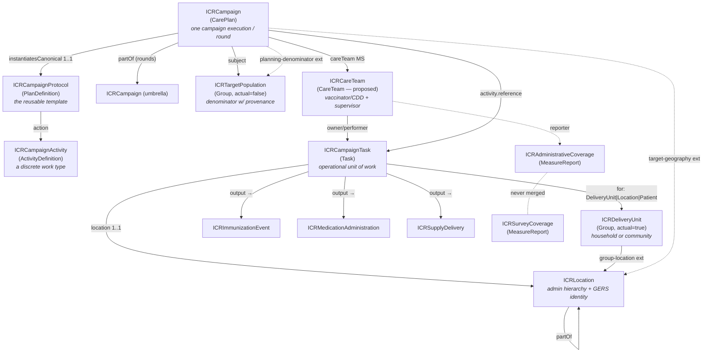
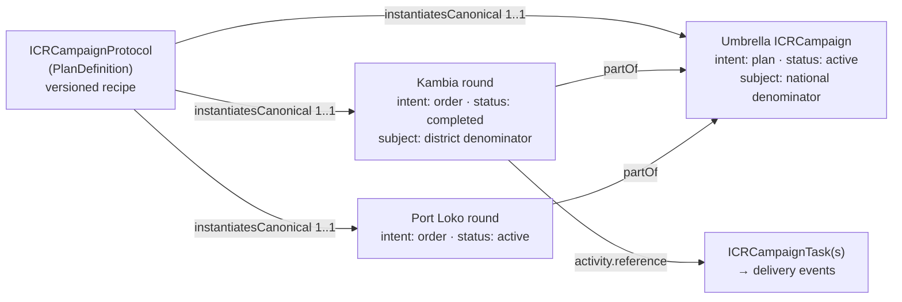
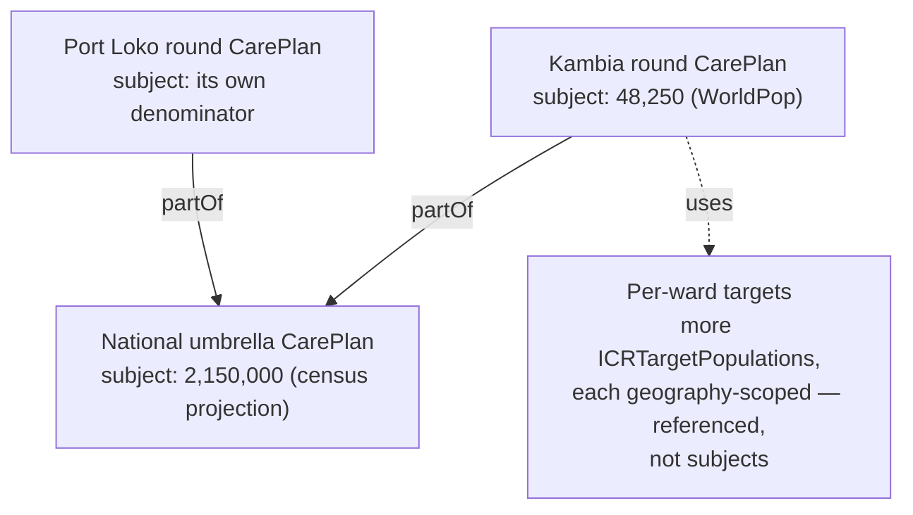
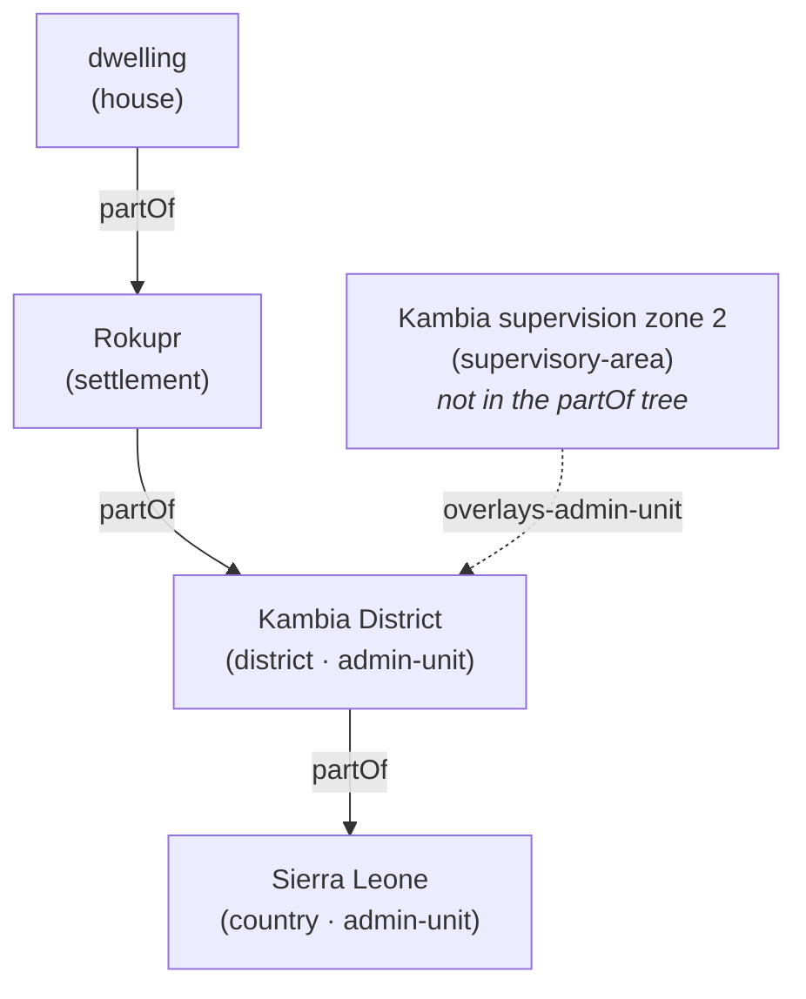
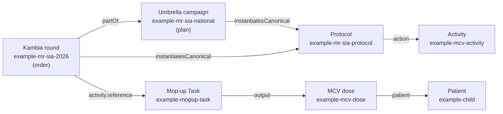

# ICR FHIR Implementation Guide — Summary & Companion
> **What this document is.** A clear, structured companion to the draft **ICR (Integrated Campaign Registry) FHIR Implementation Guide**. It is written to be read on its own: it explains what a FHIR Implementation Guide is, introduces the ICR IG, walks through its architecture, and then documents every profile (resource), code system, and extension — with worked examples, plain-language property descriptions, key observations, and the open questions that remain. Where a profile or feature is _proposed but not yet built into the IG_, it is labelled **(proposed)**. Abbreviations are spelled out on first use and collected in the glossary immediately below.

* * *
## Abbreviations & glossary
Quick reference for every abbreviation used in this document, grouped by area. Names in `code font` (e.g. `ICRCampaign`) are FHIR artifacts defined in the IG, not abbreviations.

**Campaign types & public-health programmes**

| Abbrev. | Meaning |
| --- | --- |
| **ICR** | Integrated Campaign Registry — the project and FHIR IG this document describes |
| **SIA** | Supplementary Immunization Activity — a **mass vaccination campaign** (as opposed to routine immunization) |
| **PMVC** | Preventive Mass Vaccination Campaign (e.g. yellow fever) |
| **MDA** | Mass Drug Administration — a campaign giving a drug to a whole eligible population |
| **ITN / LLIN** | Insecticide-Treated Net / Long-Lasting Insecticidal Net (bed-net distribution) |
| **IRS** | Indoor Residual Spraying (anti-malaria) |
| **RI** | Routine Immunization — the everyday schedule (contrast SIA) |
| **EPI** | Expanded Programme on Immunization — the routine-immunization programme |
| **NTD / PC-NTD** | Neglected Tropical Disease / Preventive-Chemotherapy NTD |
| **CDD** | Community Drug Distributor — the front-line MDA worker |
| **CDTI** | Community-Directed Treatment with Ivermectin — the NTD-MDA delivery model |
| **RCM** | Rapid Convenience Monitoring — a quick, non-probability in-campaign check; **pass/fail with a trigger, not a coverage rate** |
| **LQAS** | Lot Quality Assurance Sampling — a small-sample accept/reject decision rule |
| **AEFI** | Adverse Event Following Immunization |
| **DOC** | Directly Observed Consumption — in MDA, the drug is swallowed under supervision |
| **TAS** | Transmission Assessment Survey — an NTD-elimination decision gate |
| **RED** | Reaching Every District — WHO microplanning approach |
| **EYE** | Eliminate Yellow fever Epidemics — WHO strategy |
| **FIP** | Fully Immunized Person |
| **Type A / B / C** | the campaign delivery-model typology — A = fixed/temporary-post session, B = house-to-house, C = community/MDA |

**Vaccines, diseases & product codings**

| Abbrev. | Meaning |
| --- | --- |
| **MR** | Measles–Rubella |
| **MCV** | Measles-Containing Vaccine |
| **OCV** | Oral Cholera Vaccine |
| **YF** | Yellow Fever |
| **HPV** | Human Papillomavirus |
| **bOPV / nOPV2** | bivalent / novel-type-2 Oral Polio Vaccine |
| **CVX** | the US-CDC vaccine-code system (standard vaccine codes) |
| **ATC** | Anatomical Therapeutic Chemical classification — WHO drug codes |
| **GS1 / GTIN** | global commodity-coding standards / Global Trade Item Number |
| **UCUM** | Unified Code for Units of Measure |
| **VVM / WMF** | Vaccine Vial Monitor / Wastage Monitoring Form |

**Geography & identifiers**

| Abbrev. | Meaning |
| --- | --- |
| **GERS** | Global Entity Reference System — Overture Maps' stable place IDs |
| **P-code** | Place code — OCHA humanitarian administrative-area code |
| **OCHA** | UN Office for the Coordination of Humanitarian Affairs |
| **ISO 3166** | the ISO country (-1) and subdivision (-2) code standard |
| **GIS / MFL** | Geographic Information System / Master Facility List |
| **GeoJSON** | a geospatial JSON data format |
| **GPS** | Global Positioning System — a coordinate point |
| **OSM** | OpenStreetMap |
| **PSU / EA** | Primary Sampling Unit / Enumeration Area (survey sampling) |

**FHIR & technical**

| Abbrev. | Meaning |
| --- | --- |
| **FHIR** | Fast Healthcare Interoperability Resources — the HL7 health-data standard |
| **IG** | Implementation Guide — a packaged set of FHIR profiles/rules for one use-case |
| **FSH / SUSHI** | FHIR Shorthand (the authoring language) / its compiler |
| **R4 / R5** | FHIR Release 4 (this IG) / Release 5 |
| **MS** | Must Support — a FHIR conformance flag ("implementations must populate/process this element") |
| **VS / CS** | ValueSet / CodeSystem |
| **CQL** | Clinical Quality Language — decision logic |
| **IPS** | International Patient Summary |
| **SNOMED CT / ICD-11 / LOINC** | clinical terminologies (concepts / diseases / observations) |
| **JSON** | JavaScript Object Notation |
| **FR** | French-language (`fr`) designations on code systems |

**WHO SMART Guidelines, organizations & reporting**

| Abbrev. | Meaning |
| --- | --- |
| **WHO / UNICEF** | World Health Organization / UN Children's Fund |
| **DAK** | Digital Adaptation Kit — WHO SMART-Guidelines content |
| **IMMZ** | the artifact prefix of the WHO SMART Immunizations IG |
| **L1 / L2 / L3** | WHO SMART-Guidelines "levels of knowledge representation" — narrative / semi-structured / machine-readable FHIR |
| **VPD** | Vaccine-Preventable Disease (surveillance) |
| **HMIS / DHIS2** | Health Management Information System / District Health Information Software 2 |
| **JAP** | Joint Appraisal — annual immunization-programme report |
| **ICG** | International Coordinating Group — vaccine-stockpile provision (OCV/YF) |
| **ESPEN** | Expanded Special Project for Elimination of NTDs (WHO-AFRO) |
| **GTFCC** | Global Task Force on Cholera Control |
| **VCQI** | Vaccination Coverage Quality Indicators — survey toolkit |
| **M&E** | Monitoring and Evaluation |
| **mCSD** | Mobile Care Services Discovery — an IHE location-directory profile |
| **CPG / CRMI / SDC** | HL7 frameworks: Clinical Practice Guidelines / Canonical Resource Management Infrastructure / Structured Data Capture |

* * *
## 1. Introduction
### 1.1 What is FHIR?
**FHIR** (Fast Healthcare Interoperability Resources) is the modern standard, published by HL7, for representing and exchanging health data. Instead of bespoke file formats, FHIR defines a library of building blocks called **resources** — `Patient`, `Immunization`, `Location`, `Group`, `CarePlan`, and so on — each a structured object with a defined set of fields. A resource can be serialized as JSON (used throughout this document), exchanged over a standard REST API, and validated against its definition. Because every system speaks the same resource vocabulary, two systems that have never met can still understand each other's data.

This IG uses **FHIR Release 4 (R4, version 4.0.1)** — the most widely deployed release and the one WHO's own digital-health guidelines target.
### 1.2 What is an Implementation Guide?
Base FHIR is deliberately generic: `Patient` has to serve a hospital in one country and a vaccination campaign in another, so most fields are optional and loosely typed. An **Implementation Guide (IG)** is how you pin that generality down for one specific use-case. An IG is a published package containing:

- **Profiles** — constrained, specialized versions of base resources (e.g. "a `Location` that _must_ carry an administrative hierarchy and a stable place ID"). A profile says which fields are required, which codes are allowed, and what each field means in context.
  
- **Extensions** — extra fields the base resource lacks, added in a standard, interoperable way.
  
- **Terminology** — `CodeSystem`s (lists of codes the IG owns) and `ValueSet`s (the codes allowed in a given field).
  
- **Examples** — concrete instances that show conformant data.
  
- **Narrative** — pages that explain the design and how to implement it.
  

An IG turns "FHIR in general" into "FHIR, exactly as this programme needs it" — and makes data from different implementers comparable by construction.

The ICR IG is authored in **FHIR Shorthand (FSH)**, a concise text language for writing profiles, compiled to FHIR JSON by **SUSHI** (the FSH compiler) and rendered to a website by the **IG Publisher**. This is the same toolchain WHO uses for its SMART Guidelines, a deliberate alignment choice.
### 1.3 Introducing the ICR IG
Health campaigns — measles SIAs, polio rounds, mass drug administration for neglected tropical diseases, bed-net and indoor-spraying campaigns — repeatedly collect the _same_ data (who lives where, how many children are eligible, who was reached, what coverage was achieved) and then throw it away or lock it in a one-off spreadsheet. The next campaign starts from scratch.

The **Integrated Campaign Registry (ICR)** is a FHIR Implementation Guide that gives campaigns a shared, reusable data model, so each campaign's data _compounds_ instead of being re-collected. Its scope is the half of immunization-and-delivery work that routine-health systems (and WHO's routine-immunization IG) do **not** model:

- **Campaign architecture** — a reusable protocol, its executions and rounds, the discrete activities, and the operational units of work (Tasks).
  
- **Population & geography** — denominators with provenance, the actual household/community groups reached, and a rich location model (administrative hierarchy, operational geography, stable cross-campaign place IDs, GeoJSON boundaries).
  
- **Delivery events** — the vaccine doses, drug administrations, and commodity deliveries, each tagged campaign-vs-routine so a campaign never contaminates routine analytics.
  
- **Coverage** — administrative and independently-surveyed coverage as **separate, never-merged lineages** of the same quantity.
  

ICR is intentionally a **complement** to WHO's SMART Immunizations IG, which is routine-only: a campaign dose and a routine dose can sit in the same store, distinguished by a single `record-origin` flag. ICR positions itself as "the campaign SMART-Guidelines IG."

The IG covers the major campaign delivery models through one common typology used throughout this document:

- **Type A** — fixed or temporary-post sessions (people come to a post).
  
- **Type B** — house-to-house delivery (workers go door to door).
  
- **Type C** — community / MDA delivery (a whole community treated, often register-level).
  
### 1.4 IG metadata
The package-level settings that fix the IG's identity (all permanent once published, so several are flagged for UNICEF confirmation before v1.0):

| Field | Value | Notes |
|---|---|---|
| `id` | `unicef.fhir.icr` | NPM-style package id (`<org>.fhir.<scope>` convention) |
| `canonical` | `https://fhir.icr.unicef.org` | Base URL of every profile/extension/CodeSystem/ValueSet; also hosts the provisional identifier-system URIs |
| `name` / `title` | `ICR` / "Integrated Campaign Registry (ICR) Implementation Guide" | |
| `status` / `version` | `draft` / `0.1.0` | |
| `fhirVersion` | `4.0.1` | FHIR **R4** |
| `license` | `Apache-2.0` | |
| `jurisdiction` | UN M49 `001` "World" | Global IG, not country-specific |
| `publisher` | **UNICEF** (publisher of record); ICR project (delivered by Ona + Crosscut) credited via `contact` | |
| `menu` | Home, Background, Artifacts | |

The canonical `https://fhir.icr.unicef.org` stakes out a UNICEF-owned namespace; the same base hosts the two provisional geographic-identifier system URIs (see §2.5). The toolchain deliberately matches WHO SMART Guidelines practice; a formal `dependsOn smart.who.int.base` dependency is proposed once alignment hardens (see §13).
### 1.5 What the IG contains
| Layer | Count | Artifacts |
| --- | --- | --- |
| **Profiles — campaign architecture** | 4   | ICRCampaignProtocol (PlanDefinition), ICRCampaign (CarePlan), ICRCampaignActivity (ActivityDefinition), ICRCampaignTask (Task) |
| **Profiles — population & geography** | 3   | ICRDeliveryUnit (Group), ICRTargetPopulation (Group), ICRLocation (Location) |
| **Profiles — delivery events** | 3   | ICRImmunizationEvent (Immunization), ICRMedicationAdministration (MedicationAdministration), ICRSupplyDelivery (SupplyDelivery) |
| **Profiles — coverage** | 2   | ICRAdministrativeCoverage (MeasureReport), ICRSurveyCoverage (MeasureReport) |
| **Extensions** | 23  | See §11 |
| **CodeSystems** | 12  | See §10 |
| **ValueSets** | 13  | One per code system (mostly), plus a narrowed independent-coverage set and an ATC-based MDA medication set |
| **Example instances** | 26  | A coherent measles–rubella SIA scenario plus an activity gallery, an MDA event and an ITN delivery (see §12) |
| **Narrative pages** | 2   | `index.md` (home), `background.md` (design rationale & open questions) |

A proposed fifth campaign-architecture profile, **ICRCareTeam** (CareTeam), is documented in §5 but is not yet committed to the IG.

* * *
## 2. Architecture at a glance
FHIR has no native `Campaign` resource, so ICR builds its campaign spine on the **CarePlan** resource and surrounds it with profiles for population, geography, delivery events, and coverage. The diagram below shows how the pieces connect.


### 2.1 The three spines
The IG reads most easily as three intersecting "spines":

- **The operational spine** — `protocol → campaign → task → delivery events`. This is the chain of work: a reusable template (PlanDefinition), instantiated as a specific campaign/round (CarePlan), broken into units of work (Task), each producing concrete delivery events (doses, drug administrations, deliveries).
  
- {==**The identity spine** — `Group` + `Location`. _Who_ a campaign acts on (denominators and the actual households/communities) is kept strictly separate from _where_ they live and where work happens. Keeping who and where apart means a location's stable identity survives changes in the group living there, and vice versa.==}{>>Probably indicate a group can be a household or community.<<}{id="c1" by="mberg" at="2026-06-17T01:45:12.612Z"}
  
- **The analytics spine** — `MeasureReport`. The coverage readout sits to the side, computed from the other two, and deliberately keeps administrative and survey coverage as separate records that are never merged.
  
### 2.2 The key components, in plain language
**Campaign architecture (§3–§5)**

- **ICRCampaignProtocol** _(PlanDefinition)_ — the reusable, versioned **template** for a campaign type. It says what a "measles–rubella SIA" _is_ (products, age bands, activity sequence, coverage goals) once, so every country and round can instantiate the same recipe and stay comparable.
  
- **ICRCampaign** _(CarePlan)_ — **one specific campaign execution or round.** It is the core resource that represents campaigns. {==It begins life as a microplan and matures into the execution record as Tasks complete. National "umbrella" campaigns and their district "rounds" are the same profile, linked by `partOf`.==}{>>Say instead it starts as a microplan and changes to an execution record etc<<}{id="c2" by="mberg" at="2026-06-17T01:46:53.806Z"}
  
- **ICRCampaignActivity** _(ActivityDefinition)_ — **a discrete work type** within a campaign ("administer MCV", "distribute ITNs", "spray structures"). It carries the clinical/commodity content once; thousands of Tasks instantiate it.
  
- **ICRCampaignTask** _(Task)_ — **the assignable, trackable unit of work** — one Task per site-session (Type A) or per household/community visit (Type B/C). It is where the A/B/C delivery models converge into one profile.
  
- **ICRCareTeam** _(CareTeam — proposed)_ — **the delivery team and supervisor model.** Who did the work and who is accountable for a reported number. Proposed; not yet in the IG.
  

**Population & geography (§6)**

- **ICRDeliveryUnit** _(Group,_ `actual=true`_)_ — **the actual group of people a Task acts on** — a household, a community, or a school cohort. The _who_.
  
- **ICRTargetPopulation** _(Group,_ `actual=false`_)_ — **a denominator**: a conceptual cohort with a count, eligibility characteristics, and — critically — source and date provenance. Competing estimates for the same place are kept side by side.
  
- **ICRLocation** _(Location)_ — **the place model.** The most-customized ICR resource: nested administrative hierarchy, operational geography that sits _beside_ the admin tree, GeoJSON boundaries, and multi-system geospatial identity (GERS, P-codes, national and ISO codes).
  

**Delivery events (§7)**

- **ICRImmunizationEvent** _(Immunization)_ — **a vaccine dose** given in a campaign.
  
- **ICRMedicationAdministration** _(MedicationAdministration)_ — **a drug administration** (MDA), e.g. albendazole, with the dose-pole and directly-observed-consumption patterns.
  
- **ICRSupplyDelivery** _(SupplyDelivery)_ — **a commodity delivery** (bed-nets, etc.).
  

All three carry a mandatory `record-origin` flag (campaign vs routine).

**Coverage (§8)**

- **ICRAdministrativeCoverage** _(MeasureReport)_ — coverage computed from the campaign's own tally/delivery data.
  
- **ICRSurveyCoverage** _(MeasureReport)_ — coverage measured independently (cluster survey, LQAS, RCM). Structurally prevented from ever being merged with administrative coverage.
  
### 2.3 Reading order for a reviewer
`protocol → campaign → task → delivery events` is the operational spine; `Group`/`Location` is the identity spine; `MeasureReport` is the analytics readout. The whole model is held together by five recurring invariants (§2.4).
### 2.4 The five cross-cutting invariants
These five rules recur across the profiles and are the things to hold the design against (expanded in §9):

1. **Delivery strategy is first-class and coded** — a required binding, mandatory on the protocol (`1..*`) and Task (`1..1`). Strategy is _the_ discriminator because it determines which data elements even exist (house-to-house tallies are meaningless at a fixed post).
  
2. **Record origin is mandatory on every delivery event** (`1..1`) — the firewall that keeps campaign doses out of routine coverage analytics.
  
3. **Three lineages, never merged** — planned (CarePlan/Group), delivered (Task/events → administrative coverage), and independently measured (survey coverage) are kept structurally distinct.
  
4. **Denominator provenance is recommended on every estimate** — source + date travel with each denominator; competing estimates coexist; one is flagged as _the_ planning denominator.
  
5. **Geospatial identity is multi-system, GERS-preferred** — open identifier slicing on Location; operational geography overlays the admin hierarchy rather than pretending to be it.
  
### 2.5 Aliases & identifier systems
The IG defines aliases (short names) for the external and internal systems it references:

- **External terminologies** — `$CVX` (vaccine codes, `http://hl7.org/fhir/sid/cvx`), `$ATC` (WHO drug codes, `http://www.whocc.no/atc`), `$VaccineCodeVS` (the core FHIR vaccine ValueSet), `$MeasurePopulation` (the HL7 measure-population code system used by coverage examples).
  
- **ICR geographic-identifier system URIs** _(provisional — to be confirmed before v1.0)_:
  
  - `$GERSId = https://fhir.icr.unicef.org/identifiers/overture-gers` — Overture Maps GERS IDs (the preferred cross-campaign join key).
    
  - `$PCode = https://fhir.icr.unicef.org/identifiers/pcode` — OCHA P-codes.
    
  - `$ISO = urn:iso:std:iso:3166` — ISO 3166-1/-2 country & subdivision codes (admin levels 0–3); WHO-aligned.
    
  - `$NationalAdminCode = https://fhir.icr.unicef.org/identifiers/national-admin-code` — the country/implementer's own admin code, where they don't use a P-code (the per-country base URI is expected to be overridden in implementation).
    
- **ICR code systems** — twelve aliases, one per CodeSystem (§10).
  

**Why ICR mints geographic-identifier URIs.** GERS IDs and P-codes need _some_ system URI to live under in `Location.identifier`; parking them under the ICR canonical is the pragmatic v0.1 choice. CVX/ATC/GS1 serve as the international product-code backbone, so ICR does not re-invent product codes.

**Two follow-ups.** (1) Whether ICR should mint the GERS/P-code system URIs at all — if Overture or OCHA ever publish official URIs, stored identifiers would need migration (tracked as the Overture engagement, §13). (2) **GS1 is named in the narrative but has no alias and no binding** — `ICRSupplyDelivery.suppliedItem.item[x]` is left uncoded; binding a GS1 GTIN system is a known gap (§7.3).

* * *
## 3. How to read the profiles
A **profile** is a constrained, specialized version of a base FHIR resource. The base resource (say `Location`) is general-purpose; a profile (say `ICRLocation`) tightens it for one use-case by doing some combination of:

- **Making optional fields required**, or narrowing how many times a field may appear.
  
- **Restricting which resource types a reference may point at** (e.g. "`partOf` may only reference another `ICRLocation`").
  
- **Binding a coded field to a specific ValueSet** so only approved codes are used.
  
- **Fixing a field to a constant value** (e.g. `actual = false` on a denominator group).
  
- **Adding extensions** — new fields the base resource doesn't have.
  

A profile never invents a new resource type; it _layers rules on top of_ an existing one. That is what keeps profiled data valid plain FHIR: any FHIR system can read an `ICRLocation` as a `Location`, while ICR-aware systems get the extra guarantees.

**Reading the element tables in §4–§8.** Each profile below has a property table styled after the FHIR resource-content tables (e.g. [build.fhir.org/patient.html](https://build.fhir.org/patient.html)). The columns mean:

- **Element** — the field name (dot-notation for nested fields; `extension[name]` for an added field).
  
- **Flags** — conformance flags. **MS** = _Must Support_: a conformant implementation must be able to populate and process the element. (Other FHIR flags like `?!` _modifier_ don't appear in this IG.)
  
- **Card.** — _cardinality_, the min..max number of times the element may occur: `1..1` = exactly one (required, single); `0..1` = optional, at most one; `1..*` = at least one (required, repeatable); `0..*` = optional, repeatable.
  
- **Type / Binding** — the data type or referenced resource, and — for coded fields — the bound ValueSet and its **binding strength**: **required** (must use a code from the set), **extensible** (use one if it fits, otherwise add your own), or a **fixed** value.
  
- **Description** — what the field carries in ICR.
  

Profiles labelled **(proposed)** are described for completeness but are not yet committed to the IG.

* * *
## 4. Campaign-architecture profiles
The four profiles that model the structure of a campaign: the template (Protocol), the execution (Campaign), the work types (Activity), and the units of work (Task). A fifth, proposed CareTeam profile (§5) completes the team/supervisor picture.
### 4.1 ICRCampaignProtocol — `PlanDefinition`
**Purpose.** The reusable, version-controlled **template** for a campaign type — what a measles SIA _is_ (products, age bands, activity sequence, coverage goals), instantiated by every execution in every country. A country defines "measles–rubella SIA, 9 months–14 years" once, and every district and round instantiates it, which gives cross-campaign comparability for free.

**Example.** `example-mr-sia-protocol` — the recipe card for the scenario's measles–rubella SIA:

```json
{
  "resourceType": "PlanDefinition",
  "id": "example-mr-sia-protocol",
  "meta": {
    "profile": [
      "https://fhir.icr.unicef.org/StructureDefinition/ICRCampaignProtocol"
    ]
  },
  "status": "active",
  "version": "1.0.0",
  "title": "Measles–Rubella SIA — 2026 national guidance",
  "type": {
    "coding": [
      {
        "system": "https://fhir.icr.unicef.org/CodeSystem/icr-campaign-type",
        "code": "vaccination-sia"
      }
    ]
  },
  "extension": [
    {
      "url": "https://fhir.icr.unicef.org/StructureDefinition/delivery-strategy",
      "valueCodeableConcept": {
        "coding": [
          {
            "system": "https://fhir.icr.unicef.org/CodeSystem/icr-delivery-strategy",
            "code": "fixed-post"
          }
        ]
      }
    },
    {
      "url": "https://fhir.icr.unicef.org/StructureDefinition/delivery-strategy",
      "valueCodeableConcept": {
        "coding": [
          {
            "system": "https://fhir.icr.unicef.org/CodeSystem/icr-delivery-strategy",
            "code": "house-to-house"
          }
        ]
      }
    },
    {
      "url": "https://fhir.icr.unicef.org/StructureDefinition/activity-type",
      "valueCodeableConcept": {
        "coding": [
          {
            "system": "https://fhir.icr.unicef.org/CodeSystem/icr-activity-type",
            "code": "follow-up"
          }
        ]
      }
    }
  ],
  "goal": [
    {
      "description": {
        "text": "≥95% administrative coverage in every district, verified by post-campaign survey"
      }
    }
  ],
  "action": [
    {
      "title": "Administer MCV, 9 months–14 years",
      "definitionCanonical": "https://fhir.icr.unicef.org/ActivityDefinition/example-mcv-activity"
    }
  ]
}
```

> The `activity-type` extension (`follow-up`) shown here is **proposed** (§13), not yet in the IG. It is included to illustrate where the operational-mode axis would sit — see the observations below.

**Properties.**

| Element | Flags | Card. | Type / Binding | Description |
|---|---|---|---|---|
| `status`, `version`, `title` | MS | | | Lifecycle status, the protocol version, and a human title. Protocols are versioned — "MR SIA per 2026 guidance" and its 2028 revision are distinct, citable things. |
| `type` | MS | 1..1 | CodeableConcept, **required** → ICRCampaignTypeVS | **What kind of campaign** this is (`vaccination-sia`, `mda`, `itn-distribution`, `irs`, …). Deliberately disease-agnostic — the disease lives in the execution's `addresses` and the vaccine/drug code. |
| `subject[x]` | MS | | | Target-population definition (age band, eligibility) — "children 9m–14y". |
| `goal` | MS | | | Coverage targets / thresholds every execution inherits (e.g. ≥95% admin coverage). |
| `action` | MS | | | The activity sequence — vaccinate, then mop up — each entry pointing at an ActivityDefinition. |
| `action.definition[x]` | MS | | `Canonical(ICRCampaignActivity)` only | The protocol→activity wiring is **enforced**, not just narrated: an action may only point at an ICRCampaignActivity. |
| `extension[deliveryStrategy]` | MS | 1..* | CodeableConcept, **required** → ICRDeliveryStrategyVS | The delivery strategies this protocol uses — mandatory and repeatable because hybrid strategies are the norm (an MR SIA runs posts, then mops up door-to-door). |

**Relevant terminology.** `type` binds to **ICRCampaignTypeVS** (`vaccination-sia`, `mda`, `itn-distribution`, `irs`, `vitamin-a`, `integrated`); the strategy extension binds to **ICRDeliveryStrategyVS** (`fixed-post`, `temporary-post`, `mobile`, `school`, `house-to-house`, `community-directed`). Both are required bindings (§10).

**Key observations.**

- **Protocol is separated from execution by design.** Defining the campaign type once and instantiating it per district/round is what makes "all MR SIA rounds, anywhere, comparable" a query rather than a research project. Every execution carries `instantiatesCanonical → protocol`, and that link is `1..1` — non-negotiable.
  
- **A protocol carries no geography, dates, or denominator.** Those live on the executions (§4.2). The protocol is pure template: products, strategies, goals, activity sequence.
  
- `type` **is disease-agnostic.** `vaccination-sia` does not say _which_ disease — a measles SIA and a polio SIA are both `vaccination-sia`, told apart by `addresses` (the Condition) and the vaccine code. This keeps the code list small; disease-specific codes were rejected as duplicating `addresses` and the product code.
  
- **"Protocol" is FHIR's own term** for what PlanDefinition holds, so the name signals the exact resource and usage pattern to reviewers.
  
- `campaign-type` **answers a different question than the proposed** `activity-type`**.** `campaign-type` = _what intervention_ (the delivery model). The proposed `activity-type`/`sia-type` axis = _the operational mode/trigger_ of the round (routine / preventive-mass / catch-up / follow-up / mop-up / reactive-outbreak-response). They are orthogonal: a measles _follow-up_ SIA and a measles _outbreak-response_ SIA are both `vaccination-sia` but differ in mode, age band, and analysis. Keeping the axes separate lets you query "all reactive campaigns, any disease" independently of "all measles, any mode" (WHO's EYE programme uses exactly this 4-type taxonomy). A companion proposed `coverage-target` element would store the programme-defined threshold (≥95% SIA, ≥65% LF epidemiological, EYE 50/60/80%).
  

**Open questions.**

- `PlanDefinition.type` (`1..1`) is repurposed here for campaign type; base FHIR uses it to distinguish plan kinds (order-set vs protocol). Reviewers may ask whether `topic` or a dedicated extension is cleaner.
  
- **Age-band eligibility as CQL** (an executable `library`/eligibility-logic story) is deferred to a later round; it pairs with the WHO DAK/CQL alignment.
  
- **Naming-collision caution with WHO.** WHO uses `PlanDefinition` for _decision-support schedules_ (recommend/contraindicate/next-visit); ICR uses it for the _campaign protocol_. Same resource, opposite role — document the distinction so a WHO-familiar consumer isn't surprised.
  
### 4.2 ICRCampaign — `CarePlan` (the keystone)
**Purpose.** A **specific campaign execution.** It begins life as a microplan (`intent = plan`) and evolves into the execution record as Tasks complete and coverage accumulates against it — the _same_ resource matures through its lifecycle. Rounds are sibling ICRCampaigns under a national "umbrella" campaign via `partOf`, and every execution points back at the one versioned protocol.

**Lifecycle.** A campaign is born as a microplan and matures into the execution record of the **same** resource: `intent` flips `plan → order`, `status` walks `draft → active → completed`, and Tasks plus coverage accumulate against it.



The umbrella stays `intent = plan` — it is the planning shell holding the national denominator and binding the rounds together; each round goes `plan → order` as it executes. Because every box points at the **same** protocol, "all MR SIA rounds, anywhere" is one query.

**Who vs where.** Each CarePlan has exactly **one** `subject` — the _who_, an ICRTargetPopulation ("children 9m–14y, Kambia, 48,250"). The _where_ is separate and plural: `targetGeography` is `0..*`. Multiple and nested populations are carried by the umbrella/round stack, not by overloading one CarePlan.



**Example — national umbrella (the microplan shell):**

```json
{
  "resourceType": "CarePlan",
  "id": "example-mr-sia-national",
  "meta": {
    "profile": [
      "https://fhir.icr.unicef.org/StructureDefinition/ICRCampaign"
    ]
  },
  "instantiatesCanonical": [
    "https://fhir.icr.unicef.org/PlanDefinition/example-mr-sia-protocol"
  ],
  "status": "active",
  "intent": "plan",
  "category": [
    {
      "coding": [
        {
          "system": "https://fhir.icr.unicef.org/CodeSystem/icr-campaign-type",
          "code": "vaccination-sia"
        }
      ]
    }
  ],
  "subject": {
    "reference": "Group/example-target-population-national"
  },
  "period": {
    "start": "2026-06-15",
    "end": "2026-12-18"
  },
  "addresses": [
    {
      "display": "Measles and rubella"
    }
  ],
  "extension": [
    {
      "url": "https://fhir.icr.unicef.org/StructureDefinition/planning-denominator",
      "valueReference": {
        "reference": "Group/example-target-population-national"
      }
    }
  ]
}
```

**Example — the Kambia June round (a child execution of that umbrella):**

```json
{
  "resourceType": "CarePlan",
  "id": "example-mr-sia-2026",
  "meta": {
    "profile": [
      "https://fhir.icr.unicef.org/StructureDefinition/ICRCampaign"
    ]
  },
  "instantiatesCanonical": [
    "https://fhir.icr.unicef.org/PlanDefinition/example-mr-sia-protocol"
  ],
  "status": "completed",
  "intent": "order",
  "category": [
    {
      "coding": [
        {
          "system": "https://fhir.icr.unicef.org/CodeSystem/icr-campaign-type",
          "code": "vaccination-sia"
        }
      ]
    }
  ],
  "subject": {
    "reference": "Group/example-target-population"
  },
  "period": {
    "start": "2026-06-15",
    "end": "2026-06-26"
  },
  "partOf": [
    {
      "reference": "CarePlan/example-mr-sia-national"
    }
  ],
  "addresses": [
    {
      "display": "Measles and rubella"
    }
  ],
  "activity": [
    {
      "reference": {
        "reference": "Task/example-site-session-task"
      }
    },
    {
      "reference": {
        "reference": "Task/example-mopup-task"
      }
    }
  ],
  "extension": [
    {
      "url": "https://fhir.icr.unicef.org/StructureDefinition/campaign-round",
      "valuePositiveInt": 1
    },
    {
      "url": "https://fhir.icr.unicef.org/StructureDefinition/target-geography",
      "valueReference": {
        "reference": "Location/example-district"
      }
    },
    {
      "url": "https://fhir.icr.unicef.org/StructureDefinition/planning-denominator",
      "valueReference": {
        "reference": "Group/example-target-population"
      }
    }
  ]
}
```

**Properties.**

| Element | Flags | Card. | Type / Binding | Description |
|---|---|---|---|---|
| `instantiatesCanonical` | MS | 1..1 | `Canonical(ICRCampaignProtocol)` only | The protocol this campaign executes. `1..1` is a forcing function — every campaign, even ad-hoc, authors a protocol first. |
| `status` | MS | | | `draft → active → completed`. |
| `intent` | MS | | | `plan` (microplan) transitioning to `order` (execution) — the lifecycle dial. |
| `category` | MS | 1..* | CodeableConcept, **required** → ICRCampaignTypeVS | The campaign type(s), echoing the protocol's `type`. |
| `subject` | MS | | `Reference(ICRTargetPopulation)` only | The single denominator (the *who*) — makes the denominator a first-class participant, not an afterthought. |
| `period` | MS | 1..1 | Period | Campaign/round dates. |
| `careTeam` | MS | | `Reference(CareTeam)` | The team(s) running the campaign (see the proposed ICRCareTeam, §5). |
| `addresses` | MS | | `Reference(Condition)` | The disease/condition targeted (where the specific disease lives, since `type` is disease-agnostic). |
| `partOf` | | | `Reference(ICRCampaign)` only | The umbrella/round pattern — a round is `partOf` its umbrella. |
| `activity` | MS | | `activity.reference` → `Reference(ICRCampaignTask)` only | The round's Tasks. Inline activities (`activity.detail`) are out — the work is always a referenced Task. |
| `extension[campaignRound]` | MS | 0..1 | positiveInt | Which round this is. |
| `extension[targetGeography]` | MS | 0..* | `Reference(ICRLocation)` | The *where* — plural, since one campaign may name several geographies. |
| `extension[planningDenominator]` | MS | 0..1 | `Reference(ICRTargetPopulation)` | Singles out *which* estimate is THE denominator coverage is computed against, when several compete. |
| `extension[dataLineage]` | MS | 0..1 | code, **required** → ICRDataLineageVS | Realtime vs reconciled (default: absent ⇒ realtime). |

**Key observations.**

- **CarePlan was chosen over a custom resource, Encounter, and RequestGroup** because it natively supports the plan→execution lifecycle, `instantiatesCanonical`, population subjects, and `partOf` composition.
  
- **Planned-vs-executed is captured by the lifecycle of one resource, not a duplicate.** The microplan and the execution record are the same CarePlan at different `intent` values; the planned figure is retained in the `planningDenominator` extension, and the planned-vs-actual audit trail comes from FHIR resource history / Provenance — ICR does **not** mint a separate planning-snapshot Group.
  
- **One subject per CarePlan, so do three districts need three CarePlans?** It depends on the denominator, not on admin boundaries. Two valid shapes: **(a) one CarePlan, several target geographies** — legitimate when the districts are planned and reported as one scope against _one_ shared denominator (`targetGeography` lists all of them, `subject` is the one regional denominator); **(b) several round CarePlans under a regional umbrella** via `partOf` — the usual case, needed the moment each district carries its own denominator, period, or coverage rollup (almost always true). You mint one CarePlan per **denominator/reporting scope**, not per admin area.
  
- **Nested scopes do not sum to the parent.** A district's denominator and the national total come from different sources and methods (national 2,150,000 census-projection vs Kambia 48,250 WorldPop), so they legitimately disagree; they nest _conceptually_ via `partOf`, not arithmetically.
  
- **The umbrella is itself an ICRCampaign**, so it carries its own national denominator, `category`, and `period`.
  

**Open questions.**

- The proposed `activity-type` and `coverage-target` axes (§4.1) would also surface here, plus **round1↔round2 linkage** for OCV/multi-round campaigns (§13).
  
- The relief valve, if `instantiatesCanonical 1..1` ever proves too strict for emergencies, is to relax it to `0..1` with a flag.
  
### 4.3 ICRCampaignActivity — `ActivityDefinition`
**Purpose.** A discrete **work type** within a campaign — "administer albendazole to children 5–14", "distribute ITNs to households", "spray structures" — instantiated as ICRCampaignTask resources. It carries the intervention, product, and dosage **once**; thousands of Tasks instantiate it without repeating the clinical content. It is deliberately **target-agnostic**: it says _what_ to do and at most the _kind_ of eligible target, never which concrete household/structure/session.

**Example.** `example-mcv-activity` — the activity the protocol's `action` points at:

```json
{
  "resourceType": "ActivityDefinition",
  "id": "example-mcv-activity",
  "meta": {
    "profile": [
      "https://fhir.icr.unicef.org/StructureDefinition/ICRCampaignActivity"
    ]
  },
  "status": "active",
  "name": "AdministerMCV",
  "title": "Administer MCV, 9 months–14 years",
  "kind": "Task",
  "code": {
    "text": "Vaccinate — measles–rubella–containing vaccine"
  },
  "productCodeableConcept": {
    "coding": [
      {
        "system": "http://hl7.org/fhir/sid/cvx",
        "code": "05",
        "display": "measles virus vaccine"
      }
    ]
  },
  "dosage": [
    {
      "route": {
        "text": "subcutaneous"
      },
      "doseAndRate": [
        {
          "doseQuantity": {
            "value": 0.5,
            "unit": "mL",
            "system": "http://unitsofmeasure.org",
            "code": "mL"
          }
        }
      ]
    }
  ],
  "extension": [
    {
      "url": "https://fhir.icr.unicef.org/StructureDefinition/delivery-strategy",
      "valueCodeableConcept": {
        "coding": [
          {
            "system": "https://fhir.icr.unicef.org/CodeSystem/icr-delivery-strategy",
            "code": "fixed-post"
          }
        ]
      }
    }
  ]
}
```

**Properties.**

| Element | Flags | Card. | Type / Binding | Description |
|---|---|---|---|---|
| `status` | MS | | | Lifecycle status. |
| `kind` | | | fixed `#Task` | Hard-wires the instantiation target: instantiating this activity produces ICRCampaignTasks, not ServiceRequests. |
| `code` | MS | 1..1 | CodeableConcept | The intervention: vaccinate / treat / distribute / spray. |
| `product[x]` | MS | | (unbound — CVX/ATC/GS1 in `^short` only) | The product: vaccine (CVX), drug (ATC), or commodity (GS1). |
| `dosage` | MS | | Dosage | Where applicable; dose-pole logic references an Observation. |
| `extension[deliveryStrategy]` | MS | 0..1 | CodeableConcept, **required** → ICRDeliveryStrategyVS | Optional here (resolved per-Task), unlike the mandatory protocol/Task strategy. |

**The activity gallery.** Four ActivityDefinitions ship, spanning the campaign types — each says only WHAT, never which concrete target:

| Instance | Intervention | Product | Dosage / rule |
|---|---|---|---|
| `example-mcv-activity` | Vaccinate (Type A/B) | CVX `05` measles virus vaccine | 0.5 mL subcutaneous, single dose |
| `example-albendazole-activity` | Treat (Type C MDA) | ATC `P02CA03` albendazole | 400 mg single dose; tablet count by **dose-pole height band** |
| `example-itn-activity` | Distribute (Type B→A) | LLIN (free-text pending GS1) | 1 net per 2 household members |
| `example-irs-activity` | Spray (Type B) | Pirimiphos-methyl 300CS | interior walls of eligible structures |

**Key observations.**

- **What lives here vs on the Task.** The ActivityDefinition carries intervention + product + dosage rule (and at most the _kind_ of eligible target). The concrete thing acted on — THIS household, THIS structure, THIS session — is each **Task's** `for`/`focus`, assigned per unit of work. "Spray" Tasks target structures (Locations); "vaccinate" Tasks target households (Groups) with per-child detail in the delivery events.
  
- `kind = #Task` **is the deliberate choice** that activities become Tasks rather than ServiceRequests.
  
- `product[x]` **is MS but unbound** — the delivery-event profiles _do_ bind product codes, so binding the definition side too (for consistency) is worth considering.
  
- **Delivery-strategy cardinality is intentionally asymmetric** — `0..1` on the activity, `1..*` on the protocol, `1..1` on the Task. The strategy is resolved per-Task, so the activity need not pin it.
  

**Open questions.**

- A proposed `dosing-regimen` axis (single-dose-lifelong / multi-dose / fractional) on the activity (and event) is needed to define "fully immunized" (§13).
  
- Vector-control work like fly-traps and larviciding is outside v0.1 program scope and has no delivery-event profile — flag it if entomological surveillance enters ICR's future.
  
### 4.4 ICRCampaignTask — `Task`
**Purpose.** The assignable, trackable **operational unit of work** — one Task per site-session (Type A) or per household/community visit (Type B/C). This is where the A/B/C delivery-model polymorphism lands: the _same_ profile serves a fixed-post session and a house-to-house visit, discriminated by what it targets and the mandatory coded delivery strategy. Tasks may be pre-planned from the microplan or field-registered on discovery.

**Two reference roles —** `for` **vs** `focus`**.** The unit being **targeted** (household, community, or a person for follow-up) is carried by `Task.for`. `Task.focus` is reserved for **workflow lineage** — the CarePlan, activity, or prior Task this work derives from. This split keeps "what we acted on" and "where this work came from" separate and queryable.

**Example.** `example-mopup-task` — the Type-B house-to-house visit, the richer Task shape, which chains to a delivery event:

```json
{
  "resourceType": "Task",
  "id": "example-mopup-task",
  "meta": {
    "profile": [
      "https://fhir.icr.unicef.org/StructureDefinition/ICRCampaignTask"
    ]
  },
  "status": "completed",
  "intent": "order",
  "code": {
    "text": "Administer MCV — house-to-house mop-up visit"
  },
  "for": {
    "reference": "Group/example-household"
  },
  "focus": {
    "reference": "CarePlan/example-mr-sia-2026"
  },
  "location": {
    "reference": "Location/example-dwelling"
  },
  "executionPeriod": {
    "start": "2026-06-24",
    "end": "2026-06-24"
  },
  "owner": {
    "display": "CDD team 7, Rokupr"
  },
  "output": [
    {
      "type": {
        "text": "Immunization administered"
      },
      "valueReference": {
        "reference": "Immunization/example-mcv-dose"
      }
    }
  ],
  "extension": [
    {
      "url": "https://fhir.icr.unicef.org/StructureDefinition/delivery-strategy",
      "valueCodeableConcept": {
        "coding": [
          {
            "system": "https://fhir.icr.unicef.org/CodeSystem/icr-delivery-strategy",
            "code": "house-to-house"
          }
        ]
      }
    },
    {
      "url": "https://fhir.icr.unicef.org/StructureDefinition/task-origin",
      "valueCode": "field-registered"
    },
    {
      "url": "https://fhir.icr.unicef.org/StructureDefinition/eligible-present",
      "valueUnsignedInt": 2
    },
    {
      "url": "https://fhir.icr.unicef.org/StructureDefinition/eligible-absent",
      "valueUnsignedInt": 1
    },
    {
      "url": "https://fhir.icr.unicef.org/StructureDefinition/missed-reason",
      "valueCodeableConcept": {
        "coding": [
          {
            "system": "https://fhir.icr.unicef.org/CodeSystem/icr-missed-reason",
            "code": "absent"
          }
        ]
      }
    },
    {
      "url": "https://fhir.icr.unicef.org/StructureDefinition/finger-marked",
      "valueBoolean": true
    }
  ]
}
```

**Properties.**

| Element | Flags | Card. | Type / Binding | Description |
|---|---|---|---|---|
| `status` | MS | | | `requested → in-progress → completed / failed`. |
| `intent`, `owner`, `executionPeriod`, `output` | MS | | | Workflow intent, the team that owns the work, the execution window, and the outputs (the delivery events / aggregate counts). |
| `code` | MS | 1..1 | CodeableConcept | What the Task is. |
| `for` | MS | 1..1 | `Reference(ICRDeliveryUnit \| ICRLocation \| Patient)` | The unit being **targeted**: a household/community delivery-unit Group (Type B/C), the site Location (Type A), or a Patient for person-targeted follow-up. |
| `focus` | MS | | `Reference(CarePlan \| ActivityDefinition \| ServiceRequest \| Task)` | **Workflow lineage**: the campaign/activity this work instantiates, or the prior Task it follows (e.g. a mop-up Task following the session Task that missed a child). |
| `location` | MS | 1..1 | `Reference(ICRLocation)` only | Where the work happened. |
| `output` | MS | | | References to Immunization / MedicationAdministration / SupplyDelivery, or aggregate counts. |
| `extension[deliveryStrategy]` | MS | 1..1 | CodeableConcept, **required** → ICRDeliveryStrategyVS | The strategy this Task runs under — mandatory, since it determines which other fields apply. |
| `extension[taskOrigin]` | MS | 1..1 | code, **required** → ICRTaskOriginVS (`pre-planned` \| `field-registered`) | Whether the Task was pre-generated from the microplan or created in the field on discovery. |
| `extension[housesVisited]` | | 0..1 | unsignedInt | (Type B) houses visited on the round. |
| `extension[eligiblePresent]` | | 0..1 | unsignedInt | (Type B) eligible people present. |
| `extension[eligibleAbsent]` | | 0..1 | unsignedInt | (Type B) eligible people absent. |
| `extension[missedReason]` | | 0..* | CodeableConcept, **extensible** → ICRMissedReasonVS | (Type B) why eligible people were missed. |
| `extension[noncomplianceReason]` | | 0..* | CodeableConcept, **extensible** → ICRNoncomplianceReasonVS | (Type B) why a household/person declined. |
| `extension[fingerMarked]` | | 0..1 | boolean | (Type B) the in-field "already covered" marker. |
| `extension[dataLineage]` | | 0..1 | code, **required** → ICRDataLineageVS | Realtime vs reconciled. |

**Key observations.**

- **One Task per visit; person-level detail lives in the delivery events.** A doorstep visit is **one** Task — it closes when the visit completes — and each child vaccinated gets their own `Immunization` off `Task.output`, pointing at their `Patient`. The Task is the unit of _work_ (one visit); the delivery events are the units of _service_ (three doses given).
  
- **The one deliberate person-targeted exception is follow-up.** When a specific missed or zero-dose child needs chasing, a new Task is spawned whose `for` IS that child's `Patient`, with `focus` pointing back at the originating Task that missed them. This is the _only_ intended person-targeted Task — routine per-child Tasks would multiply Task volume ~5× while adding nothing the Immunization records don't already carry.
  
- **The count/reason extensions exist only for Type B.** Houses visited, present/absent, missed/noncompliance reasons, finger-marking are meaningless for a fixed-post tally, so they are `0..x`.
  
- `task-origin` **being mandatory is itself a measurement.** A team that discovers an unenumerated household creates the delivery unit and its Task on the spot; the count of field-registered Tasks per area measures how incomplete the microplan's enumeration was, feeding the next round's denominators.
  
- **Delivery events hang off** `Task.output` because R4 `Immunization` has no `basedOn` element — the reverse link doesn't exist, so the link runs Task → event (§7).
  
- **How to disaggregate (recommended pattern).** The count extensions are deliberately **point values** (a visit-level tally). Age-band/sex disaggregation should _not_ multiply those extensions; instead either (a) emit one coded `Task.output` entry per stratum (each with a coded `type` for age band / sex), or (b) where person-level data exists, derive disaggregation from the individual Immunization/MedicationAdministration records, which already carry age and sex. The same principle governs per-child reasons: Task-level `missed-reason`/`noncompliance-reason` aggregate over the whole visit; per-child reasons require person-level records.
  

**Open questions.**

- **Granularity at scale is the IG's #1 open question** — one Task per household across a national campaign is millions of Tasks. The profile keeps both household-level and site-level paths open, and field-registration (lazy Task creation) softens the worst case, but pilots must exercise the household-level path.
  
- `output.valueReference` is not yet structurally constrained to the three delivery-event profiles (the `^short` says it; the profile doesn't enforce it).
  
- `task-origin 1..1` means historical imports must assign an origin — acceptable as a forcing function, or add an `unknown` code for back-loaded datasets (§13).
  

* * *
## 5. ICRCareTeam — `CareTeam` _(proposed — the team & supervisor model)_
> **Status — proposed, not committed.** `ICRCampaign.careTeam` already references a base FHIR CareTeam (the MS element in §2/§4.2), but there is no profile constraining it and team identity in the examples is still **display-only** (`Task.owner` = "CDD team 7, Rokupr" is a plain string). This section is the proposed profile and an illustrative example.

**Purpose.** The campaign delivery team — the vaccinators / CDDs who do the work and the **supervisor** who oversees them and very often files the report. It answers two operational questions every supervisor asks: _who worked this area_, and _who is accountable for this reported number_. The team is referenced from `ICRCampaign.careTeam` (the campaign roster) and from `Task.owner`/`Task.performer` (the team that worked a given Task), and the supervisor surfaces again as the `MeasureReport.reporter` on rolled-up coverage (§8) and typically owns the **supervisory-area** Location (§6.3).

**Example (proposed).** `example-careteam` — CDD team 7 and its supervisor:

```json
{
  "resourceType": "CareTeam",
  "id": "example-careteam",
  "meta": {
    "profile": [
      "https://fhir.icr.unicef.org/StructureDefinition/ICRCareTeam"
    ]
  },
  "status": "active",
  "name": "CDD team 7, Rokupr",
  "subject": {
    "reference": "Group/example-target-population"
  },
  "participant": [
    {
      "role": [
        {
          "coding": [
            {
              "system": "https://fhir.icr.unicef.org/CodeSystem/icr-team-role",
              "code": "vaccinator"
            }
          ]
        }
      ],
      "member": {
        "display": "Fatmata Sesay (vaccinator)"
      }
    },
    {
      "role": [
        {
          "coding": [
            {
              "system": "https://fhir.icr.unicef.org/CodeSystem/icr-team-role",
              "code": "supervisor"
            }
          ]
        }
      ],
      "member": {
        "display": "Ibrahim Conteh (supervisor)"
      }
    }
  ],
  "managingOrganization": [
    {
      "display": "Kambia District Health Management Team"
    }
  ],
  "extension": [
    {
      "url": "https://fhir.icr.unicef.org/StructureDefinition/oversees-area",
      "valueReference": {
        "reference": "Location/example-supervisory-area"
      }
    }
  ]
}
```

**Properties (proposed).**

| Element | Flags | Card. | Type / Binding | Description |
|---|---|---|---|---|
| `status` | MS | | | `proposed → active → inactive`. |
| `name` | MS | | | Human-readable team label (replaces today's display-only `Task.owner` string). |
| `subject` | MS | | `Reference(ICRTargetPopulation)` | The campaign/population the team serves. |
| `participant` | MS | 1..* | | The members. |
| `participant.role` | MS | 1..1 | CodeableConcept, **extensible** → ICRTeamRoleVS | `vaccinator` \| `cdd` \| `supervisor` \| `social-mobilizer` \| `recorder`. |
| `participant.member` | MS | | `Reference(Practitioner \| PractitionerRole \| RelatedPerson)` | The CDD/vaccinator; a community volunteer is a RelatedPerson. |
| `managingOrganization` | MS | | `Reference(Organization)` | The implementing partner / district health office. |
| `extension[overseesArea]` | | 0..* | `Reference(ICRLocation)` | The supervisory-area(s) this team's supervisor covers, tying CareTeam to operational geography (§6.3). |

**Key observations.**

- **The supervisor is the load-bearing role.** It is both a delivery actor and, very often, the one doing the reporting. Profiling CareTeam (rather than leaning on display strings) makes `Task.owner` a real `Reference(CareTeam)`, so "who did this visit" becomes a join, and the proposed `oversees-area` extension plus the supervisor-as-`reporter` wiring makes "who reported this number, and which zone do they own" queryable end to end.
  
- **This folds together with the supervision/QA proposal** (§13) — one piece of work, not two.
  

**Open questions.**

- **Supervisor-as-reporter** — whether campaign MeasureReports **SHALL** name a `reporter` (an explicit invariant) or whether that stays MS for v1.
  

* * *
## 6. Population & geography profiles
Three profiles that model _who_ a campaign acts on and _where_. The split is deliberate: a denominator (`ICRTargetPopulation`), the actual group reached (`ICRDeliveryUnit`), and the place (`ICRLocation`) are separate first-class resources.
### 6.1 ICRDeliveryUnit — `Group` (household / community / school cohort)
**Purpose.** The **actual group of people** a campaign Task acts on — a household (Type B house-to-house), a community (Type C MDA), or a school cohort (school-based delivery), distinguished by a required `group-kind` code. This is the validated Group + Location pattern, generalized: the Group is _who_, the Location (via the `group-location` extension) is _where it lives or is based_ — the dwelling for a household, the settlement for a community, the school for a school cohort. (Type A's delivery unit is a site, which is a Location, not a Group.)

**Example.** `example-household` — the Type-B unit a mop-up Task targets:

```json
{
  "resourceType": "Group",
  "id": "example-household",
  "meta": {
    "profile": [
      "https://fhir.icr.unicef.org/StructureDefinition/ICRDeliveryUnit"
    ]
  },
  "type": "person",
  "actual": true,
  "code": {
    "coding": [
      {
        "system": "https://fhir.icr.unicef.org/CodeSystem/icr-group-kind",
        "code": "household"
      }
    ]
  },
  "quantity": 6,
  "member": [
    {
      "entity": {
        "reference": "Patient/example-child"
      }
    }
  ],
  "extension": [
    {
      "url": "https://fhir.icr.unicef.org/StructureDefinition/group-location",
      "valueReference": {
        "reference": "Location/example-dwelling"
      }
    }
  ]
}
```

**Properties.**

| Element | Flags | Card. | Type / Binding | Description |
|---|---|---|---|---|
| `type` | | | fixed `#person` | A group of people. |
| `actual` | | | fixed `true` | A real, enumerated group (contrast the denominator, `actual=false`). |
| `code` | MS | 1..1 | CodeableConcept, **required** → ICRGroupKindVS (`household` \| `community` \| `school-cohort`) | The kind of delivery unit. |
| `member` | MS | | `member.entity` → `Reference(Patient)` only | The enumerated people (optional by design). |
| `quantity` | MS | | unsignedInt | Group size where individuals are not enumerated — the common case. |
| `extension[groupLocation]` | MS | 1..1 | `Reference(ICRLocation)` | **Residence/base, not service point**: the dwelling (household), settlement/community point (community), or school (school-cohort). |

**Relevant terminology.** `code` binds required to **ICRGroupKindVS** (`household`, `community`, `school-cohort`).

**Key observations.**

- **Separating who (Group) from where (Location)** means the location's identity (its GERS building/place ID) survives changes in group composition, and the group survives re-mapping.
  
- **One profile, two scales.** Households and communities are the same pattern at different scales — one profile with a coded kind beats two near-identical profiles. Swap `code` to `community` and point `group-location` at a settlement, and the same JSON becomes the Type-C community delivery unit. `school-cohort` shows the kind list extends to non-obvious units (nomadic groups, camp populations) as country demand appears.
  
- `member.entity` **is** `Patient` **for a reason.** FHIR has four person-shaped resources: **Patient** (anyone who might receive a service — despite the name, a healthy child getting a measles dose _is_ a Patient, and it's the only thing `Immunization.patient` can point at); **RelatedPerson** (a caregiver in relation to a patient); **Practitioner** (workers — CDDs, vaccinators); and **Person** (identity-linkage plumbing). So every enumerated household member is a Patient. Locking `member.entity` to Patient excludes Practitioner/Device — but _not_ RelatedPerson, which R4 `Group.member` never permitted (RelatedPerson membership only arrives in R5).
  
- `group-location` **is residence, not service point.** Where service actually happened is `Task.location` and the delivery event's own `location`. A household that walks to a village distribution center keeps its dwelling here unchanged — the Task records the center.
  
- `quantity` **covers the count-without-registering case** — campaigns frequently count members without registering individuals, so person-level `member` entries are optional.
  

**Household identity across campaigns.** A household is identified by its **members**, anchored on the head of household (keyed by `Patient.id` or, better, a national ID); **cross-campaign linkage** joins on the **dwelling**, whose `group-location` Location carries a stable GERS building ID that survives household composition changes. `Group.identifier` stays light — identity is reconstructed from head-of-household + dwelling GERS ID.

**Open questions.**

- Whether to _also_ stamp a convenience `Group.identifier` for direct lookup; and how to handle head-of-household churn (death, migration, household splits) — the dwelling GERS ID is the durable join key, the person ID disambiguates which household at that structure.
  
- WHO-alignment: whether to align ICR's person records to WHO's `IMMZ.Patient` (base R4 Patient with required identifier/name/phone/gender/birthDate/address) so household members are WHO-conformant (§13).
  
### 6.2 ICRTargetPopulation — `Group`
**Purpose.** A target-population **denominator**: a conceptual cohort (`actual=false`) with a count, eligibility characteristics, and — critically — **source and date provenance**. The denominator is the dominant error source in campaign analytics, so multiple competing estimates per geography are _retained side by side_, each with its own provenance, and exactly one is flagged as the planning denominator. Coverage is then computed against a declared choice while the disagreement stays visible instead of being silently overwritten.

**Worked example — competing denominators.** Three instances tell the whole story:

| Instance | Geography | Count | Source | Date | Planning? |
| --- | --- | --- | --- | --- | --- |
| `example-target-population` | → Kambia District | **48,250** | WorldPop modelled | 2026-01-15 | **true** |
| `example-target-population-enumerated` | → Kambia District | **51,800** | microcensus / H2H enumeration | 2026-03-02 | false |
| `example-target-population-national` | → Sierra Leone | 2,150,000 | census projection | 2025-11-30 | true (national) |

The first two are the **same geography disagreeing by ~7%**. Both are retained; exactly one carries the planning flag. The consequence is concrete: 47,766 children reached is **99% coverage against WorldPop but 92% against the enumeration** — the denominator you pick changes the answer. That is why source + date are recommended on every estimate.

**Example.** `example-target-population` — Kambia's WorldPop planning denominator (the `subject` of the round CarePlan):

```json
{
  "resourceType": "Group",
  "id": "example-target-population",
  "meta": {
    "profile": [
      "https://fhir.icr.unicef.org/StructureDefinition/ICRTargetPopulation"
    ]
  },
  "type": "person",
  "actual": false,
  "quantity": 48250,
  "characteristic": [
    {
      "code": {
        "coding": [
          {
            "system": "https://fhir.icr.unicef.org/CodeSystem/icr-group-characteristic",
            "code": "geography"
          }
        ]
      },
      "valueReference": {
        "reference": "Location/example-district"
      },
      "exclude": false
    }
  ],
  "extension": [
    {
      "url": "https://fhir.icr.unicef.org/StructureDefinition/denominator-source",
      "valueCodeableConcept": {
        "coding": [
          {
            "system": "https://fhir.icr.unicef.org/CodeSystem/icr-denominator-source",
            "code": "worldpop"
          }
        ]
      }
    },
    {
      "url": "https://fhir.icr.unicef.org/StructureDefinition/estimate-date",
      "valueDate": "2026-01-15"
    },
    {
      "url": "https://fhir.icr.unicef.org/StructureDefinition/is-planning-denominator",
      "valueBoolean": true
    }
  ]
}
```

**Properties.**

| Element | Flags | Card. | Type / Binding | Description |
|---|---|---|---|---|
| `type` | | | fixed `#person` | A group of people. |
| `actual` | | | fixed `false` | A conceptual cohort — a denominator, not a roster of real people. |
| `quantity` | MS | 1..1 | unsignedInt | The denominator count. |
| `characteristic` | MS | | | Age band, sex, eligibility rule, geography; **sliced** (pattern on `code`, open). |
| `characteristic[geography]` | MS | 0..1 | `value[x]` → `Reference(ICRLocation)`; `code` fixed `geography`; `exclude` fixed `false` | The **computable** scope link — joins the estimate to the location hierarchy at any level (country → district → ward → settlement → operational area) by reference, not by parsing a name. |
| `extension[denominatorSource]` | MS | 0..1 | CodeableConcept, **extensible** → ICRDenominatorSourceVS | *Recommended, not required* — the population is often unknown up front. |
| `extension[estimateDate]` | MS | 0..1 | date | When the estimate was made (denominators decay fast — 1–3 years). |
| `extension[isPlanningDenominator]` | MS | 0..1 | boolean | Flags *the* one coverage is computed against. |
| `extension[confidence]` | | 0..1 | string | Free-text confidence (coded confidence is a later refinement). |

**Relevant terminology.** `denominator-source` binds extensible to **ICRDenominatorSourceVS** (`census`, `census-projection`, `microcensus`, `worldpop`, `grid3`, `hmis`, `other`).

**Key observations.**

- **"Denominator-first" is design decision #6.** Provenance (source + date) is strongly recommended on every estimate — but deliberately `0..1 MS`, not mandatory, because the population is frequently unknown when planning begins, and forcing a source/date would block legitimate early or placeholder estimates. Wherever a real number is recorded, it should carry where and when it came from.
  
- **Competing estimates coexist.** Census projection vs WorldPop vs microcensus are kept as sibling Groups, each with provenance, instead of overwriting one with the next.
  
- **Geography is computable at any level.** The geography characteristic makes scope joinable by reference — target populations are _not_ household-bound (that's what ICRDeliveryUnit is for).
  
- **"Exactly one planning denominator" is not machine-enforced.** Nothing stops two same-geography Groups both setting (or neither setting) the flag; the real enforcement point is the singular `ICRCampaign.planningDenominator` extension (`0..1`), which is where coverage actually reads its denominator from.
  

**Open questions.**

- The geography characteristic is `0..1` so estimates _can_ exist without a Location; tightening to `1..1` once pilots confirm every estimate has one is tracked (§13).
  
- Proposed for a later round: an **at-risk / eligible** denominator type (to drive programme-vs-epidemiological coverage), a **population-estimation-method + source-raster version/date** (so two `worldpop` estimates become distinguishable), and a **population-vulnerability / equity** characteristic (§13).
  
### 6.3 ICRLocation — `Location`
**Purpose.** The **place model**, and the most-customized ICR resource: a nested administrative hierarchy (6+ levels), operational geography that is _linkable-but-distinct_ from admin units, GeoJSON boundaries, and multi-system geospatial identity — GERS IDs as the preferred cross-campaign join key, with P-codes, national codes, and ISO codes as coequal aliases.

**The two hierarchies, side by side.** The `partOf` chain is the **administrative** tree (one parent each). Operational geography sits **beside** it — its own Location, _not_ in the `partOf` chain, linked to the admin unit(s) it covers by `overlays-admin-unit`:



Every box on the solid `partOf` spine is an ICRLocation pointing at its single parent (country → district → settlement → dwelling, 6+ levels in practice). "Kambia supervision zone 2" is the operational exception: it hangs off _nothing_ in the admin tree (a supervisory zone can straddle several wards, so it can't have one parent) and instead carries a dashed `overlays-admin-unit` pointer at the district it reports into — which is what makes operational geography linkable-but-distinct.

**Example.** `example-district` — Kambia District, showing multi-system identity, the admin hierarchy, a GPS point, and a GeoJSON boundary:

```json
{
  "resourceType": "Location",
  "id": "example-district",
  "meta": {
    "profile": [
      "https://fhir.icr.unicef.org/StructureDefinition/ICRLocation"
    ]
  },
  "status": "active",
  "name": "Kambia District",
  "physicalType": {
    "coding": [
      {
        "system": "http://terminology.hl7.org/CodeSystem/location-physical-type",
        "code": "jdn",
        "display": "Jurisdiction"
      }
    ]
  },
  "type": [
    {
      "coding": [
        {
          "system": "https://fhir.icr.unicef.org/CodeSystem/icr-location-type",
          "code": "admin-unit"
        }
      ]
    }
  ],
  "partOf": {
    "reference": "Location/example-country"
  },
  "identifier": [
    {
      "system": "https://fhir.icr.unicef.org/identifiers/pcode",
      "value": "SL0201"
    },
    {
      "system": "https://fhir.icr.unicef.org/identifiers/overture-gers",
      "value": "overture-division-kambia-example"
    }
  ],
  "position": {
    "longitude": -12.9176,
    "latitude": 9.1247
  },
  "extension": [
    {
      "url": "https://fhir.icr.unicef.org/StructureDefinition/location-boundary-geojson",
      "valueAttachment": {
        "contentType": "application/geo+json",
        "title": "Kambia District boundary (GeoJSON Polygon)",
        "url": "https://fhir.icr.unicef.org/geo/kambia-district.geojson"
      }
    }
  ]
}
```

**Properties.**

| Element | Flags | Card. | Type / Binding | Description |
|---|---|---|---|---|
| `name`, `status` | MS | | | Name and active/inactive status. |
| `partOf` | MS | | `Reference(ICRLocation)` only | The administrative parent — country → region → district → ward → settlement. |
| `physicalType` | MS | | CodeableConcept | The base-FHIR shape — jurisdiction / site / building / household. |
| `type` | MS | | CodeableConcept, **extensible** → ICRLocationTypeVS | The ICR location type — `admin-unit`, `settlement`, `facility`, `school`, `community-distribution-point`, `temporary-post`, `household`, `supervisory-area`, `operational-area`. |
| `position` | MS | | | GPS point (longitude/latitude). |
| `identifier` | MS | | **sliced by `system`** (open): `gers` 0..1 MS, `pcode` 0..1 MS, `national` 0..*, `iso` 0..* | Multi-system identity. **≥1 identifier required when `type = admin-unit`** (invariant `icr-loc-admin-id`). |
| `extension[boundary]` (`location-boundary-geojson`) | MS | 0..1 | Attachment, `contentType` fixed `application/geo+json` | The GeoJSON geometry (a Polygon/MultiPolygon shape, or a Point). |
| `extension[deliveryStrategy]` | | 0..1 | CodeableConcept, **required** → ICRDeliveryStrategyVS | For delivery sites (fixed/temporary posts): the strategy this site serves. |
| `extension[overlaysAdminUnit]` | | 0..* | `Reference(ICRLocation)` | For operational geography: the admin unit(s) this area overlays. **1..* required when `type ∈ {supervisory-area, operational-area}`** (invariant `icr-loc-overlays`). |
| `extension[locationAncestors]` *(proposed)* | | 0..* | complex: per-level `adm0…adm3+` code + `Reference(ICRLocation)` | A **server-maintained** denormalized admin breadcrumb of the `partOf` chain, for fast hierarchy filtering without deep recursion. Proposed; not yet in the IG. |

**Relevant terminology.** `type` binds extensible to **ICRLocationTypeVS** (9 codes incl. `supervisory-area`, `operational-area`). Identifier slices use the geographic-identifier systems from §2.5 (`$GERSId`, `$PCode`, `$NationalAdminCode`, `$ISO`).

**Two geometry carriers.** `position` carries the simple **GPS point** (base FHIR). The `location-boundary-geojson` extension carries the **shape** — a GeoJSON Attachment whose payload is a Polygon/MultiPolygon (here referenced by `url`; it may instead be inline base64). Because GeoJSON itself supports `Point`, the _same_ extension can carry a richer coordinate where wanted.

**Key observations.**

- **Open identifier slicing** lets national location codes coexist with GERS/P-codes/ISO without profile changes. Both `gers` and `pcode` slices are `0..1`, so a brand-new unmapped location can exist with national codes only and get its GERS ID back-filled asynchronously (the GERS-enrichment lifecycle: create unmatched → async conflation → backfill GERS with versioning + Provenance).
  
- **Admin units must carry an identifier, but it need not be a P-code.** Many countries key on a national admin code; the `national` and `iso` slices make that first-class, and the `icr-loc-admin-id` invariant requires _at least one_ identifier (any system) when `type = admin-unit`, so an administrative area can't exist with no stable code. Sites and dwellings stay loose.
  
- **Operational ≠ administrative geography has a real mechanism.** `partOf` can express only one hierarchy, so a supervisory/operational area is typed via the location-type codes and linked to the admin units it covers via `overlays-admin-unit` — and the `icr-loc-overlays` invariant forbids an operational area that overlays nothing (its data would otherwise float, un-rollup-able to any admin reporting unit). This operational-overlay model is regarded as the IG's standout design win.
  
- **Record the Overture release version alongside a GERS ID.** GERS IDs are stable, but Overture re-publishes the registry on a release cadence, and an ID's attributes can change between releases — so a stored ID is only reproducible if you also record which release you matched against.
  
- **Scope is deliberately kept to identity + hierarchy + geometry.** Contextual metadata that _could_ attach to a Location — accessibility/travel-time (derived and volatile), georegistry-match-status (redundant — the presence/absence of a GERS ID already conveys match state), endemicity, and the NTD TAS/impact-survey gate (programme state on its own cadence) — is **out of IG scope**: it links to the Location externally by ID. The one possible keeper is a `structure`/footprint location-type (that's identity, not context).
  

**Open questions.**

- **Overture release version has no field yet.** FHIR `Identifier` has no version slot. Awaiting the Overture-side answer (does Overture expose a stable release identifier, and in what form) before modeling it — likely a small `gers-release` extension on the identifier slice.
  
- `partOf` **strict-typing vs widening.** `partOf` is constrained to `Reference(ICRLocation)`, keeping the whole ancestor chain ICR-conformant and queryable — but you can't hang an ICR site directly under a Location from a pre-existing national MFL/GIS without re-profiling that parent. The relief valve is to widen `partOf` to `Reference(Location)`. Open design decision, paired with the national/ISO admin-code work.
  
- The proposed `location-ancestors` breadcrumb extension is not yet in the IG.
  

* * *
## 7. Delivery-event profiles
The concrete record of what was delivered — a vaccine dose, a drug administration, a commodity delivery. All three share two design constants:

- **A mandatory** `record-origin` **extension (**`1..1 MS`**)** — campaign vs routine, so SIA doses never contaminate routine coverage analytics.
  
- **The Task→event link runs through** `Task.output`, because R4 `Immunization` has no `basedOn` element to point back with — the reverse link doesn't exist in the base resource.
  
### 7.1 ICRImmunizationEvent — `Immunization`
**Purpose.** A **vaccine dose** administered in a campaign — the person-level delivery event that closes the chain `protocol → activity → campaign → task → dose → patient`.

**Example.** `example-mcv-dose` — the dose the mop-up Task's `output` points at:

```json
{
  "resourceType": "Immunization",
  "id": "example-mcv-dose",
  "meta": {
    "profile": [
      "https://fhir.icr.unicef.org/StructureDefinition/ICRImmunizationEvent"
    ]
  },
  "status": "completed",
  "vaccineCode": {
    "coding": [
      {
        "system": "http://hl7.org/fhir/sid/cvx",
        "code": "05",
        "display": "measles virus vaccine"
      }
    ]
  },
  "patient": {
    "reference": "Patient/example-child"
  },
  "occurrenceDateTime": "2026-06-24",
  "location": {
    "reference": "Location/example-dwelling"
  },
  "lotNumber": "MRV-2026-0412",
  "manufacturer": {
    "display": "Serum Institute of India"
  },
  "performer": [
    {
      "actor": {
        "display": "CDD team 7, Rokupr"
      }
    }
  ],
  "protocolApplied": [
    {
      "doseNumberPositiveInt": 1
    }
  ],
  "extension": [
    {
      "url": "https://fhir.icr.unicef.org/StructureDefinition/record-origin",
      "valueCode": "campaign"
    }
  ]
}
```

**Properties.**

| Element | Flags | Card. | Type / Binding | Description |
|---|---|---|---|---|
| `status`, `patient`, `occurrence[x]`, `location`, `lotNumber`, `manufacturer`, `performer` | MS | | | Standard immunization fields; `patient` is the person-level capture (only a `Patient`, never a Group). |
| `vaccineCode` | MS | | CodeableConcept, **extensible** → core FHIR vaccine VS (CVX) | The vaccine; local codes map back via ConceptMap. |
| `protocolApplied` | MS | | | Dose number / series — supports multi-dose campaigns (OCV) and routine integration. |
| `extension[recordOrigin]` | MS | 1..1 | code, **required** → ICRRecordOriginVS (`campaign` \| `routine`) | The firewall keeping SIA doses out of routine coverage analytics. |

**Key observations.**

- `patient` **is how person-level data lands without multiplying Tasks** — the same `example-child` who is the household's `member`. One Task per visit, one Immunization per child off `Task.output`.
  
- `lotNumber`**/**`manufacturer` **are MS for lot accountability** (AEFI traceability).
  
- `protocolApplied` **is the bridge to routine-immunization series logic** — the dose-number element multi-dose campaigns and routine integration both need.
  

**Open questions.**

- WHO-alignment: make `ICRImmunizationEvent` compatible-with / derived-from WHO's `IMMZ.Immunization` so a campaign dose is a valid WHO immunization carrying `record-origin`; one divergence to reconcile is WHO's own `IMMZ.Z` vaccine codes vs CVX (bridge via ConceptMap) (§13).
  
- A proposed **AEFI** profile would reuse WHO's `IMMZ.AdverseEvent` rather than mint a new value set (§13).
  
### 7.2 ICRMedicationAdministration — `MedicationAdministration`
**Purpose.** A **drug administration** in a mass drug administration (MDA) — albendazole, ivermectin, etc. — with the two distinctly-MDA patterns: dose derived from a **dose-pole height band**, and **directly-observed consumption** (the supervised-swallow protocol).

**Example.** `example-albendazole-administration` — an NTD drug given house-to-house:

```json
{
  "resourceType": "MedicationAdministration",
  "id": "example-albendazole-administration",
  "meta": {
    "profile": [
      "https://fhir.icr.unicef.org/StructureDefinition/ICRMedicationAdministration"
    ]
  },
  "status": "completed",
  "medicationCodeableConcept": {
    "coding": [
      {
        "system": "http://www.whocc.no/atc",
        "code": "P02CA03",
        "display": "albendazole"
      }
    ]
  },
  "subject": {
    "reference": "Patient/example-child"
  },
  "effectiveDateTime": "2026-06-24",
  "dosage": {
    "text": "1 tablet (400 mg), dose-pole band B",
    "dose": {
      "value": 400,
      "unit": "mg",
      "system": "http://unitsofmeasure.org",
      "code": "mg"
    }
  },
  "supportingInformation": [
    {
      "display": "Dose-pole height-band Observation (band B) — display-only; the scenario ships no Observation instance yet"
    }
  ],
  "extension": [
    {
      "url": "https://fhir.icr.unicef.org/StructureDefinition/record-origin",
      "valueCode": "campaign"
    },
    {
      "url": "https://fhir.icr.unicef.org/StructureDefinition/directly-observed-consumption",
      "valueBoolean": true
    }
  ]
}
```

**Properties.**

| Element | Flags | Card. | Type / Binding | Description |
|---|---|---|---|---|
| `status`, `effective[x]` | MS | | | Status and when it happened. |
| `medication[x]` | | | CodeableConcept only, **extensible** → ICRMDAMedicationVS (WHO ATC) | The drug. |
| `subject` | MS | | `Reference(Patient \| ICRDeliveryUnit)` only | The treated person, **or the community/household delivery-unit Group** for register-level capture. |
| `dosage` | MS | | | Tablet count — usually derived from a dose-pole height-band Observation. |
| `supportingInformation` | MS | | | e.g. the dose-pole Observation the dosage was derived from. |
| `extension[recordOrigin]` | MS | 1..1 | code, **required** → ICRRecordOriginVS | Campaign-vs-routine firewall. |
| `extension[directlyObserved]` | MS | 0..1 | boolean | The MDA DOC protocol — distinguishes "handed out" from "actually swallowed". |

**Relevant terminology.** `medication[x]` binds extensible to **ICRMDAMedicationVS** (all of ATC; typical PC-NTD codes: albendazole P02CA03, ivermectin P02CA01, praziquantel P02BA01, azithromycin J01FA10, DEC P02CB02).

**Key observations.**

- `subject` **may be an** `ICRDeliveryUnit` **Group**, not just a Patient — for register-level MDA capture where individuals aren't enumerated. This is the aggregate-vs-individual rule realized for drugs (see §7.3).
  
- **The dose-pole pattern** (dosage _derived from_ a height-band Observation referenced via `supportingInformation`) is the distinctly-MDA piece.
  
- `directly-observed-consumption` captures the supervision protocol that matters for treatment-coverage validity.
  

**Open questions.**

- Proposed for a later round: a `stockpile-source` axis (ICG / national / Gavi), wastage/vial-accountability, and a `dosing-regimen` axis (§13).
  
### 7.3 ICRSupplyDelivery — `SupplyDelivery`
**Purpose.** A **commodity delivery** — bed-nets and other supplies handed to a post or household.

**Example.** `example-itn-delivery` — 3 nets delivered to a dwelling:

```json
{
  "resourceType": "SupplyDelivery",
  "id": "example-itn-delivery",
  "meta": {
    "profile": [
      "https://fhir.icr.unicef.org/StructureDefinition/ICRSupplyDelivery"
    ]
  },
  "status": "completed",
  "suppliedItem": {
    "quantity": {
      "value": 3,
      "unit": "{Net}",
      "system": "http://unitsofmeasure.org",
      "code": "{Net}"
    },
    "itemCodeableConcept": {
      "text": "LLIN — long-lasting insecticidal net"
    }
  },
  "destination": {
    "reference": "Location/example-dwelling"
  },
  "extension": [
    {
      "url": "https://fhir.icr.unicef.org/StructureDefinition/record-origin",
      "valueCode": "campaign"
    }
  ]
}
```

**Properties.**

| Element | Flags | Card. | Type / Binding | Description |
|---|---|---|---|---|
| `status` | MS | | | Status. |
| `suppliedItem`, `suppliedItem.quantity`, `suppliedItem.item[x]` | MS | | (item unbound — GS1 GTIN where applicable) | The commodity and how much. |
| `destination` | MS | | `Reference(Location)` | Where the commodity went (post, household). |
| `extension[recordOrigin]` | MS | 1..1 | code, **required** → ICRRecordOriginVS | Campaign-vs-routine firewall. |

**Aggregate vs individual records — the rule.** The split is: **individual record when you have a person; aggregate count on** `Task.output` **when you don't;** `MeasureReport` **only for derived coverage (numerator/denominator/score), never a raw tally.** Concretely:

- **MDA / drugs** — `ICRMedicationAdministration.subject` already allows an `ICRDeliveryUnit` Group, so a community-register aggregate is a perfectly consistent MedicationAdministration.
  
- **Vaccines** — R4 `Immunization.patient` is `1..1 Reference(Patient)` and _cannot_ point at a Group, and re-housing a vaccine tally as a MedicationAdministration would break the vaccine = Immunization convention. So a Type-A vaccine **session tally** lives as an aggregate count on `Task.output` (e.g. 412 doses), and individual `Immunization`s are minted only when person-level data exists.
  
- **MeasureReport is not a tally store** — only derived coverage.
  

**Key observations.**

- `record-origin` **is the only mandatory delivery-event extension.** `dataLineage` (realtime/reconciled) lives on CarePlan/Task/MeasureReport, not the events — if an individual event arrives in both streams, the consumer distinguishes them via the parent Task.
  
- `vaccineCode` **binds to the generic FHIR VS**, not an ICR-curated SIA subset (fine, since extensible) — though countries will ask which codes to use for MR/bOPV/nOPV2.
  

**Open questions.**

- **No GS1 binding/alias** for `suppliedItem.item[x]` — the ITN example uses free text. Binding a GS1 GTIN system is a known commodity-profile gap.
  
### 7.4 Structure-applied interventions — IRS and the "treat a place" gap
**The problem.** Indoor Residual Spraying (IRS) — and larviciding, and bed-net hanging — is applied to a **structure**, not a person. It genuinely does **not** fit `ICRMedicationAdministration`: that profile's `subject` is a `Patient` or an ICRDeliveryUnit _Group of people_, and `MedicationAdministration` semantics are "a medication given to a subject who receives it." Spraying a house is not an administration to anyone, so forcing it through that profile would be a category error.

**What the IG can do today (interim, no new profile).** The act already has a home: **the Task itself.** `ICRCampaignTask.for` allows `Reference(ICRLocation)`, so an IRS Task's `for` is the **structure Location** being sprayed (`physicalType` building/house), `Task.location` is where it happened, and the spray's product is the activity it instantiates (`example-irs-activity`, Pirimiphos-methyl). Per-house results (sprayed / refused / locked, rooms or surface area, insecticide quantity) sit on `Task.output` as coded aggregate counts. So for v1 an IRS round is fully recordable as **structure-targeted Tasks with no delivery-event resource hanging off them** — the Task _is_ the event. The same shape covers any "treat a place" intervention (larviciding a water body, fogging a block).

**Proposed for a later round.** A dedicated `ICRStructureTreatment` **event profile** so IRS/larviciding get a first-class event (parallel to Immunization/MedicationAdministration/SupplyDelivery) rather than living only on `Task.output`. FHIR R4 has no perfectly-shaped base resource — candidates are a profiled `Procedure` (whose `subject` is still `Patient`, so it would need an extension carrying the structure Location — awkward) or a Location-keyed custom/SupplyDelivery-style event (cleaner). Either way it carries the same `record-origin` firewall and references the structure Location. The base resource is a drafting-round decision (§13).

* * *
## 8. Coverage profiles
Administrative and independently-measured coverage are **distinct lineages of the same conceptual quantity** — separately profiled, and **never merged**. The recurring real-world evidence is the documented Cuamba, Mozambique case: ~99% administrative coverage vs ~76% survey coverage for the same campaign. The IG makes that divergence visible and queryable instead of silently reconciling it.

Both profiles are based on **MeasureReport** (its numerator/denominator `group.population` structure matches coverage natively). The `Measure` definitions the reports will eventually point at are deferred (§13), so v0.1 examples use placeholder Measure canonicals.
### 8.1 ICRAdministrativeCoverage — `MeasureReport`
**Purpose.** Coverage computed from the campaign's **own** tally and delivery data (numerator over the planning denominator). Only as good as its denominator, so it carries the denominator's provenance.

**Properties.**

| Element | Flags | Card. | Type / Binding | Description |
|---|---|---|---|---|
| `status`, `type`, `reporter`, `group` | MS | | | Standard MeasureReport fields; `group.population` carries numerator/denominator counts and `measureScore` the rate. |
| `period` | MS | 1..1 | Period | The coverage window. |
| `extension[coverageSource]` | MS | 1..1 | code, **fixed** `#administrative` | Pins this report as administrative — structurally cannot be a survey. |
| `extension[denominatorSource]` | MS | 0..1 | CodeableConcept, **extensible** → ICRDenominatorSourceVS | The provenance of the denominator used. |
| `extension[dataLineage]` | MS | 1..1 | code, **required** → ICRDataLineageVS | Realtime vs reconciled — required here, where the distinction has teeth. |
### 8.2 ICRSurveyCoverage — `MeasureReport`
**Purpose.** Coverage **measured independently** of the campaign's own data — a post-campaign cluster survey, LQAS, or RCM. Its denominator _is_ its sample, so it carries `sample-design` instead of a denominator source.

**Properties.**

| Element | Flags | Card. | Type / Binding | Description |
|---|---|---|---|---|
| `status`, `type`, `reporter`, `group` | MS | | | Standard MeasureReport fields. |
| `period` | MS | 1..1 | Period | The survey window. |
| `extension[coverageSource]` | MS | 1..1 | code, **required** → ICRIndependentCoverageSourceVS (`survey` \| `lqas` \| `rcm`) | The independent-measurement method — the value set *excludes* `administrative`. |
| `extension[sampleDesign]` | MS | 0..1 | string | The survey/LQAS/RCM method & sample design (e.g. "WHO 30×10 cluster survey, post-campaign"). |
| `extension[dataLineage]` | MS | 1..1 | code, **required** → ICRDataLineageVS | Realtime vs reconciled (incl. preliminary-vs-final survey results). |

**The "never merge" rule, enforced structurally.** The admin profile **fixes** `coverageSource` to the single code `administrative`; the survey profile **re-binds the same extension** to a value set (`ICRIndependentCoverageSourceVS`) that _excludes_ `administrative`. A resource therefore cannot be both — the separation is a structural guarantee, not a convention.

**What** `dataLineage` **means — a worked example.** The flag marks _which data stream_ a record belongs to, separating the **live in-field feed** from the **corrected close-out figures**:

- On campaign night, Kambia's admin-coverage MeasureReport is published with `realtime` — numerator 47,766 from the day's tally sheets, denominator from the planning estimate, score ~99% — and it feeds the live dashboard.
  
- Two weeks later, after stock reconciliation and data cleaning (duplicate doses removed, late tallies added), the **final** close-out MeasureReport for the same round carries `reconciled`, and _that_ is the figure exported to the WHO JAP.
  

Same quantity, two records, distinguished only by this flag — so a "final figures only" query (`dataLineage = reconciled`) cleanly drops the preliminary one. This is why the flag is `1..1` on the coverage profiles (where the stakes are highest), while staying optional with the documented default **absent ⇒ realtime** elsewhere (CarePlan, Task).

**The coverage pair as FHIR/JSON — 99% vs 76%.** The two MeasureReports for the **same** Kambia round:

```json
{
  "resourceType": "MeasureReport",
  "id": "example-admin-coverage",
  "meta": {
    "profile": [
      "https://fhir.icr.unicef.org/StructureDefinition/ICRAdministrativeCoverage"
    ]
  },
  "status": "complete",
  "type": "summary",
  "measure": "https://fhir.icr.unicef.org/Measure/icr-admin-coverage",
  "reporter": {
    "reference": "Location/example-district"
  },
  "period": {
    "start": "2026-06-15",
    "end": "2026-06-26"
  },
  "group": [
    {
      "measureScore": {
        "value": 0.99
      },
      "population": [
        {
          "code": {
            "coding": [
              {
                "system": "http://terminology.hl7.org/CodeSystem/measure-population",
                "code": "numerator"
              }
            ]
          },
          "count": 47766
        },
        {
          "code": {
            "coding": [
              {
                "system": "http://terminology.hl7.org/CodeSystem/measure-population",
                "code": "denominator"
              }
            ]
          },
          "count": 48250
        }
      ]
    }
  ],
  "extension": [
    {
      "url": "https://fhir.icr.unicef.org/StructureDefinition/coverage-source",
      "valueCode": "administrative"
    },
    {
      "url": "https://fhir.icr.unicef.org/StructureDefinition/denominator-source",
      "valueCodeableConcept": {
        "coding": [
          {
            "system": "https://fhir.icr.unicef.org/CodeSystem/icr-denominator-source",
            "code": "worldpop"
          }
        ]
      }
    },
    {
      "url": "https://fhir.icr.unicef.org/StructureDefinition/realtime-vs-reconciled",
      "valueCode": "reconciled"
    }
  ]
}
```

```json
{
  "resourceType": "MeasureReport",
  "id": "example-survey-coverage",
  "meta": {
    "profile": [
      "https://fhir.icr.unicef.org/StructureDefinition/ICRSurveyCoverage"
    ]
  },
  "status": "complete",
  "type": "summary",
  "measure": "https://fhir.icr.unicef.org/Measure/icr-survey-coverage",
  "reporter": {
    "reference": "Location/example-district"
  },
  "period": {
    "start": "2026-07-06",
    "end": "2026-07-12"
  },
  "group": [
    {
      "measureScore": {
        "value": 0.76
      }
    }
  ],
  "extension": [
    {
      "url": "https://fhir.icr.unicef.org/StructureDefinition/coverage-source",
      "valueCode": "survey"
    },
    {
      "url": "https://fhir.icr.unicef.org/StructureDefinition/sample-design",
      "valueString": "WHO 30×10 cluster survey, post-campaign"
    },
    {
      "url": "https://fhir.icr.unicef.org/StructureDefinition/realtime-vs-reconciled",
      "valueCode": "reconciled"
    }
  ]
}
```

The same quantity — coverage of the Kambia round — reported **23 points apart** (mirroring Cuamba's 99-vs-76). The admin report shows its numerator/denominator (47,766 / 48,250 = 99% against WorldPop — against the enumerated 51,800 it would read 92%); the survey carries its `sample-design` _instead of_ a denominator (its denominator IS the sample). Both are `reconciled` (final close-out figures).

**Relevant terminology.** `coverage-source` on admin coverage is fixed to `administrative`; on survey coverage it binds required to **ICRIndependentCoverageSourceVS** (`survey`, `lqas`, `rcm`). `dataLineage` binds required to **ICRDataLineageVS** (`realtime`, `reconciled`).

**Key observations.**

- **RCM, LQAS, and cluster survey are three different things, all kept distinct from** `administrative`**.** RCM (Rapid Convenience Monitoring) is a quick, **non-probability** in-campaign check at convenient spots (markets, a few houses), looking for finger-mark/card — **pass/fail with a trigger, not a coverage rate** (e.g. "if >10% of children checked are unvaccinated, this area needs mop-up"). LQAS is an accept/reject decision rule. The probability cluster survey yields a valid coverage estimate (the 76%).
  
- **Admin coverage carries its denominator's provenance** because admin coverage is only as good as its denominator.
  
- **Measure definitions are meant to align with what ministries already owe** — WHO JAP, ICG M&E minimum dataset, ESPEN treatment-coverage schema, WHO EPI — but the `Measure` resources themselves are deferred.
  

**Open questions.**

- **MeasureReport vs Observation** for coverage is a flagged open question; MeasureReport won for v0.1 because its numerator/denominator structure matches coverage natively.
  
- Neither profile yet constrains `measure` (the canonical Measure being reported) — unavoidable until the Measure definitions ship, so v0.1 coverage reports aren't yet comparable by measure identity.
  
- Proposed for the biggest coverage rework (§13): add **denominator-type** (total vs at-risk → programme-vs-epidemiological coverage) and **unit** (people vs implementation-units → geographic coverage) axes; **structure** `sample-design` into sub-elements; **bind both profiles to** `Measure` **definitions**; and make RCM/LQAS semantics explicit (pass/fail + trigger, not a rate).
  

* * *
## 9. The cross-cutting invariants (in depth)
These are the design rules that recur across the profiles — the things to hold the IG against. They were introduced in §2.4; here is the fuller statement.

1. **Delivery strategy is first-class and coded.** Required binding; mandatory on Protocol (`1..*`) and Task (`1..1`), optional on Activity and site Locations. It is _the_ discriminator because strategy determines which data elements exist (house-to-house tallies are meaningless at a fixed post).
  
2. **Record origin is mandatory on every delivery event** (`1..1`, required binding) — the firewall between SIA doses and routine coverage.
  
3. **Three lineages, never merged** — _planned_ (CarePlan/Group), _delivered_ (Task/events → administrative coverage), _independently measured_ (survey coverage). Enforced by the fixed `#administrative` code on one coverage profile and the exclusion ValueSet on the other.
  
4. **Denominator provenance is recommended, not required** — source + date are `0..1 MS` on ICRTargetPopulation (the population is often unknown up front), but populated wherever the number is known; competing estimates coexist; one planning flag.
  
5. **Geospatial identity is multi-system with GERS preferred** — open identifier slicing on Location; the Group+Location delivery-unit pattern keys households and communities to GERS IDs; operational geography overlays the admin hierarchy rather than pretending to be it.
  
6. **Real-time vs reconciled is one structure, filtered by lineage** — documented default (absent ⇒ realtime) and `1..1` on both coverage profiles, where the distinction has teeth.
  
7. **Task origin is first-class and coded** — pre-planned vs field-registered, `1..1` required; discovery-mode field registration is a supported workflow, and its counts are a microplan-completeness measurement.
  
8. **One Task per visit; person detail lives in the delivery events** — a doorstep or site-session visit is a single Task; each person served gets their own Immunization/MedicationAdministration off `Task.output`. A person-focused Task (`for = Patient`) is reserved _solely_ for chasing a specific missed or zero-dose child.
  

* * *
## 10. Terminology (CodeSystems & ValueSets)
**The pattern.** ICR defines code systems **only for genuinely new campaign semantics it owns**; everything that already has a standard system reuses it — vaccines → CVX, drugs → ATC, commodities → GS1, geography → ISO 3166. Local/national codes join via ConceptMap (deferred). This is standard IG practice: WHO's own SMART Immunizations IG does the same with its `IMMZ.*` codes. None of ICR's 12 code systems duplicates a standard system. All are `caseSensitive` and non-experimental.

**The 12 CodeSystems.**

| CodeSystem | Codes | FR? | Bound on (strength) |
| --- | --- | --- | --- |
| **ICRCampaignTypeCS** | `vaccination-sia`, `mda`, `itn-distribution`, `irs`, `vitamin-a`, `integrated` (6) | ✔   | Protocol.type, Campaign.category (**required**) |
| **ICRDeliveryStrategyCS** | `fixed-post`, `temporary-post`, `mobile`, `school`, `house-to-house`, `community-directed` (6) | ✔   | delivery-strategy ext (**required**) |
| **ICRRecordOriginCS** | `campaign`, `routine` (2) | ✔   | record-origin ext (**required**) |
| **ICRGroupKindCS** | `household`, `community`, `school-cohort` (3) | ✔   | ICRDeliveryUnit.code (**required**) |
| **ICRTaskOriginCS** | `pre-planned`, `field-registered` (2) | ✔   | task-origin ext (**required**) |
| **ICRLocationTypeCS** | `admin-unit`, `settlement`, `facility`, `school`, `community-distribution-point`, `temporary-post`, `household`, `supervisory-area`, `operational-area` (9) | —   | ICRLocation.type (**extensible**) |
| **ICRGroupCharacteristicCS** | `geography` (1) | —   | fixed code on the geography characteristic slice (no VS) |
| **ICRMissedReasonCS** | `absent`, `sleeping`, `sick`, `refusal`, `inaccessible`, `not-visited`, `other` (7) | —   | missed-reason ext (**extensible**) |
| **ICRNoncomplianceReasonCS** | `safety-concern`, `religious-objection`, `no-felt-need`, `campaign-fatigue`, `misinformation`, `other` (6) | —   | noncompliance-reason ext (**extensible**) |
| **ICRDenominatorSourceCS** | `census`, `census-projection`, `microcensus`, `worldpop`, `grid3`, `hmis`, `other` (7) | —   | denominator-source ext (**extensible**) |
| **ICRDataLineageCS** | `realtime`, `reconciled` (2) | ✔   | realtime-vs-reconciled ext (**required**) |
| **ICRCoverageSourceCS** | `administrative`, `survey`, `lqas`, `rcm` (4) | ✔   | coverage-source ext (**required**) |

**ValueSets.** One whole-system ValueSet per CodeSystem (except ICRGroupCharacteristicCS, whose single code is fixed directly in the characteristic slice), plus two purpose-built sets:

- **ICRIndependentCoverageSourceVS** — `survey`, `lqas`, `rcm` only (_excludes_ `administrative`); the binding on ICRSurveyCoverage. This little VS is what makes "never merge the lineages" structurally enforceable.
  
- **ICRMDAMedicationVS** — all of ATC (extensible binding on MDA medication), with the typical PC-NTD codes listed (albendazole P02CA03, ivermectin P02CA01, praziquantel P02BA01, azithromycin J01FA10, DEC P02CB02); subtree restriction deferred until country formularies are reviewed.
  

**The binding-strength pattern is deliberate.** **Structural discriminators** (delivery strategy, record origin, lineage, coverage source) are `required` — analytics must be able to branch on them. **Field-reality vocabularies** (missed/noncompliance reasons, denominator sources, location types) are `extensible` — countries add local codes, mapped back via ConceptMap. The data type tracks this too: pure discriminators use a bare `code`; concepts countries extend use `CodeableConcept` (so text + local codings survive).

**Domain notes.** `sleeping` is the polio doorstep convention; `community-directed` is CDTI, the NTD-MDA backbone; campaign types are grouped **by delivery model, not disease**; `integrated` exists because co-delivered campaigns are the norm (component activities carry their own types).

**Campaign-type is disease-agnostic — worked example.** Two campaigns with the _same_ `campaign-type`: a **Measles–Rubella SIA** (`vaccination-sia`; `addresses` → "Measles and rubella"; product → CVX 05) and a **Polio SIA** (the _same_ `vaccination-sia`; `addresses` → "Poliomyelitis"; product → bOPV CVX). You tell them apart by `addresses` + vaccine code, not by `campaign-type`. Disease-specific codes (`measles-sia`, `polio-sia`, `ocv`…) were rejected as duplicating `addresses`/product and exploding the code list.

**Open questions.**

- The required-bound `code`-typed extensions have **no** `other` **escape** — confirm the closed sets (campaign/routine; realtime/reconciled; the four coverage sources) really are exhaustive (e.g. is _post-campaign administrative correction_ a third lineage? is _desk review_ a coverage source?).
  
- The disease-agnostic typing needs partner acceptance — the **polio programme** treats "polio campaigns" as a first-class thing, so confirm they're fine querying `campaign-type = vaccination-sia AND addresses = polio`.
  
- The new **FR designations** were drafted in-pass — have a francophone public-health reviewer check them (especially "Monitorage rapide de convenance" for RCM), and state the localization policy.
  
- Proposed (§13): an `activity-type`/`sia-type` CodeSystem, an `aefi-causal-type` ValueSet, reconciling `missed-reason`/`noncompliance-reason` with the WHO RCM field lists, and location-type/denominator-source code additions.
  

* * *
## 11. Extensions
FHIR has no native campaign semantics, so 23 extensions carry them on the profiled core resources. They group into four families.

**Campaign mechanics**

| Extension (id) | Context | Type / binding | Cardinality where used |
| --- | --- | --- | --- |
| DeliveryStrategy (`delivery-strategy`) | PlanDefinition, ActivityDefinition, Task, Location | CodeableConcept, **required** → ICRDeliveryStrategyVS | Protocol 1..*, Activity 0..1, Task 1..1, Location 0..1 |
| CampaignRound (`campaign-round`) | CarePlan | positiveInt | 0..1 |
| TargetGeography (`target-geography`) | CarePlan | Reference(ICRLocation) | 0..* |
| PlanningDenominator (`planning-denominator`) | CarePlan | Reference(ICRTargetPopulation) | 0..1 |
| RealtimeVsReconciled (`realtime-vs-reconciled`) | CarePlan, Task, MeasureReport | code, **required** → ICRDataLineageVS; default **absent ⇒ realtime** | CarePlan 0..1 MS, Task 0..1, coverage MeasureReports **1..1 MS** |
| TaskOrigin (`task-origin`) | Task | code, **required** → ICRTaskOriginVS | Task **1..1** |

**House-to-house task data** (all on Task)

| Extension (id) | Type / binding |
| --- | --- |
| HousesVisited (`houses-visited`) | unsignedInt |
| EligiblePresent (`eligible-present`) | unsignedInt |
| EligibleAbsent (`eligible-absent`) | unsignedInt |
| MissedReason (`missed-reason`) | CodeableConcept, **extensible** → ICRMissedReasonVS |
| NoncomplianceReason (`noncompliance-reason`) | CodeableConcept, **extensible** → ICRNoncomplianceReasonVS |
| FingerMarked (`finger-marked`) | boolean — the in-field "already covered" flag |

**Population & denominator provenance**

| Extension (id) | Context | Type / binding |
| --- | --- | --- |
| GroupLocation (`group-location`) | Group | Reference(ICRLocation) — residence/base, not service point |
| DenominatorSource (`denominator-source`) | Group, MeasureReport | CodeableConcept, **extensible** → ICRDenominatorSourceVS |
| EstimateDate (`estimate-date`) | Group | date |
| IsPlanningDenominator (`is-planning-denominator`) | Group | boolean |
| EstimateConfidence (`estimate-confidence`) | Group | string |

**Geospatial, delivery & coverage**

| Extension (id) | Context | Type / binding |
|---|---|---|
| LocationBoundaryGeoJson (`location-boundary-geojson`) | Location | Attachment, `contentType` fixed `application/geo+json` — R4 mirror of the R5 standard boundary extension |
| OverlaysAdminUnit (`overlays-admin-unit`) | Location | Reference(ICRLocation) — **1..* required on supervisory/operational-area types** (invariant `icr-loc-overlays`) |
| LocationAncestors (`location-ancestors`) *(proposed, not yet in the IG)* | Location | complex: per-level `adm0…adm3+` code + Reference(ICRLocation); server-maintained breadcrumb |
| RecordOrigin (`record-origin`) | Immunization, MedicationAdministration, SupplyDelivery | code, **required** → ICRRecordOriginVS |
| DirectlyObservedConsumption (`directly-observed-consumption`) | MedicationAdministration | boolean |
| CoverageSource (`coverage-source`) | MeasureReport | code, **required** → ICRCoverageSourceVS |
| SampleDesign (`sample-design`) | MeasureReport | string — survey/LQAS/RCM method & sample-design detail |

**Design note.** `LocationBoundaryGeoJson` mirrors the R5 standard boundary extension on R4; an eventual move to R5 (or the cross-version extension) migrates stored attachments trivially, but the **URL** changes — kept on the v1.0 checklist.

* * *
## 12. The worked scenario
The IG ships one coherent story: a **Sierra Leone measles–rubella SIA, 2026** — a national umbrella campaign with the **Kambia District June round** as a `partOf` child — exercising fixed-post (Type A) and house-to-house mop-up (Type B) tasks, the divergent admin-vs-survey coverage pair, plus a standalone MDA event (Type C) and an ITN delivery. The figures (48,250; 99% vs 76%) are an **illustrative composite** constructed to exercise the profiles, with the 99-vs-76 divergence modelled on the documented Cuamba, Mozambique case; they are not a transcription of a specific published SIA.

**The end-to-end chain.** The scenario's spine is a single traceable thread from template to person:



**The 26 example instances.**

| # | Instance | Profile | Key content |
|---|---|---|---|
| 1 | `example-country` | ICRLocation | "Sierra Leone", `jdn`, type admin-unit; P-code `SL` + GERS division ID |
| 2 | `example-district` | ICRLocation | "Kambia District", admin-unit, partOf country; P-code `SL0201` + GERS division ID; GeoJSON boundary |
| 3 | `example-settlement` | ICRLocation | "Rokupr", `area`, partOf district, GPS point, GERS place ID |
| 4 | `example-dwelling` | ICRLocation | house (`ho`), partOf settlement, GPS, GERS building ID |
| 5 | `example-fixed-post` | ICRLocation | "Rokupr CHC — fixed vaccination post", site (`si`), partOf settlement, GERS building ID, deliveryStrategy `fixed-post` |
| 6 | `example-supervisory-area` | ICRLocation | "Kambia supervision zone 2", type supervisory-area — **not in the partOf chain**; overlaysAdminUnit → district |
| 7 | `example-child` | plain Patient | Aminata Kamara, f, b. 2023-04-12 |
| 8 | `example-household` | ICRDeliveryUnit | code `household`, quantity 6, member → child, groupLocation → dwelling |
| 9 | `example-community` | ICRDeliveryUnit | code `community` — "Rokupr community", quantity 3,480, groupLocation → settlement (the Type-C unit) |
| 10 | `example-target-population` | ICRTargetPopulation | 48,250 children 9m–14y, Kambia; WorldPop, 2026-01-15, isPlanningDenominator true; geography → district |
| 11 | `example-target-population-enumerated` | ICRTargetPopulation | 51,800 children 9m–14y, Kambia; microcensus/enumeration, 2026-03-02, isPlanningDenominator **false** — the competing estimate |
| 12 | `example-target-population-national` | ICRTargetPopulation | 2,150,000 children 9m–14y, national; census-projection, 2025-11-30; geography → country |
| 13 | `example-mcv-activity` | ICRCampaignActivity | "Administer MCV"; kind Task; CVX `05`; 0.5 mL subcutaneous |
| 14 | `example-albendazole-activity` | ICRCampaignActivity | "Administer albendazole, 5–14y"; ATC `P02CA03`; tablet count by dose-pole band (Type C) |
| 15 | `example-itn-activity` | ICRCampaignActivity | "Distribute LLINs, 1 net per 2 household members"; free-text product pending GS1 (Type B→A) |
| 16 | `example-irs-activity` | ICRCampaignActivity | "Spray interior walls of eligible structures"; Pirimiphos-methyl 300CS (Type B) |
| 17 | `example-mr-sia-protocol` | ICRCampaignProtocol | v1.0.0; type `vaccination-sia`; two deliveryStrategy values; goal "≥95%…"; action → #13 |
| 18 | `example-mr-sia-national` | ICRCampaign | the **umbrella**: instantiates #17, intent `plan`, subject & planningDenominator → #12 |
| 19 | `example-mr-sia-2026` | ICRCampaign | the **round**: instantiates #17; intent `order`, partOf → #18; subject & planningDenominator → #10; round 1; targetGeography → district |
| 20 | `example-site-session-task` | ICRCampaignTask | **Type A**: for → target population, location → fixed post; strategy fixed-post; taskOrigin `pre-planned`; dataLineage realtime; output session tally = 412 |
| 21 | `example-mopup-task` | ICRCampaignTask | **Type B**: completed; for → household, location → dwelling; strategy house-to-house; taskOrigin `field-registered`; eligiblePresent 2 / absent 1; missedReason `absent`; fingerMarked true; output → #22 |
| 22 | `example-mcv-dose` | ICRImmunizationEvent | CVX `05`; patient → child; at the dwelling; lot `MRV-2026-0412`; manufacturer, performer, doseNumber 1; recordOrigin `campaign` |
| 23 | `example-albendazole-administration` | ICRMedicationAdministration | ATC `P02CA03`; "1 tablet (400 mg), dose-pole band B"; directlyObserved true; recordOrigin campaign |
| 24 | `example-itn-delivery` | ICRSupplyDelivery | 3 nets (UCUM `{Net}`), free-text LLIN, destination → dwelling; recordOrigin campaign |
| 25 | `example-admin-coverage` | ICRAdministrativeCoverage | numerator 47,766 / denominator 48,250, **measureScore 99%**; denominatorSource WorldPop; dataLineage reconciled; coverageSource administrative |
| 26 | `example-survey-coverage` | ICRSurveyCoverage | post-campaign (Jul 6–12), **measureScore 76%**; coverageSource survey; sampleDesign "WHO 30×10 cluster survey…"; dataLineage reconciled — the same quantity as #25, **23 points apart** |

**What the scenario demonstrates.** The full Location chain with GERS at every level (country → dwelling) plus a delivery site; operational geography overlaying (not inside) the admin hierarchy; the generalized delivery-unit pattern at both scales (household and community); competing denominators for the same geography (WorldPop vs enumeration, 7% apart, one planning flag) alongside the cross-level contrast (district WorldPop vs national census-projection); the activity gallery across campaign types; protocol→activity→campaign wiring; the umbrella/round `partOf` lifecycle (`plan` umbrella, `order` round); both Task shapes _and_ both task origins; a Type-B trail end-to-end down to the dose; both non-vaccine delivery types; and the never-merge rule made visible by a 99-vs-76 coverage pair on the same round.

**Scenario notes for a future pass.**

- The albendazole event references the MR-scenario child for an MDA that has **no campaign/protocol/task instances** — the community delivery unit (#9) and albendazole activity (#14) exist, but the Type-C thread still dangles (no CDTI protocol, no community-focused Task). Worth completing.
  
- GERS values are placeholder-format (`…-example`) — confirm real GERS ID syntax before pilots so examples validate against the eventual identifier pattern.
  
- The coverage examples point at placeholder Measure canonicals that don't resolve — expected until the Measure definitions ship.
  

* * *
## 13. Roadmap — known gaps, proposed additions & WHO alignment
This section consolidates what the IG knows it does _not_ yet do. Three layers: gaps the IG already acknowledged, a larger set surfaced by a field-evidence synthesis, and the WHO SMART Guidelines alignment work. **Everything here is forward-looking — none of it is committed to the current IG.**
### 13.1 Known gaps (acknowledged, deferred by design)
Stated in the IG's own README/index — absent by design, not oversight:

- **SQL-on-FHIR** `ViewDefinition`**s** (so the analytics layer is as portable as the data model).
  
- `ConceptMap` **scaffolds** for country/local code localization (the mechanism the extensible bindings rely on).
  
- `Consent` **guidance** (household/person data governance).
  
- `Measure` **definitions** aligned to WHO JAP / ICG / ESPEN / WHO EPI reporting minimums (what MeasureReports will point at).
  
- **Data conformance testing** against real campaign datasets; **FHIR community review** (chat.fhir.org, WG calls, Connectathons).
  
- No `CapabilityStatement`, search-parameter, or Bulk-Data/cohort-export guidance yet (the access-pattern open question).
  
### 13.2 Research-validated proposed additions (field-evidence synthesis)
A synthesis of eight global-health source analyses (WHO SIA/RED/measles guides, the cluster-survey manual, GTFCC OCV, NTD-MDA, WHO EYE/yellow-fever, and geo-microplanning) was compared against the IG. **The convergence is the signal: no source contradicts the IG's spine, and the same gaps recur across very different campaign types.**

**Validated — do not change (the spine holds).** Plan→order lifecycle; one-Task-per-visit with per-person delivery events; the `record-origin` firewall; denominator-with-provenance; the three never-merged coverage lineages; realtime-vs-reconciled; coded delivery strategy; GERS-preferred multi-system identity; configurable age bands; the MDA model (ATC, subject = DeliveryUnit, directlyObserved); integrated multi-intervention on a shared denominator. **Operational geography overlaying the admin hierarchy is called out as the standout win**, validated by every GIS/operational source. GeoJSON-on-R4 is effectively already resolved (the extension ships; only `background.md`'s "open question" wording lags).

**Priority-1 proposed additions (strongly convergent, load-bearing):**

- **Programme-semantics quartet** — four small coded axes every campaign type treats as first-class but the IG lacks: `activity-type`/`sia-type` (routine/pmvc/catch-up/follow-up/mop-up/reactive); `coverage-target` (store the programme threshold, not just achieved coverage); `stockpile-source` (ICG/national/Gavi); `dosing-regimen` (single-dose-lifelong/multi-dose/fractional — needed to define "fully immunized").
  
- **Coverage-model overhaul** — separate the three coverage axes (add **denominator-type** total-vs-at-risk and **unit** people-vs-implementation-units, requiring an at-risk denominator on ICRTargetPopulation); **structure** `sample-design` into sub-elements and **bind both coverage profiles to** `Measure` **definitions** (closes the Measure gap); a multi-dose "fully-immunized" measure + round1↔round2 linkage; and **make RCM/LQAS semantics explicit** (pass/fail + trigger thresholds, not a coverage rate).
  
- **Vaccine cross-cutting operational data** — an **AEFI** profile (reusing WHO's `IMMZ.AdverseEvent`); a **wastage/vial-accountability** axis on SupplyDelivery; and reconciling `missed-reason`/`noncompliance-reason` with the WHO RCM field lists (add `unaware-campaign`, `post-distance`, `post-stockout`, `not-decision-maker`, and split out non-missed dispositions).
  

**Priority-2/3 proposed additions:** campaign-trigger and campaign-cost axes; a campaign-phase/readiness lifecycle + readiness MeasureReport; defaulter/dropout/zero-dose disposition + a dropout Measure + zero-dose hand-off to routine; an `ICRStructureTreatment` **event** for IRS/larviciding (§7.4); a **Supervision/QA** profile (folded with the ICRCareTeam work, §5); a social-mobilization/demand axis; a population-vulnerability/equity taxonomy; an `outreach` delivery-strategy; a CDD/community-distributor performer role; a Team/CareTeam + microplan resource; geography refinements (population-estimation-method + source-raster version/date; a `structure`/footprint location-type); and a cold-chain/logistics/stock-readiness axis.

**Scope decision — reference, don't model.** Surveillance & outbreak response (case-based surveillance, lab confirmation, susceptibility/inter-epidemic modelling) are the _trigger and evaluation context_ for a campaign, not its execution data. ICR should hold only a **thin reference** (the signal that justified the SIA, the case-age distribution that set the target age) and link out to a VPD-surveillance IG. Likewise, the Location contextual metadata rejected in §6.3 (accessibility/travel-time, georegistry-match-status, endemicity, the TAS gate) links externally by location ID rather than living in the core IG.
### 13.3 WHO SMART Immunizations alignment
**The headline — ICR is the _campaign_ complement to WHO's _routine_ IG.** The WHO SMART Immunizations IG is routine-immunization only: it has **no** `Campaign`/`CarePlan` concept, no denominator/coverage-survey model, and no operational-geography model. So the two IGs are largely complementary, joined by the `record-origin` firewall — a campaign `ICRImmunizationEvent` and a routine `IMMZ.Immunization` can coexist in one store, distinguished by that flag. The clean framing: **ICR = "the campaign SMART-Guidelines IG."** Alignment means adopting WHO's structure where possible and reusing WHO artifacts at the seams.

**Proposed alignment work (all forward-looking):**

- **Adopt the WHO SMART-Guidelines IG skeleton** (the biggest structural gap). ICR ships only `index.md` + `background.md`; restructure into WHO's standard layers — L1 Home (Summary / Changes / Dependencies / References / Country-adaptation), L2 Business Requirements (campaign personas, business processes mapped onto WHO's `IMMZ.A–I`, a Data Dictionary, decision support, indicators, requirements), Data Models & Exchange (System Actors, Transactions, Codings, Measures), Deployment (Security, Testing, Test Data, Reference Implementations, Trust, Downloads), and Indices (Artifact Index, a **Mappings** page, optionally a DAK-API surface) — filling campaign content and leaving titled stubs where pending, as WHO does.
  
- **Reuse WHO artifacts at the touch-points.** Make `ICRImmunizationEvent` derived-from / compatible-with `IMMZ.Immunization` (a campaign dose becomes a valid WHO immunization + `record-origin`); align person records to `IMMZ.Patient` (base R4 Patient, _not_ IPS — a WHO narrative claim its artifacts don't bear out); **reuse** `IMMZ.AdverseEvent` for AEFI rather than minting a new value set. ICR's campaign spine (Campaign / Task / TargetPopulation / coverage / Location) is its distinctive contribution to offer back.
  
- **Terminology & indicators.** Keep ICR's CVX/ATC/GS1 backbone but add **ConceptMaps ICR ↔** `IMMZ.*`. WHO defines 45 FHIR `Measure`s (`IMMZIND01–45`); **derive ICR's Measures from the IMMZ ones where they overlap**, then add the campaign-only ones WHO lacks (admin-vs-survey, RCM/LQAS, at-risk/epidemiological denominator, geographic coverage). ICR's denominator-with-provenance and admin-vs-survey split are _richer_ than WHO's.
  
- **Declare a formal** `dependsOn smart.who.int.base` once alignment hardens. Keep ICR's own canonical/id conventions (different publisher/namespace), but mirror WHO's _data-dictionary-row → stable artifact id + paired ValueSet_ discipline so a Mappings page can line elements up 1:1.
  

**Naming-collision caution:** WHO uses `PlanDefinition` for decision-support schedules; ICR uses it for the campaign protocol. Same resource, opposite role — document the distinction.

_Caveats:_ the WHO IG is v0.2.0 draft and skeleton-heavy (many Deployment/Indices pages are titled stubs); align to the skeleton and conventions, not assumed content. Re-verify WHO artifact ids/bindings against the live IG before authoring alignment FSH.

* * *
## 14. Open decisions (consolidated)
The decisions that still need a project/UNICEF call, distilled from the per-section open questions above:

1. **Canonical URL ownership, package id, and dependency declaration** confirmed with UNICEF — that UNICEF controls `fhir.icr.unicef.org`, that `unicef.fhir.icr` fits its naming convention, and when the formal `dependsOn smart.who.int.base` is declared (publisher attribution is decided — UNICEF).
  
2. **GERS/P-code identifier system URIs** — whether ICR should mint them (engage Overture), plus a concrete slot for the **Overture release version**, and whether to widen `Location.partOf` to `Reference(Location)` so ICR can coexist with existing national MFL/GIS registries.
  
3. **Aggregate-vs-individual representation for Type-A tally campaigns** — document the `Task.output` (aggregate) / individual-event / MeasureReport (derived only) split as the official pattern.
  
4. **Closed code sets** — are the required-bound sets (campaign/routine; realtime/reconciled; the four coverage sources) exhaustive? Add an `unknown` `task-origin` for historical imports? Confirm disease-agnostic campaign typing with the polio programme.
  
5. **FR translations** reviewed by a francophone public-health reviewer (now also covering group-kind incl. school-cohort, and task-origin), plus a stated localization policy.
  
6. **Geography characteristic** `0..1 → 1..1` once pilots confirm every estimate carries a Location.
  
7. **Vector control / entomological surveillance** — in ICR's future scope or not.
  
8. **Supervisor-as-reporter** (when ICRCareTeam is drafted, §5) — explicit invariant (campaign MeasureReports SHALL name a `reporter`) or stays MS for v1.
  
9. `eligible-` **vs** `children-` **count-extension naming** — partner input on which reads better before v1 locks the extension IDs (`eligible-` is accurate for MDA/ITN where the target isn't children; `children-` is more familiar to EPI staff).
  
10. **Structure-applied-intervention event base** (the proposed `ICRStructureTreatment`, §7.4) — profiled `Procedure` with a structure-Location extension vs a Location-keyed custom event.
  

**Held for FHIR community review** (already flagged in the IG): Task granularity at scale; deep `partOf` performance; MeasureReport vs Observation; GeoJSON on R4; the record-linkage pattern; Bulk Data access patterns.

* * *
## 15. Narrative pages (for reference)
The IG ships two narrative pages, honest about the model's maturity:

- `index.md` — the pitch (campaigns re-collect the same data; ICR makes collection compound), the one-paragraph architecture, status (v0.1, Phase 1, to be revised against real datasets and FHIR community review), and the deferred-items list.
  
- `background.md` — the Type A/B/C campaign-typology table; the twelve numbered design decisions (with rejected alternatives noted for the keystone CarePlan choice); the "campaign work vs routine encounters" boundary (`record-origin` as the discriminator); "operational vs administrative geography" (the location-type + `overlays-admin-unit` mechanism); the "location identity lifecycle: GERS enrichment" flow; the per-child follow-up exception; the open design questions taken to the FHIR community; and the WHO SMART Guidelines relationship.
  

The open questions are printed in the IG itself rather than hidden in a working doc — design decisions on three lineages, provenance-on-everything, and in-IG ViewDefinitions are stated in narrative but only partially realized in v0.1 artifacts.

* * *

_This summary is a companion to the ICR FHIR IG, capturing the design as it currently stands. Profiles, cardinalities, and bindings reflect the consolidated design; items labelled_ **_(proposed)_** _are not yet committed to the IG, and several decided refinements have not yet been written back into the FSH source — so where this document and the committed_ `ig/input/fsh/` _artifacts disagree, this design is the more current record. The FSH/rendered IG should be brought into line with it in the next editing round._
