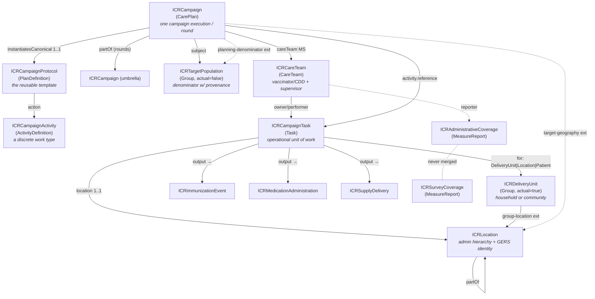
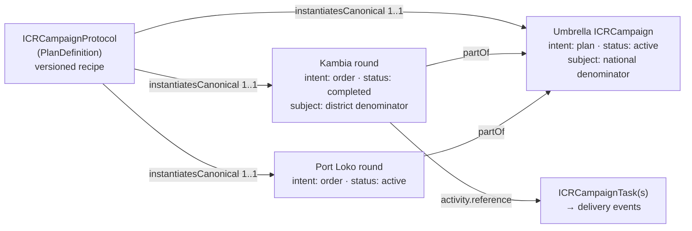
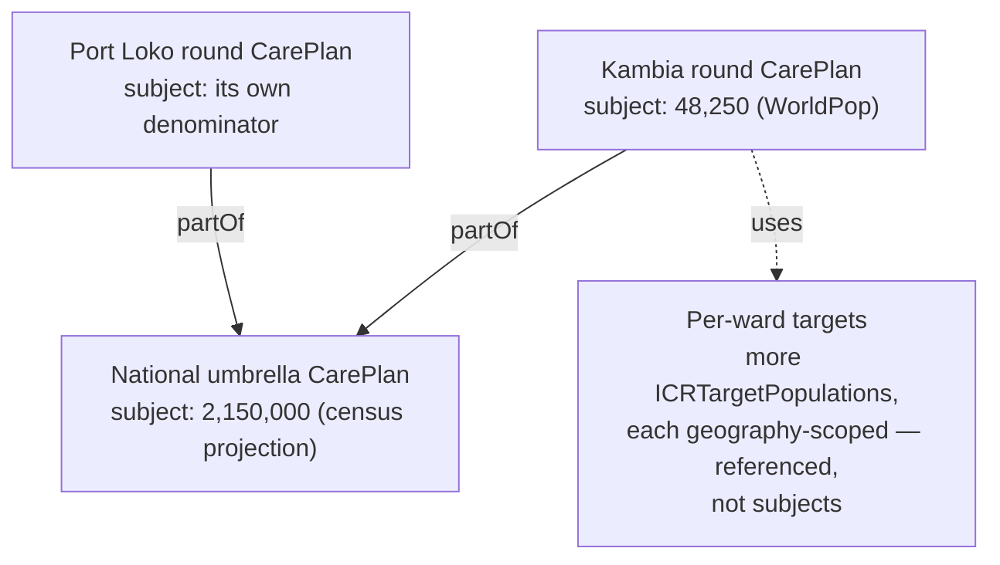
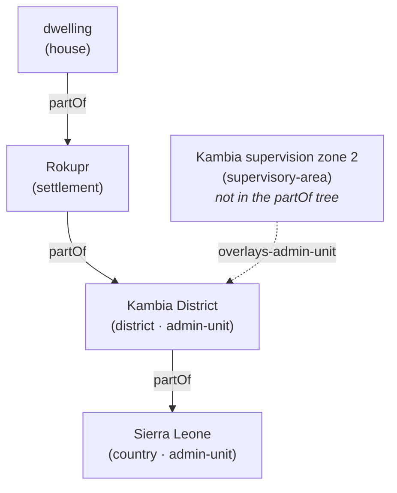
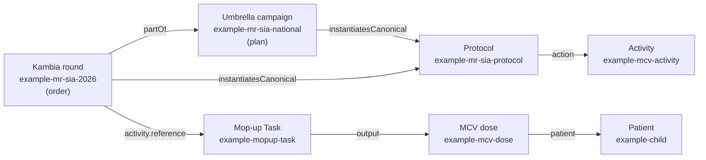

# ICR FHIR Implementation Guide — Summary & Companion
> **What this document is.** A clear, structured companion to the draft **ICR (Integrated Campaign Registry) FHIR Implementation Guide**. It is written to be read on its own: it explains what a FHIR Implementation Guide is, introduces the ICR IG, walks through its architecture, and then documents every profile (resource), code system, and extension — with worked examples, plain-language property descriptions, key observations, and the open questions that remain. Where a profile or feature is _proposed but not yet built into the IG_, it is labelled **(proposed)**. Abbreviations are spelled out on first use and collected in the glossary immediately below.

* * *
## Abbreviations & glossary
Quick reference for every abbreviation used in this document, grouped by area. Names in `code font` (e.g. `ICRCampaign`) are FHIR artifacts defined in the IG, not abbreviations.

**Campaign types & public-health programmes**

| Abbrev. | Meaning |
| --- | --- |
| **ICR** | Integrated Campaign Registry — the project and FHIR IG this document describes |
| **SIA** | Supplementary Immunization Activity — a **mass vaccination campaign** (as opposed to routine immunization) |
| **PMVC** | Preventive Mass Vaccination Campaign (e.g. yellow fever) |
| **MDA** | Mass Drug Administration — a campaign giving a drug to a whole eligible population |
| **ITN / LLIN** | Insecticide-Treated Net / Long-Lasting Insecticidal Net (bed-net distribution) |
| **IRS** | Indoor Residual Spraying (anti-malaria) |
| **RI** | Routine Immunization — the everyday schedule (contrast SIA) |
| **EPI** | Expanded Programme on Immunization — the routine-immunization programme |
| **NTD / PC-NTD** | Neglected Tropical Disease / Preventive-Chemotherapy NTD |
| **CDD** | Community Drug Distributor — the front-line MDA worker |
| **CDTI** | Community-Directed Treatment with Ivermectin — the NTD-MDA delivery model |
| **RCM** | Rapid Convenience Monitoring — a quick, non-probability in-campaign check; **pass/fail with a trigger, not a coverage rate** |
| **LQAS** | Lot Quality Assurance Sampling — a small-sample accept/reject decision rule |
| **AEFI** | Adverse Event Following Immunization |
| **DOC** | Directly Observed Consumption — in MDA, the drug is swallowed under supervision |
| **TAS** | Transmission Assessment Survey — an NTD-elimination decision gate |
| **RED** | Reaching Every District — WHO microplanning approach |
| **EYE** | Eliminate Yellow fever Epidemics — WHO strategy |
| **FIP** | Fully Immunized Person |
| **Type A / B / C** | the campaign delivery-model typology — A = fixed/temporary-post session, B = house-to-house, C = community/MDA |

**Vaccines, diseases & product codings**

| Abbrev. | Meaning |
| --- | --- |
| **MR** | Measles–Rubella |
| **MCV** | Measles-Containing Vaccine |
| **OCV** | Oral Cholera Vaccine |
| **YF** | Yellow Fever |
| **HPV** | Human Papillomavirus |
| **bOPV / nOPV2** | bivalent / novel-type-2 Oral Polio Vaccine |
| **CVX** | the US-CDC vaccine-code system (standard vaccine codes) |
| **ATC** | Anatomical Therapeutic Chemical classification — WHO drug codes |
| **GS1 / GTIN** | global commodity-coding standards / Global Trade Item Number |
| **UCUM** | Unified Code for Units of Measure |
| **VVM / WMF** | Vaccine Vial Monitor / Wastage Monitoring Form |

**Geography & identifiers**

| Abbrev. | Meaning |
| --- | --- |
| **GERS** | Global Entity Reference System — Overture Maps' stable place IDs |
| **P-code** | Place code — OCHA humanitarian administrative-area code |
| **OCHA** | UN Office for the Coordination of Humanitarian Affairs |
| **ISO 3166** | the ISO country (-1) and subdivision (-2) code standard |
| **GIS / MFL** | Geographic Information System / Master Facility List |
| **GeoJSON** | a geospatial JSON data format |
| **GPS** | Global Positioning System — a coordinate point |
| **OSM** | OpenStreetMap |
| **PSU / EA** | Primary Sampling Unit / Enumeration Area (survey sampling) |

**FHIR & technical**

| Abbrev. | Meaning |
| --- | --- |
| **FHIR** | Fast Healthcare Interoperability Resources — the HL7 health-data standard |
| **IG** | Implementation Guide — a packaged set of FHIR profiles/rules for one use-case |
| **FSH / SUSHI** | FHIR Shorthand (the authoring language) / its compiler |
| **R4 / R5** | FHIR Release 4 (this IG) / Release 5 |
| **MS** | Must Support — a FHIR conformance flag ("implementations must populate/process this element") |
| **VS / CS** | ValueSet / CodeSystem |
| **CQL** | Clinical Quality Language — decision logic |
| **IPS** | International Patient Summary |
| **SNOMED CT / ICD-11 / LOINC** | clinical terminologies (concepts / diseases / observations) |
| **JSON** | JavaScript Object Notation |
| **FR** | French-language (`fr`) designations on code systems |

**WHO SMART Guidelines, organizations & reporting**

| Abbrev. | Meaning |
| --- | --- |
| **WHO / UNICEF** | World Health Organization / UN Children's Fund |
| **DAK** | Digital Adaptation Kit — WHO SMART-Guidelines content |
| **IMMZ** | the artifact prefix of the WHO SMART Immunizations IG |
| **L1 / L2 / L3** | WHO SMART-Guidelines "levels of knowledge representation" — narrative / semi-structured / machine-readable FHIR |
| **VPD** | Vaccine-Preventable Disease (surveillance) |
| **HMIS / DHIS2** | Health Management Information System / District Health Information Software 2 |
| **JAP** | Joint Appraisal — annual immunization-programme report |
| **ICG** | International Coordinating Group — vaccine-stockpile provision (OCV/YF) |
| **ESPEN** | Expanded Special Project for Elimination of NTDs (WHO-AFRO) |
| **GTFCC** | Global Task Force on Cholera Control |
| **VCQI** | Vaccination Coverage Quality Indicators — survey toolkit |
| **M&E** | Monitoring and Evaluation |
| **mCSD** | Mobile Care Services Discovery — an IHE location-directory profile |
| **CPG / CRMI / SDC** | HL7 frameworks: Clinical Practice Guidelines / Canonical Resource Management Infrastructure / Structured Data Capture |

* * *
## 1. Introduction
### 1.1 What is FHIR?
**FHIR** (Fast Healthcare Interoperability Resources) is the modern standard, published by HL7, for representing and exchanging health data. Instead of bespoke file formats, FHIR defines a library of building blocks called **resources** — `Patient`, `Immunization`, `Location`, `Group`, `CarePlan`, and so on — each a structured object with a defined set of fields. A resource can be serialized as JSON (used throughout this document), exchanged over a standard REST API, and validated against its definition. Because every system speaks the same resource vocabulary, two systems that have never met can still understand each other's data.

This IG uses **FHIR Release 4 (R4, version 4.0.1)** — the most widely deployed release and the one WHO's digital-health guidelines target.
### 1.2 What is an Implementation Guide?
Base FHIR is deliberately generic: `Patient` has to serve a hospital in one country and a vaccination campaign in another, so most fields are optional and loosely typed. An **Implementation Guide (IG)** is how you pin that generality down for one specific use-case. An IG is a published package containing:

- **Profiles** — constrained, specialized versions of base resources (e.g. "a `Location` that _must_ carry an administrative hierarchy and a stable place ID"). A profile says which fields are required, which codes are allowed, and what each field means in context.
  
- **Extensions** — extra fields the base resource lacks, added in a standard, interoperable way.
  
- **Terminology** — `CodeSystem`s (lists of codes the IG owns) and `ValueSet`s (the codes allowed in a given field).
  
- **Examples** — concrete instances that show conformant data.
  
- **Narrative** — pages that explain the design and how to implement it.
  

An IG turns "FHIR in general" into "FHIR, exactly as this programme needs it" — and makes data from different implementers comparable by construction.

The ICR IG is authored in **FHIR Shorthand (FSH)**, a concise text language for writing profiles, compiled to FHIR JSON by **SUSHI** (the FSH compiler) and rendered to a website by the **IG Publisher**.
### 1.3 Introducing the ICR IG
Health campaigns — measles SIAs, polio rounds, mass drug administration for neglected tropical diseases, bed-net and indoor-spraying campaigns — repeatedly collect the _same_ data (who lives where, how many children are eligible, who was reached, what coverage was achieved) and then archive or lock it in a one-off spreadsheet. The next campaign starts from scratch.

The **Integrated Campaign Registry (ICR)** is a FHIR Implementation Guide that gives campaigns a shared, reusable data model, so each campaign's data _compounds_ instead of being re-collected. Its scope is the half of immunization-and-delivery work that routine-health systems (and WHO's routine-immunization IG) do **not** model:

- **Campaign architecture** — a reusable protocol, its executions and rounds, the discrete activities, and the operational units of work (Tasks).
  
- **Population & geography** — denominators with provenance, the actual household/community groups reached, and a rich location model (administrative hierarchy, operational geography, stable cross-campaign place IDs, GeoJSON boundaries).
  
- **Delivery events** — the vaccine doses, drug administrations, and commodity deliveries, each tagged campaign-vs-routine so a campaign never contaminates routine analytics.
  
- **Coverage** — administrative and independently-surveyed coverage as **separate, never-merged lineages** of the same quantity.
  

ICR is intentionally a **complement** to WHO's SMART Immunizations IG, which is routine-only: a campaign dose and a routine dose can sit in the same store, distinguished by a single `record-origin` flag. ICR positions itself as "the campaign SMART-Guidelines IG."

The IG covers the major campaign delivery models through one common typology used throughout this document:

- **Type A** — fixed or temporary-post sessions (people come to a post).
  
- **Type B** — house-to-house delivery (workers go door to door).
  
- **Type C** — community / MDA delivery (a whole community treated, often register-level).
  
### 1.4 IG metadata
The package-level settings that fix the IG's identity (all permanent once published, so several are flagged for UNICEF confirmation before v1.0):

| Field | Value | Notes |
| --- | --- | --- |
| `id` | `unicef.fhir.icr` | NPM-style package id (`<org>.fhir.<scope>` convention) |
| `canonical` | `https://fhir.icr.unicef.org` | Base URL of every profile/extension/CodeSystem/ValueSet; also hosts the provisional identifier-system URIs |
| `name` / `title` | `ICR` / "Integrated Campaign Registry (ICR) Implementation Guide" |     |
| `status` / `version` | `draft` / `0.1.0` |     |
| `fhirVersion` | `4.0.1` | FHIR **R4** |
| `license` | `Apache-2.0` |     |
| `jurisdiction` | UN M49 `001` "World" | Global IG, not country-specific |
| `publisher` | **UNICEF** (publisher of record); ICR project (delivered by Ona + Crosscut) credited via `contact` |     |
| `menu` | Home, Background, Artifacts |     |

The canonical `https://fhir.icr.unicef.org` stakes out a UNICEF-owned namespace; the same base hosts the two provisional geographic-identifier system URIs (see §2.5). The toolchain deliberately matches WHO SMART Guidelines practice; a formal `dependsOn smart.who.int.base` dependency is proposed once alignment hardens (see §13).
### 1.5 What the IG contains
| Layer | Count | Artifacts |
| --- | --- | --- |
| **Profiles — campaign architecture** | 5   | ICRCampaignProtocol (PlanDefinition), ICRCampaign (CarePlan), ICRCampaignActivity (ActivityDefinition), ICRCampaignTask (Task), ICRCareTeam (CareTeam) |
| **Profiles — population & geography** | 3   | ICRDeliveryUnit (Group), ICRTargetPopulation (Group), ICRLocation (Location) |
| **Profiles — delivery events** | 3   | ICRImmunizationEvent (Immunization), ICRMedicationAdministration (MedicationAdministration), ICRSupplyDelivery (SupplyDelivery) |
| **Profiles — coverage** | 2   | ICRAdministrativeCoverage (MeasureReport), ICRSurveyCoverage (MeasureReport) |
| **Extensions** | 23  | See §11 |
| **CodeSystems** | 12  | See §10 |
| **ValueSets** | 13  | One per code system (mostly), plus a narrowed independent-coverage set and an ATC-based MDA medication set |
| **Example instances** | 26  | A coherent measles–rubella SIA scenario plus an activity gallery, an MDA event and an ITN delivery (see §12) |
| **Narrative pages** | 2   | `index.md` (home), `background.md` (design rationale & open questions) |

The fifth campaign-architecture profile, **ICRCareTeam** (CareTeam) — the team & supervisor model — is documented in §5.

* * *
## 2. Architecture at a glance
FHIR has no native `Campaign` resource, so ICR builds its campaign layer on the **CarePlan** resource and surrounds it with profiles for population, geography, delivery events, and coverage. The diagram below shows how the pieces connect.


### 2.1 The three layers
The IG reads most easily as three intersecting layers:

- **The operational layer** — `protocol → campaign → task → delivery events`. This is the chain of work: a reusable template (PlanDefinition), instantiated as a specific campaign/round (CarePlan), broken into units of work (Task), each producing concrete delivery events (doses, drug administrations, deliveries).
  
- **The identity layer** — `Group` + `Location`. _Who_ a campaign acts on is kept strictly separate from _where_ they live and where work happens. The _who_ is a **Group** — and in ICR a Group is either a **household** (a Type-B house-to-house unit) or a **community** (a Type-C MDA unit), modelled by `ICRDeliveryUnit`, alongside the denominator cohorts modelled by `ICRTargetPopulation`. Keeping who and where apart means a location's stable identity survives changes in the group living there, and vice versa.
  
- **The analytics layer** — `MeasureReport`. The coverage readout sits to the side, computed from the other two, and deliberately keeps administrative and survey coverage as separate records that are never merged.
  
### 2.2 The key components
**Campaign architecture (§3–§5)**

- **ICRCampaignProtocol** _(PlanDefinition)_ — the reusable, versioned **template** for a campaign type. It says what a "measles–rubella SIA" _is_ (products, age bands, activity sequence, coverage goals) once, so every country and round can instantiate the same recipe and stay comparable.
  
- **ICRCampaign** _(CarePlan)_ — **one specific campaign execution or round.** It is the core resource that represents campaigns. It **starts as a microplan and changes into an execution record** as Tasks complete — the same resource, evolving rather than being replaced. National "umbrella" campaigns and their district "rounds" are the same profile, linked by `partOf`.
  
- **ICRCampaignActivity** _(ActivityDefinition)_ — **a discrete work type** within a campaign ("administer MCV", "distribute ITNs", "spray structures"). Campaigns can contain multiple activities. It carries the clinical/commodity content once; thousands of Tasks instantiate it.
  
- **ICRCampaignTask** _(Task)_ — **the assignable, trackable unit of work** — one Task per site-session (**Type A** — people come to a fixed or temporary post) or per household/community visit (**Type B** — workers go house to house; **Type C** — a whole community is treated, often register-level, as in MDA). It is where these three delivery models converge into one profile.
  
- **ICRCareTeam** _(CareTeam)_ — **the delivery team and supervisor model.** Who did the work and who is accountable for a reported number.
  

**Population & geography (§6)**

- **ICRDeliveryUnit** _(Group,_ `actual=true`_)_ — **the actual group of people a Task acts on** — a household, a community, or a school cohort. The _who_.
  
- **ICRTargetPopulation** _(Group,_ `actual=false`_)_ — **a denominator**: a conceptual cohort with a count, eligibility characteristics, and — critically — source and date provenance. Competing estimates for the same place are kept side by side.
  
- **ICRLocation** _(Location)_ — **the place model.** The most-customized ICR resource: nested administrative hierarchy, operational geography that sits _beside_ the admin tree, GeoJSON boundaries, and multi-system geospatial identity (GERS, P-codes, national and ISO codes).
  

**Delivery events (§7)**

- **ICRImmunizationEvent** _(Immunization)_ — **a vaccine dose** given in a campaign.
  
- **ICRMedicationAdministration** _(MedicationAdministration)_ — **a drug administration** (MDA), e.g. albendazole, with the dose-pole and directly-observed-consumption patterns.
  
- **ICRSupplyDelivery** _(SupplyDelivery)_ — **a commodity delivery** (bed-nets, etc.).
  

All three carry a mandatory `record-origin` flag (campaign vs routine).

**Coverage (§8)**

- **ICRAdministrativeCoverage** _(MeasureReport)_ — coverage computed from the campaign's own tally/delivery data.
  
- **ICRSurveyCoverage** _(MeasureReport)_ — coverage measured independently (cluster survey, LQAS, RCM). Structurally prevented from ever being merged with administrative coverage.
  
### 2.3 Five cross-cutting principals
1. **Delivery strategy is first-class and coded** — a required binding, mandatory on the protocol (`1..*`) and Task (`1..1`). Strategy is _the_ discriminator because it determines which data elements even exist (house-to-house tallies are meaningless at a fixed post).
  
2. **Record origin is mandatory on every delivery event** (`1..1`) — it differentiates data captured in a campaign from data captured by routine immunization programmes, so the two are never mixed together when coverage is calculated.
  
3. **Three views of coverage, kept separate and never blended.** A campaign produces three different counts of "how many people were reached": what was _planned_ (the target population/denominator), what the campaign's _own records_ say it delivered (administrative coverage), and what an _independent survey_ later measured (survey coverage). ICR stores these as three separate records and never merges them — because they routinely disagree in reality. Eg. a campaign tally may report 99% coverage while a post event coverage survey reports 76%
  
4. **Denominator provenance is recommended on every estimate** — source + date travel with each denominator; competing estimates coexist; one is flagged as _the_ planning denominator.
  
5. **Geospatial identity is multi-system, GERS-preferred** — locations can map to multiple identifiers. Operational geography overlays the admin hierarchy rather than pretending to be it.
  
### 2.4 Aliases & identifier systems
The IG defines aliases (short names) for the external and internal systems it references:

- **External terminologies** — `$CVX` (vaccine codes, `http://hl7.org/fhir/sid/cvx`), `$ATC` (WHO drug codes, `http://www.whocc.no/atc`), `$VaccineCodeVS` (the core FHIR vaccine ValueSet), `$MeasurePopulation` (the HL7 measure-population code system used by coverage examples).
  
- **ICR geographic-identifier system URIs** _(provisional — to be confirmed before v1.0)_:
  
  - `$GERSId = https://fhir.icr.unicef.org/identifiers/overture-gers` — Overture Maps GERS IDs (the preferred cross-campaign join key).
    
  - `$PCode = https://fhir.icr.unicef.org/identifiers/pcode` — OCHA P-codes.
    
  - `$ISO = urn:iso:std:iso:3166` — ISO 3166-1/-2 country & subdivision codes (admin levels 0–3); WHO-aligned.
    
  - `$NationalAdminCode = https://fhir.icr.unicef.org/identifiers/national-admin-code` — the country/implementer's own admin code, where they don't use a P-code (the per-country base URI is expected to be overridden in implementation).
    
- **ICR code systems** — twelve aliases, one per CodeSystem (§10).
  

**Why ICR mints geographic-identifier URIs.** GERS IDs and P-codes need _some_ system URI to live under in `Location.identifier`; parking them under the ICR canonical is the pragmatic v0.1 choice. CVX/ATC/GS1 serve as the international product-code backbone, so ICR does not re-invent product codes.

**Two follow-ups.** (1) Whether ICR should mint the GERS/P-code system URIs at all — if Overture or OCHA ever publish official URIs, stored identifiers would need migration (tracked as the Overture engagement, §13). (2) **GS1 is named in the narrative but has no alias and no binding** — `ICRSupplyDelivery.suppliedItem.item[x]` is left uncoded; binding a GS1 GTIN system is a known gap (§7.3).

* * *
## 3. How to read the profiles
A **profile** is a constrained, specialized version of a base FHIR resource. The base resource (say `Location`) is general-purpose; a profile (say `ICRLocation`) tightens it for one use-case by doing some combination of:

- **Making optional fields required**, or narrowing how many times a field may appear.
  
- **Restricting which resource types a reference may point at** (e.g. "`partOf` may only reference another `ICRLocation`").
  
- **Binding a coded field to a specific ValueSet** so only approved codes are used.
  
- **Fixing a field to a constant value** (e.g. `actual = false` on a denominator group).
  
- **Adding extensions** — new fields the base resource doesn't have.
  

A profile never invents a new resource type; it _layers rules on top of_ an existing one. That is what keeps profiled data valid plain FHIR: any FHIR system can read an `ICRLocation` as a `Location`, while ICR-aware systems get the extra guarantees.

**Reading the element tables in §4–§8.** Each profile below has a property table styled after the FHIR resource-content tables (e.g. [build.fhir.org/patient.html](https://build.fhir.org/patient.html)). The columns mean:

- **Element** — the field name (dot-notation for nested fields; `extension[name]` for an added field).
  
- **Flags** — conformance flags. **MS** = _Must Support_: a conformant implementation must be able to populate and process the element. (Other FHIR flags like `?!` _modifier_ don't appear in this IG.)
  
- **Card.** — _cardinality_, the min..max number of times the element may occur: `1..1` = exactly one (required, single); `0..1` = optional, at most one; `1..*` = at least one (required, repeatable); `0..*` = optional, repeatable.
  
- **Type / Binding** — the data type or referenced resource, and — for coded fields — the bound ValueSet and its **binding strength**: **required** (must use a code from the set), **extensible** (use one if it fits, otherwise add your own), or a **fixed** value.
  
- **Description** — what the field carries in ICR.
  

Profiles labelled **(proposed)** are described for completeness but are not yet committed to the IG.

* * *
## 4. Campaign-architecture profiles
The profiles that model the structure of a campaign: the template (Protocol, §4.1), the execution (Campaign, §4.2), the work types (Activity, §4.3), the units of work (Task, §4.4), and the team & supervisor model (**ICRCareTeam**, §5).
### 4.1 ICRCampaignProtocol — `PlanDefinition`
**Purpose.** The reusable, version-controlled **template** for a campaign type — what a measles SIA _is_ (products, age bands, activity sequence, coverage goals), instantiated when a new campaign is initiated in a country. A country defines "measles–rubella SIA, 9 months–14 years" once, and every district and round instantiates it, which ensures all data collected using this campaign type is consistent.

**Properties.**

| Element | Flags | Card. | Type / Binding | Description |
| --- | --- | --- | --- | --- |
| `status` | MS  |     | code | Lifecycle status of the protocol definition (`draft` / `active` / `retired`). |
| `version` | MS  |     | string | The protocol version — "MR SIA per 2026 guidance" and its 2028 revision are distinct, citable things. |
| `title` | MS  |     | string | Human-readable title of the protocol. |
| `type` | MS  | 1..1 | CodeableConcept, **required** → ICRCampaignTypeVS | **What kind of campaign** this is (`vaccination-sia`, `mda`, `itn-distribution`, `irs`, …). Deliberately disease-agnostic — the disease lives in the execution's `addresses` and the vaccine/drug code. |
| `subject[x]` | MS  |     |     | Target-population definition (age band, eligibility) — "children 9m–14y". |
| `goal` | MS  |     |     | Coverage targets / thresholds every execution inherits (e.g. ≥95% admin coverage). |
| `action` | MS  |     |     | The activity sequence — vaccinate, then mop up — each entry pointing at an ActivityDefinition. |
| `action.definition[x]` | MS  |     | `Canonical(ICRCampaignActivity)` only | The protocol→activity wiring is **enforced**, not just narrated: an action may only point at an ICRCampaignActivity. |
| `extension[deliveryStrategy]` | MS  | 1..* | CodeableConcept, **required** → ICRDeliveryStrategyVS | The delivery strategies this protocol uses — mandatory and repeatable because hybrid strategies are the norm (an MR SIA runs posts, then mops up door-to-door). |

**Example.** `example-mr-sia-protocol` — the recipe card for the scenario's measles–rubella SIA:

```json
{
  "resourceType": "PlanDefinition",
  "id": "example-mr-sia-protocol",
  "meta": {
    "profile": [
      "https://fhir.icr.unicef.org/StructureDefinition/ICRCampaignProtocol"
    ]
  },
  "status": "active",
  "version": "1.0.0",
  "title": "Measles–Rubella SIA — 2026 national guidance",
  "type": {
    "coding": [
      {
        "system": "https://fhir.icr.unicef.org/CodeSystem/icr-campaign-type",
        "code": "vaccination-sia"
      }
    ]
  },
  "extension": [
    {
      "url": "https://fhir.icr.unicef.org/StructureDefinition/delivery-strategy",
      "valueCodeableConcept": {
        "coding": [
          {
            "system": "https://fhir.icr.unicef.org/CodeSystem/icr-delivery-strategy",
            "code": "fixed-post"
          }
        ]
      }
    },
    {
      "url": "https://fhir.icr.unicef.org/StructureDefinition/delivery-strategy",
      "valueCodeableConcept": {
        "coding": [
          {
            "system": "https://fhir.icr.unicef.org/CodeSystem/icr-delivery-strategy",
            "code": "house-to-house"
          }
        ]
      }
    },
    {
      "url": "https://fhir.icr.unicef.org/StructureDefinition/activity-type",
      "valueCodeableConcept": {
        "coding": [
          {
            "system": "https://fhir.icr.unicef.org/CodeSystem/icr-activity-type",
            "code": "follow-up"
          }
        ]
      }
    }
  ],
  "goal": [
    {
      "description": {
        "text": "≥95% administrative coverage in every district, verified by post-campaign survey"
      }
    }
  ],
  "action": [
    {
      "title": "Administer MCV, 9 months–14 years",
      "definitionCanonical": "https://fhir.icr.unicef.org/ActivityDefinition/example-mcv-activity"
    }
  ]
}
```

> The `activity-type` extension (`follow-up`) shown here is **proposed** (§13), not yet in the IG.
> 
> **Relevant terminology.**
> 
> - `type` binds to **ICRCampaignTypeVS** (`vaccination-sia`, `mda`, `itn-distribution`, `irs`, `vitamin-a`, `integrated`)
>   
> - the strategy extension binds to **ICRDeliveryStrategyVS** (`fixed-post`, `temporary-post`, `mobile`, `school`, `house-to-house`, `community-directed`).
>   
> 
> Both are required bindings (§10).

**Key observations.**

- **Protocol and execution are separate resources.** The protocol defines a campaign type once; each district or round is a separate execution (§4.2) that links back to it through `instantiatesCanonical` (cardinality `1..1`). Because every execution references the same protocol, "all measles–rubella SIA rounds" is a single query rather than a manual reconciliation. This is what makes campaigns of the same type directly comparable.
  
- **The protocol carries no geography, dates, or denominator.** Those values are specific to an execution and are held on ICRCampaign (§4.2). The protocol holds only reusable template content: products, delivery strategies, goals, and the activity sequence.
  
- `type` **is disease-agnostic.** The campaign type (`vaccination-sia`) records the intervention model, not the disease. A measles SIA and a polio SIA are both `vaccination-sia`; they are distinguished by `addresses` (the target Condition) and the vaccine code. Encoding the disease in `type` would duplicate `addresses` and the product code and would enlarge the code list, so disease-specific campaign codes were not added.
  
- {==`campaign-type` **and the proposed** `activity-type` **capture different axes.** `campaign-type` records _what intervention_ is delivered (the delivery model). The proposed `activity-type`/`sia-type` axis records _the operational mode_ of a round — routine, preventive-mass, catch-up, follow-up, mop-up, or reactive/outbreak-response. The two are independent: a measles follow-up SIA and a measles outbreak-response SIA share `campaign-type = vaccination-sia` but differ in mode, target age band, and analysis. Keeping the axes separate allows "all reactive campaigns, any disease" and "all measles campaigns, any mode" to be queried independently. A companion proposed `coverage-target` element would store the programme-defined threshold — for example ≥95% for an SIA, ≥65% epidemiological for lymphatic filariasis.==}{>>This paragraph is confusing. Can we please rewrite this again and try and explain more simply.<<}{id="c1" by="mberg" at="2026-06-17T19:07:00.739Z"}
  
### 4.2 ICRCampaign — `CarePlan` (the keystone)
**Purpose.** A **specific campaign execution.** It begins life as a microplan (`intent = plan`) and evolves into the record of the campaign implementation as Tasks complete and coverage accumulates against it — the _same_ resource is used to support each phase of the campaign. Rounds are sibling ICRCampaigns under a national "umbrella" campaign via `partOf`, and every execution points back at the one versioned protocol.

**Lifecycle — in plain terms.** One CarePlan, two stages. It starts as the **plan** (a microplan: `intent = plan`, `status = draft`), then becomes the **record of what actually happened** as the work is done — `intent` changes to `order` and `status` moves `draft → active → completed`, with Tasks and coverage accumulating against that same resource.



The campaign umbrella (representing the microplan) stays `intent = plan` — it is the planning shell holding the national denominator and binding the rounds together; each round goes `plan → order` as it executes. Because every box points at the **same** protocol, "all MR SIA rounds, anywhere" is one query.

**Who vs Where**

Each CarePlan has exactly **one** `subject` — the _who_, an ICRTargetPopulation ("children 9m–14y, Kambia, 48,250").

The _where_ is separate and plural: `targetGeography` is `0..*`. Multiple and nested populations are carried by the umbrella/round stack, not by overloading one CarePlan.



**Properties.**

| Element | Flags | Card. | Type / Binding | Description |
| --- | --- | --- | --- | --- |
| `instantiatesCanonical` | MS  | 1..1 | `Canonical(ICRCampaignProtocol)` only | The protocol this campaign executes. `1..1` is a forcing function — every campaign, even ad-hoc, authors a protocol first. |
| `status` | MS  |     |     | `draft → active → completed`. |
| `intent` | MS  |     |     | `plan` (microplan) transitioning to `order` (execution) — the lifecycle dial. |
| `category` | MS  | 1..* | CodeableConcept, **required** → ICRCampaignTypeVS | The campaign type(s), echoing the protocol's `type`. |
| `subject` | MS  |     | `Reference(ICRTargetPopulation)` only | The single denominator (the _who_) — makes the denominator a first-class participant, not an afterthought. |
| `period` | MS  | 1..1 | Period | Campaign/round dates. |
| `careTeam` | MS  |     | `Reference(ICRCareTeam)` | The team(s) running the campaign — see ICRCareTeam (§5). |
| `addresses` | MS  |     | `Reference(Condition)` | The disease/condition targeted (where the specific disease lives, since `type` is disease-agnostic). |
| `partOf` |     |     | `Reference(ICRCampaign)` only | The umbrella/round pattern — a round is `partOf` its umbrella. |
| `activity` | MS  |     | `activity.reference` → `Reference(ICRCampaignTask)` only | The round's Tasks. Inline activities (`activity.detail`) are out — the work is always a referenced Task. |
| `extension[campaignRound]` | MS  | 0..1 | positiveInt | Which round this is. |
| `extension[targetGeography]` | MS  | 0..* | `Reference(ICRLocation)` | The _where_ — plural, since one campaign may name several geographies. |
| `extension[planningDenominator]` | MS  | 0..1 | `Reference(ICRTargetPopulation)` | Singles out _which_ estimate is THE denominator coverage is computed against, when several compete. |
| `extension[dataLineage]` | MS  | 0..1 | code, **required** → ICRDataLineageVS | Realtime vs reconciled (default: absent ⇒ realtime). |

**Example — national umbrella (the microplan shell):**

```json
{
  "resourceType": "CarePlan",
  "id": "example-mr-sia-national",
  "meta": {
    "profile": [
      "https://fhir.icr.unicef.org/StructureDefinition/ICRCampaign"
    ]
  },
  "instantiatesCanonical": [
    "https://fhir.icr.unicef.org/PlanDefinition/example-mr-sia-protocol"
  ],
  "status": "active",
  "intent": "plan",
  "category": [
    {
      "coding": [
        {
          "system": "https://fhir.icr.unicef.org/CodeSystem/icr-campaign-type",
          "code": "vaccination-sia"
        }
      ]
    }
  ],
  "subject": {
    "reference": "Group/example-target-population-national"
  },
  "period": {
    "start": "2026-06-15",
    "end": "2026-12-18"
  },
  "addresses": [
    {
      "display": "Measles and rubella"
    }
  ],
  "extension": [
    {
      "url": "https://fhir.icr.unicef.org/StructureDefinition/planning-denominator",
      "valueReference": {
        "reference": "Group/example-target-population-national"
      }
    }
  ]
}
```

**Example — the Kambia June round (a child execution of that umbrella):**

```json
{
  "resourceType": "CarePlan",
  "id": "example-mr-sia-2026",
  "meta": {
    "profile": [
      "https://fhir.icr.unicef.org/StructureDefinition/ICRCampaign"
    ]
  },
  "instantiatesCanonical": [
    "https://fhir.icr.unicef.org/PlanDefinition/example-mr-sia-protocol"
  ],
  "status": "completed",
  "intent": "order",
  "category": [
    {
      "coding": [
        {
          "system": "https://fhir.icr.unicef.org/CodeSystem/icr-campaign-type",
          "code": "vaccination-sia"
        }
      ]
    }
  ],
  "subject": {
    "reference": "Group/example-target-population"
  },
  "period": {
    "start": "2026-06-15",
    "end": "2026-06-26"
  },
  "partOf": [
    {
      "reference": "CarePlan/example-mr-sia-national"
    }
  ],
  "addresses": [
    {
      "display": "Measles and rubella"
    }
  ],
  "activity": [
    {
      "reference": {
        "reference": "Task/example-site-session-task"
      }
    },
    {
      "reference": {
        "reference": "Task/example-mopup-task"
      }
    }
  ],
  "extension": [
    {
      "url": "https://fhir.icr.unicef.org/StructureDefinition/campaign-round",
      "valuePositiveInt": 1
    },
    {
      "url": "https://fhir.icr.unicef.org/StructureDefinition/target-geography",
      "valueReference": {
        "reference": "Location/example-district"
      }
    },
    {
      "url": "https://fhir.icr.unicef.org/StructureDefinition/planning-denominator",
      "valueReference": {
        "reference": "Group/example-target-population"
      }
    }
  ]
}
```

**Key observations.**

- **Planned and executed states are the same resource at different lifecycle stages, not two resources.** The microplan and the execution record are one CarePlan at different `intent` values. The planned figure is retained in the `planningDenominator` extension, and the planned-versus-actual audit trail is provided by FHIR resource history and Provenance. ICR does not create a separate planning-snapshot Group.
  
- **The number of CarePlans is determined by denominators, not administrative boundaries.** Each CarePlan has exactly one `subject` (denominator) but `targetGeography` is `0..*`. Two configurations are valid: (a) one CarePlan covering several geographies, when those areas are planned and reported as a single scope against one shared denominator (`targetGeography` lists all of them, `subject` is the single regional denominator); (b) several round CarePlans under a regional umbrella linked by `partOf`, required whenever each area has its own denominator, period, or coverage rollup. Configuration (b) is the common case. The rule is one CarePlan per denominator/reporting scope, not per administrative area.
  
- **Nested scopes do not sum to their parent.** A district denominator and the national total are produced by different sources and methods (national 2,150,000 census projection versus Kambia 48,250 WorldPop), so they can legitimately differ. The `partOf` relationship is conceptual nesting, not arithmetic aggregation.
  
- **The umbrella is itself an ICRCampaign**, so it carries its own national denominator, `category`, and `period`.
  

**Open questions.**

- The proposed `activity-type` and `coverage-target` axes (§4.1) would also surface here, plus **round1↔round2 linkage** for OCV/multi-round campaigns (§13).
  
- The relief valve, if `instantiatesCanonical 1..1` ever proves too strict for emergencies, is to relax it to `0..1` with a flag.
  
### 4.3 ICRCampaignActivity — `ActivityDefinition`
A **CampaignActivity** is a discrete **activity** within a campaign. For example:

- Administer albendazole to children 5–14
  
- Distribute ITNs to households
  
- Spray a structure
  

CampaignActivities are instantiated as ICRCampaignTask resources. The Activity defines the the intervention activity once eg. product and dosage **once** which is then used to create thousands of identical tasks under it without needing to repeat clinical content. CampaignActivities are also deliberately to not define the the target (target-agnostic). They define _what_ to do in a campaign at _most the kind_ of eligible target but they never define the specific household or community to target.

**Properties**

| Element | Flags | Card. | Type / Binding | Description |
| --- | --- | --- | --- | --- |
| `status` | MS  |     |     | {==Lifecycle status.==}{>>can we include the status states here?<<}{id="c2" by="mberg" at="2026-06-17T19:40:01.396Z"} |
| `kind` |     |     | fixed `#Task` | Hard-wires the instantiation target: instantiating this activity produces ICRCampaignTasks, not ServiceRequests. |
| `code` | MS  | 1..1 | CodeableConcept | The intervention: vaccinate / treat / distribute / spray. |
| `product[x]` | MS  |     | (unbound — CVX/ATC/GS1 in `^short` only) | The product: vaccine (CVX), drug (ATC), or commodity (GS1). |
| `dosage` | MS  |     | Dosage | Where applicable; dose-pole logic references an Observation. |
| `extension[deliveryStrategy]` | MS  | 0..1 | CodeableConcept, **required** → ICRDeliveryStrategyVS | Optional here (resolved per-Task), unlike the mandatory protocol/Task strategy. |

**Example.** `example-mcv-activity` — the activity the protocol's `action` points at:

```json
{
  "resourceType": "ActivityDefinition",
  "id": "example-mcv-activity",
  "meta": {
    "profile": [
      "https://fhir.icr.unicef.org/StructureDefinition/ICRCampaignActivity"
    ]
  },
  "status": "active",
  "name": "AdministerMCV",
  "title": "Administer MCV, 9 months–14 years",
  "kind": "Task",
  "code": {
    "text": "Vaccinate — measles–rubella–containing vaccine"
  },
  "productCodeableConcept": {
    "coding": [
      {
        "system": "http://hl7.org/fhir/sid/cvx",
        "code": "05",
        "display": "measles virus vaccine"
      }
    ]
  },
  "dosage": [
    {
      "route": {
        "text": "subcutaneous"
      },
      "doseAndRate": [
        {
          "doseQuantity": {
            "value": 0.5,
            "unit": "mL",
            "system": "http://unitsofmeasure.org",
            "code": "mL"
          }
        }
      ]
    }
  ],
  "extension": [
    {
      "url": "https://fhir.icr.unicef.org/StructureDefinition/delivery-strategy",
      "valueCodeableConcept": {
        "coding": [
          {
            "system": "https://fhir.icr.unicef.org/CodeSystem/icr-delivery-strategy",
            "code": "fixed-post"
          }
        ]
      }
    }
  ]
}
```

**The activity gallery.** Four ActivityDefinitions ship, spanning the campaign types — each says only WHAT, never which concrete target:

| Instance | Intervention | Product | Dosage / rule |
| --- | --- | --- | --- |
| `example-mcv-activity` | Vaccinate (Type A/B) | CVX `05` measles virus vaccine | 0.5 mL subcutaneous, single dose |
| `example-albendazole-activity` | Treat (Type C MDA) | ATC `P02CA03` albendazole | 400 mg single dose; tablet count by **dose-pole height band** |
| `example-itn-activity` | Distribute (Type B→A) | LLIN (free-text pending GS1) | 1 net per 2 household members |
| `example-irs-activity` | Spray (Type B) | Pirimiphos-methyl 300CS | interior walls of eligible structures |

**Key observations.**

- **The activity defines the work type; the Task defines the concrete target.** The ActivityDefinition holds the intervention, product, and dosage rule, and at most the _kind_ of eligible target. The specific thing acted on — a particular household, structure, or session — is set on each Task's `for`/`focus`. A "spray" Task targets a structure (Location); a "vaccinate" Task targets a household (Group), with per-person detail recorded in the delivery events.
  
- `kind` **is fixed to** `#Task`**.** Instantiating an activity produces an ICRCampaignTask, not a ServiceRequest. This fixes how activities are turned into units of work.
  
- `product[x]` **is Must Support but has no binding.** The delivery-event profiles bind product codes (CVX/ATC); binding the definition side as well, for consistency, is a possible refinement.
  
- **Delivery-strategy cardinality differs by resource by design** — `0..1` on the activity, `1..*` on the protocol, `1..1` on the Task. The strategy is resolved per Task, so the activity does not need to fix it.
  
### 4.4 ICRCampaignTask — `Task`
**Purpose.** The assignable, trackable **operational unit of work** — one Task per site-session (Type A) or per household/community visit (Type B/C). This is where the three delivery models (A/B/C) **all use one and the same profile**: the _same_ `ICRCampaignTask` serves a fixed-post session and a house-to-house visit, told apart by what it targets and the mandatory coded delivery strategy. Tasks may be pre-planned from the microplan or field-registered on discovery.

**Two reference roles —** `for` **vs** `focus`**.** The unit being **targeted** (household, community, or a person for follow-up) is carried by `Task.for`. `Task.focus` is reserved for **workflow lineage** — the CarePlan, activity, or prior Task this work derives from. This split keeps "what we acted on" and "where this work came from" separate and queryable.

**Properties.**

| Element | Flags | Card. | Type / Binding | Description |
| --- | --- | --- | --- | --- |
| `status` | MS  |     |     | `requested → in-progress → completed / failed`. |
| `intent` | MS  |     | code | Workflow intent (`order` for an executing Task). |
| `owner` | MS  |     | Reference | The team that owns/performs the work — ideally a `Reference(ICRCareTeam)` (§5) rather than a display string. |
| `executionPeriod` | MS  |     | Period | When the work was carried out. |
| `code` | MS  | 1..1 | CodeableConcept | What the Task is. |
| `for` | MS  | 1..1 | `Reference(ICRDeliveryUnit \| ICRLocation \| Patient)` | The unit being **targeted**: a household/community delivery-unit Group (Type B/C), the site Location (Type A), or a Patient for person-targeted follow-up. |
| `focus` | MS  |     | `Reference(CarePlan \| ActivityDefinition \| ServiceRequest \| Task)` | **Workflow lineage**: the campaign/activity this work instantiates, or the prior Task it follows (e.g. a mop-up Task following the session Task that missed a child). |
| `location` | MS  | 1..1 | `Reference(ICRLocation)` only | Where the work happened. |
| `output` | MS  |     |     | References to Immunization / MedicationAdministration / SupplyDelivery, or aggregate counts. |
| `extension[deliveryStrategy]` | MS  | 1..1 | CodeableConcept, **required** → ICRDeliveryStrategyVS | The strategy this Task runs under — mandatory, since it determines which other fields apply. |
| `extension[taskOrigin]` | MS  | 1..1 | code, **required** → ICRTaskOriginVS (`pre-planned` \| `field-registered`) | Whether the Task was pre-generated from the microplan or created in the field on discovery. |
| `extension[housesVisited]` |     | 0..1 | unsignedInt | (Type B) houses visited on the round. |
| `extension[eligiblePresent]` |     | 0..1 | unsignedInt | (Type B) eligible people present. |
| `extension[eligibleAbsent]` |     | 0..1 | unsignedInt | (Type B) eligible people absent. |
| `extension[missedReason]` |     | 0..* | CodeableConcept, **extensible** → ICRMissedReasonVS | (Type B) why eligible people were missed. |
| `extension[noncomplianceReason]` |     | 0..* | CodeableConcept, **extensible** → ICRNoncomplianceReasonVS | (Type B) why a household/person declined. |
| `extension[fingerMarked]` |     | 0..1 | boolean | (Type B) the in-field "already covered" marker. |
| `extension[dataLineage]` |     | 0..1 | code, **required** → ICRDataLineageVS | Realtime vs reconciled. |

**Example.** `example-mopup-task` — the Type-B house-to-house visit, the richer Task shape, which chains to a delivery event:

```json
{
  "resourceType": "Task",
  "id": "example-mopup-task",
  "meta": {
    "profile": [
      "https://fhir.icr.unicef.org/StructureDefinition/ICRCampaignTask"
    ]
  },
  "status": "completed",
  "intent": "order",
  "code": {
    "text": "Administer MCV — house-to-house mop-up visit"
  },
  "for": {
    "reference": "Group/example-household"
  },
  "focus": {
    "reference": "CarePlan/example-mr-sia-2026"
  },
  "location": {
    "reference": "Location/example-dwelling"
  },
  "executionPeriod": {
    "start": "2026-06-24",
    "end": "2026-06-24"
  },
  "owner": {
    "display": "CDD team 7, Rokupr"
  },
  "output": [
    {
      "type": {
        "text": "Immunization administered"
      },
      "valueReference": {
        "reference": "Immunization/example-mcv-dose"
      }
    }
  ],
  "extension": [
    {
      "url": "https://fhir.icr.unicef.org/StructureDefinition/delivery-strategy",
      "valueCodeableConcept": {
        "coding": [
          {
            "system": "https://fhir.icr.unicef.org/CodeSystem/icr-delivery-strategy",
            "code": "house-to-house"
          }
        ]
      }
    },
    {
      "url": "https://fhir.icr.unicef.org/StructureDefinition/task-origin",
      "valueCode": "field-registered"
    },
    {
      "url": "https://fhir.icr.unicef.org/StructureDefinition/eligible-present",
      "valueUnsignedInt": 2
    },
    {
      "url": "https://fhir.icr.unicef.org/StructureDefinition/eligible-absent",
      "valueUnsignedInt": 1
    },
    {
      "url": "https://fhir.icr.unicef.org/StructureDefinition/missed-reason",
      "valueCodeableConcept": {
        "coding": [
          {
            "system": "https://fhir.icr.unicef.org/CodeSystem/icr-missed-reason",
            "code": "absent"
          }
        ]
      }
    },
    {
      "url": "https://fhir.icr.unicef.org/StructureDefinition/finger-marked",
      "valueBoolean": true
    }
  ]
}
```

**Key observations.**

- **One Task per visit; person-level detail is held in the delivery events.** A doorstep visit is a single Task, closed when the visit completes. Each person vaccinated is recorded as a separate `Immunization` referenced from `Task.output` and pointing at that person's `Patient`. The Task is the unit of work (one visit); the delivery events are the units of service (the doses given).
  
- **Person-targeted Tasks are used only for follow-up.** When a specific missed or zero-dose individual must be traced, a new Task is created whose `for` is that person's `Patient`, with `focus` referencing the originating Task that missed them. This is the only intended person-targeted Task. Creating a Task per person for routine delivery would multiply Task volume roughly fivefold without recording anything the Immunization records do not already carry.
  
- **The count and reason extensions apply only to Type B.** Houses visited, eligible present/absent, missed/noncompliance reasons, and finger-marking have no meaning for a fixed-post tally, so they are optional (`0..x`) and populated only for house-to-house work.
  
- `task-origin` **is mandatory because the value is itself a measurement.** A team that finds an unenumerated household creates the delivery unit and its Task in the field (`field-registered`). The count of field-registered Tasks per area measures how incomplete the microplan's enumeration was, which informs the next round's denominators.
  
- **Delivery events are linked from** `Task.output`**.** R4 `Immunization` has no `basedOn` element, so there is no reverse link from event to Task. The link is therefore directed Task → event (§7).
  
- **Disaggregation (recommended pattern).** The count extensions are single visit-level totals and must not be multiplied to express age/sex breakdowns. Disaggregate in one of two ways: (a) emit one `Task.output` entry per stratum, each with a coded `type` for the age band/sex; or (b) where person-level data exists, derive the breakdown from the individual Immunization/MedicationAdministration records, which already carry age and sex. The same rule applies to reasons: Task-level `missed-reason`/`noncompliance-reason` aggregate over the whole visit, so per-person reasons require person-level records.
  

**Open questions.**

- **Granularity at scale is the IG's #1 open question** — one Task per household across a national campaign is millions of Tasks. The profile keeps both household-level and site-level paths open, and field-registration (lazy Task creation) softens the worst case, but pilots must exercise the household-level path.
  
- `output.valueReference` is not yet structurally constrained to the three delivery-event profiles (the `^short` says it; the profile doesn't enforce it).
  
- `task-origin 1..1` means historical imports must assign an origin — acceptable as a forcing function, or add an `unknown` code for back-loaded datasets (§13).
  

* * *
## 5. ICRCareTeam — `CareTeam` _(the team & supervisor model)_
> **What this profile does.** `ICRCampaign.careTeam` references a CareTeam (the MS element in §2/§4.2); `ICRCareTeam` constrains it into the campaign team & supervisor model — coded participant roles, the managing organization, and the supervisory area a team covers. (In some v0.1 examples team identity is still recorded display-only — `Task.owner` = "CDD team 7, Rokupr" as a plain string — which this profile replaces with a real `Reference(ICRCareTeam)`.)

**Purpose.** The campaign delivery team — the vaccinators / CDDs who do the work and the **supervisor** who oversees them and very often files the report. It answers two operational questions every supervisor asks: _who worked this area_, and _who is accountable for this reported number_. The team is referenced from `ICRCampaign.careTeam` (the campaign roster) and from `Task.owner`/`Task.performer` (the team that worked a given Task), and the supervisor surfaces again as the `MeasureReport.reporter` on rolled-up coverage (§8) and typically owns the **supervisory-area** Location (§6.3).

**Properties.**

| Element | Flags | Card. | Type / Binding | Description |
| --- | --- | --- | --- | --- |
| `status` | MS  |     | code (base CareTeam status) | `proposed → active → inactive` (FHIR CareTeam status values). |
| `name` | MS  |     |     | Human-readable team label (replaces today's display-only `Task.owner` string). |
| `subject` | MS  |     | `Reference(ICRTargetPopulation)` | The campaign/population the team serves. |
| `participant` | MS  | 1..* |     | The members. |
| `participant.role` | MS  | 1..1 | CodeableConcept, **extensible** → ICRTeamRoleVS | `vaccinator` \| `cdd` \| `supervisor` \| `social-mobilizer` \| `recorder`. |
| `participant.member` | MS  |     | `Reference(Practitioner \| PractitionerRole \| RelatedPerson)` | The CDD/vaccinator; a community volunteer is a RelatedPerson. |
| `managingOrganization` | MS  |     | `Reference(Organization)` | The implementing partner / district health office. |
| `extension[overseesArea]` |     | 0..* | `Reference(ICRLocation)` | The supervisory-area(s) this team's supervisor covers, tying CareTeam to operational geography (§6.3). |

**Example.** `example-careteam` — CDD team 7 and its supervisor:

```json
{
  "resourceType": "CareTeam",
  "id": "example-careteam",
  "meta": {
    "profile": [
      "https://fhir.icr.unicef.org/StructureDefinition/ICRCareTeam"
    ]
  },
  "status": "active",
  "name": "CDD team 7, Rokupr",
  "subject": {
    "reference": "Group/example-target-population"
  },
  "participant": [
    {
      "role": [
        {
          "coding": [
            {
              "system": "https://fhir.icr.unicef.org/CodeSystem/icr-team-role",
              "code": "vaccinator"
            }
          ]
        }
      ],
      "member": {
        "display": "Fatmata Sesay (vaccinator)"
      }
    },
    {
      "role": [
        {
          "coding": [
            {
              "system": "https://fhir.icr.unicef.org/CodeSystem/icr-team-role",
              "code": "supervisor"
            }
          ]
        }
      ],
      "member": {
        "display": "Ibrahim Conteh (supervisor)"
      }
    }
  ],
  "managingOrganization": [
    {
      "display": "Kambia District Health Management Team"
    }
  ],
  "extension": [
    {
      "url": "https://fhir.icr.unicef.org/StructureDefinition/oversees-area",
      "valueReference": {
        "reference": "Location/example-supervisory-area"
      }
    }
  ]
}
```

**Key observations.**

- **The supervisor role is central.** A supervisor is both a delivery actor and, frequently, the person who reports results. Profiling CareTeam instead of recording teams as display strings makes `Task.owner` a real `Reference(ICRCareTeam)`, so "who carried out this visit" becomes a query. With the `oversees-area` extension and the supervisor recorded as the `reporter` on coverage, "who reported this figure, and which area do they cover" is answerable end to end.
  
- **This profile and the proposed supervision/QA work are a single effort** (§13), not two separate ones.
  

**Open questions.**

- **Supervisor-as-reporter** — whether campaign MeasureReports **SHALL** name a `reporter` (an explicit invariant) or whether that stays MS for v1.
  

* * *
## 6. Population & geography profiles
Three profiles that model _who_ a campaign acts on and _where_. The split is deliberate: a denominator (`ICRTargetPopulation`), the actual group reached (`ICRDeliveryUnit`), and the place (`ICRLocation`) are separate first-class resources.
### 6.1 ICRDeliveryUnit — `Group` (household / community / school cohort)
**Purpose.** The **actual group of people** a campaign Task acts on — a household (Type B house-to-house), a community (Type C MDA), or a school cohort (school-based delivery), distinguished by a required `group-kind` code. This is the validated Group + Location pattern, generalized: the Group is _who_, the Location (via the `group-location` extension) is _where it lives or is based_ — the dwelling for a household, the settlement for a community, the school for a school cohort. (Type A's delivery unit is a site, which is a Location, not a Group.)

**Properties.**

| Element | Flags | Card. | Type / Binding | Description |
| --- | --- | --- | --- | --- |
| `type` |     |     | fixed `#person` | A group of people. |
| `actual` |     |     | fixed `true` | A real, enumerated group (contrast the denominator, `actual=false`). |
| `code` | MS  | 1..1 | CodeableConcept, **required** → ICRGroupKindVS (`household` \| `community` \| `school-cohort`) | The kind of delivery unit. |
| `member` | MS  |     | `member.entity` → `Reference(Patient)` only | The enumerated people (optional by design). |
| `quantity` | MS  |     | unsignedInt | Group size where individuals are not enumerated — the common case. |
| `extension[groupLocation]` | MS  | 1..1 | `Reference(ICRLocation)` | **Residence/base, not service point**: the dwelling (household), settlement/community point (community), or school (school-cohort). |

**Example.** `example-household` — the Type-B unit a mop-up Task targets:

```json
{
  "resourceType": "Group",
  "id": "example-household",
  "meta": {
    "profile": [
      "https://fhir.icr.unicef.org/StructureDefinition/ICRDeliveryUnit"
    ]
  },
  "type": "person",
  "actual": true,
  "code": {
    "coding": [
      {
        "system": "https://fhir.icr.unicef.org/CodeSystem/icr-group-kind",
        "code": "household"
      }
    ]
  },
  "quantity": 6,
  "member": [
    {
      "entity": {
        "reference": "Patient/example-child"
      }
    }
  ],
  "extension": [
    {
      "url": "https://fhir.icr.unicef.org/StructureDefinition/group-location",
      "valueReference": {
        "reference": "Location/example-dwelling"
      }
    }
  ]
}
```

**Relevant terminology.** `code` binds required to **ICRGroupKindVS** (`household`, `community`, `school-cohort`).

**Key observations.**

- **Separating the group (who) from the location (where)** lets the location's identity (its GERS building/place ID) persist when group composition changes, and lets the group persist when it is re-mapped to a new location.
  
- **One profile serves both scales.** A household and a community are the same modelling pattern at different scales, so ICR uses one profile with a coded `code` (group kind) rather than two near-identical profiles. Setting `code` to `community` and pointing `group-location` at a settlement turns the same structure into a Type-C community delivery unit. The `school-cohort` value shows the list can be extended to other units (for example nomadic groups or camp populations) as countries require.
  
- `member.entity` **is restricted to** `Patient`**.** FHIR has four person-shaped resources: Patient (anyone who may receive a service — a healthy child receiving a measles dose is a Patient, and `Immunization.patient` accepts only a Patient); RelatedPerson (a caregiver defined relative to a patient); Practitioner (workers such as CDDs and vaccinators); and Person (an identity-linkage resource). Every enumerated household member is therefore a Patient. Restricting `member.entity` to Patient excludes Practitioner and Device; it does not exclude RelatedPerson, which R4 `Group.member` never permitted in the first place (RelatedPerson membership was added in R5).
  
- `group-location` **records residence, not the service point.** Where service occurred is recorded on `Task.location` and on the delivery event's own `location`. If a household travels to a village distribution centre, its dwelling here is unchanged and the Task records the centre.
  
- `quantity` **supports counting without registering individuals.** Campaigns often count group members without enumerating each person, so individual `member` entries are optional and `quantity` carries the head-count.
  

**Household identity across campaigns.** A household is identified by its **members**, anchored on the head of household (keyed by `Patient.id` or, better, a national ID); **cross-campaign linkage** joins on the **dwelling**, whose `group-location` Location carries a stable GERS building ID that survives household composition changes. `Group.identifier` stays light — identity is reconstructed from head-of-household + dwelling GERS ID.

**Open questions.**

- Whether to _also_ stamp a convenience `Group.identifier` for direct lookup; and how to handle head-of-household churn (death, migration, household splits) — the dwelling GERS ID is the durable join key, the person ID disambiguates which household at that structure.
  
- WHO-alignment: whether to align ICR's person records to WHO's `IMMZ.Patient` (base R4 Patient with required identifier/name/phone/gender/birthDate/address) so household members are WHO-conformant (§13).
  
### 6.2 ICRTargetPopulation — `Group`
**Purpose.** A target-population **denominator**: a conceptual cohort (`actual=false`) with a count, eligibility characteristics, and — critically — **source and date provenance**. The denominator is the dominant error source in campaign analytics, so multiple competing estimates per geography are _retained side by side_, each with its own provenance, and exactly one is flagged as the planning denominator. Coverage is then computed against a declared choice while the disagreement stays visible instead of being silently overwritten.

**Worked example — competing denominators.** Three instances tell the whole story:

| Instance | Geography | Count | Source | Date | Planning? |
| --- | --- | --- | --- | --- | --- |
| `example-target-population` | → Kambia District | **48,250** | WorldPop modelled | 2026-01-15 | **true** |
| `example-target-population-enumerated` | → Kambia District | **51,800** | microcensus / H2H enumeration | 2026-03-02 | false |
| `example-target-population-national` | → Sierra Leone | 2,150,000 | census projection | 2025-11-30 | true (national) |

The first two are the **same geography disagreeing by ~7%**. Both are retained; exactly one carries the planning flag. The consequence is concrete: 47,766 children reached is **99% coverage against WorldPop but 92% against the enumeration** — the denominator you pick changes the answer. That is why source + date are recommended on every estimate.

**Properties.**

| Element | Flags | Card. | Type / Binding | Description |
| --- | --- | --- | --- | --- |
| `type` |     |     | fixed `#person` | A group of people. |
| `actual` |     |     | fixed `false` | A conceptual cohort — a denominator, not a roster of real people. |
| `quantity` | MS  | 1..1 | unsignedInt | The denominator count. |
| `characteristic` | MS  |     |     | Age band, sex, eligibility rule, geography; **sliced** (pattern on `code`, open). |
| `characteristic[geography]` | MS  | 0..1 | `value[x]` → `Reference(ICRLocation)`; `code` fixed `geography`; `exclude` fixed `false` | The **computable** scope link — joins the estimate to the location hierarchy at any level (country → district → ward → settlement → operational area) by reference, not by parsing a name. |
| `extension[denominatorSource]` | MS  | 0..1 | CodeableConcept, **extensible** → ICRDenominatorSourceVS | _Recommended, not required_ — the population is often unknown up front. |
| `extension[estimateDate]` | MS  | 0..1 | date | When the estimate was made (denominators decay fast — 1–3 years). |
| `extension[isPlanningDenominator]` | MS  | 0..1 | boolean | Flags _the_ one coverage is computed against. |
| `extension[confidence]` |     | 0..1 | string | Free-text confidence (coded confidence is a later refinement). |

**Example.** `example-target-population` — Kambia's WorldPop planning denominator (the `subject` of the round CarePlan):

```json
{
  "resourceType": "Group",
  "id": "example-target-population",
  "meta": {
    "profile": [
      "https://fhir.icr.unicef.org/StructureDefinition/ICRTargetPopulation"
    ]
  },
  "type": "person",
  "actual": false,
  "quantity": 48250,
  "characteristic": [
    {
      "code": {
        "coding": [
          {
            "system": "https://fhir.icr.unicef.org/CodeSystem/icr-group-characteristic",
            "code": "geography"
          }
        ]
      },
      "valueReference": {
        "reference": "Location/example-district"
      },
      "exclude": false
    }
  ],
  "extension": [
    {
      "url": "https://fhir.icr.unicef.org/StructureDefinition/denominator-source",
      "valueCodeableConcept": {
        "coding": [
          {
            "system": "https://fhir.icr.unicef.org/CodeSystem/icr-denominator-source",
            "code": "worldpop"
          }
        ]
      }
    },
    {
      "url": "https://fhir.icr.unicef.org/StructureDefinition/estimate-date",
      "valueDate": "2026-01-15"
    },
    {
      "url": "https://fhir.icr.unicef.org/StructureDefinition/is-planning-denominator",
      "valueBoolean": true
    }
  ]
}
```

**Relevant terminology.** `denominator-source` binds extensible to **ICRDenominatorSourceVS** (`census`, `census-projection`, `microcensus`, `worldpop`, `grid3`, `hmis`, `other`).

**Key observations.**

- **Provenance is recommended but not mandatory (design decision #6, "denominator-first").** Source and date are `0..1 MS` rather than required, because the population is frequently unknown when planning begins and a mandatory source/date would block legitimate early or placeholder estimates. Where a real number is recorded, its source and date should be recorded with it.
  
- **Competing estimates are retained side by side.** Census-projection, WorldPop, and microcensus estimates are kept as sibling Groups, each with its own provenance, rather than overwriting one with the next.
  
- **Scope is computable at any level.** The geography characteristic references an ICRLocation, so an estimate can be joined to the location hierarchy at country, district, ward, settlement, or operational-area level. Target populations are not household-bound; that is the role of ICRDeliveryUnit.
  
- **"Exactly one planning denominator" is not enforced by the profile.** Nothing prevents two same-geography Groups from both setting, or neither setting, the planning flag. The actual enforcement point is the single-valued `ICRCampaign.planningDenominator` extension (`0..1`), which is where coverage reads its denominator from.
  

**Open questions.**

- The geography characteristic is `0..1` so estimates _can_ exist without a Location; tightening to `1..1` once pilots confirm every estimate has one is tracked (§13).
  
- Proposed for a later round: an **at-risk / eligible** denominator type (to drive programme-vs-epidemiological coverage), a **population-estimation-method + source-raster version/date** (so two `worldpop` estimates become distinguishable), and a **population-vulnerability / equity** characteristic (§13).
  
### 6.3 ICRLocation — `Location`
**Purpose.** The **place model**, and the most-customized ICR resource: a nested administrative hierarchy (6+ levels), operational geography that is _linkable-but-distinct_ from admin units, GeoJSON boundaries, and multi-system geospatial identity — GERS IDs as the preferred cross-campaign join key, with P-codes, national codes, and ISO codes as coequal aliases.

**The two hierarchies, side by side.** The `partOf` chain is the **administrative** tree (one parent each). Operational geography sits **beside** it — its own Location, _not_ in the `partOf` chain, linked to the admin unit(s) it covers by `overlays-admin-unit`:



Every box on the solid `partOf` layer is an ICRLocation pointing at its single parent (country → district → settlement → dwelling, 6+ levels in practice). "Kambia supervision zone 2" is the operational exception: it hangs off _nothing_ in the admin tree (a supervisory zone can straddle several wards, so it can't have one parent) and instead carries a dashed `overlays-admin-unit` pointer at the district it reports into — which is what makes operational geography linkable-but-distinct.

**Properties.**

| Element | Flags | Card. | Type / Binding | Description |
| --- | --- | --- | --- | --- |
| `name` | MS  |     | string | The location's name. |
| `status` | MS  |     | code | Active/inactive status. |
| `partOf` | MS  |     | `Reference(ICRLocation)` only | The administrative parent — country → region → district → ward → settlement. |
| `physicalType` | MS  |     | CodeableConcept | The base-FHIR shape — jurisdiction / site / building / household. |
| `type` | MS  |     | CodeableConcept, **extensible** → ICRLocationTypeVS | The ICR location type — `admin-unit`, `settlement`, `facility`, `school`, `community-distribution-point`, `temporary-post`, `household`, `supervisory-area`, `operational-area`. |
| `position` | MS  |     |     | GPS point (longitude/latitude). |
| `identifier` | MS  |     | **sliced by** `system` (open): `gers` 0..1 MS, `pcode` 0..1 MS, `national` 0.._,_ `iso` _0.._ | Multi-system identity. **≥1 identifier required when** `type = admin-unit` (invariant `icr-loc-admin-id`). |
| `extension[boundary]` (`location-boundary-geojson`) | MS  | 0..1 | Attachment, `contentType` fixed `application/geo+json` | The GeoJSON geometry (a Polygon/MultiPolygon shape, or a Point). |
| `extension[deliveryStrategy]` |     | 0..1 | CodeableConcept, **required** → ICRDeliveryStrategyVS | For delivery sites (fixed/temporary posts): the strategy this site serves. |
| `extension[overlaysAdminUnit]` |     | 0..* | `Reference(ICRLocation)` | For operational geography: the admin unit(s) this area overlays. _1.. required when_ `type ∈ {supervisory-area, operational-area}`* (invariant `icr-loc-overlays`). |
| `extension[locationAncestors]` _(proposed)_ |     | 0..* | complex: per-level `adm0…adm3+` code + `Reference(ICRLocation)` | A **server-maintained** denormalized admin breadcrumb of the `partOf` chain, for fast hierarchy filtering without deep recursion. Proposed; not yet in the IG. |

**Example.** `example-district` — Kambia District, showing multi-system identity, the admin hierarchy, a GPS point, and a GeoJSON boundary:

```json
{
  "resourceType": "Location",
  "id": "example-district",
  "meta": {
    "profile": [
      "https://fhir.icr.unicef.org/StructureDefinition/ICRLocation"
    ]
  },
  "status": "active",
  "name": "Kambia District",
  "physicalType": {
    "coding": [
      {
        "system": "http://terminology.hl7.org/CodeSystem/location-physical-type",
        "code": "jdn",
        "display": "Jurisdiction"
      }
    ]
  },
  "type": [
    {
      "coding": [
        {
          "system": "https://fhir.icr.unicef.org/CodeSystem/icr-location-type",
          "code": "admin-unit"
        }
      ]
    }
  ],
  "partOf": {
    "reference": "Location/example-country"
  },
  "identifier": [
    {
      "system": "https://fhir.icr.unicef.org/identifiers/pcode",
      "value": "SL0201"
    },
    {
      "system": "https://fhir.icr.unicef.org/identifiers/overture-gers",
      "value": "overture-division-kambia-example"
    }
  ],
  "position": {
    "longitude": -12.9176,
    "latitude": 9.1247
  },
  "extension": [
    {
      "url": "https://fhir.icr.unicef.org/StructureDefinition/location-boundary-geojson",
      "valueAttachment": {
        "contentType": "application/geo+json",
        "title": "Kambia District boundary (GeoJSON Polygon)",
        "url": "https://fhir.icr.unicef.org/geo/kambia-district.geojson"
      }
    }
  ]
}
```

**Relevant terminology.** `type` binds extensible to **ICRLocationTypeVS** (9 codes incl. `supervisory-area`, `operational-area`). Identifier slices use the geographic-identifier systems from §2.5 (`$GERSId`, `$PCode`, `$NationalAdminCode`, `$ISO`).

**Two geometry carriers.** `position` carries the simple **GPS point** (base FHIR). The `location-boundary-geojson` extension carries the **shape** — a GeoJSON Attachment whose payload is a Polygon/MultiPolygon (here referenced by `url`; it may instead be inline base64). Because GeoJSON itself supports `Point`, the _same_ extension can carry a richer coordinate where wanted.

**Key observations.**

- **Open identifier slicing lets multiple code systems coexist.** National location codes can sit alongside GERS, P-codes, and ISO codes without profile changes. The `gers` and `pcode` slices are `0..1`, so a newly created, unmatched location can exist with national codes only and have its GERS ID back-filled later. The enrichment lifecycle is: create the location unmatched, run asynchronous conflation, then backfill the GERS ID with versioning and Provenance.
  
- **Administrative units must carry an identifier, but not necessarily a P-code.** Many countries key on a national administrative code, so the `national` and `iso` slices are first-class. The `icr-loc-admin-id` invariant requires at least one identifier (from any system) when `type = admin-unit`, so an administrative area cannot exist without a stable code. Sites and dwellings are not constrained this way.
  
- **Operational geography is modelled separately from administrative geography.** `partOf` can express only one hierarchy. A supervisory or operational area is therefore typed with a location-type code and linked to the administrative units it covers through `overlays-admin-unit`. The `icr-loc-overlays` invariant requires such an area to overlay at least one admin unit, because an area that overlays nothing cannot be rolled up to any reporting unit. This operational-overlay mechanism is considered the IG's strongest design feature.
  
- **The Overture release version should be recorded alongside a GERS ID.** GERS IDs are stable, but Overture republishes the registry on a release cadence and an ID's attributes can change between releases. A stored ID is only reproducible if the release it was matched against is also recorded.
  
- **Scope is limited to identity, hierarchy, and geometry.** Contextual metadata that could be attached to a Location is kept out of the IG and linked externally by location ID: accessibility/travel-time (derived and volatile), georegistry match-status (redundant, since presence or absence of a GERS ID already conveys match state), endemicity, and the NTD TAS/impact-survey gate (programme state on its own cadence). The one candidate for inclusion is a `structure`/footprint location-type, which is identity rather than context.
  

**Open questions.**

- **Overture release version has no field yet.** FHIR `Identifier` has no version slot. Awaiting the Overture-side answer (does Overture expose a stable release identifier, and in what form) before modeling it — likely a small `gers-release` extension on the identifier slice.
  
- `partOf` **strict-typing vs widening.** `partOf` is constrained to `Reference(ICRLocation)`, keeping the whole ancestor chain ICR-conformant and queryable — but you can't hang an ICR site directly under a Location from a pre-existing national MFL/GIS without re-profiling that parent. The relief valve is to widen `partOf` to `Reference(Location)`. Open design decision, paired with the national/ISO admin-code work.
  
- The proposed `location-ancestors` breadcrumb extension is not yet in the IG.
  

* * *
## 7. Delivery-event profiles
The concrete record of what was delivered — a vaccine dose, a drug administration, a commodity delivery. All three share two design constants:

- **A mandatory** `record-origin` **extension (**`1..1 MS`**)** — campaign vs routine, so campaign doses are never mixed into routine coverage analytics.
  
- **The Task→event link runs through** `Task.output`, because R4 `Immunization` has no `basedOn` element to point back with — the reverse link doesn't exist in the base resource.
  
### 7.1 ICRImmunizationEvent — `Immunization`
**Purpose.** A **vaccine dose** administered in a campaign — the person-level delivery event that closes the chain `protocol → activity → campaign → task → dose → patient`.

**Properties.**

| Element | Flags | Card. | Type / Binding | Description |
| --- | --- | --- | --- | --- |
| `status` | MS  |     | code | Immunization status (`completed`, etc.). |
| `patient` | MS  |     | `Reference(Patient)` | The person who received the dose — the person-level capture (only a `Patient`, never a Group). |
| `occurrence[x]` | MS  |     | dateTime / string | When the dose was given. |
| `location` | MS  |     | `Reference(Location)` | Where the dose was given. |
| `lotNumber` | MS  |     | string | Vaccine lot number — for stock accountability and AEFI traceability. |
| `manufacturer` | MS  |     | Reference | Vaccine manufacturer — paired with the lot for traceability. |
| `performer` | MS  |     |     | Who administered the dose (the team/worker). |
| `vaccineCode` | MS  |     | CodeableConcept, **extensible** → core FHIR vaccine VS (CVX) | The vaccine; local codes map back via ConceptMap. |
| `protocolApplied` | MS  |     |     | Dose number / series — supports multi-dose campaigns (OCV) and routine integration. |
| `extension[recordOrigin]` | MS  | 1..1 | code, **required** → ICRRecordOriginVS (`campaign` \| `routine`) | Differentiates campaign-captured doses from routine-immunization doses, keeping them separate in coverage analytics. |

**Example.** `example-mcv-dose` — the dose the mop-up Task's `output` points at:

```json
{
  "resourceType": "Immunization",
  "id": "example-mcv-dose",
  "meta": {
    "profile": [
      "https://fhir.icr.unicef.org/StructureDefinition/ICRImmunizationEvent"
    ]
  },
  "status": "completed",
  "vaccineCode": {
    "coding": [
      {
        "system": "http://hl7.org/fhir/sid/cvx",
        "code": "05",
        "display": "measles virus vaccine"
      }
    ]
  },
  "patient": {
    "reference": "Patient/example-child"
  },
  "occurrenceDateTime": "2026-06-24",
  "location": {
    "reference": "Location/example-dwelling"
  },
  "lotNumber": "MRV-2026-0412",
  "manufacturer": {
    "display": "Serum Institute of India"
  },
  "performer": [
    {
      "actor": {
        "display": "CDD team 7, Rokupr"
      }
    }
  ],
  "protocolApplied": [
    {
      "doseNumberPositiveInt": 1
    }
  ],
  "extension": [
    {
      "url": "https://fhir.icr.unicef.org/StructureDefinition/record-origin",
      "valueCode": "campaign"
    }
  ]
}
```

**Key observations.**

- `patient` **is how person-level data is captured without creating extra Tasks.** Each dose references the individual (the same `example-child` who is the household's `member`). The pattern is one Task per visit and one Immunization per person, linked from `Task.output`.
  
- `lotNumber` **and** `manufacturer` **are Must Support for lot accountability**, which supports tracing doses to a lot in the event of an adverse event following immunization (AEFI).
  
- `protocolApplied` **connects campaign doses to routine series logic.** Its dose-number element is needed both by multi-dose campaigns (such as OCV) and by integration with routine immunization records.
  

**Open questions.**

- WHO-alignment: make `ICRImmunizationEvent` compatible-with / derived-from WHO's `IMMZ.Immunization` so a campaign dose is a valid WHO immunization carrying `record-origin`; one divergence to reconcile is WHO's own `IMMZ.Z` vaccine codes vs CVX (bridge via ConceptMap) (§13).
  
- A proposed **AEFI** profile would reuse WHO's `IMMZ.AdverseEvent` rather than mint a new value set (§13).
  
### 7.2 ICRMedicationAdministration — `MedicationAdministration`
**Purpose.** A **drug administration** in a mass drug administration (MDA) — albendazole, ivermectin, etc. — with the two distinctly-MDA patterns: dose derived from a **dose-pole height band**, and **directly-observed consumption** (the supervised-swallow protocol).

**Properties.**

| Element | Flags | Card. | Type / Binding | Description |
| --- | --- | --- | --- | --- |
| `status` | MS  |     | code | Administration status (`completed`, etc.). |
| `effective[x]` | MS  |     | dateTime / Period | When the drug was administered. |
| `medication[x]` |     |     | CodeableConcept only, **extensible** → ICRMDAMedicationVS (WHO ATC) | The drug. |
| `subject` | MS  |     | `Reference(Patient \| ICRDeliveryUnit)` only | The treated person, **or the community/household delivery-unit Group** for register-level capture. |
| `dosage` | MS  |     |     | Tablet count — usually derived from a dose-pole height-band Observation. |
| `supportingInformation` | MS  |     |     | e.g. the dose-pole Observation the dosage was derived from. |
| `extension[recordOrigin]` | MS  | 1..1 | code, **required** → ICRRecordOriginVS | Differentiates campaign data from routine-programme data. |
| `extension[directlyObserved]` | MS  | 0..1 | boolean | The MDA DOC protocol — distinguishes "handed out" from "actually swallowed". |

**Example.** `example-albendazole-administration` — an NTD drug given house-to-house:

```json
{
  "resourceType": "MedicationAdministration",
  "id": "example-albendazole-administration",
  "meta": {
    "profile": [
      "https://fhir.icr.unicef.org/StructureDefinition/ICRMedicationAdministration"
    ]
  },
  "status": "completed",
  "medicationCodeableConcept": {
    "coding": [
      {
        "system": "http://www.whocc.no/atc",
        "code": "P02CA03",
        "display": "albendazole"
      }
    ]
  },
  "subject": {
    "reference": "Patient/example-child"
  },
  "effectiveDateTime": "2026-06-24",
  "dosage": {
    "text": "1 tablet (400 mg), dose-pole band B",
    "dose": {
      "value": 400,
      "unit": "mg",
      "system": "http://unitsofmeasure.org",
      "code": "mg"
    }
  },
  "supportingInformation": [
    {
      "display": "Dose-pole height-band Observation (band B) — display-only; the scenario ships no Observation instance yet"
    }
  ],
  "extension": [
    {
      "url": "https://fhir.icr.unicef.org/StructureDefinition/record-origin",
      "valueCode": "campaign"
    },
    {
      "url": "https://fhir.icr.unicef.org/StructureDefinition/directly-observed-consumption",
      "valueBoolean": true
    }
  ]
}
```

**Relevant terminology.** `medication[x]` binds extensible to **ICRMDAMedicationVS** (all of ATC; typical PC-NTD codes: albendazole P02CA03, ivermectin P02CA01, praziquantel P02BA01, azithromycin J01FA10, DEC P02CB02).

**Key observations.**

- `subject` **may be an** `ICRDeliveryUnit` **Group, not only a Patient.** This supports register-level MDA capture where individuals are not enumerated, and is the drug-side application of the aggregate-versus-individual rule (§7.3).
  
- **The dose-pole pattern is specific to MDA.** The dose is derived from a height-band Observation referenced through `supportingInformation`, which records how the tablet count was determined.
  
- `directly-observed-consumption` **records the supervision protocol** that distinguishes a drug handed out from a drug observed being swallowed, which affects treatment-coverage validity.
  

**Open questions.**

- Proposed for a later round: a `stockpile-source` axis (ICG / national / Gavi), wastage/vial-accountability, and a `dosing-regimen` axis (§13).
  
### 7.3 ICRSupplyDelivery — `SupplyDelivery`
**Purpose.** A **commodity delivery** — bed-nets and other supplies handed to a post or household.

**Properties.**

| Element | Flags | Card. | Type / Binding | Description |
| --- | --- | --- | --- | --- |
| `status` | MS  |     |     | Status. |
| `suppliedItem` | MS  |     | BackboneElement | The commodity delivered. |
| `suppliedItem.quantity` | MS  |     | SimpleQuantity | How much was delivered (e.g. 3 nets, UCUM `{Net}`). |
| `suppliedItem.item[x]` | MS  |     | CodeableConcept / Reference (unbound — GS1 GTIN where applicable) | Which commodity — free text today, pending a GS1 binding. |
| `destination` | MS  |     | `Reference(Location)` | Where the commodity went (post, household). |
| `extension[recordOrigin]` | MS  | 1..1 | code, **required** → ICRRecordOriginVS | Differentiates campaign data from routine-programme data. |

**Example.** `example-itn-delivery` — 3 nets delivered to a dwelling:

```json
{
  "resourceType": "SupplyDelivery",
  "id": "example-itn-delivery",
  "meta": {
    "profile": [
      "https://fhir.icr.unicef.org/StructureDefinition/ICRSupplyDelivery"
    ]
  },
  "status": "completed",
  "suppliedItem": {
    "quantity": {
      "value": 3,
      "unit": "{Net}",
      "system": "http://unitsofmeasure.org",
      "code": "{Net}"
    },
    "itemCodeableConcept": {
      "text": "LLIN — long-lasting insecticidal net"
    }
  },
  "destination": {
    "reference": "Location/example-dwelling"
  },
  "extension": [
    {
      "url": "https://fhir.icr.unicef.org/StructureDefinition/record-origin",
      "valueCode": "campaign"
    }
  ]
}
```

**Aggregate vs individual records — the rule.** The split is: **individual record when you have a person; aggregate count on** `Task.output` **when you don't;** `MeasureReport` **only for derived coverage (numerator/denominator/score), never a raw tally.** Concretely:

- **MDA / drugs** — `ICRMedicationAdministration.subject` already allows an `ICRDeliveryUnit` Group, so a community-register aggregate is a perfectly consistent MedicationAdministration.
  
- **Vaccines** — R4 `Immunization.patient` is `1..1 Reference(Patient)` and _cannot_ point at a Group, and re-housing a vaccine tally as a MedicationAdministration would break the vaccine = Immunization convention. So a Type-A vaccine **session tally** lives as an aggregate count on `Task.output` (e.g. 412 doses), and individual `Immunization`s are minted only when person-level data exists.
  
- **MeasureReport is not a tally store** — only derived coverage.
  

**Key observations.**

- `record-origin` **is the only mandatory delivery-event extension.** The realtime/reconciled `dataLineage` flag is carried on CarePlan, Task, and MeasureReport rather than on the events. If an individual event appears in both the realtime and reconciled streams, it is distinguished through its parent Task.
  
- `vaccineCode` **binds to the generic FHIR vaccine ValueSet**, not an ICR-curated SIA subset. The binding is extensible, so this is acceptable, but countries will need guidance on which codes to use for MR, bOPV, and nOPV2.
  

**Open questions.**

- **No GS1 binding/alias** for `suppliedItem.item[x]` — the ITN example uses free text. Binding a GS1 GTIN system is a known commodity-profile gap.
  
### 7.4 Structure-applied interventions — IRS and the "treat a place" gap
**The problem.** Indoor Residual Spraying (IRS) — and larviciding, and bed-net hanging — is applied to a **structure**, not a person. It genuinely does **not** fit `ICRMedicationAdministration`: that profile's `subject` is a `Patient` or an ICRDeliveryUnit _Group of people_, and `MedicationAdministration` semantics are "a medication given to a subject who receives it." Spraying a house is not an administration to anyone, so forcing it through that profile would be a category error.

**What the IG can do today (interim, no new profile).** The act already has a home: **the Task itself.** `ICRCampaignTask.for` allows `Reference(ICRLocation)`, so an IRS Task's `for` is the **structure Location** being sprayed (`physicalType` building/house), `Task.location` is where it happened, and the spray's product is the activity it instantiates (`example-irs-activity`, Pirimiphos-methyl). Per-house results (sprayed / refused / locked, rooms or surface area, insecticide quantity) sit on `Task.output` as coded aggregate counts. So for v1 an IRS round is fully recordable as **structure-targeted Tasks with no delivery-event resource hanging off them** — the Task _is_ the event. The same shape covers any "treat a place" intervention (larviciding a water body, fogging a block).

**Proposed for a later round.** A dedicated `ICRStructureTreatment` **event profile** so IRS/larviciding get a first-class event (parallel to Immunization/MedicationAdministration/SupplyDelivery) rather than living only on `Task.output`. FHIR R4 has no perfectly-shaped base resource — candidates are a profiled `Procedure` (whose `subject` is still `Patient`, so it would need an extension carrying the structure Location — awkward) or a Location-keyed custom/SupplyDelivery-style event (cleaner). Either way it carries the same `record-origin` firewall and references the structure Location. The base resource is a drafting-round decision (§13).

* * *
## 8. Coverage profiles
Administrative and independently-measured coverage are **distinct lineages of the same conceptual quantity** — separately profiled, and **never merged**. The recurring real-world evidence is the documented Cuamba, Mozambique case: ~99% administrative coverage vs ~76% survey coverage for the same campaign. The IG makes that divergence visible and queryable instead of silently reconciling it.

Both profiles are based on **MeasureReport** (its numerator/denominator `group.population` structure matches coverage natively). The `Measure` definitions the reports will eventually point at are deferred (§13), so v0.1 examples use placeholder Measure canonicals.
### 8.1 ICRAdministrativeCoverage — `MeasureReport`
**Purpose.** Coverage computed from the campaign's **own** tally and delivery data (numerator over the planning denominator). Only as good as its denominator, so it carries the denominator's provenance.

**Properties.**

| Element | Flags | Card. | Type / Binding | Description |
| --- | --- | --- | --- | --- |
| `status` | MS  |     | code | Report status (`complete`, etc.). |
| `type` | MS  |     | code | MeasureReport type (`summary`). |
| `reporter` | MS  |     | Reference | Who reported the figure — e.g. the district Location, or the supervisor's ICRCareTeam (§5). |
| `group` | MS  |     | BackboneElement | Carries `group.population` (numerator/denominator counts) and `measureScore` (the rate). |
| `period` | MS  | 1..1 | Period | The coverage window. |
| `extension[coverageSource]` | MS  | 1..1 | code, **fixed** `#administrative` | Pins this report as administrative — structurally cannot be a survey. |
| `extension[denominatorSource]` | MS  | 0..1 | CodeableConcept, **extensible** → ICRDenominatorSourceVS | The provenance of the denominator used. |
| `extension[dataLineage]` | MS  | 1..1 | code, **required** → ICRDataLineageVS | Realtime vs reconciled — required here, where the distinction has teeth. |
### 8.2 ICRSurveyCoverage — `MeasureReport`
**Purpose.** Coverage **measured independently** of the campaign's own data — a post-campaign cluster survey, LQAS, or RCM. Its denominator _is_ its sample, so it carries `sample-design` instead of a denominator source.

**Properties.**

| Element | Flags | Card. | Type / Binding | Description |
| --- | --- | --- | --- | --- |
| `status` | MS  |     | code | Report status (`complete`, etc.). |
| `type` | MS  |     | code | MeasureReport type (`summary`). |
| `reporter` | MS  |     | Reference | Who reported the survey result. |
| `group` | MS  |     | BackboneElement | Carries `measureScore` (the survey coverage rate); the denominator _is_ the sample, so no numerator/denominator population is required. |
| `period` | MS  | 1..1 | Period | The survey window. |
| `extension[coverageSource]` | MS  | 1..1 | code, **required** → ICRIndependentCoverageSourceVS (`survey` \| `lqas` \| `rcm`) | The independent-measurement method — the value set _excludes_ `administrative`. |
| `extension[sampleDesign]` | MS  | 0..1 | string | The survey/LQAS/RCM method & sample design (e.g. "WHO 30×10 cluster survey, post-campaign"). |
| `extension[dataLineage]` | MS  | 1..1 | code, **required** → ICRDataLineageVS | Realtime vs reconciled (incl. preliminary-vs-final survey results). |

**The "never merge" rule, enforced structurally.** The admin profile **fixes** `coverageSource` to the single code `administrative`; the survey profile **re-binds the same extension** to a value set (`ICRIndependentCoverageSourceVS`) that _excludes_ `administrative`. A resource therefore cannot be both — the separation is a structural guarantee, not a convention.

**What** `dataLineage` **means — a worked example.** The flag marks _which data stream_ a record belongs to, separating the **live in-field feed** from the **corrected close-out figures**:

- On campaign night, Kambia's admin-coverage MeasureReport is published with `realtime` — numerator 47,766 from the day's tally sheets, denominator from the planning estimate, score ~99% — and it feeds the live dashboard.
  
- Two weeks later, after stock reconciliation and data cleaning (duplicate doses removed, late tallies added), the **final** close-out MeasureReport for the same round carries `reconciled`, and _that_ is the figure exported to the WHO JAP.
  

Same quantity, two records, distinguished only by this flag — so a "final figures only" query (`dataLineage = reconciled`) cleanly drops the preliminary one. This is why the flag is `1..1` on the coverage profiles (where the stakes are highest), while staying optional with the documented default **absent ⇒ realtime** elsewhere (CarePlan, Task).

**The coverage pair as FHIR/JSON — 99% vs 76%.** The two MeasureReports for the **same** Kambia round:

```json
{
  "resourceType": "MeasureReport",
  "id": "example-admin-coverage",
  "meta": {
    "profile": [
      "https://fhir.icr.unicef.org/StructureDefinition/ICRAdministrativeCoverage"
    ]
  },
  "status": "complete",
  "type": "summary",
  "measure": "https://fhir.icr.unicef.org/Measure/icr-admin-coverage",
  "reporter": {
    "reference": "Location/example-district"
  },
  "period": {
    "start": "2026-06-15",
    "end": "2026-06-26"
  },
  "group": [
    {
      "measureScore": {
        "value": 0.99
      },
      "population": [
        {
          "code": {
            "coding": [
              {
                "system": "http://terminology.hl7.org/CodeSystem/measure-population",
                "code": "numerator"
              }
            ]
          },
          "count": 47766
        },
        {
          "code": {
            "coding": [
              {
                "system": "http://terminology.hl7.org/CodeSystem/measure-population",
                "code": "denominator"
              }
            ]
          },
          "count": 48250
        }
      ]
    }
  ],
  "extension": [
    {
      "url": "https://fhir.icr.unicef.org/StructureDefinition/coverage-source",
      "valueCode": "administrative"
    },
    {
      "url": "https://fhir.icr.unicef.org/StructureDefinition/denominator-source",
      "valueCodeableConcept": {
        "coding": [
          {
            "system": "https://fhir.icr.unicef.org/CodeSystem/icr-denominator-source",
            "code": "worldpop"
          }
        ]
      }
    },
    {
      "url": "https://fhir.icr.unicef.org/StructureDefinition/realtime-vs-reconciled",
      "valueCode": "reconciled"
    }
  ]
}
```

```json
{
  "resourceType": "MeasureReport",
  "id": "example-survey-coverage",
  "meta": {
    "profile": [
      "https://fhir.icr.unicef.org/StructureDefinition/ICRSurveyCoverage"
    ]
  },
  "status": "complete",
  "type": "summary",
  "measure": "https://fhir.icr.unicef.org/Measure/icr-survey-coverage",
  "reporter": {
    "reference": "Location/example-district"
  },
  "period": {
    "start": "2026-07-06",
    "end": "2026-07-12"
  },
  "group": [
    {
      "measureScore": {
        "value": 0.76
      }
    }
  ],
  "extension": [
    {
      "url": "https://fhir.icr.unicef.org/StructureDefinition/coverage-source",
      "valueCode": "survey"
    },
    {
      "url": "https://fhir.icr.unicef.org/StructureDefinition/sample-design",
      "valueString": "WHO 30×10 cluster survey, post-campaign"
    },
    {
      "url": "https://fhir.icr.unicef.org/StructureDefinition/realtime-vs-reconciled",
      "valueCode": "reconciled"
    }
  ]
}
```

The same quantity — coverage of the Kambia round — reported **23 points apart** (mirroring Cuamba's 99-vs-76). The admin report shows its numerator/denominator (47,766 / 48,250 = 99% against WorldPop — against the enumerated 51,800 it would read 92%); the survey carries its `sample-design` _instead of_ a denominator (its denominator IS the sample). Both are `reconciled` (final close-out figures).

**Relevant terminology.** `coverage-source` on admin coverage is fixed to `administrative`; on survey coverage it binds required to **ICRIndependentCoverageSourceVS** (`survey`, `lqas`, `rcm`). `dataLineage` binds required to **ICRDataLineageVS** (`realtime`, `reconciled`).

**Key observations.**

- **RCM, LQAS, and the cluster survey are three distinct methods, all kept separate from** `administrative`**.** RCM (Rapid Convenience Monitoring) is a quick, non-probability in-campaign check at convenient locations (markets, a few houses) for finger-mark or card; it produces a pass/fail result against a trigger, not a coverage rate (for example, "if more than 10% of children checked are unvaccinated, this area needs mop-up"). LQAS (Lot Quality Assurance Sampling) is an accept/reject decision rule. The probability cluster survey is the only one of the three that yields a valid coverage estimate (the 76% figure).
  
- **Administrative coverage carries its denominator's provenance**, because an administrative-coverage figure is only as reliable as the denominator it was computed against.
  
- **Measure definitions are intended to align with existing ministry reporting obligations** — WHO JAP, the ICG M&E minimum dataset, the ESPEN treatment-coverage schema, and WHO EPI — but the `Measure` resources themselves are deferred (§13).
  

**Open questions.**

- **MeasureReport vs Observation** for coverage is a flagged open question; MeasureReport won for v0.1 because its numerator/denominator structure matches coverage natively.
  
- Neither profile yet constrains `measure` (the canonical Measure being reported) — unavoidable until the Measure definitions ship, so v0.1 coverage reports aren't yet comparable by measure identity.
  
- Proposed for the biggest coverage rework (§13): add **denominator-type** (total vs at-risk → programme-vs-epidemiological coverage) and **unit** (people vs implementation-units → geographic coverage) axes; **structure** `sample-design` into sub-elements; **bind both profiles to** `Measure` **definitions**; and make RCM/LQAS semantics explicit (pass/fail + trigger, not a rate).
  

* * *
## 9. The cross-cutting invariants (in depth)
These are the design rules that recur across the profiles — the things to hold the IG against. They were introduced in §2.4; here is the fuller statement.

1. **Delivery strategy is first-class and coded.** Required binding; mandatory on Protocol (`1..*`) and Task (`1..1`), optional on Activity and site Locations. It is _the_ discriminator because strategy determines which data elements exist (house-to-house tallies are meaningless at a fixed post).
  
2. **Record origin is mandatory on every delivery event** (`1..1`, required binding) — it differentiates campaign-captured data from routine-immunization data, so the two are never mixed in coverage analytics.
  
3. **Three lineages, never merged** — _planned_ (CarePlan/Group), _delivered_ (Task/events → administrative coverage), _independently measured_ (survey coverage). Enforced by the fixed `#administrative` code on one coverage profile and the exclusion ValueSet on the other.
  
4. **Denominator provenance is recommended, not required** — source + date are `0..1 MS` on ICRTargetPopulation (the population is often unknown up front), but populated wherever the number is known; competing estimates coexist; one planning flag.
  
5. **Geospatial identity is multi-system with GERS preferred** — open identifier slicing on Location; the Group+Location delivery-unit pattern keys households and communities to GERS IDs; operational geography overlays the admin hierarchy rather than pretending to be it.
  
6. **Real-time vs reconciled is one structure, filtered by lineage** — documented default (absent ⇒ realtime) and `1..1` on both coverage profiles, where the distinction has teeth.
  
7. **Task origin is first-class and coded** — pre-planned vs field-registered, `1..1` required; discovery-mode field registration is a supported workflow, and its counts are a microplan-completeness measurement.
  
8. **One Task per visit; person detail lives in the delivery events** — a doorstep or site-session visit is a single Task; each person served gets their own Immunization/MedicationAdministration off `Task.output`. A person-focused Task (`for = Patient`) is reserved _solely_ for chasing a specific missed or zero-dose child.
  

* * *
## 10. Terminology (CodeSystems & ValueSets)
**The pattern.** ICR defines code systems **only for genuinely new campaign semantics it owns**; everything that already has a standard system reuses it — vaccines → CVX, drugs → ATC, commodities → GS1, geography → ISO 3166. Local/national codes join via ConceptMap (deferred). This is standard IG practice: WHO's own SMART Immunizations IG does the same with its `IMMZ.*` codes. None of ICR's 12 code systems duplicates a standard system. All are `caseSensitive` and non-experimental.

**The 12 CodeSystems.**

| CodeSystem | Codes | FR? | Bound on (strength) |
| --- | --- | --- | --- |
| **ICRCampaignTypeCS** | `vaccination-sia`, `mda`, `itn-distribution`, `irs`, `vitamin-a`, `integrated` (6) | ✔   | Protocol.type, Campaign.category (**required**) |
| **ICRDeliveryStrategyCS** | `fixed-post`, `temporary-post`, `mobile`, `school`, `house-to-house`, `community-directed` (6) | ✔   | delivery-strategy ext (**required**) |
| **ICRRecordOriginCS** | `campaign`, `routine` (2) | ✔   | record-origin ext (**required**) |
| **ICRGroupKindCS** | `household`, `community`, `school-cohort` (3) | ✔   | ICRDeliveryUnit.code (**required**) |
| **ICRTaskOriginCS** | `pre-planned`, `field-registered` (2) | ✔   | task-origin ext (**required**) |
| **ICRLocationTypeCS** | `admin-unit`, `settlement`, `facility`, `school`, `community-distribution-point`, `temporary-post`, `household`, `supervisory-area`, `operational-area` (9) | —   | ICRLocation.type (**extensible**) |
| **ICRGroupCharacteristicCS** | `geography` (1) | —   | fixed code on the geography characteristic slice (no VS) |
| **ICRMissedReasonCS** | `absent`, `sleeping`, `sick`, `refusal`, `inaccessible`, `not-visited`, `other` (7) | —   | missed-reason ext (**extensible**) |
| **ICRNoncomplianceReasonCS** | `safety-concern`, `religious-objection`, `no-felt-need`, `campaign-fatigue`, `misinformation`, `other` (6) | —   | noncompliance-reason ext (**extensible**) |
| **ICRDenominatorSourceCS** | `census`, `census-projection`, `microcensus`, `worldpop`, `grid3`, `hmis`, `other` (7) | —   | denominator-source ext (**extensible**) |
| **ICRDataLineageCS** | `realtime`, `reconciled` (2) | ✔   | realtime-vs-reconciled ext (**required**) |
| **ICRCoverageSourceCS** | `administrative`, `survey`, `lqas`, `rcm` (4) | ✔   | coverage-source ext (**required**) |

**ValueSets.** One whole-system ValueSet per CodeSystem (except ICRGroupCharacteristicCS, whose single code is fixed directly in the characteristic slice), plus two purpose-built sets:

- **ICRIndependentCoverageSourceVS** — `survey`, `lqas`, `rcm` only (_excludes_ `administrative`); the binding on ICRSurveyCoverage. This little VS is what makes "never merge the lineages" structurally enforceable.
  
- **ICRMDAMedicationVS** — all of ATC (extensible binding on MDA medication), with the typical PC-NTD codes listed (albendazole P02CA03, ivermectin P02CA01, praziquantel P02BA01, azithromycin J01FA10, DEC P02CB02); subtree restriction deferred until country formularies are reviewed.
  

**The binding-strength pattern is deliberate.** **Structural discriminators** (delivery strategy, record origin, lineage, coverage source) are `required` — analytics must be able to branch on them. **Field-reality vocabularies** (missed/noncompliance reasons, denominator sources, location types) are `extensible` — countries add local codes, mapped back via ConceptMap. The data type tracks this too: pure discriminators use a bare `code`; concepts countries extend use `CodeableConcept` (so text + local codings survive).

**Domain notes.** `sleeping` is the polio doorstep convention; `community-directed` is CDTI, the NTD-MDA backbone; campaign types are grouped **by delivery model, not disease**; `integrated` exists because co-delivered campaigns are the norm (component activities carry their own types).

**Campaign-type is disease-agnostic — worked example.** Two campaigns with the _same_ `campaign-type`: a **Measles–Rubella SIA** (`vaccination-sia`; `addresses` → "Measles and rubella"; product → CVX 05) and a **Polio SIA** (the _same_ `vaccination-sia`; `addresses` → "Poliomyelitis"; product → bOPV CVX). You tell them apart by `addresses` + vaccine code, not by `campaign-type`. Disease-specific codes (`measles-sia`, `polio-sia`, `ocv`…) were rejected as duplicating `addresses`/product and exploding the code list.

**Open questions.**

- The required-bound `code`-typed extensions have **no** `other` **escape** — confirm the closed sets (campaign/routine; realtime/reconciled; the four coverage sources) really are exhaustive (e.g. is _post-campaign administrative correction_ a third lineage? is _desk review_ a coverage source?).
  
- The disease-agnostic typing needs partner acceptance — the **polio programme** treats "polio campaigns" as a first-class thing, so confirm they're fine querying `campaign-type = vaccination-sia AND addresses = polio`.
  
- The new **FR designations** were drafted in-pass — have a francophone public-health reviewer check them (especially "Monitorage rapide de convenance" for RCM), and state the localization policy.
  
- Proposed (§13): an `activity-type`/`sia-type` CodeSystem, an `aefi-causal-type` ValueSet, reconciling `missed-reason`/`noncompliance-reason` with the WHO RCM field lists, and location-type/denominator-source code additions.
  

* * *
## 11. Extensions
FHIR has no native campaign semantics, so 23 extensions carry them on the profiled core resources. They group into four families.

**Campaign mechanics**

| Extension (id) | Context | Type / binding | Cardinality where used |
| --- | --- | --- | --- |
| DeliveryStrategy (`delivery-strategy`) | PlanDefinition, ActivityDefinition, Task, Location | CodeableConcept, **required** → ICRDeliveryStrategyVS | Protocol 1..*, Activity 0..1, Task 1..1, Location 0..1 |
| CampaignRound (`campaign-round`) | CarePlan | positiveInt | 0..1 |
| TargetGeography (`target-geography`) | CarePlan | Reference(ICRLocation) | 0..* |
| PlanningDenominator (`planning-denominator`) | CarePlan | Reference(ICRTargetPopulation) | 0..1 |
| RealtimeVsReconciled (`realtime-vs-reconciled`) | CarePlan, Task, MeasureReport | code, **required** → ICRDataLineageVS; default **absent ⇒ realtime** | CarePlan 0..1 MS, Task 0..1, coverage MeasureReports **1..1 MS** |
| TaskOrigin (`task-origin`) | Task | code, **required** → ICRTaskOriginVS | Task **1..1** |

**House-to-house task data** (all on Task)

| Extension (id) | Type / binding |
| --- | --- |
| HousesVisited (`houses-visited`) | unsignedInt |
| EligiblePresent (`eligible-present`) | unsignedInt |
| EligibleAbsent (`eligible-absent`) | unsignedInt |
| MissedReason (`missed-reason`) | CodeableConcept, **extensible** → ICRMissedReasonVS |
| NoncomplianceReason (`noncompliance-reason`) | CodeableConcept, **extensible** → ICRNoncomplianceReasonVS |
| FingerMarked (`finger-marked`) | boolean — the in-field "already covered" flag |

**Population & denominator provenance**

| Extension (id) | Context | Type / binding |
| --- | --- | --- |
| GroupLocation (`group-location`) | Group | Reference(ICRLocation) — residence/base, not service point |
| DenominatorSource (`denominator-source`) | Group, MeasureReport | CodeableConcept, **extensible** → ICRDenominatorSourceVS |
| EstimateDate (`estimate-date`) | Group | date |
| IsPlanningDenominator (`is-planning-denominator`) | Group | boolean |
| EstimateConfidence (`estimate-confidence`) | Group | string |

**Geospatial, delivery & coverage**

| Extension (id) | Context | Type / binding |
| --- | --- | --- |
| LocationBoundaryGeoJson (`location-boundary-geojson`) | Location | Attachment, `contentType` fixed `application/geo+json` — R4 mirror of the R5 standard boundary extension |
| OverlaysAdminUnit (`overlays-admin-unit`) | Location | Reference(ICRLocation) — _1.. required on supervisory/operational-area types_* (invariant `icr-loc-overlays`) |
| LocationAncestors (`location-ancestors`) _(proposed, not yet in the IG)_ | Location | complex: per-level `adm0…adm3+` code + Reference(ICRLocation); server-maintained breadcrumb |
| RecordOrigin (`record-origin`) | Immunization, MedicationAdministration, SupplyDelivery | code, **required** → ICRRecordOriginVS |
| DirectlyObservedConsumption (`directly-observed-consumption`) | MedicationAdministration | boolean |
| CoverageSource (`coverage-source`) | MeasureReport | code, **required** → ICRCoverageSourceVS |
| SampleDesign (`sample-design`) | MeasureReport | string — survey/LQAS/RCM method & sample-design detail |

**Design note.** `LocationBoundaryGeoJson` mirrors the R5 standard boundary extension on R4; an eventual move to R5 (or the cross-version extension) migrates stored attachments trivially, but the **URL** changes — kept on the v1.0 checklist.

* * *
## 12. The worked scenario
The IG ships one coherent story: a **Sierra Leone measles–rubella SIA, 2026** — a national umbrella campaign with the **Kambia District June round** as a `partOf` child — exercising fixed-post (Type A) and house-to-house mop-up (Type B) tasks, the divergent admin-vs-survey coverage pair, plus a standalone MDA event (Type C) and an ITN delivery. The figures (48,250; 99% vs 76%) are an **illustrative composite** constructed to exercise the profiles, with the 99-vs-76 divergence modelled on the documented Cuamba, Mozambique case; they are not a transcription of a specific published SIA.

**The end-to-end chain.** This scenario is single traceable thread from template to person:



**The 26 example instances.**

| #   | Instance | Profile | Key content |
| --- | --- | --- | --- |
| 1   | `example-country` | ICRLocation | "Sierra Leone", `jdn`, type admin-unit; P-code `SL` + GERS division ID |
| 2   | `example-district` | ICRLocation | "Kambia District", admin-unit, partOf country; P-code `SL0201` + GERS division ID; GeoJSON boundary |
| 3   | `example-settlement` | ICRLocation | "Rokupr", `area`, partOf district, GPS point, GERS place ID |
| 4   | `example-dwelling` | ICRLocation | house (`ho`), partOf settlement, GPS, GERS building ID |
| 5   | `example-fixed-post` | ICRLocation | "Rokupr CHC — fixed vaccination post", site (`si`), partOf settlement, GERS building ID, deliveryStrategy `fixed-post` |
| 6   | `example-supervisory-area` | ICRLocation | "Kambia supervision zone 2", type supervisory-area — **not in the partOf chain**; overlaysAdminUnit → district |
| 7   | `example-child` | plain Patient | Aminata Kamara, f, b. 2023-04-12 |
| 8   | `example-household` | ICRDeliveryUnit | code `household`, quantity 6, member → child, groupLocation → dwelling |
| 9   | `example-community` | ICRDeliveryUnit | code `community` — "Rokupr community", quantity 3,480, groupLocation → settlement (the Type-C unit) |
| 10  | `example-target-population` | ICRTargetPopulation | 48,250 children 9m–14y, Kambia; WorldPop, 2026-01-15, isPlanningDenominator true; geography → district |
| 11  | `example-target-population-enumerated` | ICRTargetPopulation | 51,800 children 9m–14y, Kambia; microcensus/enumeration, 2026-03-02, isPlanningDenominator **false** — the competing estimate |
| 12  | `example-target-population-national` | ICRTargetPopulation | 2,150,000 children 9m–14y, national; census-projection, 2025-11-30; geography → country |
| 13  | `example-mcv-activity` | ICRCampaignActivity | "Administer MCV"; kind Task; CVX `05`; 0.5 mL subcutaneous |
| 14  | `example-albendazole-activity` | ICRCampaignActivity | "Administer albendazole, 5–14y"; ATC `P02CA03`; tablet count by dose-pole band (Type C) |
| 15  | `example-itn-activity` | ICRCampaignActivity | "Distribute LLINs, 1 net per 2 household members"; free-text product pending GS1 (Type B→A) |
| 16  | `example-irs-activity` | ICRCampaignActivity | "Spray interior walls of eligible structures"; Pirimiphos-methyl 300CS (Type B) |
| 17  | `example-mr-sia-protocol` | ICRCampaignProtocol | v1.0.0; type `vaccination-sia`; two deliveryStrategy values; goal "≥95%…"; action → #13 |
| 18  | `example-mr-sia-national` | ICRCampaign | the **umbrella**: instantiates #17, intent `plan`, subject & planningDenominator → #12 |
| 19  | `example-mr-sia-2026` | ICRCampaign | the **round**: instantiates #17; intent `order`, partOf → #18; subject & planningDenominator → #10; round 1; targetGeography → district |
| 20  | `example-site-session-task` | ICRCampaignTask | **Type A**: for → target population, location → fixed post; strategy fixed-post; taskOrigin `pre-planned`; dataLineage realtime; output session tally = 412 |
| 21  | `example-mopup-task` | ICRCampaignTask | **Type B**: completed; for → household, location → dwelling; strategy house-to-house; taskOrigin `field-registered`; eligiblePresent 2 / absent 1; missedReason `absent`; fingerMarked true; output → #22 |
| 22  | `example-mcv-dose` | ICRImmunizationEvent | CVX `05`; patient → child; at the dwelling; lot `MRV-2026-0412`; manufacturer, performer, doseNumber 1; recordOrigin `campaign` |
| 23  | `example-albendazole-administration` | ICRMedicationAdministration | ATC `P02CA03`; "1 tablet (400 mg), dose-pole band B"; directlyObserved true; recordOrigin campaign |
| 24  | `example-itn-delivery` | ICRSupplyDelivery | 3 nets (UCUM `{Net}`), free-text LLIN, destination → dwelling; recordOrigin campaign |
| 25  | `example-admin-coverage` | ICRAdministrativeCoverage | numerator 47,766 / denominator 48,250, **measureScore 99%**; denominatorSource WorldPop; dataLineage reconciled; coverageSource administrative |
| 26  | `example-survey-coverage` | ICRSurveyCoverage | post-campaign (Jul 6–12), **measureScore 76%**; coverageSource survey; sampleDesign "WHO 30×10 cluster survey…"; dataLineage reconciled — the same quantity as #25, **23 points apart** |

**What the scenario demonstrates.** The full Location chain with GERS at every level (country → dwelling) plus a delivery site; operational geography overlaying (not inside) the admin hierarchy; the generalized delivery-unit pattern at both scales (household and community); competing denominators for the same geography (WorldPop vs enumeration, 7% apart, one planning flag) alongside the cross-level contrast (district WorldPop vs national census-projection); the activity gallery across campaign types; protocol→activity→campaign wiring; the umbrella/round `partOf` lifecycle (`plan` umbrella, `order` round); both Task shapes _and_ both task origins; a Type-B trail end-to-end down to the dose; both non-vaccine delivery types; and the never-merge rule made visible by a 99-vs-76 coverage pair on the same round.

**Scenario notes for a future pass.**

- The albendazole event references the MR-scenario child for an MDA that has **no campaign/protocol/task instances** — the community delivery unit (#9) and albendazole activity (#14) exist, but the Type-C thread still dangles (no CDTI protocol, no community-focused Task). Worth completing.
  
- GERS values are placeholder-format (`…-example`) — confirm real GERS ID syntax before pilots so examples validate against the eventual identifier pattern.
  
- The coverage examples point at placeholder Measure canonicals that don't resolve — expected until the Measure definitions ship.
  

* * *
## 13. Roadmap — known gaps, proposed additions & WHO alignment
This section consolidates what the IG knows it does _not_ yet do. Three layers: gaps the IG already acknowledged, a larger set surfaced by a field-evidence synthesis, and the WHO SMART Guidelines alignment work. **Everything here is forward-looking — none of it is committed to the current IG.**
### 13.1 Known gaps (acknowledged, deferred by design)
Stated in the IG's own README/index — absent by design, not oversight:

- **SQL-on-FHIR** `ViewDefinition`**s** (so the analytics layer is as portable as the data model).
  
- `ConceptMap` **scaffolds** for country/local code localization (the mechanism the extensible bindings rely on).
  
- `Consent` **guidance** (household/person data governance).
  
- `Measure` **definitions** aligned to WHO JAP / ICG / ESPEN / WHO EPI reporting minimums (what MeasureReports will point at).
  
- **Data conformance testing** against real campaign datasets; **FHIR community review** (chat.fhir.org, WG calls, Connectathons).
  
- No `CapabilityStatement`, search-parameter, or Bulk-Data/cohort-export guidance yet (the access-pattern open question).
  
### 13.2 Research-validated proposed additions (field-evidence synthesis)
A synthesis of eight global-health source analyses (WHO SIA/RED/measles guides, the cluster-survey manual, GTFCC OCV, NTD-MDA, WHO EYE/yellow-fever, and geo-microplanning) was compared against the IG. **The convergence is the signal: no source contradicts the IG's layers, and the same gaps recur across very different campaign types.**

**Validated — do not change (the layers holds).** Plan→order lifecycle; one-Task-per-visit with per-person delivery events; the `record-origin` firewall; denominator-with-provenance; the three never-merged coverage lineages; realtime-vs-reconciled; coded delivery strategy; GERS-preferred multi-system identity; configurable age bands; the MDA model (ATC, subject = DeliveryUnit, directlyObserved); integrated multi-intervention on a shared denominator. **Operational geography overlaying the admin hierarchy is called out as the standout win**, validated by every GIS/operational source. GeoJSON-on-R4 is effectively already resolved (the extension ships; only `background.md`'s "open question" wording lags).

**Priority-1 proposed additions (strongly convergent, load-bearing):**

- **Programme-semantics quartet** — four small coded axes every campaign type treats as first-class but the IG lacks: `activity-type`/`sia-type` (routine/pmvc/catch-up/follow-up/mop-up/reactive); `coverage-target` (store the programme threshold, not just achieved coverage); `stockpile-source` (ICG/national/Gavi); `dosing-regimen` (single-dose-lifelong/multi-dose/fractional — needed to define "fully immunized").
  
- **Coverage-model overhaul** — separate the three coverage axes (add **denominator-type** total-vs-at-risk and **unit** people-vs-implementation-units, requiring an at-risk denominator on ICRTargetPopulation); **structure** `sample-design` into sub-elements and **bind both coverage profiles to** `Measure` **definitions** (closes the Measure gap); a multi-dose "fully-immunized" measure + round1↔round2 linkage; and **make RCM/LQAS semantics explicit** (pass/fail + trigger thresholds, not a coverage rate).
  
- **Vaccine cross-cutting operational data** — an **AEFI** profile (reusing WHO's `IMMZ.AdverseEvent`); a **wastage/vial-accountability** axis on SupplyDelivery; and reconciling `missed-reason`/`noncompliance-reason` with the WHO RCM field lists (add `unaware-campaign`, `post-distance`, `post-stockout`, `not-decision-maker`, and split out non-missed dispositions).
  

**Priority-2/3 proposed additions:** campaign-trigger and campaign-cost axes; a campaign-phase/readiness lifecycle + readiness MeasureReport; defaulter/dropout/zero-dose disposition + a dropout Measure + zero-dose hand-off to routine; an `ICRStructureTreatment` **event** for IRS/larviciding (§7.4); a **Supervision/QA** profile (folded with the ICRCareTeam work, §5); a social-mobilization/demand axis; a population-vulnerability/equity taxonomy; an `outreach` delivery-strategy; a CDD/community-distributor performer role; a Team/CareTeam + microplan resource; geography refinements (population-estimation-method + source-raster version/date; a `structure`/footprint location-type); and a cold-chain/logistics/stock-readiness axis.

**Scope decision — reference, don't model.** Surveillance & outbreak response (case-based surveillance, lab confirmation, susceptibility/inter-epidemic modelling) are the _trigger and evaluation context_ for a campaign, not its execution data. ICR should hold only a **thin reference** (the signal that justified the SIA, the case-age distribution that set the target age) and link out to a VPD-surveillance IG. Likewise, the Location contextual metadata rejected in §6.3 (accessibility/travel-time, georegistry-match-status, endemicity, the TAS gate) links externally by location ID rather than living in the core IG.
### 13.3 WHO SMART Immunizations alignment
**The headline — ICR is the _campaign_ complement to WHO's _routine_ IG.** The WHO SMART Immunizations IG is routine-immunization only: it has **no** `Campaign`/`CarePlan` concept, no denominator/coverage-survey model, and no operational-geography model. So the two IGs are largely complementary, joined by the `record-origin` flag that differentiates campaign data from routine data — a campaign `ICRImmunizationEvent` and a routine `IMMZ.Immunization` can coexist in one store, told apart by that flag. The clean framing: **ICR = "the campaign SMART-Guidelines IG."** Alignment means adopting WHO's structure where possible and reusing WHO artifacts at the seams.

**Proposed alignment work (all forward-looking):**

- **Adopt the WHO SMART-Guidelines IG skeleton** (the biggest structural gap). ICR ships only `index.md` + `background.md`; restructure into WHO's standard layers — L1 Home (Summary / Changes / Dependencies / References / Country-adaptation), L2 Business Requirements (campaign personas, business processes mapped onto WHO's `IMMZ.A–I`, a Data Dictionary, decision support, indicators, requirements), Data Models & Exchange (System Actors, Transactions, Codings, Measures), Deployment (Security, Testing, Test Data, Reference Implementations, Trust, Downloads), and Indices (Artifact Index, a **Mappings** page, optionally a DAK-API surface) — filling campaign content and leaving titled stubs where pending, as WHO does.
  
- **Reuse WHO artifacts at the touch-points.** Make `ICRImmunizationEvent` derived-from / compatible-with `IMMZ.Immunization` (a campaign dose becomes a valid WHO immunization + `record-origin`); align person records to `IMMZ.Patient` (base R4 Patient, _not_ IPS — a WHO narrative claim its artifacts don't bear out); **reuse** `IMMZ.AdverseEvent` for AEFI rather than minting a new value set. ICR's campaign layer (Campaign / Task / TargetPopulation / coverage / Location) is its distinctive contribution to offer back.
  
- **Terminology & indicators.** Keep ICR's CVX/ATC/GS1 backbone but add **ConceptMaps ICR ↔** `IMMZ.*`. WHO defines 45 FHIR `Measure`s (`IMMZIND01–45`); **derive ICR's Measures from the IMMZ ones where they overlap**, then add the campaign-only ones WHO lacks (admin-vs-survey, RCM/LQAS, at-risk/epidemiological denominator, geographic coverage). ICR's denominator-with-provenance and admin-vs-survey split are _richer_ than WHO's.
  
- **Declare a formal** `dependsOn smart.who.int.base` once alignment hardens. Keep ICR's own canonical/id conventions (different publisher/namespace), but mirror WHO's _data-dictionary-row → stable artifact id + paired ValueSet_ discipline so a Mappings page can line elements up 1:1.
  

**Naming-collision caution:** WHO uses `PlanDefinition` for decision-support schedules; ICR uses it for the campaign protocol. Same resource, opposite role — document the distinction.

_Caveats:_ the WHO IG is v0.2.0 draft and skeleton-heavy (many Deployment/Indices pages are titled stubs); align to the skeleton and conventions, not assumed content. Re-verify WHO artifact ids/bindings against the live IG before authoring alignment FSH.

* * *
## 14. Open decisions (consolidated)
The decisions that still need a project/UNICEF call, distilled from the per-section open questions above:

1. **Canonical URL ownership, package id, and dependency declaration** confirmed with UNICEF — that UNICEF controls `fhir.icr.unicef.org`, that `unicef.fhir.icr` fits its naming convention, and when the formal `dependsOn smart.who.int.base` is declared (publisher attribution is decided — UNICEF).
  
2. **GERS/P-code identifier system URIs** — whether ICR should mint them (engage Overture), plus a concrete slot for the **Overture release version**, and whether to widen `Location.partOf` to `Reference(Location)` so ICR can coexist with existing national MFL/GIS registries.
  
3. **Aggregate-vs-individual representation for Type-A tally campaigns** — document the `Task.output` (aggregate) / individual-event / MeasureReport (derived only) split as the official pattern.
  
4. **Closed code sets** — are the required-bound sets (campaign/routine; realtime/reconciled; the four coverage sources) exhaustive? Add an `unknown` `task-origin` for historical imports? Confirm disease-agnostic campaign typing with the polio programme.
  
5. **FR translations** reviewed by a francophone public-health reviewer (now also covering group-kind incl. school-cohort, and task-origin), plus a stated localization policy.
  
6. **Geography characteristic** `0..1 → 1..1` once pilots confirm every estimate carries a Location.
  
7. **Vector control / entomological surveillance** — in ICR's future scope or not.
  
8. **Supervisor-as-reporter** (when ICRCareTeam is drafted, §5) — explicit invariant (campaign MeasureReports SHALL name a `reporter`) or stays MS for v1.
  
9. `eligible-` **vs** `children-` **count-extension naming** — partner input on which reads better before v1 locks the extension IDs (`eligible-` is accurate for MDA/ITN where the target isn't children; `children-` is more familiar to EPI staff).
  
10. **Structure-applied-intervention event base** (the proposed `ICRStructureTreatment`, §7.4) — profiled `Procedure` with a structure-Location extension vs a Location-keyed custom event.
  

**Held for FHIR community review** (already flagged in the IG): Task granularity at scale; deep `partOf` performance; MeasureReport vs Observation; GeoJSON on R4; the record-linkage pattern; Bulk Data access patterns.

* * *
## 15. Narrative pages (for reference)
The IG ships two narrative pages, honest about the model's maturity:

- `index.md` — the pitch (campaigns re-collect the same data; ICR makes collection compound), the one-paragraph architecture, status (v0.1, Phase 1, to be revised against real datasets and FHIR community review), and the deferred-items list.
  
- `background.md` — the Type A/B/C campaign-typology table; the twelve numbered design decisions (with rejected alternatives noted for the keystone CarePlan choice); the "campaign work vs routine encounters" boundary (`record-origin` as the discriminator); "operational vs administrative geography" (the location-type + `overlays-admin-unit` mechanism); the "location identity lifecycle: GERS enrichment" flow; the per-child follow-up exception; the open design questions taken to the FHIR community; and the WHO SMART Guidelines relationship.
  

The open questions are printed in the IG itself rather than hidden in a working doc — design decisions on three lineages, provenance-on-everything, and in-IG ViewDefinitions are stated in narrative but only partially realized in v0.1 artifacts.

* * *

_This summary is a companion to the ICR FHIR IG, capturing the design as it currently stands. Profiles, cardinalities, and bindings reflect the consolidated design; items labelled_ **_(proposed)_** _are not yet committed to the IG, and several decided refinements have not yet been written back into the FSH source — so where this document and the committed_ `ig/input/fsh/` _artifacts disagree, this design is the more current record. The FSH/rendered IG should be brought into line with it in the next editing round._
