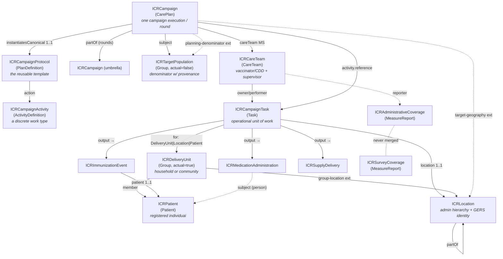
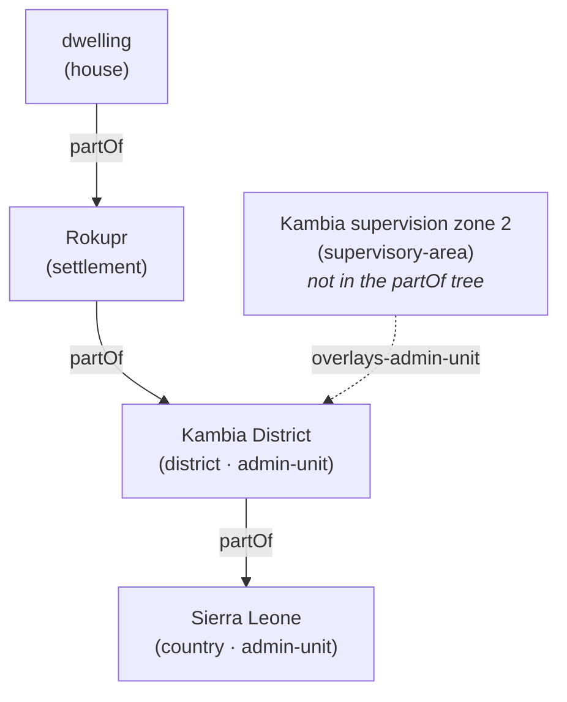
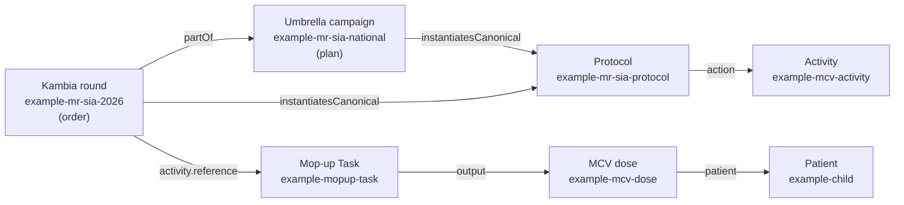

# Integrated Campaign Registry (ICR) FHIR Implementation Guide v0.1 — Summary & Companion
`Companion to ICR IG v0.1.0 · First release for partner review & feedback · Jul 27, 2026`

⁠

> [!note] **This is a draft for feedback, not a final standard.** The open questions and roadmap (§13) are printed deliberately — v0.1 exists to be tested against real campaign data and partner experience, and every design decision here is open to challenge. The published IG lives at [**https://icr.healthcampaigns.org**](https://icr.healthcampaigns.org); please direct feedback to the ICR project team at Ona/UNICEF.

* * *
## Abbreviations & glossary
Quick reference for every abbreviation used in this document, grouped by area. Names in `code font` (e.g. `ICRCampaign`) are FHIR artifacts defined in the IG, not abbreviations.

**Campaign types & public-health programmes**

| Abbrev. | Meaning |
| --- | --- |
| **ICR** | Integrated Campaign Registry — the project and FHIR IG this document describes |
| **SIA** | Supplementary Immunization Activity — a **mass vaccination campaign** (as opposed to routine immunization) |
| **PMVC** | Preventive Mass Vaccination Campaign (e.g. yellow fever) |
| **MDA** | Mass Drug Administration — a campaign giving a drug to a whole eligible population |
| **ITN / LLIN** | Insecticide-Treated Net / Long-Lasting Insecticidal Net (bed-net distribution) |
| **IRS** | Indoor Residual Spraying (anti-malaria) |
| **RI** | Routine Immunization — the everyday schedule (contrast SIA) |
| **EPI** | Expanded Programme on Immunization — the routine-immunization programme |
| **NTD / PC-NTD** | Neglected Tropical Disease / Preventive-Chemotherapy NTD |
| **CDD** | Community Drug Distributor — the front-line MDA worker |
| **CDTI** | Community-Directed Treatment with Ivermectin — the NTD-MDA delivery model |
| **RCM** | Rapid Convenience Monitoring — a quick, non-probability in-campaign check; **pass/fail with a trigger, not a coverage rate** |
| **LQAS** | Lot Quality Assurance Sampling — a small-sample accept/reject decision rule |
| **AEFI** | Adverse Event Following Immunization |
| **DOC** | Directly Observed Consumption — in MDA, the drug is swallowed under supervision |
| **TAS** | Transmission Assessment Survey — an NTD-elimination decision gate |
| **RED** | Reaching Every District — WHO microplanning approach |
| **EYE** | Eliminate Yellow fever Epidemics — WHO strategy |
| **FIP** | Fully Immunized Person |
| **Type A / B / C** | the campaign delivery-model typology — A = fixed/temporary-post session, B = house-to-house, C = community/MDA |

**Vaccines, diseases & product codings**

| Abbrev. | Meaning |
| --- | --- |
| **MR** | Measles–Rubella |
| **MCV** | Measles-Containing Vaccine |
| **OCV** | Oral Cholera Vaccine |
| **YF** | Yellow Fever |
| **HPV** | Human Papillomavirus |
| **bOPV / nOPV2** | bivalent / novel-type-2 Oral Polio Vaccine |
| **CVX** | the US-CDC vaccine-code system (standard vaccine codes) |
| **ATC** | Anatomical Therapeutic Chemical classification — WHO drug codes |
| **GS1 / GTIN** | global commodity-coding standards / Global Trade Item Number |
| **UCUM** | Unified Code for Units of Measure |
| **VVM / WMF** | Vaccine Vial Monitor / Wastage Monitoring Form |

**Geography & identifiers**

| Abbrev. | Meaning |
| --- | --- |
| **GERS** | Global Entity Reference System — Overture Maps' stable place IDs |
| **P-code** | Place code — OCHA humanitarian administrative-area code |
| **OCHA** | UN Office for the Coordination of Humanitarian Affairs |
| **ISO 3166** | the ISO country (-1) and subdivision (-2) code standard |
| **GIS / MFL** | Geographic Information System / Master Facility List |
| **GeoJSON** | a geospatial JSON data format |
| **GPS** | Global Positioning System — a coordinate point |
| **OSM** | OpenStreetMap |
| **PSU / EA** | Primary Sampling Unit / Enumeration Area (survey sampling) |

**FHIR & technical**

| Abbrev. | Meaning |
| --- | --- |
| **FHIR** | Fast Healthcare Interoperability Resources — the HL7 health-data standard |
| **IG** | Implementation Guide — a packaged set of FHIR profiles/rules for one use-case |
| **FSH / SUSHI** | FHIR Shorthand (the authoring language) / its compiler |
| **R4 / R5** | FHIR Release 4 (this IG) / Release 5 |
| **MS** | Must Support — a FHIR conformance flag ("implementations must populate/process this element") |
| **VS / CS** | ValueSet / CodeSystem |
| **CQL** | Clinical Quality Language — decision logic |
| **IPS** | International Patient Summary |
| **SNOMED CT / ICD-11 / LOINC** | clinical terminologies (concepts / diseases / observations) |
| **JSON** | JavaScript Object Notation |
| **FR** | French-language (`fr`) designations on code systems |

**WHO SMART Guidelines, organizations & reporting**

| Abbrev. | Meaning |
| --- | --- |
| **WHO / UNICEF** | World Health Organization / UN Children's Fund |
| **DAK** | Digital Adaptation Kit — WHO SMART-Guidelines content |
| **IMMZ** | the artifact prefix of the WHO SMART Immunizations IG |
| **L1 / L2 / L3** | WHO SMART-Guidelines "levels of knowledge representation" — narrative / semi-structured / machine-readable FHIR |
| **VPD** | Vaccine-Preventable Disease (surveillance) |
| **HMIS / DHIS2** | Health Management Information System / District Health Information Software 2 |
| **JAP** | Joint Appraisal — annual immunization-programme report |
| **ICG** | International Coordinating Group — vaccine-stockpile provision (OCV/YF) |
| **ESPEN** | Expanded Special Project for Elimination of NTDs (WHO-AFRO) |
| **GTFCC** | Global Task Force on Cholera Control |
| **VCQI** | Vaccination Coverage Quality Indicators — survey toolkit |
| **M&E** | Monitoring and Evaluation |
| **mCSD** | Mobile Care Services Discovery — an IHE location-directory profile |
| **CPG / CRMI / SDC** | HL7 frameworks: Clinical Practice Guidelines / Canonical Resource Management Infrastructure / Structured Data Capture |

* * *
## 1. Introduction
### 1.1 What is FHIR?
**FHIR** (Fast Healthcare Interoperability Resources) is the modern standard, published by HL7, for representing and exchanging health data. Instead of bespoke file formats, FHIR defines a library of building blocks called **resources** — `Patient`, `Immunization`, `Location`, `Group`, `CarePlan`, and so on — each a structured object with a defined set of fields. A resource can be serialized as JSON (used throughout this document), exchanged over a standard REST API, and validated against its definition. Because every system speaks the same resource vocabulary, two systems that have never met can still understand each other's data.

This IG uses **FHIR Release 4 (R4, version 4.0.1)** — the most widely deployed release and the one WHO's digital-health guidelines target.
### 1.2 What is an Implementation Guide?
Base FHIR is deliberately generic: `Patient` has to serve a hospital in one country and a vaccination campaign in another, so most fields are optional and loosely typed. An **Implementation Guide (IG)** is how you pin that generality down for one specific use-case. An IG is a published package containing:

- **Profiles** — constrained, specialized versions of base resources (e.g. "a `Location` that *must* carry an administrative hierarchy and a stable place ID"). A profile says which fields are required, which codes are allowed, and what each field means in context.
- **Extensions** — extra fields the base resource lacks, added in a standard, interoperable way.
- **Terminology** — `CodeSystem`s (lists of codes the IG owns) and `ValueSet`s (the codes allowed in a given field).
- **Examples** — concrete instances that show conformant data.
- **Narrative** — pages that explain the design and how to implement it.

An IG turns "FHIR in general" into "FHIR, exactly as this programme needs it" — and makes data from different implementers comparable by construction.

The ICR IG is authored in **FHIR Shorthand (FSH)**, a concise text language for writing profiles, compiled to FHIR JSON by **SUSHI** (the FSH compiler) and rendered to a website by the **IG Publisher**.
### 1.3 Introducing the ICR IG
Health campaigns — measles SIAs, polio rounds, mass drug administration for neglected tropical diseases, bed-net and indoor-spraying campaigns — repeatedly collect the *same* data (who lives where, how many children are eligible, who was reached, what coverage was achieved) and then archive or lock it in a one-off spreadsheet. The next campaign starts from scratch.

The **Integrated Campaign Registry (ICR)** is a FHIR Implementation Guide that gives campaigns a shared, reusable data model, so each campaign's data *compounds* instead of being re-collected. Its scope is the half of immunization-and-delivery work that routine-health systems (and WHO's routine-immunization IG) do **not** model:

- **Campaign architecture** — a reusable protocol, its executions and rounds, the discrete activities, the operational units of work (Tasks), and the teams that carry them out.
- **Population & geography** — denominators with provenance, the actual household/community groups reached, the registered individuals within them, and a rich location model (administrative hierarchy, operational geography, stable cross-campaign place IDs, GeoJSON boundaries).
- **Delivery events** — the vaccine doses, drug administrations, and commodity deliveries, plus the adverse events that follow them. Every one carries a campaign-vs-routine flag, so that when campaign data and routine-programme data live in the same system each is counted in its own statistics — a campaign dose never inflates routine coverage figures, and vice versa.
- **Coverage** — administrative and independently-surveyed coverage as **separate, never-merged lineages** of the same quantity, backed by canonical `Measure` definitions.

ICR is intentionally a **complement** to WHO's SMART Immunizations IG, which is routine-only: a campaign dose and a routine dose can sit in the same store, distinguished by a single `record-origin` flag. ICR positions itself as "the campaign SMART-Guidelines IG" (see §13.3).

The IG covers the major campaign delivery models through one common typology used throughout this document:

- **Type A** — fixed or temporary-post sessions (people come to a post).
- **Type B** — house-to-house delivery (workers go door to door).
- **Type C** — community / MDA delivery (a whole community treated, often register-level).
### 1.4 IG metadata
The package-level settings that fix the IG's identity (all permanent once published, so several are flagged for UNICEF confirmation before v1.0 — see §13.4):

| Field | Value | Notes |
| --- | --- | --- |
| `id` | `unicef.fhir.icr` | NPM-style package id (`<org>.fhir.<scope>` convention) |
| `canonical` | `https://icr.healthcampaigns.org` | Base URL of every profile/extension/CodeSystem/ValueSet; also hosts the provisional identifier-system URIs |
| `name` / `title` | `ICR` / "Integrated Campaign Registry (ICR) Implementation Guide" |     |
| `status` / `version` | `draft` / `0.1.0` |     |
| `fhirVersion` | `4.0.1` | FHIR **R4** |
| `license` | `Apache-2.0` |     |
| `jurisdiction` | UN M49 `001` "World" | Global IG, not country-specific |
| `publisher` | **UNICEF** |     |
| `menu` | Home, Background, Artifacts |     |

The canonical `https://icr.healthcampaigns.org` is the project-controlled domain that actually hosts the published IG — canonicals resolve to the artifacts they name; the same base hosts the provisional geographic-identifier system URIs (§2.4). The toolchain (FSH / SUSHI / IG Publisher) deliberately matches WHO SMART Guidelines practice; a formal `dependsOn smart.who.int.base` dependency is proposed once alignment hardens (§13.3). The IG's one real package dependency to date is `hl7.fhir.uv.sdc` **4.0.0** (HL7 Structured Data Capture), added in the espen-forms round to carry the SDC template-based-extraction extensions the ESPEN MDA instruments use (§4.8).
### 1.5 What the IG contains
| Layer | Count | Artifacts |
| --- | --- | --- |
| **Profiles — campaign architecture** | 4   | ICRCampaignProtocol (PlanDefinition), ICRCampaign (CarePlan), ICRCampaignActivity (ActivityDefinition), ICRCampaignTask (Task) |
| **Profiles — population & geography** | 5   | ICRPatient (Patient — the registered individual), ICRDeliveryUnit (Group — household/community/school-cohort), ICRTargetPopulation (Group — denominator), ICRLocation (Location), ICRFacilityOrganization (Organization — the accountable facility entity, mCSD pairing) |
| **Profiles — delivery events** | 3   | ICRImmunizationEvent (Immunization), ICRMedicationAdministration (MedicationAdministration), ICRSupplyDelivery (SupplyDelivery) |
| **Profiles — coverage** | 2   | ICRAdministrativeCoverage (MeasureReport), ICRSurveyCoverage (MeasureReport) |
| **Profiles — safety & teams** | 3   | ICRAdverseEvent (AdverseEvent — intervention-neutral AEFI/MDA safety), ICRCareTeam (CareTeam), ICRSupervisionReport (QuestionnaireResponse) |
| **Profiles — governance** | 1   | ICRConsent (Consent — person-data governance) |
| **Measures** | 6   | `icr-admin-coverage`, `icr-survey-coverage`, `icr-mda-treatment-coverage`, `icr-geographic-coverage`, and (forms-v1) `icr-zero-dose-coverage`, `icr-campaign-readiness` — the canonical definitions the coverage/readiness MeasureReports instantiate (§7) |
| **Questionnaire / ConceptMap** | 8 / 1 | The two canonical checklists — `icr-mda-supervision-checklist` (the structured supervision checklist, §4.6) and (forms-v1) `icr-campaign-readiness-checklist` (the pre-campaign readiness checklist, §4.7) — plus (espen-forms) six source-faithful ESPEN MDA example instruments `espen-mda-location-registration` / `-drug-receipt` / `-treatment` / `-case-management` / `-supervision-hf` / `-supervision-cdd` (§4.8); `icr-aefi-causality-to-immz` (ICR ↔ WHO IMMZ causality map, §6.5) |
| **Extensions** | 35  | See §10 |
| **CodeSystems** | 25  | See §9 |
| **ValueSets** | 28  | One per code system (mostly), plus purpose-built sets (§9) |
| **Example instances** | 44  | A coherent measles–rubella SIA scenario, an activity gallery, a community-directed MDA scenario, adverse events, team & supervision, (forms-v1) a person-targeted follow-up revisit and a readiness validation, plus (v0.1) a supply-driven descoping trio (§11) |
| **Narrative pages** | 2   | `index.md` (home), `background.md` (design rationale & open questions) |

File map (`ig/input/fsh/`): `aliases.fsh`, `codesystems.fsh`, `valuesets.fsh`, `extensions.fsh`, `profiles-campaign.fsh`, `profiles-population.fsh`, `profiles-delivery.fsh`, `profiles-coverage.fsh`, `profiles-consent.fsh`, `profiles-adverse.fsh`, `profiles-careteam.fsh`, `measures.fsh`, `questionnaires.fsh`, `questionnaires-espen.fsh` (espen-forms), `conceptmaps.fsh`, `examples.fsh`.

**Build:** `sushi build .` compiles FSH → JSON; `./_genonce.sh` renders the IG website (needs Java 17+). The current commit compiles clean (0 errors / 0 warnings).

* * *
## 2. Architecture at a glance
FHIR has no native `Campaign` resource, so ICR builds its campaign layer on the **CarePlan** resource and surrounds it with profiles for population, geography, delivery events, teams, and coverage. The diagram below shows how the pieces connect.


### 2.1 The three layers
The IG reads most easily as three intersecting layers:

- **The operational layer** — `protocol → campaign → task → delivery events`. This is the chain of work: a reusable template (PlanDefinition), instantiated as a specific campaign/round (CarePlan), broken into units of work (Task), each producing concrete delivery events (doses, drug administrations, deliveries).
- **The identity layer** — `Patient` + `Group` + `Location`. *Who* a campaign acts on is kept strictly separate from *where* they live and where work happens. The *who* is a **Group** — in ICR either a **household** (a Type-B house-to-house unit), a **community** (a Type-C MDA unit), or a **school cohort**, modelled by `ICRDeliveryUnit` and enumerating `ICRPatient` individuals — alongside the denominator cohorts modelled by `ICRTargetPopulation`. Keeping who and where apart means a location's stable identity survives changes in the group living there, and vice versa.
- **The analytics layer** — `Measure` + `MeasureReport`. The coverage readout sits to the side, computed from the other two, and deliberately keeps administrative and survey coverage as separate records that are never merged.
### 2.2 The key components
**Campaign architecture (§4)**

- **ICRCampaignProtocol** *(PlanDefinition)* — the reusable, versioned **template** for a campaign type. It says what a "measles–rubella SIA" *is* (products, age bands, activity sequence, coverage goals) once, so every country and round can instantiate the same recipe and stay comparable.
- **ICRCampaign** *(CarePlan)* — **one specific campaign execution or round.** It is the core resource that represents campaigns. It **starts as a microplan and changes into an execution record** as Tasks complete — the same resource, evolving rather than being replaced. National "umbrella" campaigns and their district "rounds" are the same profile, linked by `partOf`.
- **ICRCampaignActivity** *(ActivityDefinition)* — **a discrete work type** within a campaign ("administer MCV", "distribute ITNs", "spray structures"). Campaigns can contain multiple activities. It carries the clinical/commodity content once; thousands of Tasks instantiate it.
- **ICRCampaignTask** *(Task)* — **the assignable, trackable unit of work** — one Task per site-session (**Type A** — people come to a fixed or temporary post) or per household/community visit (**Type B** — workers go house to house; **Type C** — a whole community is treated, often register-level, as in MDA). It is where these three delivery models converge into one profile.
- **ICRCareTeam** *(CareTeam)* — **the delivery team and supervisor model.** Who did the work, who is accountable for a reported number, and (via the workload extension) what area and workload the team was assigned in the microplan. Paired with **ICRSupervisionReport** *(QuestionnaireResponse)*, the structured supervision/QA record.

**Population & geography (§5)**

- **ICRDeliveryUnit** *(Group,* `actual=true`*)* — **the actual group of people a Task acts on** — a household, a community, or a school cohort. The *who*.
- **ICRTargetPopulation** *(Group,* `actual=false`*)* — **a denominator**: a conceptual cohort with a count, eligibility characteristics, and — critically — source and date provenance. Competing estimates for the same place are kept side by side.
- **ICRLocation** *(Location)* — **the place model.** The most-customized ICR resource: nested administrative hierarchy, operational geography that sits *beside* the admin tree, GeoJSON boundaries, and multi-system geospatial identity (GERS, P-codes, national and ISO codes).
- **ICRPatient** *(Patient)* — **the registered individual**: an enumerated household or community member with a stable cross-campaign identifier, mandatory gender and birth date (they drive eligibility and disaggregation), and a required name. Its governance companion is **ICRConsent** *(Consent)*.

**Delivery events & safety (§6)**

- **ICRImmunizationEvent** *(Immunization)* — **a vaccine dose** given in a campaign.
- **ICRMedicationAdministration** *(MedicationAdministration)* — **a drug administration** (MDA), e.g. albendazole, with the dose-pole and directly-observed-consumption patterns.
- **ICRSupplyDelivery** *(SupplyDelivery)* — **a commodity delivery** (bed-nets, drug stock), with a stock-accountability extension for wastage and reconciliation.
- **ICRAdverseEvent** *(AdverseEvent)* — an **intervention-neutral safety event**: it serves AEFI (after a vaccine dose) and MDA pharmacovigilance (after a drug) with one profile.

All delivery events (and the adverse event) carry a mandatory `record-origin` flag (campaign vs routine).

**Coverage (§7)**

- **ICRAdministrativeCoverage** *(MeasureReport)* — coverage computed from the campaign's own tally/delivery data, including the stratified (sex × age band × disposition) treatment cube and implementation-unit ("geographic") coverage.
- **ICRSurveyCoverage** *(MeasureReport)* — coverage measured independently (cluster survey, LQAS, RCM). Structurally prevented from ever being merged with administrative coverage.
- Four canonical **Measure** definitions the reports point at.
### 2.3 Five cross-cutting principles
The full statement of the design invariants is in §8; the five to hold in mind while reading:

1. **Delivery strategy is first-class and coded** — a required binding, mandatory on the protocol (`1..*`) and Task (`1..1`). Strategy is *the* discriminator because it determines which data elements even exist (house-to-house tallies are meaningless at a fixed post).
2. **Record origin is mandatory on every delivery event** (`1..1`) — it differentiates data captured in a campaign from data captured by routine immunization programmes, so the two are never mixed together when coverage is calculated.
3. **Three views of coverage, kept separate and never blended.** A campaign produces three different counts of "how many people were reached": what was *planned* (the target population/denominator), what the campaign's *own records* say it delivered (administrative coverage), and what an *independent survey* later measured (survey coverage). ICR stores these as three separate records and never merges them — because they routinely disagree in reality. For example, a campaign tally may report 99% coverage while a post-campaign coverage survey reports 76%.
4. **Denominator provenance is required on every estimate** — a source code (even a low-precision `govt-estimate`/`unknown`) travels with each denominator, with the estimate date recommended; competing estimates coexist; one is flagged as *the* planning denominator.
5. **Geospatial identity is multi-system, GERS-preferred** — locations can carry multiple identifiers. Operational geography overlays the admin hierarchy rather than pretending to be it.
### 2.4 Aliases & identifier systems
The IG defines aliases (short names) for the external and internal systems it references:

- **External terminologies** — `$CVX` (vaccine codes, `http://hl7.org/fhir/sid/cvx`), `$ATC` (WHO drug codes, `http://www.whocc.no/atc`), `$VaccineCodeVS` (the core FHIR vaccine ValueSet), `$MeasurePopulation` (the HL7 measure-population code system used by coverage examples).
- **ICR geographic-identifier system URIs** *(provisional — to be confirmed before v1.0)*:
  
  - `$GERSId = https://icr.healthcampaigns.org/identifiers/overture-gers` — Overture Maps GERS IDs (the preferred cross-campaign join key).
  - `$PCode = https://icr.healthcampaigns.org/identifiers/pcode` — OCHA P-codes.
  - `$ISO = urn:iso:std:iso:3166` — ISO 3166-1/-2 country & subdivision codes (admin levels 0–3); WHO-aligned.
  - `$NationalAdminCode = https://icr.healthcampaigns.org/identifiers/national-admin-code` — the country/implementer's own admin code, where they don't use a P-code (the per-country base URI is expected to be overridden in implementation).
- **Person-identifier URIs** — `$NationalId` / `$RegistryId`, the sliced systems on `ICRPatient.identifier` (§5.4).
- **ICR code systems** — one alias per CodeSystem (§9).

**Why ICR mints geographic-identifier URIs.** GERS IDs and P-codes need *some* system URI to live under in `Location.identifier`; parking them under the ICR canonical is the pragmatic v0.1 choice. CVX/ATC/GS1 serve as the international product-code backbone, so ICR does not re-invent product codes.

* * *
## 3. How to read the profiles
A **profile** is a constrained, specialized version of a base FHIR resource. The base resource (say `Location`) is general-purpose; a profile (say `ICRLocation`) tightens it for one use-case by doing some combination of:

- **Making optional fields required**, or narrowing how many times a field may appear.
- **Restricting which resource types a reference may point at** (e.g. "`partOf` may only reference another `ICRLocation`").
- **Binding a coded field to a specific ValueSet** so only approved codes are used.
- **Fixing a field to a constant value** (e.g. `actual = false` on a denominator group).
- **Adding extensions** — new fields the base resource doesn't have.

A profile never invents a new resource type; it *layers rules on top of* an existing one. That is what keeps profiled data valid plain FHIR: any FHIR system can read an `ICRLocation` as a `Location`, while ICR-aware systems get the extra guarantees.

**Reading the element tables in §4–§7.** Each profile below has a property table styled after the FHIR resource-content tables (e.g. [build.fhir.org/patient.html](https://build.fhir.org/patient.html)). The columns mean:

- **Element** — the field name (dot-notation for nested fields; `extension[name]` for an added field).
- **Flags** — conformance flags. **MS** = *Must Support*: a conformant implementation must be able to populate and process the element. (Other FHIR flags like `?!` *modifier* don't appear in this IG.)
- **Card.** — *cardinality*, the min..max number of times the element may occur: `1..1` = exactly one (required, single); `0..1` = optional, at most one; `1..*` = at least one (required, repeatable); `0..*` = optional, repeatable.
- **Type / Binding** — the data type or referenced resource, and — for coded fields — the bound ValueSet and its **binding strength**: **required** (must use a code from the set), **extensible** (use one if it fits, otherwise add your own), or a **fixed** value.
- **Description** — what the field carries in ICR.

Profiles or elements labelled **(proposed)** are described for completeness but are not yet committed to the IG.

* * *
## 4. Campaign-architecture profiles
The profiles that model the structure of a campaign: the template (Protocol, §4.1), the execution (Campaign, §4.2), the work types (Activity, §4.3), the units of work (Task, §4.4), the team & supervisor model (CareTeam, §4.5), and the structured supervision record (§4.6).
### 4.1 ICRCampaignProtocol — `PlanDefinition`
**Purpose.** The reusable, version-controlled **template** for a campaign type — what a measles SIA *is* (products, age bands, activity sequence, coverage goals), instantiated when a new campaign is initiated in a country. A country defines "measles–rubella SIA, 9 months–14 years" once, and every district and round instantiates it, which ensures all data collected using this campaign type is consistent.

**Properties.**

| Element | Flags | Card. | Type / Binding | Description |
| --- | --- | --- | --- | --- |
| `status` | MS  |     | code | Lifecycle status of the protocol definition (`draft` / `active` / `retired`). |
| `version` | MS  |     | string | The protocol version — "MR SIA per 2026 guidance" and its 2028 revision are distinct, citable things. |
| `title` | MS  |     | string | Human-readable title of the protocol. |
| `type` | MS  | 1..1 | CodeableConcept, **required** → ICRCampaignTypeVS | **What kind of campaign** this is (`vaccination-sia`, `mda`, `itn-distribution`, `irs`, …). Deliberately disease-agnostic — the disease lives in the execution's `addresses` and the vaccine/drug code. |
| `subject[x]` | MS  |     |     | Target-population definition (age band, eligibility) — "children 9m–14y". |
| `goal` | MS  |     |     | Coverage targets / thresholds every execution inherits (e.g. ≥95% admin coverage). |
| `action` | MS  |     |     | The activity sequence — vaccinate, then mop up — each entry pointing at an ActivityDefinition. |
| `action.definition[x]` | MS  |     | `Canonical(ICRCampaignActivity)` only | The protocol→activity wiring is **enforced**, not just narrated: an action may only point at an ICRCampaignActivity. |
| `extension[deliveryStrategy]` | MS  | 1..* | CodeableConcept, **required** → ICRDeliveryStrategyVS | The delivery strategies this protocol uses — mandatory and repeatable because hybrid strategies are the norm (an MR SIA runs posts, then mops up door-to-door). |

**Example.** `example-mr-sia-protocol` — the recipe card for the scenario's measles–rubella SIA:

```json
{
  "resourceType": "PlanDefinition",
  "id": "example-mr-sia-protocol",
  "meta": {
    "profile": [
      "https://icr.healthcampaigns.org/StructureDefinition/ICRCampaignProtocol"
    ]
  },
  "status": "active",
  "version": "1.0.0",
  "title": "Measles–Rubella SIA — 2026 national guidance",
  "type": {
    "coding": [
      {
        "system": "https://icr.healthcampaigns.org/CodeSystem/icr-campaign-type",
        "code": "vaccination-sia"
      }
    ]
  },
  "extension": [
    {
      "url": "https://icr.healthcampaigns.org/StructureDefinition/delivery-strategy",
      "valueCodeableConcept": {
        "coding": [
          {
            "system": "https://icr.healthcampaigns.org/CodeSystem/icr-delivery-strategy",
            "code": "fixed-post"
          }
        ]
      }
    },
    {
      "url": "https://icr.healthcampaigns.org/StructureDefinition/delivery-strategy",
      "valueCodeableConcept": {
        "coding": [
          {
            "system": "https://icr.healthcampaigns.org/CodeSystem/icr-delivery-strategy",
            "code": "house-to-house"
          }
        ]
      }
    },
    {
      "url": "https://icr.healthcampaigns.org/StructureDefinition/activity-type",
      "valueCodeableConcept": {
        "coding": [
          {
            "system": "https://icr.healthcampaigns.org/CodeSystem/icr-activity-type",
            "code": "follow-up"
          }
        ]
      }
    }
  ],
  "goal": [
    {
      "description": {
        "text": "≥95% administrative coverage in every district, verified by post-campaign survey"
      }
    }
  ],
  "action": [
    {
      "title": "Administer MCV, 9 months–14 years",
      "definitionCanonical": "https://icr.healthcampaigns.org/ActivityDefinition/example-mcv-activity"
    }
  ]
}
```

> The `activity-type` extension (`follow-up`) shown here is **proposed** (§13.2), not yet in the IG.
> 
> **Relevant terminology.**
> 
> - `type` binds to **ICRCampaignTypeVS** (`vaccination-sia`, `mda`, `itn-distribution`, `irs`, `vitamin-a`, `integrated`)
> - the strategy extension binds to **ICRDeliveryStrategyVS** (`fixed-post`, `temporary-post`, `mobile`, `school`, `house-to-house`, `community-directed`).
> 
> Both are required bindings (§9).

**Key observations.**

- **Protocol and execution are separate resources.** The protocol defines a campaign type once; each district or round is a separate execution (§4.2) that links back to it through `instantiatesCanonical` (cardinality `1..1`). Because every execution references the same protocol, "all measles–rubella SIA rounds" is a single query rather than a manual reconciliation. This is what makes campaigns of the same type directly comparable.
- **The protocol carries no geography, dates, or denominator.** Those values are specific to an execution and are held on ICRCampaign (§4.2). The protocol holds only reusable template content: products, delivery strategies, goals, and the activity sequence.
- `type` **is disease-agnostic.** The campaign type (`vaccination-sia`) records the intervention model, not the disease. A measles SIA and a polio SIA are both `vaccination-sia`; they are distinguished by `addresses` (the target Condition) and the vaccine code. Encoding the disease in `type` would duplicate `addresses` and the product code and would enlarge the code list, so disease-specific campaign codes were not added.
- `campaign-type` **and the proposed** `activity-type` **answer two different questions.** `campaign-type` says *what kind of intervention* this is — for example `vaccination-sia`, `mda`, or `irs`. The proposed `activity-type` would say *why this particular round is being run* — for example a routine follow-up campaign versus an emergency outbreak-response campaign. They are kept as two separate fields because the same intervention can be run for different reasons: a measles follow-up campaign and a measles outbreak-response campaign are both `vaccination-sia`, but they target different age groups and are reported separately. Keeping the two apart means each can be searched on its own — "all outbreak-response campaigns" or "all measles campaigns" — without one being tangled up in the other. (`activity-type` is proposed, not yet in the IG; see §13.2.)
- **Age-band eligibility as computable logic (CQL) is deliberately deferred** to a later round; it pairs with the WHO DAK/CQL alignment work (§13.3).
### 4.2 ICRCampaign — `CarePlan`
A **specific campaign execution.** It begins life as a microplan (`intent = plan`) and evolves into the record of the campaign implementation as Tasks complete and coverage accumulates against it — the *same* resource is used to support each phase of the campaign. Rounds are sibling ICRCampaigns under a national "umbrella" campaign via `partOf`, and every execution points back at the one versioned protocol.

> [!note] What "round" means in ICR A **round** is a child ICRCampaign execution (`partOf` the umbrella) with its own period and reporting obligation — the Kambia June round vs the Port Loko July round. The `campaign-round` extension carries only the ordinal (round 1, round 2) for repeated passes of the same campaign (a two-round OCV campaign, NIDs round 2). "Round" is *not* the number of campaigns run on a given model — that is answered by querying the executions of a protocol.

**Lifecycle — in plain terms.** One CarePlan, two stages. It starts as the **plan** (a microplan: `intent = plan`, `status = draft`), then becomes the **record of what actually happened** as the work is done — `intent` changes to `order` and `status` moves `draft → active → completed`, with Tasks and coverage accumulating against that same resource.

`mermaid graph LR PD["ICRCampaignProtocol<br/>(PlanDefinition)<br/>versioned recipe"] U["Umbrella ICRCampaign<br/>intent: plan · status: active<br/>subject: national denominator"] R1["Kambia round<br/>intent: order · status: completed<br/>subject: district denominator"] R2["Port Loko round<br/>intent: order · status: active"] T["ICRCampaignTask(s)<br/>→ delivery events"] PD -- "instantiatesCanonical 1..1" --> U PD -- "instantiatesCanonical 1..1" --> R1 PD -- "instantiatesCanonical 1..1" --> R2 R1 -- "partOf" --> U R2 -- "partOf" --> U R1 -- "activity.reference" --> T R2 -- "activity.reference" --> T`

The campaign umbrella (representing the microplan) stays `intent = plan` — it is the planning shell holding the national denominator and binding the rounds together; each round goes `plan → order` as it executes. Because every box points at the **same** protocol, "all MR SIA rounds, anywhere" is one query.

**Who vs where.**

Each CarePlan has exactly **one** `subject` — the *who*, an ICRTargetPopulation ("children 9m–14y, Kambia, 48,250").

The *where* is separate and plural: `targetGeography` is `0..*`. Multiple and nested populations are carried by the umbrella/round structure, not by overloading one CarePlan.


**Properties.**

| Element | Flags | Card. | Type / Binding | Description |
| --- | --- | --- | --- | --- |
| `instantiatesCanonical` | MS  | 1..1 | `Canonical(ICRCampaignProtocol)` only | The protocol this campaign executes. `1..1` is a forcing function — every campaign, even ad-hoc, authors a protocol first. |
| `status` | MS  |     |     | `draft → active → completed`. |
| `intent` | MS  |     |     | `plan` (microplan) transitioning to `order` (execution) — the lifecycle dial. |
| `category` | MS  | 1..* | CodeableConcept, **required** → ICRCampaignTypeVS | The campaign type(s), echoing the protocol's `type`. |
| `subject` | MS  |     | `Reference(ICRTargetPopulation)` only | The single denominator (the *who*) — makes the denominator a first-class participant, not an afterthought. |
| `period` | MS  | 1..1 | Period | Campaign/round dates. |
| `careTeam` | MS  |     | `Reference(ICRCareTeam)` | The team(s) running the campaign — see ICRCareTeam (§4.5). |
| `addresses` | MS  |     | `Reference(Condition)` | The disease/condition targeted (where the specific disease lives, since `type` is disease-agnostic). |
| `partOf` |     |     | `Reference(ICRCampaign)` only | The umbrella/round pattern — a round is `partOf` its umbrella. |
| `activity` | MS  |     | `activity.reference` → `Reference(ICRCampaignTask)` only | The round's Tasks. Inline activities (`activity.detail`) are out — the work is always a referenced Task. |
| `extension[campaignRound]` | MS  | 0..1 | positiveInt | Which round this is. |
| `extension[targetGeography]` | MS  | 0..* | `Reference(ICRLocation)` | The *where* — plural, since one campaign may name several geographies. |
| `extension[planningDenominator]` | MS  | 0..1 | `Reference(ICRTargetPopulation)` | Singles out *which* estimate is THE denominator coverage is computed against, when several compete. |
| `extension[dataLineage]` | MS  | 0..1 | code, **required** → ICRDataLineageVS | Realtime vs reconciled — the live in-field stream vs the corrected close-out figures; see the worked example in §7.2 (default: absent ⇒ realtime). |
| `extension[socialMobilization]` | MS  | 0..1 | complex: `populationInformed` (boolean) + `channel` 0..* (CodeableConcept, **extensible** → ICRCommunicationChannelVS) | The demand/mobilization record — was the population informed, and through which channels (radio, town criers, community leaders, …). |

**Example — national umbrella (the microplan shell):**

```json
{
  "resourceType": "CarePlan",
  "id": "example-mr-sia-national",
  "meta": {
    "profile": [
      "https://icr.healthcampaigns.org/StructureDefinition/ICRCampaign"
    ]
  },
  "instantiatesCanonical": [
    "https://icr.healthcampaigns.org/PlanDefinition/example-mr-sia-protocol"
  ],
  "status": "active",
  "intent": "plan",
  "category": [
    {
      "coding": [
        {
          "system": "https://icr.healthcampaigns.org/CodeSystem/icr-campaign-type",
          "code": "vaccination-sia"
        }
      ]
    }
  ],
  "subject": {
    "reference": "Group/example-target-population-national"
  },
  "period": {
    "start": "2026-06-15",
    "end": "2026-12-18"
  },
  "addresses": [
    {
      "display": "Measles and rubella"
    }
  ],
  "extension": [
    {
      "url": "https://icr.healthcampaigns.org/StructureDefinition/planning-denominator",
      "valueReference": {
        "reference": "Group/example-target-population-national"
      }
    }
  ]
}
```

**Example — the Kambia June round (a child execution of that umbrella):**

```json
{
  "resourceType": "CarePlan",
  "id": "example-mr-sia-2026",
  "meta": {
    "profile": [
      "https://icr.healthcampaigns.org/StructureDefinition/ICRCampaign"
    ]
  },
  "instantiatesCanonical": [
    "https://icr.healthcampaigns.org/PlanDefinition/example-mr-sia-protocol"
  ],
  "status": "completed",
  "intent": "order",
  "category": [
    {
      "coding": [
        {
          "system": "https://icr.healthcampaigns.org/CodeSystem/icr-campaign-type",
          "code": "vaccination-sia"
        }
      ]
    }
  ],
  "subject": {
    "reference": "Group/example-target-population"
  },
  "period": {
    "start": "2026-06-15",
    "end": "2026-06-26"
  },
  "partOf": [
    {
      "reference": "CarePlan/example-mr-sia-national"
    }
  ],
  "addresses": [
    {
      "display": "Measles and rubella"
    }
  ],
  "activity": [
    {
      "reference": {
        "reference": "Task/example-site-session-task"
      }
    },
    {
      "reference": {
        "reference": "Task/example-mopup-task"
      }
    }
  ],
  "extension": [
    {
      "url": "https://icr.healthcampaigns.org/StructureDefinition/campaign-round",
      "valuePositiveInt": 1
    },
    {
      "url": "https://icr.healthcampaigns.org/StructureDefinition/target-geography",
      "valueReference": {
        "reference": "Location/example-district"
      }
    },
    {
      "url": "https://icr.healthcampaigns.org/StructureDefinition/planning-denominator",
      "valueReference": {
        "reference": "Group/example-target-population"
      }
    },
    {
      "url": "https://icr.healthcampaigns.org/StructureDefinition/social-mobilization",
      "extension": [
        {
          "url": "populationInformed",
          "valueBoolean": true
        },
        {
          "url": "channel",
          "valueCodeableConcept": {
            "coding": [
              {
                "system": "https://icr.healthcampaigns.org/CodeSystem/icr-communication-channel",
                "code": "radio"
              }
            ]
          }
        },
        {
          "url": "channel",
          "valueCodeableConcept": {
            "coding": [
              {
                "system": "https://icr.healthcampaigns.org/CodeSystem/icr-communication-channel",
                "code": "community-leaders"
              }
            ]
          }
        }
      ]
    }
  ]
}
```

Reading the links out: `instantiatesCanonical` (**1..1**) makes both campaigns point at the one protocol in §4.1. `intent` is the lifecycle dial — the umbrella stays `plan`, the round is `order` (executing). `subject` is the *who* — each scope has its own ICRTargetPopulation denominator Group (national 2,150,000 vs Kambia 48,250; §5.2): different numbers from different sources, *not* a partition of one total. `partOf` makes the round a child of the umbrella. `activity.reference` lists the round's Tasks (§4.4). The extensions carry exactly what the protocol omits: which `campaign-round` this is, the `target-geography` (the *where*, `0..*` — here the district Location, §5.3), the `planning-denominator` that singles out *the* denominator coverage is computed against, and the `social-mobilization` record for the round. (`addresses` is R4 `Reference(Condition)` — shown here as a display-only reference because the scenario ships no Condition instance; in production it would point at a Condition coded to SNOMED CT / ICD-11, which is where the specific disease lives since campaign `type` is deliberately disease-agnostic.)

**Key observations.**

- **Planned and executed states are the same resource at different lifecycle stages, not two resources.** The microplan and the execution record are one CarePlan at different `intent` values. The planned figure is retained in the `planningDenominator` extension, and the planned-versus-actual audit trail is provided by FHIR resource history and Provenance. ICR does not create a separate planning-snapshot Group.
- **The number of CarePlans is determined by reporting scopes, not administrative boundaries — and never by sub-area disaggregation.** Each CarePlan has exactly one `subject` (denominator) but `targetGeography` is `0..*`. The default is **one CarePlan at the reporting scope**: the highest level that carries the campaign's global target — typically the district round — with `subject` that scope's denominator. Operational sub-units (wards, health facilities, communities) sit *under* it through the Location hierarchy (`partOf`) and their own geography-scoped ICRTargetPopulation estimates; their estimates and coverage remain fully queryable per area, but they are referenced, never subjects — a district with hundreds of communities is still **one** campaign resource. Child CarePlans under an umbrella (`partOf`) are reserved for genuine sub-rounds that carry their own period or reporting obligation (district rounds reporting independently under a national umbrella), not for levels of denominator disaggregation. The rule is one CarePlan per reporting scope — not per administrative area, and not per level of the population-estimate hierarchy.
- **Nested scopes do not sum to their parent.** A district denominator and the national total are produced by different sources and methods (national 2,150,000 census projection versus Kambia 48,250 GRID3), so they can legitimately differ. The `partOf` relationship is conceptual nesting, not arithmetic aggregation.
- **The umbrella is itself an ICRCampaign**, so it carries its own national denominator, `category`, and `period`.
- `instantiatesCanonical 1..1` **has a designed relief valve.** If the requirement ever proves too strict for emergency campaigns, the fallback is to relax it to `0..1` with a flag — but the forcing function (every campaign authors a protocol first) is deliberate.
### 4.3 ICRCampaignActivity — `ActivityDefinition`
A **CampaignActivity** is a discrete **activity** within a campaign. For example:

- Administer albendazole to children 5–14
- Distribute ITNs to households
- Spray a structure

CampaignActivities are instantiated as ICRCampaignTask resources. The Activity defines the intervention — product and dosage — **once**, which is then used to create thousands of identical Tasks under it without repeating clinical content. CampaignActivities are also deliberately **target-agnostic**: they define *what* to do and at most the *kind* of eligible target, but never the specific household or community to act on.

**Properties.**

| Element | Flags | Card. | Type / Binding | Description |
| --- | --- | --- | --- | --- |
| `status` | MS  |     | code | Lifecycle status of the definition — one of `draft` / `active` / `retired` / `unknown`. |
| `kind` |     |     | fixed `#Task` | Fixes what instantiation produces: this activity always turns into ICRCampaignTask work items (and never any other FHIR request type — e.g. ServiceRequest, for FHIR-literate readers). |
| `code` | MS  | 1..1 | CodeableConcept | The intervention: vaccinate / treat / distribute / spray. |
| `product[x]` | MS  |     | (unbound — CVX/ATC/GS1 by convention) | The product: vaccine (CVX), drug (ATC), or commodity (GS1). |
| `dosage` | MS  |     | Dosage | Where applicable; dose-pole logic references an Observation. |
| `extension[deliveryStrategy]` | MS  | 0..1 | CodeableConcept, **required** → ICRDeliveryStrategyVS | Optional pin for strategy-intrinsic activities; inheritance from the protocol is the default, and the Task's 1..1 value is authoritative. |

**Example.** `example-mcv-activity` — the activity the protocol's `action` points at:

```json
{
  "resourceType": "ActivityDefinition",
  "id": "example-mcv-activity",
  "meta": {
    "profile": [
      "https://icr.healthcampaigns.org/StructureDefinition/ICRCampaignActivity"
    ]
  },
  "status": "active",
  "name": "AdministerMCV",
  "title": "Administer MCV, 9 months–14 years",
  "kind": "Task",
  "code": {
    "text": "Vaccinate — measles–rubella–containing vaccine"
  },
  "productCodeableConcept": {
    "coding": [
      {
        "system": "http://hl7.org/fhir/sid/cvx",
        "code": "05",
        "display": "measles virus vaccine"
      }
    ]
  },
  "dosage": [
    {
      "route": {
        "text": "subcutaneous"
      },
      "doseAndRate": [
        {
          "doseQuantity": {
            "value": 0.5,
            "unit": "mL",
            "system": "http://unitsofmeasure.org",
            "code": "mL"
          }
        }
      ]
    }
  ],
  "extension": [
    {
      "url": "https://icr.healthcampaigns.org/StructureDefinition/delivery-strategy",
      "valueCodeableConcept": {
        "coding": [
          {
            "system": "https://icr.healthcampaigns.org/CodeSystem/icr-delivery-strategy",
            "code": "fixed-post"
          }
        ]
      }
    }
  ]
}
```

**The activity gallery.** Four ActivityDefinitions ship, spanning the campaign types — each says only WHAT, never which concrete target:

| Instance | Intervention | Product | Dosage / rule |
| --- | --- | --- | --- |
| `example-mcv-activity` | Vaccinate (Type A/B) | CVX `05` measles virus vaccine | 0.5 mL subcutaneous, single dose |
| `example-albendazole-activity` | Treat (Type C MDA) | ATC `P02CA03` albendazole | 400 mg single dose; tablet count by **dose-pole height band** |
| `example-itn-activity` | Distribute (Type B→A) | LLIN (free-text pending GS1) | 1 net per 2 household members |
| `example-irs-activity` | Spray (Type B) | Pirimiphos-methyl 300CS | per eligible structure — expressed as units per structure (e.g. sachets/bottles per structure); per-house insecticide quantity rides `Task.output` |

**Key observations.**

- **The activity defines the work type; the Task defines the concrete target.** The ActivityDefinition holds the intervention, product, and dosage rule, and at most the *kind* of eligible target. The specific thing acted on — a particular household, structure, or session — is set on each Task. A "spray" Task targets a structure (Location); a "vaccinate" Task targets a household (Group), with per-person detail recorded in the delivery events.
- `kind` **is fixed to** `#Task`**.** Instantiating an activity produces an ICRCampaignTask, not a ServiceRequest. This fixes how activities are turned into units of work.
- `product[x]` **is Must Support but has no binding.** The delivery-event profiles bind product codes (CVX/ATC); binding the definition side as well, for consistency, is a possible refinement.
- **Delivery strategy: the protocol is the menu, the Task is the choice, the activity is an optional pin.** The protocol lists every strategy the campaign uses (`1..*`; hybrids are the norm) and each Task records the strategy actually used (`1..1`) — inheritance from the protocol is the default. The activity-level slot (`0..1`) exists only for activities whose strategy is intrinsic to them (a mop-up activity is inherently house-to-house); pinning it there prevents Tasks being generated under the wrong mode.
- **Vector-control work (traps, larviciding) is outside the v0.1 programme scope** and has no delivery-event profile; whether entomological surveillance enters ICR's future scope is an open decision (§13.4).
### 4.4 ICRCampaignTask — `Task`
The assignable, trackable **operational unit of work** — one Task per site-session (Type A) or per household/community visit (Type B/C). This is where the three delivery models **all use one and the same profile**: the *same* `ICRCampaignTask` serves a fixed-post session and a house-to-house visit, told apart by what it targets and the mandatory coded delivery strategy. Tasks may be pre-planned from the microplan or field-registered on discovery.

**Two reference roles —** `for` **vs** `focus`**.** The unit being **targeted** (household, community, or a person for follow-up) is carried by `Task.for`. `Task.focus` is reserved for **workflow lineage** — the CarePlan, activity, or prior Task this work derives from. This split keeps "what we acted on" and "where this work came from" separate and queryable.

**Properties.**

| Element | Flags | Card. | Type / Binding | Description |
| --- | --- | --- | --- | --- |
| `status` | MS  |     |     | `requested → in-progress → completed / failed`. |
| `intent` | MS  |     | code | Base-resource boilerplate: R4 Task requires the element; ICR adds no semantics beyond `order` for executing work (mirroring the CarePlan's plan→order dial). |
| `owner` | MS  |     | `Reference(ICRCareTeam)` only | The team that owns/performs the work — a real reference to an ICRCareTeam (§4.5), not a display string, so "who worked this" is a query. |
| `executionPeriod` | MS  |     | Period | When the work was carried out. |
| `code` | MS  | 1..1 | CodeableConcept | What the Task is. |
| {==`for`==}{>>We currently have some outstanding tension around the roles of `for`, `focus`, and `location`. Here is my current understanding of the way to smooth out this tension, though it could change as I get more comfortable with the IG:<br>- `for`: Exclude from ICR IG. FHIR intends this to be used to track the beneficiary, but this is already done via ICRTargetPopulation. If this is insufficient, bring back `for` here and use to track beneficiaries.<br>- `focus`: Use this to track the unit being targeted (ie., the summary document's current description of `for`). FHIR confirms that can track a location, person, etc. (https://hl7.org/fhir/R4/task-definitions.html#Task.focus)<br>- `basedOn`: Tracks workflow lineage (ie., the summary document's current description of `focus`). <br>- `location`: Tracks the specific physical location where the work occurred. At first this feels redundant with focus, but consider the scenario where focus = a specific person. In that situation you would need to track the physical location separately. Additionally, I've noted elsewhere that the IG treats communities and settlements as distinct concepts--communities are groups of people, settlements are the geographic locations where people live. Keeping those separate further emphasizes the need for both `focus` and `location`.<<}{id="c6" by="mckinnoj" at="2026-08-10T12:47:36.747Z"} | MS  | 1..1 | `Reference(ICRDeliveryUnit \| ICRLocation \| Patient)` | {==The unit being **targeted**: a household/community delivery-unit Group (Type B/C), the site Location (Type A), or a Patient for person-targeted follow-up.==}{>>This will probably drop out once we address the bigger point about tracing lineage, but for now just confirming that this documents summary of for and focus is out of sync with the IG. The IG has 'focus => What the task acts on: household/community delivery-unit Group (Type B/C — the norm) or site Location (Type A); a Patient only for person-targeted follow-up tasks' and nothing tracking lineage.<<}{id="c7" by="mckinnoj" at="2026-08-10T16:04:20.775Z"} |
| {==`focus`==}{>>Need to check if this can also be on a person of if it's just a location.<<}{id="c1" by="mberg" at="2026-08-06T14:48:48.514Z"}{>>This does not point back to the careplan in the actual IG.  But we need this concept too.  More of a partof?<<}{id="c2" by="mberg" at="2026-08-06T14:56:30.275Z" re="c1"}{>>partOf makes sense, and would be consistent with using CarePlan.partOf to link campaign rounds to umbrella campaigns. However, it appears that Task.partOf can only link to other Tasks, which would make it impossible to use this field for this purpose (https://hl7.org/fhir/R4/task-definitions.html#Task.partOf)<<}{id="c4" by="mckinnoj" at="2026-08-10T12:25:06.245Z" re="c2"}{>>The other lineage field that could fill this role would be basedOn, which can point to any resource.<<}{id="c5" by="mckinnoj" at="2026-08-10T12:30:58.000Z" re="c4"} | MS  |     | `Reference(CarePlan \| ActivityDefinition \| ServiceRequest \| Task)` | **Workflow lineage**: the campaign/activity this work instantiates, or the prior Task it follows (e.g. a mop-up Task following the session Task that missed a child). |
| `reasonCode` | MS  |     | CodeableConcept | The disease/programme this Task serves — used to scope a Task to a disease where one community Task covers several concurrent programmes. |
| {==`location`==}{>>This is duplicative of the IG I think<<}{id="c3" by="mberg" at="2026-08-06T14:57:49.241Z"} | MS  | 1..1 | `Reference(ICRLocation)` only | Where the work happened. |
| `output` | MS  |     |     | References to Immunization / MedicationAdministration / SupplyDelivery, or aggregate counts. |
| `extension[deliveryStrategy]` | MS  | 1..1 | CodeableConcept, **required** → ICRDeliveryStrategyVS | The strategy this Task runs under — mandatory, since it determines which other fields apply. |
| `extension[taskOrigin]` | MS  | 1..1 | code, **required** → ICRTaskOriginVS (`pre-planned` \| `field-registered`) | Whether the Task was pre-generated from the microplan or created in the field on discovery. |
| `extension[housesVisited]` |     | 0..1 | unsignedInt | (Type B) houses visited on the round. |
| `extension[eligiblePresent]` |     | 0..1 | unsignedInt | (Type B) eligible people present. |
| `extension[eligibleAbsent]` |     | 0..1 | unsignedInt | (Type B) eligible people absent. |
| `extension[missedReason]` |     | 0..* | CodeableConcept, **extensible** → ICRMissedReasonVS | Why eligible people were missed — person-level reasons (absent, sleeping, refusal) and area-level reasons (insecurity, medication shortage, difficult access). |
| `extension[noncomplianceReason]` |     | 0..* | CodeableConcept, **extensible** → ICRNoncomplianceReasonVS | Why a household/person declined. |
| `extension[exclusionReason]` |     | 0..* | CodeableConcept, **extensible** → ICRExclusionReasonVS | **Present but contraindicated** — under height/age, pregnant, breastfeeding, acute illness. Deliberately distinct from *missed* (not reached) and *noncompliance* (declined). |
| `extension[fingerMarked]` |     | 0..1 | boolean | (Type B) the in-field "already covered" marker. |
| `extension[revisitOutcome]` *(forms-v1)* |     | 0..1 | CodeableConcept, **extensible** → ICRRevisitOutcomeVS | On a **person-targeted follow-up** Task (`focus` = the missed Patient, `partOf` = the originating Task): the outcome of the revisit — `already-vaccinated` \| `vaccinated-on-revisit` \| `still-missing`. |
| `extension[dataLineage]` |     | 0..1 | code, **required** → ICRDataLineageVS | Realtime vs reconciled. |

**Example.** `example-mopup-task` — the Type-B house-to-house visit, the richer Task shape, which chains to a delivery event:

```json
{
  "resourceType": "Task",
  "id": "example-mopup-task",
  "meta": {
    "profile": [
      "https://icr.healthcampaigns.org/StructureDefinition/ICRCampaignTask"
    ]
  },
  "status": "completed",
  "intent": "order",
  "code": {
    "text": "Administer MCV — house-to-house mop-up visit"
  },
  "for": {
    "reference": "Group/example-household"
  },
  "focus": {
    "reference": "CarePlan/example-mr-sia-2026"
  },
  "location": {
    "reference": "Location/example-dwelling"
  },
  "executionPeriod": {
    "start": "2026-06-24",
    "end": "2026-06-24"
  },
  "owner": {
    "reference": "CareTeam/example-careteam"
  },
  "output": [
    {
      "type": {
        "text": "Immunization administered"
      },
      "valueReference": {
        "reference": "Immunization/example-mcv-dose"
      }
    }
  ],
  "extension": [
    {
      "url": "https://icr.healthcampaigns.org/StructureDefinition/delivery-strategy",
      "valueCodeableConcept": {
        "coding": [
          {
            "system": "https://icr.healthcampaigns.org/CodeSystem/icr-delivery-strategy",
            "code": "house-to-house"
          }
        ]
      }
    },
    {
      "url": "https://icr.healthcampaigns.org/StructureDefinition/task-origin",
      "valueCode": "field-registered"
    },
    {
      "url": "https://icr.healthcampaigns.org/StructureDefinition/eligible-present",
      "valueUnsignedInt": 2
    },
    {
      "url": "https://icr.healthcampaigns.org/StructureDefinition/eligible-absent",
      "valueUnsignedInt": 1
    },
    {
      "url": "https://icr.healthcampaigns.org/StructureDefinition/missed-reason",
      "valueCodeableConcept": {
        "coding": [
          {
            "system": "https://icr.healthcampaigns.org/CodeSystem/icr-missed-reason",
            "code": "absent"
          }
        ]
      }
    },
    {
      "url": "https://icr.healthcampaigns.org/StructureDefinition/finger-marked",
      "valueBoolean": true
    }
  ]
}
```

Reading the links out: `for` points at the **household delivery-unit Group** (§5.1) — the Type-B target (a Type-A site-session Task instead has `for` = the fixed-post Location); `focus` carries the **workflow lineage**, here the round CarePlan (§4.2), so the dose traces back to the campaign that ordered it; `location` is where the work happened (the dwelling, §5.3); `owner` references the CareTeam that worked the visit (§4.5). `output` is the **whole Task→event mechanism** — it references the `Immunization` in §6.1 (R4 Immunization has no `basedOn`, so the link runs this way). The mandatory coded extensions are `delivery-strategy` (1..1) and `task-origin` — here `field-registered`, the discovery-mode pattern: this household wasn't in the microplan; the team created it and its Task on the doorstep. The house-to-house tally extensions (`eligible-present` 2 / `eligible-absent` 1, `missed-reason absent`, `finger-marked`) only exist for strategy B — they would be meaningless on a fixed-post session.

**Key observations.**

- **One Task per visit; person-level detail is held in the delivery events.** A doorstep visit is a single Task, closed when the visit completes. Each person vaccinated is recorded as a separate `Immunization` referenced from `Task.output` and pointing at that person's `Patient`. The Task is the unit of work (one visit); the delivery events are the units of service (the doses given). The same pattern serves the community scale: containment runs on the Location axis (a household's dwelling is `partOf` the community's settlement, §5.1), so community → household → person stays queryable without nesting Groups.
- **Person-targeted Tasks are used only for follow-up.** When a specific missed or zero-dose individual must be traced, a new Task is created whose `for` is that person's `Patient`, with `focus` referencing the originating Task that missed them. This is the only intended person-targeted Task. Creating a Task per person for routine delivery would multiply Task volume roughly fivefold without recording anything the Immunization records do not already carry.
- **The count and reason extensions apply mainly to Type B.** Houses visited, eligible present/absent, and finger-marking have no meaning for a fixed-post tally, so they are optional (`0..x`) and populated only for house-to-house work. The reason axes are deliberately three: `missed-reason` (not reached — including area-level causes such as insecurity), `noncompliance-reason` (reached but declined), and `exclusion-reason` (reached and willing but contraindicated).
- `task-origin` **is mandatory because the value is itself a measurement.** A team that finds an unenumerated household creates the delivery unit and its Task in the field (`field-registered`). The count of field-registered Tasks per area measures how incomplete the microplan's enumeration was, which informs the next round's denominators.
- **Delivery events are linked from** `Task.output`**.** R4 `Immunization` has no `basedOn` element, so there is no reverse link from event to Task. The link is therefore directed Task → event (§6).
- **Disaggregation (recommended pattern).** The count extensions are single visit-level totals and must not be multiplied to express age/sex breakdowns. Disaggregate in one of two ways: (a) emit one `Task.output` entry per stratum, each with a coded `type` for the age band/sex; or (b) where person-level data exists, derive the breakdown from the individual Immunization/MedicationAdministration records, which already carry age and sex. The same rule applies to reasons: Task-level `missed-reason`/`noncompliance-reason` aggregate over the whole visit, so per-person reasons require person-level records. For multi-dimensional aggregate tallies (drug × sex × age band), the canonical home is a stratified MeasureReport (§7.3).

**Open questions.**

- **Granularity at scale is the IG's #1 open question** — one Task per household across a national campaign is millions of Tasks. The profile keeps both household-level and site-level paths open, and field-registration (lazy Task creation) softens the worst case, but pilots must exercise the household-level path.
- `output.valueReference` is not yet structurally constrained to the three delivery-event profiles (the description says it; the profile doesn't enforce it).
- `task-origin 1..1` means historical imports must assign an origin — acceptable as a forcing function, or add an `unknown` code for back-loaded datasets (§13.4).
### 4.5 ICRCareTeam — `CareTeam` (the team & supervisor model)
**Purpose.** The campaign delivery team — the vaccinators / CDDs who do the work and the **supervisor** who oversees them and very often files the report. It answers two operational questions every supervisor asks: *who worked this area*, and *who is accountable for this reported number*. The team is referenced from `ICRCampaign.careTeam` (the campaign roster) and from `Task.owner`/`Task.performer` (the team that worked a given Task), and the supervisor surfaces again as the `MeasureReport.reporter` on rolled-up coverage (§7) and typically owns the **supervisory-area** Location (§5.3). With the workload extension, the CareTeam is also the typed **team–area–workload** unit of the microplan (the ICRCampaign with `intent = plan` being the microplan itself).

**Properties.**

| Element | Flags | Card. | Type / Binding | Description |
| --- | --- | --- | --- | --- |
| `status` | MS  |     | code (base CareTeam status) | `proposed → active → inactive` (FHIR CareTeam status values). |
| `name` | MS  |     |     | Human-readable team label — the target of `Task.owner`. |
| `subject` | MS  |     | `Reference(ICRTargetPopulation)` | The campaign/population the team serves. |
| `participant` | MS  | 1..* |     | The members. |
| `participant.role` | MS  | 1..1 | CodeableConcept, **extensible** → ICRTeamRoleVS | `vaccinator` \| `cdd` \| `supervisor` \| `social-mobilizer` \| `recorder`. |
| `participant.member` | MS  |     | `Reference(Practitioner \| PractitionerRole \| RelatedPerson)` | The CDD/vaccinator/supervisor; a community volunteer is a RelatedPerson. |
| `managingOrganization` | MS  |     | `Reference(Organization)` | The implementing partner / district health office. |
| `extension[overseesArea]` | MS  | 0..* | `Reference(ICRLocation)` | The supervisory-area(s) this team's supervisor covers, tying CareTeam to operational geography (§5.3). |
| `extension[workloadTarget]` | MS  | 0..1 | complex: `targetArea` (Reference(ICRLocation) 0..*) + `targetPopulation` / `targetHouseholds` / `targetDays` (unsignedInt) | The microplan workload assigned to this team — area(s) plus expected population, households, and days. |

**Example.** `example-careteam` — CDD team 7 and its supervisor:

```json
{
  "resourceType": "CareTeam",
  "id": "example-careteam",
  "meta": {
    "profile": [
      "https://icr.healthcampaigns.org/StructureDefinition/ICRCareTeam"
    ]
  },
  "status": "active",
  "name": "CDD team 7, Rokupr",
  "subject": {
    "reference": "Group/example-target-population"
  },
  "participant": [
    {
      "role": [
        {
          "coding": [
            {
              "system": "https://icr.healthcampaigns.org/CodeSystem/icr-team-role",
              "code": "vaccinator"
            }
          ]
        }
      ],
      "member": {
        "display": "Fatmata Sesay (vaccinator)"
      }
    },
    {
      "role": [
        {
          "coding": [
            {
              "system": "https://icr.healthcampaigns.org/CodeSystem/icr-team-role",
              "code": "supervisor"
            }
          ]
        }
      ],
      "member": {
        "display": "Ibrahim Conteh (supervisor)"
      }
    }
  ],
  "managingOrganization": [
    {
      "display": "Kambia District Health Management Team"
    }
  ],
  "extension": [
    {
      "url": "https://icr.healthcampaigns.org/StructureDefinition/oversees-area",
      "valueReference": {
        "reference": "Location/example-supervisory-area"
      }
    },
    {
      "url": "https://icr.healthcampaigns.org/StructureDefinition/workload-target",
      "extension": [
        {
          "url": "targetArea",
          "valueReference": {
            "reference": "Location/example-supervisory-area"
          }
        },
        {
          "url": "targetPopulation",
          "valueUnsignedInt": 3200
        },
        {
          "url": "targetHouseholds",
          "valueUnsignedInt": 640
        },
        {
          "url": "targetDays",
          "valueUnsignedInt": 5
        }
      ]
    }
  ]
}
```

(The members are shown display-only because the scenario ships no Practitioner instances yet; in production they would reference `Practitioner`/`PractitionerRole` records.)

**Key observations.**

- **The supervisor role is central.** A supervisor is both a delivery actor and, frequently, the person who reports results. Because `Task.owner` is a real `Reference(ICRCareTeam)`, "who carried out this visit" is a query. With the `oversees-area` extension and `MeasureReport.reporter` required (`1..1`) on both coverage profiles, "who reported this figure, and which area do they cover" is answerable end to end.
- **The CareTeam carries the microplan's workload assignment.** The `workload-target` extension records the team's assigned area and expected population/households/days — the team-level content of a microplan — while the microplan as a whole is the campaign CarePlan at `intent = plan`. A standalone microplan resource remains a candidate for a later round (§13.2).
### 4.6 ICRSupervisionReport — `QuestionnaireResponse`
**Purpose.** A **structured supervision-visit / QA record** — the in-campaign checks a supervisor performs at a health facility or while observing a CDD at work (drawn from the ESPEN MDA supervision forms). It is a `QuestionnaireResponse` against the shipped `icr-mda-supervision-checklist` `Questionnaire`, so each checklist answer (supplies present, directly-observed consumption observed, height chart used correctly, stock concordance, population informed, channels used, …) links to a defined, coded question rather than free text.

**Properties.**

| Element | Flags | Card. | Type / Binding | Description |
| --- | --- | --- | --- | --- |
| `questionnaire` | MS  | 1..1 | canonical | The supervision checklist this answers — `icr-mda-supervision-checklist`. |
| `status` | MS  |     | code | `in-progress` / `completed` / etc. |
| `subject` | MS  |     | `Reference(ICRDeliveryUnit \| ICRLocation)` | The supervised community/household or settlement/area. |
| `authored` | MS  |     | dateTime | When the supervision visit was recorded. |
| `author` | MS  |     | `Reference(Practitioner \| PractitionerRole \| Organization)` | The supervisor or supervising organization. (`QuestionnaireResponse.author` cannot be a CareTeam; the team is reached via the supervisor's PractitionerRole or `Task.owner`.) |
| `item` | MS  |     |     | One answered checklist item per question (`linkId` → answer). |

The shipped Questionnaire groups its items into four sections — **supplies**, **CDD observation**, **stock**, and **social mobilization** — with coded `linkId`s. `example-supervision-report` records a CDD observation: DOC observed ✓, height chart used correctly ✓, ineligibles identified ✓, stock concordant ✗.

**Key observations.**

- **Structured answers make QA analytics possible.** Because every answer is keyed to a coded question, "what fraction of supervised teams had concordant stock" is a query, not a document review. Richer QA analytics and executable checks are a later-round item (§13.2).
- **Supervision, team, stock, and mobilization were designed together.** The supervision checklist, the CareTeam workload, the stock-accountability extension on SupplyDelivery (§6.3), and the social-mobilization extension on the Campaign (§4.2) jointly cover the supervision-form content — one bundle of work, split across the resources where each fact belongs.
### 4.7 Campaign readiness — `icr-campaign-readiness-checklist` (Questionnaire) *(forms-v1)*
**Purpose.** The **pre-campaign readiness / preparedness** instrument — the checks a monitor runs at ward/operational level *before* the round starts (drawn from the UNICEF "Preparedness Validation" form). It is the readiness sibling of the supervision checklist (§4.6): a `Questionnaire` (`icr-campaign-readiness-checklist`) answered as a `QuestionnaireResponse`, whose items are grouped into four coded sections — **microplan** (document available, HTRA strategies, sketch maps, budget, tally sheets & funds on time), **cold chain & logistics** (fridge temperature, VVM discard, supply timeliness, adequate vaccine/droppers, transport), **social mobilization** (functional committee, announcements started, stakeholders informed), and **trainings** (teams trained, small groups, agenda coverage). The `example-readiness-report` records a validation of Kambia supervision zone 2.

**Roll-up.** The `icr-campaign-readiness` **Measure** turns the checklist into implementation-unit readiness — operational units validated ready ÷ total targeted (`coverage-unit = implementation-units`) — so "% of wards validated ready" is a query, mirroring geographic coverage (§7.3).

**Key observations.**

- **Readiness closes the one campaign-lifecycle phase the IG had no home for.** ICR modelled planning (the microplan CarePlan), execution (Tasks, delivery events), and evaluation (coverage) — but not the pre-execution *readiness* gate. This checklist fills it, promoting the §13.2 "campaign-phase/readiness lifecycle" proposal to a built artifact.
- **Open design decision.** Whether a readiness `QuestionnaireResponse` warrants a dedicated `ICRReadinessReport` profile (parallel to `ICRSupervisionReport`) or simply reuses the base QuestionnaireResponse pattern is still open — the lifecycle stage differs (pre-campaign vs in-campaign), which argues for a distinct profile, but the structure is identical.
### 4.8 The ESPEN MDA instrument set *(espen-forms)*
**Purpose.** A complete, source-faithful FHIR conversion of the six **ESPEN MDA demo XLSForms** (WHO-AFRO's Expanded Special Project for Elimination of NTDs), shipped as **example** `Questionnaire` **instances** (`Usage: #example`) that demonstrate the "countries extend the IG" story end-to-end — from a filled form to ICR-profiled resources. They **coexist with, and do not replace,** the two canonical condensed instruments (the `icr-mda-supervision-checklist`, §4.6, and the `icr-campaign-readiness-checklist`, §4.7), which stay the IG's normative checklists. Where the canonical instruments are deliberately trimmed, the six ESPEN conversions preserve every item, group, and skip-logic condition (`relevant` → `enableWhen`) of their XLSForm source — `linkId`s are the XLSForm names verbatim, `calculate`s become hidden SDC `calculatedExpression`s, and registry cascades (state/district/facility/village) become string items resolved against the Location hierarchy at capture time.

The six instruments (in `ig/input/fsh/questionnaires-espen.fsh`): `espen-mda-location-registration` (admin cascade + village population by age band + GPS), `espen-mda-drug-receipt` (per-medicine received totals), `espen-mda-treatment` (the core per-drug treatment tally), `espen-mda-case-management` (distributed totals, side-effects, other-NTD case counts), and the supervision pair `espen-mda-supervision-hf` and `espen-mda-supervision-cdd` (the full ESPEN Form 5 / Form 6 supervision checklists).

**Template-based extraction (SDC).** The set introduces the IG's first real package dependency — `hl7.fhir.uv.sdc` **4.0.0** — and uses SDC **template-based extraction** (`sdc-questionnaire-templateExtract` / `templateExtractValue`, with `extractAllocateId` for minted ids; `launchContext` binding is assumed at deployment, not shipped) so a filled `QuestionnaireResponse` extracts into the proper ICR-profiled resources. The mapping follows the aggregate-versus-individual rule (§6.3): *individual record when you have a person; aggregate when you don't; MeasureReport for stratified coverage.*

| Form | Extracts to | Notes |
| --- | --- | --- |
| 1 location | `ICRLocation` + 5 `ICRTargetPopulation` Groups | population totals (total / eligible / 1–4 / 5–14 / 15+); each Group's geography characteristic references the co-extracted Location via allocate-id |
| 2 receipt | `ICRSupplyDelivery` per drug (8 templates) | item-level, ATC-coded — only answered drug totals extract |
| 3 treatment | `ICRDeliveryUnit` community Group (allocate-id) + `ICRMedicationAdministration` per drug (8, Group-subject) + `ICRAdministrativeCoverage` MeasureReport (8, per drug) | *(espen-remap)* the community Group and per-drug Group-subject treatment events are the *what happened*; the MeasureReport (`measure = icr-mda-treatment-coverage`; sex × age-band × disposition stratifiers — the same cube as `example-mda-treatment-tally`, §7.3) is the *how many* |
| 4 case mgmt | **None — by design** *(espen-remap)* | a distributed total is not a custody transfer, so it mints no SupplyDelivery; the counts stay on the QR and the ingestion pipeline folds them into the Form 2 receipt's stock-accountability (`received`/`used`/`remaining`) — a cross-form merge extraction cannot express. Side-effect / other-NTD counts stay on the QR |
| 5 & 6 supervision | **None — by design** | the QuestionnaireResponse *is* the record (`ICRSupervisionReport`, §4.6) |

**The no-extraction rule for the supervision pair is a design decision, not a gap.** Per §4.6 a supervision `QuestionnaireResponse` is itself the record of a visit; there is no downstream resource to mint, so Forms 5 and 6 carry no templates. Likewise Form 4's person-level side-effects cannot be minted as `ICRAdverseEvent`s from aggregate counts, so those counts remain on the response.

**The espen-remap adjustment (2026-07-07).** The original round extracted Form 4's per-drug distributed totals as standalone "distributed" `ICRSupplyDelivery` resources. That misstated the semantics: a SupplyDelivery is a **custody transfer** of stock (to a facility, a distribution point, a household receiving nets), while tablets swallowed by community members are **treatment**. The remap therefore (a) drops Form 4's SupplyDelivery templates — the distributed totals stay on the QR and the ingestion pipeline folds them into the Form 2 receipt's stock-accountability ledger; and (b) adds to Form 3 an `ICRDeliveryUnit` community Group plus one **Group-subject** `ICRMedicationAdministration` **per treated drug** — the register-level treatment pattern §6.2 was designed for, which also gives `ICRAdverseEvent.suspectEntity` a treatment event to reference for MDA pharmacovigilance. The decision rule anchors on the Task's activity, not on the unit of the count: a treatment activity's counts are treatment (people treated → MedicationAdministration / the tally), a receipt/logistics activity's counts are stock movement (tablets received/remaining → stock-accountability on the receipt) — and a distributor capturing *both* records both, on those two homes respectively. (Mnemonic only: *tablet counts are supply chain; people counts are treatment.*) The ingestion pipeline (the fhir-icr OpenFn adaptor) additionally anchors each Form 3 submission to the campaign layer — an `ICRCampaignProtocol` per state × year, an `ICRCampaign` **district** round (the global target — subject is a district eligible denominator summed with provenance from the Form 1 village registrations; villages sit under it via `Location.partOf` rather than each getting a CarePlan), and one completed `ICRCampaignTask` whose outputs reference the treatment events and tally — a transform-layer concern the extraction templates deliberately leave out. **New terminology:** `ICRNTDDiseaseCS` (the disease-scope axis) and `ICRMDAMedicinePackageCS` (the medicine-package axis), plus an `#age-band` code on `ICRGroupCharacteristicCS` (§9); supervision answer lists bind to the existing `ICRMissedReasonCS` and `ICRCommunicationChannelCS` vocabularies.

* * *
## 5. Population & geography profiles
The profiles that model *who* a campaign acts on and *where*. The split is deliberate: a denominator (`ICRTargetPopulation`), the actual group reached (`ICRDeliveryUnit`), the registered individual (`ICRPatient`), and the place (`ICRLocation`) are separate first-class resources, with `ICRConsent` as the governance companion.
### 5.1 ICRDeliveryUnit — `Group` (household / community / school cohort)
**Purpose.** The **actual group of people** a campaign Task acts on — a household (Type B house-to-house), a community (Type C MDA), or a school cohort (school-based delivery), distinguished by a required `group-kind` code. The Group is *who*; the Location (via the `group-location` extension) is *where it lives or is based* — the dwelling for a household, the settlement for a community, the school for a school cohort. (Type A's delivery unit is a site, which is a Location, not a Group.)

**Properties.**

| Element | Flags | Card. | Type / Binding | Description |
| --- | --- | --- | --- | --- |
| `type` |     |     | fixed `#person` | A group of people. |
| `actual` |     |     | fixed `true` | A real, enumerated group (contrast the denominator, `actual=false`). |
| `code` | MS  | 1..1 | CodeableConcept, **required** → ICRGroupKindVS (`household` \| `community` \| `school-cohort`) | The kind of delivery unit. |
| `member` | MS  |     | `member.entity` → `Reference(ICRPatient)` only | The enumerated individuals — the mainline capture mode for community-and-household campaigns. |
| `quantity` | MS  |     | unsignedInt | The captured/reported head-count — the register or tally figure — where individuals are not enumerated; the fallback, and it can coexist with an enumerated `member` list. When both exist and disagree, `quantity` remains the reported figure and the mismatch is a data-quality signal (e.g. partial enumeration), not something to silently reconcile. |
| `extension[groupLocation]` | MS  | 1..1 | `Reference(ICRLocation)` | **Residence/base, not service point**: the dwelling (household), settlement/community point (community), or school (school-cohort). |

**Example.** `example-household` — the Type-B unit a mop-up Task targets:

```json
{
  "resourceType": "Group",
  "id": "example-household",
  "meta": {
    "profile": [
      "https://icr.healthcampaigns.org/StructureDefinition/ICRDeliveryUnit"
    ]
  },
  "type": "person",
  "actual": true,
  "code": {
    "coding": [
      {
        "system": "https://icr.healthcampaigns.org/CodeSystem/icr-group-kind",
        "code": "household"
      }
    ]
  },
  "quantity": 6,
  "member": [
    {
      "entity": {
        "reference": "Patient/example-child"
      }
    }
  ],
  "extension": [
    {
      "url": "https://icr.healthcampaigns.org/StructureDefinition/group-location",
      "valueReference": {
        "reference": "Location/example-dwelling"
      }
    }
  ]
}
```

**Fully enumerated (the mainline house-to-house shape).** The example above enumerates only one member to keep it short; a registered household lists **every** member, each an `ICRPatient` (§5.4). The same household, fully enumerated (`example-household-enumerated`):

```json
{
  "resourceType": "Group",
  "id": "example-household-enumerated",
  "meta": {
    "profile": [
      "https://icr.healthcampaigns.org/StructureDefinition/ICRDeliveryUnit"
    ]
  },
  "type": "person",
  "actual": true,
  "code": {
    "coding": [
      {
        "system": "https://icr.healthcampaigns.org/CodeSystem/icr-group-kind",
        "code": "household"
      }
    ]
  },
  "quantity": 6,
  "member": [
    {
      "entity": {
        "reference": "Patient/example-head"
      }
    },
    {
      "entity": {
        "reference": "Patient/example-caregiver"
      }
    },
    {
      "entity": {
        "reference": "Patient/example-child"
      }
    },
    {
      "entity": {
        "reference": "Patient/example-child-2"
      }
    },
    {
      "entity": {
        "reference": "Patient/example-child-3"
      }
    },
    {
      "entity": {
        "reference": "Patient/example-elder"
      }
    }
  ],
  "extension": [
    {
      "url": "https://icr.healthcampaigns.org/StructureDefinition/group-location",
      "valueReference": {
        "reference": "Location/example-dwelling"
      }
    }
  ]
}
```

Here `quantity` (6) equals the enumerated `member` count because nobody is left un-enumerated. The head of household (`example-head`) is the identity anchor for cross-campaign household linkage (below), and only the eligible members (the children, by age band) actually receive a campaign dose — eligibility is evaluated per person against the protocol's `subject` age band (§4.1), not stored on the Group. A campaign that does **not** enumerate keeps the short shape above (one or zero members, `quantity` as the head-count) — same profile, two depths.

**Relevant terminology.** `code` binds required to **ICRGroupKindVS** (`household`, `community`, `school-cohort`).

**Key observations.**

- **Separating the group (who) from the location (where)** lets the location's identity (its GERS building/place ID) persist when group composition changes, and lets the group persist when it is re-mapped to a new location.
- **One profile serves both scales.** A household and a community are the same modelling pattern at different scales, so ICR uses one profile with a coded `code` (group kind) rather than two near-identical profiles. Setting `code` to `community` and pointing `group-location` at a settlement turns the same structure into a Type-C community delivery unit. The `school-cohort` value shows the list can be extended to other units (for example nomadic groups or camp populations) as countries require.
- **Person registration is a mainline capture mode, not an exception.** In community-and-household campaigns the norm is to enumerate the people in each household: `member` carries those individuals — each an `ICRPatient` (§5.4) — and what each one received is recorded as a person-level delivery event (§6) pointing back at that same person. `quantity` is the fallback for register-level capture (Type-C MDA, or any round that counts without enumerating); the two can coexist.
- **A person need not be tied to a household at all.** Because `member.entity` sits on `ICRDeliveryUnit` regardless of its `code`, a `community`-coded delivery unit can enumerate `ICRPatient`s directly — a person captured at community scale with no household in between (a community-session register, or an MDA round that lists individuals but not dwellings). A person can also be captured with **no Group whatsoever**: `Immunization.patient` / `MedicationAdministration.subject` (§6) point straight at the person, so a standalone person-level event at a community session is fully valid without any delivery-unit roster. The same person is therefore reachable three ways — as a household member, as a community member, or as a bare event subject.
- **Members are individuals, never sub-Groups.** The community↔household relationship stays on the *where* axis — a household's dwelling is `partOf` the community's settlement Location (§5.3) — not modelled by nesting a household Group inside a community Group.
- `member.entity` **is restricted to** `Patient` **(profiled as ICRPatient).** FHIR has four person-shaped resources: **Patient** (anyone who may receive a service — despite the name, a healthy child receiving a measles dose or a household member receiving a net is a Patient, and `Immunization.patient` accepts only a Patient); **RelatedPerson** (a caregiver defined relative to a patient); **Practitioner** (workers such as CDDs and vaccinators); and **Person** (an identity-linkage resource — plumbing, not a care-record subject). Every enumerated household member is therefore a Patient. Restricting `member.entity` excludes Practitioner and Device; it does not exclude RelatedPerson, which R4 `Group.member` never permitted in the first place (RelatedPerson membership was added in R5).
- `group-location` **records residence, not the service point.** Where service occurred is recorded on `Task.location` and on the delivery event's own `location`. If a household travels to a village distribution centre, its dwelling here is unchanged and the Task records the centre. The extension is deliberately named `group-location`, not `household-location`: the same extension carries a community's settlement point and a school cohort's school.

**Household identity across campaigns.** A household is identified by its **members**, anchored on the head of household (keyed by `Patient.id` or, better, a national ID); **cross-campaign linkage** joins on the **dwelling**, whose `group-location` Location carries a stable GERS building ID that survives household composition changes. `Group.identifier` stays light — identity is reconstructed from head-of-household + dwelling GERS ID.

**Open questions.**

- Whether to *also* stamp a convenience `Group.identifier` for direct lookup; and how to handle head-of-household churn (death, migration, household splits) — the dwelling GERS ID is the durable join key, the person ID disambiguates which household at that structure.
### 5.2 ICRTargetPopulation — `Group`
**Purpose.** A target-population **denominator**: a conceptual cohort (`actual=false`) with a count, eligibility characteristics, and — critically — **source and date provenance**. The denominator is the dominant error source in campaign analytics, so multiple competing estimates per geography are *retained side by side*, each with its own provenance, and exactly one is flagged as the planning denominator. Coverage is then computed against a declared choice while the disagreement stays visible instead of being silently overwritten.

**Worked example — competing denominators.** Three instances tell the whole story:

| Instance | Geography | Count | Source | Date | Planning? |
| --- | --- | --- | --- | --- | --- |
| `example-target-population` | → Kambia District | **48,250** | GRID3 modelled | 2026-01-15 | **true** |
| `example-target-population-enumerated` | → Kambia District | **51,800** | microcensus / H2H enumeration | 2026-03-02 | false |
| `example-target-population-national` | → Sierra Leone | 2,150,000 | census projection | 2025-11-30 | true (national) |

The first two are the **same geography disagreeing by ~7%**. Both are retained; exactly one carries the planning flag. The consequence is concrete: 47,766 children reached is **99% coverage against GRID3 but 92% against the enumeration** — the denominator you pick changes the answer. That is why a source is required — and a date recommended — on every estimate. (In practice a campaign that ran a March enumeration would usually **re-baseline** — move the planning flag to the enumeration before the June round; the flag can move, with resource history/Provenance recording the switch. The example freezes the January microplan moment to keep the two-estimate contrast visible.)

**Properties.**

| Element | Flags | Card. | Type / Binding | Description |
| --- | --- | --- | --- | --- |
| `type` |     |     | fixed `#person` | A group of people. |
| `actual` |     |     | fixed `false` | A conceptual cohort — a denominator, not a roster of real people. |
| `quantity` | MS  | 1..1 | unsignedInt | The denominator count. |
| `characteristic` | MS  |     |     | Age band, sex, eligibility rule, geography; **sliced** (pattern on `code`, open). |
| `characteristic[geography]` | MS  | 0..1 | `value[x]` → `Reference(ICRLocation)`; `code` fixed `geography`; `exclude` fixed `false` | The **computable** scope link — joins the estimate to the location hierarchy at any level (country → district → ward → settlement — or an operational area, which typically overlays a *group* of settlements/wards rather than sitting below any one of them) by reference, not by parsing a name. |
| {==`extension[denominatorSource]`==}{>>I recommend a new `extension[isCalculated]` boolean. Imagine a bunch of Wards are reporting population estimates to their parent District with `denominatorSource = '2026-microplannin'`. We would to store the summed total of all Wards' population estimates at the District level, but we would want to indicate that this estimate was calculated based on lower-level estimates.<<}{id="c10" by="mckinnoj" at="2026-08-10T16:42:19.994Z"} | MS  | 1..1 | CodeableConcept, **extensible** → ICRDenominatorSourceVS | **Required as of v0.1** — every estimate declares its source; the low-precision escape codes `govt-estimate` and `unknown` cover early placeholders and historical imports. |
| `extension[denominatorType]` | MS  | 0..1 | code, **required** → ICRDenominatorTypeVS (`total-population` \| `at-risk`) | Whether this denominator is the total population or the at-risk/eligible population — the axis that separates programme coverage from epidemiological coverage (§7). |
| `extension[estimateDate]` | MS  | 0..1 | date | When the estimate was made (denominators decay fast — 1–3 years). |
| `extension[isPlanningDenominator]` | MS  | 0..1 | boolean | Flags *the* one coverage is computed against. |
| `extension[confidence]` |     | 0..1 | string | Free-text confidence (coded confidence is a later refinement). |

**Example.** `example-target-population` — Kambia's GRID3 planning denominator (the `subject` of the round CarePlan):

```json
{
  "resourceType": "Group",
  "id": "example-target-population",
  "meta": {
    "profile": [
      "https://icr.healthcampaigns.org/StructureDefinition/ICRTargetPopulation"
    ]
  },
  "type": "person",
  "actual": false,
  "quantity": 48250,
  "characteristic": [
    {
      "code": {
        "coding": [
          {
            "system": "https://icr.healthcampaigns.org/CodeSystem/icr-group-characteristic",
            "code": "geography"
          }
        ]
      },
      "valueReference": {
        "reference": "Location/example-district"
      },
      "exclude": false
    }
  ],
  "extension": [
    {
      "url": "https://icr.healthcampaigns.org/StructureDefinition/denominator-source",
      "valueCodeableConcept": {
        "coding": [
          {
            "system": "https://icr.healthcampaigns.org/CodeSystem/icr-denominator-source",
            "code": "grid3"
          }
        ]
      }
    },
    {
      "url": "https://icr.healthcampaigns.org/StructureDefinition/estimate-date",
      "valueDate": "2026-01-15"
    },
    {
      "url": "https://icr.healthcampaigns.org/StructureDefinition/is-planning-denominator",
      "valueBoolean": true
    }
  ]
}
```

`actual: false` is what makes this a *conceptual cohort* — a denominator, not a roster of real people (contrast `example-household`, `actual: true`). The competing `example-target-population-enumerated` (51,800, microcensus, planning flag false) is the identical shape with a different source, date, and flag — which is exactly how the same geography keeps two disagreeing estimates side by side.

**Relevant terminology.** `denominator-source` binds extensible to **ICRDenominatorSourceVS** (`census`, `census-projection`, `microcensus`, `worldpop`, `grid3`, `hmis`, `govt-estimate`, `unknown`, `other`).

**Key observations.**

- **Provenance: source required, date recommended (changed in v0.1).** `denominator-source` is now `1..1` — every estimate declares where it came from, with `govt-estimate` and `unknown` as low-precision escapes so early or placeholder estimates aren't blocked; `estimate-date` remains `0..1 MS`. Where a real number is recorded, its date should be recorded with it.
- **Competing estimates are retained side by side.** Census-projection, GRID3, and microcensus estimates are kept as sibling Groups, each with its own provenance, rather than overwriting one with the next.
- **Scope is computable at any level.** The geography characteristic references an ICRLocation, so an estimate can be joined to the location hierarchy at country, district, ward, settlement, or operational-area level. Target populations are not household-bound; that is the role of ICRDeliveryUnit.
- **"Exactly one planning denominator" is not enforced by the profile.** Nothing prevents two same-geography Groups from both setting, or neither setting, the planning flag. The actual enforcement point is the single-valued `ICRCampaign.planningDenominator` extension (`0..1`), which is where coverage reads its denominator from.

**Open questions.**

- The geography characteristic is `0..1` so estimates *can* exist without a Location; tightening to `1..1` once pilots confirm every estimate has one is tracked (§13.4).
- ~~Whether to make~~ `denominator-source` ~~mandatory~~ *(decided v0.1: yes —* `1..1` *with* `govt-estimate`*/*`unknown` *escapes;* `estimate-date` *stays recommended).*
- Proposed for a later round: a **population-estimation-method + source-raster version/date** (so two `worldpop` estimates become distinguishable) and a **population-vulnerability / equity** characteristic (§13.2).
### 5.3 ICRLocation — `Location`
**Purpose.** The **place model**, and the most-customized ICR resource: a nested administrative hierarchy (6+ levels), operational geography that is *linkable-but-distinct* from admin units, GeoJSON boundaries, and multi-system geospatial identity — GERS IDs as the preferred cross-campaign join key, with P-codes, national codes, and ISO codes as coequal aliases.

**The two hierarchies, side by side.** The `partOf` chain is the **administrative** tree (one parent each). Operational geography sits **beside** it — its own Location, *not* in the `partOf` chain, linked to the admin unit(s) it covers by `overlays-admin-unit`:



Every box on the solid `partOf` layer is an ICRLocation pointing at its single parent (country → district → settlement → dwelling, 6+ levels in practice). "Kambia supervision zone 2" is the operational exception: it hangs off *nothing* in the admin tree (a supervisory zone can straddle several wards, so it can't have one parent) and instead carries a dashed `overlays-admin-unit` pointer at the district it reports into — which is what makes operational geography linkable-but-distinct.

**Properties.**

| Element | Flags | Card. | Type / Binding | Description |
| --- | --- | --- | --- | --- |
| `name` | MS  |     | string | The location's name. |
| `status` | MS  |     | code | Active/inactive status. |
| `partOf` | MS  |     | `Reference(ICRLocation)` only | The administrative parent — country → region → district → ward → settlement. |
| `physicalType` | MS  |     | CodeableConcept | The base-FHIR shape — jurisdiction / site / building / household. |
| `type` | MS  |     | CodeableConcept, **extensible** → ICRLocationTypeVS | The ICR location type — `admin-unit`, `settlement`, `facility`, `school`, `community-distribution-point`, `temporary-post`, `household`, `supervisory-area`, `operational-area`. Base `type` is `0..*`, so one place may carry several (a school serving as a distribution point carries both `school` and `community-distribution-point`); alternatively a campaign-lifecycle service point is modelled as its own `temporary-post` Location at the same GPS. |
| `position` | MS  |     |     | GPS point (longitude/latitude). |
| `managingOrganization` | MS  | 0..1 | `Reference(ICRFacilityOrganization)` only | For facilities: the accountable facility Organization (the mCSD pairing, see below). Absent on admin units and other non-facility places. |
| `identifier` | MS  |     | **sliced by** `system` (open): `gers` 0..1 MS, `pcode` 0..1 MS, `national` 0..*,* `iso` *0..* | Multi-system identity. **≥1 identifier required when** `type = admin-unit` (invariant `icr-loc-admin-id`). |
| `extension[boundary]` (`location-boundary-geojson`) | MS  | 0..1 | Attachment, `contentType` fixed `application/geo+json` | The GeoJSON geometry (a Polygon/MultiPolygon shape, or a Point). |
| `extension[deliveryStrategy]` |     | 0..1 | CodeableConcept, **required** → ICRDeliveryStrategyVS | For delivery sites (fixed/temporary posts): the strategy this site serves. |
| `extension[overlaysAdminUnit]` |     | 0..* | `Reference(ICRLocation)` | For operational geography: the admin unit(s) this area overlays. *1..* required when* `type ∈ {supervisory-area, operational-area}` (invariant `icr-loc-overlays`). |
| `extension[settlementType]` *(forms-v1)* | MS  | 0..1 | CodeableConcept, **extensible** → ICRSettlementTypeVS | The settlement / special-population classification (`urban-slum`, `refugee-idp`, `nomad-pastoralist`, `security-compromised`, `hard-to-reach`, `cross-border`…) — the recurring "type of settlement" axis on campaign monitoring forms; a vulnerability/equity attribute driving HTRA targeting. |
| `extension[locationAncestors]` *(proposed)* |     | 0..* | complex: per-level `adm0…adm3+` code + `Reference(ICRLocation)` | A **server-maintained** denormalized admin breadcrumb of the `partOf` chain, for fast hierarchy filtering without deep recursion. Proposed; not yet in the IG. |

**Example.** `example-district` — Kambia District, showing multi-system identity, the admin hierarchy, a GPS point, and a GeoJSON boundary:

```json
{
  "resourceType": "Location",
  "id": "example-district",
  "meta": {
    "profile": [
      "https://icr.healthcampaigns.org/StructureDefinition/ICRLocation"
    ]
  },
  "status": "active",
  "name": "Kambia District",
  "physicalType": {
    "coding": [
      {
        "system": "http://terminology.hl7.org/CodeSystem/location-physical-type",
        "code": "jdn",
        "display": "Jurisdiction"
      }
    ]
  },
  "type": [
    {
      "coding": [
        {
          "system": "https://icr.healthcampaigns.org/CodeSystem/icr-location-type",
          "code": "admin-unit"
        }
      ]
    }
  ],
  "partOf": {
    "reference": "Location/example-country"
  },
  "identifier": [
    {
      "system": "https://icr.healthcampaigns.org/identifiers/pcode",
      "value": "SL0201"
    },
    {
      "system": "https://icr.healthcampaigns.org/identifiers/overture-gers",
      "value": "overture-division-kambia-example"
    }
  ],
  "position": {
    "longitude": -12.9176,
    "latitude": 9.1247
  },
  "extension": [
    {
      "url": "https://icr.healthcampaigns.org/StructureDefinition/location-boundary-geojson",
      "valueAttachment": {
        "contentType": "application/geo+json",
        "title": "Kambia District boundary (GeoJSON Polygon)",
        "url": "https://icr.healthcampaigns.org/geo/kambia-district.geojson"
      }
    }
  ]
}
```

**Relevant terminology.** `type` binds extensible to **ICRLocationTypeVS** (9 codes incl. `supervisory-area`, `operational-area`). Identifier slices use the geographic-identifier systems from §2.4 (`$GERSId`, `$PCode`, `$NationalAdminCode`, `$ISO`).

**Two geometry carriers.** `position` carries the simple **GPS point** (base FHIR). The `location-boundary-geojson` extension carries the **shape** — a GeoJSON Attachment whose payload is a Polygon/MultiPolygon (here referenced by `url`; it may instead be inline base64). Because GeoJSON itself supports `Point`, the *same* extension can carry a richer coordinate where wanted.

**Key observations.**

- **Open identifier slicing lets multiple code systems coexist.** National location codes can sit alongside GERS, P-codes, and ISO codes without profile changes. The `gers` and `pcode` slices are `0..1`, so a newly created, unmatched location can exist with national codes only and have its GERS ID back-filled later. The enrichment lifecycle is: create the location unmatched, run asynchronous conflation, then backfill the GERS ID with versioning and Provenance.
- {==**Administrative units must carry an identifier, but not necessarily a P-code.** Many countries key on a national administrative code, so the `national` and `iso` slices are first-class. The `icr-loc-admin-id` invariant requires at least one identifier (from any system) when `type = admin-unit`, so an administrative area cannot exist without a stable code. Sites and dwellings are not constrained this way.==}{>>Claude believes that the IG does not actually enforce this and produced an example that violated the rule and still passed the validator. I'm not up to speed on reading inputs/outputs to the validator, so I'm still trusting Claude on this, but the counter example is on the scenario-validation branch at project/scenario-validation-evidence/probe-location-admin-no-identifier.json<<}{id="c8" by="mckinnoj" at="2026-08-10T16:18:29.245Z"}
- **Operational geography is modelled separately from administrative geography.** `partOf` can express only one hierarchy. A supervisory or operational area is therefore typed with a location-type code and linked to the administrative units it covers through `overlays-admin-unit`. {==The `icr-loc-overlays` invariant requires such an area to overlay at least one admin unit, because an area that overlays nothing cannot be rolled up to any reporting unit.==}{>>Claude believes that the IG does not actually enforce this and produced an example that violated the rule and still passed the validator. I'm not up to speed on reading inputs/outputs to the validator, so I'm still trusting Claude on this, but the counter example is on the scenario-validation branch at project/scenario-validation-evidence/probe-location-supervisory-no-overlay.json<<}{id="c9" by="mckinnoj" at="2026-08-10T16:33:12.297Z"} This operational-overlay mechanism is considered the IG's strongest design feature.
- **The Overture release version should be recorded alongside a GERS ID.** GERS IDs are stable, but Overture republishes the registry on a release cadence and an ID's attributes can change between releases. A stored ID is only reproducible if the release it was matched against is also recorded.
- **Scope is limited to identity, hierarchy, and geometry.** Contextual metadata that could be attached to a Location is kept out of the IG and linked externally by location ID: accessibility/travel-time (derived and volatile), georegistry match-status (redundant, since presence or absence of a GERS ID already conveys match state), endemicity, and the NTD TAS/impact-survey gate (programme state on its own cadence). The one candidate for inclusion is a `structure`/footprint location-type, which is identity rather than context.

**Open questions.**

- **Overture release version has no field yet.** FHIR `Identifier` has no version slot. Awaiting the Overture-side answer (does Overture expose a stable release identifier, and in what form) before modelling it — likely a small `gers-release` extension on the identifier slice.
- `partOf` **strict-typing vs widening.** `partOf` is constrained to `Reference(ICRLocation)`, keeping the whole ancestor chain ICR-conformant and queryable — but you can't hang an ICR site directly under a Location from a pre-existing national MFL/GIS without re-profiling that parent. The relief valve is to widen `partOf` to `Reference(Location)`. Open design decision, paired with the national/ISO admin-code work.
- The proposed `location-ancestors` breadcrumb extension is not yet in the IG.

The facility pairing — ICRFacilityOrganization (`Organization`)

**Purpose.** A health facility is two things, and the IG models both — the standard mCSD/OpenHIE facility-registry pattern. The **Organization** is the conceptual/legal entity: the accountable thing that owns registry codes, classification, ownership, and contact. The **Location** is the physical place: GPS, physical type, geography. The link runs `Location.managingOrganization` → Organization. Both resources are created for every facility, even 1:1, because the pairing cleanly separates two hierarchies that real health systems keep distinct:

- `Organization.partOf` **is the administrative *reporting* hierarchy** — facility → LGA/district health office → state/national agency. Reporting structure, not geography.
- `Location.partOf` **stays the *geographic* hierarchy** — facility → ward → district. A facility can report to one authority while sitting in territory that authority does not govern; the pairing is what lets both facts be true at once.

**Where facility metadata goes.** `Organization.type` is the **source of truth for facility classification**, carrying three coding axes: the generic `prov` (Healthcare Provider), the national tier from **ICRFacilityTypeVS** (`primary`/`secondary`/`tertiary`, with the country-specific kind — "Primary Health Center", "Health Post" — as display/text), and ownership from **ICROwnershipVS** (`public`, `private-for-profit`, `faith-based`, …; base Organization has no ownership element, so a type coding is the convention). Registry identifiers (national MFL codes — e.g. Nigeria NHFR facility code and uid) live on `Organization.identifier`, because they identify the entity; the paired Location keeps only place identifiers (GERS, GRID3 ids). `Location.type` carries the generic `facility` functional code and **may additionally carry copies of the classification codings** — the duplication mCSD explicitly allows, because many consumers only query one resource type (geospatial exports and map layers read Locations alone). The copy is a convenience projection: on any disagreement, `Organization.type` is authoritative. Per-axis formal slicing of `Organization.type` is deferred to the mCSD-alignment pass (§13.3).

**Properties (ICRFacilityOrganization).**

| Element | Flags | Card. | Type / Binding | Description |
| --- | --- | --- | --- | --- |
| `active` | MS  |     | boolean | Operational status of the entity. |
| `name` | MS  | 1..1 | string | The facility's registered name. |
| `type` | MS  | 1..* | CodeableConcept | The three axes: `prov` + national tier (**extensible** → ICRFacilityTypeVS) + ownership (**extensible** → ICROwnershipVS). |
| `identifier` | MS  |     | Identifier | National facility-registry identity (MFL/NHFR codes, GERS place ID). |
| `partOf` | MS  |     | `Reference(ICRFacilityOrganization \| Organization)` | Administrative reporting hierarchy — deliberately independent of the geographic `Location.partOf` chain. |
| `telecom` | MS  |     | ContactPoint | Facility contact — contact data belongs to the entity. |

**Scope.** The georegistry rule (§7.7) applies unchanged: identify/classify/locate/contact only. Programme facts about a facility (stock, readiness, staffing) reference the pair; they never live in it.
### 5.4 ICRPatient — `Patient` (the registered individual)
**Purpose.** The individual person — enumerated within a delivery unit (household or community), or captured standalone as the subject of a person-level event with no Group at all. The chain is plain FHIR: a household (or community) is an `ICRDeliveryUnit` (Group, §5.1); its `member`s are `ICRPatient`s; each dose or treatment given to a member is an `Immunization`/`MedicationAdministration` whose `patient`/`subject` is that `ICRPatient` (§6). The profile is aligned to WHO's `IMMZ.Patient`, so a registered campaign member is a WHO-conformant immunization subject carrying a stable cross-campaign identity.

**Why a profile.** A bare base-FHIR `Patient` is adequate while enumeration is the exception; it is not adequate once community-and-household campaigns register people as the norm. A house-to-house round walks every dwelling, lists the eligible individuals, and records what each received — so two things a bare Patient leaves open must be pinned down: **(1) what a registered person must carry** (so records are comparable and WHO-conformant), and **(2) how the same person is recognised across rounds** — the registry's reuse premise applies to people, not only to places. `ICRPatient` pins both.

**Properties.**

| Element | Flags | Card. | Type / Binding | Description |
| --- | --- | --- | --- | --- |
| `identifier` | MS  | 1..* | **sliced by** `system`: `nationalId`, `registryId` | At least one stable identifier so a person is rejoinable across rounds. The country's national person ID is the **preferred** cross-campaign join key; a registry-assigned ID stands in where no national ID exists. |
| `name` | MS  | 1..* | HumanName | Required — the registry stores a person's name (see the privacy note below). |
| `gender` | MS  | 1..1 | code | Drives sex-disaggregated coverage (§4.4) and eligibility. |
| `birthDate` | MS  | 1..1 | date | Drives age-band eligibility ("9 months–14 years", §4.1). Where only an approximate age is known, the WHO/IPS `data-absent-reason` + age extension pattern carries it. |
| `telecom` | MS  |     | ContactPoint | Phone where collected. (The WHO profile requires it; ICR relaxes to MS because campaign rosters frequently lack it.) |
| `address` | MS  |     | Address | Administrative residence text. The **geospatial** home is the household's `group-location` Location (§5.1), not duplicated here. |

The profile matches WHO `IMMZ.Patient` (identifier / name / phone / gender / birthDate / address); ICR's two deliberate moves are **relaxing phone to MS** and **slicing** `identifier` to name the cross-campaign join key explicitly.

**Example.** `example-child` — the same member the household enumerates (§5.1) and the same person the MCV dose points at (§6.1):

```json
{
  "resourceType": "Patient",
  "id": "example-child",
  "meta": {
    "profile": [
      "https://icr.healthcampaigns.org/StructureDefinition/ICRPatient"
    ]
  },
  "identifier": [
    {
      "system": "https://icr.healthcampaigns.org/identifiers/national-id",
      "value": "SL-2023-04-0099812"
    }
  ],
  "name": [
    {
      "family": "Kamara",
      "given": [
        "Aminata"
      ]
    }
  ],
  "gender": "female",
  "birthDate": "2023-04-12"
}
```

The **sliced** `identifier` is the cross-round join key (a national ID here; a `registryId` would stand in where none exists); `gender` and `birthDate` are **mandatory** because eligibility and disaggregation depend on them. No household pointer lives on the Patient — the link runs the other way, from `Group.member` to here (§5.1), and the place lives on the household's `group-location` (§5.3), so the person record stays minimal.

**Key observations.**

- **Identity & deduplication — the person half of record linkage.** A person is rejoined across rounds by **(a)** their own stable identifier (`nationalId` preferred, `registryId` fallback) and **(b)** the household they were enumerated in — and the household, in turn, is rejoined by its dwelling GERS ID (§5.1), anchored on the head of household. So "same child, next round" resolves as *same person identifier*, or failing that *same structure + same head-of-household + plausible age/sex*. ICR does not mint a new person-ID scheme where a national ID exists.
- **Only** `member.entity` **is typed to ICRPatient.** Registration — listing the named individuals in a Group — is where the profile is enforced. The event and Task targets are deliberately left permissive, because a Task acts on a **Group**, not a person: `ICRCampaignTask.for` accepts a delivery-unit Group (the norm) or a site Location, with a `Patient` only for person-targeted follow-up; `ICRMedicationAdministration.subject` accepts a Patient **or** an ICRDeliveryUnit Group (register-level MDA); and `ICRImmunizationEvent.patient` is base Patient (a vaccine dose is intrinsically per-person — group-level vaccine capture is an aggregate count on `Task.output`, §6.3). The person *is* an ICRPatient by virtue of being a registered member, but the campaign's units of work and group-level events are never forced down to an individual.
- **Caregiver ≠ ICRPatient.** The mother/guardian who answers the door is a `RelatedPerson` *in relation to* the child, matching WHO `IMMZ.Caregiver` — not an ICRPatient. ICRPatient is reserved for the person who actually receives the intervention.
- **Privacy is load-bearing.** A shared, reusable registry holding named individuals with birth dates is a governance obligation, not just a modelling one. Storing the name maximises cross-round matchability at the cost of being the heaviest personally-identifiable data to share; the trade-off was made deliberately, and cross-border sharing is governed by the `ICRConsent` profile (§5.5). The deeper governance decisions (what minimal data crosses a border, retention, withdrawal) remain open (§13.4).
### 5.5 ICRConsent — `Consent` (person-data governance)
**Purpose.** The permission governing collection, storage, and — critically — **cross-border sharing** of a registered individual's campaign data. Because the registry holds named people (§5.4), a privacy/sharing permission travels with the person. This profile is a **v1 starting point**, not the final governance model.

**Properties.**

| Element | Flags | Card. | Type / Binding | Description |
| --- | --- | --- | --- | --- |
| `status` | MS  |     | code | `draft` \| `proposed` \| `active` \| `rejected` \| `inactive` \| `entered-in-error`. |
| `scope` | MS  |     | CodeableConcept | Use `#patient-privacy` for ICR data-governance consents. |
| `category` | MS  |     | CodeableConcept | The consent category. |
| `patient` | MS  | 1..1 | `Reference(ICRPatient)` | The individual the consent is about. |
| `performer` | MS  |     | Reference | Who granted it (typically the head of household or caregiver). |
| `policyRule` | MS  |     | CodeableConcept | The data-governance policy the consent is taken under (placeholder text until the policy is published). |
| `provision.type` | MS  |     | code | `permit` \| `deny`. |
| `provision.purpose` | MS  |     | Coding | What the permission covers — e.g. cross-border sharing vs in-country use only. |

`example-consent` shows the head of household (`example-head`) permitting the child's (`example-child`) data to be held and shared.

**Key observation.** This is a scaffold, not a finished governance design — the policy text is a placeholder, and the real decisions (what minimal data crosses a border, retention periods, withdrawal) are still open (§13.4). Shipping the profile makes the obligation visible and gives implementers a conformant place to record consent from day one.

* * *
## 6. Delivery-event & safety profiles
The concrete record of what was delivered — a vaccine dose, a drug administration, a commodity delivery — and the safety events that follow. The delivery events share two design constants:

- **A mandatory** `record-origin` **extension (**`1..1 MS`**)** — campaign vs routine, so campaign doses are never mixed into routine coverage analytics.
- **The Task→event link runs through** `Task.output`, because R4 `Immunization` has no `basedOn` element to point back with — the reverse link doesn't exist in the base resource.
### 6.1 ICRImmunizationEvent — `Immunization`
**Purpose.** A **vaccine dose** administered in a campaign — the person-level delivery event that closes the chain `protocol → activity → campaign → task → dose → patient`.

**Properties.**

| Element | Flags | Card. | Type / Binding | Description |
| --- | --- | --- | --- | --- |
| `status` | MS  |     | code | Immunization status (`completed`, etc.). |
| `patient` | MS  |     | `Reference(Patient)` | The person who received the dose — the person-level capture (only a `Patient`, never a Group). |
| `occurrence[x]` | MS  |     | dateTime / string | When the dose was given. |
| `location` | MS  |     | `Reference(Location)` | Where the dose was given. |
| `lotNumber` | MS  |     | string | Vaccine lot number — for stock accountability and AEFI traceability. |
| `manufacturer` | MS  |     | Reference | Vaccine manufacturer — paired with the lot for traceability. |
| `expirationDate` | MS  |     | date | Vaccine expiry — field forms report it alongside the lot number; base R4 element, flagged MS in v0.1. |
| `performer` | MS  |     |     | Who administered the dose (the team/worker). |
| `vaccineCode` | MS  |     | CodeableConcept, **extensible** → core FHIR vaccine VS (CVX) | The vaccine; local codes map back via ConceptMap. |
| `protocolApplied` | MS  |     |     | Dose number / series — supports multi-dose campaigns (OCV) and routine integration. |
| `extension[recordOrigin]` | MS  | 1..1 | code, **required** → ICRRecordOriginVS (`campaign` \| `routine`) | Differentiates campaign-captured doses from routine-immunization doses, keeping them separate in coverage analytics. |
| `extension[priorDoseStatus]` *(forms-v1)* | MS  | 0..1 | code, **required** → ICRDoseHistoryVS (`zero-dose` \| `previously-received` \| `no-recall`) | The person's prior-dose status for this antigen at the contact — the polio tally's never/previously/no-recall split. Distinct from `protocolApplied.doseNumber` (this series' dose count); aggregates to the `dose-history` coverage stratifier and the zero-dose Measure (§7.3). |

**Example.** `example-mcv-dose` — the dose the mop-up Task's `output` points at:

```json
{
  "resourceType": "Immunization",
  "id": "example-mcv-dose",
  "meta": {
    "profile": [
      "https://icr.healthcampaigns.org/StructureDefinition/ICRImmunizationEvent"
    ]
  },
  "status": "completed",
  "vaccineCode": {
    "coding": [
      {
        "system": "http://hl7.org/fhir/sid/cvx",
        "code": "05",
        "display": "measles virus vaccine"
      }
    ]
  },
  "patient": {
    "reference": "Patient/example-child"
  },
  "occurrenceDateTime": "2026-06-24",
  "location": {
    "reference": "Location/example-dwelling"
  },
  "lotNumber": "MRV-2026-0412",
  "manufacturer": {
    "display": "Serum Institute of India"
  },
  "performer": [
    {
      "actor": {
        "display": "CDD team 7, Rokupr"
      }
    }
  ],
  "protocolApplied": [
    {
      "doseNumberPositiveInt": 1
    }
  ],
  "extension": [
    {
      "url": "https://icr.healthcampaigns.org/StructureDefinition/record-origin",
      "valueCode": "campaign"
    }
  ]
}
```

**Key observations.**

- `patient` **is how person-level data is captured without creating extra Tasks.** Each dose references the individual (the same `example-child` who is the household's `member`). The pattern is one Task per visit and one Immunization per person, linked from `Task.output`.
- `lotNumber` **and** `manufacturer` **are Must Support for lot accountability**, which supports tracing doses to a lot in the event of an adverse event following immunization (AEFI, §6.5).
- `protocolApplied` **connects campaign doses to routine series logic.** Its dose-number element is needed both by multi-dose campaigns (such as OCV) and by integration with routine immunization records.

**Open questions.**

- WHO alignment: make `ICRImmunizationEvent` compatible-with / derived-from WHO's `IMMZ.Immunization` so a campaign dose is a valid WHO immunization carrying `record-origin`; one divergence to reconcile is WHO's own `IMMZ.Z` vaccine codes vs CVX (bridge via ConceptMap) (§13.3).
### 6.2 ICRMedicationAdministration — `MedicationAdministration`
**Purpose.** A **drug administration** in a mass drug administration (MDA) — albendazole, ivermectin, etc. — with the two distinctly-MDA patterns: dose derived from a **dose-pole height band**, and **directly-observed consumption** (the supervised-swallow protocol).

> [!note] What a dose pole is In PC-NTD MDA the correct dose depends on body weight, which can't be measured door-to-door. The distributor stands the person against a height stick marked with bands and gives the tablet count printed for that band (height as a weight proxy) — e.g. a child at band B gets 2 praziquantel tablets. The `dose-pole-band` extension records the band, making the height→dose decision auditable. A person below the bottom of the pole is too short to dose — captured as `exclusion-reason = under-height-age` (§4.4).

**Properties.**

| Element | Flags | Card. | Type / Binding | Description |
| --- | --- | --- | --- | --- |
| `status` | MS  |     | code | Administration status (`completed`, etc.). |
| `effective[x]` | MS  |     | dateTime / Period | When the drug was administered. |
| `medication[x]` |     |     | CodeableConcept only, **extensible** → ICRMDAMedicationVS (WHO ATC) | The drug. |
| `subject` | MS  |     | `Reference(Patient \| ICRDeliveryUnit)` only | The treated person, **or the community/household delivery-unit Group** for register-level capture. |
| `dosage` | MS  |     |     | Tablet count — usually derived from a dose-pole height-band Observation. |
| `supportingInformation` | MS  |     |     | e.g. the dose-pole Observation the dosage was derived from. |
| `extension[recordOrigin]` | MS  | 1..1 | code, **required** → ICRRecordOriginVS | Differentiates campaign data from routine-programme data. |
| `extension[priorDoseStatus]` *(forms-v1)* | MS  | 0..1 | code, **required** → ICRDoseHistoryVS | Prior-dose status of the treatment at this contact (`zero-dose` \| `previously-received` \| `no-recall`) — the drug-side counterpart of the immunization axis. |
| `extension[directlyObserved]` | MS  | 0..1 | boolean | The MDA DOC protocol — distinguishes "handed out" from "actually swallowed". |
| `extension[dosePoleBand]` | MS  | 0..1 | CodeableConcept | The measured height band that set the tablet count — makes the height→dose decision machine-readable. |

**Example.** `example-albendazole-administration` — an NTD drug given house-to-house:

```json
{
  "resourceType": "MedicationAdministration",
  "id": "example-albendazole-administration",
  "meta": {
    "profile": [
      "https://icr.healthcampaigns.org/StructureDefinition/ICRMedicationAdministration"
    ]
  },
  "status": "completed",
  "medicationCodeableConcept": {
    "coding": [
      {
        "system": "http://www.whocc.no/atc",
        "code": "P02CA03",
        "display": "albendazole"
      }
    ]
  },
  "subject": {
    "reference": "Patient/example-child"
  },
  "effectiveDateTime": "2026-06-24",
  "dosage": {
    "text": "1 tablet (400 mg), dose-pole band B",
    "dose": {
      "value": 400,
      "unit": "mg",
      "system": "http://unitsofmeasure.org",
      "code": "mg"
    }
  },
  "supportingInformation": [
    {
      "display": "Dose-pole height-band Observation (band B) — display-only; the scenario ships no Observation instance yet"
    }
  ],
  "extension": [
    {
      "url": "https://icr.healthcampaigns.org/StructureDefinition/record-origin",
      "valueCode": "campaign"
    },
    {
      "url": "https://icr.healthcampaigns.org/StructureDefinition/directly-observed-consumption",
      "valueBoolean": true
    }
  ]
}
```

**Relevant terminology.** `medication[x]` binds extensible to **ICRMDAMedicationVS** (all of ATC; typical PC-NTD codes: albendazole P02CA03, ivermectin P02CA01, praziquantel P02BA01, azithromycin J01FA10, DEC P02CB02).

**Key observations.**

- `subject` **may be an** `ICRDeliveryUnit` **Group, not only a Patient.** This supports register-level MDA capture where individuals are not enumerated, and is the drug-side application of the aggregate-versus-individual rule (§6.3).
- **The dose-pole pattern is specific to MDA.** The dose is derived from a height-band Observation referenced through `supportingInformation`, with the band itself recorded on `dose-pole-band` — together they record how the tablet count was determined.
- `directly-observed-consumption` **records the supervision protocol** that distinguishes a drug handed out from a drug observed being swallowed, which affects treatment-coverage validity.
- **Field semantics at Group scale (open design note).** On a Group-subject administration, `directly-observed-consumption = true` asserts the DOC *protocol was applied* to the administration, not that every swallow was individually witnessed; partial observation ("saw some swallow, not all") is a count, and its home is the stratified MeasureReport (a DOC-observed stratum), not the boolean. The same reading applies to `dose-pole-band` ("band-dosing applied"). To be confirmed in review.

**Open questions.**

- Proposed for a later round: a `stockpile-source` axis (ICG / national / Gavi), a `dosing-regimen` axis, and a fuller typed band→dose table for the dose pole (§13.2).
### 6.3 ICRSupplyDelivery — `SupplyDelivery`
**Purpose.** A **commodity delivery** — bed-nets handed to a household, or drug stock delivered to a distribution point — with a stock-accountability record for wastage and reconciliation.

**Properties.**

| Element | Flags | Card. | Type / Binding | Description |
| --- | --- | --- | --- | --- |
| `status` | MS  |     |     | Status. |
| `suppliedItem` | MS  |     | BackboneElement | The commodity delivered. |
| `suppliedItem.quantity` | MS  |     | SimpleQuantity | How much was delivered (e.g. 3 nets, UCUM `{Net}`; 3,600 tablets). |
| `suppliedItem.item[x]` | MS  |     | CodeableConcept / Reference, **extensible** → ICRSuppliedItemVS | Which commodity — **WHO ATC** for drug commodities (the same code as the matching administration), GS1 GTIN / free text for physical commodities. |
| `destination` | MS  |     | `Reference(Location)` | Where the commodity went (post, household, settlement). |
| `extension[recordOrigin]` | MS  | 1..1 | code, **required** → ICRRecordOriginVS | Differentiates campaign data from routine-programme data. |
| `extension[stockAccountability]` | MS  | 0..1 | complex: `received` / `used` / `remaining` / `notUsable` / `returned` (Quantity) + `concordant` (boolean) + `vvmStage` (integer) | The wastage / stock-reconciliation record — usable for vaccines (vials, VVM stage), drugs (tablets), and ITNs alike. `used` = consumed **at that node** (doses administered, nets handed over); an onward issue to another warehouse/post is its **own** SupplyDelivery with the next node as `destination`; `returned` = stock sent back up. A node's ledger reconciles as received = used + remaining + notUsable + returned. |

**Example.** `example-itn-delivery` — 3 nets delivered to a dwelling:

```json
{
  "resourceType": "SupplyDelivery",
  "id": "example-itn-delivery",
  "meta": {
    "profile": [
      "https://icr.healthcampaigns.org/StructureDefinition/ICRSupplyDelivery"
    ]
  },
  "status": "completed",
  "suppliedItem": {
    "quantity": {
      "value": 3,
      "unit": "{Net}",
      "system": "http://unitsofmeasure.org",
      "code": "{Net}"
    },
    "itemCodeableConcept": {
      "text": "LLIN — long-lasting insecticidal net"
    }
  },
  "destination": {
    "reference": "Location/example-dwelling"
  },
  "extension": [
    {
      "url": "https://icr.healthcampaigns.org/StructureDefinition/record-origin",
      "valueCode": "campaign"
    }
  ]
}
```

A second example, `example-albendazole-supply`, shows the drug-stock side: 3,600 tablets received at a settlement, `suppliedItem.item` coded **ATC** `P02CA03` — the same code as the matching administration (§6.2), so receipt → administration → reconciliation share one drug code — plus a `stock-accountability` record (received 3,600 / used 3,080 / remaining 500 / not usable 20 / concordant ✓).

Aggregate vs individual records — the cross-cutting rule

> [!note] This rule governs every form-to-FHIR mapping in the IG (including the ESPEN extraction, §4.8) — it is placed here where the drug and ITN examples converge, and §8 restates it as an invariant.

**Aggregate vs individual records — the rule.** The split is: **individual record when you have a person; aggregate count on** `Task.output` **when you don't;** `MeasureReport` **for derived or stratified coverage** (numerator/denominator/score, with `group.stratifier` for a disaggregated cube), never as a raw scalar tally. Concretely:

- **MDA / drugs** — `ICRMedicationAdministration.subject` already allows an `ICRDeliveryUnit` Group, so a community-register aggregate is a perfectly consistent MedicationAdministration.
- **Vaccines** — R4 `Immunization.patient` is `1..1 Reference(Patient)` and *cannot* point at a Group, and re-housing a vaccine tally as a MedicationAdministration would break the vaccine = Immunization convention. So a Type-A vaccine **session tally** lives as an aggregate count on `Task.output` (e.g. 412 doses), and individual `Immunization`s are minted only when person-level data exists.
- **Multi-dimensional tallies** — a disaggregated treatment cube (drug × sex × age band, plus dispositions) is carried as a **stratified MeasureReport** (§7.3), the FHIR-native disaggregation mechanism; the per-visit scalar still rides `Task.output` and references the stratified report.

**Key observations.**

- `record-origin` **is the only mandatory delivery-event extension.** The realtime/reconciled `dataLineage` flag is carried on CarePlan, Task, and MeasureReport rather than on the events. If an individual event appears in both the realtime and reconciled streams, it is distinguished through its parent Task.
- `vaccineCode` **binds to the generic FHIR vaccine ValueSet**, not an ICR-curated SIA subset. The binding is extensible, so this is acceptable, but countries will need guidance on which codes to use for MR, bOPV, and nOPV2.

**Open questions.**

- **No GS1 binding/alias yet** for physical commodities — the ITN example uses free text. Binding a GS1 GTIN system is a known commodity-profile gap.
### 6.4 Structure-applied interventions — IRS and the "treat a place" gap
**The problem.** Indoor Residual Spraying (IRS) — and larviciding, and bed-net hanging — is applied to a **structure**, not a person. It genuinely does **not** fit `ICRMedicationAdministration`: that profile's `subject` is a `Patient` or an ICRDeliveryUnit *Group of people*, and `MedicationAdministration` semantics are "a medication given to a subject who receives it." Spraying a house is not an administration to anyone, so forcing it through that profile would be a category error.

**What the IG does today (interim, no new profile).** The act already has a home: **the Task itself.** `ICRCampaignTask.for` allows `Reference(ICRLocation)`, so an IRS Task's `for` is the **structure Location** being sprayed (`physicalType` building/house), `Task.location` is where it happened, and the spray's product is the activity it instantiates (`example-irs-activity`, Pirimiphos-methyl). Per-house results (sprayed / refused / locked, rooms or surface area, insecticide quantity) sit on `Task.output` as coded aggregate counts. So for v1 an IRS round is fully recordable as **structure-targeted Tasks with no delivery-event resource hanging off them** — the Task *is* the event. The same shape covers any "treat a place" intervention (larviciding a water body, fogging a block).

**Proposed for a later round.** A dedicated `ICRStructureTreatment` **event profile** so IRS/larviciding get a first-class event (parallel to Immunization/MedicationAdministration/SupplyDelivery) rather than living only on `Task.output`. FHIR R4 has no perfectly-shaped base resource — candidates are a profiled `Procedure` (whose `subject` is still `Patient`, so it would need an extension carrying the structure Location — awkward) or a Location-keyed custom/SupplyDelivery-style event (cleaner). Either way it carries the same `record-origin` firewall and references the structure Location. The base resource is a drafting-round decision (§13.4).
### 6.5 ICRAdverseEvent — `AdverseEvent` (intervention-neutral)
**Purpose.** The **safety record** — deliberately **intervention-neutral**: one profile serves **AEFI** (an adverse event following a vaccine dose) *and* **MDA pharmacovigilance** (a side effect following a drug), rather than being AEFI-of-immunization only. MDA field forms count drug side-effects (minor vs serious) just as immunization programmes track AEFI, so one shared shape serves both.

**Properties.**

| Element | Flags | Card. | Type / Binding | Description |
| --- | --- | --- | --- | --- |
| `actuality` | MS  |     | code | `actual` \| `potential` (required by the base resource). |
| `category`, `date`, `severity` | MS  |     |     | `severity` = mild \| moderate \| severe. |
| `event` | MS  |     | CodeableConcept | What happened (fever, abscess, abdominal pain, anaphylaxis, …), clinically coded. |
| `subject` | MS  |     | `Reference(Patient \| ICRDeliveryUnit)` only | The affected person, or the community/household Group for aggregate counts. |
| `seriousness` | MS  |     | CodeableConcept, **extensible** → ICRAdverseEventSeriousnessVS (`serious` / `non-serious`) | The minor-vs-serious distinction field forms collect. |
| `extension[seriousCriteria]` | MS  | 0..* | CodeableConcept, **extensible** → ICRSeriousCriteriaVS | **Why** it is serious — the WHO/CIOMS criteria: death, life-threatening, hospitalization, disability, congenital anomaly, medically important. |
| `suspectEntity.instance` | MS  |     | `Reference(ICRImmunizationEvent \| ICRMedicationAdministration \| Medication \| Substance)` | The suspected dose/treatment or the product itself. |
| `suspectEntity.causality.assessment` |     |     | CodeableConcept, **extensible** → ICRAdverseEventCausalityVS | WHO/CIOMS causality **A/B/C/D** (consistent / indeterminate / coincidental / unclassifiable). |
| `extension[recordOrigin]` | MS  | 1..1 | code, **required** → ICRRecordOriginVS | The same campaign-vs-routine firewall as the delivery events. |

**Key observations.**

- **One profile, two arms.** The examples show both: `example-aefi` (mild fever after the MCV dose, causality A, non-serious), `example-mda-adverse-event` (abdominal pain after albendazole, causality C), and `example-aefi-serious` (anaphylaxis after MCV — serious, with criteria life-threatening + hospitalization).
- **Traceability runs through** `suspectEntity.instance`**,** which points back at the exact `ICRImmunizationEvent` or `ICRMedicationAdministration` — combined with the dose's `lotNumber`/`manufacturer` (§6.1), "which lot / which drug" is answerable.
- **Aggregate safety counts are representable without contortion,** because R4 `AdverseEvent.subject` natively allows a Group.
- **WHO alignment.** The immunization arm is meant to specialize WHO's `IMMZ.AdverseEvent` rather than reinvent it; a shipped **ConceptMap** (`icr-aefi-causality-to-immz`) maps ICR causality A/B/C/D to the WHO codes (targets provisional pending the published WHO IG). ICR's contribution is the intervention-neutral framing plus the `record-origin` seam (§13.3).

* * *
## 7. Coverage profiles & Measures
Administrative and independently-measured coverage are **distinct lineages of the same conceptual quantity** — separately profiled, and **never merged**. The recurring real-world evidence is the documented Cuamba, Mozambique case: ~99% administrative coverage vs ~76% survey coverage for the same campaign. The IG makes that divergence visible and queryable instead of silently reconciling it.

Both profiles are based on **MeasureReport** (its numerator/denominator `group.population` structure matches coverage natively), and both point at one of four canonical **Measure** definitions shipped in the IG — `icr-admin-coverage`, `icr-survey-coverage`, `icr-mda-treatment-coverage`, `icr-geographic-coverage` — each declaring its numerator/denominator and the standard stratifier axes. (The Measures carry placeholder CQL until executable logic is authored.)

Beyond the data source, coverage carries two more coded axes:

- `denominator-type` — **total population vs at-risk/eligible population**. Dividing by the total population gives *programme* coverage; dividing by the at-risk population gives *epidemiological* coverage. NTD programmes report both, so the axis is explicit rather than implied by context.
- `coverage-unit` — **people vs** **implementation units**. Most coverage counts people; *geographic* coverage counts areas/units — villages, wards, LGAs, whatever unit the report declares ("188 of 200 villages treated ≈ 94%"). The term is generic, **not** the formally-defined NTD Implementation Unit (an IU-level report is just one choice of unit); renaming the code (e.g. `operational-units`) before v1 locks it is on the §13.4 list. Same profile, different unit, declared on the report.
### 7.1 ICRAdministrativeCoverage — `MeasureReport`
**Purpose.** Coverage computed from the campaign's **own** tally and delivery data (numerator over the planning denominator). Only as good as its denominator, so it carries the denominator's provenance.

**Properties.**

| Element | Flags | Card. | Type / Binding | Description |
| --- | --- | --- | --- | --- |
| `status` | MS  |     | code | Report status (`complete`, etc.). |
| `type` | MS  |     | code | MeasureReport type (`summary`). |
| `measure` | MS  |     | canonical | The canonical ICR coverage `Measure` this report instantiates. |
| `reporter` | MS  | 1..1 | Reference | **Required** — who reported the figure: typically the supervisor's ICRCareTeam or their organization (§4.5), so "who reported this number" is always answerable. |
| `period` | MS  | 1..1 | Period | The coverage window. |
| `group` | MS  |     | BackboneElement | Carries `group.population` (numerator/denominator counts) and `measureScore` (the rate). |
| `group.stratifier` | MS  |     |     | Disaggregation by the standard axes the Measure declares (ICRCoverageStratifierVS: sex, age-band, delivery-strategy, disposition, geography). |
| `extension[coverageSource]` | MS  | 1..1 | code, **fixed** `#administrative` | Pins this report as administrative — structurally cannot be a survey. |
| `extension[denominatorSource]` | MS  | 0..1 | CodeableConcept, **extensible** → ICRDenominatorSourceVS | The provenance of the denominator used. |
| `extension[denominatorType]` | MS  | 0..1 | code, **required** → ICRDenominatorTypeVS | Total-population vs at-risk (programme vs epidemiological coverage). |
| `extension[coverageUnit]` | MS  | 0..1 | code, **required** → ICRCoverageUnitVS | People vs implementation-units (geographic coverage); absent ⇒ people. |
| `extension[dataLineage]` | MS  | 1..1 | code, **required** → ICRDataLineageVS | Realtime vs reconciled — required here, where the distinction has teeth. |
### 7.2 ICRSurveyCoverage — `MeasureReport`
**Purpose.** Coverage **measured independently** of the campaign's own data — a post-campaign cluster survey, LQAS, or RCM. Its denominator *is* its sample, so it carries `sample-design` instead of a denominator source.

**Properties.**

| Element | Flags | Card. | Type / Binding | Description |
| --- | --- | --- | --- | --- |
| `status` | MS  |     | code | Report status (`complete`, etc.). |
| `type` | MS  |     | code | MeasureReport type (`summary`). |
| `measure` | MS  |     | canonical | The canonical survey `Measure`. |
| `reporter` | MS  | 1..1 | Reference | **Required** — who reported the survey result. |
| `period` | MS  | 1..1 | Period | The survey window. |
| `group` | MS  |     | BackboneElement | Carries `measureScore` (the survey coverage rate); the denominator *is* the sample, so no numerator/denominator population is required. |
| `extension[coverageSource]` | MS  | 1..1 | code, **required** → ICRIndependentCoverageSourceVS (`survey` \| `lqas` \| `rcm`) | The independent-measurement method — the value set *excludes* `administrative`. |
| `extension[sampleDesign]` | MS  | 0..1 | string | The survey/LQAS/RCM method & sample design (e.g. "WHO 30×10 cluster survey, post-campaign"). |
| `extension[denominatorType]` | MS  | 0..1 | code, **required** → ICRDenominatorTypeVS | Total-population vs at-risk. |
| `extension[coverageUnit]` | MS  | 0..1 | code, **required** → ICRCoverageUnitVS | People vs implementation-units. |
| `extension[dataLineage]` | MS  | 1..1 | code, **required** → ICRDataLineageVS | Realtime vs reconciled (incl. preliminary-vs-final survey results). |

**The "never merge" rule, enforced structurally.** The admin profile **fixes** `coverageSource` to the single code `administrative`; the survey profile **re-binds the same extension** to a value set (`ICRIndependentCoverageSourceVS`) that *excludes* `administrative`. A resource therefore cannot be both — the separation is a structural guarantee, not a convention.

**What** `dataLineage` **means — a worked example.** The flag marks *which data stream* a record belongs to, separating the **live in-field feed** from the **corrected close-out figures**:

- On campaign night, Kambia's admin-coverage MeasureReport is published with `realtime` — numerator 47,766 from the day's tally sheets, denominator from the planning estimate, score ~99% — and it feeds the live dashboard.
- Two weeks later, after stock reconciliation and data cleaning (duplicate doses removed, late tallies added), the **final** close-out MeasureReport for the same round carries `reconciled`, and *that* is the figure exported to the WHO JAP.

Same quantity, two records, distinguished only by this flag — so a "final figures only" query (`dataLineage = reconciled`) cleanly drops the preliminary one. This is why the flag is `1..1` on the coverage profiles (where the stakes are highest), while staying optional with the documented default **absent ⇒ realtime** elsewhere (CarePlan, Task).

**The coverage pair as FHIR/JSON — 99% vs 76%.** The two MeasureReports for the **same** Kambia round:

```json
{
  "resourceType": "MeasureReport",
  "id": "example-admin-coverage",
  "meta": {
    "profile": [
      "https://icr.healthcampaigns.org/StructureDefinition/ICRAdministrativeCoverage"
    ]
  },
  "status": "complete",
  "type": "summary",
  "measure": "https://icr.healthcampaigns.org/Measure/icr-admin-coverage",
  "reporter": {
    "reference": "Location/example-district"
  },
  "period": {
    "start": "2026-06-15",
    "end": "2026-06-26"
  },
  "group": [
    {
      "measureScore": {
        "value": 0.99
      },
      "population": [
        {
          "code": {
            "coding": [
              {
                "system": "http://terminology.hl7.org/CodeSystem/measure-population",
                "code": "numerator"
              }
            ]
          },
          "count": 47766
        },
        {
          "code": {
            "coding": [
              {
                "system": "http://terminology.hl7.org/CodeSystem/measure-population",
                "code": "denominator"
              }
            ]
          },
          "count": 48250
        }
      ]
    }
  ],
  "extension": [
    {
      "url": "https://icr.healthcampaigns.org/StructureDefinition/coverage-source",
      "valueCode": "administrative"
    },
    {
      "url": "https://icr.healthcampaigns.org/StructureDefinition/denominator-source",
      "valueCodeableConcept": {
        "coding": [
          {
            "system": "https://icr.healthcampaigns.org/CodeSystem/icr-denominator-source",
            "code": "grid3"
          }
        ]
      }
    },
    {
      "url": "https://icr.healthcampaigns.org/StructureDefinition/realtime-vs-reconciled",
      "valueCode": "reconciled"
    }
  ]
}
```

```json
{
  "resourceType": "MeasureReport",
  "id": "example-survey-coverage",
  "meta": {
    "profile": [
      "https://icr.healthcampaigns.org/StructureDefinition/ICRSurveyCoverage"
    ]
  },
  "status": "complete",
  "type": "summary",
  "measure": "https://icr.healthcampaigns.org/Measure/icr-survey-coverage",
  "reporter": {
    "reference": "Location/example-district"
  },
  "period": {
    "start": "2026-07-06",
    "end": "2026-07-12"
  },
  "group": [
    {
      "measureScore": {
        "value": 0.76
      }
    }
  ],
  "extension": [
    {
      "url": "https://icr.healthcampaigns.org/StructureDefinition/coverage-source",
      "valueCode": "survey"
    },
    {
      "url": "https://icr.healthcampaigns.org/StructureDefinition/sample-design",
      "valueString": "WHO 30×10 cluster survey, post-campaign"
    },
    {
      "url": "https://icr.healthcampaigns.org/StructureDefinition/realtime-vs-reconciled",
      "valueCode": "reconciled"
    }
  ]
}
```

The same quantity — coverage of the Kambia round — reported **23 points apart** (mirroring Cuamba's 99-vs-76). The admin report shows its numerator/denominator (47,766 / 48,250 = 99% against GRID3 — against the enumerated 51,800 it would read 92%); the survey carries its `sample-design` *instead of* a denominator (its denominator IS the sample). Both are `reconciled` (final close-out figures).

**Relevant terminology.** `coverage-source` on admin coverage is fixed to `administrative`; on survey coverage it binds required to **ICRIndependentCoverageSourceVS** (`survey`, `lqas`, `rcm`). `dataLineage` binds required to **ICRDataLineageVS** (`realtime`, `reconciled`).
### 7.3 Stratified and geographic coverage
Two further shapes of the same administrative-coverage profile show how disaggregation and non-person units are handled:

- **The stratified treatment tally** (`example-mda-treatment-tally`). MDA field forms collect a **multi-dimensional** aggregate — treated counts by drug × sex × age band, plus exclusion dispositions — which a single Group-subject MedicationAdministration cannot hold. The canonical home is an `ICRAdministrativeCoverage` MeasureReport with `group.stratifier`: 2,900 / 3,200 ≈ **91%**, stratified by **sex** (1,500 F / 1,400 M), **age band** (1,100 at 5–14 / 1,800 at 15+), and **disposition** (2,900 treated / 180 excluded / 95 absent / 25 refused) — the full not-treated cube in one report, with `denominator-type = at-risk` and `measure` → `icr-mda-treatment-coverage`. The operational per-visit scalar (the community Task's "2,900 treated") still rides `Task.output` and references this report.
- **Geographic (implementation-unit) coverage** (`example-geographic-coverage`). The `coverage-unit = implementation-units` axis turns the supervision-form "villages treated / total" figure into a first-class coverage report: 188/200 ≈ **94%**, with the non-treatment reasons (insecurity 7, medication shortage 5) as a disposition stratifier and `icr-geographic-coverage` as the Measure. Same profile as dose coverage, different unit.

The standard stratifier axes are named in **ICRCoverageStratifierCS** (`sex`, `age-band`, `delivery-strategy`, `disposition`, `geography`, and — forms-v1 — `dose-history`) so disaggregation shares one vocabulary across reports.

**Two forms-v1 Measures** extend the coverage family: `icr-zero-dose-coverage` — zero-dose children reached ÷ children reached, stratified by `dose-history` (the polio tally's never/previously/no-recall split, feeding zero-dose-reduction analytics); and `icr-campaign-readiness` — operational units validated ready ÷ total targeted (`coverage-unit = implementation-units`), the roll-up of the readiness checklist (§4.7). Both carry placeholder CQL like the other four.

**Key observations.**

- **RCM, LQAS, and the cluster survey are three distinct methods, all kept separate from** `administrative`**.** RCM (Rapid Convenience Monitoring) is a quick, non-probability in-campaign check at convenient locations (markets, a few houses) for finger-mark or card; it produces a pass/fail result against a trigger, not a coverage rate (for example, "if more than 10% of children checked are unvaccinated, this area needs mop-up"). LQAS (Lot Quality Assurance Sampling) is an accept/reject decision rule. The probability cluster survey is the only one of the three that yields a valid coverage estimate (the 76% figure).
- **Administrative coverage carries its denominator's provenance**, because an administrative-coverage figure is only as reliable as the denominator it was computed against.
- **The Measure definitions align with existing ministry reporting obligations** — WHO JAP, the ICG M&E minimum dataset, the ESPEN treatment-coverage schema, and WHO EPI — so a MeasureReport produced for ICR is also the figure those channels expect.

**Open questions.**

- **MeasureReport vs Observation** for coverage is a flagged open question; MeasureReport won for v0.1 because its numerator/denominator structure matches coverage natively.
- No *required* binding yet forces a given report to carry specific stratifiers (they are Must Support and illustrated, not mandated).
- Proposed for the remaining coverage work (§13.2): **structure** `sample-design` into sub-elements (method, clusters, design effect, sample size, weighting, evidence source); author **executable CQL** for the Measures; a multi-dose "fully-immunized" measure with round-to-round linkage; and explicit RCM/LQAS semantics (pass/fail + trigger, not a rate).

* * *
## 8. The cross-cutting invariants (in depth)
These are the design rules that recur across the profiles — the things to hold the IG against. They were introduced in §2.3; here is the fuller statement.

1. **Delivery strategy is first-class and coded.** Required binding; mandatory on Protocol (`1..*`) and Task (`1..1`), optional on Activity and site Locations. It is *the* discriminator because strategy determines which data elements exist (house-to-house tallies are meaningless at a fixed post).
2. **Record origin is mandatory on every delivery event** (`1..1`, required binding) — it differentiates campaign-captured data from routine-immunization data, so the two are never mixed in coverage analytics. The same flag rides the adverse-event profile.
3. **Three lineages, never merged** — *planned* (CarePlan/Group), *delivered* (Task/events → administrative coverage), *independently measured* (survey coverage). Enforced by the fixed `#administrative` code on one coverage profile and the exclusion ValueSet on the other.
4. **Denominator source is required; date recommended (v0.1)** — `denominator-source` is `1..1` on ICRTargetPopulation, with `govt-estimate`/`unknown` as low-precision escapes so early estimates aren't blocked; `estimate-date` stays `0..1 MS`; competing estimates coexist; one planning flag.
5. **Geospatial identity is multi-system with GERS preferred** — open identifier slicing on Location; the Group+Location delivery-unit pattern keys households and communities to GERS IDs; operational geography overlays the admin hierarchy rather than pretending to be it.
6. **Real-time vs reconciled is one structure, filtered by lineage** — documented default (absent ⇒ realtime) and `1..1` on both coverage profiles, where the distinction has teeth.
7. **Task origin is first-class and coded** — pre-planned vs field-registered, `1..1` required; discovery-mode field registration is a supported workflow, and its counts are a microplan-completeness measurement.
8. **One Task per visit; person detail lives in registration and the delivery events.** Registering the individuals in a household is mainline, and it happens in the *data* layer — the household Group's `member` list of ICRPatients plus one Immunization/MedicationAdministration per person off `Task.output` — **not** by minting a Task per person. A person-focused Task (`for = Patient`) is reserved solely for chasing a specific missed or zero-dose individual. Per-person *Tasks* would multiply Task volume roughly fivefold for nothing the registration and delivery events don't already carry — but per-person *records* are exactly the point.
9. **Accountability is queryable.** `Task.owner` is a real reference to an ICRCareTeam and `MeasureReport.reporter` is required, so "who worked this area" and "who reported this figure" are both joins, not string comparisons.

* * *
## 9. Terminology (CodeSystems & ValueSets)
**The pattern.** ICR defines code systems **only for genuinely new campaign semantics it owns**; everything that already has a standard system reuses it — vaccines → CVX, drugs → ATC, commodities → GS1, geography → ISO 3166. Local/national codes join via ConceptMap (deferred). This is standard IG practice: WHO's own SMART Immunizations IG does the same with its `IMMZ.*` codes. None of ICR's code systems duplicates a standard system. All are `caseSensitive` and non-experimental.

**The 25 CodeSystems** (the forms-v1 round, §13.2, added `ICRDoseHistoryCS`, `ICRRevisitOutcomeCS`, `ICRSettlementTypeCS`; the espen-forms round, §4.8, added `ICRNTDDiseaseCS` and `ICRMDAMedicinePackageCS`; several existing systems were extended — marked below).

| CodeSystem | Codes | FR? | Bound on (strength) |
| --- | --- | --- | --- |
| **ICRCampaignTypeCS** | `vaccination-sia`, `mda`, `itn-distribution`, `irs`, `vitamin-a`, `integrated` (6) | ✔   | Protocol.type, Campaign.category (**required**) |
| **ICRDeliveryStrategyCS** | `fixed-post`, `temporary-post`, `mobile`, `school`, `house-to-house`, `community-directed`, `outreach` (7) | ✔   | delivery-strategy ext (**required**) — `outreach` added forms-v1 for outside-household/special-strategy sites |
| **ICRRecordOriginCS** | `campaign`, `routine` (2) | ✔   | record-origin ext (**required**) |
| **ICRGroupKindCS** | `household`, `community`, `school-cohort` (3) | ✔   | ICRDeliveryUnit.code (**required**) |
| **ICRTaskOriginCS** | `pre-planned`, `field-registered` (2) | ✔   | task-origin ext (**required**) |
| **ICRLocationTypeCS** | `admin-unit`, `settlement`, `facility`, `school`, `community-distribution-point`, `temporary-post`, `household`, `supervisory-area`, `operational-area` (9) | —   | ICRLocation.type (**extensible**) |
| **ICRGroupCharacteristicCS** | `geography`, `age-band` (2) | —   | fixed codes on the Group characteristic slices (no VS) — `age-band` added espen-forms to scope age-specific denominator Groups |
| **ICRMissedReasonCS** | `absent`, `sleeping`, `sick`, `refusal`, `inaccessible`, `not-visited`, `not-revisited`, `medication-shortage`, `insecurity`, `difficult-access`, `not-required`, `other` (12) | —   | missed-reason ext (**extensible**) — person-level and area-level reasons in one set; `not-revisited` added forms-v1 |
| **ICRNoncomplianceReasonCS** | `safety-concern`, `religious-objection`, `no-felt-need`, `campaign-fatigue`, `misinformation`, `not-decision-maker`, `other` (7) | —   | noncompliance-reason ext (**extensible**) — `not-decision-maker` added forms-v1 |
| **ICRExclusionReasonCS** | `under-height-age`, `pregnant`, `breastfeeding`, `acute-illness`, `other` (5) | —   | exclusion-reason ext (**extensible**) — *present-but-contraindicated*, the MDA "reasons not treated" tally |
| **ICRDenominatorSourceCS** | `census`, `census-projection`, `microcensus`, `worldpop`, `grid3`, `hmis`, `govt-estimate`, `unknown`, `other` (9) | —   | denominator-source ext (**extensible**, `1..1` on ICRTargetPopulation) — `govt-estimate`/`unknown` added v0.1 as the low-precision escapes backing the now-mandatory source |
| **ICRDataLineageCS** | `realtime`, `reconciled` (2) | ✔   | realtime-vs-reconciled ext (**required**) |
| **ICRCoverageSourceCS** | `administrative`, `survey`, `lqas`, `rcm` (4) | ✔   | coverage-source ext (**required**) |
| **ICRCoverageStratifierCS** | `sex`, `age-band`, `delivery-strategy`, `disposition`, `geography`, `dose-history` (6) | —   | Measure/MeasureReport stratifier code (**extensible**) — `dose-history` added forms-v1 (zero-dose axis) |
| **ICRDenominatorTypeCS** | `total-population`, `at-risk` (2) | —   | denominator-type ext (**required**) |
| **ICRCoverageUnitCS** | `people`, `implementation-units` (2) | —   | coverage-unit ext (**required**) |
| **ICRAdverseEventCausalityCS** | `a-consistent`, `b-indeterminate`, `c-coincidental`, `d-unclassifiable` (4) | —   | ICRAdverseEvent causality (**extensible**) — WHO/CIOMS A/B/C/D |
| **ICRTeamRoleCS** | `vaccinator`, `cdd`, `supervisor`, `social-mobilizer`, `recorder` (5) | —   | ICRCareTeam.participant.role (**extensible**) |
| **ICRCommunicationChannelCS** | `radio`, `town-criers`, `community-leaders`, `schools`, `posters`, `megaphone`, `sms`, `health-worker`, `religious-leader`, `social-mobilizer`, `volunteer-chw`, `mobile-pa`, `social-media`, `tv`, `newspaper`, `iec-materials`, `neighbour`, `other` (18) | —   | social-mobilization channel (**extensible**) — 10 channels added forms-v1 from the RCM awareness-source lists |
| **ICRSeriousCriteriaCS** | `death`, `life-threatening`, `hospitalization`, `disability`, `congenital-anomaly`, `medically-important` (6) | —   | serious-criteria ext (**extensible**) — WHO/CIOMS |
| **ICRDoseHistoryCS** *(forms-v1)* | `zero-dose`, `previously-received`, `no-recall` (3) | —   | prior-dose-status ext (**required**); value space of the `dose-history` stratifier — the polio SIA never/previously/no-recall split |
| **ICRRevisitOutcomeCS** *(forms-v1)* | `already-vaccinated`, `vaccinated-on-revisit`, `still-missing` (3) | —   | revisit-outcome ext (**extensible**) — outcome of a follow-up revisit |
| **ICRSettlementTypeCS** *(forms-v1)* | `ordinary`, `urban`, `rural`, `urban-slum`, `refugee-idp`, `nomad-pastoralist`, `security-compromised`, `hard-to-reach`, `cross-border`, `immigrant`, `other` (11) | —   | settlement-type ext (**extensible**) — vulnerability/special-population axis for HTRA targeting |
| **ICRFacilityTypeCS** *(facility-pairing)* | `primary`, `secondary`, `tertiary`, `unknown` (4) | —   | ICRFacilityOrganization.type (**extensible**) — the national MFL tier; the country-specific kind ("Primary Health Center", "Health Post") travels as display/text or a country localization |
| **ICROwnershipCS** *(facility-pairing)* | `public`, `private-for-profit`, `private-not-for-profit`, `faith-based`, `military`, `unknown` (6) | —   | ICRFacilityOrganization.type (**extensible**) — ownership as a second type axis (base Organization has no ownership element; the mCSD/OpenHIE convention) |
| **ICRNTDDiseaseCS** *(espen-forms)* | `lf`, `oncho`, `schisto`, `sth`, `trachoma` (5) | —   | ESPEN MDA disease-scope axis (bound in the espen-forms instruments, §4.8) — the PC-NTDs an MDA campaign addresses |
| **ICRMDAMedicinePackageCS** *(espen-forms)* | `ivm`, `ivm-alb`, `ivm-alb-dec`, `alb`, `meb`, `pzq`, `pzq-alb`, `pzq-meb`, `azm-tab`, `azm-susp`, `tetra` (11) | —   | ESPEN MDA medicine-package axis (§4.8) — single drugs and standard co-administration combinations |

**ValueSets.** One whole-system ValueSet per CodeSystem (except ICRGroupCharacteristicCS, whose single code is fixed directly in the characteristic slice), plus the purpose-built sets:

- **ICRIndependentCoverageSourceVS** — `survey`, `lqas`, `rcm` only (*excludes* `administrative`); the binding on ICRSurveyCoverage. This little VS is what makes "never merge the lineages" structurally enforceable.
- **ICRMDAMedicationVS** — all of ATC (extensible binding on MDA medication), with the typical PC-NTD codes listed (albendazole P02CA03, ivermectin P02CA01, praziquantel P02BA01, azithromycin J01FA10, DEC P02CB02); subtree restriction deferred until country formularies are reviewed.
- **ICRSuppliedItemVS** — also all of ATC; the extensible binding on `ICRSupplyDelivery.suppliedItem.item`, so a drug receipt carries the same ATC code as its administration. GS1 GTIN / text remain valid for physical commodities.
- **ICRAdverseEventSeriousnessVS** — reuses the HL7 `adverse-event-seriousness` CodeSystem (`serious` / `non-serious`); no new CodeSystem was minted because a standard one already exists.
- **ICRExclusionReasonVS / ICRCommunicationChannelVS / ICRSeriousCriteriaVS** — whole-system sets over their CodeSystems, listed above with their bindings.

**The binding-strength pattern is deliberate.** **Structural discriminators** (delivery strategy, record origin, lineage, coverage source, denominator type, coverage unit) are `required` — analytics must be able to branch on them. **Field-reality vocabularies** (missed/noncompliance/exclusion reasons, denominator sources, location types, team roles, channels) are `extensible` — countries add local codes, mapped back via ConceptMap. The data type tracks this too: pure discriminators use a bare `code`; concepts countries extend use `CodeableConcept` (so text and local codings survive).

**Discriminator vs field-vocabulary reference** (the pattern above, made scannable):

| Axis | Kind | Binding | Type |
| --- | --- | --- | --- |
| `record-origin`, `realtime-vs-reconciled`, `coverage-source`, `denominator-type`, `coverage-unit`, `task-origin`, `prior-dose-status` | structural discriminator | **required** | `code` |
| `campaign-type`, `group-kind`, `delivery-strategy` | structural discriminator | **required** | CodeableConcept¹ |
| `missed-reason`, `noncompliance-reason`, `exclusion-reason`, `denominator-source`², `location-type`, `settlement-type`, `team-role`, `communication-channel`, `revisit-outcome`, `seriousness`, `serious-criteria`, `causality` | field vocabulary | **extensible** | CodeableConcept |

¹ Required binding but CodeableConcept-typed (these appear in repeatable/hybrid lists). ² Mandatory *presence* (`1..1` on ICRTargetPopulation, v0.1) with the binding still extensible so countries add sources.

**Domain notes.** `sleeping` is the polio doorstep convention; `community-directed` is CDTI, the NTD-MDA delivery backbone; campaign types are grouped **by delivery model, not disease**; `integrated` exists because co-delivered campaigns are the norm (component activities carry their own types).

**Campaign-type is disease-agnostic — worked example.** Two campaigns with the *same* `campaign-type`: a **Measles–Rubella SIA** (`vaccination-sia`; `addresses` → "Measles and rubella"; product → CVX 05) and a **Polio SIA** (the *same* `vaccination-sia`; `addresses` → "Poliomyelitis"; product → bOPV CVX). You tell them apart by `addresses` + vaccine code, not by `campaign-type`. Disease-specific codes (`measles-sia`, `polio-sia`, `ocv`, …) were rejected as duplicating `addresses`/product and exploding the code list.

**Open questions.**

- The required-bound `code`-typed extensions have **no** `other` **escape** — confirm the closed sets (campaign/routine; realtime/reconciled; the four coverage sources) really are exhaustive (e.g. is *post-campaign administrative correction* a third lineage? is *desk review* a coverage source?).
- The disease-agnostic typing needs partner acceptance — the **polio programme** treats "polio campaigns" as a first-class thing, so confirm they are comfortable querying `campaign-type = vaccination-sia AND addresses = polio`.
- The **FR designations** need review by a francophone public-health reviewer (especially "Monitorage rapide de convenance" for RCM), plus a stated localization policy (which languages, where).
- Proposed additions (§13.2): an `activity-type` CodeSystem, reconciling `missed-reason`/`noncompliance-reason` with the WHO RCM field lists, and further location-type/denominator-source codes.

* * *
## 10. Extensions
FHIR has no native campaign semantics, so 35 extensions carry them on the profiled core resources. They group into four families. (The forms-v1 round added three: `prior-dose-status`, `revisit-outcome`, `settlement-type`.)

**Campaign mechanics**

| Extension (id) | Context | Type / binding | Cardinality where used |
| --- | --- | --- | --- |
| DeliveryStrategy (`delivery-strategy`) | PlanDefinition, ActivityDefinition, Task, Location | CodeableConcept, **required** → ICRDeliveryStrategyVS | Protocol 1..*, Activity 0..1, Task 1..1, Location 0..1 |
| CampaignRound (`campaign-round`) | CarePlan | positiveInt | 0..1 |
| TargetGeography (`target-geography`) | CarePlan | Reference(ICRLocation) | 0..* |
| PlanningDenominator (`planning-denominator`) | CarePlan | Reference(ICRTargetPopulation) | 0..1 |
| RealtimeVsReconciled (`realtime-vs-reconciled`) | CarePlan, Task, MeasureReport | code, **required** → ICRDataLineageVS; default **absent ⇒ realtime** | CarePlan 0..1 MS, Task 0..1, coverage MeasureReports **1..1 MS** |
| TaskOrigin (`task-origin`) | Task | code, **required** → ICRTaskOriginVS | Task **1..1** |
| SocialMobilization (`social-mobilization`) | CarePlan, Task | complex: `populationInformed` (boolean) + `channel` 0..* (CodeableConcept, **extensible** → ICRCommunicationChannelVS) | Campaign 0..1 |
| WorkloadTarget (`workload-target`) | CareTeam | complex: `targetArea` (Reference(ICRLocation) 0..*) + `targetPopulation`/`targetHouseholds`/`targetDays` (unsignedInt) — the microplan team workload | CareTeam 0..1 |
| OverseesArea (`oversees-area`) | CareTeam | Reference(ICRLocation) — the supervisory/operational area(s) a team's supervisor covers (§4.5) | 0..* |

**Task field data** (all on Task)

| Extension (id) | Type / binding |
| --- | --- |
| HousesVisited (`houses-visited`) | unsignedInt |
| EligiblePresent (`eligible-present`) | unsignedInt |
| EligibleAbsent (`eligible-absent`) | unsignedInt |
| MissedReason (`missed-reason`) | CodeableConcept, **extensible** → ICRMissedReasonVS — not reached (person-level and area-level reasons) |
| NoncomplianceReason (`noncompliance-reason`) | CodeableConcept, **extensible** → ICRNoncomplianceReasonVS — reached but declined |
| ExclusionReason (`exclusion-reason`) | CodeableConcept, **extensible** → ICRExclusionReasonVS — *present but contraindicated* (under height/age, pregnant, breastfeeding, acute illness); 0..* |
| FingerMarked (`finger-marked`) | boolean — the in-field "already covered" flag |
| RevisitOutcome (`revisit-outcome`) *(forms-v1)* | CodeableConcept, **extensible** → ICRRevisitOutcomeVS — outcome of a person-targeted follow-up revisit (already-vaccinated / vaccinated-on-revisit / still-missing) |

**Population & denominator provenance**

| Extension (id) | Context | Type / binding |
| --- | --- | --- |
| GroupLocation (`group-location`) | Group | Reference(ICRLocation) — residence/base, not service point: dwelling (household), settlement (community), school (school-cohort) |
| DenominatorSource (`denominator-source`) | Group, MeasureReport | CodeableConcept, **extensible** → ICRDenominatorSourceVS — `1..1` on ICRTargetPopulation as of v0.1 (`0..1` on coverage reports) |
| DenominatorType (`denominator-type`) | Group, MeasureReport | code, **required** → ICRDenominatorTypeVS — total-population \| at-risk (programme vs epidemiological coverage) |
| EstimateDate (`estimate-date`) | Group | date — denominators decay fast (1–3 years) |
| IsPlanningDenominator (`is-planning-denominator`) | Group | boolean |
| EstimateConfidence (`estimate-confidence`) | Group | string |

**Geospatial, delivery, safety & coverage**

| Extension (id) | Context | Type / binding |
| --- | --- | --- |
| LocationBoundaryGeoJson (`location-boundary-geojson`) | Location | Attachment, `contentType` fixed `application/geo+json` — R4 mirror of the R5 standard boundary extension |
| OverlaysAdminUnit (`overlays-admin-unit`) | Location | Reference(ICRLocation) — links operational geography to the admin unit(s) it overlays; *1..* required on supervisory/operational-area types* (invariant `icr-loc-overlays`) |
| LocationAncestors (`location-ancestors`) *(proposed, not yet in the IG)* | Location | complex: per-level `adm0…adm3+` code + Reference(ICRLocation); server-maintained breadcrumb of the `partOf` chain |
| RecordOrigin (`record-origin`) | Immunization, MedicationAdministration, SupplyDelivery, AdverseEvent | code, **required** → ICRRecordOriginVS |
| PriorDoseStatus (`prior-dose-status`) *(forms-v1)* | Immunization, MedicationAdministration | code, **required** → ICRDoseHistoryVS — the zero-dose / previously-received / no-recall status of the antigen at this contact; aggregates to the `dose-history` coverage stratifier |
| SettlementType (`settlement-type`) *(forms-v1)* | Location | CodeableConcept, **extensible** → ICRSettlementTypeVS — settlement / special-population classification (urban-slum, refugee-IDP, nomad-pastoralist, hard-to-reach…) for HTRA targeting & equity disaggregation |
| DirectlyObservedConsumption (`directly-observed-consumption`) | MedicationAdministration | boolean |
| DosePoleBand (`dose-pole-band`) | MedicationAdministration, ActivityDefinition | CodeableConcept — the measured height band that set the tablet count |
| StockAccountability (`stock-accountability`) | SupplyDelivery | complex: received/used/remaining/notUsable/returned (Quantity) + concordant (boolean) + vvmStage (integer) — wastage & stock reconciliation |
| SeriousCriteria (`serious-criteria`) | AdverseEvent | CodeableConcept, **extensible** → ICRSeriousCriteriaVS — why an adverse event is serious (WHO/CIOMS) |
| CoverageSource (`coverage-source`) | MeasureReport | code, **required** → ICRCoverageSourceVS |
| CoverageUnit (`coverage-unit`) | MeasureReport | code, **required** → ICRCoverageUnitVS — people \| implementation-units; absent ⇒ people |
| SampleDesign (`sample-design`) | MeasureReport | string — survey/LQAS/RCM method & sample-design detail |

**Design notes.**

- The binding-strength pattern mirrors §9: structural discriminators are `required` and typed `code`; field vocabularies are `extensible` and typed `CodeableConcept`.
- `LocationBoundaryGeoJson` mirrors the R5 standard boundary extension on R4; an eventual move to R5 (or the cross-version extension) migrates stored attachments trivially, but the extension **URL** changes — kept on the v1.0 checklist.
- A **structured** `sample-design` (method, clusters, design effect, sample size, weighting, evidence source as sub-elements) would replace today's free-text string; it is deferred and coupled to the executable-Measure work, since both are "make coverage computable" (§13.2).
- The `eligible-present`/`eligible-absent` naming (rather than `children-…`) is accurate for MDA/ITN campaigns where the target is not children, but `children-…` is more familiar to EPI staff — partner input is requested before v1 locks the extension ids (§13.4).

* * *
## 11. The worked scenario
The IG ships one coherent story: a **Sierra Leone measles–rubella SIA, 2026** — a national umbrella campaign with the **Kambia District June round** as a `partOf` child — exercising fixed-post (Type A) and house-to-house mop-up (Type B) tasks and the divergent admin-vs-survey coverage pair, plus a **community-directed MDA scenario** (Type C: drug supply, community task, stratified treatment tally), an ITN delivery, adverse events in both arms, and the team & supervision records. The figures (48,250; 99% vs 76%) are an **illustrative composite** constructed to exercise the profiles, with the 99-vs-76 divergence modelled on the documented Cuamba, Mozambique case; they are not a transcription of a specific published SIA.

**Finding your way around the gallery (example-tags round).** Every example instance carries a scenario/provenance `meta.tag` from **ICRProjectTagCS** — `mr-sia` (the SIA worked scenario), `mda` (the Rokupr community-directed albendazole thread), `gallery` (standalone other-campaign-type pieces: ITN, IRS), and `espen` (the six ESPEN MDA instruments, §4.8) — with shared geography (country → settlement, the supervisory area) tagged into both scenarios. The published IG site's example gallery filters on these tags.

**The end-to-end chain.** The vaccine thread is a single traceable line from template to person:



**The 44 example instances** (forms-v1 added `example-followup-task` and `example-readiness-report`, and enriched `example-settlement` with a `settlement-type` and `example-mcv-dose` with a `prior-dose-status`; v0.1 adds the supply-driven **descoping trio** — `example-sch-mda-protocol` (SCH MDA, standard target: everyone 2+), `example-target-population-sac` (the narrower school-aged-children denominator actually targeted), and `example-sch-descoped-round` (the round whose `subject` is the SAC denominator) — the "planned per protocol vs targeted this round" comparison, where the deviation is visible by comparing the round's subject against the protocol's `subject` template).

*Locations, people & groups*

| #   | Instance | Profile | Key content |
| --- | --- | --- | --- |
| 1   | `example-country` | ICRLocation | "Sierra Leone", jurisdiction, type admin-unit; P-code `SL` + GERS division ID |
| 2   | `example-district` | ICRLocation | "Kambia District", admin-unit, partOf country; P-code `SL0201` + GERS division ID; GeoJSON boundary |
| 3   | `example-settlement` | ICRLocation | "Rokupr", area, partOf district, GPS point, GERS place ID |
| 4   | `example-dwelling` | ICRLocation | house, partOf settlement, GPS, GERS building ID |
| 5   | `example-fixed-post` | ICRLocation | "Rokupr CHC — fixed vaccination post", site, partOf settlement, GERS building ID, deliveryStrategy `fixed-post` |
| 6   | `example-supervisory-area` | ICRLocation | "Kambia supervision zone 2", type supervisory-area — **not in the partOf chain**; overlaysAdminUnit → district |
| 7   | `example-child` | ICRPatient | Aminata Kamara, f, b. 2023-04-12; national-ID identifier |
| 8   | `example-head` | ICRPatient | The head of household — the identity anchor for cross-campaign household linkage |
| 9   | `example-sibling` | ICRPatient | A second enumerated child |
| 10  | `example-household` | ICRDeliveryUnit | code `household`, quantity 6, member → child, groupLocation → dwelling |
| 11  | `example-household-enumerated` | ICRDeliveryUnit | The same household **fully enumerated** — six members, each an ICRPatient |
| 12  | `example-community` | ICRDeliveryUnit | code `community` — "Rokupr community", quantity 3,480, groupLocation → settlement (the Type-C unit) |
| 13  | `example-consent` | ICRConsent | Head of household permits the child's data to be held and shared |
| 14  | `example-target-population` | ICRTargetPopulation | 48,250 children 9m–14y, Kambia; GRID3, 2026-01-15, isPlanningDenominator true; geography → district |
| 15  | `example-target-population-enumerated` | ICRTargetPopulation | 51,800 children 9m–14y, Kambia; microcensus/enumeration, 2026-03-02, isPlanningDenominator **false** — the competing estimate |
| 16  | `example-target-population-national` | ICRTargetPopulation | 2,150,000 children 9m–14y, national; census projection, 2025-11-30; geography → country |

*Campaign architecture & teams*

| #   | Instance | Profile | Key content |
| --- | --- | --- | --- |
| 17  | `example-mcv-activity` | ICRCampaignActivity | "Administer MCV"; kind Task; CVX `05`; 0.5 mL subcutaneous |
| 18  | `example-albendazole-activity` | ICRCampaignActivity | "Administer albendazole, 5–14y"; ATC `P02CA03`; tablet count by dose-pole band (Type C) |
| 19  | `example-itn-activity` | ICRCampaignActivity | "Distribute LLINs, 1 net per 2 household members"; free-text product pending GS1 (Type B→A) |
| 20  | `example-irs-activity` | ICRCampaignActivity | "Spray interior walls of eligible structures"; Pirimiphos-methyl 300CS (Type B) |
| 21  | `example-mr-sia-protocol` | ICRCampaignProtocol | v1.0.0; type `vaccination-sia`; two deliveryStrategy values; goal "≥95%…"; action → #17 |
| 22  | `example-mr-sia-national` | ICRCampaign | the **umbrella**: instantiates #21, intent `plan`, subject & planningDenominator → #16 |
| 23  | `example-mr-sia-2026` | ICRCampaign | the **round**: instantiates #21; intent `order`, partOf → #22; subject & planningDenominator → #14; round 1; targetGeography → district; social-mobilization (radio + community leaders) |
| 24  | `example-careteam` | ICRCareTeam | "CDD team 7, Rokupr": vaccinator + supervisor roles; managingOrganization; oversees-area → #6; workload-target (3,200 pop / 640 households / 5 days) |
| 25  | `example-site-session-task` | ICRCampaignTask | **Type A**: for → target population, location → fixed post; strategy fixed-post; taskOrigin `pre-planned`; dataLineage realtime; output session tally = 412 |
| 26  | `example-mopup-task` | ICRCampaignTask | **Type B**: completed; for → household, location → dwelling; strategy house-to-house; taskOrigin `field-registered`; eligiblePresent 2 / absent 1; missedReason `absent`; fingerMarked true; owner → #24; output → #28 |
| 27  | `example-mda-community-task` | ICRCampaignTask | **Type C community-directed**: for → community (#12), location → settlement; strategy `community-directed`; exclusionReasons (under-height-age, pregnant, breastfeeding), missedReason absent, noncomplianceReason no-felt-need; owner → #24; output: scalar tally 2,900 treated + → #35 |

*Delivery events & safety*

| #   | Instance | Profile | Key content |
| --- | --- | --- | --- |
| 28  | `example-mcv-dose` | ICRImmunizationEvent | CVX `05`; patient → child; at the dwelling; lot `MRV-2026-0412`; manufacturer, performer, doseNumber 1; recordOrigin `campaign` |
| 29  | `example-albendazole-administration` | ICRMedicationAdministration | ATC `P02CA03`; "1 tablet (400 mg), dose-pole band B"; directlyObserved true; recordOrigin campaign |
| 30  | `example-itn-delivery` | ICRSupplyDelivery | 3 nets (UCUM `{Net}`), free-text LLIN, destination → dwelling; recordOrigin campaign |
| 31  | `example-albendazole-supply` | ICRSupplyDelivery | **ATC-coded drug receipt**: 3,600 tablets (same code as #29), destination → settlement; stock-accountability (received 3,600 / used 3,080 / remaining 500 / not usable 20 / concordant ✓) |
| 32  | `example-aefi` | ICRAdverseEvent | **AEFI arm**: mild fever after MCV (#28); subject → child; suspectEntity → the dose; causality A (consistent); non-serious |
| 33  | `example-mda-adverse-event` | ICRAdverseEvent | **MDA arm** (same profile): abdominal pain after albendazole (#29); causality C (coincidental) |
| 34  | `example-aefi-serious` | ICRAdverseEvent | **Serious AEFI**: anaphylaxis after MCV; seriousness serious; serious-criteria life-threatening + hospitalization; causality A |

*Coverage & supervision*

| #   | Instance | Profile | Key content |
| --- | --- | --- | --- |
| 35  | `example-mda-treatment-tally` | ICRAdministrativeCoverage | the **stratified treatment cube**: 2,900 / 3,200 ≈ 91%; stratifiers sex (1,500 F / 1,400 M), age band (1,100 / 1,800), disposition (2,900 treated / 180 excluded / 95 absent / 25 refused); denominator-type at-risk; measure → icr-mda-treatment-coverage |
| 36  | `example-geographic-coverage` | ICRAdministrativeCoverage | **implementation-unit coverage**: 188/200 villages ≈ 94%; coverage-unit implementation-units; disposition stratifier (insecurity 7, medication-shortage 5); measure → icr-geographic-coverage |
| 37  | `example-admin-coverage` | ICRAdministrativeCoverage | numerator 47,766 / denominator 48,250, **measureScore 99%**; denominatorSource GRID3; dataLineage reconciled |
| 38  | `example-survey-coverage` | ICRSurveyCoverage | post-campaign (Jul 6–12), **measureScore 76%**; coverageSource survey; sampleDesign "WHO 30×10 cluster survey…"; dataLineage reconciled — the same quantity as #37, **23 points apart** |
| 39  | `example-supervision-report` | ICRSupervisionReport | QuestionnaireResponse against the supervision checklist: DOC observed ✓, height chart ✓, ineligibles identified ✓, stock concordant ✗; subject → community; author → supervisor |
| 40  | `example-followup-task` *(forms-v1)* | ICRCampaignTask | Person-targeted follow-up revisit: `focus` → the missed child, `partOf` → the mop-up Task, `revisit-outcome` → already-vaccinated |
| 41  | `example-readiness-report` *(forms-v1)* | QuestionnaireResponse | Pre-campaign readiness validation of Kambia supervision zone 2 against the readiness checklist: microplan ✓, HTRA ✓, supplies-on-time ✗, teams trained ✓ |

*Definitional artifacts (alongside the examples)*

| Instance | Kind | Content |
| --- | --- | --- |
| `icr-admin-coverage`, `icr-survey-coverage`, `icr-mda-treatment-coverage`, `icr-geographic-coverage`, `icr-zero-dose-coverage` *(forms-v1)*, `icr-campaign-readiness` *(forms-v1)* | Measure | The canonical Measures the coverage/readiness reports instantiate — numerator/denominator + standard stratifier axes; placeholder CQL pending executable logic |
| `icr-mda-supervision-checklist`, `icr-campaign-readiness-checklist` *(forms-v1)* | Questionnaire | The structured supervision checklist (supplies / CDD observation / stock / social mobilization) and the pre-campaign readiness checklist (microplan / cold-chain / social-mobilization / trainings), coded linkIds |
| `icr-aefi-causality-to-immz` | ConceptMap | ICR causality A/B/C/D → WHO `IMMZ.AdverseEvent` (provisional targets) |

**What the scenario demonstrates.** The full Location chain with GERS at every level (country → dwelling) plus a delivery site; operational geography overlaying (not inside) the admin hierarchy; the generalized delivery-unit pattern at both scales (household and community), at both registration depths (count-only and fully enumerated); competing denominators for the same geography (GRID3 vs enumeration, 7% apart, one planning flag) alongside the cross-level contrast (district GRID3 vs national census projection); the activity gallery across campaign types; protocol→activity→campaign wiring; the umbrella/round `partOf` lifecycle (`plan` umbrella, `order` round); all three Task shapes (Type A site session, Type B house-to-house, Type C community-directed) and both task origins; a Type-B trail end-to-end down to the dose and its AEFI; the MDA thread from drug receipt through community task to the stratified tally; and the never-merge rule made visible by a 99-vs-76 coverage pair on the same round.

**Scenario notes for a future pass.**

- Queued scenario exercises (from partner review): Tasks whose `for` is a Location at various levels (settlement, ward) to confirm granularity rollups, and a target-geography subset of wards spanning different districts/LGAs.
- The Type-C thread is partly wired: the community task, drug supply, and stratified tally interlink, but a **CDTI protocol/CarePlan** is still missing, and the per-person albendazole administration (#29) is not yet tied to the community Task's output.
- GERS values are placeholder-format (`…-example`) — real GERS ID syntax should be confirmed before pilots so examples validate against the eventual identifier pattern.
- The Measure canonicals resolve only once the IG is published; the IG Publisher may warn until then.

* * *
## 12. Narrative pages
The IG ships two narrative pages, deliberately explicit about the model's maturity:

- `index.md` — the pitch (campaigns re-collect the same data; ICR makes collection compound), the one-paragraph architecture, status (v0.1, to be revised against real datasets and FHIR community review), and the deferred-items list.
- `background.md` — the Type A/B/C campaign-typology table; the twelve numbered design decisions (with rejected alternatives noted for the keystone CarePlan choice); the "campaign work vs routine encounters" boundary (`record-origin` as the discriminator); "operational vs administrative geography" (the location-type + `overlays-admin-unit` mechanism); the "location identity lifecycle: GERS enrichment" flow (create unmatched → asynchronous conflation → backfill with versioning and Provenance); the per-person follow-up exception; the open design questions taken to the FHIR community; and the WHO SMART Guidelines relationship.

The open questions are printed in the IG itself rather than kept in working documents — a deliberate transparency choice for community review.

* * *
## 13. Roadmap & open items
This section consolidates what the IG knows it does *not* yet do. Four parts: gaps the IG itself acknowledges, proposed additions validated by a field-evidence review, the WHO SMART Guidelines alignment plan, and the open decisions awaiting a project or partner call. **Everything here is forward-looking — none of it is committed to the current IG.**
### 13.1 Known gaps (acknowledged, deferred by design)
Stated in the IG's own narrative — absent by design, not oversight:

- **SQL-on-FHIR** `ViewDefinition`**s** (so the analytics layer is as portable as the data model).
- `ConceptMap` **scaffolds** for country/local code localization (the mechanism the extensible bindings rely on).
- **Executable CQL** for the four shipped Measure definitions (their criteria are placeholders today).
- **Data conformance testing** against real campaign datasets; **FHIR community review** (chat.fhir.org, working-group calls, Connectathons).
- No `CapabilityStatement`, search-parameter, or Bulk-Data/cohort-export guidance yet (the access-pattern open question).
### 13.2 Proposed additions (validated by field evidence)
A synthesis of eight global-health source analyses (WHO SIA, RED microplanning, and measles guides; the WHO cluster-survey manual; GTFCC OCV; NTD-MDA; WHO EYE/yellow-fever; geo-enabled microplanning) was compared against the IG. The convergence is the signal: **no source contradicts the IG's core design**, and the same gaps recur across very different campaign types. Several of the highest-priority findings have since been built (the intervention-neutral adverse event, the coverage denominator-type/unit axes, the stratified tally, stock accountability, the supervision bundle, exclusion reasons, the dose-pole band); what follows is what remains proposed.

**forms-v1 (built).** A second field-evidence pass — ten UNICEF polio-SIA instruments (Kenya nOPV2 + Ghana mOPV2 tally / monitoring / stock / supervision / readiness forms) — drove a further build round that promoted several items below from *proposed* to *committed*:

- **Zero-dose / prior-dose status** — `ICRDoseHistoryCS` (`zero-dose` / `previously-received` / `no-recall`), a `prior-dose-status` extension on Immunization/MedicationAdministration, a `dose-history` coverage stratifier, and an `icr-zero-dose-coverage` Measure. (The polio tally's never/previously/no-recall split.)
- **Campaign-readiness lifecycle** — an `icr-campaign-readiness-checklist` Questionnaire (microplan / cold-chain / social-mobilization / trainings, §4.7) and an `icr-campaign-readiness` roll-up Measure (implementation-unit readiness). *Open: whether the readiness QuestionnaireResponse warrants a dedicated* `ICRReadinessReport` *profile or reuses the supervision pattern.*
- **Reason-code reconciliation (partial)** — `missed-reason` gained `not-revisited`; `noncompliance-reason` gained `not-decision-maker`; a `revisit-outcome` extension + `ICRRevisitOutcomeCS` (`already-vaccinated` / `vaccinated-on-revisit` / `still-missing`) capture the missed-children revisit disposition.
- **Vulnerability / special-population taxonomy** — a `settlement-type` extension on Location + `ICRSettlementTypeCS` (urban-slum / refugee-IDP / nomad-pastoralist / security-compromised / hard-to-reach / cross-border …).
- `outreach` **delivery strategy** — for outside-household special-strategy sites (water points, transit/bus, border crossings).
- **Communication-channel expansion** — ten channels added to `ICRCommunicationChannelCS` from the RCM awareness-source lists (health-worker, religious-leader, social-mobilizer, social-media, TV, newspaper, IEC materials, mobile-PA, volunteer-CHW, neighbour).

**espen-forms (built).** A third field-evidence pass converted the six **ESPEN MDA demo XLSForms** (`forms/espen mda/`) into complete, source-faithful FHIR `Questionnaire` example instruments (`espen-mda-*`, §4.8), coexisting with — not replacing — the canonical condensed checklists:

- **Six example instruments** in `ig/input/fsh/questionnaires-espen.fsh` — location registration, drug receipt, treatment tally, case management, and the HF + CDD supervision pair — `linkId`s verbatim from the XLSForms, `relevant` → `enableWhen`, `calculate` → hidden SDC `calculatedExpression`.
- **SDC template-based extraction** — the IG's first real dependency (`hl7.fhir.uv.sdc` 4.0.0); `templateExtract` mints `ICRLocation` + `ICRTargetPopulation` Groups (Form 1), per-drug `ICRSupplyDelivery` receipts (Form 2), and — per the espen-remap adjustment, §4.8 — an `ICRDeliveryUnit` community Group with per-drug Group-subject `ICRMedicationAdministration` treatment events alongside the per-drug `ICRAdministrativeCoverage` MeasureReports on `icr-mda-treatment-coverage` (Form 3). Form 4 extracts nothing: distributed totals are not custody transfers; the pipeline folds them into the receipt's stock-accountability.
- **No extraction for the supervision pair, by design** — per §4.6 the `QuestionnaireResponse` *is* the `ICRSupervisionReport`; Form 4's aggregate side-effect counts likewise stay on the response (no person-level `ICRAdverseEvent` from aggregates).
- **New terminology** — `ICRNTDDiseaseCS` (disease scope) and `ICRMDAMedicinePackageCS` (medicine package), plus an `#age-band` code on `ICRGroupCharacteristicCS` (§9); supervision answer lists reuse `ICRMissedReasonCS` / `ICRCommunicationChannelCS`.
- **Demonstrates the "countries extend the IG" story** end-to-end — a filled national form to ICR-profiled resources.

Still proposed after forms-v1: the structured `sample-design` sub-elements and explicit RCM/LQAS pass-fail semantics; a canonical wastage Measure + doses-per-vial; a cold-chain/logistics axis beyond the readiness checklist and SupplyDelivery; the in-process-vs-end-process monitoring-timing axis; and the disease-agnostic-typing sign-off with the polio programme (kept as-is per reviewer confirmation — disease stays in `addresses` + product code, no data-model change).

**Validated — not up for redesign.** Plan→order lifecycle; one-Task-per-visit with per-person delivery events; the `record-origin` firewall; denominator-with-provenance; the three never-merged coverage lineages; realtime-vs-reconciled; coded delivery strategy; GERS-preferred multi-system identity; the MDA model (ATC, Group subjects, directly-observed consumption); integrated multi-intervention campaigns on a shared denominator. **Operational geography overlaying the admin hierarchy is the standout, validated by every GIS and operational source.**

**Priority proposals:**

- **Programme-semantics quartet** — four small coded axes every campaign type treats as first-class: `activity-type`/`sia-type` (routine / preventive-mass / catch-up / follow-up / mop-up / reactive — orthogonal to `campaign-type`, §4.1); `coverage-target` (store the programme-defined threshold — ≥95% SIA, ≥65% LF epidemiological, EYE 50/60/80% — not just achieved coverage); `stockpile-source` (ICG / national / Gavi, with allocation and request-to-delivery interval); `dosing-regimen` (single-dose-lifelong / multi-dose / fractional — needed to define "fully immunized").
- **Remaining coverage work** — structure `sample-design` into sub-elements (method, PSU/EA, cluster count, design effect, sample size, weighting, evidence source, crude-vs-valid, confidence interval); author executable CQL; a multi-dose "fully-immunized" Measure with round1↔round2 linkage for OCV/multi-round campaigns; and explicit RCM/LQAS semantics (pass/fail + trigger thresholds, not a coverage rate).
- **Reason-code reconciliation** *(partly built — forms-v1)* — extend `missed-reason`/`noncompliance-reason` with the WHO RCM field lists (`unaware-campaign`, `post-distance`, `post-stockout`, `not-decision-maker`, …) and split out non-missed dispositions (`already-vaccinated`, `plan-to-go-later`). forms-v1 added `not-revisited`, `not-decision-maker`, and the `revisit-outcome` disposition; the fuller WHO RCM list and remaining non-missed dispositions stay open.
- **Further candidates** (convergent, more design work): campaign-trigger and campaign-cost axes; ~~a campaign-phase/readiness lifecycle with a readiness MeasureReport~~ *(built — forms-v1, §4.7)*; ~~defaulter/dropout/zero-dose disposition~~ *(zero-dose built — forms-v1; the dropout Measure and routine hand-off stay open)*; the `ICRStructureTreatment` event for structure-applied interventions (§6.4); a standalone microplan resource (beyond the CareTeam-carried workload); ~~a population-vulnerability/equity taxonomy~~ *(built — forms-v1* `settlement-type`*)*; ~~an~~ `outreach` ~~delivery strategy~~ *(built — forms-v1)*; a population-estimation-method + source-raster version/date on denominators; a `structure`/footprint location type; and a cold-chain/logistics/stock-readiness axis beyond SupplyDelivery.

**Scope decision — reference, don't model.** Surveillance and outbreak response (case-based surveillance, lab confirmation, susceptibility modelling) are the *trigger and evaluation context* for a campaign, not its execution data. ICR holds only a thin reference (the signal that justified the campaign, the case-age distribution that set the target age) and links out to a VPD-surveillance IG. The same rule applies to Location context (accessibility/travel-time, endemicity, TAS status — linked externally by location ID, §5.3). One practical consequence: where field forms co-bundle surveillance or morbidity data onto the same submission as a treatment tally, the ingestion pipeline must route that data to a surveillance/morbidity store rather than force it into ICR campaign resources — the boundary lives in the transform, not the form.
### 13.3 WHO SMART Immunizations alignment
**The headline — ICR is the *campaign* complement to WHO's *routine* IG.** The WHO SMART Immunizations IG is routine-immunization only: it has no Campaign/CarePlan concept, no denominator or coverage-survey model, and no operational-geography model. The two IGs are therefore complementary rather than competing, joined by the `record-origin` flag: a campaign `ICRImmunizationEvent` and a routine `IMMZ.Immunization` can coexist in one store, told apart by that flag. The framing: **ICR is "the campaign SMART-Guidelines IG."** Alignment means adopting WHO's structure where possible and reusing WHO artifacts at the seams.

**Proposed alignment work (all forward-looking):**

- **Adopt the WHO SMART-Guidelines IG skeleton** (the biggest structural gap). ICR ships only two narrative pages; the proposal is to restructure into WHO's standard layers — L1 Home (Summary / Changes / Dependencies / References / Country adaptation), L2 Business Requirements (campaign personas, business processes, a Data Dictionary, indicators), Data Models & Exchange (System Actors, Transactions, Codings, Measures), Deployment (Security, Testing, Test Data, Reference Implementations, Downloads), and Indices (Artifact Index, a Mappings page) — filling campaign content and leaving titled stubs where pending, as WHO does. ICR's business processes slot in as the campaign extension of WHO's routine processes (`IMMZ.A–I`), so ICR should reference WHO's numbering rather than coin an unrelated scheme.
- **Reuse WHO artifacts at the touch-points.** Make `ICRImmunizationEvent` derived-from / compatible-with `IMMZ.Immunization` (a campaign dose becomes a valid WHO immunization plus `record-origin`); `ICRPatient` is already aligned to `IMMZ.Patient` (§5.4); the adverse-event profile is meant to specialize `IMMZ.AdverseEvent` for its immunization arm, with the shipped causality ConceptMap as the first bridge (§6.5). ICR's campaign layer (Campaign / Task / TargetPopulation / coverage / Location) is its distinctive contribution to offer back.
- **Terminology & indicators.** Keep ICR's CVX/ATC/GS1 backbone but add ConceptMaps ICR ↔ `IMMZ.*` (WHO uses its own `IMMZ.Z` vaccine codes rather than CVX). WHO defines 45 FHIR Measures (`IMMZIND01–45`); derive ICR's Measures from the IMMZ ones where they overlap (coverage, dropout, wastage, AEFI), then add the campaign-only ones WHO lacks — admin-vs-survey coverage, RCM/LQAS, the at-risk/epidemiological denominator, geographic coverage. ICR's denominator-with-provenance and admin-vs-survey split are richer than WHO's ("denominator set by Member States").
- **Declare a formal** `dependsOn smart.who.int.base` (and `smart.who.int.immunizations` where artifacts are reused) once alignment hardens. Keep ICR's own canonical and id conventions, but mirror WHO's data-dictionary discipline (every coded element gets a stable id and a paired ValueSet) so a Mappings page can line elements up 1:1.

**Naming-collision caution:** WHO uses `PlanDefinition` for decision-support schedules; ICR uses it for the campaign protocol. Same resource, opposite role — the distinction is documented so a WHO-familiar consumer isn't surprised.

*Caveats:* the WHO IG is a v0.2.0 draft and skeleton-heavy (many pages are titled stubs); ICR aligns to the skeleton and conventions, not assumed content. One WHO narrative claim (an IPS Patient dependency) is not borne out by its artifacts — `IMMZ.Patient` derives from base R4 Patient. Artifact ids and bindings should be re-verified against the live WHO IG before alignment FSH is authored.
### 13.4 Open decisions (consolidated)
The decisions that still need a project, UNICEF, or partner call, distilled from the per-section open questions above:

1. **Canonical URL ownership, package id, and dependency declaration** confirmed with UNICEF — that UNICEF controls `icr.healthcampaigns.org`, that `unicef.fhir.icr` fits its naming convention, and when the formal `dependsOn smart.who.int.base` is declared. (Publisher attribution is decided — UNICEF.)
2. **GERS/P-code identifier system URIs** — whether ICR should mint them (engage Overture Maps), plus a concrete slot for the **Overture release version**, and whether to widen `Location.partOf` to `Reference(Location)` so ICR can coexist with existing national MFL/GIS registries.
3. **Aggregate-vs-individual representation for Type-A tally campaigns** — document the `Task.output` (aggregate) / individual-event / MeasureReport (derived and stratified only) split as the official pattern.
4. **Closed code sets** — are the required-bound sets (campaign/routine; realtime/reconciled; the four coverage sources) exhaustive? Add an `unknown` `task-origin` for historical imports? Confirm disease-agnostic campaign typing with the polio programme.
5. **FR translations** reviewed by a francophone public-health reviewer, plus a stated localization policy.
6. **Geography characteristic** `0..1 → 1..1` on ICRTargetPopulation once pilots confirm every estimate carries a Location.
7. **Vector control / entomological surveillance** — in ICR's future scope or not.
8. `eligible-` **vs** `children-` **count-extension naming** — partner input on which reads better before v1 locks the extension ids (`eligible-` is accurate for MDA/ITN where the target isn't children; `children-` is more familiar to EPI staff).
9. **Structure-applied-intervention event base** (the proposed `ICRStructureTreatment`, §6.4) — profiled `Procedure` with a structure-Location extension vs a Location-keyed custom event.
10. **Person-data governance** — the decisions behind `ICRConsent` (§5.5): what minimal data crosses a border, retention periods, and withdrawal.

**Held for FHIR community review** (flagged in the IG itself): Task granularity at scale; deep `partOf` performance; MeasureReport vs Observation for coverage; GeoJSON on R4; the record-linkage pattern; Bulk Data access patterns.

* * *

*This document is a companion to the ICR FHIR IG, describing the design as committed to the IG source (*`ig/input/fsh/`*). Profiles, cardinalities, and bindings were checked against the FSH; items labelled* ***(proposed)*** *are not yet committed. Where this document and the IG source disagree, the IG source is authoritative — please report the discrepancy.*
