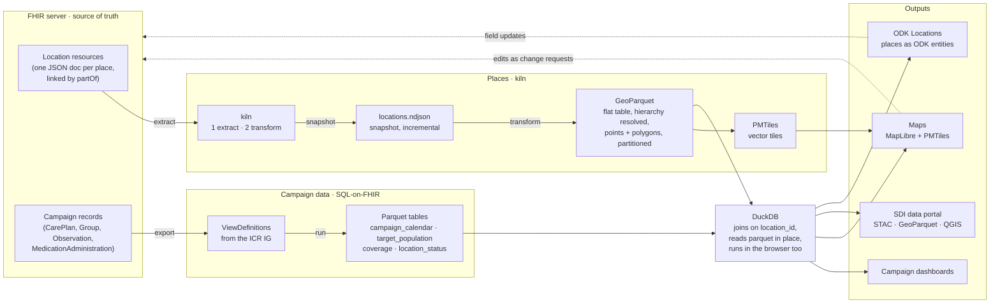

# Kiln and the FHIR data warehouse — diagram prompt

Two deliverables: a detailed prompt for an image generator, and a Mermaid diagram
of the same flow for reference. The source of truth for what the pipeline does is
[[data/README]] and `tools/warehouse/refresh.sh`.

> [!note] One thing the original sketch got wrong
> kiln is read-only. It never writes to FHIR. Edits made in a GIS or in the field
> go back to the FHIR server as change requests, and the next refresh picks them up.
> The diagram draws that as a dashed loop returning to FHIR, not into the cache.

## Image generator prompt

```
A hand-drawn technical diagram in the style of a whiteboard sketch: black ink line
work with a slightly wobbly, sketched feel, on a cream paper background. Rounded
rectangles for every box, hand-lettered labels, a few accent colours only:
blue for FHIR, orange for kiln and the location pipeline, green for the
SQL-on-FHIR pipeline, and grey for outputs. Clean, uncluttered, with plenty of
white space. Landscape, 16:9. Title across the top in hand lettering:
"From FHIR to a modern data warehouse and GIS".

The diagram flows left to right in three horizontal lanes that converge in the
middle-right on one box, then fan out on the far right.

LEFT EDGE, one tall blue box spanning both top lanes, labelled "FHIR server
(source of truth)". Inside it, small stacked document icons, each a little JSON
card, in two groups:
  - top group labelled "Location" with a tiny note "one JSON doc per place,
    linked to its parent by partOf" and a small drawing of a chain of three
    linked cards (clinic -> settlement -> district).
  - bottom group labelled "Campaign records" with tiny cards reading
    "CarePlan", "Group", "Observation", "MedicationAdministration".

TOP LANE (orange) — "Places: kiln"
  From the Location group, an arrow labelled "extract" goes to a box labelled
  "kiln" drawn as a small brick kiln icon with a little flame. Under it, two
  small hand-written steps: "1 extract: fetch every Location + boundary files"
  and "2 transform: walk the partOf chain, flatten the hierarchy".
  From kiln an arrow labelled "snapshot" goes to a box labelled
  "locations.ndjson" with a note "one line per place, kept on disk, re-runs are
  incremental".
  From there an arrow labelled "transform" goes to a box labelled "GeoParquet"
  drawn as a flat table icon. A tiny table inside shows columns:
  id | name | type | state | LGA | ward | geometry, with three example rows
  (a district polygon, a settlement, a clinic point). Under the table a note:
  "hierarchy resolved onto every row; points and polygons in one table;
  partitioned by country / geometry / type; spatially sorted so a map reads
  only the rows it needs".
  A short side arrow from GeoParquet goes up-right to a small box "PMTiles"
  with a note "vector tiles for maps".

MIDDLE LANE (green) — "Campaign data: SQL-on-FHIR"
  From the Campaign records group, an arrow labelled "export" goes to a box
  labelled "ViewDefinitions" drawn as a small stack of spec sheets with a
  ruler, and a note "defined in the ICR Implementation Guide; each one says
  which FHIR fields become which columns". Four small tags hang off it:
  "campaign_calendar", "target_population", "coverage", "location_status".
  From ViewDefinitions an arrow labelled "run (SQL-on-FHIR)" goes to a box
  labelled "Parquet tables" drawn as four stacked flat table icons, one per
  tag. A note: "one flat table per ViewDefinition, every row carries a
  location_id".

CONVERGENCE (centre-right)
  Both lanes' arrows meet at one large box labelled "DuckDB" drawn as a friendly
  duck outline holding a database cylinder. Inside, hand-written:
  "joins the tables in place on location_id, no database server, reads the
  parquet files directly, including over HTTP from a browser".
  Caption under it in a hand-drawn ribbon: "a modern data warehouse and GIS,
  on top of FHIR".

RIGHT EDGE, fanning out from DuckDB with four arrows to four grey boxes stacked
vertically:
  - "Campaign dashboards" with a tiny calendar and a bar chart
  - "Maps" with a tiny map pin, note "MapLibre + PMTiles"
  - "SDI data portal" with a tiny catalog icon, note "STAC catalog, GeoParquet,
    open to any GIS: QGIS, GeoPandas, DuckDB"
  - "ODK Locations" with a tiny phone, note "export places as ODK entities for
    field data collection"

FEEDBACK LOOP: a dashed arrow starts at "Maps" and "ODK Locations" on the right,
curves along the bottom of the drawing, and returns to the FHIR server box on
the left. It is labelled "edits and field updates go back to FHIR as change
requests; the next refresh picks them up". Near it a small hand-drawn note:
"kiln is read-only. FHIR is always the master."

BOTTOM STRIP, three small callouts in hand lettering with tiny icons:
  - "Everything downstream is derived and disposable: delete it and refresh"
  - "Nothing here is a database: just files, readable in place"
  - "One refresh script rebuilds it all from the IG and the FHIR server"

No photorealism, no gradients, no 3D. Keep all text legible and short. The
overall feel should match a diagram drawn by hand on paper for a slide deck.
```

## Mermaid reference diagram



## What each piece actually is

- **kiln** turns one country's FHIR Location resources into a single flat
  GeoParquet table with the administrative hierarchy already resolved onto every
  row. `extract` talks to the server and writes an NDJSON snapshot; `transform`
  is offline and rewrites that snapshot as partitioned GeoParquet. It is
  read-only and reports data problems rather than fixing them.
- **ViewDefinitions** are SQL-on-FHIR specs published in the ICR Implementation
  Guide. Each one names a FHIR resource and the columns to pull from it. The
  refresh runs every ViewDefinition over an NDJSON export and writes one parquet
  table per view, adding a `country` column by joining to the locations table.
- **DuckDB** reads all of the parquet in place, joins the campaign tables to the
  location table on `location_id`, and does the same in the browser as
  DuckDB-WASM for the dashboards. There is no database server anywhere.
- **PMTiles** are vector tiles baked from the GeoParquet polygons and points so
  MapLibre maps can draw the whole registry.
- **Outputs**: the campaign dashboards, the Portolan SDI catalog, and ODK
  Locations all read the same files from the same bucket.
