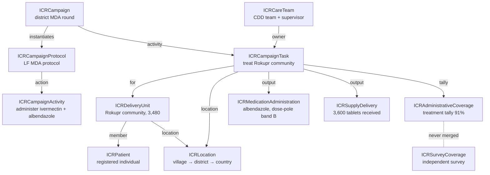
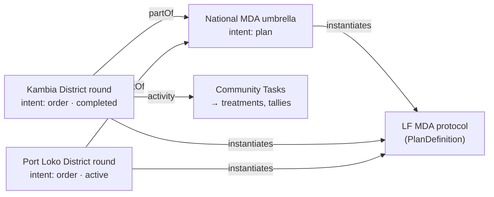
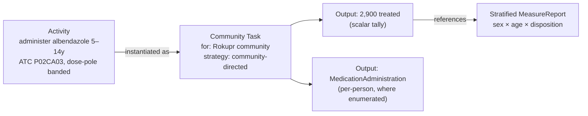
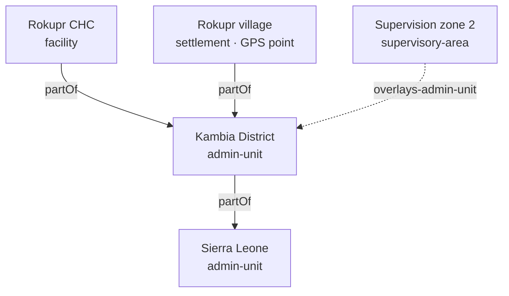
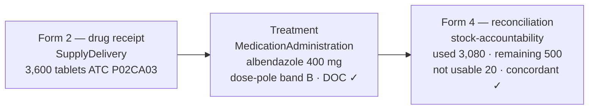
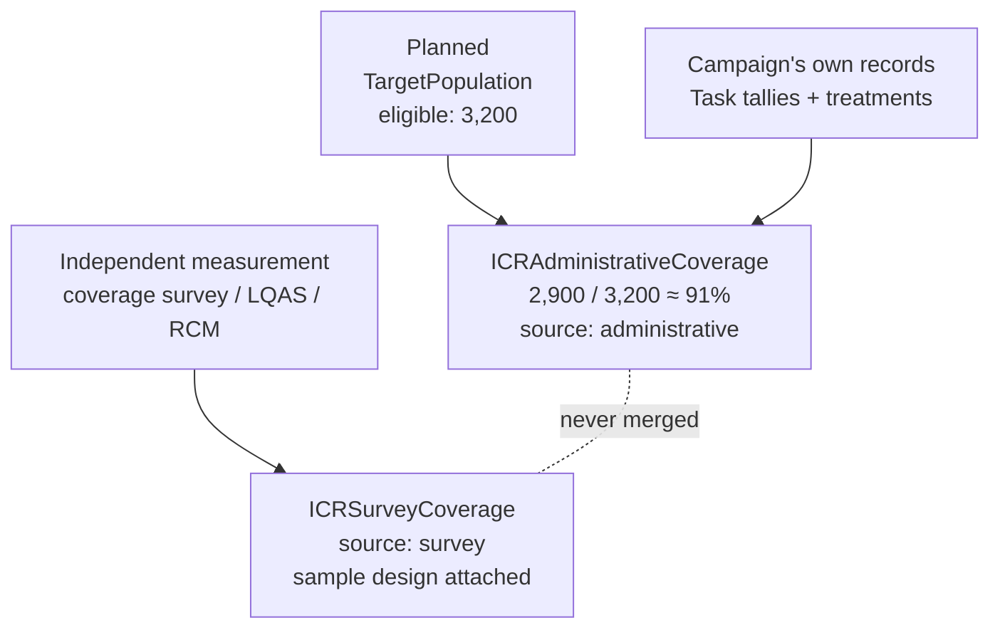
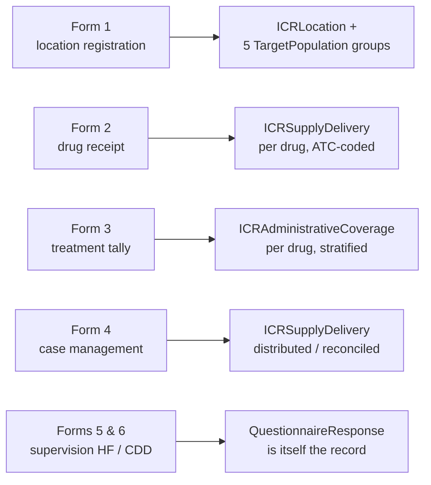

# ICR — Integrated Campaign Registry (slide bullets)
`v0.3.0 · Last modified Jul 7, 2026 at 8:31 PM EDT`

Slide-ready bullet sets distilled from [[icr-ig]] (v0.24.0). Worked examples use the ESPEN MDA thread — a community-directed NTD mass drug administration in Rokupr, Kambia District, Sierra Leone, captured on the six ESPEN MDA field forms.

---

## 1. The problem ICR solves

- Health campaigns — measles SIAs, polio rounds, NTD mass drug administration, bed-net distribution, indoor residual spraying, vitamin A — repeatedly collect the same data: who lives where, who is eligible, who was reached, what coverage was achieved.
- That data is archived or locked in one-off spreadsheets at the end of each round; the next campaign starts from scratch.
- The Integrated Campaign Registry (ICR) gives campaigns a shared, reusable data model so each campaign's data compounds instead of being re-collected.
- A UNICEF standards framework and open-source reference implementation, built on HL7 FHIR R4.

**ESPEN MDA example.** An LF (lymphatic filariasis) MDA re-registers every village, re-estimates every population, and re-trains every community drug distributor, every round — even where last year's register, denominators, and team assignments already exist. ICR makes each of those a durable, reusable record.

---

## 2. What ICR is

- The architectural core is a FHIR Implementation Guide (IG): profiles, extensions, and terminology that make campaign data comparable by construction, across countries and implementers.
- It models the half of delivery work that routine health systems do not: campaign architecture, population and geography, delivery events, and coverage.
- A deliberate complement to WHO's SMART Immunizations IG, which is routine-only — ICR is positioned as the campaign SMART-Guidelines IG. Campaign and routine records coexist in one store, distinguished by a single flag.
- Covers all major delivery models through one typology: Type A (fixed or temporary posts — people come to the post), Type B (house-to-house — workers go door to door), Type C (community-directed — a whole community treated, as in MDA).
- Current contents: 17 profiles, 35 extensions, 25 code systems, 28 value sets, 6 canonical Measures, 8 questionnaires, and 41 worked example instances.

**ESPEN MDA example.** Community-directed treatment with ivermectin (CDTI) is the canonical Type C model: a community drug distributor treats an entire eligible community against a village register, under WHO-AFRO's ESPEN programme.

---

## 3. The data model at a glance

- FHIR has no native Campaign resource. ICR builds the campaign layer on CarePlan and surrounds it with profiles for population, geography, delivery events, teams, and coverage.
- Three intersecting layers:
  - **Operational layer** — protocol → campaign → task → delivery events: the chain of work from reusable template to individual treatment.
  - **Identity layer** — Patient, Group, Location: who a campaign acts on, kept strictly separate from where they live and where work happens.
  - **Analytics layer** — Measure and MeasureReport: the coverage readout, computed from the other two layers.
- Every profile is valid plain FHIR: any FHIR system can read an ICR resource as its base type; ICR-aware systems get the additional guarantees.

---

## 4. Campaign Protocol — the reusable template

- Built on PlanDefinition: the versioned, reusable definition of a campaign type — what the campaign *is* (products, age bands, activity sequence, coverage goals), defined once.
- Every execution instantiates the same protocol, so "all rounds of this campaign type, anywhere" is a single query rather than a manual reconciliation. This is what makes campaigns of the same type directly comparable.
- Carries no geography, dates, or denominator — those belong to the execution. The protocol holds only reusable template content.
- Campaign type is disease-agnostic and grouped by delivery model: an LF MDA and a schistosomiasis MDA are both type `mda`, distinguished by the target condition and the drug code.
- Delivery strategies are mandatory and repeatable, because hybrid strategies are the norm.

**ESPEN MDA example.** A national LF MDA protocol: type `mda`, delivery strategy `community-directed`, medicine package ivermectin + albendazole, eligibility "everyone at or above dose-pole band A, excluding pregnant women and the acutely ill", goal ≥65% epidemiological coverage. Every district round, every year, instantiates this one protocol.

---

## 5. Campaign — the execution record

- Built on CarePlan: one specific campaign execution or round. Every campaign points back at exactly one protocol.
- One resource, two stages: it starts as the microplan (`intent = plan`) and evolves into the record of what actually happened (`intent = order`) as tasks complete and coverage accumulates. Planned and executed states are the same resource at different lifecycle stages, not two resources.
- National umbrella campaigns and their district rounds are the same profile, linked by `partOf`. The umbrella holds the national denominator and binds the rounds together.
- Each campaign has exactly one subject — its denominator (the *who*) — while target geography (the *where*) is separate and plural. The rule is one CarePlan per denominator/reporting scope, not per administrative area.
- Also carries the round number, the designated planning denominator, and the social-mobilization record (was the population informed, and through which channels).

**ESPEN MDA example.** The national LF MDA is the umbrella (`intent = plan`, national denominator); the Kambia District round is a child campaign (`intent = order`) with its own district denominator, its own dates, and the community treatment tasks accumulating against it. Social mobilization records that the community was informed through town criers and community leaders.

---

## 6. Campaign Activity and Task — the units of work

- **Activity** (ActivityDefinition) defines a discrete work type once — administer a drug, distribute nets, spray structures — with the product and dosage. Thousands of tasks instantiate it without repeating clinical content.
- **Task** is the assignable, trackable operational unit of work: one task per site session (Type A) or per household/community visit (Type B/C). All three delivery models use the same profile, distinguished by the mandatory coded delivery strategy.
- One task per visit; person-level detail lives in the delivery events. Person-targeted tasks exist only for follow-up of specific missed individuals.
- Tasks are either pre-planned from the microplan or field-registered on discovery. The count of field-registered tasks per area measures how incomplete the microplan's enumeration was — an input to the next round's denominators.
- Tasks carry the field tallies and three distinct reason axes: missed (not reached), noncompliance (reached but declined), and exclusion (present but contraindicated).

**ESPEN MDA example.** One activity — "administer albendazole, 5–14 years, tablet count by dose-pole band" — is instantiated as one community-directed task per village. The Rokupr task records 2,900 treated as its output tally, with exclusion reasons (under height/age, pregnant, breastfeeding), missed reason (absent), and noncompliance reason (no felt need) on the same task.

---

## 7. Care Team — accountability and supervision

- Built on CareTeam: the delivery team — community drug distributors (CDDs) or vaccinators plus their supervisor — with coded roles and a managing organization.
- Task ownership is a real reference to a team, not a display string, so "who worked this area" is a query. Coverage reports require a reporter, so "who reported this figure" is equally queryable.
- The team carries the microplan's workload assignment: its target area plus expected population, households, and days.
- The supervisor is tied to operational geography through the supervisory areas the team oversees.
- Supervision is structured: a supervision visit is a QuestionnaireResponse against a coded checklist, so QA questions are queries, not document reviews. A parallel pre-campaign readiness checklist rolls up to a readiness Measure.

**ESPEN MDA example.** "CDD team 7, Rokupr" — a CDD and a supervisor, managed by the district health management team, assigned 3,200 people over 5 days. ESPEN's two supervision forms are modelled directly: the health-facility supervision form and the CDD-observation form each become a coded QuestionnaireResponse — directly-observed consumption observed ✓, height chart used correctly ✓, ineligibles identified ✓, stock concordant ✗ — so "what fraction of supervised CDDs had concordant stock" is a query.

---

## 8. Patient — the registered individual

- Built on Patient: the enumerated household or community member, aligned to WHO's IMMZ.Patient profile so a registered campaign member is also a WHO-conformant immunization subject.
- At least one stable identifier is required — the national person ID where one exists, a registry-assigned ID otherwise — so a person is rejoinable across rounds.
- Gender and birth date are mandatory because eligibility and sex/age disaggregation depend on them; name is required for cross-round matchability.
- Cross-round identity resolves as: same person identifier, or failing that, same dwelling (via its stable place ID) plus same head of household plus plausible age and sex.
- Person-data governance travels with the person: a Consent profile records permission for collection, storage, and cross-border sharing.

**ESPEN MDA example.** A CDTI village register lists each community member by name, age, and sex. Registered as ICR Patients, those individuals persist between rounds: next year's MDA starts from this year's register, and a person's treatment history ("received ivermectin in rounds 1–3, missed round 4") becomes queryable — the input TAS-readiness assessments need.

---

## 9. Delivery Unit — the group a task acts on

- Built on Group (`actual = true`): the real group of people a task targets — a household (Type B), a community (Type C), or a school cohort — one profile serving all scales, distinguished by a required group-kind code.
- Members are enumerated individuals, each an ICR Patient. Enumeration is the mainline capture mode; a quantity-only head count is the fallback for register-level capture, and the two can coexist.
- The group (who) is deliberately separated from its location (where): the household's dwelling, the community's settlement, the cohort's school. Each keeps a stable identity when the other changes.
- Household identity across campaigns is reconstructed from the head of household plus the dwelling's stable place ID, which survives changes in household composition.

**ESPEN MDA example.** "Rokupr community" is one delivery unit: kind `community`, quantity 3,480, located at the Rokupr settlement. Where the register enumerates individuals, they are members of the same group; where it only counts, the quantity stands alone. A school-based deworming arm uses the identical structure with kind `school-cohort` located at the school.

---

## 10. Target Population — the denominator

- Built on Group (`actual = false`): a conceptual cohort with a count, eligibility characteristics, and — critically — source and date provenance.
- The denominator is the dominant error source in campaign analytics. Competing estimates for the same geography are retained side by side, each with its own provenance, and exactly one is flagged as the planning denominator.
- Each estimate is scoped to a location by reference, so it joins the location hierarchy computably at any level — country, district, ward, settlement, or operational area.
- Denominators declare their type: total population versus at-risk population — the axis that separates programme coverage from epidemiological coverage. NTD programmes report both.

**ESPEN MDA example.** ESPEN Form 1 (location registration) captures a village's population by age band. On submission it extracts to five target-population groups for the same village — total, eligible, 1–4 years, 5–14 years, 15+ — each carrying its source and date. When last year's register (3,480) and this year's projection (3,200) disagree, both are retained; the planning flag declares which one treatment coverage is computed against.

---

## 11. Location — the place model

- The most-customized ICR profile: a nested administrative hierarchy (country → region → district → ward → settlement → dwelling), typed locations (admin unit, settlement, facility, school, distribution point, household, supervisory area), GPS points, and GeoJSON boundaries.
- Geospatial identity is multi-system: Overture Maps GERS IDs are the preferred cross-campaign join key, alongside OCHA P-codes, national admin codes, and ISO 3166 codes as coequal aliases. Administrative units must carry at least one stable identifier.
- Operational geography — supervision zones, catchment areas — sits beside the administrative tree, not inside it: a supervisory zone can straddle several wards, so it links to the admin units it overlays rather than claiming a single parent. This overlay mechanism is the IG's strongest validated design feature.
- Locations can be created unmatched and have their GERS ID back-filled later through asynchronous conflation, with versioning and provenance.

**ESPEN MDA example.** ESPEN Form 1's registration cascade — state → district → health facility → village, plus a GPS point — maps directly onto the location hierarchy, and its submission extracts a new village Location placed under its district. The CDD supervisor's zone is the operational overlay: it straddles several villages, so it links to the district it reports into rather than sitting in the administrative tree.

---

## 12. Delivery events — what was actually delivered

- Three event profiles record the work product, all carrying the mandatory campaign-vs-routine record-origin flag:
  - **Immunization event** — a vaccine dose given to a person, with lot number and manufacturer for AEFI traceability.
  - **Medication administration** — an MDA drug administration, with the two distinctly-MDA patterns: dose derived from a dose-pole height band, and directly-observed consumption. Its subject may be a person or a whole delivery-unit group, supporting register-level capture.
  - **Supply delivery** — a commodity delivery, with a stock-accountability record: received / used / remaining / not usable / returned, plus a concordance check.
- The aggregate-versus-individual rule: individual record when you have a person; aggregate count on the task's output when you don't; stratified MeasureReport for derived or disaggregated coverage.
- Drug receipt, administration, and reconciliation share one ATC drug code, so the stock chain is joinable end to end.

**ESPEN MDA example.** Form 2 records 3,600 albendazole tablets received at Rokupr as a supply delivery. Each treatment is a medication administration: albendazole 400 mg, tablet count set by dose-pole band B, directly-observed consumption confirmed. Form 4 closes the loop with the stock-accountability record — received 3,600, used 3,080, remaining 500, not usable 20, concordant — all three sharing the same ATC code.

---

## 13. Adverse events — one safety model for all interventions

- Built on AdverseEvent, deliberately intervention-neutral: one profile serves AEFI (following a vaccine dose) and MDA pharmacovigilance (following a drug).
- Records what happened, severity, seriousness (with the WHO/CIOMS criteria for why: death, life-threatening, hospitalization, disability), and WHO/CIOMS causality classification A/B/C/D.
- Traceability runs from the event back to the exact suspected dose or treatment, and through it to the lot and manufacturer.
- Carries the same campaign-vs-routine record-origin flag as the delivery events, and maps to WHO's adverse-event artifacts via a shipped ConceptMap.

**ESPEN MDA example.** A person reports abdominal pain after their albendazole dose. The adverse event references that exact medication administration, is graded non-serious, and is assessed causality C (coincidental). ESPEN Form 4's aggregate side-effect counts stay on the form response by design — person-level adverse events are minted only when there is a person.

---

## 14. Coverage — how MeasureReports work

- Coverage reports are built on MeasureReport, whose native numerator/denominator structure matches coverage directly. Each report points at a canonical Measure definition that declares what is being measured and its standard disaggregation axes.
- Two separately profiled lineages of the same quantity:
  - **Administrative coverage** — computed from the campaign's own tally and delivery data. Carries its denominator's provenance, because the figure is only as reliable as the denominator it was computed against.
  - **Survey coverage** — measured independently by cluster survey, LQAS, or RCM. Carries its sample design instead of a denominator; its denominator is the sample.
- The never-merge rule is enforced structurally, not by convention: the administrative profile fixes its source code to `administrative`, while the survey profile binds the same field to a value set that excludes `administrative`. A resource cannot be both.
- Every coverage report declares its data lineage — realtime (the live in-field feed) versus reconciled (the corrected close-out figures exported to official reporting) — so a "final figures only" query cleanly drops preliminary numbers.
- Every report requires a reporter, so accountability for each published figure is a query.

**ESPEN MDA example.** Rokupr's treatment coverage is 2,900 treated over 3,200 eligible ≈ 91% — an administrative figure computed from the CDD register, carrying its denominator's source. An independent coverage survey of the same round is a separate report that can never be blended with it. The programme's ≥65% epidemiological threshold is evaluated against the at-risk denominator.

---

## 15. Coverage — stratification, geography, and the Measure library

- Six canonical Measure definitions ship with the IG: administrative coverage, survey coverage, MDA treatment coverage, geographic coverage, zero-dose coverage, and campaign readiness.
- Disaggregation uses MeasureReport stratifiers over one shared vocabulary: sex, age band, delivery strategy, disposition, geography, and dose history.
- A coverage-unit axis distinguishes people from implementation units; a denominator-type axis distinguishes programme coverage (total population) from epidemiological coverage (at-risk population).
- The Measure definitions align with existing ministry reporting obligations — WHO JAP, the ICG M&E minimum dataset, the ESPEN treatment-coverage schema — so a report produced for ICR is also the figure those channels expect.

**ESPEN MDA example — the treatment cube.** ESPEN Form 3's per-drug tally extracts to one stratified MeasureReport on the MDA treatment-coverage Measure: 2,900 / 3,200 ≈ 91%, stratified by sex (1,500 female / 1,400 male), age band (1,100 at 5–14 / 1,800 at 15+), and disposition (2,900 treated / 180 excluded / 95 absent / 25 refused) — the full "reasons not treated" cube in a single report.

**ESPEN MDA example — geographic coverage.** The supervision form's "villages treated / villages targeted" becomes first-class coverage: 188 of 200 villages ≈ 94%, coverage unit `implementation-units`, with non-treatment reasons (insecurity 7, drug shortage 5) as a disposition stratifier.

---

## 16. Terminology — CodeSystems and ValueSets

- ICR defines code systems only for genuinely new campaign semantics it owns; everything with an existing standard is reused: vaccines → CVX, drugs → WHO ATC, commodities → GS1, geography → ISO 3166, P-codes, and GERS.
- 25 CodeSystems cover the campaign vocabulary: campaign type, delivery strategy, record origin, group kind, task origin, location type, missed/noncompliance/exclusion reasons, denominator source and type, data lineage, coverage source and stratifiers, causality, team roles, communication channels, dose history, settlement type, NTD diseases, and MDA medicine packages.
- Each CodeSystem is paired with a ValueSet that defines which codes are allowed in a given field, plus purpose-built sets — most notably the independent-coverage-source set, which excludes `administrative` and is what makes the never-merge rule structurally enforceable.
- Binding strength is a deliberate two-tier pattern:
  - **Structural discriminators** (delivery strategy, record origin, data lineage, coverage source, denominator type, coverage unit) are required bindings — analytics must be able to branch on them.
  - **Field-reality vocabularies** (missed reasons, refusal reasons, location types, team roles, communication channels) are extensible — countries add local codes and map back via ConceptMap.

**ESPEN MDA example.** The ESPEN conversion added two code systems taken directly from the forms: the NTD disease axis (`lf`, `oncho`, `schisto`, `sth`, `trachoma`) and the medicine-package axis (`ivm`, `ivm-alb`, `pzq`, `azm-tab`, and the other standard co-administration packages). MDA drugs bind to WHO ATC — albendazole P02CA03, ivermectin P02CA01, praziquantel P02BA01 — so no drug codes were invented.

---

## 17. Extensions — the campaign semantics FHIR lacks

- 35 extensions carry campaign concepts onto the base resources, in four families:
  - **Campaign mechanics** — delivery strategy, campaign round, target geography, planning denominator, realtime-vs-reconciled, task origin, social mobilization, team workload targets, supervisory areas.
  - **Task field data** — houses visited, eligible present/absent, missed/noncompliance/exclusion reasons, finger-marking, revisit outcomes.
  - **Denominator provenance** — source, type, estimate date, planning flag, confidence.
  - **Geospatial, delivery, and safety** — GeoJSON boundaries, operational-geography overlays, record origin, prior-dose status, settlement type, directly-observed consumption, dose-pole band, stock accountability, seriousness criteria.

**ESPEN MDA example.** The MDA-specific extensions in one visit: the dose-pole band records the height band that set the tablet count; directly-observed consumption distinguishes a drug handed out from a drug swallowed; the exclusion reason records "present but contraindicated" (under height, pregnant, breastfeeding); and stock accountability reconciles the CDD's tablets at close-out.

---

## 18. Design principles

- **Campaign vs routine is a firewall.** A mandatory record-origin flag on every delivery event keeps campaign doses out of routine analytics and vice versa, while both live in one store.
- **Three views of coverage, never merged**: planned (the denominator), administrative (the campaign's own tallies), and independently surveyed — because they routinely disagree.
- **Delivery strategy is first-class and coded.** Strategy determines which data elements even make sense; it is mandatory on the protocol and on every task.
- **Denominator provenance travels with every estimate**, and competing estimates coexist rather than overwriting one another.
- **Geospatial identity is multi-system, GERS-preferred**, and operational geography overlays the administrative hierarchy rather than pretending to be part of it.
- **Accountability is queryable.** Task ownership and report authorship are real references, not strings.

**ESPEN MDA example.** Every principle is visible in one MDA round: the register's treatments are flagged `campaign` so routine deworming stays separate; the 91% administrative figure and the independent survey are separate records; `community-directed` strategy determines that register tallies (not house-visit counts) apply; the village keeps two population estimates with sources; and the tally's reporter is the CDD team's supervisor.

---

## 19. Grounded in field evidence — the ESPEN forms end to end

- The IG ships a complete worked scenario — a Sierra Leone measles–rubella SIA plus the community-directed MDA thread used throughout this deck — with 41 example instances exercising every profile end to end.
- Validated against eight global-health source analyses (WHO SIA, RED microplanning, and measles guidance; the WHO cluster-survey manual; GTFCC OCV; NTD-MDA; WHO EYE; geo-enabled microplanning): no source contradicts the core design.
- Iteratively hardened against real field instruments: ten UNICEF polio-SIA forms drove zero-dose tracking, readiness checklists, and revisit outcomes; the six ESPEN MDA forms were converted to complete, source-faithful FHIR Questionnaires.
- Each filled ESPEN form extracts automatically into ICR-profiled resources (SDC template-based extraction) — demonstrating the "countries extend the IG" story end to end: a national form in the field becomes standard registry data.

---

## 20. WHO alignment and roadmap

- ICR is the campaign complement to WHO's routine-immunization IG: adopt the SMART-Guidelines IG structure, reuse WHO artifacts at the touch-points (patient, immunization, adverse event), and offer the campaign layer back as ICR's distinctive contribution.
- Derive ICR's coverage Measures from WHO's 45 indicators where they overlap, then add the campaign-only ones WHO lacks: admin-vs-survey coverage, RCM/LQAS, the at-risk denominator, geographic coverage.
- Analytics roadmap: executable CQL for the shipped Measures, SQL-on-FHIR view definitions, and ConceptMap scaffolds for country and local code localization.
- Validation roadmap: conformance testing against real campaign datasets, FHIR community review, and two-country pilots. Open design questions are published in the IG itself.
- Delivery: 17 months, six phases (May 2026 – Sep 2027) — IG first, then platform and pilots, capacity building, and reporting and systems integration. Consortium: Ona (prime) with Crosscut, for UNICEF.
