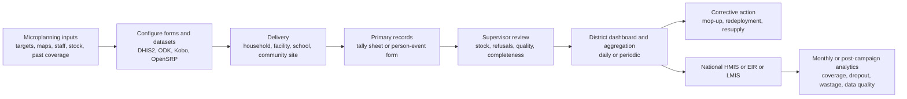
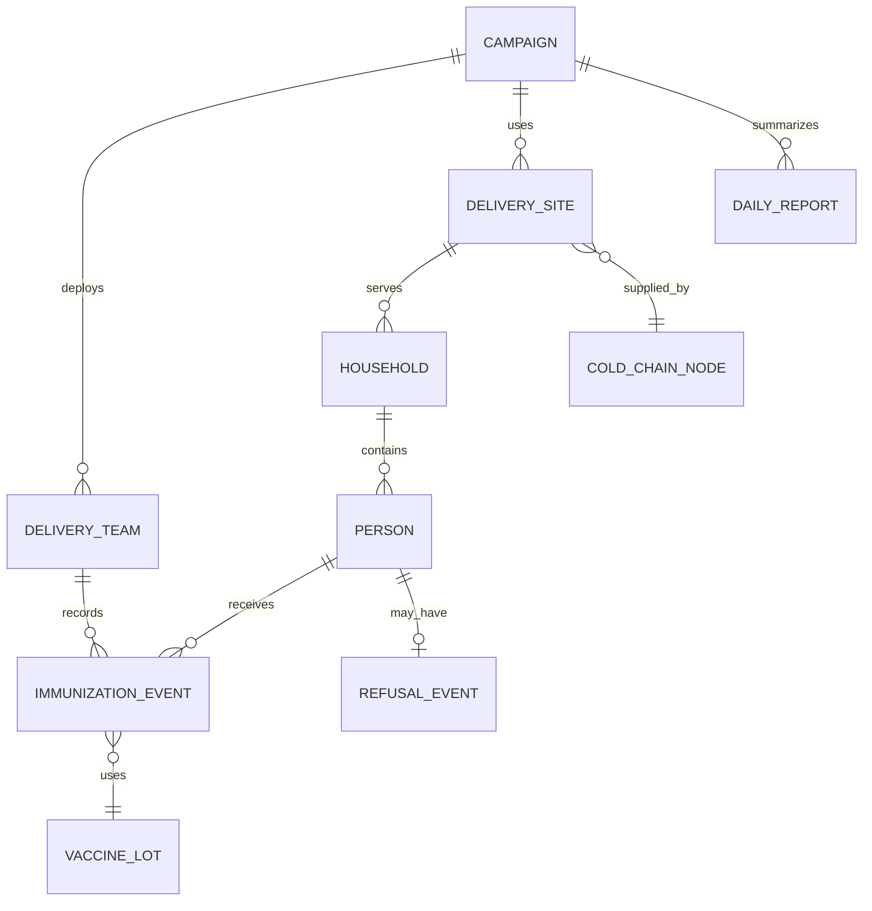
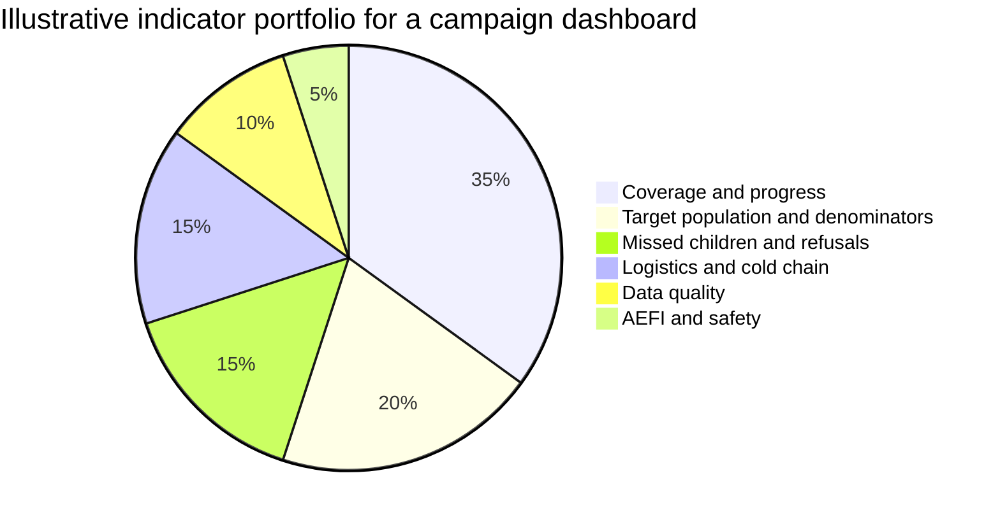

# Data Models for Global Health Immunization Campaigns

## Executive summary

Global-health immunization campaigns are usually not built on a single monolithic data model. In practice, the strongest implementations use a layered structure: a **campaign layer** for dates, targets, geography, teams, and commodities; a **delivery layer** for facilities, outreach points, school sites, or households; a **service layer** for doses delivered or missed; a **supervision and quality layer** for refusals, stock reconciliation, rapid monitoring, and post-campaign validation; and an **analytics layer** for coverage, dropout, zero-dose, stock, wastage, and data-quality indicators. WHO’s immunization Digital Adaptation Kit, WHO RED microplanning guidance, DHIS2 immunization packages, and EIR guidance all point toward this layered, workflow-driven approach rather than a single universal schema. citeturn24view2turn17view2turn20view8turn34view11turn34view9

The structure varies by program. **Polio SIAs** are the most household- and settlement-sensitive, with operational maps, team movement plans, high-risk-area flags, rapid campaign monitoring, missed-child reasons, and explicit revisit or mop-up workflows. **Measles and MR SIAs** more often center on fixed, temporary, school, or community posts, but still require daily tallying, vial accountability, AEFI pathways, supervision, and optional identification of zero-dose children from home-based records. **Routine immunization and routine outreach** are operationally different from campaigns, yet their data models share core microplanning assets: catchment maps, target populations, session plans, workplans, community links, defaulter follow-up, monthly reports, and periodic microplan revision. citeturn17view0turn34view3turn20view0turn27view0turn17view2turn28view0turn28view3turn28view4

Because the user did not specify the two tropical diseases, this report uses **lymphatic filariasis** and **trachoma** as representative campaign-style neglected tropical diseases. They are not immunization programs, but WHO guidance for their preventive-chemotherapy campaigns uses mass-administration, community-delivery, mop-up, resource-estimation, household log, and coverage-reporting patterns that are highly analogous to immunization campaign data models. citeturn10search2turn17view6turn17view7turn17view8

On platforms, the dominant implementation patterns are now clear. **DHIS2** is strongest for hybrid national architectures that combine aggregate reporting, campaign dashboards, and Tracker-based individual follow-up. **ODK** and **KoboToolbox** are strong for rapid, low-friction XLSForm-based capture, especially when the immediate need is campaign digitization, geolocation, supervision, or household enumeration. **OpenSRP** is strongest where countries want a FHIR-native, longitudinal, frontline workflow system for routine immunization, catch-up, and decision support. In many countries the most pragmatic architecture is not exclusive choice but **hybrid use**: ODK/Kobo or Tracker for field capture, DHIS2 for dashboards and national HMIS integration, and CSV/JSON or API-based pipelines as the interchange layer. citeturn20view7turn20view8turn34view11turn20view9turn37view0turn38view0turn38view1turn20view11turn20view12turn34view7

The most important implementation judgment is therefore not “Which platform should we pick?” but **“What granularity is operationally necessary?”** For many campaigns, district- or team-day totals are enough to manage coverage and stock. For zero-dose identification, real household enumeration with GPS or operational mapping becomes essential. For longitudinal routine immunization and repeat catch-up, a person-level registry with dose history, decision support, reminder/recall, and interoperability becomes worthwhile. WHO, Gavi, UNICEF, PATH/VillageReach, and ESPEN sources all imply that over-collecting “nice-to-have” data is a common failure mode; the recommended design principle is to digitize the minimum data that directly drives action. citeturn35view1turn24view2turn33view2turn31view1turn31view6turn19view3

## Campaign modalities and delivery structure

A practical campaign data model starts by distinguishing **campaign type**, **delivery unit**, and **microplanning grain**. WHO guidance for RED and SIAs, plus recent integrated measles-polio guidance, show that these are not merely operational labels; they determine which entities, forms, and indicators belong in the schema. Fixed sessions, outreach sites, mobile teams, temporary posts, schools, and house-to-house delivery produce different denominators, routes of supervision, and reporting rhythms. citeturn28view0turn20view0turn33view3

| Campaign or service modality | Typical objective | Usual delivery unit | Core records and planning artifacts | Typical reporting rhythm |
|---|---|---|---|---|
| Polio SIA and outbreak response | Reach every child under the target age, including missed settlements and high-risk areas | Household, settlement, transit point, temporary post | Team movement plans, operational maps, tally sheets, rapid campaign monitoring forms, refusal notes, supervisor plans, mop-up lists citeturn17view0turn18view1turn27view5turn27view6 | Daily team and supervisor review; same-day corrective action and revisits citeturn27view8turn15search1turn34view3 |
| Measles or MR SIA | Rapid boost of immunity across broad age cohorts | Fixed post, temporary/community site, school, outreach site; integrated campaigns may include final home visits | Daily tally sheets, vial accountability, supervision checklist, AEFI flow, optional zero-dose-by-card tally sheet citeturn27view0turn27view4turn33view3 | Daily tally review and supervision; post-campaign evaluation and possible catch-up or mop-up citeturn20view0turn34view1 |
| Mop-up or revisit phase | Vaccinate people missed in first pass | Household, locality, selected missed clusters | Missed-child lists by name/location/reason, revisit forms, supervisor notification logs citeturn34view3turn27view6turn17view6 | Immediate or next-day after monitoring identifies gaps citeturn34view3turn17view6 |
| Routine fixed immunization | Deliver scheduled vaccines at facility level | Facility | Register, target population estimates, session plan, monthly summary, stock and cold-chain logs citeturn17view2turn35view0turn33view4 | Monthly reporting, quarterly workplan revision citeturn28view4turn30view0 |
| Routine outreach and mobile services | Extend routine services to hard-to-reach populations | Outreach site, mobile team, sometimes community volunteer-supported sites | Catchment maps, outreach schedule, workplan, defaulter tracking, transport plans, community feedback notes citeturn28view0turn28view2turn28view3 | Monthly reporting with quarterly microplan updates citeturn28view4turn28view5 |
| LF and trachoma MDA analogues | Deliver preventive chemotherapy or azithromycin at community scale | Community distributor point, school, household | CDD registers, household visit logs, treatment records, stock and supply forms, supervision forms, localized mop-up plans citeturn17view6turn34view5turn19view3 | Often daily during campaign, then aggregated reported coverage against target population citeturn17view7turn17view8 |

The delivery-unit distinction matters analytically. **Household delivery** requires household identifiers, missed-household or refusal fields, and often geospatial references or descriptive addresses. **Facility delivery** emphasizes stock, cold chain, scheduled sessions, and longitudinal patient history. **Community-site delivery** needs location-based daily target attainment and commodity accountability, often by site-day rather than by household. WHO’s RED guidance explicitly asks health facilities to map villages and decide which populations receive fixed, outreach, or mobile services; the integrated measles-polio guidance likewise notes that measles campaigns commonly rely on fixed or temporary posts while polio outbreak response often uses short, intensive door-to-door operations. citeturn28view0turn33view3

Microplanning is the bridge between epidemiology and data structure. In good implementations, the microplan is not a narrative document but a structured dataset containing target populations, catchment-area maps, session types, workforce, transport, commodities, and supervisory responsibilities. WHO’s RED guide requires hand-drawn or formal maps with villages, target populations, hard-to-reach areas, roads, transport details, nomadic movement, and session type assignment. Polio guidance adds team movement plans, high-risk-area marking, and daily supervisory planning; in Kano State, revised household-based microplanning increased enumerated settlements by 38% and reduced inflated household and child targets, improving subsequent campaign performance indicators. citeturn28view0turn17view0turn18view1turn6search3

Country practice shows how campaign and routine data models can converge. India’s Mission Indradhanush explicitly instructs districts to incorporate special-drive sessions into routine microplans after the round, keep campaign and routine coverage separate during daily reporting, and combine them into regular HMIS reporting at month end. That is a strong example of a **campaign-to-routine integration rule** that should be designed into the data schema from the start. citeturn17view9turn18view12

The workflow below reflects the common operational pattern synthesized from WHO SIA guidance, RED guidance, UNICEF RTM practice, and DHIS2 campaign documentation. citeturn20view0turn17view2turn34view8turn29view9

## Core data architecture and data elements

Across polio, measles, routine immunization, and campaign-like NTD programs, the stable pattern is a **nested entity model**. A campaign has versions, dates, and targets. It deploys teams and sites. Sites or teams serve households or catchment populations. Persons receive services or are not reached. Vaccine or medicine events consume lots and commodities and may generate refusals, AEFI or adverse events, stock updates, and daily reports. WHO’s immunization DAK, PATH/VillageReach EIR guidance, DHIS2 Tracker design, SIA tally sheets, and ESPEN digitized MDA guidance all support this architecture. citeturn24view2turn34view9turn31view1turn34view11turn27view0turn19view3

At the **person and event layer**, the most complete schemas capture identity and demographics, caregiver details, residence, vaccination event details, delivery strategy, and reasons a vaccine was not given. PATH/VillageReach’s EIR landscape summary recommends minimum demographic fields such as family name, mother’s name, caregiver’s name, unique ID, sex, date of birth, contact information, and residence, while warning that additional sociodemographic variables can be analytically useful but may be sensitive and burdensome. The same source also recommends that vaccine-event data include date, antigen, dose, place of vaccination, vaccinator, strategy, manufacturer, lot number, expiration date, reasons not given, and AEFIs. citeturn31view1turn31view0

At the **campaign service layer**, polio and measles forms usually do not start with a full longitudinal patient record. Instead, they prioritize operationally actionable variables: age band, area, site, team, vaccinated/not vaccinated, reason missed, refusal reason, vials opened and returned, supervisor visit, and AEFI flag. WHO’s injectable SIA field guide includes sample tally sheets with vaccinated age groups, vial counts received/opened/discarded/returned, supervision visits, monitor visits, and AEFI identification and reporting, with an optional tally format that stratifies by routine measles-card history to detect zero-dose children. Polio rapid campaign monitoring forms explicitly include village/community, household location, finger-mark status, names or house references for misses, and reasons not vaccinated. citeturn27view0turn34view3

At the **household and community layer**, the main use cases are zero-dose identification, missed-settlement follow-up, and house-to-house delivery. Polio guidance asks teams to note households refusing immunization, including why the refusal occurred; rapid monitoring forms record the household or house/street identifier of missed children so teams can revisit. ESPEN’s 2025 digitized MDA guide explicitly distinguishes household-level digitization with precise GPS from daily aggregate team-area reporting, making clear that household granularity is a design choice, not an automatic requirement. citeturn27view5turn27view6turn34view7

At the **logistics and cold-chain layer**, the data model should usually separate operational vaccine usage from individual dose records. SIA and routine guidance consistently require cold-chain stocks, transport devices, temperature monitoring, wastage, and supply chain records. India’s cold-chain handbook covers temperature monitoring, transport to outreach sites, MIS such as NCCMIS and eVIN, and contingency planning; the WHO SARA tracer set includes refrigerator temperature monitoring, adequate 2–8°C maintenance, immunization cards, tally sheets, vaccine stock-outs, and minimum cold-chain requirements. citeturn33view4turn36view0

The following table organizes the most common data elements by practical data domain.

| Data domain | Typical elements | Most relevant modalities |
|---|---|---|
| Campaign master data | campaign name, antigen(s), round, dates, target age group, geography, implementing strategy, partner support, team count, target populations, planned commodities citeturn24view2turn29view9turn33view3 | All campaigns |
| Team and site data | team ID, supervisor, route or movement plan, site type, outreach point, school or community site, operational map, daily plan, transport mode citeturn18view1turn28view0turn19view1 | Polio, measles SIAs, routine outreach |
| Household or community data | village or settlement, household identifier, house or street description, GPS or mapped location, missed-household flag, refusal reason, community influencer or volunteer involvement citeturn34view3turn27view5turn20view10turn34view12 | Polio, zero-dose mapping, NTD MDA |
| Person and caregiver data | unique ID if available, family name, given name, sex, DOB/age band, caregiver or mother’s name, residence, phone/contact, active or deceased status citeturn31view1turn34view11 | Routine EIRs, catch-up, targeted zero-dose work |
| Service event data | date, antigen, dose, vaccinator, place of vaccination, delivery strategy, reason not given, refusals, contraindication, AEFI, card checked or not citeturn31view0turn20view12turn27view0 | Routine and campaign event capture |
| Vaccine-lot and safety data | manufacturer, lot number, expiry date, diluent lot, reconstitution time, severe adverse events, outbreak or recall linkage citeturn27view2turn21search0turn32view8 | Measles/MR, routine EIRs, pharmacovigilance-sensitive campaigns |
| Cold-chain and stock data | vials received, opened, discarded, returned, stock on hand, low-stock alerts, temperature logger status, refrigerator availability, cold boxes, vaccine carriers, wastage citeturn27view0turn33view4turn31view3turn36view0 | All programs using conserved vaccines |
| Coverage and quality data | doses delivered, people vaccinated, target denominator, coverage %, zero-dose, dropout, missed children, stock-outs, duplicate records, completeness and timeliness, LQAS or survey results citeturn35view0turn35view3turn17view5turn20view3turn26search3 | All programs |

A core analytical point is that not every program should capture every element at the same level. Lot number, for example, is highly relevant in person-level EIRs and AEFI investigations, but can be operational overkill for a brief house-to-house OPV campaign unless the product or safety context requires it. The right design principle is **“capture the most detailed variable at the lowest level where it changes operational decisions.”** That principle is directly consistent with WHO DAK thinking, EIR requirement guidance, and ESPEN’s warning not to digitize everything if it does not inform campaign management. citeturn24view2turn31view0turn19view3

## Platforms, schemas, and implementation patterns

The major implementation options differ less in what they *can* store than in what they are optimized to do. **DHIS2** supports both aggregate modules and transactional Tracker programs. Its immunization campaign toolkit is explicitly designed for planning, implementation, real-time monitoring, and evaluation of SIAs, while its eRegistry package uses Tracker to register individuals and follow them across routine and non-routine vaccination schedules. DHIS2 documentation also makes the critical point that tracker and aggregate datasets are complementary: person-level service data often still need to be combined with aggregate population estimates to calculate coverage. citeturn20view8turn34view11turn29view5

In routine community reporting, DHIS2 also packages **monthly and yearly immunization datasets** and associated indicators. The CHIS immunization design includes monthly data sets, yearly follow-up of immunization activities, and numerator/denominator indicators such as children vaccinated for polio, eligible children, suspected AFP, and measles/rubella signal events. That makes DHIS2 particularly well suited to hybrid architectures where routine, surveillance, and campaign data need to sit in one national platform. citeturn30view0

**ODK** excels when the problem is rapid field digitization rather than longitudinal registry construction. XLSForm lets implementers design complex forms in spreadsheets; ODK Central exports CSV zip bundles, repeat-table structures, OData feeds, and audit logs; OpenRosa metadata adds instance IDs, start/end times, user IDs, and device IDs. These features make ODK strong for campaign forms, supervisory checklists, household enumeration, post-campaign surveys, and temporary interoperability through CSV/JSON pipelines. citeturn20view9turn37view0turn37view1turn39search1

**KoboToolbox** occupies a similar operational niche and is especially common where humanitarian or partner-led field teams need simple deployment and broad interoperability. Kobo supports GPS question types, exports to XLS, CSV, GeoJSON, KML, and media ZIP, and offers JSON, CSV, or XLSX access through its API. It is therefore useful when campaign teams need GPS-enabled field collection and easy extraction for dashboards or GIS work, even if national HMIS integration is handled elsewhere. citeturn20view10turn38view0turn38view1

**OpenSRP** is best understood not as a survey form server but as a frontline, longitudinal care platform. Its documentation describes it as FHIR-native, with a mobile app, admin dashboard, and analytics dashboard; its global immunization suite records antigen, dose, lot number, and date, and can store reasons vaccines were not given while using built-in logic to determine which vaccine is due next. Zambia’s ZEIR used OpenSRP after earlier design iterations under the BID Initiative. citeturn20view11turn20view12turn32view2

**Custom CSV and JSON pipelines** remain extremely important. They are often not the field tool, but the interchange layer between field collection, dashboards, and national systems. ODK Central’s CSV/OData model and Kobo’s API-based JSON/CSV/XLSX exports illustrate this. ESPEN’s digitized MDA guidance is especially explicit: XLSForms can be a rapid temporary solution, or can collect campaign data that are later processed and imported into national systems after the campaign. citeturn37view0turn38view1turn38view2turn19view3

| Platform or schema family | Native modeling style | Strongest use cases | Main cautions |
|---|---|---|---|
| DHIS2 aggregate | Data sets, org units, indicators, dashboards citeturn20view8turn30view0 | Daily or monthly campaign totals, routine HMIS reporting, dashboards, stock or logistics summaries | Limited for longitudinal person tracking unless paired with Tracker citeturn29view5 |
| DHIS2 Tracker | Person- and event-based transactional model with metadata-driven configuration citeturn34view11 | EIRs, zero-dose mapping, targeted catch-up, event-level campaign capture | Requires stronger metadata governance and implementation capacity citeturn20view7 |
| ODK plus XLSForm | Form-centric submissions plus metadata, repeat groups, CSV/OData exports citeturn20view9turn37view0turn37view1 | Rapid campaign digitization, supervision, household surveys, post-campaign checks | Usually needs separate analytics or national-system integration layer |
| KoboToolbox | Form-centric capture with broad export and API options citeturn38view0turn38view1 | Partner-led field collection, GPS, GIS exports, dashboards | Public or anonymous exports should be avoided for sensitive health data citeturn38view2 |
| OpenSRP | FHIR-native operational medical record and care workflow system citeturn20view11turn20view12 | Routine immunization, outreach planning, reminder/recall, facility-to-community continuity | More suitable when a country wants longitudinal workflows, not just a short campaign |
| Custom CSV or JSON | File or API exchange layer derived from forms or dashboards citeturn37view0turn38view1turn39search1 | Bridging tools, quick integrations, backups, partner handoff | Weak semantic standardization unless carefully documented |
| FHIR and HL7 v2 messaging | Standardized exchange resources or segments for immunization data citeturn34view14turn21search0turn34view2 | EIR-IIS exchange, decision support, cross-system interoperability | Requires profiling, code systems, governance, and ecosystem readiness |

Country experience favors **hybrid** implementations. Uganda’s 2019 measles-rubella and OPV campaign used ODK for monitoring inputs and DHIS2 for consistency checks and dashboards; subnational teams reviewed dashboards on phones and met daily for corrective action. Mozambique used a custom DHIS2 Tracker program for zero-dose and under-immunized child mapping, vaccination recording, and daily updates during the 2024 catch-up effort, reaching more than 19,000 children in five pilot provinces. These examples show that the practical question is how to combine capture, verification, and decision support, not how to force one platform to do everything. citeturn34view8turn33view0

## Reporting workflows, indicators, denominators, and data quality

The reporting rhythm differs sharply between campaign and routine models. During SIAs, WHO and UNICEF guidance emphasizes **daily review** of tally sheets, supervision, stock, and dashboard outputs so managers can redeploy teams, launch mop-ups, and fix supply gaps immediately. Mission Indradhanush requires daily upward reporting during the round and month-end inclusion of achievements in HMIS. Routine immunization, by contrast, normally moves on **monthly reporting cycles** with quarterly review and workplan revision. citeturn20view0turn34view1turn34view8turn17view9turn28view4turn30view0

The indicator problem is not just numerator construction but denominator credibility. WHO defines administrative coverage as doses administered divided by the estimated target population, while explicitly warning that both numerators and denominators may be inaccurate because of incomplete reporting, over-reporting, population movement, or poor census projections. WHO’s 2022 target-population guidance notes that suspicious signs include coverage above 100%, erratic year-to-year fluctuations, and outbreaks in supposedly high-coverage areas. Gavi’s zero-dose guidance therefore pushes countries to triangulate denominators across routine sources, EIRs, polio/measles enumeration data, GIS, surveys, outbreak data, and CRVS links. citeturn35view0turn35view2turn35view1

For zero-dose work, Gavi’s operational proxy is clear: **zero-dose children are those missing DPT-containing vaccine dose 1**, while under-immunized children are often proxied by missing DPT-containing vaccine dose 3. These definitions are programmatically useful because DTPcv1 and DTPcv3 are broadly available routine indicators, even though more nuanced definitions may exist in specific analytic work. citeturn35view3

The most important indicator families for global-health implementations are shown below. The chart is an **illustrative recommended dashboard mix**, not an empirical global distribution, synthesized from WHO DAK, Gavi zero-dose guidance, WHO DQR tools, DHIS2 immunization packages, and SIA manuals. citeturn24view2turn35view1turn17view5turn20view8turn27view0

| Indicator family | Common numerator | Common denominator | Typical use |
|---|---|---|---|
| Administrative coverage | doses or persons vaccinated | estimated target population for antigen, age group, or area citeturn35view0turn35view2 | Routine monthly review, campaign progress tracking |
| Zero-dose | children with no DPTcv1; or zero-dose children found during campaign enumeration | total eligible children in target geography or target cohort citeturn35view3turn35view1 | Equity targeting and missed-community analysis |
| Under-immunized or dropout | DPT1 to DPT3, Penta1 to later doses, MCV1 to MCV2 dropout | prior dose recipients or target cohort, depending on method citeturn18view8turn26search13 | Continuity of routine services |
| Campaign quality | children checked who were missed; lots passed; clusters or areas failing thresholds | children or households checked during monitoring sample citeturn27view6turn26search3 | Polio and campaign implementation quality |
| Refusals and reasons missed | households or children refusing, absent, inaccessible, not visited | all missed households or all children checked, depending on design citeturn27view5turn27view6 | Social mobilization and mop-up targeting |
| Vaccine use and wastage | doses used, vials opened, doses discarded | doses available, opened vials, or site-day stock citeturn27view0turn33view4 | Supply management and accountability |
| Cold-chain readiness | facilities or sites meeting temperature and equipment conditions | facilities or sites assessed citeturn36view0 | Routine readiness and pre-campaign readiness |
| Facility or site reporting performance | reports submitted on time and complete | expected reports | Data-quality monitoring citeturn17view5turn20view3 |

Data-quality assurance should be designed as a separate layer, not an afterthought. WHO’s data-quality tools emphasize **completeness**, **timeliness**, **internal consistency**, and **external consistency**. The DQS tool is a flexible self-assessment for district and health-unit immunization monitoring systems, while DQR methods combine desk review with source-document verification against registers and tally sheets. In DHIS2-based environments, WHO also points to DHIS2 data-quality tools for automated review. citeturn17view5turn20view3turn9search5

Operationally, the highest-value checks are usually simple and ruthless: tally versus summary reconciliation; total doses versus stock consumed; duplicate children or submissions; impossible age-dose combinations; implausible dates or intervals; registration without follow-up events; geographic outliers; and denominator triangulation. Uganda’s ODK-plus-DHIS2 RTM architecture is instructive because it automatically checked consistency between two datasets before updating the dashboard, showing that even light dual-system validation can materially improve confidence in near-real-time campaign data. citeturn34view8turn17view5turn20view3

## Interoperability, privacy, and security

On interoperability, the most important distinction is between **exchange standards** and **assessment frameworks**. WHO’s current SMART immunization implementation work uses HL7 FHIR for computable representation of immunization services, workflows, core data elements, indicators, and functional requirements. The guide is still draft/demo status, but it clearly signals the direction of travel for standards-based immunization implementations. citeturn24view0turn34view14

At the patient-event level, FHIR’s Immunization resource is designed to represent vaccine administrations and histories across care settings. Official HL7 mappings show that the model can include vaccine code, patient, occurrence date, manufacturer, lot number, expiration date, location, performer, and reason information. FHIR also provides ImmunizationRecommendation and ImmunizationEvaluation resources for schedule logic and dose validity, which is particularly relevant for routine immunization registries and catch-up programs rather than one-off tally-based campaigns. citeturn21search0turn21search2turn21search3turn21search7

HL7 v2 remains relevant where countries or registry ecosystems already exchange immunization messages that way. The immunization messaging implementation guide uses segment structures such as PID, ORC, RXA, RXR, and OBX for transmitting immunization information. For global-health implementers, the key point is not to choose HL7 v2 or FHIR ideologically, but to match the standard to the surrounding national architecture and the maturity of existing registries, EHRs, or IIS infrastructure. citeturn34view2turn21search0

OpenHIE is useful at the architecture level because it defines cross-system data-exchange workflows and actors. It is therefore relevant when immunization data must move among point-of-service apps, registries, shared records, and aggregate reporting systems. OpenHIE’s documentation also notes that workflow maturity and standard support vary, and that FHIR uptake is still evolving within some workflows. citeturn32view6

It is also important to correct one common category error: **SARA is not an interoperability standard**. WHO defines SARA as a health-facility assessment used to measure service availability and readiness through tracer indicators. In immunization, SARA contributes standardized readiness indicators such as tally-sheet availability, immunization cards, temperature monitoring in refrigerators, adequate 2–8°C maintenance, and vaccine stock-outs. In practice, SARA should inform readiness metadata and planning, not be treated as an exchange protocol like FHIR or HL7. citeturn20view14turn36view0turn24view0turn34view14

Privacy and security need specific attention because campaign datasets often add **GPS, household visits, and community-level refusal data**, which are more sensitive than ordinary aggregate coverage reports. ODK’s audit-log guidance explicitly warns that location tracking can be an invasion of privacy and says users are informed when it is enabled. PATH/VillageReach also notes that added sociodemographic fields can be valuable analytically but may be sensitive or off-putting to families. citeturn34view12turn31view1

For platform controls, Kobo’s documentation is clear that users can enforce advanced public-key encryption, authenticated permissions, and pseudonymization by bulk removal of identifiers. Kobo’s API guidance also warns that anonymous or public access should remain disabled for sensitive data, and that authenticated requests or private instances are preferable for health programs. ODK and OpenRosa metadata can record user, device, and audit information, which is useful for accountability and data-forensics workflows. citeturn34view13turn23view3turn23view4turn38view2turn37view1

The practical privacy rule is therefore simple: **collect the minimum personally identifiable and geospatial detail required for action, isolate highly sensitive attributes, and design export and dashboard layers so that managers see what they need without unnecessary exposure of individual-level data**. That is consistent with campaign experience in Uganda, WHO SMART guidance, and the control features exposed by ODK and Kobo. citeturn19view2turn24view2turn34view12turn34view13

## Implementation guide and core manuals

The table below is a **recommended implementation tiering**, synthesized from WHO immunization and RED guidance, DHIS2 toolkit design, PATH/VillageReach EIR requirements, UNICEF RTM experience, and ESPEN’s campaign-digitization guidance. It is not a WHO standard on its own; it is a practical design aid derived from the cited guidance. citeturn24view2turn17view2turn20view8turn31view1turn33view2turn19view3

| Recommended tier | What to store | When it is enough | Typical tools |
|---|---|---|---|
| Minimal operational tier | campaign metadata, team and site roster, target populations, daily doses, stock issued/used/returned, supervision summary, basic refusals or missed-area counts citeturn24view2turn27view0turn33view3 | Short SIAs where the immediate need is command-and-control, not person follow-up | DHIS2 aggregate, ODK/Kobo site-day forms, custom CSV |
| Microplanning and targeting tier | all minimal-tier fields plus settlement or household lists, mapped catchment areas, session plans, missed-household or missed-child reasons, GPS or operational-map references where justified citeturn28view0turn27view6turn34view7 | Polio, zero-dose search, hard-to-reach outreach, localized mop-up planning | ODK/Kobo, DHIS2 Tracker or GIS-enabled DHIS2 |
| Transactional immunization tier | all above plus person record, caregiver, dose history, antigen, dose, date, place, vaccinator, reason not given, AEFI linkage, lot and expiry where feasible citeturn31view1turn31view0turn20view12 | Routine immunization, repeated catch-up, facility continuity, defaulter tracing | DHIS2 Tracker, OpenSRP, national EIR |
| Interoperable national tier | all transactional data plus standardized code systems, message exchange, recommendation logic, stock linkage, duplicate detection, registry-HMIS-LMIS workflows, privacy and access governance citeturn34view14turn21search0turn21search3turn31view3 | National EIR and integrated public-health architectures | OpenSRP with FHIR, DHIS2 plus FHIR/other exchange layers, HL7 v2/FHIR bridges |

A useful architecture decision rule is as follows. If a program mainly needs **district performance management during a short campaign**, start with the minimal operational tier. If the main problem is **missed settlements, nomadic populations, or zero-dose concentration**, add the microplanning and targeting tier. If the main problem is **continuity across visits and months**, move to the transactional tier. Only move to the interoperable national tier when there is a real policy need to exchange immunization histories or recommendations across systems and institutions. This phased approach is strongly aligned with WHO’s DAK logic, DHIS2’s aggregate-plus-tracker positioning, and ESPEN’s advice to use rapid XLSForm solutions when they are the most immediately viable option. citeturn24view2turn29view5turn19view3

The most implementation-relevant primary manuals and source documents for this topic are the following. The citations function as direct links to the source documents.

| Core manual or primary source | Most useful for |
|---|---|
| WHO **Microplanning for immunization service delivery using the RED strategy** citeturn17view2turn28view0 | Routine facility and outreach microplanning, catchment mapping, quarterly workplans |
| WHO/GPEI **Best practices in microplanning for polio eradication** citeturn17view0turn27view6 | Household delivery, operational maps, team supervision, missed-child follow-up |
| WHO **Planning and Implementing High-Quality SIAs for Injectable Vaccines** citeturn20view0turn27view0turn27view2 | Measles/MR campaign operations, tally sheets, safety, cold chain, supervision |
| WHO **Digital adaptation kit for immunizations** and WHO SMART immunization IG citeturn24view2turn24view0turn34view14 | Software-neutral workflow, core data elements, indicators, interoperability direction |
| UNICEF/Gavi **Real-Time Monitoring for SIAs** and **Digital Tool Selection Guidebook** citeturn17view4turn33view1turn33view2 | RTM workflows, tool-selection trade-offs, dashboard practice |
| DHIS2 **Immunization Campaigns** and **EIR Immunization eRegistry** docs citeturn20view8turn20view7turn34view11 | National package design, real-time monitoring, Tracker-based immunization records |
| PATH/VillageReach **EIR landscape and requirements** citeturn31view1turn31view6 | Minimum viable patient record, vaccine-event fields, reporting requirements |
| WHO/ESPEN **NTD Microplanning** and **Digitized MDA with XLSForms/ODK** citeturn17view6turn17view8turn19view3 | Campaign analogues for LF/trachoma MDA, household vs aggregate digitization choices |
| WHO **DQS/DQR** and WHO RHIS immunization analysis guide citeturn20view3turn17view5 | Data-quality diagnostics, source verification, completeness and consistency |

## Open questions and limitations

The main unresolved input is the identity of the “two tropical diseases.” This report used **lymphatic filariasis** and **trachoma** because WHO provides mature microplanning and reporting guidance for both, but another pair such as onchocerciasis and schistosomiasis would shift some data elements toward school-based delivery, dose-pole logic, or different denominator handling. citeturn10search2turn17view6turn17view7

Country practices also vary more than the manuals imply. Some ministries run highly structured daily campaign command centers, while others still rely on paper summary flows with later digitization. Likewise, WHO’s SMART immunization FHIR implementation work is strategically important, but the cited implementation guide is still draft/demo status rather than a final normative global package. citeturn34view8turn24view0

The highest-confidence conclusion remains straightforward: for polio, measles, routine immunization, and analogous tropical-disease campaigns, the best data model is usually a **tiered, workflow-first, action-oriented architecture** that starts with operational control, adds household or person-level detail only where it changes decisions, and then standardizes exchange only when national interoperability needs justify the added complexity. citeturn24view2turn20view8turn31view1turn19view3